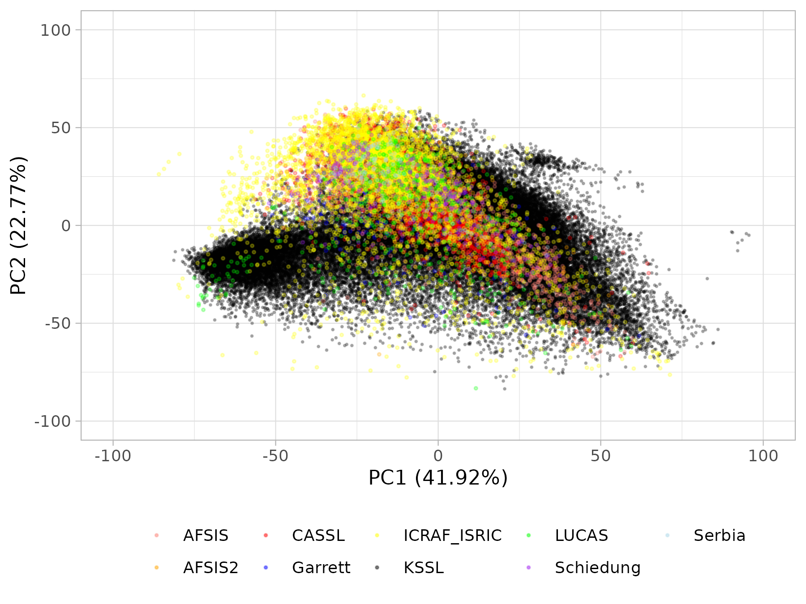

### Description

This is a repository for all data import development work for the [Soil
Spectroscopy for Global Good](https://soilspectroscopy.org) project.

The full documentation is available in the [OSSL
manual](https://soilspectroscopy.github.io/ossl-manual/).

The OSSL includes the USDA NRCS NCSS-KSSL MIR & VNIR libraries (labeled
[KSSL](dataset/KSSL)), ICRAF-ISRIC MIR & VNIR libraries (labeled
[ICRAF\_ISRIC](dataset/ICRAF_ISRIC)), AFSIS I & AFSIS II MIR libraries
(labeled [AFIS1](dataset/AFIS1) & [AFSIS2](dataset/AFSIS2)), ESDAC LUCAS
VNIR library (labeled [LUCAS](dataset/LUCAS)), ETH Congo Basin MIR
library (labeled [CASSL](dataset/CASSL)), the Scion Research NZ MIR
library (labeled [Garrett](dataset/Garrett)), and the University of
Zurich permafrost MIR library (labeled [Schiedung)](dataset/Schiedung)).
The KSSL database represents a snapshot from July 2022.

-   Spectral diversity  
    

-   MIR locations  
    

-   VisNIR locations  
    

### Importing new datasets

-   Add dataset following the [project
    codes](https://soilspectroscopy.github.io/ossl-manual/database.html)
    to the `/dataset/` folder;
-   Document import steps / produce four standard tables, write outputs
    to `/ossl` folder;
-   Test dataset properties by plotting distributions, detect possible
    artifacts (see an
    [example](https://soilspectroscopy.github.io/ossl-manual/database.html#oc_usda.calc_wpct));
-   After quality-control, all data is imported / bind to the global
    OSSL DB;
-   Script `test_bind.R` contains all steps used to produce the final
    output;

NOTE: for more advanced uses of the soil spectral libraries **we advise
to contact the original data producers** especially to get help with
using, extending, and improving the original SSL data. Note: we **do NOT
provide support with issues that my arise with the original soil
spectral libraries**.

### Using the OSSL

To load the complete analysis-ready dataset (486MB) as a single table in
R and run predictive modeling please use:

    rm.ossl = readRDS(url("http://s3.us-east-1.wasabisys.com/soilspectroscopy/ossl_import/rm.ossl_v1.rds", "rb"))
    dim(rm.ossl)
    ## 152,146 obs. of 2962 variables

The compilation currently contains training MIR (70k) and VisNIR (70k)
spectral scans + soil calibration data (51,732 unique locations).

### Other tools and repositories

We are fitting [globally-applicable prediction
models](https://github.com/soilspectroscopy/ossl-models) to enable free
and open production of primary soil data. [The output
models](https://doi.org/10.5281/zenodo.5759693) are available via the S3
cloud-service and/or API under CC-BY license. If you fit your own models
and/or if you are interested in contributing to this project please
contact us and help us make better open soil data for global good.

If you follow some minimum requirements e.g. Docker image
specifications; [open data
license](https://opendefinition.org/licenses/) with a DOI as in
<https://doi.org/10.5281/zenodo.5759693>), we can host your models so
other users can make use of your models and cite/attribute them in the
literature. For more info on how to contribute refer to:
<https://soilspectroscopy.github.io/ossl-manual/>.

If you notice a bug or artifact please register an issue and we will try
to fix asap.

-   OSSL documentation:
    <https://soilspectroscopy.github.io/ossl-manual/>;
-   OSSL Explorer: <https://explorer.soilspectroscopy.org>;
-   OSSL Engine: <https://engine.soilspectroscopy.org>;
-   Model fitting repository:
    <https://github.com/soilspectroscopy/ossl-models>;
