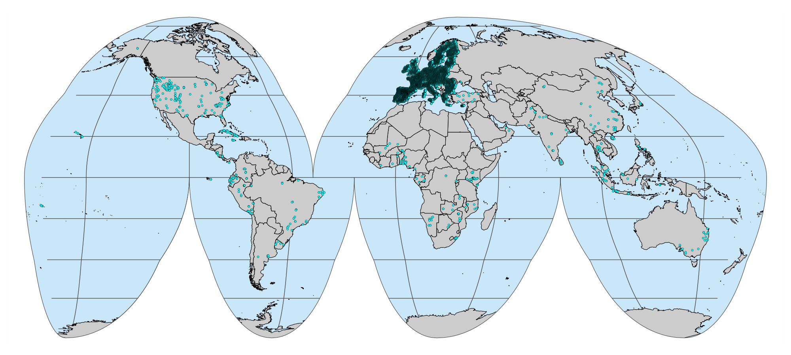

[](https://doi.org/10.5281/zenodo.5759693)

[](https://soilspectroscopy.org/)

[](http://creativecommons.org/licenses/by-sa/4.0/)

This is a repository for data import development of the [Soil
Spectroscopy for Global Good](https://soilspectroscopy.org) project.

The full documentation is available in the [OSSL
manual](https://soilspectroscopy.github.io/ossl-manual/).

The OSSL is distributed through
[APIs](https://soilspectroscopy.github.io/ossl-manual/#ossl-api),
[MongoDB](https://soilspectroscopy.github.io/ossl-manual/#ossl-mongodb),
and as a Google Cloud storage bucket: two file formats are available:
**compressed csv** (`.csv.gz`) and **qs** (`qs R package`).

**Note: the datasets in the public bucket can be updated without
notice.**

Use the following URLs to load the whole OSSL levels:

    ## Compressed csv
    https://storage.googleapis.com/soilspec4gg-public/ossl_all_L0_v1.2.csv.gz
    https://storage.googleapis.com/soilspec4gg-public/ossl_all_L1_v1.2.csv.gz

    ## qs format (preferred on R)
    https://storage.googleapis.com/soilspec4gg-public/ossl_all_L0_v1.2.qs
    https://storage.googleapis.com/soilspec4gg-public/ossl_all_L1_v1.2.qs

Use these alternative URLs to load the OSSL as separate files:

    ## Compressed csv
    https://storage.googleapis.com/soilspec4gg-public/ossl_soilsite_L0_v1.2.csv.gz
    https://storage.googleapis.com/soilspec4gg-public/ossl_soillab_L0_v1.2.csv.gz
    https://storage.googleapis.com/soilspec4gg-public/ossl_soillab_L1_v1.2.csv.gz
    https://storage.googleapis.com/soilspec4gg-public/ossl_mir_L0_v1.2.csv.gz
    https://storage.googleapis.com/soilspec4gg-public/ossl_visnir_L0_v1.2.csv.gz

    ## qs format (preferred on R)
    https://storage.googleapis.com/soilspec4gg-public/ossl_soilsite_L0_v1.2.qs
    https://storage.googleapis.com/soilspec4gg-public/ossl_soillab_L0_v1.2.qs
    https://storage.googleapis.com/soilspec4gg-public/ossl_soillab_L1_v1.2.qs
    https://storage.googleapis.com/soilspec4gg-public/ossl_mir_L0_v1.2.qs
    https://storage.googleapis.com/soilspec4gg-public/ossl_visnir_L0_v1.2.qs

Example with R:

``` r
## Packages
library("tidyverse")
library("curl")
library("qs")

## Separate files
soil <-  "https://storage.googleapis.com/soilspec4gg-public/ossl_soillab_L1_v1.2.qs"
soil <- curl_fetch_memory(soil)
soil <- qdeserialize(soil$content)

mir <- "https://storage.googleapis.com/soilspec4gg-public/ossl_mir_L0_v1.2.qs"
mir <- curl_fetch_memory(mir)
mir <- qdeserialize(mir$content)

## Join
ossl <- left_join(mir, soil, by = c("dataset.code_ascii_txt", "id.layer_uuid_txt"))
```

### Importing new datasets

-   Define a dataset code following the format in [manual project
    codes](https://soilspectroscopy.github.io/ossl-manual/database.html)
    and create a new folder inside the `dataset/` folder;
-   Document import steps in the `README.Rmd` by producing four standard
    tables: soilsite, soillab, mir, and visnir. Follow this
    [example](dataset/CASSL);
-   Follow the table formats described in the example or summarized in
    [ossl\_level0\_names\_soilsite](out/ossl_level0_names_soilsite.csv),
    [ossl\_level0\_names\_soillab](out/ossl_level0_names_soillab.csv),
    [ossl\_level0\_names\_mir](out/ossl_level0_names_mir.csv),
    [ossl\_level0\_names\_soilsite](out/ossl_level0_names_visnir.csv);
-   Make sure to run a quality analysis similar to the other datasets.
    This includes the assessment of the analytical, spatial, and
    spectral consistency;
-   We are currently running this task on an internal server, so you can
    host your dataset on a public repository (preferably
    [Zenodo](https://zenodo.org/)) or share privately (not preferred,
    <soilspec4gg@woodwellclimate.org>) and provide your importing steps
    in this github repository.
-   The final integration by joining and binding all the datasets is
    described in main `dataset/` folder and run on our internal server.

In order to maximize transparency, for now, we have decided to produce
two different levels for the OSSL database. `Level 0` takes into account
the original analytical methods employed in each dataset but tries to
initially fit them to our reference lists: [KSSL Guidance – Laboratory
Methods and
Manuals](https://www.nrcs.usda.gov/resources/guides-and-instructions/kssl-guidance)
(the method/procedures codes are archived in [this
file](out/kssl_procedures)) or [some ISO
standard](https://www.frontiersin.org/articles/10.3389/fenvs.2017.00041/full).
If a reference method does not fall in any previous method, then we
create a new variable sharing at least a common property name and unit.
The final harmonization takes place in the OSSL `Level 1`, where those
common properties sharing different methods can be converted to a target
method using some publicly available transformation rule, or in the
worst scenario, they are naively bind or kept separated to produce its
specific model in the OSSL engine. All the implementations are
documented in this github repository.

NOTE: for more advanced users of the soil spectral libraries **we advise
to contact the original data producers**, especially to get help with
using, extending, and improving the original SSL data. Note: we **do NOT
provide support with issues that my arise with the original soil
spectral libraries**.

### The OSSL database

The OSSL includes the USDA NRCS NCSS-KSSL MIR & VNIR libraries (labeled
[KSSL](dataset/KSSL)), ICRAF-ISRIC MIR & VNIR libraries (labeled
[ICRAF\_ISRIC](dataset/ICRAF_ISRIC)), AFSIS I & AFSIS II MIR libraries
(labeled [AFIS1](dataset/AFIS1) & [AFSIS2](dataset/AFSIS2)), ESDAC LUCAS
VNIR library (labeled [LUCAS](dataset/LUCAS)), ETH Congo Basin MIR
library (labeled [CASSL](dataset/CASSL)), the Scion Research NZ MIR
library (labeled [Garrett](dataset/Garrett)), the University of Zurich
permafrost MIR library (labeled [Schiedung](dataset/Schiedung)), and the
Serbian SSL from University of Novi Sad (labeled
[Serbia](dataset/Serbia)). The KSSL database represents a snapshot from
July 2022.

-   Spectral diversity  
    

-   MIR locations  
    

-   VisNIR locations  
    

### Other tools and repositories

We are fitting [globally-applicable prediction
models](https://github.com/soilspectroscopy/ossl-models) to enable free
and open production of primary soil data. [The output
models](https://doi.org/10.5281/zenodo.5759693) are available via the S3
cloud-service and/or API under CC-BY license. If you fit your own models
and/or if you are interested in contributing to this project please
contact us and help us make better open soil data for global good.

If you follow some minimum requirements e.g. Docker image
specifications; [open data
license](https://opendefinition.org/licenses/) with a DOI as in
<https://doi.org/10.5281/zenodo.5759693>), we can host your models so
other users can make use of your models and cite/attribute them in the
literature. For more info on how to contribute refer to:
<https://soilspectroscopy.github.io/ossl-manual/>.

If you notice a bug or artifact please register an issue and we will try
to fix asap.

-   OSSL documentation:
    <https://soilspectroscopy.github.io/ossl-manual/>;
-   OSSL Explorer: <https://explorer.soilspectroscopy.org>;
-   OSSL Engine: <https://engine.soilspectroscopy.org>;
-   Model fitting repository:
    <https://github.com/soilspectroscopy/ossl-models>;
