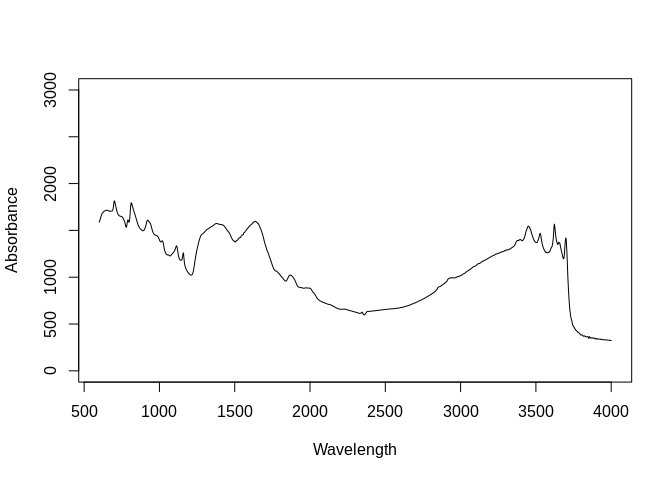
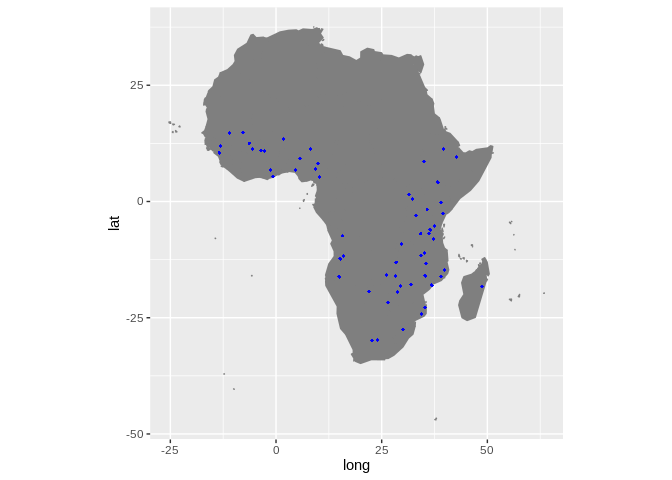

Dataset import: Africa Soil Information Service (AfSIS-I) SSL
================
Tomislav Hengl (<tom.hengl@opengeohub.org>) and Jonathan Sanderman
(<jsanderman@woodwellclimate.org>)
04 December, 2021


-   [AfSIS-1 inputs](#afsis-1-inputs)
-   [Data import](#data-import)
    -   [Soil site and laboratory data
        import:](#soil-site-and-laboratory-data-import)
        -   [Soil lab information](#soil-lab-information)
        -   [Soil site information](#soil-site-information)
    -   [Mid-infrared spectroscopy
        data](#mid-infrared-spectroscopy-data)
    -   [Quality control](#quality-control)
    -   [Distribution of points](#distribution-of-points)
-   [References](#references)

[](https://soilspectroscopy.org/)

[](http://creativecommons.org/licenses/by-sa/4.0/)

This work is licensed under a [Creative Commons Attribution-ShareAlike
4.0 International
License](http://creativecommons.org/licenses/by-sa/4.0/).

## AfSIS-1 inputs

Part of: <https://github.com/soilspectroscopy>  
Project: [Soil Spectroscopy for Global
Good](https://soilspectroscopy.org)  
Last update: 2021-12-04  
Dataset:
[AFSIS1.SSL](https://soilspectroscopy.github.io/ossl-manual/soil-spectroscopy-tools-and-users.html#afsis1.ssl)

Mid-Infrared Spectra (MIRS) from AfSIS1 Soil and Plant Spectroscopy
Laboratory Africa Soil Information Service (AfSIS) Phase I 2009-2013.
Described in detail in [Towett et al.](#ref-towett2015total)
([2015](#ref-towett2015total)) and [Vagen et al.](#ref-Vagen_2020)
([2020](#ref-Vagen_2020)).

The dataset has two versions one published via the [World Agroforestry
website](https://doi.org/10.34725/DVN/QXCWP1), one via AWS
(<https://registry.opendata.aws/afsis/>). A copy of AfSIS SSL data is
also available via
<https://github.com/laura-summerauer/ssl-central-africa>.

Directory/folder path

``` r
dir = "/mnt/soilspec4gg/ossl/dataset/AFSIS/"
```

## Data import

### Soil site and laboratory data import:

``` r
afsis1.xy = read.csv("/mnt/diskstation/data/Soil_points/AF/AfSIS_SSL/2009-2013/Georeferences/georeferences.csv")
afsis1.xy$observation.date.begin_iso.8601_yyyy.mm.dd = "2011-12-01"
afsis1.xy$observation.date.end_iso.8601_yyyy.mm.dd = "2013-12-01"
afsis1.lst = list.files("/mnt/diskstation/data/Soil_points/AF/AfSIS_SSL/2009-2013/Wet_Chemistry", pattern=glob2rx("*.csv$"), full.names = TRUE, recursive = TRUE)
afsis1.hor = plyr::rbind.fill(lapply(afsis1.lst, read.csv))
tansis.xy = read.csv("/mnt/diskstation/data/Soil_points/AF/AfSIS_SSL/tansis/Georeferences/georeferences.csv")
#summary(tansis.xy$Sampling.date)
tansis.xy$observation.date.begin_iso.8601_yyyy.mm.dd = "2018-01-01"
tansis.xy$observation.date.end_iso.8601_yyyy.mm.dd = "2018-12-01"
tansis.lst = list.files("/mnt/diskstation/data/Soil_points/AF/AfSIS_SSL/tansis/Wet_Chemistry", pattern=glob2rx("*.csv$"), full.names = TRUE, recursive = TRUE)
tansis.hor = plyr::rbind.fill(lapply(tansis.lst, read.csv))
afsis1t.df = plyr::rbind.fill(list(plyr::join(afsis1.hor, afsis1.xy, by="SSN"), plyr::join(tansis.hor, tansis.xy, by="SSN")))
afsis1t.df$layer.upper.depth_usda_cm = ifelse(afsis1t.df$Depth=="sub", 20, 0)
afsis1t.df$layer.lower.depth_usda_cm = ifelse(afsis1t.df$Depth=="sub", 50, 20)
afsis1t.df$layer.sequence_usda_uint16 = ifelse(afsis1t.df$Depth=="sub", 2, 1)
afsis1t.df$oc_usda.calc_wpct = rowMeans(afsis1t.df[,c("C...Org", "X.C")], na.rm=TRUE) 
afsis1t.df$n.tot_usda.4h2_wpct = rowMeans(afsis1t.df[,c("Total.nitrogen", "X.N")], na.rm=TRUE) 
afsis1t.df$ph.h2o_usda.4c1_index = rowMeans(afsis1t.df[,c("PH", "pH")], na.rm=TRUE)
## remove empty columns:
afsis1t.df = afsis1t.df[,-which(sapply(afsis1t.df, function(i){sum(!is.na(i))<100}))]
```

#### Soil lab information

Harmonization function:

``` r
in.name = c("Psa.w4clay", "Psa.w4silt", "Psa.w4sand", "ExAc",
            "M3.P", "M3.Zn", "M3.Ca", "M3.Mg", "M3.Na", "M3.K", "EC", "oc_usda.calc_wpct", 
            "n.tot_usda.4h2_wpct", "ph.h2o_usda.4c1_index", "layer.upper.depth_usda_cm", 
            "layer.lower.depth_usda_cm", "layer.sequence_usda_uint16", "Latitude", "Longitude",
            "Scientist")
#in.name[which(!in.name %in% names(afsis1t.df))]
afsis1.yw = as.data.frame(afsis1t.df[,in.name])
out.name = c("clay.tot_usda.3a1_wpct", "silt.tot_usda.3a1_wpct",
             "sand.tot_usda.3a1_wpct", "al.kcl_usda.4b3_cmolkg", "p.ext_usda.4d6_mgkg", 
             "zn.meh3_usda.4d6_mgkg", "ca.meh3_usda.4d6_mgkg", "mg.meh3_usda.4d6_mgkg",
             "na.meh3_usda.4d6_mgkg", "k.meh3_usda.4d6_mgkg", "ec.w_usda.4f1_dsm", "oc_usda.calc_wpct", 
            "n.tot_usda.4h2_wpct", "ph.h2o_usda.4c1_index", "layer.upper.depth_usda_cm", 
            "layer.lower.depth_usda_cm", "layer.sequence_usda_uint16", "latitude_wgs84_dd", "longitude_wgs84_dd",
            "surveyor.title_utf8_txt")
## compare values
summary(afsis1.yw$Latitude)
```

    ##    Min. 1st Qu.  Median    Mean 3rd Qu.    Max.    NA's 
    ## -29.981 -15.953  -6.860  -5.013   7.028  14.880     167

``` r
fun.lst = as.list(rep("x*1", length(in.name)))
fun.lst[[which(in.name=="Scientist")]] = "paste(x)"
## save translation rules:
#View(data.frame(in.name, out.name, unlist(fun.lst)))
write.csv(data.frame(in.name, out.name, unlist(fun.lst)), "./afsis1_soilab_transvalues.csv")
afsis1.soil = transvalues(afsis1.yw, out.name, in.name, fun.lst)
afsis1.soil$id.layer_local_c = afsis1t.df$SSN
#summary(duplicated(afsis1.soil$id.layer_local_c))
```

Exporting the table:

``` r
afsis1.soil$id.layer_uuid_c = openssl::md5(make.unique(paste0(afsis1.soil$id.layer_local_c)))
afsis1.soil$sample.doi_idf_c = "10.1016/j.geodrs.2015.06.002"
afsis1.soil$sample.contact.name_utf8_txt = "Keith Shepherd"
afsis1.soil$sample.contact.email_ietf_email = "afsis.info@africasoils.net"
x.na = soilab.name[which(!soilab.name %in% names(afsis1.soil))]
if(length(x.na)>0){ for(i in x.na){ afsis1.soil[,i] <- NA } }
soilab.rds = paste0(dir, "ossl_soillab_v1.rds")
if(!file.exists(soilab.rds)){
  saveRDS.gz(afsis1.soil[,soilab.name], soilab.rds)
}
```

#### Soil site information

``` r
afsis1.site = as.data.frame(afsis1.soil[,c("layer.upper.depth_usda_cm", "layer.lower.depth_usda_cm", 
                                           "layer.sequence_usda_uint16", "latitude_wgs84_dd", "longitude_wgs84_dd",
                                           "surveyor.title_utf8_txt", "id.layer_local_c")])
afsis1.site$id.location_olc_c = olctools::encode_olc(afsis1.site$latitude_wgs84_dd, afsis1.site$longitude_wgs84_dd, 10)
```

Exporting the table:

``` r
afsis1.site$id.layer_uuid_c = openssl::md5(make.unique(paste0(afsis1.site$id.layer_local_c)))
afsis1.site$observation.ogc.schema.title_ogc_txt = 'Open Soil Spectroscopy Library'
afsis1.site$observation.ogc.schema_idn_url = 'https://soilspectroscopy.github.io'
afsis1.site$dataset.title_utf8_txt = "Africa Soil Information Service (AfSIS-1)"
afsis1.site$surveyor.address_utf8_txt = "ICRAF, PO Box 30677, Nairobi, 00100, Kenya"
afsis1.site$dataset.code_ascii_c = "AFSIS1.SSL"
afsis1.site$location.method_any_c = "GPS"
afsis1.site$location.error_any_m = 30
afsis1.site$observation.date.begin_iso.8601_yyyy.mm.dd = as.Date("1996-11-01")
afsis1.site$observation.date.end_iso.8601_yyyy.mm.dd = as.Date("2006-11-01")
afsis1.site$dataset.license.title_ascii_txt = "ODC Open Database License" 
afsis1.site$dataset.license.address_idn_url = "https://opendatacommons.org/licenses/odbl/"
afsis1.site$dataset.address_idn_url = "ICRAF, PO Box 30677, Nairobi, 00100, Kenya"
afsis1.site$dataset.owner_utf8_txt = "the World Agroforestry Centre (ICRAF), Crop Nutrition Laboratory Services Ltd. (CROPNUTS), and Rothamsted Research (RRES)"
afsis1.site$dataset.contact.name_utf8_txt = "Keith Shepherd"
afsis1.site$dataset.contact_ietf_email = "afsis.info@africasoils.net"
x.na = site.name[which(!site.name %in% names(afsis1.site))]
if(length(x.na)>0){ for(i in x.na){ afsis1.site[,i] <- NA } }
soilsite.rds = paste0(dir, "ossl_soilsite_v1.rds")
if(!file.exists(soilsite.rds)){
  saveRDS.gz(afsis1.site[,site.name], soilsite.rds)
}
```

### Mid-infrared spectroscopy data

Mid-infrared (MIR) soil spectroscopy raw data
(<https://doi.org/10.34725/DVN/QXCWP1>):

``` r
mir.afsis1.lst = list.files(paste0(dir, "afsis_mir_2013"), pattern=glob2rx("*.csv$"), full.names = TRUE, recursive = TRUE)
afsis1.mir = plyr::rbind.fill(lapply(mir.afsis1.lst, vroom::vroom))
```

    ## Rows: 1,275
    ## Columns: 1,753
    ## Delimiter: ","
    ## chr [   3]: SSN, Depth, Country
    ## dbl [1750]: Num, m4001.6, m3999.7, m3997.8, m3995.8, m3993.9, m3992, m3990, m3988.1, m3986.2, m3984.3, m3982.3, m3980.4, m3978.5, m3976.5, m3974.6, m3...
    ## 
    ## Use `spec()` to retrieve the guessed column specification
    ## Pass a specification to the `col_types` argument to quiet this message

    ## Rows: 938
    ## Columns: 1,753
    ## Delimiter: ","
    ## chr [   3]: SSN, Depth, Country
    ## dbl [1750]: Num, m4001.6, m3999.7, m3997.8, m3995.8, m3993.9, m3992, m3990, m3988.1, m3986.2, m3984.3, m3982.3, m3980.4, m3978.5, m3976.5, m3974.6, m3...
    ## 
    ## Use `spec()` to retrieve the guessed column specification
    ## Pass a specification to the `col_types` argument to quiet this message

    ## Rows: 304
    ## Columns: 1,753
    ## Delimiter: ","
    ## chr [   3]: SSN, Depth, Country
    ## dbl [1750]: Num, m4001.6, m3999.7, m3997.8, m3995.8, m3993.9, m3992, m3990, m3988.1, m3986.2, m3984.3, m3982.3, m3980.4, m3978.5, m3976.5, m3974.6, m3...
    ## 
    ## Use `spec()` to retrieve the guessed column specification
    ## Pass a specification to the `col_types` argument to quiet this message

    ## Rows: 318
    ## Columns: 1,753
    ## Delimiter: ","
    ## chr [   3]: SSN, Depth, Country
    ## dbl [1750]: Num, m4001.6, m3999.7, m3997.8, m3995.8, m3993.9, m3992, m3990, m3988.1, m3986.2, m3984.3, m3982.3, m3980.4, m3978.5, m3976.5, m3974.6, m3...
    ## 
    ## Use `spec()` to retrieve the guessed column specification
    ## Pass a specification to the `col_types` argument to quiet this message

    ## Rows: 1,161
    ## Columns: 1,753
    ## Delimiter: ","
    ## chr [   3]: SSN, Depth, Country
    ## dbl [1750]: Num, m4001.6, m3999.7, m3997.8, m3995.8, m3993.9, m3992, m3990, m3988.1, m3986.2, m3984.3, m3982.3, m3980.4, m3978.5, m3976.5, m3974.6, m3...
    ## 
    ## Use `spec()` to retrieve the guessed column specification
    ## Pass a specification to the `col_types` argument to quiet this message

    ## Rows: 949
    ## Columns: 1,753
    ## Delimiter: ","
    ## chr [   3]: SSN, Depth, Country
    ## dbl [1750]: Num, m4001.6, m3999.7, m3997.8, m3995.8, m3993.9, m3992, m3990, m3988.1, m3986.2, m3984.3, m3982.3, m3980.4, m3978.5, m3976.5, m3974.6, m3...
    ## 
    ## Use `spec()` to retrieve the guessed column specification
    ## Pass a specification to the `col_types` argument to quiet this message

    ## Rows: 587
    ## Columns: 1,753
    ## Delimiter: ","
    ## chr [   3]: SSN, Depth, Country
    ## dbl [1750]: Num, m4001.6, m3999.7, m3997.8, m3995.8, m3993.9, m3992, m3990, m3988.1, m3986.2, m3984.3, m3982.3, m3980.4, m3978.5, m3976.5, m3974.6, m3...
    ## 
    ## Use `spec()` to retrieve the guessed column specification
    ## Pass a specification to the `col_types` argument to quiet this message

    ## Rows: 862
    ## Columns: 1,753
    ## Delimiter: ","
    ## chr [   3]: SSN, Depth, Country
    ## dbl [1750]: Num, m4001.6, m3999.7, m3997.8, m3995.8, m3993.9, m3992, m3990, m3988.1, m3986.2, m3984.3, m3982.3, m3980.4, m3978.5, m3976.5, m3974.6, m3...
    ## 
    ## Use `spec()` to retrieve the guessed column specification
    ## Pass a specification to the `col_types` argument to quiet this message

    ## Rows: 631
    ## Columns: 1,753
    ## Delimiter: ","
    ## chr [   3]: SSN, Depth, Country
    ## dbl [1750]: Num, m4001.6, m3999.7, m3997.8, m3995.8, m3993.9, m3992, m3990, m3988.1, m3986.2, m3984.3, m3982.3, m3980.4, m3978.5, m3976.5, m3974.6, m3...
    ## 
    ## Use `spec()` to retrieve the guessed column specification
    ## Pass a specification to the `col_types` argument to quiet this message

    ## Rows: 640
    ## Columns: 1,753
    ## Delimiter: ","
    ## chr [   3]: SSN, Depth, Country
    ## dbl [1750]: Num, m4001.6, m3999.7, m3997.8, m3995.8, m3993.9, m3992, m3990, m3988.1, m3986.2, m3984.3, m3982.3, m3980.4, m3978.5, m3976.5, m3974.6, m3...
    ## 
    ## Use `spec()` to retrieve the guessed column specification
    ## Pass a specification to the `col_types` argument to quiet this message

    ## Rows: 1,260
    ## Columns: 1,753
    ## Delimiter: ","
    ## chr [   3]: SSN, Depth, Country
    ## dbl [1750]: Num, m4001.6, m3999.7, m3997.8, m3995.8, m3993.9, m3992, m3990, m3988.1, m3986.2, m3984.3, m3982.3, m3980.4, m3978.5, m3976.5, m3974.6, m3...
    ## 
    ## Use `spec()` to retrieve the guessed column specification
    ## Pass a specification to the `col_types` argument to quiet this message

    ## Rows: 1,910
    ## Columns: 1,753
    ## Delimiter: ","
    ## chr [   3]: SSN, Depth, Country
    ## dbl [1750]: Num, m4001.6, m3999.7, m3997.8, m3995.8, m3993.9, m3992, m3990, m3988.1, m3986.2, m3984.3, m3982.3, m3980.4, m3978.5, m3976.5, m3974.6, m3...
    ## 
    ## Use `spec()` to retrieve the guessed column specification
    ## Pass a specification to the `col_types` argument to quiet this message

    ## Rows: 316
    ## Columns: 1,753
    ## Delimiter: ","
    ## chr [   3]: SSN, Depth, Country
    ## dbl [1750]: Num, m4001.6, m3999.7, m3997.8, m3995.8, m3993.9, m3992, m3990, m3988.1, m3986.2, m3984.3, m3982.3, m3980.4, m3978.5, m3976.5, m3974.6, m3...
    ## 
    ## Use `spec()` to retrieve the guessed column specification
    ## Pass a specification to the `col_types` argument to quiet this message

    ## Rows: 1,572
    ## Columns: 1,753
    ## Delimiter: ","
    ## chr [   3]: SSN, Depth, Country
    ## dbl [1750]: Num, m4001.6, m3999.7, m3997.8, m3995.8, m3993.9, m3992, m3990, m3988.1, m3986.2, m3984.3, m3982.3, m3980.4, m3978.5, m3976.5, m3974.6, m3...
    ## 
    ## Use `spec()` to retrieve the guessed column specification
    ## Pass a specification to the `col_types` argument to quiet this message

    ## Rows: 727
    ## Columns: 1,753
    ## Delimiter: ","
    ## chr [   3]: SSN, Depth, Country
    ## dbl [1750]: Num, m4001.6, m3999.7, m3997.8, m3995.8, m3993.9, m3992, m3990, m3988.1, m3986.2, m3984.3, m3982.3, m3980.4, m3978.5, m3976.5, m3974.6, m3...
    ## 
    ## Use `spec()` to retrieve the guessed column specification
    ## Pass a specification to the `col_types` argument to quiet this message

    ## Rows: 2,081
    ## Columns: 1,753
    ## Delimiter: ","
    ## chr [   3]: SSN, Depth, Country
    ## dbl [1750]: Num, m4001.6, m3999.7, m3997.8, m3995.8, m3993.9, m3992, m3990, m3988.1, m3986.2, m3984.3, m3982.3, m3980.4, m3978.5, m3976.5, m3974.6, m3...
    ## 
    ## Use `spec()` to retrieve the guessed column specification
    ## Pass a specification to the `col_types` argument to quiet this message

    ## Rows: 550
    ## Columns: 1,753
    ## Delimiter: ","
    ## chr [   3]: SSN, Depth, Country
    ## dbl [1750]: Num, m4001.6, m3999.7, m3997.8, m3995.8, m3993.9, m3992, m3990, m3988.1, m3986.2, m3984.3, m3982.3, m3980.4, m3978.5, m3976.5, m3974.6, m3...
    ## 
    ## Use `spec()` to retrieve the guessed column specification
    ## Pass a specification to the `col_types` argument to quiet this message

    ## Rows: 1,276
    ## Columns: 1,753
    ## Delimiter: ","
    ## chr [   3]: SSN, Depth, Country
    ## dbl [1750]: Num, m4001.6, m3999.7, m3997.8, m3995.8, m3993.9, m3992, m3990, m3988.1, m3986.2, m3984.3, m3982.3, m3980.4, m3978.5, m3976.5, m3974.6, m3...
    ## 
    ## Use `spec()` to retrieve the guessed column specification
    ## Pass a specification to the `col_types` argument to quiet this message

    ## Rows: 900
    ## Columns: 1,753
    ## Delimiter: ","
    ## chr [   3]: SSN, Depth, Country
    ## dbl [1750]: Num, m4001.6, m3999.7, m3997.8, m3995.8, m3993.9, m3992, m3990, m3988.1, m3986.2, m3984.3, m3982.3, m3980.4, m3978.5, m3976.5, m3974.6, m3...
    ## 
    ## Use `spec()` to retrieve the guessed column specification
    ## Pass a specification to the `col_types` argument to quiet this message

``` r
dim(afsis1.mir)
```

    ## [1] 18257  1753

``` r
## 18257  1753
## an independent copy:
#afsis1.mir2 = vroom::vroom("/mnt/diskstation/data/ossl/dataset/CASSL/spectra_data/afsis_sectra.csv")
#str(which(!afsis1.mir2$sample_id %in% afsis1.mir$SSN))
```

Add the [Universal Unique
Identifier](https://cran.r-project.org/web/packages/uuid/) (UUI):

``` r
afsis1.mir$id.scan_uuid_c = openssl::md5(make.unique(paste0("AFSIS.SSL", afsis1.mir$SSN)))
```

Resampling the MIR spectra from the original window size to 2 cm-1 in
`afsis1.abs`. This operation can be time-consuming:

``` r
sel.abs = names(afsis1.mir)[grep("^m", names(afsis1.mir))]
## 1749
afsis1.mir$id.scan_local_c = paste(afsis1.mir$Country, afsis1.mir$Num, sep="_")
afsis1.abs = afsis1.mir[,c("id.scan_uuid_c", "SSN", "id.scan_local_c", sel.abs)]
na.lst = rowSums(afsis1.abs[,sel.abs])
str(which(is.na(na.lst)))
```

    ##  int [1:7] 2064 2193 8303 8613 15356 17318 18164

``` r
## several incomplete scans
afsis1.abs = afsis1.abs[-which(is.na(na.lst)),]
dim(afsis1.abs)
```

    ## [1] 18250  1752

``` r
wav.mir = as.numeric(gsub("m", "", sel.abs)) # Get wavelength only
#summary(wav.mir)
# Creating a matrix with only spectral values to resample it
afsis1.mir.spec = as.matrix(afsis1.abs[,sel.abs])
colnames(afsis1.mir.spec) = wav.mir
rownames(afsis1.mir.spec) = afsis1.abs$id.scan_uuid_c
## remove values out of range
afsis1.mir = prospectr::resample(afsis1.mir.spec, wav.mir, seq(600, 4000, 2)) 
## Error in splinefun(x = wav, y = x) : zero non-NA points
afsis1.mir = as.data.frame(afsis1.mir)
mir.n = paste0("scan_mir.", seq(600, 4000, 2), "_abs")
colnames(afsis1.mir) = mir.n
#dim(afsis1.mir)
#summary(afsis1.mir$scan_mir.602_abs)
```

Remove values out of range:

``` r
afsis1.mir.f = parallel::mclapply(afsis1.mir, function(j){ round(ifelse(j<0, NA, ifelse(j>3, NA, j))*1000) }, mc.cores=80)
afsis1.mir.f = as.data.frame(do.call(cbind, afsis1.mir.f))
#str(names(afsis1.mir.f))
afsis1.mir.f$id.scan_uuid_c = rownames(afsis1.mir)
```

Plotting MIR spectra to see if there are still maybe negative values in
the table:

``` r
matplot(y=as.vector(t(afsis1.mir.f[250,mir.n])), x=seq(600, 4000, 2),
        ylim = c(0,3000),
        type = 'l', 
        xlab = "Wavelength", 
        ylab = "Absorbance"
        )
```

<!-- -->

Export final MIR table:

``` r
afsis1.mir.f$id.layer_local_c = plyr::join(afsis1.mir.f["id.scan_uuid_c"], afsis1.abs[c("id.scan_uuid_c","SSN")])$SSN
```

    ## Joining by: id.scan_uuid_c

``` r
afsis1.mir.f$id.scan_local_c = plyr::join(afsis1.mir.f["id.scan_uuid_c"], afsis1.abs[c("id.scan_uuid_c","id.scan_local_c")])$id.scan_local_c
```

    ## Joining by: id.scan_uuid_c

``` r
afsis1.mir.f$id.layer_uuid_c = plyr::join(afsis1.mir.f["id.layer_local_c"], afsis1.soil[c("id.layer_local_c","id.layer_uuid_c")], match="first")$id.layer_uuid_c
```

    ## Joining by: id.layer_local_c

``` r
summary(is.na(afsis1.mir.f$id.layer_uuid_c))
```

    ##    Mode   FALSE    TRUE 
    ## logical    1904   16346

``` r
## 16346 without soil data
afsis1.mir.f$model.name_utf8_txt = "Bruker Tensor 27/HTs -XT_FT-IR"
afsis1.mir.f$model.code_any_c = "Bruker_Tensor_27.HTS.XT"
afsis1.mir.f$method.light.source_any_c = ""
afsis1.mir.f$method.preparation_any_c = ""
afsis1.mir.f$scan.file_any_c = ""
afsis1.mir.f$scan.date.begin_iso.8601_yyyy.mm.dd = as.Date("2009-01-01")
afsis1.mir.f$scan.date.end_iso.8601_yyyy.mm.dd = as.Date("2013-12-01")
afsis1.mir.f$scan.license.title_ascii_txt = "CC-BY"
afsis1.mir.f$scan.license.address_idn_url = "https://creativecommons.org/licenses/by/4.0/"
afsis1.mir.f$scan.doi_idf_c = "10.34725/DVN/QXCWP1"
afsis1.mir.f$scan.contact.name_utf8_txt = "Vagen, Tor-Gunnar (World Agroforestry)"
afsis1.mir.f$scan.contact.email_ietf_email = "afsis.info@africasoils.net"
#summary(is.na(afsis1.mir.f$id.scan_uuid_c))
```

Save to RDS file:

``` r
x.na = mir.name[which(!mir.name %in% names(afsis1.mir.f))]
if(length(x.na)>0){ for(i in x.na){ afsis1.mir.f[,i] <- NA } }
str(afsis1.mir.f[,mir.name[1:24]])
```

    ## 'data.frame':    18250 obs. of  24 variables:
    ##  $ id.scan_uuid_c                     : chr  "c0f4186e7659ca7b15db15528714b7ee" "4d564b285db0022c6de8ebfbdf1b2263" "59f841538f62af90df8e0c2a842017fe" "1b535a05e418cbff180ccf0b7eee5d23" ...
    ##  $ id.scan_local_c                    : chr  "Angola_1" "Angola_2" "Angola_3" "Angola_4" ...
    ##  $ id.layer_uuid_c                    : chr  "31629cced41962b96bb4e36784738321" "185a8b487871e6ab2cbd6260c586985d" NA NA ...
    ##  $ id.layer_local_c                   : chr  "icr072246" "icr072247" "icr072248" "icr072249" ...
    ##  $ model.name_utf8_txt                : chr  "Bruker Tensor 27/HTs -XT_FT-IR" "Bruker Tensor 27/HTs -XT_FT-IR" "Bruker Tensor 27/HTs -XT_FT-IR" "Bruker Tensor 27/HTs -XT_FT-IR" ...
    ##  $ model.code_any_c                   : chr  "Bruker_Tensor_27.HTS.XT" "Bruker_Tensor_27.HTS.XT" "Bruker_Tensor_27.HTS.XT" "Bruker_Tensor_27.HTS.XT" ...
    ##  $ method.light.source_any_c          : chr  "" "" "" "" ...
    ##  $ method.preparation_any_c           : chr  "" "" "" "" ...
    ##  $ scan.file_any_c                    : chr  "" "" "" "" ...
    ##  $ scan.date.begin_iso.8601_yyyy.mm.dd: Date, format: "2009-01-01" "2009-01-01" "2009-01-01" "2009-01-01" ...
    ##  $ scan.date.end_iso.8601_yyyy.mm.dd  : Date, format: "2013-12-01" "2013-12-01" "2013-12-01" "2013-12-01" ...
    ##  $ scan.license.title_ascii_txt       : chr  "CC-BY" "CC-BY" "CC-BY" "CC-BY" ...
    ##  $ scan.license.address_idn_url       : chr  "https://creativecommons.org/licenses/by/4.0/" "https://creativecommons.org/licenses/by/4.0/" "https://creativecommons.org/licenses/by/4.0/" "https://creativecommons.org/licenses/by/4.0/" ...
    ##  $ scan.doi_idf_c                     : chr  "10.34725/DVN/QXCWP1" "10.34725/DVN/QXCWP1" "10.34725/DVN/QXCWP1" "10.34725/DVN/QXCWP1" ...
    ##  $ scan.contact.name_utf8_txt         : chr  "Vagen, Tor-Gunnar (World Agroforestry)" "Vagen, Tor-Gunnar (World Agroforestry)" "Vagen, Tor-Gunnar (World Agroforestry)" "Vagen, Tor-Gunnar (World Agroforestry)" ...
    ##  $ scan.contact.email_ietf_email      : chr  "afsis.info@africasoils.net" "afsis.info@africasoils.net" "afsis.info@africasoils.net" "afsis.info@africasoils.net" ...
    ##  $ scan_mir.600_abs                   : num  1528 1538 1586 1536 1531 ...
    ##  $ scan_mir.602_abs                   : num  1532 1544 1588 1536 1530 ...
    ##  $ scan_mir.604_abs                   : num  1532 1546 1591 1540 1531 ...
    ##  $ scan_mir.606_abs                   : num  1531 1547 1595 1547 1534 ...
    ##  $ scan_mir.608_abs                   : num  1531 1549 1599 1553 1539 ...
    ##  $ scan_mir.610_abs                   : num  1532 1554 1604 1561 1544 ...
    ##  $ scan_mir.612_abs                   : num  1532 1558 1609 1569 1548 ...
    ##  $ scan_mir.614_abs                   : num  1531 1562 1612 1577 1550 ...

``` r
mir.rds = paste0(dir, "ossl_mir_v1.rds")
if(!file.exists(mir.rds)){
  saveRDS.gz(afsis1.mir.f[,mir.name], mir.rds)
  #arrow::write_parquet(afsis1.mir.f[,mir.name], paste0(dir, "ossl_mir_v1.parquet"))
}
#rm(afsis1.mir.spec); rm(afsis1.mir); rm(afsis1.abs)
#gc()
```

### Quality control

Check if some points don’t have any spectral scans:

``` r
summary(is.na(afsis1.mir.f$id.scan_uuid_c))
```

    ##    Mode   FALSE 
    ## logical   18250

``` r
mis.r = afsis1.mir.f$id.layer_uuid_c %in% afsis1.site$id.layer_uuid_c
summary(mis.r)
```

    ##    Mode   FALSE    TRUE 
    ## logical   16346    1904

``` r
## some 16,346 scans have no soil data attached to it
```

### Distribution of points

We can plot an world map showing distribution of the sampling locations
for the AfSIS-1 points.

``` r
afsis1.map = NULL
library(maptools)
```

    ## Checking rgeos availability: TRUE

    ## 
    ## Attaching package: 'maptools'

    ## The following object is masked from 'package:Hmisc':
    ## 
    ##     label

``` r
data(wrld_simpl)
afr = wrld_simpl[wrld_simpl$REGION==2,]
mapWorld = borders(afr, colour = 'gray50', fill = 'gray50')
afsis1.map = ggplot() + mapWorld
afsis1.map = afsis1.map + geom_point(aes(x=afsis1.site$longitude_wgs84_dd, y=afsis1.site$latitude_wgs84_dd), color = 'blue', shape = 18, size=.9) + coord_fixed(ratio=1.1)
afsis1.map
```

    ## Warning: Removed 167 rows containing missing values (geom_point).

<!-- -->

Fig. 1: afsis1-ISRIC locations of sites across the globe.

Warning: Removed 167 rows containing missing values (geom\_point).

``` r
#save.image.pigz(file=paste0(dir, "afsis1.RData"), n.cores=32)
#rmarkdown::render("dataset/AFSIS/README.Rmd")
```

## References

<div id="refs" class="references csl-bib-body hanging-indent"
line-spacing="2">

<div id="ref-towett2015total" class="csl-entry">

Towett, E. K., Shepherd, K. D., Tondoh, J. E., Winowiecki, L. A.,
Lulseged, T., Nyambura, M., … Cadisch, G. (2015). Total elemental
composition of soils in sub-saharan africa and relationship with soil
forming factors. *Geoderma Regional*, *5*, 157–168.
doi:[10.1016/j.geodrs.2015.06.002](https://doi.org/10.1016/j.geodrs.2015.06.002)

</div>

<div id="ref-Vagen_2020" class="csl-entry">

Vagen, T.-G., Winowiecki, L. A., Desta, L., Tondoh, E. J., Weullow, E.,
Shepherd, K., & Sila, A. (2020). *<span class="nocase">Mid-Infrared
Spectra (MIRS) from ICRAF Soil and Plant Spectroscopy Laboratory: Africa
Soil Information Service (AfSIS) Phase I 2009-2013</span>*. World
Agroforestry - Research Data Repository.
doi:[10.34725/DVN/QXCWP1](https://doi.org/10.34725/DVN/QXCWP1)

</div>

</div>
