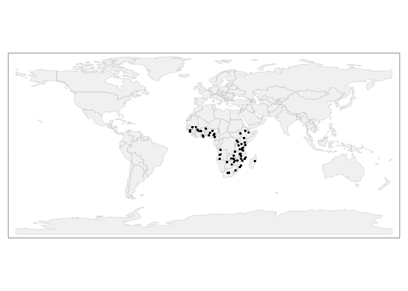
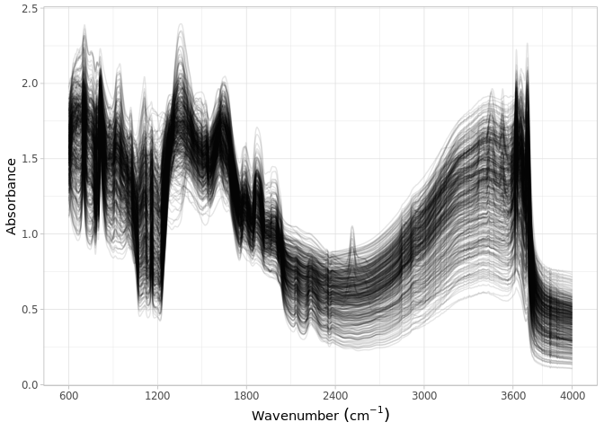

Dataset import: Africa Soil Information Service (AfSIS-I) SSL
================
Jose Lucas Safanelli (<jsafanelli@woodwellclimate.org>), Tomislav Hengl
(<tom.hengl@opengeohub.org>), Jonathan Sanderman
(<jsanderman@woodwellclimate.org>) -
07 December, 2022


-   [AfSIS-1 inputs](#afsis-1-inputs)
-   [Data import](#data-import)
    -   [Soil site information](#soil-site-information)
    -   [Soil lab information](#soil-lab-information)
    -   [Mid-infrared spectroscopy
        data](#mid-infrared-spectroscopy-data)
    -   [Quality control](#quality-control)
-   [References](#references)

[](https://soilspectroscopy.org/)

[](http://creativecommons.org/licenses/by-sa/4.0/)

This work is licensed under a [Creative Commons Attribution-ShareAlike
4.0 International
License](http://creativecommons.org/licenses/by-sa/4.0/).

## AfSIS-1 inputs

Part of: <https://github.com/soilspectroscopy>  
Project: [Soil Spectroscopy for Global
Good](https://soilspectroscopy.org)  
Last update: 2022-12-07  
Dataset:
[AFSIS1.SSL](https://soilspectroscopy.github.io/ossl-manual/soil-spectroscopy-tools-and-users.html#afsis1.ssl)

Mid-Infrared Spectra (MIRS) from AfSIS1 Soil and Plant Spectroscopy
Laboratory Africa Soil Information Service (AfSIS) Phase I 2009-2013.
Described in detail in [Towett et al.](#ref-towett2015total)
([2015](#ref-towett2015total)) and [Vagen et al.](#ref-Vagen_2020)
([2020](#ref-Vagen_2020)).

Input datasets:  
- `AfSIS_reference.csv`: Database with site and soil analytes;  
- `afsis_mir_2013`: folder with MIR soil spectral data;  
- `Calibration_MPA_NIR.csv`: VNIR soil spectral data;

The dataset has two versions one published via the [World Agroforestry
website](https://doi.org/10.34725/DVN/QXCWP1), one via AWS
(<https://registry.opendata.aws/afsis/>).

Directory/folder path

``` r
dir = "/mnt/soilspec4gg/ossl/dataset/AFSIS/"
tic()
```

## Data import

### Soil site information

``` r
# AfIS1 site data
afsis1.geo <- fread(paste0(dir, "/georeferences_2013.csv"))

afsis1.geo <- afsis1.geo %>%
  select(SSN, Latitude, Longitude, Depth, Scientist) %>%
  rename(id.layer_local_c = SSN,
         longitude.point_wgs84_dd = Longitude,
         latitude.point_wgs84_dd = Latitude,
         surveyor.title_utf8_txt = Scientist) %>%
  mutate(id.layer_local_c = as.character(id.layer_local_c),
         layer.upper.depth_usda_cm = ifelse(Depth == "top", 0, 20),
         layer.lower.depth_usda_cm = ifelse(Depth == "top", 20, 50),
         layer.sequence_usda_uint16 = ifelse(Depth == "top", 1, 2)) %>%
  mutate(observation.date.begin_iso.8601_yyyy.mm.dd = lubridate::ymd("2011-01-01"),
         observation.date.end_iso.8601_yyyy.mm.dd = lubridate::ymd("2013-12-31")) %>%
  select(id.layer_local_c, longitude.point_wgs84_dd, latitude.point_wgs84_dd,
         layer.sequence_usda_uint16, layer.upper.depth_usda_cm, layer.lower.depth_usda_cm,
         observation.date.begin_iso.8601_yyyy.mm.dd, observation.date.end_iso.8601_yyyy.mm.dd,
         surveyor.title_utf8_txt)

# Preparing dataset
afsis1.sitedata <- afsis1.geo %>%
  mutate(id.project_ascii_txt = "Africa Soil Information Service (AfSIS-1)",
         layer.texture_usda_txt = "",
         pedon.taxa_usda_txt = "",
         horizon.designation_usda_txt = "",
         longitude.county_wgs84_dd = NA,
         latitude.county_wgs84_dd = NA,
         location.point.error_any_m = 30,
         location.country_iso.3166_txt = "",
         observation.ogc.schema.title_ogc_txt = "Open Soil Spectroscopy Library",
         observation.ogc.schema_idn_url = "https://soilspectroscopy.github.io",
         surveyor.contact_ietf_email = "afsis.info@africasoils.net",
         surveyor.address_utf8_txt = "ICRAF, PO Box 30677, Nairobi, 00100, Kenya",
         dataset.title_utf8_txt = "Africa Soil Information Service (AfSIS-1)",
         dataset.owner_utf8_txt = "ICRAF, CROPNUTS, RRES",
         dataset.code_ascii_txt = "AFSIS1.SSL",
         dataset.address_idn_url = "https://www.isric.org/explore/ISRIC-collections",
         dataset.doi_idf_url = "https://doi.org/10.1016/j.geodrs.2015.06.002",
         dataset.license.title_ascii_txt = "ODC Open Database License",
         dataset.license.address_idn_url = "https://opendatacommons.org/licenses/odbl/",
         dataset.contact.name_utf8_txt = "Keith Shepherd",
         dataset.contact_ietf_email = "afsis.info@africasoils.net") %>%
  mutate(id.layer_uuid_txt = openssl::md5(paste0(dataset.code_ascii_txt, id.layer_local_c)),
         id.location_olc_txt = olctools::encode_olc(latitude.point_wgs84_dd, longitude.point_wgs84_dd, 10),
         .after = id.project_ascii_txt)

# Removing duplicates
afsis1.sitedata %>%
  group_by(id.layer_local_c) %>%
  summarise(repeats = n()) %>%
  group_by(repeats) %>%
  summarise(count = n())
```

    ## # A tibble: 1 × 2
    ##   repeats count
    ##     <int> <int>
    ## 1       1  1843

``` r
dupli.ids <- afsis1.sitedata %>%
  group_by(id.layer_local_c) %>%
  summarise(repeats = n()) %>%
  filter(repeats > 1) %>%
  pull(id.layer_local_c)

afsis1.sitedata <- afsis1.sitedata %>%
  filter(!(id.layer_local_c %in% dupli.ids))

# Removing rows without spatial coordinates
afsis1.sitedata <- afsis1.sitedata %>%
  filter(!(is.na(longitude.point_wgs84_dd) & is.na(latitude.point_wgs84_dd))) %>%
  mutate_at(vars(starts_with("id.")), as.character)

# Saving version to dataset root dir
site.qs = paste0(dir, "/ossl_soilsite_v1.2.qs")
qs::qsave(afsis1.sitedata, site.qs, preset = "high")
```

### Soil lab information

NOTE: The code chunk below this paragraph is hidden. Just run once for
getting the original names of soil properties, descriptions, data types,
and units. Run once and upload to Google Sheet for formatting and
integrating with the OSSL. Requires Google authentication.

<!-- ```{r, eval=FALSE, echo=TRUE} -->
<!-- # Getting soillab original variables -->
<!-- variables.file = readr::read_csv(paste0(dir, "/AfSIS_reference.csv")) -->
<!-- # They all have the same soil properties -->
<!-- soillab.names <- variables.file %>% -->
<!--   names(.) %>% -->
<!--   tibble(original_name = .) %>% -->
<!--   dplyr::mutate(table = 'AfSIS_reference.csv', .before = 1) %>% -->
<!--   dplyr::mutate(import = '', ossl_name = '', .after = original_name) %>% -->
<!--   dplyr::mutate(comment = '') -->
<!-- readr::write_csv(soillab.names, paste0(getwd(), "/afis_soillab_names.csv")) -->
<!-- # Uploading to google sheet -->
<!-- # FACT CIN folder. Get ID for soildata importing table -->
<!-- googledrive::drive_ls(as_id("0AHDIWmLAj40_Uk9PVA")) -->
<!-- OSSL.soildata.importing <- "19LeILz9AEnKVK7GK0ZbK3CCr2RfeP-gSWn5VpY8ETVM" -->
<!-- # Checking metadata -->
<!-- googlesheets4::as_sheets_id(OSSL.soildata.importing) -->
<!-- # Checking readme -->
<!-- googlesheets4::read_sheet(OSSL.soildata.importing, sheet = 'readme') -->
<!-- # Preparing soillab.names -->
<!-- upload <- dplyr::as_tibble(soillab.names) -->
<!-- # Uploading -->
<!-- googlesheets4::write_sheet(upload, ss = OSSL.soildata.importing, sheet = "AFSIS") -->
<!-- # Checking metadata -->
<!-- googlesheets4::as_sheets_id(OSSL.soildata.importing) -->
<!-- ``` -->

NOTE: The code chunk below this paragraph is hidden. Run once for
importing the transformation rules. The table can be edited online at
Google Sheets. A copy is downloaded to github for archiving.

<!-- ```{r soilab_download, include=FALSE, echo=FALSE, eval=FALSE} -->
<!-- # Downloading from google sheet -->
<!-- # FACT CIN folder id -->
<!-- listed.table <- googledrive::drive_ls(as_id("0AHDIWmLAj40_Uk9PVA"), -->
<!--                                       pattern = "OSSL_tab2_soildata_importing") -->
<!-- OSSL.soildata.importing <- listed.table[[1,"id"]] -->
<!-- # Checking metadata -->
<!-- googlesheets4::as_sheets_id(OSSL.soildata.importing) -->
<!-- # Preparing soillab.names -->
<!-- transvalues <- googlesheets4::read_sheet(OSSL.soildata.importing, sheet = "AFSIS") %>% -->
<!--   filter(import == TRUE) %>% -->
<!--   select(contains(c("table", "id", "original_name", "ossl_"))) -->
<!-- # Saving to folder -->
<!-- write_csv(transvalues, paste0(getwd(), "/OSSL_transvalues.csv")) -->
<!-- ``` -->

Reading AFSIS1-to-OSSL transformation values:

``` r
transvalues <- read_csv(paste0(getwd(), "/OSSL_transvalues.csv"))
knitr::kable(transvalues)
```

| table                | original\_name   | ossl\_abbrev | ossl\_method | ossl\_unit | ossl\_convert                                      | ossl\_name                 |
|:---------------------|:-----------------|:-------------|:-------------|:-----------|:---------------------------------------------------|:---------------------------|
| AfSIS\_reference.csv | ECd              | ec           | usda.a364    | ds.m       | ifelse(as.numeric(x) &lt; 0, NA, as.numeric(x)\*1) | ec\_usda.a364\_ds.m        |
| AfSIS\_reference.csv | m3.Al            | al.ext       | usda.a1056   | mg.kg      | ifelse(as.numeric(x) &lt; 0, NA, as.numeric(x)\*1) | al.ext\_usda.a1056\_mg.kg  |
| AfSIS\_reference.csv | m3.B             | b.ext        | mel3         | mg.kg      | ifelse(as.numeric(x) &lt; 0, NA, as.numeric(x)\*1) | b.ext\_mel3\_mg.kg         |
| AfSIS\_reference.csv | m3.Ca            | ca.ext       | usda.a1059   | mg.kg      | ifelse(as.numeric(x) &lt; 0, NA, as.numeric(x)\*1) | ca.ext\_usda.a1059\_mg.kg  |
| AfSIS\_reference.csv | m3.Cu            | cu.ext       | usda.a1063   | mg.kg      | ifelse(as.numeric(x) &lt; 0, NA, as.numeric(x)\*1) | cu.ext\_usda.a1063\_mg.kg  |
| AfSIS\_reference.csv | m3.Fe            | fe.ext       | usda.a1064   | mg.kg      | ifelse(as.numeric(x) &lt; 0, NA, as.numeric(x)\*1) | fe.ext\_usda.a1064\_mg.kg  |
| AfSIS\_reference.csv | m3.K             | k.ext        | usda.a1065   | mg.kg      | ifelse(as.numeric(x) &lt; 0, NA, as.numeric(x)\*1) | k.ext\_usda.a1065\_mg.kg   |
| AfSIS\_reference.csv | m3.Mg            | mg.ext       | usda.a1066   | mg.kg      | ifelse(as.numeric(x) &lt; 0, NA, as.numeric(x)\*1) | mg.ext\_usda.a1066\_mg.kg  |
| AfSIS\_reference.csv | m3.Mn            | mn.ext       | usda.a1067   | mg.kg      | ifelse(as.numeric(x) &lt; 0, NA, as.numeric(x)\*1) | mn.ext\_usda.a1067\_mg.kg  |
| AfSIS\_reference.csv | m3.Na            | na.ext       | usda.a1068   | mg.kg      | ifelse(as.numeric(x) &lt; 0, NA, as.numeric(x)\*1) | na.ext\_usda.a1068\_mg.kg  |
| AfSIS\_reference.csv | m3.P             | p.ext        | usda.a652    | mg.kg      | ifelse(as.numeric(x) &lt; 0, NA, as.numeric(x)\*1) | p.ext\_usda.a652\_mg.kg    |
| AfSIS\_reference.csv | m3.S             | s.ext        | mel3         | mg.kg      | ifelse(as.numeric(x) &lt; 0, NA, as.numeric(x)\*1) | s.ext\_mel3\_mg.kg         |
| AfSIS\_reference.csv | m3.Zn            | zn.ext       | usda.a1073   | mg.kg      | ifelse(as.numeric(x) &lt; 0, NA, as.numeric(x)\*1) | zn.ext\_usda.a1073\_mg.kg  |
| AfSIS\_reference.csv | pH               | ph.h2o       | usda.a268    | index      | ifelse(as.numeric(x) &lt; 0, NA, as.numeric(x)\*1) | ph.h2o\_usda.a268\_index   |
| AfSIS\_reference.csv | Total.Nitrogen   | n.tot        | usda.a623    | w.pct      | ifelse(as.numeric(x) &lt; 0, NA, as.numeric(x)\*1) | n.tot\_usda.a623\_w.pct    |
| AfSIS\_reference.csv | Total.Carbon     | c.tot        | usda.a622    | w.pct      | ifelse(as.numeric(x) &lt; 0, NA, as.numeric(x)\*1) | c.tot\_usda.a622\_w.pct    |
| AfSIS\_reference.csv | Acidified.Carbon | oc           | usda.c1059   | w.pct      | ifelse(as.numeric(x) &lt; 0, NA, as.numeric(x)\*1) | oc\_usda.c1059\_w.pct      |
| AfSIS\_reference.csv | Clay             | clay.tot     | usda.a334    | w.pct      | ifelse(as.numeric(x) &lt; 0, NA, as.numeric(x)\*1) | clay.tot\_usda.a334\_w.pct |
| AfSIS\_reference.csv | Silt             | silt.tot     | usda.c62     | w.pct      | ifelse(as.numeric(x) &lt; 0, NA, as.numeric(x)\*1) | silt.tot\_usda.c62\_w.pct  |
| AfSIS\_reference.csv | Sand             | sand.tot     | usda.c60     | w.pct      | ifelse(as.numeric(x) &lt; 0, NA, as.numeric(x)\*1) | sand.tot\_usda.c60\_w.pct  |

Preparing soil data from different files:

``` r
afsis1.reference = fread(paste0(dir, "/AfSIS_reference.csv"))

# Harmonization of names and units
analytes.old.names <- transvalues %>%
  filter(table == "AfSIS_reference.csv") %>%
  pull(original_name)

analytes.new.names <- transvalues %>%
  filter(table == "AfSIS_reference.csv") %>%
  pull(ossl_name)

# Selecting and renaming
afsis1.soildata <- afsis1.reference %>%
  rename(id.layer_local_c = SSN) %>%
  select(id.layer_local_c, all_of(analytes.old.names)) %>%
  rename_with(~analytes.new.names, analytes.old.names)

# Removing duplicates
# afsis1.soildata %>%
#   group_by(id.layer_local_c) %>%
#   summarise(repeats = n()) %>%
#   group_by(repeats) %>%
#   summarise(count = n())

dupli.ids <- afsis1.soildata %>%
  group_by(id.layer_local_c) %>%
  summarise(repeats = n()) %>%
  filter(repeats > 1) %>%
  pull(id.layer_local_c)

afsis1.soildata <- afsis1.soildata %>%
  filter(!(id.layer_local_c %in% dupli.ids)) %>%
  as.data.frame()

# Getting the formulas
functions.list <- transvalues %>%
  filter(table == "AfSIS_reference.csv") %>%
  mutate(ossl_name = factor(ossl_name, levels = names(afsis1.soildata))) %>%
  arrange(ossl_name) %>%
  pull(ossl_convert) %>%
  c("x", .)

# Applying transformation rules
afsis1.soildata.trans <- transform_values(df = afsis1.soildata,
                                          out.name = names(afsis1.soildata),
                                          in.name = names(afsis1.soildata),
                                          fun.lst = functions.list)

# Final soillab data
afsis1.soildata <- afsis1.soildata.trans %>%
  mutate_at(vars(starts_with("id.")), as.character)

# Checking total number of observations
afsis1.soildata %>%
  distinct(id.layer_local_c) %>%
  summarise(count = n())
```

    ##   count
    ## 1  1907

``` r
# Saving version to dataset root dir
soillab.qs = paste0(dir, "/ossl_soillab_v1.2.qs")
qs::qsave(afsis1.soildata, soillab.qs, preset = "high")
```

### Mid-infrared spectroscopy data

``` r
# Floating wavenumbers
mir.files <- list.files(paste0(dir, "/afsis_mir_2013"), pattern = "\\.csv$", full.names = T)

mir.scans <- mir.files %>%
  purrr::map_dfr(fread, header = TRUE) %>%
  select(SSN, starts_with("m"))

old.names <- names(mir.scans)
new.names <- gsub("m", "", old.names)

afsis1.mir <- mir.scans %>%
  rename_with(~new.names, old.names) %>%
  rename(id.layer_local_c = SSN)

scans.na.gaps <- afsis1.mir %>%
  select(-id.layer_local_c) %>%
  apply(., 1, function(x) round(100*(sum(is.na(x)))/(length(x)), 2)) %>%
  tibble(proportion_NA = .) %>%
  bind_cols({afsis1.mir %>% select(id.layer_local_c)}, .)

# Removing samples without spectra
issue.ids <- scans.na.gaps %>%
  filter(proportion_NA > 0) %>%
  pull(id.layer_local_c)

afsis1.mir <- afsis1.mir %>%
  filter(!(id.layer_local_c %in% issue.ids))

# Need to resample spectra
old.wavenumber <- na.omit(as.numeric(names(afsis1.mir)))
new.wavenumbers <- rev(seq(600, 4000, by = 2))

afsis1.mir <- afsis1.mir %>%
  select(-id.layer_local_c) %>%
  as.matrix() %>%
  prospectr::resample(X = ., wav = old.wavenumber, new.wav = new.wavenumbers, interpol = "spline") %>%
  as_tibble() %>%
  bind_cols({afsis1.mir %>%
      select(id.layer_local_c)}, .) %>%
  select(id.layer_local_c, as.character(rev(new.wavenumbers)))

# Gaps
scans.na.gaps <- afsis1.mir %>%
  select(-id.layer_local_c) %>%
  apply(., 1, function(x) round(100*(sum(is.na(x)))/(length(x)), 2)) %>%
  tibble(proportion_NA = .) %>%
  bind_cols({afsis1.mir %>% select(id.layer_local_c)}, .)

# Extreme negative - irreversible erratic patterns
scans.extreme.neg <- afsis1.mir %>%
  select(-id.layer_local_c) %>%
  apply(., 1, function(x) {round(100*(sum(x < -1, na.rm=TRUE))/(length(x)), 2)}) %>%
  tibble(proportion_lower0 = .) %>%
  bind_cols({afsis1.mir %>% select(id.layer_local_c)}, .)

# Extreme positive, irreversible erratic patterns
scans.extreme.pos <- afsis1.mir %>%
  select(-id.layer_local_c) %>%
  apply(., 1, function(x) {round(100*(sum(x > 5, na.rm=TRUE))/(length(x)), 2)}) %>%
  tibble(proportion_higherAbs5 = .) %>%
  bind_cols({afsis1.mir %>% select(id.layer_local_c)}, .)

# Consistency summary - problematic scans
scans.summary <- scans.na.gaps %>%
  left_join(scans.extreme.neg, by = "id.layer_local_c") %>%
  left_join(scans.extreme.pos, by = "id.layer_local_c")

scans.summary %>%
  select(-id.layer_local_c) %>%
  pivot_longer(everything(), names_to = "check", values_to = "value") %>%
  filter(value > 0) %>%
  group_by(check) %>%
  summarise(count = n())
```

    ## # A tibble: 0 × 2
    ## # … with 2 variables: check <chr>, count <int>

``` r
# Available ids, as only 10% of the database has analytical soil information
selected.ids <- afsis1.soildata %>%
  pull(id.layer_local_c)

afsis1.mir <- afsis1.mir %>%
  filter(id.layer_local_c %in% selected.ids)

# Renaming
old.wavenumbers <- seq(600, 4000, by = 2)
new.wavenumbers <- paste0("scan_mir.", old.wavenumbers, "_abs")

afsis1.mir <- afsis1.mir %>%
  rename_with(~new.wavenumbers, as.character(old.wavenumbers)) %>%
  mutate(id.layer_local_c = as.character(id.layer_local_c))

# Preparing metadata
afsis1.mir.metadata <- afsis1.mir %>%
  select(id.layer_local_c) %>%
  mutate(id.scan_local_c = id.layer_local_c) %>%
  mutate(scan.mir.date.begin_iso.8601_yyyy.mm.dd = ymd("2009-01-01"),
         scan.mir.date.end_iso.8601_yyyy.mm.dd = ymd("2013-12-31"),
         scan.mir.model.name_utf8_txt = "Bruker Tensor 27 with HTS-XT accessory",
         scan.mir.model.code_any_txt = "Bruker_Tensor_27.HTS.XT",
         scan.mir.method.light.source_any_txt = "",
         scan.mir.method.preparation_any_txt = "",
         scan.mir.license.title_ascii_txt = "CC-BY",
         scan.mir.license.address_idn_url = "https://creativecommons.org/licenses/by/4.0/",
         scan.mir.doi_idf_url = "https://doi.org/10.34725/DVN/QXCWP1",
         scan.mir.contact.name_utf8_txt = "Vagen, Tor-Gunnar (World Agroforestry)",
         scan.mir.contact.email_ietf_txt = "afsis.info@africasoils.net")

# Final preparation
afsis1.mir.export <- afsis1.mir.metadata %>%
  left_join(afsis1.mir, by = "id.layer_local_c") %>%
  mutate_at(vars(starts_with("id.")), as.character)

# Saving version to dataset root dir
soilmir.qs = paste0(dir, "/ossl_mir_v1.2.qs")
qs::qsave(afsis1.mir.export, soilmir.qs, preset = "high")
```

### Quality control

The final table must be joined as:

-   MIR is used as first reference.
-   Then it is left joined with the site and soil lab data. This drop
    data without any scan.

The availabilty of data is summarised below:

``` r
# Taking a few representative columns for checking the consistency of joins
afsis1.availability <- afsis1.mir.export %>%
  select(id.layer_local_c, scan_mir.600_abs) %>%
  left_join({afsis1.sitedata %>%
      select(id.layer_local_c, layer.upper.depth_usda_cm)}, by = "id.layer_local_c") %>%
  left_join({afsis1.soildata %>%
      select(id.layer_local_c, ph.h2o_usda.a268_index)}, by = "id.layer_local_c") %>%
  filter(!is.na(id.layer_local_c))

# Availability of information from afsis1
afsis1.availability %>%
  mutate_all(as.character) %>%
  pivot_longer(everything(), names_to = "column", values_to = "value") %>%
  filter(!is.na(value)) %>%
  group_by(column) %>%
  summarise(count = n())
```

    ## # A tibble: 4 × 2
    ##   column                    count
    ##   <chr>                     <int>
    ## 1 id.layer_local_c           1904
    ## 2 layer.upper.depth_usda_cm  1838
    ## 3 ph.h2o_usda.a268_index     1904
    ## 4 scan_mir.600_abs           1904

``` r
# Repeats check - Duplicates are dropped
afsis1.availability %>%
  mutate_all(as.character) %>%
  select(id.layer_local_c) %>%
  pivot_longer(everything(), names_to = "column", values_to = "value") %>%
  group_by(column, value) %>%
  summarise(repeats = n()) %>%
  group_by(column, repeats) %>%
  summarise(count = n())
```

    ## # A tibble: 1 × 3
    ## # Groups:   column [1]
    ##   column           repeats count
    ##   <chr>              <int> <int>
    ## 1 id.layer_local_c       1  1904

This summary shows that, at total, about 2k observations are available
without duplicates. Originally 20k MIR scans are available but only
about 10% has reference data.

Plotting sites map:

``` r
data("World")

points <- afsis1.sitedata %>%
  filter(!is.na(longitude.point_wgs84_dd)) %>%
  st_as_sf(coords = c('longitude.point_wgs84_dd', 'latitude.point_wgs84_dd'), crs = 4326)

tmap_mode("plot")

tm_shape(World) +
  tm_polygons('#f0f0f0f0', border.alpha = 0.2) +
  tm_shape(points) +
  tm_dots()
```

<!-- -->

Soil analytical data summary:

``` r
afsis1.soildata %>%
  mutate(id.layer_local_c = factor(id.layer_local_c)) %>%
  skimr::skim() %>%
  dplyr::select(-numeric.hist, -complete_rate)
```

|                                                  |            |
|:-------------------------------------------------|:-----------|
| Name                                             | Piped data |
| Number of rows                                   | 1907       |
| Number of columns                                | 21         |
| \_\_\_\_\_\_\_\_\_\_\_\_\_\_\_\_\_\_\_\_\_\_\_   |            |
| Column type frequency:                           |            |
| factor                                           | 1          |
| numeric                                          | 20         |
| \_\_\_\_\_\_\_\_\_\_\_\_\_\_\_\_\_\_\_\_\_\_\_\_ |            |
| Group variables                                  | None       |

Data summary

**Variable type: factor**

| skim\_variable     | n\_missing | ordered | n\_unique | top\_counts                    |
|:-------------------|-----------:|:--------|----------:|:-------------------------------|
| id.layer\_local\_c |          0 | FALSE   |      1907 | icr: 1, icr: 1, icr: 1, icr: 1 |

**Variable type: numeric**

| skim\_variable             | n\_missing |    mean |      sd |   p0 |    p25 |    p50 |     p75 |     p100 |
|:---------------------------|-----------:|--------:|--------:|-----:|-------:|-------:|--------:|---------:|
| ec\_usda.a364\_ds.m        |          0 |    0.13 |    0.39 | 0.01 |   0.03 |   0.06 |    0.11 |     8.73 |
| al.ext\_usda.a1056\_mg.kg  |          0 |  821.58 |  466.22 | 1.67 | 457.00 | 733.00 | 1109.50 |  3041.00 |
| b.ext\_mel3\_mg.kg         |          2 |    0.44 |    1.79 | 0.00 |   0.00 |   0.10 |    0.36 |    55.09 |
| ca.ext\_usda.a1059\_mg.kg  |          0 | 1841.05 | 3438.81 | 0.00 | 290.00 | 634.00 | 1693.50 | 35200.00 |
| cu.ext\_usda.a1063\_mg.kg  |          0 |    1.77 |    2.06 | 0.00 |   0.50 |   1.12 |    2.42 |    23.70 |
| fe.ext\_usda.a1064\_mg.kg  |          0 |  112.11 |   81.46 | 1.26 |  60.05 |  91.90 |  139.10 |   981.00 |
| k.ext\_usda.a1065\_mg.kg   |          0 |  173.99 |  289.98 | 0.00 |  51.48 |  91.41 |  177.85 |  5047.00 |
| mg.ext\_usda.a1066\_mg.kg  |          0 |  311.58 |  416.64 | 0.00 |  79.15 | 159.00 |  383.95 |  4740.00 |
| mn.ext\_usda.a1067\_mg.kg  |          0 |   98.93 |  100.63 | 0.57 |  24.00 |  69.40 |  139.00 |   686.60 |
| na.ext\_usda.a1068\_mg.kg  |          6 |  140.34 | 1169.35 | 0.00 |  22.30 |  34.30 |   50.92 | 31800.00 |
| p.ext\_usda.a652\_mg.kg    |          0 |   12.30 |   28.75 | 0.00 |   2.55 |   4.97 |   10.09 |   396.00 |
| s.ext\_mel3\_mg.kg         |          2 |   24.87 |  165.80 | 0.62 |   5.00 |   7.62 |   12.40 |  3940.00 |
| zn.ext\_usda.a1073\_mg.kg  |          0 |    1.53 |    1.77 | 0.00 |   0.71 |   1.10 |    1.75 |    36.51 |
| ph.h2o\_usda.a268\_index   |          0 |    6.21 |    1.07 | 3.61 |   5.44 |   6.08 |    6.69 |     9.86 |
| n.tot\_usda.a623\_w.pct    |          2 |    0.08 |    0.08 | 0.00 |   0.03 |   0.05 |    0.10 |     0.66 |
| c.tot\_usda.a622\_w.pct    |          2 |    1.24 |    1.34 | 0.08 |   0.42 |   0.78 |    1.51 |    11.29 |
| oc\_usda.c1059\_w.pct      |          2 |    1.18 |    1.28 | 0.07 |   0.39 |   0.73 |    1.46 |    10.93 |
| clay.tot\_usda.a334\_w.pct |          8 |   42.99 |   24.09 | 0.32 |  22.16 |  40.16 |   63.13 |   100.00 |
| silt.tot\_usda.c62\_w.pct  |         14 |   17.73 |   10.05 | 0.34 |  10.00 |  16.48 |   23.42 |    57.27 |
| sand.tot\_usda.c60\_w.pct  |         13 |   39.50 |   26.20 | 0.12 |  15.72 |  36.96 |   60.31 |   100.00 |

MIR spectral visualization:

``` r
set.seed(1993)
afsis1.mir %>%
  sample_n(500) %>%
  select(all_of(c("id.layer_local_c")), starts_with("scan_mir.")) %>%
  tidyr::pivot_longer(-all_of(c("id.layer_local_c")),
                      names_to = "wavenumber", values_to = "absorbance") %>%
  dplyr::mutate(wavenumber = gsub("scan_mir.|_abs", "", wavenumber)) %>%
  dplyr::mutate(wavenumber = as.numeric(wavenumber)) %>%
  ggplot(aes(x = wavenumber, y = absorbance, group = id.layer_local_c)) +
  geom_line(alpha = 0.1) +
  scale_x_continuous(breaks = c(600, 1200, 1800, 2400, 3000, 3600, 4000)) +
  labs(x = bquote("Wavenumber"~(cm^-1)), y = "Absorbance") +
  theme_light()
```

<!-- -->

``` r
toc()
```

    ## 31.167 sec elapsed

``` r
rm(list = ls())
gc()
```

    ##            used  (Mb) gc trigger   (Mb)  max used   (Mb)
    ## Ncells  2610726 139.5    4948281  264.3   4948281  264.3
    ## Vcells 10074962  76.9  211022284 1610.0 263777767 2012.5

## References

<div id="refs" class="references csl-bib-body hanging-indent"
line-spacing="2">

<div id="ref-towett2015total" class="csl-entry">

Towett, E. K., Shepherd, K. D., Tondoh, J. E., Winowiecki, L. A.,
Lulseged, T., Nyambura, M., … Cadisch, G. (2015). Total elemental
composition of soils in sub-saharan africa and relationship with soil
forming factors. *Geoderma Regional*, *5*, 157–168.
doi:[10.1016/j.geodrs.2015.06.002](https://doi.org/10.1016/j.geodrs.2015.06.002)

</div>

<div id="ref-Vagen_2020" class="csl-entry">

Vagen, T.-G., Winowiecki, L. A., Desta, L., Tondoh, E. J., Weullow, E.,
Shepherd, K., & Sila, A. (2020). *<span class="nocase">Mid-Infrared
Spectra (MIRS) from ICRAF Soil and Plant Spectroscopy Laboratory: Africa
Soil Information Service (AfSIS) Phase I 2009-2013</span>*. World
Agroforestry - Research Data Repository.
doi:[10.34725/DVN/QXCWP1](https://doi.org/10.34725/DVN/QXCWP1)

</div>

</div>
