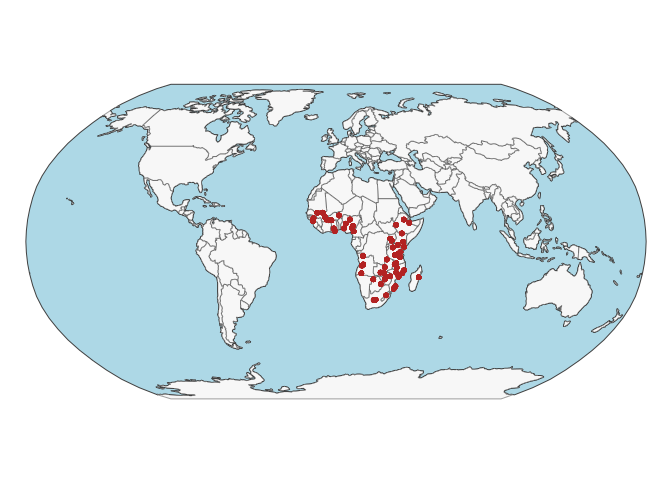
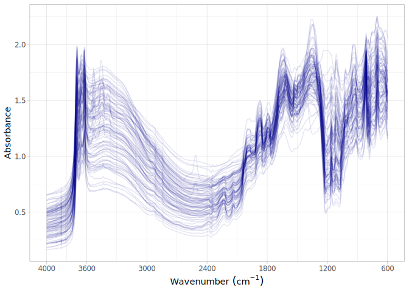

# Africa Soil Information Service Phase I (AFSIS1) prep
Jose L. Safanelli, Ran Zhi, Tomislav Hengl, Jonathan Sanderman

- [Original data](#original-data)
- [Data standardization to the OSSL
  format](#data-standardization-to-the-ossl-format)
  - [Site information](#site-information)
  - [Soil lab information (reference analytical
    data)](#soil-lab-information-reference-analytical-data)
  - [Mid-infrared spectra](#mid-infrared-spectra)
- [Quality control](#quality-control)
- [References](#references)

Code repository for standardizing and importing the ICRAF Soil and Plant
Spectroscopy Laboratory: Africa Soil Information Service Phase I
2009-2013 (AFSIS1) into the Open Soil Spectral Library.

Website: [Soil Spectroscopy for Global
Good](https://soilspectroscopy.org)  
Development: <https://github.com/soilspectroscopy>  
Last update: 2026-05-17  
Additional documentation:

## Original data

Site data, soil lab data, and Mid-Infrared Spectra (MIR) from AFSIS1.

Further information can be found in Towett et al.
([2015](#ref-Towett2015)), T.-G. Vågen, Winowiecki, Tondoh, Desta, &
Gumbricht ([2016](#ref-Vagen2016)), and T.-G. Vågen et al.
([2020](#ref-Vagen2020)).

Input datasets:  
- `AfSIS_reference.csv`: Database with site and soil analytes.  
- `afsis_mir_2013`: folder with MIR soil spectral data.  
- `Calibration_MPA_NIR.csv`: VNIR soil spectral data.  

The dataset has two versions one published via the [World Agroforestry
website](https://doi.org/10.34725/DVN/QXCWP1), one via AWS
(<https://registry.opendata.aws/afsis/>).

Directory/folder path with original files (not uploaded to GitHub).

``` r
# dir = "./"
dir = "~/mnt-ossl-private/database/datasets/AFSIS1"
tic()
```

## Data standardization to the OSSL format

### Site information

``` r
# AfIS1 site data
afsis1.geo <- fread(paste0(dir, "/georeferences_2013.csv"))

afsis1.sitedata <- afsis1.geo %>%
  select(SSN, Latitude, Longitude, Depth,
         Scientist, Cluster, Plot, Site, Country, Region, Cultivated) %>%
  mutate(Scientist = case_when(
    # Tor Vagen
    Scientist %in% c("Tor Vagen", "Tor Gunnar Vagen",
                     "Tor Vargen") ~ "Tor Gunnar Vagen",
    # Jerome Tondoh
    Scientist %in% c("Jerome Tondoh", "Jerom Tondoh") ~ "Jerome Tondoh",
    # George Van Zijl
    Scientist == "George Van Zijl" ~ "George Van Zijl",
    # L.T. Desta
    Scientist %in% c("L.T.Desta", "Dr L.T.Desta") ~ "L.T. Desta",
    # Leigh Winowiecki
    Scientist %in% c("Leigh Winoweicki", "Leigh Wenoiwecki",
                     "Leigh Winowiecki", "Leigh wenoweicki",
                     "Leigh Wenoicki", "Leigh Winowieck") ~ "Leigh Winowiecki",
    # Lulseged Tamene
    Scientist == "Lulseged Tamene" ~ "Lulseged Tamene",
    TRUE ~ Scientist)) %>%
  rename(id.layer_local_c = SSN,
         longitude.point_wgs84_dd = Longitude,
         latitude.point_wgs84_dd = Latitude,
         surveyor.title_utf8_txt = Scientist,
         site.cluster_src_id = Cluster,
         site.plot_src_id = Plot,
         site.name_src_txt = Site,
         site.cultivated_src_logical = Cultivated,
         loc.country_src_txt = Country,
         loc.region_src_txt = Region) %>%
  mutate(observation.date.begin_iso.8601_yyyy.mm.dd = lubridate::ymd("2011-01-01"),
         observation.date.end_iso.8601_yyyy.mm.dd = lubridate::ymd("2013-12-31")) %>%
  mutate(id.layer_local_c = as.character(id.layer_local_c),
         layer.upper.depth_usda_cm = ifelse(Depth == "top", 0, 20),
         layer.lower.depth_usda_cm = ifelse(Depth == "top", 20, 50),
         layer.sequence_usda_uint16 = ifelse(Depth == "top", 1, 2)) %>%
  select(-Depth) %>%
  # mutate(id.project_ascii_txt = "Africa Soil Information Service (AfSIS-1)",
  #        layer.texture_usda_txt = "",
  #        pedon.taxa_usda_txt = "",
  #        horizon.designation_usda_txt = "",
  #        longitude.county_wgs84_dd = NA,
  #        latitude.county_wgs84_dd = NA,
  #        location.point.error_any_m = 30,
  #        location.country_iso.3166_txt = "",
  #        observation.ogc.schema.title_ogc_txt = "Open Soil Spectroscopy Library",
  #        observation.ogc.schema_idn_url = "https://soilspectroscopy.github.io",
  #        surveyor.contact_ietf_email = "afsis.info@africasoils.net",
  #        surveyor.address_utf8_txt = "ICRAF, PO Box 30677, Nairobi, 00100, Kenya",
  #        dataset.title_utf8_txt = "Africa Soil Information Service (AfSIS-1)",
  #        dataset.owner_utf8_txt = "ICRAF, CROPNUTS, RRES",
  #        dataset.code_ascii_txt = "AFSIS1.SSL",
  #        dataset.address_idn_url = "https://www.isric.org/explore/ISRIC-collections",
  #        dataset.doi_idf_url = "https://doi.org/10.1016/j.geodrs.2015.06.002",
  #        dataset.license.title_ascii_txt = "ODC Open Database License",
  #        dataset.license.address_idn_url = "https://opendatacommons.org/licenses/odbl/",
  #        dataset.contact.name_utf8_txt = "Keith Shepherd",
  #        dataset.contact_ietf_email = "afsis.info@africasoils.net") %>%
  mutate(dataset.code_ascii_txt = "AFSIS1",
         id.layer_uuid_txt = openssl::md5(paste0(dataset.code_ascii_txt, id.layer_local_c)),
         .before = 1)

# Removing duplicates
afsis1.sitedata %>%
  group_by(id.layer_local_c) %>%
  summarise(repeats = n()) %>%
  group_by(repeats) %>%
  summarise(count = n())
```

    # A tibble: 1 × 2
      repeats count
        <int> <int>
    1       1  1843

``` r
dupli.ids <- afsis1.sitedata %>%
  group_by(id.layer_local_c) %>%
  summarise(repeats = n()) %>%
  filter(repeats > 1) %>%
  pull(id.layer_local_c)

afsis1.sitedata <- afsis1.sitedata %>%
  filter(!(id.layer_local_c %in% dupli.ids))

# # Removing rows without spatial coordinates
# afsis1.sitedata <- afsis1.sitedata %>%
#   filter(!(is.na(longitude.point_wgs84_dd) & is.na(latitude.point_wgs84_dd))) %>%
#   mutate_at(vars(starts_with("id.")), as.character)

# Saving version to dataset root dir
site.exp.file = path(dir, "ossl_soilsite_v1.3")
readr::write_csv(afsis1.sitedata, str_c(site.exp.file, ".csv.gz"))
nanoparquet::write_parquet(afsis1.sitedata, str_c(site.exp.file, ".parquet"))
```

Plotting map:

``` r
data("World")

ocean <- ne_download(scale = 110, type = "ocean", category = "physical", returnclass = "sf")
```

    Reading 'ne_110m_ocean.zip' from naturalearth...

``` r
points <- afsis1.sitedata %>%
  filter(!is.na(longitude.point_wgs84_dd),
         !is.na(latitude.point_wgs84_dd)) %>%
  st_as_sf(coords = c('longitude.point_wgs84_dd', 'latitude.point_wgs84_dd'), crs = 4326)

tmap_mode("plot")
```

    ℹ tmap modes "plot" - "view"
    ℹ toggle with `tmap::ttm()`

``` r
tm_shape(ocean) +
  tm_polygons(fill = "lightblue", col = NA) +
  tm_shape(World) +
  tm_polygons(fill = "#f0f0f0", fill_alpha = 0.5, col_alpha = 0.5) +
  tm_shape(points) +
  tm_dots(fill = "firebrick") +
  tm_crs("ESRI:54030") +
  tm_layout(frame = FALSE)
```

    [tip] Consider a suitable map projection, e.g. by adding `+ tm_crs("auto")`.
    This message is displayed once per session.



### Soil lab information (reference analytical data)

NOTE: The code chunk below must be run just once for getting a template
for scripted column standardization. Just run once for getting the
original names of soil properties, descriptions, data types, and units.
Then upload to Google Sheet for editing and manually defining the rules
for integrating with the OSSL. Requires Google authentication. A copy of
the output file is saved to this folder for archiving purposes.

**Always leave the sheet name as TEMP to avoid overwritting, then rename
online to download locally.**

``` r
# Getting soillab original variables
variables.file = readr::read_csv(paste0(dir, "/AfSIS_reference.csv"))

# They all have the same soil properties
soillab.names <- variables.file %>%
  names(.) %>%
  tibble(original_name = .) %>%
  dplyr::mutate(table = 'AfSIS_reference.csv', .before = 1) %>%
  dplyr::mutate(import = '', ossl_name = '', .after = original_name) %>%
  dplyr::mutate(comment = '')

readr::write_csv(soillab.names, paste0(getwd(), "/afis_soillab_names.csv"))

# Uploading to google sheet

# FACT CIN folder. Get ID for soildata importing table
googledrive::drive_ls(as_id("0AHDIWmLAj40_Uk9PVA"))

OSSL.soildata.importing <- "19LeILz9AEnKVK7GK0ZbK3CCr2RfeP-gSWn5VpY8ETVM"

# Checking metadata
googlesheets4::as_sheets_id(OSSL.soildata.importing)

# Checking readme
googlesheets4::read_sheet(OSSL.soildata.importing, sheet = 'readme')

# Preparing soillab.names
upload <- dplyr::as_tibble(soillab.names)

# Uploading
googlesheets4::write_sheet(upload, ss = OSSL.soildata.importing, sheet = "TEMP")

# Checking metadata
googlesheets4::as_sheets_id(OSSL.soildata.importing)
```

NOTE: The code chunk below must be run just once. Run for getting the
column standardization rules after editing online on Google Sheets. A
copy of the edited standardization template is saved to this dataset
folder.

``` r
# Downloading from google sheet

# Checking metadata
googlesheets4::as_sheets_id("1mWTDJDuMp4oObcCxAy9gofSkrkcSWWf1TtEW2SuC1es")

# Preparing soillab.names
transvalues <- googlesheets4::read_sheet("1mWTDJDuMp4oObcCxAy9gofSkrkcSWWf1TtEW2SuC1es",
                                         sheet = "AFSIS1")

# Saving to folder
write_csv(transvalues, path(getwd(), "soillab_standardized_names.csv"))
```

Reading standardization rules:

``` r
transvalues <- read_csv(path(getwd(), "soillab_standardized_names.csv"),
                        show_col_types = F) %>%
  filter(import == TRUE) %>%
  select(contains(c("table", "id", "original_name", "ossl_")))

knitr::kable(transvalues)
```

| table | original_name | ossl_abbrev | ossl_method | ossl_unit | ossl_convert | ossl_name |
|:---|:---|:---|:---|:---|:---|:---|
| AfSIS_reference.csv | ECd | ec | usda.a364 | ds.m | ifelse(as.numeric(x) \< 0, NA, as.numeric(x)\*1) | ec_usda.a364_ds.m |
| AfSIS_reference.csv | m3.Al | al.ext | usda.a1056 | mg.kg | ifelse(as.numeric(x) \< 0, NA, as.numeric(x)\*1) | al.ext_usda.a1056_mg.kg |
| AfSIS_reference.csv | m3.B | b.ext | mel3 | mg.kg | ifelse(as.numeric(x) \< 0, NA, as.numeric(x)\*1) | b.ext_mel3_mg.kg |
| AfSIS_reference.csv | m3.Ca | ca.ext | usda.a1059 | mg.kg | ifelse(as.numeric(x) \< 0, NA, as.numeric(x)\*1) | ca.ext_usda.a1059_mg.kg |
| AfSIS_reference.csv | m3.Cu | cu.ext | usda.a1063 | mg.kg | ifelse(as.numeric(x) \< 0, NA, as.numeric(x)\*1) | cu.ext_usda.a1063_mg.kg |
| AfSIS_reference.csv | m3.Fe | fe.ext | usda.a1064 | mg.kg | ifelse(as.numeric(x) \< 0, NA, as.numeric(x)\*1) | fe.ext_usda.a1064_mg.kg |
| AfSIS_reference.csv | m3.K | k.ext | usda.a1065 | mg.kg | ifelse(as.numeric(x) \< 0, NA, as.numeric(x)\*1) | k.ext_usda.a1065_mg.kg |
| AfSIS_reference.csv | m3.Mg | mg.ext | usda.a1066 | mg.kg | ifelse(as.numeric(x) \< 0, NA, as.numeric(x)\*1) | mg.ext_usda.a1066_mg.kg |
| AfSIS_reference.csv | m3.Mn | mn.ext | usda.a1067 | mg.kg | ifelse(as.numeric(x) \< 0, NA, as.numeric(x)\*1) | mn.ext_usda.a1067_mg.kg |
| AfSIS_reference.csv | m3.Na | na.ext | usda.a1068 | mg.kg | ifelse(as.numeric(x) \< 0, NA, as.numeric(x)\*1) | na.ext_usda.a1068_mg.kg |
| AfSIS_reference.csv | m3.P | p.ext | usda.a652 | mg.kg | ifelse(as.numeric(x) \< 0, NA, as.numeric(x)\*1) | p.ext_usda.a652_mg.kg |
| AfSIS_reference.csv | m3.S | s.ext | mel3 | mg.kg | ifelse(as.numeric(x) \< 0, NA, as.numeric(x)\*1) | s.ext_mel3_mg.kg |
| AfSIS_reference.csv | m3.Zn | zn.ext | usda.a1073 | mg.kg | ifelse(as.numeric(x) \< 0, NA, as.numeric(x)\*1) | zn.ext_usda.a1073_mg.kg |
| AfSIS_reference.csv | pH | ph.h2o | usda.a268 | index | ifelse(as.numeric(x) \< 0, NA, as.numeric(x)\*1) | ph.h2o_usda.a268_index |
| AfSIS_reference.csv | Total.Nitrogen | n.tot | usda.a623 | w.pct | ifelse(as.numeric(x) \< 0, NA, as.numeric(x)\*1) | n.tot_usda.a623_w.pct |
| AfSIS_reference.csv | Total.Carbon | c.tot | usda.a622 | w.pct | ifelse(as.numeric(x) \< 0, NA, as.numeric(x)\*1) | c.tot_usda.a622_w.pct |
| AfSIS_reference.csv | Acidified.Carbon | oc | usda.c1059 | w.pct | ifelse(as.numeric(x) \< 0, NA, as.numeric(x)\*1) | oc_usda.c1059_w.pct |
| AfSIS_reference.csv | Clay | clay.tot | usda.a334 | w.pct | ifelse(as.numeric(x) \< 0, NA, as.numeric(x)\*1) | clay.tot_usda.a334_w.pct |
| AfSIS_reference.csv | Silt | silt.tot | usda.c62 | w.pct | ifelse(as.numeric(x) \< 0, NA, as.numeric(x)\*1) | silt.tot_usda.c62_w.pct |
| AfSIS_reference.csv | Sand | sand.tot | usda.c60 | w.pct | ifelse(as.numeric(x) \< 0, NA, as.numeric(x)\*1) | sand.tot_usda.c60_w.pct |

Standardizing soil data to the OSSL format:

``` r
afsis1.reference = fread(paste0(dir, "/AfSIS_reference.csv"))

# Harmonization of names and units
analytes.old.names <- transvalues %>%
  filter(table == "AfSIS_reference.csv") %>%
  pull(original_name)

analytes.new.names <- transvalues %>%
  filter(table == "AfSIS_reference.csv") %>%
  pull(ossl_name)

# Selecting and renaming
afsis1.soildata <- afsis1.reference %>%
  rename(id.layer_local_c = SSN) %>%
  select(id.layer_local_c, all_of(analytes.old.names)) %>%
  rename_with(~analytes.new.names, all_of(analytes.old.names))

# Removing duplicates
# afsis1.soildata %>%
#   group_by(id.layer_local_c) %>%
#   summarise(repeats = n()) %>%
#   group_by(repeats) %>%
#   summarise(count = n())

dupli.ids <- afsis1.soildata %>%
  group_by(id.layer_local_c) %>%
  summarise(repeats = n()) %>%
  filter(repeats > 1) %>%
  pull(id.layer_local_c)

afsis1.soildata <- afsis1.soildata %>%
  filter(!(id.layer_local_c %in% dupli.ids)) %>%
  as.data.frame()

# Getting the formulas
functions.list <- transvalues %>%
  filter(table == "AfSIS_reference.csv") %>%
  mutate(ossl_name = factor(ossl_name, levels = names(afsis1.soildata))) %>%
  arrange(ossl_name) %>%
  pull(ossl_convert) %>%
  c("x", .)

# Applying transformation rules
afsis1.soildata.trans <- transform_values(df = afsis1.soildata,
                                          out.name = names(afsis1.soildata),
                                          in.name = names(afsis1.soildata),
                                          fun.lst = functions.list)

# Final soillab data
afsis1.soildata <- afsis1.soildata.trans %>%
  mutate_at(vars(starts_with("id.")), as.character)

# Checking total number of observations
afsis1.soildata %>%
  distinct(id.layer_local_c) %>%
  summarise(count = n())
```

      count
    1  1907

``` r
# Saving version to dataset root dir
soillab.exp.file = path(dir, "ossl_soillab_v1.3")
readr::write_csv(afsis1.soildata, str_c(soillab.exp.file, ".csv.gz"))
nanoparquet::write_parquet(afsis1.soildata, str_c(soillab.exp.file, ".parquet"))
```

Soil lab data summary.

``` r
afsis1.soildata %>%
  mutate(id.layer_local_c = factor(id.layer_local_c)) %>%
  skimr::skim() %>%
  dplyr::select(-numeric.hist, -complete_rate)
```

|                                                  |            |
|:-------------------------------------------------|:-----------|
| Name                                             | Piped data |
| Number of rows                                   | 1907       |
| Number of columns                                | 21         |
| \_\_\_\_\_\_\_\_\_\_\_\_\_\_\_\_\_\_\_\_\_\_\_   |            |
| Column type frequency:                           |            |
| factor                                           | 1          |
| numeric                                          | 20         |
| \_\_\_\_\_\_\_\_\_\_\_\_\_\_\_\_\_\_\_\_\_\_\_\_ |            |
| Group variables                                  | None       |

Data summary

**Variable type: factor**

| skim_variable    | n_missing | ordered | n_unique | top_counts                     |
|:-----------------|----------:|:--------|---------:|:-------------------------------|
| id.layer_local_c |         0 | FALSE   |     1907 | icr: 1, icr: 1, icr: 1, icr: 1 |

**Variable type: numeric**

| skim_variable | n_missing | mean | sd | p0 | p25 | p50 | p75 | p100 |
|:---|---:|---:|---:|---:|---:|---:|---:|---:|
| ec_usda.a364_ds.m | 0 | 0.13 | 0.39 | 0.01 | 0.03 | 0.06 | 0.11 | 8.73 |
| al.ext_usda.a1056_mg.kg | 0 | 821.58 | 466.22 | 1.67 | 457.00 | 733.00 | 1109.50 | 3041.00 |
| b.ext_mel3_mg.kg | 2 | 0.44 | 1.79 | 0.00 | 0.00 | 0.10 | 0.36 | 55.09 |
| ca.ext_usda.a1059_mg.kg | 0 | 1841.05 | 3438.81 | 0.00 | 290.00 | 634.00 | 1693.50 | 35200.00 |
| cu.ext_usda.a1063_mg.kg | 0 | 1.77 | 2.06 | 0.00 | 0.50 | 1.12 | 2.42 | 23.70 |
| fe.ext_usda.a1064_mg.kg | 0 | 112.11 | 81.46 | 1.26 | 60.05 | 91.90 | 139.10 | 981.00 |
| k.ext_usda.a1065_mg.kg | 0 | 173.99 | 289.98 | 0.00 | 51.48 | 91.41 | 177.85 | 5047.00 |
| mg.ext_usda.a1066_mg.kg | 0 | 311.58 | 416.64 | 0.00 | 79.15 | 159.00 | 383.95 | 4740.00 |
| mn.ext_usda.a1067_mg.kg | 0 | 98.93 | 100.63 | 0.57 | 24.00 | 69.40 | 139.00 | 686.60 |
| na.ext_usda.a1068_mg.kg | 6 | 140.34 | 1169.35 | 0.00 | 22.30 | 34.30 | 50.92 | 31800.00 |
| p.ext_usda.a652_mg.kg | 0 | 12.30 | 28.75 | 0.00 | 2.55 | 4.97 | 10.09 | 396.00 |
| s.ext_mel3_mg.kg | 2 | 24.87 | 165.80 | 0.62 | 5.00 | 7.62 | 12.40 | 3940.00 |
| zn.ext_usda.a1073_mg.kg | 0 | 1.53 | 1.77 | 0.00 | 0.71 | 1.10 | 1.75 | 36.51 |
| ph.h2o_usda.a268_index | 0 | 6.21 | 1.07 | 3.61 | 5.44 | 6.08 | 6.69 | 9.86 |
| n.tot_usda.a623_w.pct | 2 | 0.08 | 0.08 | 0.00 | 0.03 | 0.05 | 0.10 | 0.66 |
| c.tot_usda.a622_w.pct | 2 | 1.24 | 1.34 | 0.08 | 0.42 | 0.78 | 1.51 | 11.29 |
| oc_usda.c1059_w.pct | 2 | 1.18 | 1.28 | 0.07 | 0.39 | 0.73 | 1.46 | 10.93 |
| clay.tot_usda.a334_w.pct | 8 | 42.99 | 24.09 | 0.32 | 22.16 | 40.16 | 63.13 | 100.00 |
| silt.tot_usda.c62_w.pct | 14 | 17.73 | 10.05 | 0.34 | 10.00 | 16.48 | 23.42 | 57.27 |
| sand.tot_usda.c60_w.pct | 13 | 39.50 | 26.20 | 0.12 | 15.72 | 36.96 | 60.31 | 100.00 |

### Mid-infrared spectra

Spectra already in pseudo absorbance units.

**PLEASE NOTE: Only ~10% of the spectra have paired analytical data.**

``` r
# Floating wavenumbers
mir.files <- list.files(paste0(dir, "/afsis_mir_2013"), pattern = "\\.csv$", full.names = T)

mir.scans <- mir.files %>%
  purrr::map_dfr(fread, header = TRUE) %>%
  select(SSN, starts_with("m"))

old.names <- names(mir.scans)
new.names <- gsub("m", "", old.names)

afsis1.mir <- mir.scans %>%
  rename_with(~new.names, all_of(old.names)) %>%
  rename(id.layer_local_c = SSN)

# Removing samples without spectra
scans.na.gaps <- afsis1.mir %>%
  select(-id.layer_local_c) %>%
  apply(., 1, function(x) round(100*(sum(is.na(x)))/(length(x)), 2)) %>%
  tibble(proportion_NA = .) %>%
  bind_cols({afsis1.mir %>% select(id.layer_local_c)}, .)

issue.ids <- scans.na.gaps %>%
  filter(proportion_NA > 0) %>%
  pull(id.layer_local_c)

afsis1.mir <- afsis1.mir %>%
  filter(!(id.layer_local_c %in% issue.ids))

# Need to resample spectra
old.wavenumber <- na.omit(as.numeric(names(afsis1.mir)))
```

    Warning in na.omit(as.numeric(names(afsis1.mir))): NAs introduced by coercion

``` r
new.wavenumbers <- rev(seq(600, 4000, by = 2))

afsis1.mir <- afsis1.mir %>%
  select(-id.layer_local_c) %>%
  as.matrix() %>%
  prospectr::resample(X = ., wav = old.wavenumber,
                      new.wav = new.wavenumbers, interpol = "spline") %>%
  as_tibble() %>%
  bind_cols({afsis1.mir %>%
      select(id.layer_local_c)}, .) %>%
  select(id.layer_local_c, as.character(rev(new.wavenumbers)))

# Gaps
scans.na.gaps <- afsis1.mir %>%
  select(-id.layer_local_c) %>%
  apply(., 1, function(x) round(100*(sum(is.na(x)))/(length(x)), 2)) %>%
  tibble(proportion_NA = .) %>%
  bind_cols({afsis1.mir %>% select(id.layer_local_c)}, .)

# Extreme negative - irreversible erratic patterns
scans.extreme.neg <- afsis1.mir %>%
  select(-id.layer_local_c) %>%
  apply(., 1, function(x) {round(100*(sum(x < -1, na.rm=TRUE))/(length(x)), 2)}) %>%
  tibble(proportion_lower0 = .) %>%
  bind_cols({afsis1.mir %>% select(id.layer_local_c)}, .)

# Extreme positive, irreversible erratic patterns
scans.extreme.pos <- afsis1.mir %>%
  select(-id.layer_local_c) %>%
  apply(., 1, function(x) {round(100*(sum(x > 5, na.rm=TRUE))/(length(x)), 2)}) %>%
  tibble(proportion_higherAbs5 = .) %>%
  bind_cols({afsis1.mir %>% select(id.layer_local_c)}, .)

# Consistency summary - problematic scans
scans.summary <- scans.na.gaps %>%
  left_join(scans.extreme.neg, by = "id.layer_local_c") %>%
  left_join(scans.extreme.pos, by = "id.layer_local_c")

scans.summary %>%
  select(-id.layer_local_c) %>%
  pivot_longer(everything(), names_to = "check", values_to = "value") %>%
  filter(value > 0) %>%
  group_by(check) %>%
  summarise(count = n())
```

    # A tibble: 0 × 2
    # ℹ 2 variables: check <chr>, count <int>

``` r
# Renaming
old.wavenumbers <- seq(600, 4000, by = 2)
new.wavenumbers <- paste0("scan_mir.", old.wavenumbers, "_abs")

afsis1.mir <- afsis1.mir %>%
  rename_with(~new.wavenumbers, all_of(as.character(old.wavenumbers))) %>%
  mutate(id.layer_local_c = as.character(id.layer_local_c))

# # Preparing metadata
# afsis1.mir.metadata <- afsis1.mir %>%
#   select(id.layer_local_c) %>%
#   mutate(id.scan_local_c = id.layer_local_c) %>%
#   mutate(scan.mir.date.begin_iso.8601_yyyy.mm.dd = ymd("2009-01-01"),
#          scan.mir.date.end_iso.8601_yyyy.mm.dd = ymd("2013-12-31"),
#          scan.mir.model.name_utf8_txt = "Bruker Tensor 27 with HTS-XT accessory",
#          scan.mir.model.code_any_txt = "Bruker_Tensor_27.HTS.XT",
#          scan.mir.method.optics_any_txt = "",
#          scan.mir.method.preparation_any_txt = "",
#          scan.mir.license.title_ascii_txt = "CC-BY",
#          scan.mir.license.address_idn_url = "https://creativecommons.org/licenses/by/4.0/",
#          scan.mir.doi_idf_url = "https://doi.org/10.34725/DVN/QXCWP1",
#          scan.mir.contact.name_utf8_txt = "Vagen, Tor-Gunnar (World Agroforestry)",
#          scan.mir.contact.email_ietf_txt = "afsis.info@africasoils.net")

# Final export
afsis1.mir.export <- afsis1.mir

mir.exp.file = path(dir, "ossl_mir_v1.3")
readr::write_csv(afsis1.mir.export, str_c(mir.exp.file, ".csv.gz"))
nanoparquet::write_parquet(afsis1.mir.export, str_c(mir.exp.file, ".parquet"))
```

## Quality control

The final table must be joined as follows:

- MIR is used as first reference for pairing with soil data.
- Soil lab data are left joined to MIR. This drop data without any
  available scan.

The availability of data is summarized below:

``` r
afsis1.availability <- afsis1.mir.export %>%
  select(id.layer_local_c, scan_mir.600_abs) %>%
  left_join(afsis1.soildata, by = "id.layer_local_c") %>%
  filter(!is.na(id.layer_local_c))

# Paired information
afsis1.availability %>%
  mutate_all(as.character) %>%
  pivot_longer(everything(), names_to = "column", values_to = "value") %>%
  filter(!is.na(value)) %>%
  group_by(column) %>%
  summarise(count = n())
```

    # A tibble: 22 × 2
       column                   count
       <chr>                    <int>
     1 al.ext_usda.a1056_mg.kg   1904
     2 b.ext_mel3_mg.kg          1902
     3 c.tot_usda.a622_w.pct     1902
     4 ca.ext_usda.a1059_mg.kg   1904
     5 clay.tot_usda.a334_w.pct  1896
     6 cu.ext_usda.a1063_mg.kg   1904
     7 ec_usda.a364_ds.m         1904
     8 fe.ext_usda.a1064_mg.kg   1904
     9 id.layer_local_c         18250
    10 k.ext_usda.a1065_mg.kg    1904
    # ℹ 12 more rows

``` r
# Repeats check - Duplicates were dropped
afsis1.availability %>%
  mutate_all(as.character) %>%
  select(id.layer_local_c) %>%
  pivot_longer(everything(), names_to = "column", values_to = "value") %>%
  group_by(column, value) %>%
  summarise(repeats = n(), .groups = 'drop') %>%
  group_by(column, repeats) %>%
  summarise(count = n())
```

    `summarise()` has grouped output by 'column'. You can override using the
    `.groups` argument.

    # A tibble: 1 × 3
    # Groups:   column [1]
      column           repeats count
      <chr>              <int> <int>
    1 id.layer_local_c       1 18250

MIR spectral visualization (100 random spectra):

``` r
set.seed(42)
afsis1.mir.export %>%
  sample_n(100) %>%
  select(all_of(c("id.layer_local_c")), starts_with("scan_mir.")) %>%
  tidyr::pivot_longer(-all_of(c("id.layer_local_c")),
                      names_to = "wavenumber", values_to = "absorbance") %>%
  dplyr::mutate(wavenumber = gsub("scan_mir.|_abs", "", wavenumber)) %>%
  dplyr::mutate(wavenumber = as.numeric(wavenumber)) %>%
  ggplot(aes(x = wavenumber, y = absorbance, group = id.layer_local_c)) +
  geom_line(alpha = 0.1, color = "darkblue") +
  scale_x_continuous(breaks = c(600, 1200, 1800, 2400, 3000, 3600, 4000),
                     transform = "reverse") +
  labs(x = bquote("Wavenumber"~(cm^-1)), y = "Absorbance") +
  theme_light()
```



``` r
toc()
```

    90.265 sec elapsed

``` r
rm(list = ls())
gc()
```

               used  (Mb) gc trigger   (Mb)  max used   (Mb)
    Ncells  6442675 344.1   11092401  592.4  11092401  592.4
    Vcells 11293070  86.2  196099832 1496.2 245115555 1870.1

## References

<div id="refs" class="references csl-bib-body hanging-indent"
entry-spacing="0" line-spacing="2">

<div id="ref-Towett2015" class="csl-entry">

Towett, E. K., Shepherd, K. D., Tondoh, J. E., Winowiecki, L. A.,
Lulseged, T., Nyambura, M., … Cadisch, G. (2015). Total elemental
composition of soils in sub-saharan africa and relationship with soil
forming factors. *Geoderma Regional*, *5*, 157–168.
doi:[10.1016/j.geodrs.2015.06.002](https://doi.org/10.1016/j.geodrs.2015.06.002)

</div>

<div id="ref-Vagen2020" class="csl-entry">

Vågen, T.-G., Winowiecki, L. A., Desta, L., Tondoh, E. J., Weullow, E.,
Shepherd, K., & Sila, A. (2020). Mid-infrared spectra (MIRS) from ICRAF
soil and plant spectroscopy laboratory: Africa soil information service
(AfSIS) phase i 2009-2013. World Agroforestry (ICRAF).
doi:[10.34725/DVN/QXCWP1](https://doi.org/10.34725/DVN/QXCWP1)

</div>

<div id="ref-Vagen2016" class="csl-entry">

Vågen, T.-G., Winowiecki, L. A., Tondoh, J. E., Desta, L. T., &
Gumbricht, T. (2016). Mapping of soil properties and land degradation
risk in africa using MODIS reflectance. *Geoderma*, *263*, 216–225.
doi:[10.1016/j.geoderma.2015.06.023](https://doi.org/10.1016/j.geoderma.2015.06.023)

</div>

</div>
