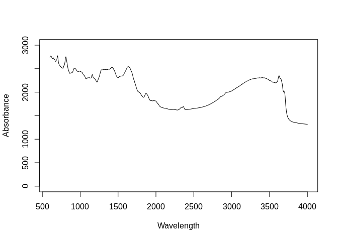
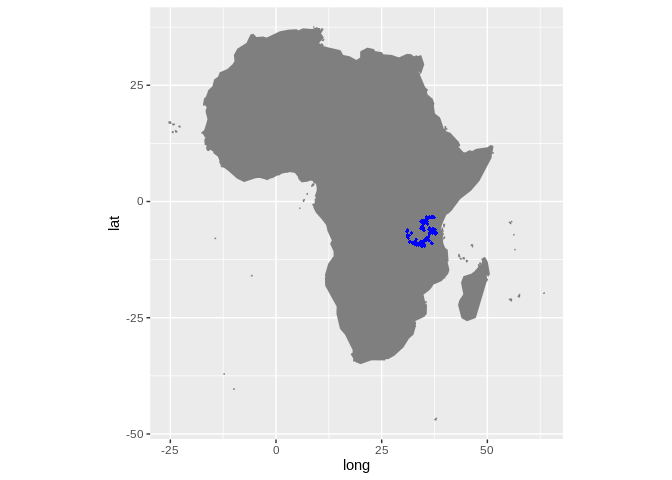

Dataset import: TanSIS, NiSIS and GhanSIS (AfSIS-II) SSL
================
Tomislav Hengl (<tom.hengl@opengeohub.org>) and Jonathan Sanderman
(<jsanderman@woodwellclimate.org>)
08 May, 2022


-   [TanSIS, NiSIS and GhanSIS inputs](#tansis-nisis-and-ghansis-inputs)
-   [Data import](#data-import)
    -   [Soil site and laboratory data
        import:](#soil-site-and-laboratory-data-import)
        -   [Soil lab information](#soil-lab-information)
        -   [Soil site information](#soil-site-information)
    -   [Mid-infrared spectroscopy
        data](#mid-infrared-spectroscopy-data)
    -   [Quality control](#quality-control)
    -   [Distribution of points](#distribution-of-points)
-   [References](#references)

[](https://soilspectroscopy.org/)

[](http://creativecommons.org/licenses/by-sa/4.0/)

This work is licensed under a [Creative Commons Attribution-ShareAlike
4.0 International
License](http://creativecommons.org/licenses/by-sa/4.0/).

## TanSIS, NiSIS and GhanSIS inputs

Part of: <https://github.com/soilspectroscopy>  
Project: [Soil Spectroscopy for Global
Good](https://soilspectroscopy.org)  
Last update: 2022-05-08  
Dataset:
[AFSIS2.SSL](https://soilspectroscopy.github.io/ossl-manual/soil-spectroscopy-tools-and-users.html#afsis2.ssl)

Mid-Infrared Spectra (MIRS) from AfSIS2 Soil and Plant Spectroscopy
Laboratory, which are the national Soil Information Systems: TanSIS
(Tanzania), NiSIS (Nigeria) and GhanSIS (Ghana).

The three datasets are available from
<https://doi.org/10.34725/DVN/XUDGJY>,
<https://doi.org/10.34725/DVN/WLAKR2> and
<https://doi.org/10.34725/DVN/SPRSFN>. Documentation of the datasets is
available in [Hengl et al.](#ref-hengl2021african)
([2021](#ref-hengl2021african)). Data has been analyzed at the ICRAF
Soil-Plant Spectral Diagnostics Laboratory, Nairobi, and the Rothamsted
Research. Coordinates for points are not provided and soil reference
data is available only for a limited subset of points. Coordinates for
TanSIS points are available with a different coding system via
<https://registry.opendata.aws/afsis/>. From the 31,269 soil scans
(“ZnSe”) only 820 (2.6%) have reference data.

Directory/folder path

``` r
dir = "/mnt/soilspec4gg/ossl/dataset/AFSIS2/"
```

## Data import

### Soil site and laboratory data import:

Read from multiple csv files, hopefully all consistent:

``` r
afsis2.xy = plyr::rbind.fill(lapply(list.files(dir, pattern=glob2rx("*samples.csv"), full.names = TRUE), vroom::vroom))
```

    ## Rows: 3,069
    ## Columns: 4
    ## Delimiter: ","
    ## chr [4]: SSN, Study, Country, pref
    ## 
    ## Use `spec()` to retrieve the guessed column specification
    ## Pass a specification to the `col_types` argument to quiet this message

    ## Rows: 1,490
    ## Columns: 4
    ## Delimiter: ","
    ## chr [4]: SSN, Study, Country, pref
    ## 
    ## Use `spec()` to retrieve the guessed column specification
    ## Pass a specification to the `col_types` argument to quiet this message

    ## Rows: 26,772
    ## Columns: 4
    ## Delimiter: ","
    ## chr [4]: SSN, Study, Country, pref
    ## 
    ## Use `spec()` to retrieve the guessed column specification
    ## Pass a specification to the `col_types` argument to quiet this message

``` r
dim(afsis2.xy)
```

    ## [1] 31331     4

``` r
## 31331     4
summary(as.factor(afsis2.xy$Country))
```

    ##    Ghana  Nigeria Tanzania     NA's 
    ##     3013     1458    26772       88

``` r
#   Ghana  Nigeria Tanzania     NA's 
#    3013     1458    26772       88 
afsis2.xy$observation.date.begin_iso.8601_yyyy.mm.dd = ifelse(afsis2.xy$Country=="Ghana", "2018-01-01", "2019-01-01")
afsis2.xy$observation.date.end_iso.8601_yyyy.mm.dd = ifelse(afsis2.xy$Country=="Ghana", "2018-12-31", "2019-12-31")
afsis2.xy$sample.doi_idf_c = ifelse(afsis2.xy$Country=="Ghana", "10.34725/DVN/SPRSFN", ifelse(afsis2.xy$Country=="Nigeria", "10.34725/DVN/WLAKR2", "10.34725/DVN/XUDGJY"))
afsis2.xy$sample.contact.name_utf8_txt = ifelse(afsis2.xy$Country=="Ghana", "Teteh, Francis (CSIR)", ifelse(afsis2.xy$Country=="Nigeria", "Vincent, Aduramigba-Modupe (Obafemi Awolowo University)", "Meliyo, Joel (TARI)"))
## Laboratory data:
afsis2.hor = plyr::rbind.fill(lapply(list.files(dir, pattern=glob2rx("*reference.csv"), full.names = TRUE), vroom::vroom))
```

    ## Rows: 210
    ## Columns: 15
    ## Delimiter: ","
    ## chr [ 1]: SSN
    ## dbl [14]: pH, N, TC, SOC, m3.Al, m3.B, m3.Ca, m3.Cu, m3.Fe, m3.K, m3.Mg, m3.Mn, m3.S, m3.Zn
    ## 
    ## Use `spec()` to retrieve the guessed column specification
    ## Pass a specification to the `col_types` argument to quiet this message

    ## Rows: 148
    ## Columns: 15
    ## Delimiter: ","
    ## chr [ 1]: SSN
    ## dbl [14]: pH, N, TC, SOC, m3.Al, m3.B, m3.Ca, m3.Cu, m3.Fe, m3.K, m3.Mg, m3.Mn, m3.S, m3.Zn
    ## 
    ## Use `spec()` to retrieve the guessed column specification
    ## Pass a specification to the `col_types` argument to quiet this message

    ## Rows: 461
    ## Columns: 15
    ## Delimiter: ","
    ## chr [ 1]: SSN
    ## dbl [14]: pH, N, TC, SOC, m3.Al, m3.B, m3.Ca, m3.Cu, m3.Fe, m3.K, m3.Mg, m3.Mn, m3.S, m3.Zn
    ## 
    ## Use `spec()` to retrieve the guessed column specification
    ## Pass a specification to the `col_types` argument to quiet this message

``` r
dim(afsis2.hor)
```

    ## [1] 819  15

``` r
## 819   15
#summary(afsis2.hor$pH)
#summary(afsis2.hor$SOC)
tansis.xy = read.csv("/mnt/diskstation/data/Soil_points/AF/AfSIS_SSL/tansis/Georeferences/georeferences.csv")
## code mismatch
tansis.xy$SSN = gsub("_", "", gsub("-", "", tansis.xy$SSN))
#tansis.xy[tansis.xy$SSN=="TanSISSUBBRVKcqaDD",]
#afsis2.hor[afsis2.hor$SSN=="TanSISSUBBRVKcqaDD",]
afsis2t.df = plyr::join(plyr::join(afsis2.hor, afsis2.xy), tansis.xy)
```

    ## Joining by: SSN

    ## Joining by: SSN, Country

``` r
afsis2t.df = afsis2t.df[!is.na(afsis2t.df$SOC),]
#summary(afsis2t.df$Longitude)
afsis2t.df$layer.upper.depth_usda_cm = 0
afsis2t.df$layer.lower.depth_usda_cm = 20
afsis2t.df$layer.upper.depth_usda_cm[grep("sub", afsis2t.df$SSN, ignore.case = TRUE)] = 20
afsis2t.df$layer.lower.depth_usda_cm[grep("sub", afsis2t.df$SSN, ignore.case = TRUE)] = 50
afsis2t.df$layer.sequence_usda_uint16 = 1
afsis2t.df$layer.sequence_usda_uint16[grep("sub", afsis2t.df$SSN, ignore.case = TRUE)] = 2
```

#### Soil lab information

Harmonization function:

``` r
in.name = c("pH", "N", "TC", "SOC", "m3.Al", "m3.B", "m3.Ca", "m3.Cu", "m3.Fe", 
            "m3.K", "m3.Mg", "m3.Mn", "m3.S", "m3.Zn", "layer.upper.depth_usda_cm", 
            "layer.lower.depth_usda_cm", "layer.sequence_usda_uint16", "Latitude", 
            "Longitude", "observation.date.begin_iso.8601_yyyy.mm.dd", "observation.date.end_iso.8601_yyyy.mm.dd",
            "Scientist", "sample.doi_idf_c", "sample.contact.name_utf8_txt")
#in.name[which(!in.name %in% names(afsis2t.df))]
afsis2.yw = as.data.frame(afsis2t.df[,in.name])
out.name = c("ph.h2o_usda.4c1_index", "n.tot_usda.4h2_wpct", "c.tot_usda.4h2_wpct", "oc_usda.calc_wpct",
             "al.meh3_usda.4d6_mgkg", "b.meh3_usda.4d6_mgkg", "ca.meh3_usda.4d6_mgkg", 
             "cu.meh3_usda.4d6_mgkg", "fe.meh3_usda.4d6_mgkg", "k.meh3_usda.4d6_mgkg",
             "mg.meh3_usda.4d6_mgkg", "mn.meh3_usda.4d6_mgkg", "s.meh3_usda.4d6_mgkg", 
             "zn.meh3_usda.4d6_mgkg", "layer.upper.depth_usda_cm", "layer.lower.depth_usda_cm", 
             "layer.sequence_usda_uint16", "latitude_wgs84_dd", "longitude_wgs84_dd",
             "observation.date.begin_iso.8601_yyyy.mm.dd", "observation.date.end_iso.8601_yyyy.mm.dd",
            "surveyor.title_utf8_txt", "sample.doi_idf_c", "sample.contact.name_utf8_txt")
## compare values
#summary(afsis2.yw$Latitude)
fun.lst = as.list(rep("x*1", length(in.name)))
fun.lst[[which(in.name=="Scientist")]] = "paste(x)"
fun.lst[[which(in.name=="sample.doi_idf_c")]] = "paste(x)"
fun.lst[[which(in.name=="sample.contact.name_utf8_txt")]] = "paste(x)"
fun.lst[[which(in.name=="observation.date.begin_iso.8601_yyyy.mm.dd")]] = "paste(x)"
fun.lst[[which(in.name=="observation.date.end_iso.8601_yyyy.mm.dd")]] = "paste(x)"
## save translation rules:
#View(data.frame(in.name, out.name, unlist(fun.lst)))
write.csv(data.frame(in.name, out.name, unlist(fun.lst)), "./afsis2_soilab_transvalues.csv")
afsis2.soil = transvalues(afsis2.yw, out.name, in.name, fun.lst)
afsis2.soil$id.layer_local_c = afsis2t.df$SSN
#summary(duplicated(afsis2.soil$id.layer_local_c))
## 1 duplicate
```

Exporting the table:

``` r
afsis2.soil$id.layer_uuid_c = openssl::md5(make.unique(paste0(afsis2.soil$id.layer_local_c)))
afsis2.soil$sample.contact.email_ietf_email = "afsis.info@africasoils.net"
x.na = soilab.name[which(!soilab.name %in% names(afsis2.soil))]
if(length(x.na)>0){ for(i in x.na){ afsis2.soil[,i] <- NA } }
soilab.rds = paste0(dir, "ossl_soillab_v1.rds")
if(!file.exists(soilab.rds)){
  saveRDS.gz(afsis2.soil[,soilab.name], soilab.rds)
}
```

#### Soil site information

``` r
afsis2.site = as.data.frame(afsis2.soil[,c("layer.upper.depth_usda_cm", "layer.lower.depth_usda_cm", 
                                           "layer.sequence_usda_uint16", "latitude_wgs84_dd", "longitude_wgs84_dd",
                                           "observation.date.begin_iso.8601_yyyy.mm.dd", "observation.date.end_iso.8601_yyyy.mm.dd",
                                           "surveyor.title_utf8_txt", "id.layer_local_c")])
afsis2.site$id.location_olc_c = olctools::encode_olc(afsis2.site$latitude_wgs84_dd, afsis2.site$longitude_wgs84_dd, 10)
```

Exporting the table:

``` r
afsis2.site$id.layer_uuid_c = openssl::md5(make.unique(paste0(afsis2.site$id.layer_local_c)))
afsis2.site$observation.ogc.schema.title_ogc_txt = 'Open Soil Spectroscopy Library'
afsis2.site$observation.ogc.schema_idn_url = 'https://soilspectroscopy.github.io'
afsis2.site$dataset.title_utf8_txt = "TanSIS, NiSIS and GhanSIS (AfSIS-II) SSL"
afsis2.site$surveyor.address_utf8_txt = "ICRAF, PO Box 30677, Nairobi, 00100, Kenya"
afsis2.site$dataset.code_ascii_c = "AFSIS2.SSL"
afsis2.site$location.method_any_c = "GPS"
afsis2.site$location.error_any_m = 30
afsis2.site$dataset.license.title_ascii_txt = "CC0" 
afsis2.site$dataset.license.address_idn_url = "https://creativecommons.org/publicdomain/zero/1.0/"
afsis2.site$dataset.address_idn_url = "ICRAF, PO Box 30677, Nairobi, 00100, Kenya"
afsis2.site$dataset.owner_utf8_txt = "the World Agroforestry Centre (ICRAF) and Rothamsted Research (RRES)"
afsis2.site$dataset.contact.name_utf8_txt = "Winowiecki, Leigh Ann (ICRAF)"
afsis2.site$dataset.contact_ietf_email = "L.A.WINOWIECKI@cgiar.org"
x.na = site.name[which(!site.name %in% names(afsis2.site))]
if(length(x.na)>0){ for(i in x.na){ afsis2.site[,i] <- NA } }
soilsite.rds = paste0(dir, "ossl_soilsite_v1.rds")
if(!file.exists(soilsite.rds)){
  saveRDS.gz(afsis2.site[,site.name], soilsite.rds)
}
```

### Mid-infrared spectroscopy data

Mid-infrared (MIR) soil spectroscopy raw data (only limited number of
samples come with reference):

``` r
if(!exists("afsis2.mir")){
  mir.afsis2.lst = list.files(dir, pattern=glob2rx("*_ZnSe_*.csv$"), full.names = TRUE, recursive = TRUE)
  afsis2.mir = plyr::rbind.fill(lapply(mir.afsis2.lst, vroom::vroom))
  ## subset to scans with laboratory data
  afsis2.mir = afsis2.mir[which(afsis2.mir$SSN %in% afsis2t.df$SSN),]
}
dim(afsis2.mir)
```

    ## [1]  781 1717

``` r
## 781 1701
## only 781 sample with callibration data
```

Add the [Universal Unique
Identifier](https://cran.r-project.org/web/packages/uuid/) (UUI):

``` r
afsis2.mir$id.scan_uuid_c = openssl::md5(make.unique(paste0("AFSIS2.SSL", afsis2.mir$SSN)))
```

Resampling the MIR spectra from the original window size to 2 cm-1:

``` r
sel.abs = names(afsis2.mir)[grep("^X", names(afsis2.mir))]
## 1714
afsis2.mir$id.scan_local_c = afsis2.mir$SSN
afsis2.abs = afsis2.mir[,c("id.scan_uuid_c", "SSN", "id.scan_local_c", sel.abs)]
dim(afsis2.abs)
```

    ## [1]  781 1717

Check values:

``` r
wav.mir = as.numeric(gsub("X", "", sel.abs)) # Get wavelength only
#summary(wav.mir)
# Creating a matrix with only spectral values to resample it
afsis2.mir.spec = as.matrix(afsis2.abs[,sel.abs])
colnames(afsis2.mir.spec) = wav.mir
rownames(afsis2.mir.spec) = afsis2.abs$id.scan_uuid_c
samples.na.gaps = apply(afsis2.mir.spec, 1, FUN=function(j){ round(100*sum(is.na(j))/length(j), 3)}) 
samples.negative = apply(afsis2.mir.spec, 1, FUN=function(j){ round(100*sum(j <= 0, na.rm=TRUE)/length(j), 3) })
sum(samples.negative>0)
```

    ## [1] 0

``` r
samples.extreme = apply(afsis2.mir.spec, 1, FUN=function(j){ round(100*sum(j >= 3, na.rm=TRUE)/length(j), 3) })
sum(samples.extreme>0)
```

    ## [1] 64

``` r
afsis2.mir.f = prospectr::resample(afsis2.mir.spec, wav.mir, seq(600, 4000, 2)) 
afsis2.mir.f = round(as.data.frame(afsis2.mir.f)*1000)
mir.n = paste0("scan_mir.", seq(600, 4000, 2), "_abs")
colnames(afsis2.mir.f) = mir.n
#summary(afsis2.mir.f$scan_mir.602_abs)
afsis2.mir.f$id.scan_uuid_c = rownames(afsis2.mir)
```

Plotting MIR spectra to see if there are still maybe negative values in
the table:

``` r
matplot(y=as.vector(t(afsis2.mir.f[250,mir.n])), x=seq(600, 4000, 2),
        ylim = c(0,3000),
        type = 'l', 
        xlab = "Wavelength", 
        ylab = "Absorbance"
        )
```

<!-- -->

Export final MIR table:

``` r
afsis2.mir.f$id.layer_local_c = plyr::join(afsis2.mir.f["id.scan_uuid_c"], afsis2.abs[c("id.scan_uuid_c","SSN")])$SSN
```

    ## Joining by: id.scan_uuid_c

``` r
afsis2.mir.f$id.scan_local_c = plyr::join(afsis2.mir.f["id.scan_uuid_c"], afsis2.abs[c("id.scan_uuid_c","id.scan_local_c")])$id.scan_local_c
```

    ## Joining by: id.scan_uuid_c

``` r
afsis2.mir.f$id.layer_uuid_c = plyr::join(afsis2.mir.f["id.layer_local_c"], afsis2.site[c("id.layer_local_c","id.layer_uuid_c")], match="first")$id.layer_uuid_c
```

    ## Joining by: id.layer_local_c

``` r
summary(is.na(afsis2.mir.f$id.layer_uuid_c))
```

    ##    Mode    TRUE 
    ## logical     781

``` r
afsis2.mir.f$model.name_utf8_txt = "Bruker Alpha 1_FT-MIR_Zn Se"
afsis2.mir.f$model.code_any_c = "Bruker_Alpha1_FT.MIR.Zn.Se"
afsis2.mir.f$method.light.source_any_c = ""
afsis2.mir.f$method.preparation_any_c = ""
afsis2.mir.f$scan.file_any_c = ""
afsis2.mir.f$scan.date.begin_iso.8601_yyyy.mm.dd = as.Date("2019-01-01")
afsis2.mir.f$scan.date.end_iso.8601_yyyy.mm.dd = as.Date("2019-12-31")
afsis2.mir.f$scan.license.title_ascii_txt = "CC0"
afsis2.mir.f$scan.license.address_idn_url = "https://creativecommons.org/publicdomain/zero/1.0/"
afsis2.mir.f$scan.doi_idf_c = plyr::join(afsis2.mir.f["id.layer_local_c"], afsis2.soil[c("id.layer_local_c","sample.doi_idf_c")], match="first")$sample.doi_idf_c
```

    ## Joining by: id.layer_local_c

``` r
afsis2.mir.f$scan.contact.name_utf8_txt = "Winowiecki, Leigh Ann (ICRAF)"
afsis2.mir.f$scan.contact.email_ietf_email = "L.A.WINOWIECKI@cgiar.org"
afsis2.mir.f$scan.mir.nafreq_ossl_pct = samples.na.gaps
afsis2.mir.f$scan.mir.negfreq_ossl_pct = samples.negative
afsis2.mir.f$scan.mir.extfreq_ossl_pct = samples.extreme
```

Save to RDS file:

``` r
x.na = mir.name[which(!mir.name %in% names(afsis2.mir.f))]
if(length(x.na)>0){ for(i in x.na){ afsis2.mir.f[,i] <- NA } }
str(afsis2.mir.f[,mir.name[1:24]])
```

    ## 'data.frame':    781 obs. of  24 variables:
    ##  $ id.scan_uuid_c                     : chr  "46" "64" "67" "75" ...
    ##  $ id.scan_local_c                    : chr  NA NA NA NA ...
    ##  $ id.layer_uuid_c                    : chr  NA NA NA NA ...
    ##  $ id.layer_local_c                   : chr  NA NA NA NA ...
    ##  $ model.name_utf8_txt                : chr  "Bruker Alpha 1_FT-MIR_Zn Se" "Bruker Alpha 1_FT-MIR_Zn Se" "Bruker Alpha 1_FT-MIR_Zn Se" "Bruker Alpha 1_FT-MIR_Zn Se" ...
    ##  $ model.code_any_c                   : chr  "Bruker_Alpha1_FT.MIR.Zn.Se" "Bruker_Alpha1_FT.MIR.Zn.Se" "Bruker_Alpha1_FT.MIR.Zn.Se" "Bruker_Alpha1_FT.MIR.Zn.Se" ...
    ##  $ method.light.source_any_c          : chr  "" "" "" "" ...
    ##  $ method.preparation_any_c           : chr  "" "" "" "" ...
    ##  $ scan.file_any_c                    : chr  "" "" "" "" ...
    ##  $ scan.date.begin_iso.8601_yyyy.mm.dd: Date, format: "2019-01-01" "2019-01-01" "2019-01-01" "2019-01-01" ...
    ##  $ scan.date.end_iso.8601_yyyy.mm.dd  : Date, format: "2019-12-31" "2019-12-31" "2019-12-31" "2019-12-31" ...
    ##  $ scan.license.title_ascii_txt       : chr  "CC0" "CC0" "CC0" "CC0" ...
    ##  $ scan.license.address_idn_url       : chr  "https://creativecommons.org/publicdomain/zero/1.0/" "https://creativecommons.org/publicdomain/zero/1.0/" "https://creativecommons.org/publicdomain/zero/1.0/" "https://creativecommons.org/publicdomain/zero/1.0/" ...
    ##  $ scan.doi_idf_c                     : chr  NA NA NA NA ...
    ##  $ scan.contact.name_utf8_txt         : chr  "Winowiecki, Leigh Ann (ICRAF)" "Winowiecki, Leigh Ann (ICRAF)" "Winowiecki, Leigh Ann (ICRAF)" "Winowiecki, Leigh Ann (ICRAF)" ...
    ##  $ scan.contact.email_ietf_email      : chr  "L.A.WINOWIECKI@cgiar.org" "L.A.WINOWIECKI@cgiar.org" "L.A.WINOWIECKI@cgiar.org" "L.A.WINOWIECKI@cgiar.org" ...
    ##  $ scan.mir.nafreq_ossl_pct           : num  0.233 0.233 0.233 0.233 0.233 0.233 0.233 0.233 0.233 0.233 ...
    ##  $ scan.mir.negfreq_ossl_pct          : num  0 0 0 0 0 0 0 0 0 0 ...
    ##  $ scan.mir.extfreq_ossl_pct          : num  0 0 0 0 0 0 0 0 0 0 ...
    ##  $ scan_mir.600_abs                   : num  2130 2104 2147 2190 2285 ...
    ##  $ scan_mir.602_abs                   : num  2109 2093 2126 2204 2285 ...
    ##  $ scan_mir.604_abs                   : num  2088 2082 2109 2218 2285 ...
    ##  $ scan_mir.606_abs                   : num  2070 2069 2099 2228 2283 ...
    ##  $ scan_mir.608_abs                   : num  2053 2053 2096 2231 2279 ...

``` r
mir.rds = paste0(dir, "ossl_mir_v1.rds")
if(!file.exists(mir.rds)){
  saveRDS.gz(afsis2.mir.f[,mir.name], mir.rds)
}
```

### Quality control

Check if some points don’t have any spectral scans:

``` r
summary(is.na(afsis2.mir.f$id.scan_uuid_c))
```

    ##    Mode   FALSE 
    ## logical     781

``` r
mis.r = afsis2.mir.f$id.layer_uuid_c %in% afsis2.site$id.layer_uuid_c
summary(mis.r)
```

    ##    Mode   FALSE 
    ## logical     781

### Distribution of points

We can plot an world map showing distribution of the sampling locations
for the AfSIS-2 points (only Tanzania has provided coordinates).

``` r
afsis2.map = NULL
library(maptools)
```

    ## Checking rgeos availability: TRUE

    ## 
    ## Attaching package: 'maptools'

    ## The following object is masked from 'package:Hmisc':
    ## 
    ##     label

``` r
data(wrld_simpl)
afr = wrld_simpl[wrld_simpl$REGION==2,]
mapWorld = borders(afr, colour = 'gray50', fill = 'gray50')
afsis2.map = ggplot() + mapWorld
afsis2.map = afsis2.map + geom_point(aes(x=afsis2.site$longitude_wgs84_dd, y=afsis2.site$latitude_wgs84_dd), color = 'blue', shape = 18, size=.9) + coord_fixed(ratio=1.1)
afsis2.map
```

    ## Warning: Removed 419 rows containing missing values (geom_point).

<!-- -->

Fig. 1: AfSIS-2 locations of sites in Africa.

``` r
#save.image.pigz(file=paste0(dir, "AFSIS2.RData"), n.cores=32)
#rmarkdown::render("dataset/AFSIS2/README.Rmd")
```

## References

<div id="refs" class="references csl-bib-body hanging-indent"
line-spacing="2">

<div id="ref-hengl2021african" class="csl-entry">

Hengl, T., Miller, M. A., Križan, J., Shepherd, K. D., Sila, A.,
Kilibarda, M., … others. (2021). African soil properties and nutrients
mapped at 30 m spatial resolution using two-scale ensemble machine
learning. *Scientific Reports*, *11*(1), 1–18.
doi:[10.1038/s41598-021-85639-y](https://doi.org/10.1038/s41598-021-85639-y)

</div>

</div>
