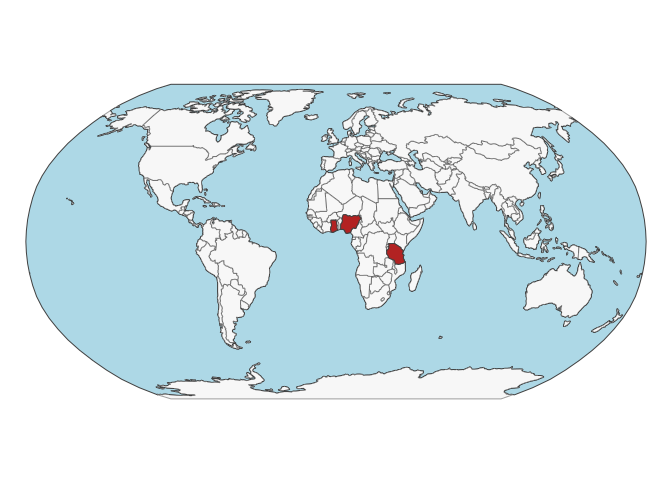
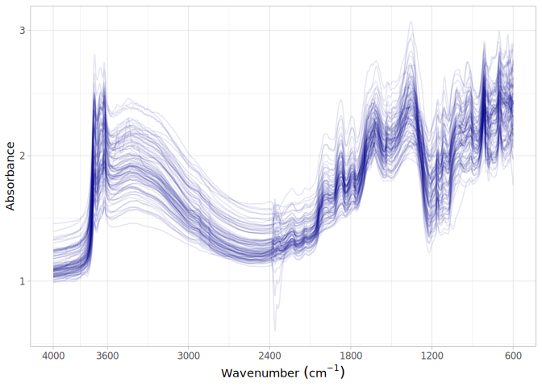

# Africa Soil Information Service Phase II (AFSIS2) prep
Jose L. Safanelli, Ran Zhi, Tomislav Hengl, Jonathan Sanderman

- [Original data](#original-data)
- [Data standardization to the OSSL
  format](#data-standardization-to-the-ossl-format)
  - [Site information](#site-information)
  - [Soil lab information (reference analytical
    data)](#soil-lab-information-reference-analytical-data)
  - [Mid-infrared spectra](#mid-infrared-spectra)
- [Quality control](#quality-control)
- [References](#references)

Code repository for standardizing and importing the ICRAF Soil and Plant
Spectroscopy Laboratory: Africa Soil Information Service Phase II, which
includes the National Soil Information Systems: TanSIS (Tanzania), NiSIS
(Nigeria) and GhanSIS (Ghana).

Website: [Soil Spectroscopy for Global
Good](https://soilspectroscopy.org)  
Development: <https://github.com/soilspectroscopy>  
Last update: 2026-05-17  
Additional documentation:

## Original data

Site data, soil lab data, and Mid-Infrared Spectra (MIR) from the ICRAF
Soil and Plant Spectroscopy Laboratory: Africa Soil Information Service
Phase II.

The three datasets are available from
<https://doi.org/10.34725/DVN/XUDGJY>,
<https://doi.org/10.34725/DVN/WLAKR2> and
<https://doi.org/10.34725/DVN/SPRSFN>.

Data has been analyzed at the ICRAF Soil-Plant Spectral Diagnostics
Laboratory, Nairobi, and the Rothamsted Research.

Coordinates for points are not provided and soil reference data is
available only for a limited subset of points.

Further information about the datasets can be found in Vågen,
Winowiecki, Neely, Chesterman, & Bourne ([2018](#ref-Vagen2018)) and
Hengl et al. ([2021](#ref-Hengl2021)).

Coordinates for TanSIS points are available with a different coding
system via <https://registry.opendata.aws/afsis/>.

Input datasets:  
- `glob2rx("*samples.csv")`: Separate csv files with site and soil
analytes.  
- `afsis_mir_2013`: folder with MIR soil spectral data.  
- `Calibration_MPA_NIR.csv`: VNIR soil spectral data.  

Directory/folder path with original files (not uploaded to GitHub).

``` r
# dir = "./"
dir = "~/mnt-ossl-private/database/datasets/AFSIS2/"
tic()
```

## Data standardization to the OSSL format

### Site information

``` r
sample.files <- list.files(dir, pattern = glob2rx("*samples.csv"), full.names = T)

samples <- sample.files %>%
  purrr::map_dfr(fread, header = TRUE)

# Importing AfSIS 1 to see if some site info is available
afsis1.geo <- fread(paste0(dir, "/AfSIS1_georeferences.csv"))
tansis.geo <- fread(paste0(dir, "/AfSIS2_TanSIS_georeferences.csv"))

afsis1.sitedata <- afsis1.geo %>%
  select(SSN, Latitude, Longitude, Depth,
         Scientist, Cluster, Plot, Site, Country, Region, Cultivated) %>%
  rename(id.layer_local_c = SSN,
         longitude.point_wgs84_dd = Longitude,
         latitude.point_wgs84_dd = Latitude,
         surveyor.title_utf8_txt = Scientist,
         site.cluster_src_id = Cluster,
         site.plot_src_id = Plot,
         site.name_src_txt = Site,
         site.cultivated_src_logical = Cultivated,
         loc.country_src_txt = Country,
         loc.region_src_txt = Region) %>%
  mutate(observation.date.begin_iso.8601_yyyy.mm.dd = lubridate::ymd("2011-01-01"),
         observation.date.end_iso.8601_yyyy.mm.dd = lubridate::ymd("2013-12-31")) %>%
  mutate(id.layer_local_c = as.character(id.layer_local_c),
         layer.upper.depth_usda_cm = ifelse(Depth == "top", 0, 20),
         layer.lower.depth_usda_cm = ifelse(Depth == "top", 20, 50),
         layer.sequence_usda_uint16 = ifelse(Depth == "top", 1, 2)) %>%
  select(-Depth)

tansis.sitedata <- tansis.geo %>%
  select(SSN, Latitude, Longitude, Depth,
         Scientist, Cluster, Plot, Site, Country, Region, Cultivated) %>%
  mutate(SSN = gsub("_|-", "", SSN)) %>%
  rename(id.layer_local_c = SSN,
         longitude.point_wgs84_dd = Longitude,
         latitude.point_wgs84_dd = Latitude,
         surveyor.title_utf8_txt = Scientist,
         site.cluster_src_id = Cluster,
         site.plot_src_id = Plot,
         site.name_src_txt = Site,
         site.cultivated_src_logical = Cultivated,
         loc.country_src_txt = Country,
         loc.region_src_txt = Region) %>%
  mutate(observation.date.begin_iso.8601_yyyy.mm.dd = lubridate::ymd("2018-01-01"),
         observation.date.end_iso.8601_yyyy.mm.dd = lubridate::ymd("2018-12-31")) %>%
  mutate(id.layer_local_c = as.character(id.layer_local_c)) %>%
  mutate(layer.upper.depth_usda_cm = ifelse(Depth == "top", 0, 20),
         layer.lower.depth_usda_cm = ifelse(Depth == "top", 20, 50),
         layer.sequence_usda_uint16 = ifelse(Depth == "top", 1, 2)) %>%
  select(-Depth)

# Removing unnecessary data
reference.files <- list.files(dir, pattern = glob2rx("*reference.csv"), full.names = T)

references <- reference.files %>%
  purrr::map_dfr(fread, header = TRUE) %>%
  mutate(SSN = str_to_upper(SSN))

reference.ids <- references %>%
  pull(SSN)

# Joining both datasets
afsis2.sitedata <- bind_rows(afsis1.sitedata, tansis.sitedata)

afsis2.sitedata <- samples %>%
  select(SSN, Country) %>%
  left_join(afsis2.sitedata, by = c("SSN" = "id.layer_local_c")) %>%
  mutate(SSN = str_to_upper(SSN)) %>%
  rename(id.layer_local_c = SSN,
         loc.country_src_txt2 = Country) %>%
  mutate(id.layer_local_c = as.character(id.layer_local_c)) %>%
  filter(id.layer_local_c %in% reference.ids) %>%
  mutate(observation.date.begin_iso.8601_yyyy.mm.dd = lubridate::ymd("2018-01-01"),
         observation.date.end_iso.8601_yyyy.mm.dd = lubridate::ymd("2018-12-31")) %>%
  # mutate(id.project_ascii_txt = "TanSIS, NiSIS and GhanSIS (AfSIS-II) SSL",
  #        layer.texture_usda_txt = "",
  #        pedon.taxa_usda_txt = "",
  #        horizon.designation_usda_txt = "",
  #        longitude.county_wgs84_dd = NA,
  #        latitude.county_wgs84_dd = NA,
  #        location.point.error_any_m = 30,
  #        location.country_iso.3166_txt = "",
  #        observation.ogc.schema.title_ogc_txt = "Open Soil Spectroscopy Library",
  #        observation.ogc.schema_idn_url = "https://soilspectroscopy.github.io",
  #        surveyor.title_utf8_txt = case_when(is.na(Country) ~ NA_character_,
  #                                            Country == "Ghana" ~ "Teteh, Francis (CSIR)",
  #                                            Country == "Nigeria" ~ "Vincent, Aduramigba-Modupe (Obafemi Awolowo University)",
  #                                            Country == "Tanzania" ~ "Meliyo, Joel (TARI)",
  #                                            TRUE ~ NA_character_),
  #        surveyor.contact_ietf_email = "afsis.info@africasoils.net",
  #        surveyor.address_utf8_txt = "ICRAF, PO Box 30677, Nairobi, 00100, Kenya",
  #        dataset.title_utf8_txt = "TanSIS, NiSIS and GhanSIS (AfSIS-II) SSL",
  #        dataset.owner_utf8_txt = "the World Agroforestry Centre (ICRAF) and Rothamsted Research (RRES)",
  #        dataset.code_ascii_txt = "AFSIS2.SSL",
  #        dataset.address_idn_url = "https://www.isric.org/explore/ISRIC-collections",
  #        dataset.doi_idf_url = case_when(is.na(Country) ~ NA_character_,
  #                                        Country == "Ghana" ~ "https://doi.org/10.34725/DVN/SPRSFN",
  #                                        Country == "Nigeria" ~ "https://doi.org/10.34725/DVN/WLAKR2",
  #                                        Country == "Tanzania" ~ "https://doi.org/10.34725/DVN/XUDGJY",
  #                                        TRUE ~ NA_character_),
  #        dataset.license.title_ascii_txt = "CC0",
  #        dataset.license.address_idn_url = "https://creativecommons.org/publicdomain/zero/1.0/",
  #        dataset.contact.name_utf8_txt = "Winowiecki, Leigh Ann (ICRAF)",
  #        dataset.contact_ietf_email = "L.A.WINOWIECKI@cgiar.org") %>%
  mutate(loc.country_src_txt = ifelse(is.na(loc.country_src_txt),
                                       loc.country_src_txt2,
                                       loc.country_src_txt)) %>%
  select(-loc.country_src_txt2) %>%
  mutate(dataset.code_ascii_txt = "AFSIS2",
         id.layer_uuid_txt = openssl::md5(paste0(dataset.code_ascii_txt, id.layer_local_c)),
         .before = 1) %>%
  mutate_at(vars(starts_with("id.")), as.character)

# Saving version to dataset root dir
site.exp.file = path(dir, "ossl_soilsite_v1.3")
readr::write_csv(afsis2.sitedata, str_c(site.exp.file, ".csv.gz"))
nanoparquet::write_parquet(afsis2.sitedata, str_c(site.exp.file, ".parquet"))
```

Plotting map:

``` r
data("World")

ocean <- ne_download(scale = 110, type = "ocean", category = "physical", returnclass = "sf")
```

    Reading 'ne_110m_ocean.zip' from naturalearth...

``` r
countries <- World[World$name %in% c("Ghana","Tanzania","Nigeria"), ]

tmap_mode("plot")
```

    ℹ tmap modes "plot" - "view"
    ℹ toggle with `tmap::ttm()`

``` r
tm_shape(ocean) +
  tm_polygons(fill = "lightblue", col = NA) +
  tm_shape(World) +
  tm_polygons(fill = "#f0f0f0", fill_alpha = 0.5, col_alpha = 0.5) +
  tm_shape(countries) +
  tm_polygons(fill = "firebrick") +
  tm_crs("ESRI:54030") +
  tm_layout(frame = FALSE)
```

    [tip] Consider a suitable map projection, e.g. by adding `+ tm_crs("auto")`.
    This message is displayed once per session.



### Soil lab information (reference analytical data)

NOTE: The code chunk below must be run just once for getting a template
for scripted column standardization. Just run once for getting the
original names of soil properties, descriptions, data types, and units.
Then upload to Google Sheet for editing and manually defining the rules
for integrating with the OSSL. Requires Google authentication. A copy of
the output file is saved to this folder for archiving purposes.

**Always leave the sheet name as TEMP to avoid overwritting, then rename
online to download locally.**

``` r
# Getting soillab original variables
variables.files = list.files(dir, glob2rx("0Variables Description*"),
                             full.names=TRUE, recursive = TRUE)
variables.files

# GhanSIS
readxl::excel_sheets(grep("GhanSIS", variables.files, value = T))
variables.names.GhanSIS <- readxl::read_xlsx(grep("GhanSIS", variables.files, value = T),sheet = 1)

# NiSIS
readxl::excel_sheets(grep("NiSIS", variables.files, value = T))
variables.names.NiSIS <- readxl::read_xlsx(grep("NiSIS", variables.files, value = T),sheet = 1)

# TanSIS
readxl::excel_sheets(grep("TanSIS", variables.files, value = T))
variables.names.TanSIS <- readxl::read_xlsx(grep("TanSIS", variables.files, value = T),sheet = 1)
names(variables.names.TanSIS)

# They all have the same soil properties
soillab.names <- variables.names.TanSIS %>%
  dplyr::mutate(table = "GhanSIS;NiSIS;TanSIS", .before = 1) %>%
  dplyr::rename(original_name = `variable name`, original_description = `variable description`,
                units = Units) %>%
  dplyr::mutate(comment = paste0(`method used`, "; ", `instrument used for analysis`)) %>%
  dplyr::select(table, original_name, original_description, units, comment) %>%
  dplyr::mutate(import = '', ossl_name = '', .after = original_name)

readr::write_csv(soillab.names, paste0(getwd(), "/afsis2_soillab_names.csv"))

# Uploading to google sheet

# FACT CIN folder. Get ID for soildata importing table
googledrive::drive_ls(as_id("0AHDIWmLAj40_Uk9PVA"))

OSSL.soildata.importing <- "19LeILz9AEnKVK7GK0ZbK3CCr2RfeP-gSWn5VpY8ETVM"

# Checking metadata
googlesheets4::as_sheets_id(OSSL.soildata.importing)

# Checking readme
googlesheets4::read_sheet(OSSL.soildata.importing, sheet = 'readme')

# Preparing soillab.names
upload <- dplyr::as_tibble(soillab.names)

# Uploading
googlesheets4::write_sheet(upload, ss = OSSL.soildata.importing, sheet = "AFSIS2")

# Checking metadata
googlesheets4::as_sheets_id(OSSL.soildata.importing)
```

NOTE: The code chunk below must be run just once. Run for getting the
column standardization rules after editing online on Google Sheets. A
copy of the edited standardization template is saved to this dataset
folder.

``` r
# Downloading from google sheet

# Checking metadata
googlesheets4::as_sheets_id("1mWTDJDuMp4oObcCxAy9gofSkrkcSWWf1TtEW2SuC1es")

# Preparing soillab.names
transvalues <- googlesheets4::read_sheet("1mWTDJDuMp4oObcCxAy9gofSkrkcSWWf1TtEW2SuC1es",
                                         sheet = "AFSIS2")

# Saving to folder
write_csv(transvalues, path(getwd(), "soillab_standardized_names.csv"))
```

Reading standardization rules:

``` r
transvalues <- read_csv(path(getwd(), "soillab_standardized_names.csv"),
                        show_col_types = F) %>%
  filter(import == TRUE) %>%
  select(contains(c("table", "id", "original_name", "ossl_")))

knitr::kable(transvalues)
```

| table | original_name | ossl_abbrev | ossl_method | ossl_unit | ossl_convert | ossl_name |
|:---|:---|:---|:---|:---|:---|:---|
| GhanSIS;NiSIS;TanSIS | pH | ph.h2o | usda.a268 | index | ifelse(as.numeric(x) \< 0, NA, as.numeric(x)\*1) | ph.h2o_usda.a268_index |
| GhanSIS;NiSIS;TanSIS | m3.Al | al.ext | usda.a1056 | mg.kg | ifelse(as.numeric(x) \< 0, NA, as.numeric(x)\*1) | al.ext_usda.a1056_mg.kg |
| GhanSIS;NiSIS;TanSIS | m3.B | b.ext | mel3 | mg.kg | ifelse(as.numeric(x) \< 0, NA, as.numeric(x)\*1) | b.ext_mel3_mg.kg |
| GhanSIS;NiSIS;TanSIS | m3.Ca | ca.ext | usda.a1059 | mg.kg | ifelse(as.numeric(x) \< 0, NA, as.numeric(x)\*1) | ca.ext_usda.a1059_mg.kg |
| GhanSIS;NiSIS;TanSIS | m3.Cu | cu.ext | usda.a1063 | mg.kg | ifelse(as.numeric(x) \< 0, NA, as.numeric(x)\*1) | cu.ext_usda.a1063_mg.kg |
| GhanSIS;NiSIS;TanSIS | m3.Fe | fe.ext | usda.a1064 | mg.kg | ifelse(as.numeric(x) \< 0, NA, as.numeric(x)\*1) | fe.ext_usda.a1064_mg.kg |
| GhanSIS;NiSIS;TanSIS | m3.K | k.ext | usda.a1065 | mg.kg | ifelse(as.numeric(x) \< 0, NA, as.numeric(x)\*1) | k.ext_usda.a1065_mg.kg |
| GhanSIS;NiSIS;TanSIS | m3.Mg | mg.ext | usda.a1066 | mg.kg | ifelse(as.numeric(x) \< 0, NA, as.numeric(x)\*1) | mg.ext_usda.a1066_mg.kg |
| GhanSIS;NiSIS;TanSIS | m3.Mn | mn.ext | usda.a1067 | mg.kg | ifelse(as.numeric(x) \< 0, NA, as.numeric(x)\*1) | mn.ext_usda.a1067_mg.kg |
| GhanSIS;NiSIS;TanSIS | m3.S | s.ext | mel3 | mg.kg | ifelse(as.numeric(x) \< 0, NA, as.numeric(x)\*1) | s.ext_mel3_mg.kg |
| GhanSIS;NiSIS;TanSIS | m3.Zn | zn.ext | usda.a1073 | mg.kg | ifelse(as.numeric(x) \< 0, NA, as.numeric(x)\*1) | zn.ext_usda.a1073_mg.kg |
| GhanSIS;NiSIS;TanSIS | N | n.tot | usda.a623 | w.pct | ifelse(as.numeric(x) \< 0, NA, as.numeric(x)\*1) | n.tot_usda.a623_w.pct |
| GhanSIS;NiSIS;TanSIS | TC | c.tot | usda.a622 | w.pct | ifelse(as.numeric(x) \< 0, NA, as.numeric(x)\*1) | c.tot_usda.a622_w.pct |
| GhanSIS;NiSIS;TanSIS | SOC | oc | usda.c1059 | w.pct | ifelse(as.numeric(x) \< 0, NA, as.numeric(x)\*1) | oc_usda.c1059_w.pct |

Standardizing soil data to the OSSL format:

``` r
reference.files <- list.files(dir, pattern = glob2rx("*reference.csv"), full.names = T)

afsis2.reference <- reference.files %>%
  purrr::map_dfr(fread, header = TRUE)

# Harmonization of names and units
analytes.old.names <- transvalues %>%
  filter(table == "GhanSIS;NiSIS;TanSIS") %>%
  pull(original_name)

analytes.new.names <- transvalues %>%
  filter(table == "GhanSIS;NiSIS;TanSIS") %>%
  pull(ossl_name)

# Selecting and renaming
afsis2.soildata <- afsis2.reference %>%
  rename(id.layer_local_c = SSN) %>%
  mutate(id.layer_local_c = as.character(id.layer_local_c)) %>%
  select(id.layer_local_c, all_of(analytes.old.names)) %>%
  rename_with(~analytes.new.names, all_of(analytes.old.names)) %>%
  as.data.frame()

# Removing duplicates
# afsis2.soildata %>%
#   group_by(id.layer_local_c) %>%
#   summarise(repeats = n()) %>%
#   group_by(repeats) %>%
#   summarise(count = n())

# Getting the formulas
functions.list <- transvalues %>%
  filter(table == "GhanSIS;NiSIS;TanSIS") %>%
  mutate(ossl_name = factor(ossl_name, levels = names(afsis2.soildata))) %>%
  arrange(ossl_name) %>%
  pull(ossl_convert) %>%
  c("x", .)

# Applying transformation rules
afsis2.soildata.trans <- transform_values(df = afsis2.soildata,
                                          out.name = names(afsis2.soildata),
                                          in.name = names(afsis2.soildata),
                                          fun.lst = functions.list)

# Final soillab data
afsis2.soildata <- afsis2.soildata.trans %>%
  mutate_at(vars(starts_with("id.")), as.character)

# Checking total number of observations
afsis2.soildata %>%
  distinct(id.layer_local_c) %>%
  summarise(count = n())
```

      count
    1   819

``` r
# Saving version to dataset root dir
soillab.exp.file = path(dir, "ossl_soillab_v1.3")
readr::write_csv(afsis2.soildata, str_c(soillab.exp.file, ".csv.gz"))
nanoparquet::write_parquet(afsis2.soildata, str_c(soillab.exp.file, ".parquet"))
```

Soil lab data summary.

``` r
afsis2.soildata %>%
  mutate(id.layer_local_c = factor(id.layer_local_c)) %>%
  skimr::skim() %>%
  dplyr::select(-numeric.hist, -complete_rate)
```

|                                                  |            |
|:-------------------------------------------------|:-----------|
| Name                                             | Piped data |
| Number of rows                                   | 819        |
| Number of columns                                | 15         |
| \_\_\_\_\_\_\_\_\_\_\_\_\_\_\_\_\_\_\_\_\_\_\_   |            |
| Column type frequency:                           |            |
| factor                                           | 1          |
| numeric                                          | 14         |
| \_\_\_\_\_\_\_\_\_\_\_\_\_\_\_\_\_\_\_\_\_\_\_\_ |            |
| Group variables                                  | None       |

Data summary

**Variable type: factor**

| skim_variable    | n_missing | ordered | n_unique | top_counts                     |
|:-----------------|----------:|:--------|---------:|:-------------------------------|
| id.layer_local_c |         0 | FALSE   |      819 | GHB: 1, GHB: 1, GHB: 1, GHB: 1 |

**Variable type: numeric**

| skim_variable | n_missing | mean | sd | p0 | p25 | p50 | p75 | p100 |
|:---|---:|---:|---:|---:|---:|---:|---:|---:|
| ph.h2o_usda.a268_index | 11 | 6.31 | 0.80 | 4.10 | 5.80 | 6.34 | 6.76 | 8.72 |
| al.ext_usda.a1056_mg.kg | 1 | 766.22 | 321.64 | 18.00 | 521.25 | 769.50 | 956.00 | 1851.00 |
| b.ext_mel3_mg.kg | 526 | 1.79 | 0.70 | 0.30 | 1.00 | 2.00 | 2.00 | 4.00 |
| ca.ext_usda.a1059_mg.kg | 1 | 1484.03 | 1801.00 | 12.00 | 404.00 | 858.50 | 1961.50 | 21565.00 |
| cu.ext_usda.a1063_mg.kg | 15 | 2.22 | 2.41 | 0.03 | 0.53 | 1.40 | 3.16 | 18.19 |
| fe.ext_usda.a1064_mg.kg | 1 | 123.62 | 77.15 | 13.20 | 78.10 | 103.05 | 145.65 | 578.00 |
| k.ext_usda.a1065_mg.kg | 2 | 280.76 | 426.69 | 5.00 | 51.00 | 125.00 | 316.00 | 3600.00 |
| mg.ext_usda.a1066_mg.kg | 1 | 304.29 | 365.74 | 2.00 | 89.00 | 190.00 | 368.75 | 3241.00 |
| mn.ext_usda.a1067_mg.kg | 1 | 154.51 | 120.37 | 0.70 | 58.70 | 129.55 | 225.90 | 741.10 |
| s.ext_mel3_mg.kg | 9 | 8.57 | 18.51 | 1.00 | 3.00 | 5.00 | 8.00 | 266.00 |
| zn.ext_usda.a1073_mg.kg | 29 | 1.79 | 3.17 | 0.06 | 0.40 | 0.90 | 2.10 | 48.79 |
| n.tot_usda.a623_w.pct | 0 | 0.10 | 0.08 | 0.01 | 0.05 | 0.08 | 0.13 | 0.53 |
| c.tot_usda.a622_w.pct | 0 | 1.28 | 1.04 | 0.10 | 0.58 | 0.99 | 1.66 | 7.15 |
| oc_usda.c1059_w.pct | 0 | 1.26 | 1.01 | 0.10 | 0.58 | 0.99 | 1.62 | 7.09 |

### Mid-infrared spectra

``` r
# Floating wavenumbers
mir.files <- list.files(dir, pattern = glob2rx("*_ZnSe_*.csv$"), full.names = T)

mir.scans <- mir.files %>%
  purrr::map_dfr(fread, header = TRUE, colClasses = 'character')
```

    Warning in .f(.x[[i]], ...): Stopped early on line 3825. Expected 1713 fields
    but found 2. Consider fill=TRUE. First discarded non-empty line:
    <<,TanSISTOPWVs5NHbs>>

``` r
# # Some prefixes are either wrong or shuffled for anonimity
# mir.scans %>%
#   mutate(prefix = str_sub(SSN, 1, 7)) %>%
#   distinct(prefix)
# 
# mir.scans.ids <- mir.scans %>%
#   select(SSN) %>%
#   mutate(SSN = str_to_upper(SSN)) %>%
#   mutate(SSN = gsub("_|-", "", SSN)) %>%
#   mutate(SSN = gsub(" ", "", SSN)) %>%
#   mutate(SSN = gsub("\\b(ASAG)", "TANSIS", SSN)) %>%
#   mutate(SSN = gsub("\\b(ANSIS)", "TANSIS", SSN)) %>%
#   mutate(SSN = gsub("\\b(ANSAG)", "TANSIS", SSN)) %>%
#   mutate(SSN = gsub("\\b(TASAG)", "TANSIS", SSN)) %>%
#   mutate(SSN = gsub("\\b(TANSAG)", "TANSIS", SSN)) %>%
#   mutate(prefix = str_sub(SSN, 1, -9),
#          sufix = str_sub(SSN, -8, -1))
# 
# mir.scans.ids %>%
#   mutate(prefix = str_sub(SSN, 1, 6)) %>%
#   distinct(prefix)
# 
# soildata.ids <- afsis2.soildata %>%
#   select(id.layer_local_c) %>%
#   mutate(id.layer_local_c = str_to_upper(id.layer_local_c)) %>%
#   mutate(prefix = str_sub(id.layer_local_c, 1, -9),
#          sufix = str_sub(id.layer_local_c, -8, -1))
# 
# soilsite.ids <- afsis2.sitedata %>%
#   select(id.layer_local_c) %>%
#   mutate(id.layer_local_c = str_to_upper(id.layer_local_c)) %>%
#   mutate(prefix = str_sub(id.layer_local_c, 1, -9),
#          sufix = str_sub(id.layer_local_c, -8, -1))
# 
# table(soildata.ids$sufix %in% mir.scans.ids$sufix)
# table(soilsite.ids$sufix %in% mir.scans.ids$sufix)
# table(soildata.ids$sufix %in% soilsite.ids$sufix)
# table(soildata.ids$id.layer_local_c %in% soilsite.ids$id.layer_local_c)

mir.scans <- mir.scans %>%
  mutate(SSN = str_to_upper(SSN))

old.names <- names(mir.scans)
new.names <- gsub("X", "", old.names)

afsis2.mir <- mir.scans %>%
  rename_with(~new.names, all_of(old.names)) %>%
  rename(id.layer_local_c = SSN) %>%
  mutate(id.layer_local_c = as.character(id.layer_local_c)) %>%
  mutate(across(-id.layer_local_c, ~as.numeric(.x)))

# Need to resample spectra
old.wavenumber <- na.omit(as.numeric(names(afsis2.mir)))
```

    Warning in na.omit(as.numeric(names(afsis2.mir))): NAs introduced by coercion

``` r
new.wavenumbers <- rev(seq(600, 4000, by = 2))

afsis2.mir <- afsis2.mir %>%
  select(-id.layer_local_c) %>%
  as.matrix() %>%
  prospectr::resample(X = ., wav = old.wavenumber,
                      new.wav = new.wavenumbers, interpol = "spline") %>%
  as_tibble() %>%
  bind_cols({afsis2.mir %>%
      select(id.layer_local_c)}, .) %>%
  select(id.layer_local_c, as.character(rev(new.wavenumbers)))

# Gaps
scans.na.gaps <- afsis2.mir %>%
  select(-id.layer_local_c) %>%
  apply(., 1, function(x) round(100*(sum(is.na(x)))/(length(x)), 2)) %>%
  tibble(proportion_NA = .) %>%
  bind_cols({afsis2.mir %>% select(id.layer_local_c)}, .)

# Extreme negative - irreversible erratic patterns
scans.extreme.neg <- afsis2.mir %>%
  select(-id.layer_local_c) %>%
  apply(., 1, function(x) {round(100*(sum(x < -1, na.rm=TRUE))/(length(x)), 2)}) %>%
  tibble(proportion_lower0 = .) %>%
  bind_cols({afsis2.mir %>% select(id.layer_local_c)}, .)

# Extreme positive, irreversible erratic patterns
scans.extreme.pos <- afsis2.mir %>%
  select(-id.layer_local_c) %>%
  apply(., 1, function(x) {round(100*(sum(x > 5, na.rm=TRUE))/(length(x)), 2)}) %>%
  tibble(proportion_higherAbs5 = .) %>%
  bind_cols({afsis2.mir %>% select(id.layer_local_c)}, .)

# Consistency summary - problematic scans
scans.summary <- scans.na.gaps %>%
  left_join(scans.extreme.neg, by = "id.layer_local_c") %>%
  left_join(scans.extreme.pos, by = "id.layer_local_c")

scans.summary %>%
  select(-id.layer_local_c) %>%
  pivot_longer(everything(), names_to = "check", values_to = "value") %>%
  filter(value > 0) %>%
  group_by(check) %>%
  summarise(count = n())
```

    # A tibble: 0 × 2
    # ℹ 2 variables: check <chr>, count <int>

``` r
# Renaming
old.wavenumbers <- seq(600, 4000, by = 2)
new.wavenumbers <- paste0("scan_mir.", old.wavenumbers, "_abs")

afsis2.mir <- afsis2.mir %>%
  rename_with(~new.wavenumbers, all_of(as.character(old.wavenumbers)))

# # Preparing metadata
# afsis2.mir.metadata <- afsis2.mir %>%
#   select(id.layer_local_c) %>%
#   mutate(id.scan_local_c = id.layer_local_c) %>%
#   mutate(scan.mir.date.begin_iso.8601_yyyy.mm.dd = ymd("2019-01-01"),
#          scan.mir.date.end_iso.8601_yyyy.mm.dd = ymd("2019-12-31"),
#          scan.mir.model.name_utf8_txt = "Bruker Alpha 1 ZnSe",
#          scan.mir.model.code_any_txt = "Bruker_Alpha_1_ZnSe",
#          scan.mir.method.optics_any_txt = "",
#          scan.mir.method.preparation_any_txt = "",
#          scan.mir.license.title_ascii_txt = "CC0",
#          scan.mir.license.address_idn_url = "https://creativecommons.org/publicdomain/zero/1.0/",
#          scan.mir.doi_idf_url = "https://doi.org/10.34725/DVN/XUDGJY",
#          scan.mir.contact.name_utf8_txt = "Winowiecki, Leigh Ann (ICRAF)",
#          scan.mir.contact.email_ietf_txt = "L.A.WINOWIECKI@cgiar.org")

# # Final preparation
# afsis2.mir.export <- afsis2.mir.metadata %>%
#   left_join(afsis2.mir, by = "id.layer_local_c") %>%
#   mutate_at(vars(starts_with("id.")), as.character)

# Saving version to dataset root dir
afsis2.mir.export <- afsis2.mir

mir.exp.file = path(dir, "ossl_mir_v1.3")
readr::write_csv(afsis2.mir.export, str_c(mir.exp.file, ".csv.gz"))
nanoparquet::write_parquet(afsis2.mir.export, str_c(mir.exp.file, ".parquet"))
```

## Quality control

The final table must be joined as follows:

- MIR is used as first reference for pairing with soil data.
- Soil lab data are left joined to MIR. This drop data without any
  available scan.

The availability of data is summarized below:

``` r
# Taking a few representative columns for checking the consistency of joins
afsis2.availability <- afsis2.mir.export %>%
  select(id.layer_local_c, scan_mir.800_abs) %>%
  left_join(afsis2.soildata, by = "id.layer_local_c") %>%
  filter(!is.na(id.layer_local_c))

# Availability of information from afsis2
afsis2.availability %>%
  mutate_all(as.character) %>%
  pivot_longer(everything(), names_to = "column", values_to = "value") %>%
  filter(!is.na(value)) %>%
  group_by(column) %>%
  summarise(count = n())
```

    # A tibble: 16 × 2
       column                  count
       <chr>                   <int>
     1 al.ext_usda.a1056_mg.kg   151
     2 b.ext_mel3_mg.kg            7
     3 c.tot_usda.a622_w.pct     151
     4 ca.ext_usda.a1059_mg.kg   151
     5 cu.ext_usda.a1063_mg.kg   150
     6 fe.ext_usda.a1064_mg.kg   151
     7 id.layer_local_c         8382
     8 k.ext_usda.a1065_mg.kg    150
     9 mg.ext_usda.a1066_mg.kg   151
    10 mn.ext_usda.a1067_mg.kg   151
    11 n.tot_usda.a623_w.pct     151
    12 oc_usda.c1059_w.pct       151
    13 ph.h2o_usda.a268_index    151
    14 s.ext_mel3_mg.kg          151
    15 scan_mir.800_abs         8382
    16 zn.ext_usda.a1073_mg.kg   138

``` r
# Repeats check - Duplicates are dropped
afsis2.availability %>%
  mutate_all(as.character) %>%
  select(id.layer_local_c) %>%
  pivot_longer(everything(), names_to = "column", values_to = "value") %>%
  group_by(column, value) %>%
  summarise(repeats = n()) %>%
  group_by(column, repeats) %>%
  summarise(count = n())
```

    `summarise()` has grouped output by 'column'. You can override using the
    `.groups` argument.
    `summarise()` has grouped output by 'column'. You can override using the
    `.groups` argument.

    # A tibble: 1 × 3
    # Groups:   column [1]
      column           repeats count
      <chr>              <int> <int>
    1 id.layer_local_c       1  8382

MIR spectral visualization (100 random spectra):

``` r
set.seed(42)
afsis2.mir %>%
  sample_n(100) %>%
  select(all_of(c("id.layer_local_c")), starts_with("scan_mir.")) %>%
  tidyr::pivot_longer(-all_of(c("id.layer_local_c")),
                      names_to = "wavenumber", values_to = "absorbance") %>%
  dplyr::mutate(wavenumber = gsub("scan_mir.|_abs", "", wavenumber)) %>%
  dplyr::mutate(wavenumber = as.numeric(wavenumber)) %>%
  ggplot(aes(x = wavenumber, y = absorbance, group = id.layer_local_c)) +
  geom_line(alpha = 0.1, color = "darkblue") +
  scale_x_continuous(breaks = c(600, 1200, 1800, 2400, 3000, 3600, 4000),
                     transform = "reverse") +
  labs(x = bquote("Wavenumber"~(cm^-1)), y = "Absorbance") +
  theme_light()
```



``` r
toc()
```

    88.031 sec elapsed

``` r
rm(list = ls())
gc()
```

               used  (Mb) gc trigger   (Mb)  max used   (Mb)
    Ncells  6423750 343.1   19822746 1058.7  18977846 1013.6
    Vcells 15299934 116.8  130426245  995.1 163032806 1243.9

## References

<div id="refs" class="references csl-bib-body hanging-indent"
entry-spacing="0" line-spacing="2">

<div id="ref-Hengl2021" class="csl-entry">

Hengl, T., Miller, M. A. E., Križan, J., Shepherd, K. D., Sila, A.,
Kilibarda, M., … Crouch, J. (2021). African soil properties and
nutrients mapped at 30 m spatial resolution using two-scale ensemble
machine learning. *Scientific Reports*, *11*(1).
doi:[10.1038/s41598-021-85639-y](https://doi.org/10.1038/s41598-021-85639-y)

</div>

<div id="ref-Vagen2018" class="csl-entry">

Vågen, T.-G., Winowiecki, L. A., Neely, C., Chesterman, S., & Bourne, M.
(2018). Spatial assessments of soil organic carbon for stakeholder
decision-making – a case study from kenya. *SOIL*, *4*(4), 259–266.
doi:[10.5194/soil-4-259-2018](https://doi.org/10.5194/soil-4-259-2018)

</div>

</div>
