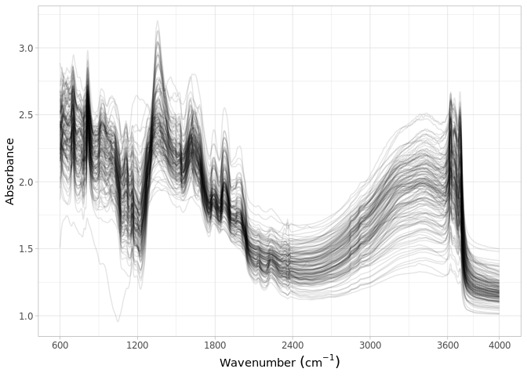

Dataset import: TanSIS, NiSIS and GhanSIS (AfSIS-II) SSL
================
Jose Lucas Safanelli (<jsafanelli@woodwellclimate.org>), Tomislav Hengl
(<tom.hengl@opengeohub.org>), Jonathan Sanderman
(<jsanderman@woodwellclimate.org>) -
06 December, 2022


-   [TanSIS, NiSIS and GhanSIS inputs](#tansis-nisis-and-ghansis-inputs)
-   [Data import](#data-import)
    -   [Soil site information](#soil-site-information)
    -   [Soil lab information](#soil-lab-information)
    -   [Mid-infrared spectroscopy
        data](#mid-infrared-spectroscopy-data)
    -   [Quality control](#quality-control)
-   [References](#references)

[](https://soilspectroscopy.org/)

[](http://creativecommons.org/licenses/by-sa/4.0/)

This work is licensed under a [Creative Commons Attribution-ShareAlike
4.0 International
License](http://creativecommons.org/licenses/by-sa/4.0/).

## TanSIS, NiSIS and GhanSIS inputs

Part of: <https://github.com/soilspectroscopy>  
Project: [Soil Spectroscopy for Global
Good](https://soilspectroscopy.org)  
Last update: 2022-12-06  
Dataset:
[AFSIS2.SSL](https://soilspectroscopy.github.io/ossl-manual/soil-spectroscopy-tools-and-users.html#afsis2.ssl)

Mid-Infrared Spectra (MIRS) from AfSIS2 Soil and Plant Spectroscopy
Laboratory, which are the national Soil Information Systems: TanSIS
(Tanzania), NiSIS (Nigeria) and GhanSIS (Ghana).

The three datasets are available from
<https://doi.org/10.34725/DVN/XUDGJY>,
<https://doi.org/10.34725/DVN/WLAKR2> and
<https://doi.org/10.34725/DVN/SPRSFN>. Documentation of the datasets is
available in [Hengl et al.](#ref-hengl2021african)
([2021](#ref-hengl2021african)). Data has been analyzed at the ICRAF
Soil-Plant Spectral Diagnostics Laboratory, Nairobi, and the Rothamsted
Research. Coordinates for points are not provided and soil reference
data is available only for a limited subset of points. Coordinates for
TanSIS points are available with a different coding system via
<https://registry.opendata.aws/afsis/>. From the 31,269 soil scans only
820 (2.6%) have reference data.

Input datasets:  
- `glob2rx("*samples.csv")`: Separate csv files with site and soil
analytes;  
- `afsis_mir_2013`: folder with MIR soil spectral data;  
- `Calibration_MPA_NIR.csv`: VNIR soil spectral data;

Directory/folder path:

``` r
dir = "/mnt/soilspec4gg/ossl/dataset/AFSIS2/"
tic()
```

## Data import

### Soil site information

``` r
sample.files <- list.files(dir, pattern = glob2rx("*samples.csv"), full.names = T)

samples <- sample.files %>%
  purrr::map_dfr(fread, header = TRUE)

# Importing AfSIS 1 to see if some site info is available
afsis1.geo <- fread(paste0(dir, "/AfSIS1_georeferences.csv"))
tansis.geo <- fread(paste0(dir, "/AfSIS2_TanSIS_georeferences.csv"))

afsis1.geo <- afsis1.geo %>%
  select(SSN, Latitude, Longitude, Depth, Scientist) %>%
  rename(id.layer_local_c = SSN,
         longitude.point_wgs84_dd = Longitude,
         latitude.point_wgs84_dd = Latitude,
         surveyor.title_utf8_txt = Scientist) %>%
  mutate(id.layer_local_c = as.character(id.layer_local_c)) %>%
  mutate(layer.upper.depth_usda_cm = ifelse(Depth == "top", 0, 20),
         layer.lower.depth_usda_cm = ifelse(Depth == "top", 20, 50),
         layer.sequence_usda_uint16 = ifelse(Depth == "top", 1, 2)) %>%
  mutate(observation.date.begin_iso.8601_yyyy.mm.dd = lubridate::ymd("2011-01-01"),
         observation.date.end_iso.8601_yyyy.mm.dd = lubridate::ymd("2013-12-31")) %>%
  select(id.layer_local_c, longitude.point_wgs84_dd, latitude.point_wgs84_dd,
         layer.sequence_usda_uint16, layer.upper.depth_usda_cm, layer.lower.depth_usda_cm,
         observation.date.begin_iso.8601_yyyy.mm.dd, observation.date.end_iso.8601_yyyy.mm.dd,
         surveyor.title_utf8_txt)

tansis.geo <- tansis.geo %>%
  select(SSN, Latitude, Longitude, Depth, Scientist) %>%
  mutate(SSN = gsub("_|-", "", SSN)) %>%
  rename(id.layer_local_c = SSN,
         longitude.point_wgs84_dd = Longitude,
         latitude.point_wgs84_dd = Latitude,
         surveyor.title_utf8_txt = Scientist) %>%
  mutate(id.layer_local_c = as.character(id.layer_local_c)) %>%
  mutate(layer.upper.depth_usda_cm = ifelse(Depth == "top", 0, 20),
         layer.lower.depth_usda_cm = ifelse(Depth == "top", 20, 50),
         layer.sequence_usda_uint16 = ifelse(Depth == "top", 1, 2)) %>%
  mutate(observation.date.begin_iso.8601_yyyy.mm.dd = lubridate::ymd("2018-01-01"),
         observation.date.end_iso.8601_yyyy.mm.dd = lubridate::ymd("2018-12-31")) %>%
  select(id.layer_local_c, longitude.point_wgs84_dd, latitude.point_wgs84_dd,
         layer.sequence_usda_uint16, layer.upper.depth_usda_cm, layer.lower.depth_usda_cm,
         observation.date.begin_iso.8601_yyyy.mm.dd, observation.date.end_iso.8601_yyyy.mm.dd,
         surveyor.title_utf8_txt)

# Removing unnecessary data
reference.files <- list.files(dir, pattern = glob2rx("*reference.csv"), full.names = T)

references <- reference.files %>%
  purrr::map_dfr(fread, header = TRUE) %>%
  mutate(SSN = str_to_upper(SSN))

reference.ids <- references %>%
  pull(SSN)

# Joining both datasets
afsis2.geo <- bind_rows(afsis1.geo, tansis.geo)

afsis2.sitedata <- samples %>%
  select(SSN, Country) %>%
  left_join(afsis2.geo, by = c("SSN" = "id.layer_local_c")) %>%
  mutate(SSN = str_to_upper(SSN)) %>%
  rename(id.layer_local_c = SSN) %>%
  mutate(id.layer_local_c = as.character(id.layer_local_c)) %>%
  filter(id.layer_local_c %in% reference.ids) %>%
  mutate(observation.date.begin_iso.8601_yyyy.mm.dd = lubridate::ymd("2018-01-01"),
         observation.date.end_iso.8601_yyyy.mm.dd = lubridate::ymd("2018-12-31")) %>%
  mutate(id.project_ascii_txt = "TanSIS, NiSIS and GhanSIS (AfSIS-II) SSL",
         id.layer_uuid_txt = openssl::md5(as.character(id.layer_local_c)),
         id.location_olc_txt = olctools::encode_olc(latitude.point_wgs84_dd, longitude.point_wgs84_dd, 10),
         layer.texture_usda_txt = "",
         pedon.taxa_usda_txt = "",
         horizon.designation_usda_txt = "",
         longitude.county_wgs84_dd = NA,
         latitude.county_wgs84_dd = NA,
         location.point.error_any_m = 30,
         location.country_iso.3166_txt = "",
         observation.ogc.schema.title_ogc_txt = "Open Soil Spectroscopy Library",
         observation.ogc.schema_idn_url = "https://soilspectroscopy.github.io",
         surveyor.title_utf8_txt = case_when(is.na(Country) ~ NA_character_,
                                             Country == "Ghana" ~ "Teteh, Francis (CSIR)",
                                             Country == "Nigeria" ~ "Vincent, Aduramigba-Modupe (Obafemi Awolowo University)",
                                             Country == "Tanzania" ~ "Meliyo, Joel (TARI)",
                                             TRUE ~ NA_character_),
         surveyor.contact_ietf_email = "afsis.info@africasoils.net",
         surveyor.address_utf8_txt = "ICRAF, PO Box 30677, Nairobi, 00100, Kenya",
         dataset.title_utf8_txt = "TanSIS, NiSIS and GhanSIS (AfSIS-II) SSL",
         dataset.owner_utf8_txt = "the World Agroforestry Centre (ICRAF) and Rothamsted Research (RRES)",
         dataset.code_ascii_txt = "AFSIS2.SSL",
         dataset.address_idn_url = "https://www.isric.org/explore/ISRIC-collections",
         dataset.doi_idf_url = case_when(is.na(Country) ~ NA_character_,
                                         Country == "Ghana" ~ "https://doi.org/10.34725/DVN/SPRSFN",
                                         Country == "Nigeria" ~ "https://doi.org/10.34725/DVN/WLAKR2",
                                         Country == "Tanzania" ~ "https://doi.org/10.34725/DVN/XUDGJY",
                                         TRUE ~ NA_character_),
         dataset.license.title_ascii_txt = "CC0",
         dataset.license.address_idn_url = "https://creativecommons.org/publicdomain/zero/1.0/",
         dataset.contact.name_utf8_txt = "Winowiecki, Leigh Ann (ICRAF)",
         dataset.contact_ietf_email = "L.A.WINOWIECKI@cgiar.org") %>%
  select(-Country) %>%
  mutate_at(vars(starts_with("id.")), as.character)

# Saving version to dataset root dir
site.qs = paste0(dir, "/ossl_soilsite_v1.2.qs")
qs::qsave(afsis2.sitedata, site.qs, preset = "high")
```

### Soil lab information

NOTE: The code chunk below this paragraph is hidden. Just run once for
getting the original names of soil properties, descriptions, data types,
and units. Run once and upload to Google Sheet for formatting and
integrating with the OSSL. Requires Google authentication.

<!-- ```{r, eval=FALSE, echo=TRUE} -->
<!-- # Getting soillab original variables -->
<!-- variables.files = list.files(dir, glob2rx("0Variables Description*"), full.names=TRUE, recursive = TRUE) -->
<!-- variables.files -->
<!-- # GhanSIS -->
<!-- readxl::excel_sheets(grep("GhanSIS", variables.files, value = T)) -->
<!-- variables.names.GhanSIS <- readxl::read_xlsx(grep("GhanSIS", variables.files, value = T),sheet = 1) -->
<!-- # NiSIS -->
<!-- readxl::excel_sheets(grep("NiSIS", variables.files, value = T)) -->
<!-- variables.names.NiSIS <- readxl::read_xlsx(grep("NiSIS", variables.files, value = T),sheet = 1) -->
<!-- # TanSIS -->
<!-- readxl::excel_sheets(grep("TanSIS", variables.files, value = T)) -->
<!-- variables.names.TanSIS <- readxl::read_xlsx(grep("TanSIS", variables.files, value = T),sheet = 1) -->
<!-- names(variables.names.TanSIS) -->
<!-- # They all have the same soil properties -->
<!-- soillab.names <- variables.names.TanSIS %>% -->
<!--   dplyr::mutate(table = "GhanSIS;NiSIS;TanSIS", .before = 1) %>% -->
<!--   dplyr::rename(original_name = `variable name`, original_description = `variable description`, -->
<!--                 units = Units) %>% -->
<!--   dplyr::mutate(comment = paste0(`method used`, "; ", `instrument used for analysis`)) %>% -->
<!--   dplyr::select(table, original_name, original_description, units, comment) %>% -->
<!--   dplyr::mutate(import = '', ossl_name = '', .after = original_name) -->
<!-- readr::write_csv(soillab.names, paste0(getwd(), "/afsis2_soillab_names.csv")) -->
<!-- # Uploading to google sheet -->
<!-- # FACT CIN folder. Get ID for soildata importing table -->
<!-- googledrive::drive_ls(as_id("0AHDIWmLAj40_Uk9PVA")) -->
<!-- OSSL.soildata.importing <- "19LeILz9AEnKVK7GK0ZbK3CCr2RfeP-gSWn5VpY8ETVM" -->
<!-- # Checking metadata -->
<!-- googlesheets4::as_sheets_id(OSSL.soildata.importing) -->
<!-- # Checking readme -->
<!-- googlesheets4::read_sheet(OSSL.soildata.importing, sheet = 'readme') -->
<!-- # Preparing soillab.names -->
<!-- upload <- dplyr::as_tibble(soillab.names) -->
<!-- # Uploading -->
<!-- googlesheets4::write_sheet(upload, ss = OSSL.soildata.importing, sheet = "AFSIS2") -->
<!-- # Checking metadata -->
<!-- googlesheets4::as_sheets_id(OSSL.soildata.importing) -->
<!-- ``` -->

NOTE: The code chunk below this paragraph is hidden. Run once for
importing the transformation rules. The table can be edited online at
Google Sheets. A copy is downloaded to github for archiving.

<!-- ```{r soilab_download, include=FALSE, echo=FALSE, eval=FALSE} -->
<!-- # Downloading from google sheet -->
<!-- # FACT CIN folder id -->
<!-- listed.table <- googledrive::drive_ls(as_id("0AHDIWmLAj40_Uk9PVA"), -->
<!--                                       pattern = "OSSL_tab2_soildata_importing") -->
<!-- OSSL.soildata.importing <- listed.table[[1,"id"]] -->
<!-- # Checking metadata -->
<!-- googlesheets4::as_sheets_id(OSSL.soildata.importing) -->
<!-- # Preparing soillab.names -->
<!-- transvalues <- googlesheets4::read_sheet(OSSL.soildata.importing, sheet = "AFSIS2") %>% -->
<!--   filter(import == TRUE) %>% -->
<!--   select(contains(c("table", "id", "original_name", "ossl_"))) -->
<!-- # Saving to folder -->
<!-- write_csv(transvalues, paste0(getwd(), "/OSSL_transvalues.csv")) -->
<!-- ``` -->

Reading AFSIS1-to-OSSL transformation values:

``` r
transvalues <- read_csv(paste0(getwd(), "/OSSL_transvalues.csv"))
knitr::kable(transvalues)
```

| table                | original\_name | ossl\_abbrev | ossl\_method | ossl\_unit | ossl\_convert                                      | ossl\_name                |
|:---------------------|:---------------|:-------------|:-------------|:-----------|:---------------------------------------------------|:--------------------------|
| GhanSIS;NiSIS;TanSIS | pH             | ph.h2o       | usda.a268    | index      | ifelse(as.numeric(x) &lt; 0, NA, as.numeric(x)\*1) | ph.h2o\_usda.a268\_index  |
| GhanSIS;NiSIS;TanSIS | m3.Al          | al.ext       | usda.a1056   | mg.kg      | ifelse(as.numeric(x) &lt; 0, NA, as.numeric(x)\*1) | al.ext\_usda.a1056\_mg.kg |
| GhanSIS;NiSIS;TanSIS | m3.B           | b.ext        | mel3         | mg.kg      | ifelse(as.numeric(x) &lt; 0, NA, as.numeric(x)\*1) | b.ext\_mel3\_mg.kg        |
| GhanSIS;NiSIS;TanSIS | m3.Ca          | ca.ext       | usda.a1059   | mg.kg      | ifelse(as.numeric(x) &lt; 0, NA, as.numeric(x)\*1) | ca.ext\_usda.a1059\_mg.kg |
| GhanSIS;NiSIS;TanSIS | m3.Cu          | cu.ext       | usda.a1063   | mg.kg      | ifelse(as.numeric(x) &lt; 0, NA, as.numeric(x)\*1) | cu.ext\_usda.a1063\_mg.kg |
| GhanSIS;NiSIS;TanSIS | m3.Fe          | fe.ext       | usda.a1064   | mg.kg      | ifelse(as.numeric(x) &lt; 0, NA, as.numeric(x)\*1) | fe.ext\_usda.a1064\_mg.kg |
| GhanSIS;NiSIS;TanSIS | m3.K           | k.ext        | usda.a1065   | mg.kg      | ifelse(as.numeric(x) &lt; 0, NA, as.numeric(x)\*1) | k.ext\_usda.a1065\_mg.kg  |
| GhanSIS;NiSIS;TanSIS | m3.Mg          | mg.ext       | usda.a1066   | mg.kg      | ifelse(as.numeric(x) &lt; 0, NA, as.numeric(x)\*1) | mg.ext\_usda.a1066\_mg.kg |
| GhanSIS;NiSIS;TanSIS | m3.Mn          | mn.ext       | usda.a1067   | mg.kg      | ifelse(as.numeric(x) &lt; 0, NA, as.numeric(x)\*1) | mn.ext\_usda.a1067\_mg.kg |
| GhanSIS;NiSIS;TanSIS | m3.S           | s.ext        | mel3         | mg.kg      | ifelse(as.numeric(x) &lt; 0, NA, as.numeric(x)\*1) | s.ext\_mel3\_mg.kg        |
| GhanSIS;NiSIS;TanSIS | m3.Zn          | zn.ext       | usda.a1073   | mg.kg      | ifelse(as.numeric(x) &lt; 0, NA, as.numeric(x)\*1) | zn.ext\_usda.a1073\_mg.kg |
| GhanSIS;NiSIS;TanSIS | N              | n.tot        | usda.a623    | w.pct      | ifelse(as.numeric(x) &lt; 0, NA, as.numeric(x)\*1) | n.tot\_usda.a623\_w.pct   |
| GhanSIS;NiSIS;TanSIS | TC             | c.tot        | usda.a622    | w.pct      | ifelse(as.numeric(x) &lt; 0, NA, as.numeric(x)\*1) | c.tot\_usda.a622\_w.pct   |
| GhanSIS;NiSIS;TanSIS | SOC            | oc           | usda.c1059   | w.pct      | ifelse(as.numeric(x) &lt; 0, NA, as.numeric(x)\*1) | oc\_usda.c1059\_w.pct     |

Preparing soil data from different files:

``` r
reference.files <- list.files(dir, pattern = glob2rx("*reference.csv"), full.names = T)

afsis2.reference <- reference.files %>%
  purrr::map_dfr(fread, header = TRUE)

# Harmonization of names and units
analytes.old.names <- transvalues %>%
  filter(table == "GhanSIS;NiSIS;TanSIS") %>%
  pull(original_name)

analytes.new.names <- transvalues %>%
  filter(table == "GhanSIS;NiSIS;TanSIS") %>%
  pull(ossl_name)

# Selecting and renaming
afsis2.soildata <- afsis2.reference %>%
  rename(id.layer_local_c = SSN) %>%
  mutate(id.layer_local_c = as.character(id.layer_local_c)) %>%
  select(id.layer_local_c, all_of(analytes.old.names)) %>%
  rename_with(~analytes.new.names, analytes.old.names) %>%
  as.data.frame()

# Removing duplicates
# afsis2.soildata %>%
#   group_by(id.layer_local_c) %>%
#   summarise(repeats = n()) %>%
#   group_by(repeats) %>%
#   summarise(count = n())

# Getting the formulas
functions.list <- transvalues %>%
  filter(table == "GhanSIS;NiSIS;TanSIS") %>%
  mutate(ossl_name = factor(ossl_name, levels = names(afsis2.soildata))) %>%
  arrange(ossl_name) %>%
  pull(ossl_convert) %>%
  c("x", .)

# Applying transformation rules
afsis2.soildata.trans <- transform_values(df = afsis2.soildata,
                                          out.name = names(afsis2.soildata),
                                          in.name = names(afsis2.soildata),
                                          fun.lst = functions.list)

# Final soillab data
afsis2.soildata <- afsis2.soildata.trans %>%
  mutate_at(vars(starts_with("id.")), as.character)

# Checking total number of observations
afsis2.soildata %>%
  distinct(id.layer_local_c) %>%
  summarise(count = n())
```

    ##   count
    ## 1   819

``` r
# Saving version to dataset root dir
soillab.qs = paste0(dir, "/ossl_soillab_v1.2.qs")
qs::qsave(afsis2.soildata, soillab.qs, preset = "high")
```

### Mid-infrared spectroscopy data

``` r
# Floating wavenumbers
mir.files <- list.files(dir, pattern = glob2rx("*_ZnSe_*.csv$"), full.names = T)

mir.scans <- mir.files %>%
  purrr::map_dfr(fread, header = TRUE, colClasses = 'character')

# # Some prefixes are wrong
# mir.scans %>%
#   mutate(prefix = str_sub(SSN, 1, 7)) %>%
#   distinct(prefix)
# 
# mir.scans.ids <- mir.scans %>%
#   select(SSN) %>%
#   mutate(SSN = str_to_upper(SSN)) %>%
#   mutate(SSN = gsub("_|-", "", SSN)) %>%
#   mutate(SSN = gsub(" ", "", SSN)) %>%
#   mutate(SSN = gsub("\\b(ASAG)", "TANSIS", SSN)) %>%
#   mutate(SSN = gsub("\\b(ANSIS)", "TANSIS", SSN)) %>%
#   mutate(SSN = gsub("\\b(ANSAG)", "TANSIS", SSN)) %>%
#   mutate(SSN = gsub("\\b(TASAG)", "TANSIS", SSN)) %>%
#   mutate(SSN = gsub("\\b(TANSAG)", "TANSIS", SSN)) %>%
#   mutate(prefix = str_sub(SSN, 1, -9),
#          sufix = str_sub(SSN, -8, -1))
# 
# mir.scans.ids %>%
#   mutate(prefix = str_sub(SSN, 1, 6)) %>%
#   distinct(prefix)
# 
# soildata.ids <- afsis2.soildata %>%
#   select(id.layer_local_c) %>%
#   mutate(id.layer_local_c = str_to_upper(id.layer_local_c)) %>%
#   mutate(prefix = str_sub(id.layer_local_c, 1, -9),
#          sufix = str_sub(id.layer_local_c, -8, -1))
# 
# soilsite.ids <- afsis2.sitedata %>%
#   select(id.layer_local_c) %>%
#   mutate(id.layer_local_c = str_to_upper(id.layer_local_c)) %>%
#   mutate(prefix = str_sub(id.layer_local_c, 1, -9),
#          sufix = str_sub(id.layer_local_c, -8, -1))
# 
# table(soildata.ids$sufix %in% mir.scans.ids$sufix)
# table(soilsite.ids$sufix %in% mir.scans.ids$sufix)
# table(soildata.ids$sufix %in% soilsite.ids$sufix)
# table(soildata.ids$id.layer_local_c %in% soilsite.ids$id.layer_local_c)

# Filtering
reference.ids <- afsis2.soildata %>%
  pull(id.layer_local_c)

mir.scans <- mir.scans %>%
  mutate(SSN = str_to_upper(SSN)) %>%
  filter(SSN %in% reference.ids)

old.names <- names(mir.scans)
new.names <- gsub("X", "", old.names)

afsis2.mir <- mir.scans %>%
  rename_with(~new.names, old.names) %>%
  rename(id.layer_local_c = SSN) %>%
  mutate(id.layer_local_c = as.character(id.layer_local_c)) %>%
  mutate_at(vars(all_of(new.names[-1])), as.numeric)

# Need to resample spectra
old.wavenumber <- na.omit(as.numeric(names(afsis2.mir)))
new.wavenumbers <- rev(seq(600, 4000, by = 2))

afsis2.mir <- afsis2.mir %>%
  select(-id.layer_local_c) %>%
  as.matrix() %>%
  prospectr::resample(X = ., wav = old.wavenumber, new.wav = new.wavenumbers, interpol = "spline") %>%
  as_tibble() %>%
  bind_cols({afsis2.mir %>%
      select(id.layer_local_c)}, .) %>%
  select(id.layer_local_c, as.character(rev(new.wavenumbers)))

# Gaps
scans.na.gaps <- afsis2.mir %>%
  select(-id.layer_local_c) %>%
  apply(., 1, function(x) round(100*(sum(is.na(x)))/(length(x)), 2)) %>%
  tibble(proportion_NA = .) %>%
  bind_cols({afsis2.mir %>% select(id.layer_local_c)}, .)

# Extreme negative - irreversible erratic patterns
scans.extreme.neg <- afsis2.mir %>%
  select(-id.layer_local_c) %>%
  apply(., 1, function(x) {round(100*(sum(x < -1, na.rm=TRUE))/(length(x)), 2)}) %>%
  tibble(proportion_lower0 = .) %>%
  bind_cols({afsis2.mir %>% select(id.layer_local_c)}, .)

# Extreme positive, irreversible erratic patterns
scans.extreme.pos <- afsis2.mir %>%
  select(-id.layer_local_c) %>%
  apply(., 1, function(x) {round(100*(sum(x > 5, na.rm=TRUE))/(length(x)), 2)}) %>%
  tibble(proportion_higherAbs5 = .) %>%
  bind_cols({afsis2.mir %>% select(id.layer_local_c)}, .)

# Consistency summary - problematic scans
scans.summary <- scans.na.gaps %>%
  left_join(scans.extreme.neg, by = "id.layer_local_c") %>%
  left_join(scans.extreme.pos, by = "id.layer_local_c")

scans.summary %>%
  select(-id.layer_local_c) %>%
  pivot_longer(everything(), names_to = "check", values_to = "value") %>%
  filter(value > 0) %>%
  group_by(check) %>%
  summarise(count = n())
```

    ## # A tibble: 0 × 2
    ## # … with 2 variables: check <chr>, count <int>

``` r
# Renaming
old.wavenumbers <- seq(600, 4000, by = 2)
new.wavenumbers <- paste0("scan_mir.", old.wavenumbers, "_abs")

afsis2.mir <- afsis2.mir %>%
  rename_with(~new.wavenumbers, as.character(old.wavenumbers))

# Preparing metadata
afsis2.mir.metadata <- afsis2.mir %>%
  select(id.layer_local_c) %>%
  mutate(id.scan_local_c = id.layer_local_c) %>%
  mutate(scan.mir.date.begin_iso.8601_yyyy.mm.dd = ymd("2019-01-01"),
         scan.mir.date.end_iso.8601_yyyy.mm.dd = ymd("2019-12-31"),
         scan.mir.model.name_utf8_txt = "Bruker Alpha 1 ZnSe",
         scan.mir.model.code_any_txt = "Bruker_Alpha_1_ZnSe",
         scan.mir.method.light.source_any_txt = "",
         scan.mir.method.preparation_any_txt = "",
         scan.mir.license.title_ascii_txt = "CC0",
         scan.mir.license.address_idn_url = "https://creativecommons.org/publicdomain/zero/1.0/",
         scan.mir.doi_idf_url = "https://doi.org/10.34725/DVN/XUDGJY",
         scan.mir.contact.name_utf8_txt = "Winowiecki, Leigh Ann (ICRAF)",
         scan.mir.contact.email_ietf_txt = "L.A.WINOWIECKI@cgiar.org")

# Final preparation
afsis2.mir.export <- afsis2.mir.metadata %>%
  left_join(afsis2.mir, by = "id.layer_local_c") %>%
  mutate_at(vars(starts_with("id.")), as.character)

# Saving version to dataset root dir
soilmir.qs = paste0(dir, "/ossl_mir_v1.2.qs")
qs::qsave(afsis2.mir.export, soilmir.qs, preset = "high")
```

### Quality control

The final table must be joined as:

-   MIR is used as first reference.
-   Then it is left joined with the site and soil lab data. This drop
    data without any scan.

The availabilty of data is summarised below:

``` r
# Taking a few representative columns for checking the consistency of joins
afsis2.availability <- afsis2.mir %>%
  select(id.layer_local_c, scan_mir.600_abs) %>%
  left_join({afsis2.sitedata %>%
      select(id.layer_local_c, layer.upper.depth_usda_cm)}, by = "id.layer_local_c") %>%
  left_join({afsis2.soildata %>%
      select(id.layer_local_c, ph.h2o_usda.a268_index)}, by = "id.layer_local_c") %>%
  filter(!is.na(id.layer_local_c))

# Availability of information from afsis2
afsis2.availability %>%
  mutate_all(as.character) %>%
  pivot_longer(everything(), names_to = "column", values_to = "value") %>%
  filter(!is.na(value)) %>%
  group_by(column) %>%
  summarise(count = n())
```

    ## # A tibble: 3 × 2
    ##   column                 count
    ##   <chr>                  <int>
    ## 1 id.layer_local_c         151
    ## 2 ph.h2o_usda.a268_index   151
    ## 3 scan_mir.600_abs         151

``` r
# Repeats check - Duplicates are dropped
afsis2.availability %>%
  mutate_all(as.character) %>%
  select(id.layer_local_c) %>%
  pivot_longer(everything(), names_to = "column", values_to = "value") %>%
  group_by(column, value) %>%
  summarise(repeats = n()) %>%
  group_by(column, repeats) %>%
  summarise(count = n())
```

    ## # A tibble: 1 × 3
    ## # Groups:   column [1]
    ##   column           repeats count
    ##   <chr>              <int> <int>
    ## 1 id.layer_local_c       1   151

This summary shows that, at total, about 2k observations are available
without duplicates. Originally 20k MIR scans are available but only
about 10% has reference data.

Plotting sites map:

``` r
data("World")

points <- afsis2.sitedata %>%
  filter(!is.na(longitude.point_wgs84_dd)) %>%
  st_as_sf(coords = c('longitude.point_wgs84_dd', 'latitude.point_wgs84_dd'), crs = 4326)

tmap_mode("plot")

tm_shape(World) +
  tm_polygons('#f0f0f0f0', border.alpha = 0.2) +
  tm_shape(points) +
  tm_dots()
```

<!-- -->

Soil analytical data summary. Note: many scans could not be linked with
the wetchem.

``` r
afsis2.soildata %>%
  mutate(id.layer_local_c = factor(id.layer_local_c)) %>%
  skimr::skim() %>%
  dplyr::select(-numeric.hist, -complete_rate)
```

|                                                  |            |
|:-------------------------------------------------|:-----------|
| Name                                             | Piped data |
| Number of rows                                   | 819        |
| Number of columns                                | 15         |
| \_\_\_\_\_\_\_\_\_\_\_\_\_\_\_\_\_\_\_\_\_\_\_   |            |
| Column type frequency:                           |            |
| factor                                           | 1          |
| numeric                                          | 14         |
| \_\_\_\_\_\_\_\_\_\_\_\_\_\_\_\_\_\_\_\_\_\_\_\_ |            |
| Group variables                                  | None       |

Data summary

**Variable type: factor**

| skim\_variable     | n\_missing | ordered | n\_unique | top\_counts                    |
|:-------------------|-----------:|:--------|----------:|:-------------------------------|
| id.layer\_local\_c |          0 | FALSE   |       819 | GHB: 1, GHB: 1, GHB: 1, GHB: 1 |

**Variable type: numeric**

| skim\_variable            | n\_missing |    mean |      sd |    p0 |    p25 |    p50 |     p75 |     p100 |
|:--------------------------|-----------:|--------:|--------:|------:|-------:|-------:|--------:|---------:|
| ph.h2o\_usda.a268\_index  |         11 |    6.31 |    0.80 |  4.10 |   5.80 |   6.34 |    6.76 |     8.72 |
| al.ext\_usda.a1056\_mg.kg |          1 |  766.22 |  321.64 | 18.00 | 521.25 | 769.50 |  956.00 |  1851.00 |
| b.ext\_mel3\_mg.kg        |        526 |    1.79 |    0.70 |  0.30 |   1.00 |   2.00 |    2.00 |     4.00 |
| ca.ext\_usda.a1059\_mg.kg |          1 | 1484.03 | 1801.00 | 12.00 | 404.00 | 858.50 | 1961.50 | 21565.00 |
| cu.ext\_usda.a1063\_mg.kg |         15 |    2.22 |    2.41 |  0.03 |   0.53 |   1.40 |    3.16 |    18.19 |
| fe.ext\_usda.a1064\_mg.kg |          1 |  123.62 |   77.15 | 13.20 |  78.10 | 103.05 |  145.65 |   578.00 |
| k.ext\_usda.a1065\_mg.kg  |          2 |  280.76 |  426.69 |  5.00 |  51.00 | 125.00 |  316.00 |  3600.00 |
| mg.ext\_usda.a1066\_mg.kg |          1 |  304.29 |  365.74 |  2.00 |  89.00 | 190.00 |  368.75 |  3241.00 |
| mn.ext\_usda.a1067\_mg.kg |          1 |  154.51 |  120.37 |  0.70 |  58.70 | 129.55 |  225.90 |   741.10 |
| s.ext\_mel3\_mg.kg        |          9 |    8.57 |   18.51 |  1.00 |   3.00 |   5.00 |    8.00 |   266.00 |
| zn.ext\_usda.a1073\_mg.kg |         29 |    1.79 |    3.17 |  0.06 |   0.40 |   0.90 |    2.10 |    48.79 |
| n.tot\_usda.a623\_w.pct   |          0 |    0.10 |    0.08 |  0.01 |   0.05 |   0.08 |    0.13 |     0.53 |
| c.tot\_usda.a622\_w.pct   |          0 |    1.28 |    1.04 |  0.10 |   0.58 |   0.99 |    1.66 |     7.15 |
| oc\_usda.c1059\_w.pct     |          0 |    1.26 |    1.01 |  0.10 |   0.58 |   0.99 |    1.62 |     7.09 |

MIR spectral visualization:

``` r
afsis2.mir %>%
  select(all_of(c("id.layer_local_c")), starts_with("scan_mir.")) %>%
  tidyr::pivot_longer(-all_of(c("id.layer_local_c")),
                      names_to = "wavenumber", values_to = "absorbance") %>%
  dplyr::mutate(wavenumber = gsub("scan_mir.|_abs", "", wavenumber)) %>%
  dplyr::mutate(wavenumber = as.numeric(wavenumber)) %>%
  ggplot(aes(x = wavenumber, y = absorbance, group = id.layer_local_c)) +
  geom_line(alpha = 0.1) +
  scale_x_continuous(breaks = c(600, 1200, 1800, 2400, 3000, 3600, 4000)) +
  labs(x = bquote("Wavenumber"~(cm^-1)), y = "Absorbance") +
  theme_light()
```

<!-- -->

``` r
toc()
```

    ## 39.705 sec elapsed

``` r
rm(list = ls())
gc()
```

    ##            used  (Mb) gc trigger   (Mb)  max used   (Mb)
    ## Ncells  2610921 139.5   13571001  724.8  16963751  906.0
    ## Vcells 54368473 414.8  186418652 1422.3 175429833 1338.5

## References

<div id="refs" class="references csl-bib-body hanging-indent"
line-spacing="2">

<div id="ref-hengl2021african" class="csl-entry">

Hengl, T., Miller, M. A., Križan, J., Shepherd, K. D., Sila, A.,
Kilibarda, M., … others. (2021). African soil properties and nutrients
mapped at 30 m spatial resolution using two-scale ensemble machine
learning. *Scientific Reports*, *11*(1), 1–18.
doi:[10.1038/s41598-021-85639-y](https://doi.org/10.1038/s41598-021-85639-y)

</div>

</div>
