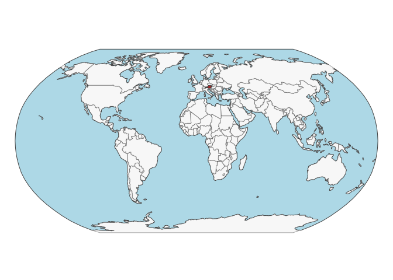
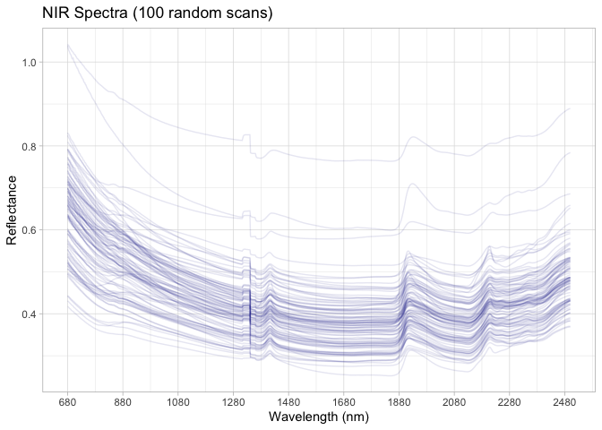

# Austrian NIR soil spectral library (AUT) for soil health assessments
Ran Zhi, Jose L. Safanelli, Jonathan Sanderman

- [Original data](#original-data)
- [Data standardization to the OSSL
  format](#data-standardization-to-the-ossl-format)
  - [Site information](#site-information)
  - [Soil lab information (reference analytical
    data)](#soil-lab-information-reference-analytical-data)
  - [NIR spectra](#nir-spectra)
  - [Quality control for NIR](#quality-control-for-nir)
- [References](#references)

Code repository for preparing and importing the Austrian NIR soil
spectral library for soil health assessments (AUT) into the Open Soil
Spectral Library.

Website: [Soil Spectroscopy for Global
Good](https://soilspectroscopy.org)  
Development: <https://github.com/soilspectroscopy>  
Last update: 2026-05-01  
Additional documentation:

## Original data

Site data, Soil lab data, and Near-Infrared (NIR) data from all
environmental zones of Austria.

Further information of the dataset can be found in detail at
Fohrafellner et al. ([2026](#ref-fohrafellner_austrian_2026)).

Original files:  
- `Austrian NIR Soil Spectral Library_V4.xlsx`: xlsx file with site
information, soil information, and NIR spectral data.

Directory/folder path with original files (not uploaded to GitHub).

``` r
# dir = "/Users/rzhi/Projects/git/ossl-imports-internal/dataset/Austrian"
dir = "~/mnt-ossl-private/database/datasets/AUT"
tic()
```

## Data standardization to the OSSL format

### Site information

``` r
austrian.metadata <- read_excel(path(dir, "Austrian NIR Soil Spectral Library_V4.xlsx"),
                            sheet = "Dataset")

austrian.sitedata <- austrian.metadata %>%
  select(Sample_number, Sampling_year, Experiment_number, Sample_source,
         Municipality_code, Environmental_zone, Land_use_type, 
         Sampling_depth_from, Sampling_depth_to) %>%
  rename(id.layer_local_c = Sample_number,
         observation.date_src_yyyy = Sampling_year,
         observation.source_src_txt = Sample_source,
         loc.municipality_src_code = Municipality_code,
         loc.env.zone_src_txt = Environmental_zone,
         loc.experiment_src_txt = Experiment_number,
         site.land.use_src_txt = Land_use_type,
         layer.upper.depth_usda_cm = Sampling_depth_from,
         layer.bottom.depth_usda_cm = Sampling_depth_to) %>%
  mutate(layer.sequence_usda_uint16 = ifelse(layer.upper.depth_usda_cm == 0, 1, 2)) %>%
  # mutate(id.project_ascii_txt = "Austrian NIR Soil Spectral Library for Soil Health Assessments",
  #        observation.ogc.schema.title_ogc_txt = "Open Soil Spectroscopy Library",
  #        observation.ogc.schema_idn_url = "https://soilspectroscopy.github.io",
  #        dataset.title_utf8_txt = "Austrian NIR Soil Spectral Library for Soil Health Assessments",
  #        dataset.owner_utf8_txt = "European Joint Program for SOIL 'Towards climate-smart sustainable management of agricultural soils' (EJP SOIL) funded by the European Union Horizon 2020 research and innovation programme (Grant Agreement N° 862695)",
  #        dataset.doi_idf_url = "https://zenodo.org/records/17941270",
  #        dataset.license.title_ascii_txt = "CC-BY",
  #        dataset.license.address_idn_url = "https://creativecommons.org/licenses/by/4.0/legalcode",
  #        dataset.contact.name_utf8_txt = "Julia, Fohrafellner",
  #        dataset.contact_ietf_email = "julia.fohrafellner@ages.at") %>%
  mutate(dataset.code_ascii_txt = "AUT",
         id.layer_uuid_txt = openssl::md5(paste0(dataset.code_ascii_txt, id.layer_local_c)),
         .before = 1) %>%
  mutate(across(starts_with("id."), as.character))

# Saving version to dataset root dir
site.exp.file = path(dir, "ossl_soilsite_v1.3")
readr::write_csv(austrian.sitedata, str_c(site.exp.file, ".csv.gz"))
nanoparquet::write_parquet(austrian.sitedata, str_c(site.exp.file, ".parquet"))
```

Plotting map:

``` r
data("World")

ocean <- ne_download(scale = 110, type = "ocean", category = "physical", returnclass = "sf")
```

    Reading 'ne_110m_ocean.zip' from naturalearth...

``` r
austria <- World[World$name == "Austria", ]

tmap_mode("plot")
```

    ℹ tmap modes "plot" - "view"
    ℹ toggle with `tmap::ttm()`

``` r
tm_shape(ocean) +
  tm_polygons(fill = "lightblue", col = NA) +
  tm_shape(World) +
  tm_polygons(fill = "#f0f0f0", fill_alpha = 0.5, col_alpha = 0.5) +
  tm_shape(austria) +
  tm_polygons(fill = "firebrick") +
  tm_crs("ESRI:54030") +
  tm_layout(frame = FALSE)
```

    [tip] Consider a suitable map projection, e.g. by adding `+ tm_crs("auto")`.
    This message is displayed once per session.



### Soil lab information (reference analytical data)

NOTE: The code chunk below must be run just once for getting a template
for scripted column standardization. Just run once for getting the
original names of soil properties, descriptions, data types, and units.
Then upload to Google Sheet for editing and defining the rules for
integrating with the OSSL. Requires Google authentication. A copy of the
output file is saved to this folder for archiving purposes.

**Always leave the sheet name as TEMP to avoid overwritting, then rename
online to dataset code and download a copy for this repository.**

``` r
# Getting soillab original variables

soillab.names <- austrian.metadata %>%
  select(Sample_number, SOC, SOC_to_clay_ratio,
         TC, Labile_carbon, CaCO3, TN, Phosphorus, pH_CaCl2, pH_Acetate, 
         CEC, Sand, Silt, Clay) %>%
  rename(id.layer_local_c = Sample_number) %>%
  names() %>%
  tibble(original_name = .) %>%
  dplyr::mutate(table = 'Austrian NIR Soil Spectral Library_V4.xlsx', .before = 1) %>%
  dplyr::mutate(import = '', original_unit = '', original_method = '',
                comment = '', ossl_abbrev = '', ossl_method = '',
                ossl_unit = '', ossl_convert = '', ossl_name = '',
                .after = original_name)

readr::write_csv(soillab.names, path(getwd(), "soillab_original_names.csv"))

# Uploading to google sheet

# Drive 'Open Soil Spectral Library'
# Folder 'Database v2'
googledrive::drive_ls(as_id("1l9VM4fFks2xBloDE69EFTfPgQeFx5aGw"))

# Use the ID of the file 'OSSL_v2_tab2_soildata_importing'
OSSL.soildata.importing <- "1mWTDJDuMp4oObcCxAy9gofSkrkcSWWf1TtEW2SuC1es"

# Checking metadata
googlesheets4::as_sheets_id(OSSL.soildata.importing)

# Checking readme
googlesheets4::read_sheet(OSSL.soildata.importing, sheet = 'readme')

# Preparing soillab.names for this dataset
upload <- dplyr::as_tibble(soillab.names)

# Uploading with TEMP name. Check online, move to sequence, and update name
googlesheets4::write_sheet(upload, ss = OSSL.soildata.importing, sheet = "TEMP")

# Checking metadata
googlesheets4::as_sheets_id(OSSL.soildata.importing)
```

NOTE: The code chunk below must be run just once. Run for getting the
column standardization rules after editing online on Google Sheets. A
copy of the edited standardization template is saved to this dataset
folder.

``` r
# Downloading from google sheet

# Checking metadata
googlesheets4::as_sheets_id("1mWTDJDuMp4oObcCxAy9gofSkrkcSWWf1TtEW2SuC1es")

# Preparing soillab.names
transvalues <- googlesheets4::read_sheet("1mWTDJDuMp4oObcCxAy9gofSkrkcSWWf1TtEW2SuC1es",
                                         sheet = "AUT")

# Saving to folder
readr::write_csv(transvalues, path(getwd(), "soillab_standardized_names.csv"))
```

Reading standardization rules:

``` r
transvalues <- read_csv(path(getwd(), "soillab_standardized_names.csv"),
                        show_col_types = F)

 transvalues <- transvalues%>%
  filter(import == TRUE) %>%
  select(contains(c("table", "id", "original_name", "original_unit" , "ossl_")))
 
knitr::kable(transvalues)
```

| table | original_name | original_unit | ossl_abbrev | ossl_method | ossl_unit | ossl_convert | ossl_name |
|:---|:---|:---|:---|:---|:---|:---|:---|
| Austrian NIR Soil Spectral Library_V4.xlsx | SOC | % | oc | usda.c729 | w.pct | ifelse(as.numeric(x) \< 0, NA, as.numeric(x) \* 1) | oc_usda.c729_w.pct |
| Austrian NIR Soil Spectral Library_V4.xlsx | TC | % | c.tot | usda.a622 | w.pct | ifelse(as.numeric(x) \< 0, NA, as.numeric(x) \* 1) | c.tot_usda.a622_w.pct |
| Austrian NIR Soil Spectral Library_V4.xlsx | CaCO3 | % | caco3 | usda.a54 | w.pct | ifelse(as.numeric(x) \< 0, NA, as.numeric(x) \* 1) | caco3_usda.a54_w.pct |
| Austrian NIR Soil Spectral Library_V4.xlsx | TN | % | n.tot | usda.a623 | w.pct | ifelse(as.numeric(x) \< 0, NA, as.numeric(x) \* 1) | n.tot_usda.a623_w.pct |
| Austrian NIR Soil Spectral Library_V4.xlsx | Phosphorus | mg/kg | p.ext | austria.cal | mg.kg | ifelse(as.numeric(x) \< 0, NA, as.numeric(x) \* 1) | p.ext_austria.cal_mg.kg |
| Austrian NIR Soil Spectral Library_V4.xlsx | pH_CaCl2 | NA | ph.cacl2 | iso.10390 | index | ifelse(as.numeric(x) \< 0, NA, as.numeric(x) \* 1) | ph.cacl2_iso.10390_index |
| Austrian NIR Soil Spectral Library_V4.xlsx | CEC | cmolc/kg | cec | iso.11260 | cmolc.kg | ifelse(as.numeric(x) \< 0, NA, as.numeric(x) \* 1) | cec_iso.11260_cmolc.kg |
| Austrian NIR Soil Spectral Library_V4.xlsx | Sand | % | sand.tot | iso.11277 | w.pct | ifelse(as.numeric(x) \< 0, NA, as.numeric(x) \* 1) | sand.tot_iso.11277_w.pct |
| Austrian NIR Soil Spectral Library_V4.xlsx | Silt | % | silt.tot | iso.11277 | w.pct | ifelse(as.numeric(x) \< 0, NA, as.numeric(x) \* 1) | silt.tot_iso.11277_w.pct |
| Austrian NIR Soil Spectral Library_V4.xlsx | Clay | % | clay.tot | iso.11277 | w.pct | ifelse(as.numeric(x) \< 0, NA, as.numeric(x) \* 1) | clay.tot_iso.11277_w.pct |

Standardizing soil data to the OSSL format:

``` r
austrian.reference <- austrian.metadata

# Harmonization of names and units
valid_mappings <- transvalues %>%
  filter(table == "Austrian NIR Soil Spectral Library_V4.xlsx") %>%
  filter(!is.na(ossl_name) & ossl_name != "") 

analytes.old.names <- valid_mappings %>% pull(original_name)
analytes.new.names <- valid_mappings %>% pull(ossl_name)

#analytes.old.names.clean <- analytes.old.names[analytes.old.names != "Sample_number"]
#analytes.new.names.clean <- analytes.new.names[analytes.old.names != "Sample_number"]

austrian.soildata <- austrian.reference %>%
  rename(id.layer_local_c = Sample_number) %>%
  select(id.layer_local_c, all_of(analytes.old.names)) %>%
  rename_with(~analytes.new.names, all_of(analytes.old.names)) %>%
  mutate(id.layer_local_c = as.character(id.layer_local_c)) %>%
  as.data.frame()

# Getting the formulas
functions.list <- transvalues %>%
  filter(table == "Austrian NIR Soil Spectral Library_V4.xlsx") %>%
  mutate(ossl_name = factor(ossl_name, levels = names(austrian.soildata))) %>%
  arrange(ossl_name) %>%
  pull(ossl_convert) %>%
  c("x", .)

# Applying transformation rules
austrian.soildata.trans <- transform_values(df = austrian.soildata,
                                       out.name = names(austrian.soildata),
                                       in.name = names(austrian.soildata),
                                       fun.lst = functions.list)

# Final soillab data
austrian.soildata <- austrian.soildata.trans %>%
  mutate_at(vars(starts_with("id.")), as.character)

# Checking total number of observations
austrian.soildata %>%
  distinct(id.layer_local_c) %>%
  summarise(count = n())
```

      count
    1  2131

``` r
# Saving version to dataset root dir
soillab.exp.file = path(dir, "ossl_soillab_v1.3")
readr::write_csv(austrian.soildata, str_c(soillab.exp.file, ".csv.gz"))
nanoparquet::write_parquet(austrian.soildata, str_c(soillab.exp.file, ".parquet"))
```

Soil lab data summary.

``` r
austrian.soildata %>%
  mutate(id.layer_local_c = factor(id.layer_local_c)) %>%
  skimr::skim() %>%
  dplyr::select(-numeric.hist, -complete_rate)
```

|                                                  |            |
|:-------------------------------------------------|:-----------|
| Name                                             | Piped data |
| Number of rows                                   | 2131       |
| Number of columns                                | 11         |
| \_\_\_\_\_\_\_\_\_\_\_\_\_\_\_\_\_\_\_\_\_\_\_   |            |
| Column type frequency:                           |            |
| factor                                           | 1          |
| numeric                                          | 10         |
| \_\_\_\_\_\_\_\_\_\_\_\_\_\_\_\_\_\_\_\_\_\_\_\_ |            |
| Group variables                                  | None       |

Data summary

**Variable type: factor**

| skim_variable    | n_missing | ordered | n_unique | top_counts                  |
|:-----------------|----------:|:--------|---------:|:----------------------------|
| id.layer_local_c |         0 | FALSE   |     2131 | 1: 1, 10: 1, 100: 1, 100: 1 |

**Variable type: numeric**

| skim_variable            | n_missing |   mean |     sd |   p0 |   p25 |   p50 |    p75 |    p100 |
|:-------------------------|----------:|-------:|-------:|-----:|------:|------:|-------:|--------:|
| oc_usda.c729_w.pct       |        19 |   2.76 |   3.20 | 0.02 |  1.53 |  1.96 |   2.71 |   44.82 |
| c.tot_usda.a622_w.pct    |      2039 |   6.54 |   6.23 | 1.00 |  2.63 |  4.90 |   6.66 |   39.08 |
| caco3_usda.a54_w.pct     |      1804 |  13.26 |  12.57 | 0.01 |  4.30 |  9.70 |  20.40 |   81.90 |
| n.tot_usda.a623_w.pct    |      1095 |   0.25 |   0.21 | 0.03 |  0.16 |  0.19 |   0.25 |    2.42 |
| p.ext_austria.cal_mg.kg  |       488 | 112.89 | 136.73 | 1.00 | 45.00 | 78.00 | 120.00 | 1623.53 |
| ph.cacl2_iso.10390_index |       214 |   6.92 |   0.85 | 3.18 |  6.60 |  7.26 |   7.51 |    7.93 |
| cec_iso.11260_cmolc.kg   |      1490 |  20.91 |   8.75 | 2.88 | 15.81 | 20.95 |  24.42 |   85.45 |
| sand.tot_iso.11277_w.pct |      1569 |  36.25 |  18.69 | 5.60 | 21.00 | 32.20 |  49.48 |   92.50 |
| silt.tot_iso.11277_w.pct |      1569 |  45.71 |  14.26 | 5.00 | 35.80 | 47.10 |  56.70 |   75.70 |
| clay.tot_iso.11277_w.pct |      1597 |  18.01 |   9.05 | 1.50 | 10.93 | 17.30 |  23.80 |   47.10 |

### NIR spectra

Authors describe in the paper that the spectra was measured in
reflectance units, then transformed to pseudo absorbance. We will
convert back to reflectance following OSSL specifications for VisNIR and
NIR.

``` r
# Renaming
austrian.nir.proc <- austrian.metadata %>%
  rename(id.layer_local_c = Sample_number) %>%
  select(id.layer_local_c, `680`:last_col())

# Need to resample spectra
spec.cols <- names(austrian.nir.proc)[-1] # Remove the ID column
old.wavelengths <- as.numeric(spec.cols)
new.wavelengths <- seq(680, max(old.wavelengths), by = 2)

# Resampling spectra
austrian.nir.resampled <- austrian.nir.proc %>%
  column_to_rownames("id.layer_local_c") %>%
  as.matrix() %>%
  prospectr::resample(X = ., wav = old.wavelengths,
                      new.wav = new.wavelengths, interpol = "spline") %>%
  as_tibble(rownames = "id.layer_local_c")

# Backtransforming to reflectance
austrian.nir.resampled <- austrian.nir.resampled %>%
  mutate(across(all_of(as.character(new.wavelengths)), ~1/10^.x))

# Check for NAs
scans.na.gaps <- austrian.nir.resampled %>%
  select(-id.layer_local_c) %>%
  apply(1, function(x) round(100*(sum(is.na(x)))/(length(x)), 2)) %>%
  tibble(id.layer_local_c = austrian.nir.resampled$id.layer_local_c, proportion_NA = .)

# Check for extreme negative values 
scans.extreme.neg <- austrian.nir.resampled %>%
  select(-id.layer_local_c) %>%
  apply(1, function(x) round(100*(sum(x < 0, na.rm=TRUE))/(length(x)), 2)) %>%
  tibble(id.layer_local_c = austrian.nir.resampled$id.layer_local_c, proportion_lower0 = .)

# Check for extreme positive values 
scans.extreme.pos <- austrian.nir.resampled %>%
  select(-id.layer_local_c) %>%
  apply(1, function(x) round(100*(sum(x > 1, na.rm=TRUE))/(length(x)), 2)) %>%
  tibble(id.layer_local_c = austrian.nir.resampled$id.layer_local_c, proportion_higherRef1 = .)

# Summary of problematic scans
scans.summary <- scans.na.gaps %>%
  left_join(scans.extreme.neg, by = "id.layer_local_c") %>%
  left_join(scans.extreme.pos, by = "id.layer_local_c")

scans.summary %>%
  select(-id.layer_local_c) %>%
  pivot_longer(everything(), names_to = "check", values_to = "value") %>%
  filter(value > 0) %>%
  group_by(check) %>%
  summarise(count = n())
```

    # A tibble: 0 × 2
    # ℹ 2 variables: check <chr>, count <int>

``` r
# Renaming and Metadata
final.visnir.names <- paste0("scan_nir.", new.wavelengths, "_ref")

austrian.nir.final <- austrian.nir.resampled %>%
  rename_with(~final.visnir.names, as.character(new.wavelengths))

# # Customizing metadata for the Austrian dataset
# austrian.nir.metadata <- austrian.nir.final %>%
#   select(id.layer_local_c) %>%
#   mutate(
#     id.scan_local_c = id.layer_local_c,
#     scan.nir.date.begin_iso.8601_yyyy = ymd("1998-01-01"), 
#     scan.visnir.date.end_iso.8601_yyyy = ymd("2023-12-31"), 
#     scan.nir.model.name_utf8_txt = "SpectraStarTM XL near-infrared spectrometer from Unity Scientific (Brookfield, CT, USA)", 
#     scan.nir.license.title_ascii_txt = "CC-BY",
#     scan.nir.contact.name_utf8_txt = "Austrian Dataset Lead",
#     scan.nir.doi_idf_url = "https://zenodo.org/records/17941270",
#     scan.nir.contact.name_utf8_txt = "Julia, Fohrafellner",
#     scan.nir.contact.email_ietf_txt = "julia.fohrafellner@ages.at"
#   )

# Export

# austrian.nir.export <- austrian.nir.metadata %>%
#   left_join(austrian.nir.final, by = "id.layer_local_c")

# Save as .qs file
nir.exp.file = path(dir, "ossl_nir_v1.3")
readr::write_csv(austrian.nir.final, str_c(nir.exp.file, ".csv.gz"))
nanoparquet::write_parquet(austrian.nir.final, str_c(nir.exp.file, ".parquet"))
```

### Quality control for NIR

The final table must be joined as follows:

- NIR is used as first reference for pairing with site and soil data.
- Site and soil lab data are left joined to nir. This drop data without
  any available scan.

The availability of data is summarized below:

``` r
# Taking a few representative columns for checking the consistency of joins
austrian.availability <- austrian.nir.final %>%
  select(id.layer_local_c, scan_nir.680_ref) %>%
  left_join(austrian.soildata, by = "id.layer_local_c") %>%
  filter(!is.na(id.layer_local_c))

# Availability of information summary
# This tells us how many samples have spectra vs. lab/site data
austrian.availability %>%
  mutate(across(everything(), as.character)) %>%
  pivot_longer(everything(), names_to = "column", values_to = "value") %>%
  filter(!is.na(value)) %>%
  group_by(column) %>%
  summarise(count = n())
```

    # A tibble: 12 × 2
       column                   count
       <chr>                    <int>
     1 c.tot_usda.a622_w.pct       92
     2 caco3_usda.a54_w.pct       327
     3 cec_iso.11260_cmolc.kg     641
     4 clay.tot_iso.11277_w.pct   534
     5 id.layer_local_c          2131
     6 n.tot_usda.a623_w.pct     1036
     7 oc_usda.c729_w.pct        2112
     8 p.ext_austria.cal_mg.kg   1643
     9 ph.cacl2_iso.10390_index  1917
    10 sand.tot_iso.11277_w.pct   562
    11 scan_nir.680_ref          2131
    12 silt.tot_iso.11277_w.pct   562

``` r
# Repeats check 
austrian.availability %>%
  mutate(across(everything(), as.character)) %>%
  select(id.layer_local_c) %>%
  pivot_longer(everything(), names_to = "column", values_to = "value") %>%
  group_by(column, value) %>%
  summarise(repeats = n(), .groups = 'drop') %>%
  group_by(column, repeats) %>%
  summarise(count = n(), .groups = 'drop')
```

    # A tibble: 1 × 3
      column           repeats count
      <chr>              <int> <int>
    1 id.layer_local_c       1  2131

Soil analytical data summary with NIR. Note: many scans could not be
linked with some of the wetchem.

``` r
austrian.availability %>%
  mutate(id.layer_local_c = factor(id.layer_local_c)) %>%
  skimr::skim() %>%
  dplyr::select(-numeric.hist, -complete_rate)
```

|                                                  |            |
|:-------------------------------------------------|:-----------|
| Name                                             | Piped data |
| Number of rows                                   | 2131       |
| Number of columns                                | 12         |
| \_\_\_\_\_\_\_\_\_\_\_\_\_\_\_\_\_\_\_\_\_\_\_   |            |
| Column type frequency:                           |            |
| factor                                           | 1          |
| numeric                                          | 11         |
| \_\_\_\_\_\_\_\_\_\_\_\_\_\_\_\_\_\_\_\_\_\_\_\_ |            |
| Group variables                                  | None       |

Data summary

**Variable type: factor**

| skim_variable    | n_missing | ordered | n_unique | top_counts                  |
|:-----------------|----------:|:--------|---------:|:----------------------------|
| id.layer_local_c |         0 | FALSE   |     2131 | 1: 1, 10: 1, 100: 1, 100: 1 |

**Variable type: numeric**

| skim_variable            | n_missing |   mean |     sd |   p0 |   p25 |   p50 |    p75 |    p100 |
|:-------------------------|----------:|-------:|-------:|-----:|------:|------:|-------:|--------:|
| scan_nir.680_ref         |         0 |   0.23 |   0.06 | 0.09 |  0.19 |  0.22 |   0.27 |    0.68 |
| oc_usda.c729_w.pct       |        19 |   2.76 |   3.20 | 0.02 |  1.53 |  1.96 |   2.71 |   44.82 |
| c.tot_usda.a622_w.pct    |      2039 |   6.54 |   6.23 | 1.00 |  2.63 |  4.90 |   6.66 |   39.08 |
| caco3_usda.a54_w.pct     |      1804 |  13.26 |  12.57 | 0.01 |  4.30 |  9.70 |  20.40 |   81.90 |
| n.tot_usda.a623_w.pct    |      1095 |   0.25 |   0.21 | 0.03 |  0.16 |  0.19 |   0.25 |    2.42 |
| p.ext_austria.cal_mg.kg  |       488 | 112.89 | 136.73 | 1.00 | 45.00 | 78.00 | 120.00 | 1623.53 |
| ph.cacl2_iso.10390_index |       214 |   6.92 |   0.85 | 3.18 |  6.60 |  7.26 |   7.51 |    7.93 |
| cec_iso.11260_cmolc.kg   |      1490 |  20.91 |   8.75 | 2.88 | 15.81 | 20.95 |  24.42 |   85.45 |
| sand.tot_iso.11277_w.pct |      1569 |  36.25 |  18.69 | 5.60 | 21.00 | 32.20 |  49.48 |   92.50 |
| silt.tot_iso.11277_w.pct |      1569 |  45.71 |  14.26 | 5.00 | 35.80 | 47.10 |  56.70 |   75.70 |
| clay.tot_iso.11277_w.pct |      1597 |  18.01 |   9.05 | 1.50 | 10.93 | 17.30 |  23.80 |   47.10 |

NIR spectral visualization (100 random spectra).  

**PLEASE NOTE the bad interpolation between the detectors switch around
1350 nm. Unfortunately, simple splice correction does not work in this
case.**

``` r
set.seed(42)
austrian.nir.final %>%
  sample_n(100) %>%
  select(all_of(c("id.layer_local_c")), starts_with("scan_nir.")) %>%
  tidyr::pivot_longer(-all_of(c("id.layer_local_c")),
                      names_to = "wavelength", values_to = "reflectance") %>%
  dplyr::mutate(wavelength = gsub("scan_nir.|_ref", "", wavelength)) %>%
  dplyr::mutate(wavelength = as.numeric(wavelength)) %>%
  ggplot(aes(x = wavelength, y = reflectance, group = id.layer_local_c)) +
  geom_line(alpha = 0.1, color = "darkblue") +
  scale_x_continuous(breaks = seq(680, 2500, by = 200))+
  labs(title = "NIR spectra (100 random scans)",
       x = "Wavelength (nm)",
       y = "Reflectance")+
  theme_light()
```



``` r
toc()
```

    17.886 sec elapsed

``` r
rm(list = ls())
gc()
```

               used  (Mb) gc trigger  (Mb) max used  (Mb)
    Ncells  6379700 340.8   11335494 605.4  9904677 529.0
    Vcells 10922328  83.4   33618815 256.5 42023518 320.7

## References

<div id="refs" class="references csl-bib-body hanging-indent"
entry-spacing="0" line-spacing="2">

<div id="ref-fohrafellner_austrian_2026" class="csl-entry">

Fohrafellner, J., Lippl, M., Bajraktarevic, A., Baumgarten, A., Spiegel,
H., Körner, R., & Sandén, T. (2026). Austrian NIR soil spectral library
for soil health assessments. *Earth System Science Data*, *18*(1),
219–229.
doi:[10.5194/essd-18-219-2026](https://doi.org/10.5194/essd-18-219-2026)

</div>

</div>
