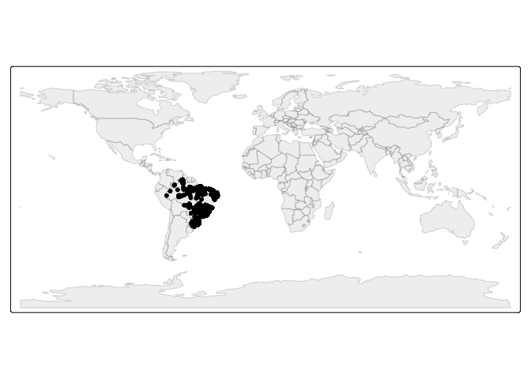
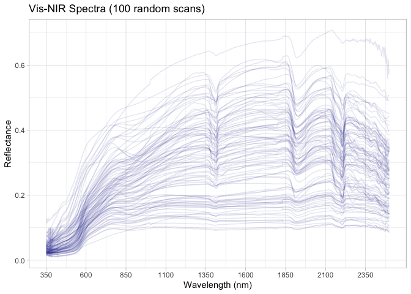
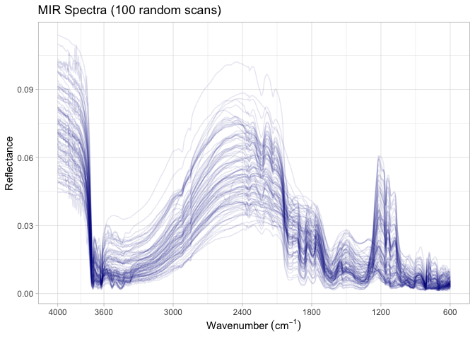

# BESB dataset preparation for the OSSL
Ran Zhi, Jose L. Safanelli, Jonathan Sanderman
— 24 February, 2026.

- [The BSSL original data](#the-bssl-original-data)
- [Data standardization to the OSSL
  format](#data-standardization-to-the-ossl-format)
  - [Site information](#site-information)
  - [Soil lab information (reference analytical
    data)](#soil-lab-information-reference-analytical-data)
  - [Vis-NIR spectra](#vis-nir-spectra)
  - [Quality control for Vis-NIR](#quality-control-for-vis-nir)
  - [Mid-infrared spectra (MIR)](#mid-infrared-spectra-mir)
  - [Quality control for MIR](#quality-control-for-mir)
- [References](#references)

Code repository for preparing and importing the Brazilian Soil Spectral
Library (BSSL) dataset into the Open Soil Spectral Library.

Project: [Soil Spectroscopy for Global
Good](https://soilspectroscopy.org)  
Development: <https://github.com/soilspectroscopy>  
Last update: 2026-02-24  
Additional documentation:

## The BSSL original data

Site data, Soil lab data, Mid-Infrared Spectra (MIR), and Visible,
Near-Infrared and Shortwave-Infrared (Vis-NIR-SWIR) from the Brazilian
Soil Spectral Library (BSSL). Further information of the dataset can be
found in detail at Demattê et al. ([2019](#ref-dematte_brazilian_2019))
and Demattê et al. ([2022](#ref-dematte_brazilian_2022)).

Original files:  
- `BSSL_DB_V002.xlsx`: xlsx file with site information, soil
information, and spectral data.

Directory/folder path with original files (not uploaded to GitHub).

``` r
dir = "/Users/rzhi/Projects/git/ossl-imports-internal/dataset/BESB"
# dir = "~/projects/mnt-ossl/import/dataset/BESB"
tic()
```

## Data standardization to the OSSL format

### Site information

``` r
besb.metadata <- read_excel(path(dir, "BSSL_DB_V002.xlsx"),
                            sheet = "BSSL_Soil_Attributes_Dataset")
```

    Warning: Expecting numeric in G13893 / R13893C7: got '-18.556944.'

``` r
besb.sitedata <- besb.metadata %>%
  select(ID_Unique, Owner_code, Vis_NIR_SWIR_availability, MIR_availability, Depth_cm,
         Lat, Long, Region, Vegetation, Bioma, Geology) %>%
  rename(id.layer_local_c = ID_Unique,
         longitude.point_wgs84_dd = Long,
         latitude.point_wgs84_dd = Lat) %>%
  mutate(id.layer_local_c = as.character(id.layer_local_c)) %>%
  separate(Depth_cm, into = c("layer.upper.depth_usda_cm", "layer.lower.depth_usda_cm"), sep = "-") %>%
  mutate(across(starts_with("layer."), as.numeric)) %>%
  mutate(layer.sequence_usda_uint16 = ifelse(layer.upper.depth_usda_cm == 0, 1, 2)) %>%
  mutate(id.project_ascii_txt = "Brazilian Soil Spectral Library",
         dataset.code_ascii_txt = "Brazilian.SSL",
         observation.ogc.schema.title_ogc_txt = "Open Soil Spectroscopy Library",
         observation.ogc.schema_idn_url = "https://soilspectroscopy.github.io",
         surveyor.title_utf8_txt = "Luiz de Queiroz College of Agriculture, University of São Paulo, Piracicaba, São Paulo, Brazil",
         surveyor.contact_ietf_email = "jamdemat@usp.br",
         surveyor.address_utf8_txt = "Department of Soil Science, Luiz de Queiroz College of Agriculture (ESALQ), University of São Paulo (USP), Ave. Pádua Dias 11, Cx. Postal 9, 13418-900, Piracicaba, São Paulo, Brazil",
         dataset.title_utf8_txt = "Brazilian Soil Spectral Library",
         dataset.owner_utf8_txt = "Luiz de Queiroz College of Agriculture, University of São Paulo",
         
         dataset.address_idn_url = "https://bibliotecaespectral.wixsite.com/english",
         dataset.doi_idf_url = "https://doi.org/10.5281/zenodo.8361419",
         dataset.license.title_ascii_txt = "CC-BY",
         dataset.license.address_idn_url = "https://creativecommons.org/licenses/by/4.0/legalcode",
         dataset.contact.name_utf8_txt = "José A.M. Demattê",
         dataset.contact_ietf_email = "jamdemat@usp.br") %>%
  mutate(id.layer_uuid_txt = openssl::md5(paste0(dataset.code_ascii_txt, id.layer_local_c)),
         id.location_olc_txt = olctools::encode_olc(latitude.point_wgs84_dd, longitude.point_wgs84_dd, 10),
         .after = id.project_ascii_txt) %>%
  mutate_at(vars(starts_with("id.")), as.character)

# Saving version to dataset root dir
site.qs = path(dir, "ossl_soilsite_v2.0.qs")
qs::qsave(besb.sitedata, site.qs, preset = "high")
```

Plotting sites map:

``` r
data("World")

points <- besb.sitedata %>%
  filter(!is.na(longitude.point_wgs84_dd),
         !is.na(latitude.point_wgs84_dd)) %>%
  st_as_sf(coords = c('longitude.point_wgs84_dd', 'latitude.point_wgs84_dd'), crs = 4326)

tmap_mode("plot")
```

    ℹ tmap modes "plot" - "view"
    ℹ toggle with `tmap::ttm()`

``` r
tm_shape(World) +
  tm_polygons('#f0f0f0f0', border.alpha = 0.2) +
  tm_shape(points) +
  tm_dots()
```


    ── tmap v3 code detected ───────────────────────────────────────────────────────
    [v3->v4] `tm_polygons()`: use `col_alpha` instead of `border.alpha`.[tip] Consider a suitable map projection, e.g. by adding `+ tm_crs("auto")`.



### Soil lab information (reference analytical data)

NOTE: The code chunk below must be run just once for getting a template
for scripted column standardization. Just run once for getting the
original names of soil properties, descriptions, data types, and units.
Then upload to Google Sheet for editing and manually defining the rules
for integrating with the OSSL. Requires Google authentication. A copy of
the output file is saved to this folder for archiving purposes.

**Always leave the sheet name as TEMP to avoid overwritting, then rename
online to download locally.**

``` r
# Getting soillab original variables

soillab.names <- besb.metadata %>%
  select(ID_Unique, Sand_gkg, Clay_gkg, SOM_gkg, pH_H2O, 
         Ca_mmolkg, Mg_mmolkg, Na_mmolkg, CEC_Ph7_mmolkg) %>%
  names(.) %>%
  tibble(original_name = .) %>%
  dplyr::mutate(table = 'BSSL_DB_V002.xlsx', .before = 1) %>%
  dplyr::mutate(import = '', comment = '', ossl_abbrev = '', ossl_method = '', ossl_unit = '',
                ossl_convert = '', ossl_name = '', .after = original_name)

readr::write_csv(soillab.names, path(getwd(), "soillab_original_names.csv"))

# Uploading to google sheet

# Drive 'Open Soil Spectral Library'
# Folder 'Database v2'
googledrive::drive_ls(as_id("1l9VM4fFks2xBloDE69EFTfPgQeFx5aGw"))

# Use the ID of the file 'OSSL_v2_tab2_soildata_importing'
OSSL.soildata.importing <- "1mWTDJDuMp4oObcCxAy9gofSkrkcSWWf1TtEW2SuC1es"

# Checking metadata
googlesheets4::as_sheets_id(OSSL.soildata.importing)

# Checking readme
googlesheets4::read_sheet(OSSL.soildata.importing, sheet = 'readme')

# Preparing soillab.names for this dataset
upload <- dplyr::as_tibble(soillab.names)

# Uploading with TEMP name. Check online, move to sequence, and update name
googlesheets4::write_sheet(upload, ss = OSSL.soildata.importing, sheet = "TEMP")

# Checking metadata
googlesheets4::as_sheets_id(OSSL.soildata.importing)
```

NOTE: The code chunk below must be run just once. Run for getting the
column standardization rules after editing online on Google Sheets. A
copy of the output file is saved to this folder for archiving purposes.

``` r
# Downloading from google sheet

# Checking metadata
googlesheets4::as_sheets_id("1mWTDJDuMp4oObcCxAy9gofSkrkcSWWf1TtEW2SuC1es")

# Preparing soillab.names
transvalues <- googlesheets4::read_sheet("1mWTDJDuMp4oObcCxAy9gofSkrkcSWWf1TtEW2SuC1es",
                                         sheet = "BESB") %>%
  filter(import == TRUE) %>%
  select(contains(c("table", "id", "original_name", "original_unit" , "ossl_")))

# Saving to folder
write_csv(transvalues, path(getwd(), "soillab_standardized_names.csv"))
```

Reading standardization rules:

``` r
transvalues <- read_csv(path(getwd(), "soillab_standardized_names.csv"),
                        show_col_types = F)
knitr::kable(transvalues)
```

| table | original_name | original_unit | ossl_abbrev | ossl_method | ossl_unit | ossl_convert | ossl_name |
|:---|:---|:---|:---|:---|:---|:---|:---|
| BSSL_DB_V002.xlsx | ID_Unique | NA | NA | NA | NA | NA | NA |
| BSSL_DB_V002.xlsx | Sand_gkg | g/kg | sand.tot | usda.c405 | w.pct | ifelse(as.numeric(x) \< 0, NA, as.numeric(x) / 10) | sand.tot_usda.c405_w.pct |
| BSSL_DB_V002.xlsx | Clay_gkg | g/kg | clay_tot | usda.a334 | w.pct | ifelse(as.numeric(x) \< 0, NA, as.numeric(x) / 10) | clay.tot_usda.a334_w.pct |
| BSSL_DB_V002.xlsx | SOC_gkg | g/kg | oc | iso.10694 | w.pct | ifelse(as.numeric(x) \< 0, NA, as.numeric(x)\*1.33 / 10) | oc_iso.10694_w.pct |
| BSSL_DB_V002.xlsx | pH_H2O | NA | ph.h2o | usda.a268 | index | NA | ph.h2o_usda.a268_index |
| BSSL_DB_V002.xlsx | Ca_mmolkg | mmol/kg | ca.ext | usda.a722 | cmolc.kg | ifelse(as.numeric(x) \< 0, NA, as.numeric(x) / 10) | ca.ext_usda.a722_cmolc.kg |
| BSSL_DB_V002.xlsx | Mg_mmolkg | mmol/kg | mg.ext | usda.a724 | cmolc.kg | ifelse(as.numeric(x) \< 0, NA, as.numeric(x) / 10) | mg.ext_usda.a724_cmolc.kg |
| BSSL_DB_V002.xlsx | Na_mmolkg | mmol/kg | na.ext | usda.a726 | cmolc.kg | ifelse(as.numeric(x) \< 0, NA, as.numeric(x) / 10) | na.ext_usda.a726_cmolc.kg |
| BSSL_DB_V002.xlsx | CEC_Ph7_mmolkg | mmol/kg | cec | usda.a723 | cmolc.kg | ifelse(as.numeric(x) \< 0, NA, as.numeric(x) / 10) | cec_usda.a723_cmolc.kg |

Standardizing soil data to the OSSL format:

``` r
besb.reference <- besb.metadata

# Harmonization of names and units
analytes.old.names <- transvalues %>%
  filter(table == "BSSL_DB_V002.xlsx") %>%
  pull(original_name)

analytes.new.names <- transvalues %>%
  filter(table == "BSSL_DB_V002.xlsx") %>%
  pull(ossl_name)

# Selecting and renaming
if("SOM_gkg" %in% names(besb.reference)) {
  besb.reference <- besb.reference %>% rename(SOC_gkg = SOM_gkg)
}

analytes.old.names.clean <- analytes.old.names[analytes.old.names != "ID_Unique"]
analytes.new.names.clean <- analytes.new.names[analytes.old.names != "ID_Unique"]

besb.soildata <- besb.reference %>%
  rename(id.layer_local_c = ID_Unique) %>%
  select(id.layer_local_c, all_of(analytes.old.names.clean)) %>%
  rename_with(~analytes.new.names.clean, all_of(analytes.old.names.clean)) %>%
  mutate(id.layer_local_c = as.character(id.layer_local_c)) %>%
  as.data.frame()

# Getting the formulas
functions.list <- transvalues %>%
  filter(table == "BSSL_DB_V002.xlsx") %>%
  mutate(ossl_name = factor(ossl_name, levels = names(besb.soildata))) %>%
  arrange(ossl_name) %>%
  pull(ossl_convert) %>%
  c("x", .)

# Applying transformation rules
besb.soildata.trans <- transform_values(df = besb.soildata,
                                       out.name = names(besb.soildata),
                                       in.name = names(besb.soildata),
                                       fun.lst = functions.list)

# Final soillab data
besb.soildata <- besb.soildata.trans %>%
  mutate_at(vars(starts_with("id.")), as.character)

# Checking total number of observations
besb.soildata %>%
  distinct(id.layer_local_c) %>%
  summarise(count = n())
```

      count
    1 16084

``` r
# Saving version to dataset root dir
soillab.qs = path(dir, "ossl_soillab_v2.0.qs")
qs::qsave(besb.soildata, soillab.qs, preset = "high")
```

Soil lab data summary.

``` r
besb.soildata %>%
  mutate(id.layer_local_c = factor(id.layer_local_c)) %>%
  skimr::skim() %>%
  dplyr::select(-numeric.hist, -complete_rate)
```

|                                                  |            |
|:-------------------------------------------------|:-----------|
| Name                                             | Piped data |
| Number of rows                                   | 16084      |
| Number of columns                                | 9          |
| \_\_\_\_\_\_\_\_\_\_\_\_\_\_\_\_\_\_\_\_\_\_\_   |            |
| Column type frequency:                           |            |
| factor                                           | 1          |
| logical                                          | 1          |
| numeric                                          | 7          |
| \_\_\_\_\_\_\_\_\_\_\_\_\_\_\_\_\_\_\_\_\_\_\_\_ |            |
| Group variables                                  | None       |

Data summary

**Variable type: factor**

| skim_variable    | n_missing | ordered | n_unique | top_counts                  |
|:-----------------|----------:|:--------|---------:|:----------------------------|
| id.layer_local_c |         0 | FALSE   |    16084 | 1: 1, 10: 1, 100: 1, 100: 1 |

**Variable type: logical**

| skim_variable          | n_missing | mean | count |
|:-----------------------|----------:|-----:|:------|
| ph.h2o_usda.a268_index |     16084 |  NaN | :     |

**Variable type: numeric**

| skim_variable             | n_missing |  mean |    sd |   p0 |   p25 |   p50 |   p75 |  p100 |
|:--------------------------|----------:|------:|------:|-----:|------:|------:|------:|------:|
| sand.tot_usda.c405_w.pct  |       959 | 54.17 | 28.26 | 0.47 | 26.70 | 61.40 | 80.00 | 95.40 |
| clay.tot_usda.a334_w.pct  |       977 | 31.15 | 21.58 | 0.70 | 13.00 | 24.00 | 48.00 | 96.10 |
| oc_iso.10694_w.pct        |      2737 |  2.81 |  1.91 | 0.18 |  1.49 |  2.26 |  3.59 | 16.05 |
| ca.ext_usda.a722_cmolc.kg |      3588 |  1.95 |  2.27 | 0.00 |  0.60 |  1.30 |  2.43 | 25.20 |
| mg.ext_usda.a724_cmolc.kg |      3585 |  0.84 |  1.05 | 0.01 |  0.28 |  0.60 |  1.04 | 18.62 |
| na.ext_usda.a726_cmolc.kg |     15423 |  0.73 |  2.17 | 0.00 |  0.01 |  0.04 |  0.32 | 18.90 |
| cec_usda.a723_cmolc.kg    |      3588 |  5.33 |  3.34 | 0.22 |  3.06 |  4.44 |  6.86 | 18.99 |

### Vis-NIR spectra

``` r
# Floating wavenumbers

besb.visnir <- read_excel(path(dir, "BSSL_DB_V002.xlsx"),
                            sheet = "Vis_NIR_SWIR_Dataset")

# Renaming
besb.visnir.proc <- besb.visnir %>%
  rename(id.layer_local_c = ID_Unique) %>%
  mutate(id.layer_local_c = as.character(id.layer_local_c))

# Need to resample spectra
old.wavelengths <- na.omit(as.numeric(names(besb.visnir.proc)))
```

    Warning in na.omit(as.numeric(names(besb.visnir.proc))): NAs introduced by
    coercion

``` r
new.wavelengths <- seq(350, 2500, by = 2)

besb.visnir.proc <- besb.visnir.proc %>%
  select(-id.layer_local_c, -Owner_code) %>%
  as.matrix() %>%
  prospectr::resample(X = ., wav = old.wavelengths, new.wav = new.wavelengths, interpol = "spline") %>%
  as_tibble() %>%
  bind_cols({besb.visnir.proc %>%
      select(id.layer_local_c)}, .) %>%
  select(id.layer_local_c, as.character(new.wavelengths))

# Gaps

scans.na.gaps <- besb.visnir.proc %>%
  select(-id.layer_local_c) %>%
  apply(., 1, function(x) round(100*(sum(is.na(x)))/(length(x)), 2)) %>%
  tibble(proportion_NA = .) %>%
  bind_cols({besb.visnir.proc %>% select(id.layer_local_c)}, .)

# Extreme negative - irreversible erratic patterns
scans.extreme.neg <- besb.visnir.proc %>%
  select(-id.layer_local_c) %>%
  apply(., 1, function(x) {round(100*(sum(x < 0, na.rm=TRUE))/(length(x)), 2)}) %>%
  tibble(proportion_lower0 = .) %>%
  bind_cols({besb.visnir.proc %>% select(id.layer_local_c)}, .)

# Extreme positive, irreversible erratic patterns
scans.extreme.pos <- besb.visnir.proc %>%
  select(-id.layer_local_c) %>%
  apply(., 1, function(x) {round(100*(sum(x > 1.5, na.rm=TRUE))/(length(x)), 2)}) %>%
  tibble(proportion_higherAbs5 = .) %>%
  bind_cols({besb.visnir.proc %>% select(id.layer_local_c)}, .)

# Consistency summary - problematic scans
scans.summary <- scans.na.gaps %>%
  left_join(scans.extreme.neg, by = "id.layer_local_c") %>%
  left_join(scans.extreme.pos, by = "id.layer_local_c")

scans.summary %>%
  select(-id.layer_local_c) %>%
  pivot_longer(everything(), names_to = "check", values_to = "value") %>%
  filter(value > 0) %>%
  group_by(check) %>%
  summarise(count = n())
```

    # A tibble: 0 × 2
    # ℹ 2 variables: check <chr>, count <int>

``` r
# Renaming
final.visnir.names <- paste0("scan_visnir.", new.wavelengths, "_ref")
besb.visnir.proc <- besb.visnir.proc %>%
  rename_with(~final.visnir.names, as.character(new.wavelengths))

# Preparing metadata
besb.visnir.metadata <- besb.visnir.proc %>%
  select(id.layer_local_c) %>%
  mutate(id.scan_local_c = id.layer_local_c,
         scan.visnir.date.begin_iso.8601_yyyy = ymd("1995-01-01"), 
         scan.visnir.date.begin_iso.8601_yyyy = ymd("2019-12-30"), 
         scan.visnir.model.name_utf8_txt = "ASD FieldSpec 3 spectroradiometer", 
         scan.visnir.license.title_ascii_txt = "CC-BY",
         scan.visnir.method.optics_any_txt = "",
         scan.visnir.method.preparation_any_txt = "Drying soil samples in an oven at 45°C for 48 hours, grinding them, and sieving them through a 2mm mesh.",
         scan.visnir.license.address_idn_url = "https://creativecommons.org/licenses/by/4.0/legalcode",
         scan.visnir.doi_idf_url = "https://doi.org/10.5281/zenodo.8361419",
         scan.visnir.contact.name_utf8_txt = "José A.M. Demattê",
         scan.visnir.contact.email_ietf_txt = "jamdemat@usp.br")


# Final preparation
besb.visnir.export <- besb.visnir.metadata %>%
  left_join(besb.visnir.proc, by = "id.layer_local_c") %>%
  mutate_at(vars(starts_with("id.")), as.character)

# Saving version to dataset root dir
soilvisnir.qs = path(dir, "ossl_visnir_v2.0.qs")
qs::qsave(besb.visnir.export, soilvisnir.qs, preset = "high")
```

### Quality control for Vis-NIR

The final table must be joined as follows:

- Vis-NIR is used as first reference for left join.
- Then it is left joined with the site and soil lab data. This drop data
  without any available scan.

The availability of data is summarized below:

``` r
# Taking a few representative columns for checking the consistency of joins
besb.availability <- besb.visnir.export %>%
  select(id.layer_local_c, scan_visnir.600_ref) %>%
  left_join({besb.sitedata %>%
      select(id.layer_local_c, layer.lower.depth_usda_cm)}, by = "id.layer_local_c") %>%
  left_join({besb.soildata %>%
      select(id.layer_local_c, sand.tot_usda.c405_w.pct)}, by = "id.layer_local_c") %>%
  filter(!is.na(id.layer_local_c))

# Availability of information from besb
besb.availability %>%
  mutate_all(as.character) %>%
  pivot_longer(everything(), names_to = "column", values_to = "value") %>%
  filter(!is.na(value)) %>%
  group_by(column) %>%
  summarise(count = n())
```

    # A tibble: 4 × 2
      column                    count
      <chr>                     <int>
    1 id.layer_local_c          16084
    2 layer.lower.depth_usda_cm 16084
    3 sand.tot_usda.c405_w.pct  15125
    4 scan_visnir.600_ref       16084

``` r
# Repeats check - Duplicates are dropped
besb.availability %>%
  mutate_all(as.character) %>%
  select(id.layer_local_c) %>%
  pivot_longer(everything(), names_to = "column", values_to = "value") %>%
  group_by(column, value) %>%
  summarise(repeats = n()) %>%
  group_by(column, repeats) %>%
  summarise(count = n())
```

    `summarise()` has grouped output by 'column'. You can override using the
    `.groups` argument.
    `summarise()` has grouped output by 'column'. You can override using the
    `.groups` argument.

    # A tibble: 1 × 3
    # Groups:   column [1]
      column           repeats count
      <chr>              <int> <int>
    1 id.layer_local_c       1 16084

Soil analytical data summary for Vis-NIR. Note: many scans could not be
linked with the wetchem.

``` r
besb.soildata %>%
  filter(id.layer_local_c %in% besb.visnir.export$id.layer_local_c) %>%
  mutate(id.layer_local_c = factor(id.layer_local_c)) %>%
  skimr::skim() %>%
  dplyr::select(-numeric.hist, -complete_rate)
```

|                                                  |            |
|:-------------------------------------------------|:-----------|
| Name                                             | Piped data |
| Number of rows                                   | 16084      |
| Number of columns                                | 9          |
| \_\_\_\_\_\_\_\_\_\_\_\_\_\_\_\_\_\_\_\_\_\_\_   |            |
| Column type frequency:                           |            |
| factor                                           | 1          |
| logical                                          | 1          |
| numeric                                          | 7          |
| \_\_\_\_\_\_\_\_\_\_\_\_\_\_\_\_\_\_\_\_\_\_\_\_ |            |
| Group variables                                  | None       |

Data summary

**Variable type: factor**

| skim_variable    | n_missing | ordered | n_unique | top_counts                  |
|:-----------------|----------:|:--------|---------:|:----------------------------|
| id.layer_local_c |         0 | FALSE   |    16084 | 1: 1, 10: 1, 100: 1, 100: 1 |

**Variable type: logical**

| skim_variable          | n_missing | mean | count |
|:-----------------------|----------:|-----:|:------|
| ph.h2o_usda.a268_index |     16084 |  NaN | :     |

**Variable type: numeric**

| skim_variable             | n_missing |  mean |    sd |   p0 |   p25 |   p50 |   p75 |  p100 |
|:--------------------------|----------:|------:|------:|-----:|------:|------:|------:|------:|
| sand.tot_usda.c405_w.pct  |       959 | 54.17 | 28.26 | 0.47 | 26.70 | 61.40 | 80.00 | 95.40 |
| clay.tot_usda.a334_w.pct  |       977 | 31.15 | 21.58 | 0.70 | 13.00 | 24.00 | 48.00 | 96.10 |
| oc_iso.10694_w.pct        |      2737 |  2.81 |  1.91 | 0.18 |  1.49 |  2.26 |  3.59 | 16.05 |
| ca.ext_usda.a722_cmolc.kg |      3588 |  1.95 |  2.27 | 0.00 |  0.60 |  1.30 |  2.43 | 25.20 |
| mg.ext_usda.a724_cmolc.kg |      3585 |  0.84 |  1.05 | 0.01 |  0.28 |  0.60 |  1.04 | 18.62 |
| na.ext_usda.a726_cmolc.kg |     15423 |  0.73 |  2.17 | 0.00 |  0.01 |  0.04 |  0.32 | 18.90 |
| cec_usda.a723_cmolc.kg    |      3588 |  5.33 |  3.34 | 0.22 |  3.06 |  4.44 |  6.86 | 18.99 |

Vis-NIR spectral visualization (100 random spectra):

``` r
set.seed(42)
besb.visnir.export %>%
  sample_n(100) %>%
  select(all_of(c("id.layer_local_c")), starts_with("scan_visnir.")) %>%
  tidyr::pivot_longer(-all_of(c("id.layer_local_c")),
                      names_to = "wavelength", values_to = "reflectance") %>%
  dplyr::mutate(wavelength = gsub("scan_visnir.|_ref", "", wavelength)) %>%
  dplyr::mutate(wavelength = as.numeric(wavelength)) %>%
  ggplot(aes(x = wavelength, y = reflectance, group = id.layer_local_c)) +
  geom_line(alpha = 0.1, color = "darkblue") +
  scale_x_continuous(breaks = seq(350, 2500, by = 250))+
  labs(title = "Vis-NIR Spectra (100 random scans)",
       x = "Wavelength (nm)",
       y = "Reflectance")+
  theme_light()
```



### Mid-infrared spectra (MIR)

``` r
besb.mir <- read_excel(path(dir, "BSSL_DB_V002.xlsx"),
                            sheet = "BSSL_MIR_Dataset")

# Renaming
besb.mir.proc <- besb.mir %>%
  rename(id.layer_local_c = ID_Unique) %>%
  mutate(id.layer_local_c = as.character(id.layer_local_c))

# Need to resample spectra
old.wavenumber <- na.omit(as.numeric(names(besb.mir.proc)))
```

    Warning in na.omit(as.numeric(names(besb.mir.proc))): NAs introduced by
    coercion

``` r
new.wavenumber <- seq(600, 4000, by = 2)

besb.mir.proc <- besb.mir.proc %>%
  select(-id.layer_local_c, -Owner_code) %>%
  as.matrix() %>%
  prospectr::resample(X = ., wav = old.wavenumber, new.wav = new.wavenumber, interpol = "spline") %>%
  as_tibble() %>%
  bind_cols({besb.mir.proc %>%
      select(id.layer_local_c)}, .) %>%
  select(id.layer_local_c, as.character(new.wavenumber))

# Gaps

mir.na.gaps <- besb.mir.proc %>%
  select(-id.layer_local_c) %>%
  apply(., 1, function(x) round(100*(sum(is.na(x)))/(length(x)), 2)) %>%
  tibble(proportion_NA = .) %>%
  bind_cols({besb.mir.proc %>% select(id.layer_local_c)}, .)

# Extreme negative - irreversible erratic patterns
mir.extreme.neg <- besb.mir.proc %>%
  select(-id.layer_local_c) %>%
  apply(., 1, function(x) {round(100*(sum(x < 0, na.rm=TRUE))/(length(x)), 2)}) %>%
  tibble(proportion_lower0 = .) %>%
  bind_cols({besb.mir.proc %>% select(id.layer_local_c)}, .)

# Extreme positive, irreversible erratic patterns
mir.extreme.pos <- besb.mir.proc %>%
  select(-id.layer_local_c) %>%
  apply(., 1, function(x) {round(100*(sum(x > 5, na.rm=TRUE))/(length(x)), 2)}) %>%
  tibble(proportion_higherAbs5 = .) %>%
  bind_cols({besb.mir.proc %>% select(id.layer_local_c)}, .)

# Consistency summary - problematic scans
mir.summary <- mir.na.gaps %>%
  left_join(mir.extreme.neg, by = "id.layer_local_c") %>%
  left_join(mir.extreme.pos, by = "id.layer_local_c")

mir.summary %>%
  select(-id.layer_local_c) %>%
  pivot_longer(everything(), names_to = "check", values_to = "value") %>%
  filter(value > 0) %>%
  group_by(check) %>%
  summarise(count = n())
```

    # A tibble: 0 × 2
    # ℹ 2 variables: check <chr>, count <int>

``` r
# Renaming
final.mir.names <- paste0("scan_mir.", new.wavenumber, "_ref")
besb.mir.proc <- besb.mir.proc %>%
  rename_with(~final.mir.names, as.character(new.wavenumber))

# Preparing metadata
besb.mir.metadata <- besb.mir.proc %>%
  select(id.layer_local_c) %>%
  mutate(id.scan_local_c = id.layer_local_c,
         scan.mir.date.begin_iso.8601_yyyy = ymd("1995-01-01"), 
         scan.mir.date.begin_iso.8601_yyyy = ymd("2019-12-30"), 
         scan.mir.model.name_utf8_txt = "Fourier Transform Infrared (FT-IR) alpha spectroradiometer", 
         scan.mir.license.title_ascii_txt = "CC-BY",
         scan.mir.method.optics_any_txt = "",
         scan.mir.method.preparation_any_txt = "Milled the soil fraction smaller than 2 mm, sieved it to 0.149 mm.",
         scan.mir.license.address_idn_url = "https://creativecommons.org/licenses/by/4.0/legalcode",
         scan.mir.doi_idf_url = "https://doi.org/10.5281/zenodo.8361419",
         scan.mir.contact.name_utf8_txt = "José A.M. Demattê",
         scan.mir.contact.email_ietf_txt = "jamdemat@usp.br")


# Final preparation
besb.mir.export <- besb.mir.metadata %>%
  left_join(besb.mir.proc, by = "id.layer_local_c") %>%
  mutate_at(vars(starts_with("id.")), as.character)

# Saving version to dataset root dir
soilmir.qs = path(dir, "ossl_mir_v2.0.qs")
qs::qsave(besb.mir.export, soilmir.qs, preset = "high")
```

### Quality control for MIR

The final table must be joined as follows:

- MIR is used as first reference for left join.
- Then it is left joined with the site and soil lab data. This drop data
  without any available scan.

The availability of data is summarized below:

``` r
# Taking a few representative columns for checking the consistency of joins
besb.availability2 <- besb.mir.export %>%
  select(id.layer_local_c, scan_mir.600_ref) %>%
  left_join({besb.sitedata %>%
      select(id.layer_local_c, layer.lower.depth_usda_cm)}, by = "id.layer_local_c") %>%
  left_join({besb.soildata %>%
      select(id.layer_local_c, sand.tot_usda.c405_w.pct)}, by = "id.layer_local_c") %>%
  filter(!is.na(id.layer_local_c))

# Availability of information from besb
besb.availability2 %>%
  mutate_all(as.character) %>%
  pivot_longer(everything(), names_to = "column", values_to = "value") %>%
  filter(!is.na(value)) %>%
  group_by(column) %>%
  summarise(count = n())
```

    # A tibble: 4 × 2
      column                    count
      <chr>                     <int>
    1 id.layer_local_c           1783
    2 layer.lower.depth_usda_cm  1783
    3 sand.tot_usda.c405_w.pct   1594
    4 scan_mir.600_ref           1783

``` r
# Repeats check - Duplicates are dropped
besb.availability2 %>%
  mutate_all(as.character) %>%
  select(id.layer_local_c) %>%
  pivot_longer(everything(), names_to = "column", values_to = "value") %>%
  group_by(column, value) %>%
  summarise(repeats = n()) %>%
  group_by(column, repeats) %>%
  summarise(count = n())
```

    `summarise()` has grouped output by 'column'. You can override using the
    `.groups` argument.
    `summarise()` has grouped output by 'column'. You can override using the
    `.groups` argument.

    # A tibble: 1 × 3
    # Groups:   column [1]
      column           repeats count
      <chr>              <int> <int>
    1 id.layer_local_c       1  1783

Soil analytical data summary for MIR. Note: many scans could not be
linked with the wetchem.

``` r
besb.soildata %>%
  filter(id.layer_local_c %in% besb.mir.export$id.layer_local_c) %>%
  mutate(id.layer_local_c = factor(id.layer_local_c)) %>%
  skimr::skim() %>%
  dplyr::select(-numeric.hist, -complete_rate)
```

|                                                  |            |
|:-------------------------------------------------|:-----------|
| Name                                             | Piped data |
| Number of rows                                   | 1783       |
| Number of columns                                | 9          |
| \_\_\_\_\_\_\_\_\_\_\_\_\_\_\_\_\_\_\_\_\_\_\_   |            |
| Column type frequency:                           |            |
| factor                                           | 1          |
| logical                                          | 1          |
| numeric                                          | 7          |
| \_\_\_\_\_\_\_\_\_\_\_\_\_\_\_\_\_\_\_\_\_\_\_\_ |            |
| Group variables                                  | None       |

Data summary

**Variable type: factor**

| skim_variable    | n_missing | ordered | n_unique | top_counts                     |
|:-----------------|----------:|:--------|---------:|:-------------------------------|
| id.layer_local_c |         0 | FALSE   |     1783 | 126: 1, 126: 1, 126: 1, 126: 1 |

**Variable type: logical**

| skim_variable          | n_missing | mean | count |
|:-----------------------|----------:|-----:|:------|
| ph.h2o_usda.a268_index |      1783 |  NaN | :     |

**Variable type: numeric**

| skim_variable             | n_missing |  mean |    sd |   p0 |   p25 |   p50 |   p75 |  p100 |
|:--------------------------|----------:|------:|------:|-----:|------:|------:|------:|------:|
| sand.tot_usda.c405_w.pct  |       189 | 43.49 | 27.16 | 1.00 | 19.00 | 39.35 | 69.00 | 95.40 |
| clay.tot_usda.a334_w.pct  |       189 | 38.59 | 23.32 | 1.00 | 17.50 | 35.65 | 59.23 | 93.00 |
| oc_iso.10694_w.pct        |       324 |  3.09 |  2.29 | 0.34 |  1.46 |  2.39 |  4.02 | 16.05 |
| ca.ext_usda.a722_cmolc.kg |       439 |  2.21 |  2.47 | 0.00 |  0.60 |  1.40 |  3.07 | 21.07 |
| mg.ext_usda.a724_cmolc.kg |       438 |  0.96 |  1.31 | 0.02 |  0.20 |  0.59 |  1.20 | 13.87 |
| na.ext_usda.a726_cmolc.kg |      1726 |  1.24 |  3.03 | 0.01 |  0.06 |  0.26 |  0.64 | 15.43 |
| cec_usda.a723_cmolc.kg    |       439 |  6.13 |  3.60 | 0.53 |  3.39 |  5.24 |  8.23 | 18.96 |

MIR spectral visualization (100 random spectra):

``` r
set.seed(42)
besb.mir.export %>%
  sample_n(100) %>%
  select(all_of(c("id.layer_local_c")), starts_with("scan_mir.")) %>%
  tidyr::pivot_longer(-all_of(c("id.layer_local_c")),
                      names_to = "wavenumber", values_to = "reflectance") %>%
  dplyr::mutate(wavenumber = gsub("scan_mir.|_ref", "", wavenumber)) %>%
  dplyr::mutate(wavenumber = as.numeric(wavenumber)) %>%
  ggplot(aes(x = wavenumber, y = reflectance, group = id.layer_local_c)) +
  geom_line(alpha = 0.1, color = "darkblue") +
  scale_x_continuous(breaks = c(600, 1200, 1800, 2400, 3000, 3600, 4000),
                     transform = "reverse") +
  labs(title = "MIR Spectra (100 random scans)",
       x = bquote("Wavenumber"~(cm^-1)),
       y = "Reflectance")+
  theme_light()
```



``` r
toc()
```

    18.747 sec elapsed

``` r
rm(list = ls())
gc()
```

              used  (Mb) gc trigger   (Mb) limit (Mb)  max used   (Mb)
    Ncells 4431409 236.7    6839331  365.3         NA   6839331  365.3
    Vcells 8067771  61.6  149319598 1139.3      24576 227320756 1734.4

## References

<div id="refs" class="references csl-bib-body hanging-indent"
entry-spacing="0" line-spacing="2">

<div id="ref-dematte_brazilian_2019" class="csl-entry">

Demattê, J. A. M., Dotto, A. C., Paiva, A. F. S., Sato, M. V., Dalmolin,
R. S. D., De Araújo, M. D. S. B., … Do Couto, H. T. Z. (2019). The
Brazilian Soil Spectral Library (BSSL): A general view, application and
challenges. *Geoderma*, *354*, 113793.
doi:[10.1016/j.geoderma.2019.05.043](https://doi.org/10.1016/j.geoderma.2019.05.043)

</div>

<div id="ref-dematte_brazilian_2022" class="csl-entry">

Demattê, J. A. M., Paiva, A. F. D. S., Poppiel, R. R., Rosin, N. A.,
Ruiz, L. F. C., Mello, F. A. D. O., … Silvero, N. E. Q. (2022). The
Brazilian Soil Spectral Service (BraSpecS): A User-Friendly System for
Global Soil Spectra Communication. *Remote Sensing*, *14*(3), 740.
doi:[10.3390/rs14030740](https://doi.org/10.3390/rs14030740)

</div>

</div>
