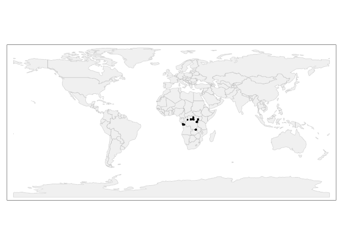
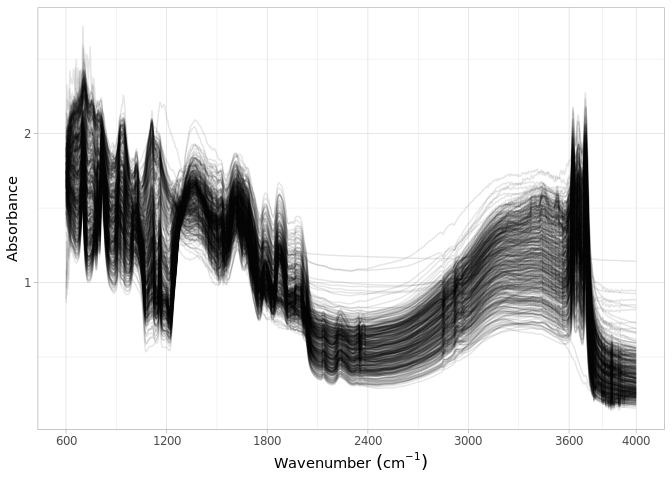

Dataset import: The Central African soil spectral library
================
Jose Lucas Safanelli (<jsafanelli@woodwellclimate.org>), Tomislav Hengl
(<tom.hengl@opengeohub.org>), Jonathan Sanderman
(<jsanderman@woodwellclimate.org>) -
01 December, 2022


-   [The central African soil spectral library
    inputs](#the-central-african-soil-spectral-library-inputs)
-   [Data import](#data-import)
    -   [Soil site information](#soil-site-information)
    -   [Soil lab information](#soil-lab-information)
    -   [Mid-infrared spectroscopy
        data](#mid-infrared-spectroscopy-data)
    -   [Quality control](#quality-control)
-   [References](#references)

[](https://soilspectroscopy.org/)

[](http://creativecommons.org/licenses/by-sa/4.0/)

This work is licensed under a [Creative Commons Attribution-ShareAlike
4.0 International
License](http://creativecommons.org/licenses/by-sa/4.0/).

## The central African soil spectral library inputs

Part of: <https://github.com/soilspectroscopy>  
Project: [Soil Spectroscopy for Global
Good](https://soilspectroscopy.org)  
Last update: 2022-12-01  
Dataset:
[CAF.SSL](https://soilspectroscopy.github.io/ossl-manual/soil-spectroscopy-tools-and-users.html#caf.ssl)

Mid-Infrared Spectra (MIRS) from The Central African SSL explained in
detail in [Summerauer et al.](#ref-summerauer2021central)
([2021](#ref-summerauer2021central)). A copy of the dataset can be
obtained from <https://github.com/laura-summerauer/ssl-central-africa>.

Input datasets:  
- `cssl_metadata_all.csv`: csv file with site information;  
- `cssl_metadata_all.csv`: csv file with soil information;  
- `cssl_spectra.csv`: MIR spectral scans;

Directory/folder path

``` r
dir = "/mnt/soilspec4gg/ossl/dataset/CASSL/"
tic()
```

## Data import

### Soil site information

``` r
caf.metadata <- fread(paste0(dir, "field_metadata/cssl_metadata_all.csv"), header = T)


caf.sitedata <- caf.metadata %>%
  select(sample_id, sample_location, country_code,
         sampling_date, sampling_layer, gps_long, gps_lat, gps_true) %>%
  rename(id.layer_local_c = sample_id,
         longitude.point_wgs84_dd = gps_long,
         latitude.point_wgs84_dd = gps_lat) %>%
  separate(sampling_layer, into = c("layer.upper.depth_usda_cm", "layer.lower.depth_usda_cm"), sep = "-") %>%
  mutate(layer.sequence_usda_uint16 = ifelse(layer.upper.depth_usda_cm == 0, 1, 2),
         location.point.error_any_m = ifelse(gps_true == "yes", 30, 1000)) %>%
  mutate(sampling_date = gsub("/", "-", sampling_date)) %>%
  mutate(sampling_date = case_when(is.na(sampling_date) ~ NA_character_,
                                   str_count(sampling_date, "-") == 2 ~ sampling_date,
                                   str_count(sampling_date, "-") == 1 &
                                     str_length(sampling_date) == 7 ~ paste0(sampling_date, "-01"),
                                   str_count(sampling_date, "-") == 1 &
                                     str_length(sampling_date) > 7 ~ paste0(str_sub(sampling_date, 1, 4), "-01-01"),
                                   str_count(sampling_date, "-") == 0 &
                                     str_length(sampling_date) == 4 ~paste0(str_sub(sampling_date, 1, 4), "-01-01"),
                                   TRUE ~ NA_character_), .after = sampling_date) %>%
  rename(observation.date.begin_iso.8601_yyyy.mm.dd = sampling_date) %>%
  mutate(observation.date.end_iso.8601_yyyy.mm.dd = observation.date.begin_iso.8601_yyyy.mm.dd) %>%
  select(id.layer_local_c, longitude.point_wgs84_dd, latitude.point_wgs84_dd, location.point.error_any_m,
         layer.sequence_usda_uint16, layer.upper.depth_usda_cm, layer.lower.depth_usda_cm,
         observation.date.begin_iso.8601_yyyy.mm.dd, observation.date.end_iso.8601_yyyy.mm.dd) %>%
  mutate(id.project_ascii_c = "The Central African Soil Spectral Library",
         id.layer_uuid_c = openssl::md5(as.character(id.layer_local_c)),
         id.location_olc_c = olctools::encode_olc(latitude.point_wgs84_dd, longitude.point_wgs84_dd, 10),
         layer.texture_usda_c = "",
         horizon.designation_usda_c = "",
         longitude.county_wgs84_dd = NA,
         latitude.county_wgs84_dd = NA,
         location.country_iso.3166_c = "",
         observation.ogc.schema.title_ogc_txt = "Open Soil Spectroscopy Library",
         observation.ogc.schema_idn_url = "https://soilspectroscopy.github.io",
         surveyor.title_utf8_txt = "Department of Environmental Systems Science, ETH Zurich, Zurich Switzerland",
         surveyor.contact_ietf_email = "laura.summerauer@usys.ethz.ch",
         surveyor.address_utf8_txt = "Department of Environmental Systems Science, ETH Zurich, Zurich Switzerland",
         dataset.title_utf8_txt = "The Central African Soil Spectral Library",
         dataset.owner_utf8_txt = "ETH Zurich",
         dataset.code_ascii_c = "CAF.SSL",
         dataset.address_idn_url = "https://www.isric.org/explore/ISRIC-collections",
         dataset.doi_idf_url = "https://doi.org/10.5281/zenodo.4351254",
         dataset.license.title_ascii_txt = "CC-BY",
         dataset.license.address_idn_url = "https://creativecommons.org/licenses/by/4.0/",
         dataset.contact.name_utf8_txt = "Laura Summerauer",
         dataset.contact_ietf_email = "laura.summerauer@usys.ethz.ch")

# Saving version to dataset root dir
site.qs = paste0(dir, "/ossl_soilsite_v1.2.qs")
qs::qsave(caf.sitedata, site.qs, preset = "high")
```

### Soil lab information

NOTE: The code chunk below this paragraph is hidden. Just run once for
getting the original names of soil properties, descriptions, data types,
and units. Run once and upload to Google Sheet for formatting and
integrating with the OSSL. Requires Google authentication.

<!-- ```{r, eval=FALSE, echo=TRUE} -->
<!-- # Getting soillab original variables -->
<!-- soillab.names <- cassl.soildata %>% -->
<!--   names(.) %>% -->
<!--   tibble(original_name = .) %>% -->
<!--   dplyr::mutate(table = 'cssl_refdata_all', .before = 1) %>% -->
<!--   dplyr::mutate(import = '', ossl_name = '', .after = original_name) %>% -->
<!--   dplyr::mutate(comment = '') -->
<!-- readr::write_csv(soillab.names, paste0(getwd(), "/cassl_soillab_names.csv")) -->
<!-- # Uploading to google sheet -->
<!-- # FACT CIN folder. Get ID for soildata importing table -->
<!-- googledrive::drive_ls(as_id("0AHDIWmLAj40_Uk9PVA")) -->
<!-- OSSL.soildata.importing <- "19LeILz9AEnKVK7GK0ZbK3CCr2RfeP-gSWn5VpY8ETVM" -->
<!-- # Checking metadata -->
<!-- googlesheets4::as_sheets_id(OSSL.soildata.importing) -->
<!-- # Checking readme -->
<!-- googlesheets4::read_sheet(OSSL.soildata.importing, sheet = 'readme') -->
<!-- # Preparing soillab.names -->
<!-- upload <- dplyr::as_tibble(soillab.names) -->
<!-- # Uploading -->
<!-- googlesheets4::write_sheet(upload, ss = OSSL.soildata.importing, sheet = "CAF") -->
<!-- # Checking metadata -->
<!-- googlesheets4::as_sheets_id(OSSL.soildata.importing) -->
<!-- ``` -->

NOTE: The code chunk below this paragraph is hidden. Run once for
importing the transformation rules. The table can be edited online at
Google Sheets. A copy is downloaded to github for archiving.

<!-- ```{r soilab_download, include=FALSE, echo=FALSE, eval=FALSE} -->
<!-- # Downloading from google sheet -->
<!-- # FACT CIN folder id -->
<!-- listed.table <- googledrive::drive_ls(as_id("0AHDIWmLAj40_Uk9PVA"), -->
<!--                                       pattern = "OSSL_tab2_soildata_importing") -->
<!-- OSSL.soildata.importing <- listed.table[[1,"id"]] -->
<!-- # Checking metadata -->
<!-- googlesheets4::as_sheets_id(OSSL.soildata.importing) -->
<!-- # Preparing soillab.names -->
<!-- transvalues <- googlesheets4::read_sheet(OSSL.soildata.importing, sheet = "CAF") %>% -->
<!--   filter(import == TRUE) %>% -->
<!--   select(contains(c("table", "id", "original_name", "ossl_"))) -->
<!-- # Saving to folder -->
<!-- write_csv(transvalues, paste0(getwd(), "/OSSL_transvalues.csv")) -->
<!-- ``` -->

Reading AFSIS1-to-OSSL transformation values:

``` r
transvalues <- read_csv(paste0(getwd(), "/OSSL_transvalues.csv"))
knitr::kable(transvalues)
```

| table              | original\_name   | ossl\_abbrev | ossl\_method | ossl\_unit | ossl\_convert                                      | ossl\_name                 |
|:-------------------|:-----------------|:-------------|:-------------|:-----------|:---------------------------------------------------|:---------------------------|
| cssl\_refdata\_all | tc               | c.tot        | usda.a622    | w.pct      | ifelse(as.numeric(x) &lt; 0, NA, as.numeric(x)/10) | c.tot\_usda.a622\_w.pct    |
| cssl\_refdata\_all | tn               | n.tot        | usda.a623    | w.pct      | ifelse(as.numeric(x) &lt; 0, NA, as.numeric(x)/10) | n.tot\_usda.a623\_w.pct    |
| cssl\_refdata\_all | ph\_h2o          | ph.h2o       | usda.a268    | index      | ifelse(as.numeric(x) &lt; 0, NA, as.numeric(x)\*1) | ph.h2o\_usda.a268\_index   |
| cssl\_refdata\_all | ph\_cacl2        | ph.cacl2     | usda.a481    | index      | ifelse(as.numeric(x) &lt; 0, NA, as.numeric(x)\*1) | ph.cacl2\_usda.a481\_index |
| cssl\_refdata\_all | clay\_0-0.002    | clay.tot     | usda.a334    | w.pct      | ifelse(as.numeric(x) &lt; 0, NA, as.numeric(x)\*1) | clay.tot\_usda.a334\_w.pct |
| cssl\_refdata\_all | silt\_0.002-0.05 | silt.tot     | usda.c62     | w.pct      | ifelse(as.numeric(x) &lt; 0, NA, as.numeric(x)\*1) | silt.tot\_usda.c62\_w.pct  |
| cssl\_refdata\_all | sand\_0.05-2     | sand.tot     | usda.c60     | w.pct      | ifelse(as.numeric(x) &lt; 0, NA, as.numeric(x)\*1) | sand.tot\_usda.c60\_w.pct  |
| cssl\_refdata\_all | al\_icp          | al.ext       | aquaregia    | g.kg       | ifelse(as.numeric(x) &lt; 0, NA, as.numeric(x)\*1) | al.ext\_aquaregia\_g.kg    |
| cssl\_refdata\_all | fe\_icp          | fe.ext       | aquaregia    | g.kg       | ifelse(as.numeric(x) &lt; 0, NA, as.numeric(x)\*1) | fe.ext\_aquaregia\_g.kg    |
| cssl\_refdata\_all | ca\_icp          | ca.ext       | aquaregia    | mg.kg      | ifelse(as.numeric(x) &lt; 0, NA, as.numeric(x)\*1) | ca.ext\_aquaregia\_mg.kg   |
| cssl\_refdata\_all | mg\_icp          | mg.ext       | aquaregia    | mg.kg      | ifelse(as.numeric(x) &lt; 0, NA, as.numeric(x)\*1) | mg.ext\_aquaregia\_mg.kg   |
| cssl\_refdata\_all | k\_icp           | k.ext        | aquaregia    | mg.kg      | ifelse(as.numeric(x) &lt; 0, NA, as.numeric(x)\*1) | k.ext\_aquaregia\_mg.kg    |
| cssl\_refdata\_all | mn\_icp          | mn.ext       | aquaregia    | mg.kg      | ifelse(as.numeric(x) &lt; 0, NA, as.numeric(x)\*1) | mn.ext\_aquaregia\_mg.kg   |
| cssl\_refdata\_all | na\_icp          | na.ext       | aquaregia    | mg.kg      | ifelse(as.numeric(x) &lt; 0, NA, as.numeric(x)\*1) | na.ext\_aquaregia\_mg.kg   |
| cssl\_refdata\_all | p\_icp           | p.ext        | aquaregia    | mg.kg      | ifelse(as.numeric(x) &lt; 0, NA, as.numeric(x)\*1) | p.ext\_aquaregia\_mg.kg    |

Preparing soil data from different files:

``` r
caf.reference <- fread(paste0(dir, "reference_data/cssl_refdata_all.csv"), header = T)

# Harmonization of names and units
analytes.old.names <- transvalues %>%
  filter(table == "cssl_refdata_all") %>%
  pull(original_name)

analytes.new.names <- transvalues %>%
  filter(table == "cssl_refdata_all") %>%
  pull(ossl_name)

# Selecting and renaming
caf.soildata <- caf.reference %>%
  rename(id.layer_local_c = sample_id) %>%
  select(id.layer_local_c, all_of(analytes.old.names)) %>%
  rename_with(~analytes.new.names, analytes.old.names) %>%
  as.data.frame()

# Removing duplicates
# caf.soildata %>%
#   group_by(id.layer_local_c) %>%
#   summarise(repeats = n()) %>%
#   group_by(repeats) %>%
#   summarise(count = n())

# Getting the formulas
functions.list <- transvalues %>%
  filter(table == "cssl_refdata_all") %>%
  mutate(ossl_name = factor(ossl_name, levels = names(caf.soildata))) %>%
  arrange(ossl_name) %>%
  pull(ossl_convert) %>%
  c("x", .)

# Applying transformation rules
caf.soildata.trans <- transform_values(df = caf.soildata,
                                       out.name = names(caf.soildata),
                                       in.name = names(caf.soildata),
                                       fun.lst = functions.list)

# Final soillab data
caf.soildata <- caf.soildata.trans

# Checking total number of observations
caf.soildata %>%
  distinct(id.layer_local_c) %>%
  summarise(count = n())
```

    ##   count
    ## 1  1852

``` r
# Saving version to dataset root dir
soillab.qs = paste0(dir, "/ossl_soillab_v1.2.qs")
qs::qsave(caf.soildata, soillab.qs, preset = "high")
```

### Mid-infrared spectroscopy data

``` r
# Floating wavenumbers
caf.spectra <- fread(paste0(dir, "spectra_data/cssl_spectra.csv"), header = T)

# Renaming
old.names <- names(caf.spectra)

caf.mir <- caf.spectra %>%
  rename(id.layer_local_c = sample_id) %>%
  mutate_at(vars(all_of(old.names[-1])), as.numeric)

# Need to resample spectra
old.wavenumber <- na.omit(as.numeric(names(caf.mir)))
new.wavenumbers <- rev(seq(600, 4000, by = 2))

caf.mir <- caf.mir %>%
  select(-id.layer_local_c) %>%
  as.matrix() %>%
  prospectr::resample(X = ., wav = old.wavenumber, new.wav = new.wavenumbers, interpol = "spline") %>%
  as_tibble() %>%
  bind_cols({caf.mir %>%
      select(id.layer_local_c)}, .) %>%
  select(id.layer_local_c, as.character(rev(new.wavenumbers)))

# Gaps
scans.na.gaps <- caf.mir %>%
  select(-id.layer_local_c) %>%
  apply(., 1, function(x) round(100*(sum(is.na(x)))/(length(x)), 2)) %>%
  tibble(proportion_NA = .) %>%
  bind_cols({caf.mir %>% select(id.layer_local_c)}, .)

# Extreme negative - irreversible erratic patterns
scans.extreme.neg <- caf.mir %>%
  select(-id.layer_local_c) %>%
  apply(., 1, function(x) {round(100*(sum(x < -1, na.rm=TRUE))/(length(x)), 2)}) %>%
  tibble(proportion_lower0 = .) %>%
  bind_cols({caf.mir %>% select(id.layer_local_c)}, .)

# Extreme positive, irreversible erratic patterns
scans.extreme.pos <- caf.mir %>%
  select(-id.layer_local_c) %>%
  apply(., 1, function(x) {round(100*(sum(x > 5, na.rm=TRUE))/(length(x)), 2)}) %>%
  tibble(proportion_higherAbs5 = .) %>%
  bind_cols({caf.mir %>% select(id.layer_local_c)}, .)

# Consistency summary - problematic scans
scans.summary <- scans.na.gaps %>%
  left_join(scans.extreme.neg, by = "id.layer_local_c") %>%
  left_join(scans.extreme.pos, by = "id.layer_local_c")

scans.summary %>%
  select(-id.layer_local_c) %>%
  pivot_longer(everything(), names_to = "check", values_to = "value") %>%
  filter(value > 0) %>%
  group_by(check) %>%
  summarise(count = n())
```

    ## # A tibble: 0 × 2
    ## # … with 2 variables: check <chr>, count <int>

``` r
# Renaming
old.wavenumbers <- seq(600, 4000, by = 2)
new.wavenumbers <- paste0("scan_mir.", old.wavenumbers, "_abs")

caf.mir <- caf.mir %>%
  rename_with(~new.wavenumbers, as.character(old.wavenumbers))

# Preparing metadata
caf.mir.metadata <- caf.mir %>%
  select(id.layer_local_c) %>%
  mutate(id.scan_local_c = id.layer_local_c) %>%
  mutate(scan.mir.date.begin_iso.8601_yyyy.mm.dd = ymd("2014-01-01"),
         scan.mir.date.end_iso.8601_yyyy.mm.dd = ymd("2018-12-31"),
         scan.mir.model.name_utf8_txt = "Bruker Vertex 70 with HTS-XT accessory",
         scan.mir.model.code_any_c = "Bruker_Vertex_70.HTS.XT",
         scan.mir.method.light.source_any_c = "",
         scan.mir.method.preparation_any_c = "",
         scan.mir.license.title_ascii_txt = "CC-BY",
         scan.mir.license.address_idn_url = "https://creativecommons.org/licenses/by/4.0/",
         scan.mir.doi_idf_c = "https://doi.org/10.5281/zenodo.4351254",
         scan.mir.contact.name_utf8_txt = "Laura Summerauer",
         scan.mir.contact.email_ietf_email = "laura.summerauer@usys.ethz.ch")

# Final preparation
caf.mir.export <- caf.mir.metadata %>%
  left_join(caf.mir, by = "id.layer_local_c")

# Saving version to dataset root dir
soilmir.qs = paste0(dir, "/ossl_mir_v1.2.qs")
qs::qsave(caf.mir.export, soilmir.qs, preset = "high")
```

### Quality control

The final table must be joined as:

-   MIR is used as first reference.
-   Then it is left joined with the site and soil lab data. This drop
    data without any scan.

The availabilty of data is summarised below:

``` r
# Taking a few representative columns for checking the consistency of joins
caf.availability <- caf.mir %>%
  select(id.layer_local_c, scan_mir.600_abs) %>%
  left_join({caf.sitedata %>%
      select(id.layer_local_c, layer.upper.depth_usda_cm)}, by = "id.layer_local_c") %>%
  left_join({caf.soildata %>%
      select(id.layer_local_c, ph.h2o_usda.a268_index)}, by = "id.layer_local_c") %>%
  filter(!is.na(id.layer_local_c))

# Availability of information from caf
caf.availability %>%
  mutate_all(as.character) %>%
  pivot_longer(everything(), names_to = "column", values_to = "value") %>%
  filter(!is.na(value)) %>%
  group_by(column) %>%
  summarise(count = n())
```

    ## # A tibble: 4 × 2
    ##   column                    count
    ##   <chr>                     <int>
    ## 1 id.layer_local_c           1578
    ## 2 layer.upper.depth_usda_cm  1544
    ## 3 ph.h2o_usda.a268_index      483
    ## 4 scan_mir.600_abs           1578

``` r
# Repeats check - Duplicates are dropped
caf.availability %>%
  mutate_all(as.character) %>%
  select(id.layer_local_c) %>%
  pivot_longer(everything(), names_to = "column", values_to = "value") %>%
  group_by(column, value) %>%
  summarise(repeats = n()) %>%
  group_by(column, repeats) %>%
  summarise(count = n())
```

    ## # A tibble: 1 × 3
    ## # Groups:   column [1]
    ##   column           repeats count
    ##   <chr>              <int> <int>
    ## 1 id.layer_local_c       1  1578

This summary shows that, at total, about 2k observations are available
without duplicates. Originally 20k MIR scans are available but only
about 10% has reference data.

Plotting sites map:

``` r
data("World")

points <- caf.sitedata %>%
  filter(!is.na(longitude.point_wgs84_dd)) %>%
  st_as_sf(coords = c('longitude.point_wgs84_dd', 'latitude.point_wgs84_dd'), crs = 4326)

tmap_mode("plot")

tm_shape(World) +
  tm_polygons('#f0f0f0f0', border.alpha = 0.2) +
  tm_shape(points) +
  tm_dots()
```

<!-- -->

Soil analytical data summary. Note: many scans could not be linked with
the wetchem.

``` r
caf.soildata %>%
  mutate(id.layer_local_c = factor(id.layer_local_c)) %>%
  skimr::skim() %>%
  dplyr::select(-numeric.hist, -complete_rate)
```

|                                                  |            |
|:-------------------------------------------------|:-----------|
| Name                                             | Piped data |
| Number of rows                                   | 1852       |
| Number of columns                                | 16         |
| \_\_\_\_\_\_\_\_\_\_\_\_\_\_\_\_\_\_\_\_\_\_\_   |            |
| Column type frequency:                           |            |
| factor                                           | 1          |
| logical                                          | 1          |
| numeric                                          | 14         |
| \_\_\_\_\_\_\_\_\_\_\_\_\_\_\_\_\_\_\_\_\_\_\_\_ |            |
| Group variables                                  | None       |

Data summary

**Variable type: factor**

| skim\_variable     | n\_missing | ordered | n\_unique | top\_counts                        |
|:-------------------|-----------:|:--------|----------:|:-----------------------------------|
| id.layer\_local\_c |          0 | FALSE   |      1852 | 08\_: 1, 08\_: 1, 08\_: 1, 08\_: 1 |

**Variable type: logical**

| skim\_variable             | n\_missing | mean | count |
|:---------------------------|-----------:|-----:|:------|
| ph.cacl2\_usda.a481\_index |       1852 |  NaN | :     |

**Variable type: numeric**

| skim\_variable             | n\_missing |   mean |      sd |    p0 |    p25 |    p50 |    p75 |     p100 |
|:---------------------------|-----------:|-------:|--------:|------:|-------:|-------:|-------:|---------:|
| c.tot\_usda.a622\_w.pct    |        184 |   1.98 |    2.51 |  0.08 |   0.89 |   1.38 |   2.31 |    45.54 |
| n.tot\_usda.a623\_w.pct    |        168 |   0.16 |    0.18 |  0.01 |   0.07 |   0.11 |   0.18 |     2.92 |
| ph.h2o\_usda.a268\_index   |       1317 |   5.10 |    0.94 |  3.32 |   4.51 |   4.84 |   5.36 |     8.56 |
| clay.tot\_usda.a334\_w.pct |       1262 |  34.63 |   21.73 |  1.04 |  12.41 |  34.88 |  51.59 |    86.88 |
| silt.tot\_usda.c62\_w.pct  |       1309 |  23.85 |   14.97 |  4.00 |  13.48 |  19.28 |  29.87 |    74.75 |
| sand.tot\_usda.c60\_w.pct  |       1309 |  42.30 |   23.77 |  1.30 |  21.12 |  40.50 |  61.12 |    89.90 |
| al.ext\_aquaregia\_g.kg    |       1128 |  25.20 |   24.69 |  0.16 |   7.94 |  12.37 |  36.24 |   121.32 |
| fe.ext\_aquaregia\_g.kg    |       1128 |  38.84 |   39.55 |  0.34 |  10.15 |  20.13 |  59.62 |   352.66 |
| ca.ext\_aquaregia\_mg.kg   |       1128 | 634.26 | 1352.25 |  0.00 |  52.50 | 186.94 | 589.29 | 19922.26 |
| mg.ext\_aquaregia\_mg.kg   |       1128 | 800.40 | 1425.40 |  9.27 |  79.37 | 141.16 | 836.50 |  9500.41 |
| k.ext\_aquaregia\_mg.kg    |       1128 | 616.41 | 1020.57 |  7.96 |  77.21 | 163.31 | 795.00 |  8073.54 |
| mn.ext\_aquaregia\_mg.kg   |       1128 | 480.73 |  934.36 |  2.23 |  30.09 |  64.16 | 455.98 |  6468.45 |
| na.ext\_aquaregia\_mg.kg   |       1128 |  69.57 |  128.62 |  0.00 |   4.99 |  13.99 |  71.72 |  1213.29 |
| p.ext\_aquaregia\_mg.kg    |       1128 | 534.89 |  773.33 | 13.90 | 130.72 | 214.20 | 580.34 |  6679.17 |

MIR spectral visualization:

``` r
set.seed(1993)
caf.mir %>%
  sample_n(500) %>%
  select(all_of(c("id.layer_local_c")), starts_with("scan_mir.")) %>%
  tidyr::pivot_longer(-all_of(c("id.layer_local_c")),
                      names_to = "wavenumber", values_to = "absorbance") %>%
  dplyr::mutate(wavenumber = gsub("scan_mir.|_abs", "", wavenumber)) %>%
  dplyr::mutate(wavenumber = as.numeric(wavenumber)) %>%
  ggplot(aes(x = wavenumber, y = absorbance, group = id.layer_local_c)) +
  geom_line(alpha = 0.1) +
  scale_x_continuous(breaks = c(600, 1200, 1800, 2400, 3000, 3600, 4000)) +
  labs(x = bquote("Wavenumber"~(cm^-1)), y = "Absorbance") +
  theme_light()
```

<!-- -->

``` r
toc()
```

    ## 14.665 sec elapsed

``` r
rm(list = ls())
gc()
```

    ##           used  (Mb) gc trigger  (Mb) max used  (Mb)
    ## Ncells 2614644 139.7    4883038 260.8  4883038 260.8
    ## Vcells 6752353  51.6   70095720 534.8 87449127 667.2

## References

<div id="refs" class="references csl-bib-body hanging-indent"
line-spacing="2">

<div id="ref-summerauer2021central" class="csl-entry">

Summerauer, L., Baumann, P., Ramirez-Lopez, L., Barthel, M., Bauters,
M., Bukombe, B., … others. (2021). The central african soil spectral
library: A new soil infrared repository and a geographical prediction
analysis. *SOIL*, *7*(2), 693–715.
doi:[10.5194/soil-7-693-2021](https://doi.org/10.5194/soil-7-693-2021)

</div>

</div>
