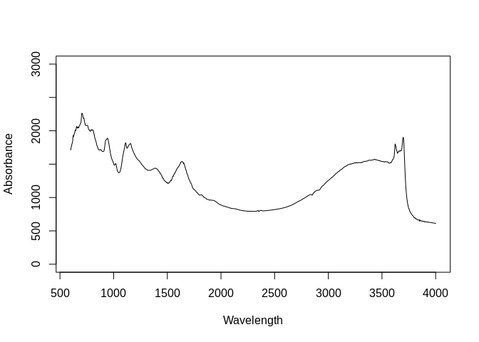
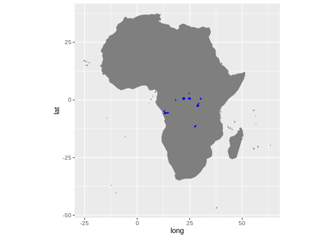

Dataset import: The Central African soil spectral library
================
Tomislav Hengl (<tom.hengl@opengeohub.org>) and Jonathan Sanderman
(<jsanderman@woodwellclimate.org>)
04 December, 2021


-   [The central African soil spectral library
    inputs](#the-central-african-soil-spectral-library-inputs)
-   [Data import](#data-import)
    -   [Soil site and laboratory data
        import:](#soil-site-and-laboratory-data-import)
        -   [Soil lab information](#soil-lab-information)
        -   [Soil site information](#soil-site-information)
    -   [Mid-infrared spectroscopy
        data](#mid-infrared-spectroscopy-data)
    -   [Quality control](#quality-control)
    -   [Distribution of points](#distribution-of-points)
-   [References](#references)

[](https://soilspectroscopy.org/)

[](http://creativecommons.org/licenses/by-sa/4.0/)

This work is licensed under a [Creative Commons Attribution-ShareAlike
4.0 International
License](http://creativecommons.org/licenses/by-sa/4.0/).

## The central African soil spectral library inputs

Part of: <https://github.com/soilspectroscopy>  
Project: [Soil Spectroscopy for Global
Good](https://soilspectroscopy.org)  
Last update: 2021-12-04  
Dataset:
[CAF.SSL](https://soilspectroscopy.github.io/ossl-manual/soil-spectroscopy-tools-and-users.html#caf.ssl)

Mid-Infrared Spectra (MIRS) from The central African soil spectral
library explained in detail in [Summerauer et
al.](#ref-summerauer2021central) ([2021](#ref-summerauer2021central)). A
copy of the dataset can be obtain from
<https://github.com/laura-summerauer/ssl-central-africa>.

Directory/folder path

``` r
dir = "/mnt/soilspec4gg/ossl/dataset/CASSL/"
```

## Data import

### Soil site and laboratory data import:

``` r
cassl.xy = read.csv(paste0(dir, "field_metadata/cssl_metadata_all.csv"))
cassl.xy$observation.date.begin_iso.8601_yyyy.mm.dd = cassl.xy$sampling_date
cassl.xy$observation.date.end_iso.8601_yyyy.mm.dd = cassl.xy$sampling_date
cassl.xy$layer.upper.depth_usda_cm = ifelse(cassl.xy$sampling_layer=="0-20", 0, 20)
cassl.xy$layer.lower.depth_usda_cm = ifelse(cassl.xy$sampling_layer=="20-50", 20, 50)
cassl.xy$id.layer_local_c = cassl.xy$sample_id
```

#### Soil lab information

Harmonization function:

``` r
cassl.df = read.csv(paste0(dir, "reference_data/ssl_refdata_all.csv"))
## https://github.com/laura-summerauer/ssl-central-africa/tree/main/data/reference_data
in.name = c("tc", "tn", "ph_h2o", "ph_kcl", "ph_cacl2", "clay_0.0.002",
            "silt_0.002.0.05", "sand_0.05.2", "al_icp", "ca_icp", "mg_icp", "k_icp", "na_icp", "fe_icp")
#in.name[which(!in.name %in% names(casslt.df))]
cassl.soil = as.data.frame(cassl.df[,in.name])
out.name = c("c.tot_usda.4h2_wpct", "n.tot_usda.4h2_wpct", "ph.h2o_usda.4c1_index", "ph.kcl_usda.4c1_index", "ph.cacl2_usda.4c1_index",
             "clay.tot_usda.3a1_wpct", "silt.tot_usda.3a1_wpct", "sand.tot_usda.3a1_wpct",
             "al.kcl_usda.4b3_cmolkg", "ca.ext_usda.4b1_cmolkg", "mg.ext_usda.4b1_cmolkg", "k.ext_usda.4b1_cmolkg", 
             "na.ext_usda.4b1_cmolkg", "fe.kcl_usda.4b3_mgkg")
## compare values
#summary(cassl.soil$k_icp)
#summary(cassl.soil$ca_icp)
#summary(cassl.soil$clay_0.0.002)
fun.lst = as.list(rep("x*1", length(in.name)))
fun.lst[[which(in.name=="tc")]] = "x/10"
fun.lst[[which(in.name=="tn")]] = "x/10"
fun.lst[[which(in.name=="ca_icp")]] = "x/200"
fun.lst[[which(in.name=="mg_icp")]] = "x/121"
fun.lst[[which(in.name=="na_icp")]] = "x/230"
fun.lst[[which(in.name=="k_icp")]] = "x/391"
fun.lst[[which(in.name=="al_icp")]] = "x/90"
## save translation rules:
#View(data.frame(in.name, out.name, unlist(fun.lst)))
write.csv(data.frame(in.name, out.name, unlist(fun.lst)), "./cassl_soilab_transvalues.csv")
cassl.soil.f = transvalues(cassl.soil, out.name, in.name, fun.lst)
cassl.soil.f$id.layer_local_c = cassl.df$sample_id
```

Exporting the table:

``` r
cassl.soil.f$id.layer_uuid_c = openssl::md5(make.unique(paste0(cassl.soil.f$id.layer_local_c)))
cassl.soil.f$sample.doi_idf_c = "10.5281/zenodo.4320395"
cassl.soil.f$sample.contact.name_utf8_txt = "Laura Summerauer"
cassl.soil.f$sample.contact.email_ietf_email = "laura.summerauer@usys.ethz.ch"
x.na = soilab.name[which(!soilab.name %in% names(cassl.soil.f))]
if(length(x.na)>0){ for(i in x.na){ cassl.soil.f[,i] <- NA } }
soilab.rds = paste0(dir, "ossl_soillab_v1.rds")
if(!file.exists(soilab.rds)){
  saveRDS.gz(cassl.soil.f[,soilab.name], soilab.rds)
}
```

#### Soil site information

``` r
cassl.xy$longitude_wgs84_dd = cassl.xy$gps_long
cassl.xy$latitude_wgs84_dd = cassl.xy$gps_lat
cassl.xy$id.layer_uuid_c = plyr::join(cassl.xy["id.layer_local_c"], cassl.soil.f[c("id.layer_local_c","id.layer_uuid_c")])$id.layer_uuid_c
```

    ## Joining by: id.layer_local_c

``` r
cassl.site = as.data.frame(cassl.xy[,c("layer.upper.depth_usda_cm", "layer.lower.depth_usda_cm", 
                                          "latitude_wgs84_dd", "longitude_wgs84_dd",
                                           "id.layer_local_c", "id.layer_uuid_c")])
cassl.site$id.location_olc_c = olctools::encode_olc(cassl.site$latitude_wgs84_dd, cassl.site$longitude_wgs84_dd, 10)
```

Exporting the table:

``` r
cassl.site$observation.ogc.schema.title_ogc_txt = 'Open Soil Spectroscopy Library'
cassl.site$observation.ogc.schema_idn_url = 'https://soilspectroscopy.github.io/'
cassl.site$dataset.title_utf8_txt = "The Central African Soil Spectral Library"
cassl.site$dataset.doi_idf_c = "10.5281/zenodo.4320395"
cassl.site$surveyor.address_utf8_txt = "Department of Environmental Systems Science, ETH Zurich, Zurich Switzerland"
cassl.site$surveyor.contact_ietf_email = "laura.summerauer@usys.ethz.ch"
cassl.site$dataset.code_ascii_c = "CAF.SSL"
cassl.site$location.method_any_c = "GPS"
cassl.site$observation.date.begin_iso.8601_yyyy.mm.dd = cassl.xy$sampling_date
cassl.site$observation.date.end_iso.8601_yyyy.mm.dd = cassl.xy$sampling_date
cassl.site$dataset.license.title_ascii_txt = "CC-BY" 
cassl.site$dataset.license.address_idn_url = "https://creativecommons.org/licenses/by/4.0/"
cassl.site$dataset.address_idn_url = "Department of Environmental Systems Science, ETH Zurich, Zurich Switzerland"
cassl.site$dataset.owner_utf8_txt = "ETH Zurich"
cassl.site$dataset.contact.name_utf8_txt = "Laura Summerauer"
cassl.site$dataset.contact_ietf_email = "laura.summerauer@usys.ethz.ch"
x.na = site.name[which(!site.name %in% names(cassl.site))]
if(length(x.na)>0){ for(i in x.na){ cassl.site[,i] <- NA } }
soilsite.rds = paste0(dir, "ossl_soilsite_v1.rds")
if(!file.exists(soilsite.rds)){
  saveRDS.gz(cassl.site[,site.name], soilsite.rds)
}
```

### Mid-infrared spectroscopy data

Mid-infrared (MIR) soil spectroscopy raw data
(<https://doi.org/10.5281/zenodo.4351254>):

``` r
cassl.mir = vroom::vroom(paste0(dir, "/spectra_data/cssl_spectra.csv"))
```

    ## Rows: 1,578
    ## Columns: 3,709
    ## Delimiter: ","
    ## chr [   1]: sample_id
    ## dbl [3702]: 7498, 7496, 7494.1, 7492.2, 7490.2, 7488.3, 7486.4, 7484.5, 7482.5, 7480.6, 7478.7, 7476.7, 7474.8, 7472.9, 7471, 7469, 7467.1, 7465.2, 74...
    ## lgl [   6]: 7505.7, 7503.7, 7501.8, 7499.9, 597.8, 595.9
    ## 
    ## Use `spec()` to retrieve the guessed column specification
    ## Pass a specification to the `col_types` argument to quiet this message

``` r
dim(cassl.mir)
```

    ## [1] 1578 3709

Add the [Universal Unique
Identifier](https://cran.r-project.org/web/packages/uuid/) (UUI):

``` r
cassl.mir$id.scan_uuid_c = openssl::md5(make.unique(paste0("CAF.SSL", cassl.mir$sample_id)))
```

Resampling the MIR spectra from the original window size to 2 cm-1 in
`cassl.abs`. This operation can be time-consuming:

``` r
sel.abs = names(cassl.mir)[-which(names(cassl.mir) %in% c("sample_id","id.scan_uuid_c"))]
## 3708
#summary(as.numeric(sel.abs))
cassl.abs = cassl.mir[,c("id.scan_uuid_c", "sample_id", sel.abs)]
na.lst = rowSums(cassl.abs[,sel.abs])
str(which(is.na(na.lst)))
```

    ##  int [1:1578] 1 2 3 4 5 6 7 8 9 10 ...

``` r
## several incomplete scans
#cassl.abs = cassl.abs[-which(is.na(na.lst)),]
dim(cassl.abs)
```

    ## [1] 1578 3710

``` r
wav.mir = as.numeric(sel.abs) # Get wavelength only
#summary(wav.mir)
# Creating a matrix with only spectral values to resample it
cassl.mir.spec = as.matrix(cassl.abs[,sel.abs])
colnames(cassl.mir.spec) = wav.mir
rownames(cassl.mir.spec) = cassl.abs$id.scan_uuid_c
## remove values out of range
cassl.mir = prospectr::resample(cassl.mir.spec, wav.mir, seq(600, 4000, 2)) 
cassl.mir = as.data.frame(cassl.mir)
mir.n = paste0("scan_mir.", seq(600, 4000, 2), "_abs")
colnames(cassl.mir) = mir.n
```

Remove values out of range:

``` r
cassl.mir.f = parallel::mclapply(cassl.mir, function(j){ round(ifelse(j<0, NA, ifelse(j>3, NA, j))*1000) }, mc.cores=80)
cassl.mir.f = as.data.frame(do.call(cbind, cassl.mir.f))
#str(names(cassl.mir.f))
cassl.mir.f$id.scan_uuid_c = rownames(cassl.mir)
```

Plotting MIR spectra to see if there are still maybe negative values in
the table:

``` r
matplot(y=as.vector(t(cassl.mir.f[250,mir.n])), x=seq(600, 4000, 2),
        ylim = c(0,3000),
        type = 'l', 
        xlab = "Wavelength", 
        ylab = "Absorbance"
        )
```

<!-- -->

Export final MIR table:

``` r
cassl.mir.f$id.layer_local_c = plyr::join(cassl.mir.f["id.scan_uuid_c"], cassl.abs[c("id.scan_uuid_c","sample_id")])$sample_id
```

    ## Joining by: id.scan_uuid_c

``` r
cassl.mir.f$id.layer_uuid_c = plyr::join(cassl.mir.f["id.layer_local_c"], cassl.soil.f[c("id.layer_local_c","id.layer_uuid_c")], match="first")$id.layer_uuid_c
```

    ## Joining by: id.layer_local_c

``` r
summary(is.na(cassl.mir.f$id.layer_uuid_c))
```

    ##    Mode   FALSE 
    ## logical    1578

``` r
cassl.mir.f$model.name_utf8_txt = "Bruker Vertex 70 with HTS-XT accessory"
cassl.mir.f$model.code_any_c = "Bruker_Vertex_70.HTS.XT"
cassl.mir.f$method.light.source_any_c = ""
cassl.mir.f$method.preparation_any_c = ""
cassl.mir.f$scan.file_any_c = ""
cassl.mir.f$scan.date.begin_iso.8601_yyyy.mm.dd = as.Date("2014-01-01")
cassl.mir.f$scan.date.end_iso.8601_yyyy.mm.dd = as.Date("2018-08-01")
cassl.mir.f$scan.license.title_ascii_txt = "CC-BY"
cassl.mir.f$scan.license.address_idn_url = "https://creativecommons.org/licenses/by/4.0/"
cassl.mir.f$scan.doi_idf_c = "10.5281/zenodo.4320395"
cassl.mir.f$scan.contact.name_utf8_txt = "Laura Summerauer"
cassl.mir.f$scan.contact.email_ietf_email = "laura.summerauer@usys.ethz.ch"
```

Save to RDS file:

``` r
x.na = mir.name[which(!mir.name %in% names(cassl.mir.f))]
if(length(x.na)>0){ for(i in x.na){ cassl.mir.f[,i] <- NA } }
#str(cassl.mir.f[,mir.name[1:24]])
mir.rds = paste0(dir, "ossl_mir_v1.rds")
if(!file.exists(mir.rds)){
  saveRDS.gz(cassl.mir.f[,mir.name], mir.rds)
}
#rm(cassl.mir.spec); rm(cassl.mir); rm(cassl.abs)
#gc()
```

### Quality control

Check if some points don’t have any spectral scans:

``` r
mis.r = cassl.mir.f$id.layer_uuid_c %in% cassl.site$id.layer_uuid_c
summary(mis.r)
```

    ##    Mode    TRUE 
    ## logical    1578

``` r
## All OK
```

### Distribution of points

We can plot an world map showing distribution of the sampling locations
for the CAF points.

``` r
cassl.map = NULL
library(maptools)
```

    ## Checking rgeos availability: TRUE

    ## 
    ## Attaching package: 'maptools'

    ## The following object is masked from 'package:Hmisc':
    ## 
    ##     label

``` r
data(wrld_simpl)
afr = wrld_simpl[wrld_simpl$REGION==2,]
mapWorld = borders(afr, colour = 'gray50', fill = 'gray50')
cassl.map = ggplot() + mapWorld
cassl.map = cassl.map + geom_point(aes(x=cassl.site$longitude_wgs84_dd, y=cassl.site$latitude_wgs84_dd), color = 'blue', shape = 18, size=.9) + coord_fixed(ratio=1.1)
cassl.map
```

<!-- -->

Fig. 1: The Central African Soil Spectral Library locations of sites
across the globe.

Warning: Removed 167 rows containing missing values (geom\_point).

``` r
#save.image.pigz(file=paste0(dir, "CAFSSL.RData"), n.cores=32)
#rmarkdown::render("dataset/CASSL/README.Rmd")
```

## References

<div id="refs" class="references csl-bib-body hanging-indent"
line-spacing="2">

<div id="ref-summerauer2021central" class="csl-entry">

Summerauer, L., Baumann, P., Ramirez-Lopez, L., Barthel, M., Bauters,
M., Bukombe, B., … others. (2021). The central african soil spectral
library: A new soil infrared repository and a geographical prediction
analysis. *SOIL*, *7*(2), 693–715.
doi:[10.5194/soil-7-693-2021](https://doi.org/10.5194/soil-7-693-2021)

</div>

</div>
