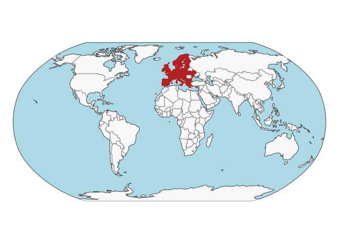
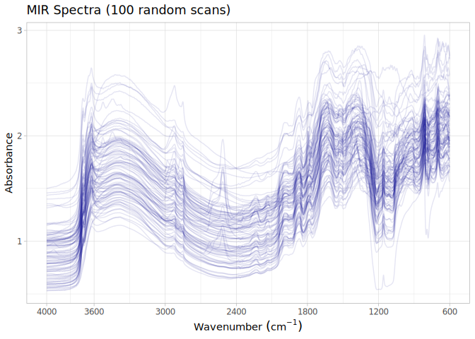

# GEMAS dataset preparation for the OSSL
Ran Zhi, Jose L. Safanelli, Jonathan Sanderman, Federal Institute for
Geosciences and Natural Resources, José Martín Soriano Disla, Leslie J.
Janik, Clemens Reimann (former lead, retired), Geological Survey of
Norway (NGU), Anna Ladenberger, Geological Survey of Sweden
(SGU), Philippe Negrel, French Geological Survey (BRGM)

- [The GEMAS original data](#the-gemas-original-data)
- [Data standardization to the OSSL
  format](#data-standardization-to-the-ossl-format)
  - [Site information](#site-information)
  - [Soil lab information (reference analytical
    data)](#soil-lab-information-reference-analytical-data)
  - [Mid-infrared spectra (MIR)](#mid-infrared-spectra-mir)
  - [Quality control](#quality-control)
- [References](#references)

Code repository for preparing and importing the Geochemical Mapping of
Agricultural and Grazing Land Soil (GEMAS) dataset into the Open Soil
Spectral Library.

Website: [Soil Spectroscopy for Global
Good](https://soilspectroscopy.org)  
Development: <https://github.com/soilspectroscopy>  
Last update: 2026-04-29  
Additional documentation:

## The GEMAS original data

Site data, Soil lab data, and Mid-Infrared Spectra (MIR) from the
Geochemical Mapping of Agricultural and Grazing Land Soil (GEMAS).
Further information can be found in detail at
https://gemas.eurogeosurveys.org/, Reimann, Birke, Demetriades,
Filzmoser, & O’Connor ([2014a](#ref-reimann2014parta)), Reimann, Birke,
Demetriades, Filzmoser, & O’Connor ([2014b](#ref-reimann2014partb)),
Soriano-Disla, Janik, McLaughlin, Forrester, Kirby, et al.
([2013](#ref-SorianoDisla2013aqua)), Soriano-Disla, Janik, McLaughlin,
Forrester, K. Kirby, et al. ([2013](#ref-SorianoDisla2013xrf)).

Original files:  
- `GEMAS_MIRcompiled.csv`: csv file with site, soil, and spectral data.

Directory/folder path with original files (not uploaded to GitHub).

``` r
# dir = "/Users/rzhi/Projects/git/ossl-imports-internal/dataset/GEMAS"
dir = dir = "~/mnt-ossl-private/database/datasets/GEMAS"
tic()
```

## Data standardization to the OSSL format

### Site information

``` r
gemas.metadata <- fread(path(dir, "GEMAS_MIRcompiled.csv"), header = T)

gemas.sitedata <- gemas.metadata %>%
  as_tibble() %>%
  distinct(sample_id, COUNTRY, TYPE, ALT, XCOO, YCOO, UHDICM, LHDICM) %>%
  rename(id.layer_local_c = sample_id,
         longitude.point_wgs84_dd = XCOO,
         latitude.point_wgs84_dd = YCOO,
         layer.upper.depth_usda_cm = UHDICM,
         layer.lower.depth_usda_cm = LHDICM,
         loc.country_src_code = COUNTRY,
         site.land.use_src_code = TYPE,
         site.alt_src_m = ALT) %>%
  mutate(across(c("id.layer_local_c"), ~as.character(.x))) %>%
  mutate(layer.sequence_usda_uint16 = ifelse(layer.upper.depth_usda_cm == 0, 1, 2)) %>%
  # mutate(id.project_ascii_txt = "GEMAS Soil Spectral Library",
  #        dataset.code_ascii_txt = "GEMAS.MIR",
  #        observation.ogc.schema.title_ogc_txt = "Open Soil Spectroscopy Library",
  #        observation.ogc.schema_idn_url = "https://soilspectroscopy.github.io",
  #        surveyor.title_utf8_txt = "Clemens Reimann, Manfred Birke, Alecos Demetriades, and Ilse Schoeters, Rio Tinto et.al ",
  #        surveyor.contact_ietf_email = " Clemens.Reimann@ngu.no, Manfred.Birke@bgr.de, ademetriades@igme.gr, and Ilse.SCHOETERS@riotinto.com",
  #        dataset.title_utf8_txt = "GEMAS Soil Spectral Library",
  #        dataset.owner_utf8_txt = "EuroGeoSurveys Geochemistry Expert Group and Eurometaux",
  #        dataset.address_idn_url = "https://gemas.eurogeosurveys.org/GEMAS.htm",
  #        dataset.doi_idf_url = "https://data.europa.eu/data/datasets/20607a6b-f412-4777-9d43-67d734677d57?locale=en",
  #        dataset.license.title_ascii_txt = "CC-BY 4.0",
  #        dataset.license.address_idn_url = "https://creativecommons.org/licenses/by/4.0/legalcode",
  #        dataset.contact.name_utf8_txt = "Federal Institute for Geosciences and Natural Resources",
  #        dataset.contact_ietf_email = "gemas@bgr.de") %>%
  mutate(dataset.code_ascii_txt = "GEMAS",
         id.layer_uuid_txt = openssl::md5(paste0(dataset.code_ascii_txt, id.layer_local_c)),
         .before = 1) %>%
  mutate_at(vars(starts_with("id.")), as.character)

# Saving version to dataset root dir
site.exp.file = path(dir, "ossl_soilsite_v1.3")
readr::write_csv(gemas.sitedata, str_c(site.exp.file, ".csv.gz"))
nanoparquet::write_parquet(gemas.sitedata, str_c(site.exp.file, ".parquet"))
```

Plotting sites map:

``` r
data("World")

ocean <- ne_download(scale = 110, type = "ocean", category = "physical", returnclass = "sf")
```

    Reading 'ne_110m_ocean.zip' from naturalearth...

``` r
points <- gemas.sitedata %>%
  filter(!is.na(longitude.point_wgs84_dd),
         !is.na(latitude.point_wgs84_dd)) %>%
  st_as_sf(coords = c('longitude.point_wgs84_dd', 'latitude.point_wgs84_dd'), crs = 4326)

tmap_mode("plot")
```

    ℹ tmap modes "plot" - "view"
    ℹ toggle with `tmap::ttm()`

``` r
tm_shape(ocean) +
  tm_polygons(fill = "lightblue", col = NA) +
  tm_shape(World) +
  tm_polygons(fill = "#f0f0f0", fill_alpha = 0.5, col_alpha = 0.5) +
  tm_shape(points) +
  tm_dots(size = 0.10, fill = "firebrick") +
  tm_crs("ESRI:54030") +
  tm_layout(frame = FALSE)
```

    [tip] Consider a suitable map projection, e.g. by adding `+ tm_crs("auto")`.
    This message is displayed once per session.



### Soil lab information (reference analytical data)

NOTE: The code chunk below must be run just once for getting a template
for scripted column standardization. Just run once for getting the
original names of soil properties, descriptions, data types, and units.
Then upload to Google Sheet for editing and defining the rules for
integrating with the OSSL. Requires Google authentication. A copy of the
output file is saved to this folder for archiving purposes.

``` r
# Getting soillab original variables

soillab.names <- gemas.metadata %>%
  distinct(sample_id,
           silt, clay,
           As, Cd, Cu, Pb, Zn,
           C_tot, TOC,
           CEC, pH_CaCl2, LOI) %>%
  names(.) %>%
  tibble(original_name = .) %>%
  dplyr::mutate(table = 'GEMAS_MIRcompiled.csv', .before = 1) %>%
  dplyr::mutate(import = '', original_unit = '',  original_method = '', comment = '', ossl_abbrev = '', ossl_method = '', 
                ossl_unit = '', ossl_convert = '', ossl_name = '', .after = original_name)

readr::write_csv(soillab.names, path(getwd(), "soillab_original_names.csv"))

# Uploading to google sheet

# Drive 'Open Soil Spectral Library'
# Folder 'Database v2'
googledrive::drive_ls(as_id("1l9VM4fFks2xBloDE69EFTfPgQeFx5aGw"))

# Use the ID of the file 'OSSL_v2_tab2_soildata_importing'
OSSL.soildata.importing <- "1mWTDJDuMp4oObcCxAy9gofSkrkcSWWf1TtEW2SuC1es"

# Checking metadata
googlesheets4::as_sheets_id(OSSL.soildata.importing)

# Checking readme
googlesheets4::read_sheet(OSSL.soildata.importing, sheet = 'readme')

# Preparing soillab.names for this dataset
upload <- dplyr::as_tibble(soillab.names)

# Uploading with TEMP name. Check online, move to sequence, and update name
googlesheets4::write_sheet(upload, ss = OSSL.soildata.importing, sheet = "TEMP")

# Checking metadata
googlesheets4::as_sheets_id(OSSL.soildata.importing)
```

NOTE: The code chunk below must be run just once. Run for getting the
column standardization rules after editing online on Google Sheets. A
copy of the output file is saved to this folder for archiving purposes.

``` r
# Downloading from google sheet

# Checking metadata
googlesheets4::as_sheets_id("1mWTDJDuMp4oObcCxAy9gofSkrkcSWWf1TtEW2SuC1es")

# Preparing soillab.names
transvalues <- googlesheets4::read_sheet("1mWTDJDuMp4oObcCxAy9gofSkrkcSWWf1TtEW2SuC1es",
                                         sheet = "GEMAS")

# Saving to folder
write_csv(transvalues, path(getwd(), "soillab_standardized_names.csv"))
```

Reading standardization rules:

``` r
transvalues <- read_csv(path(getwd(), "soillab_standardized_names.csv"),
                        show_col_types = F) %>%
  filter(import == TRUE) %>%
  select(contains(c("table", "id", "original_name", "original_unit" , "ossl_")))

knitr::kable(transvalues)
```

| table | original_name | original_unit | ossl_abbrev | ossl_method | ossl_unit | ossl_convert | ossl_name |
|:---|:---|:---|:---|:---|:---|:---|:---|
| GEMAS_MIRcompiled.csv | C_tot | wt% | c.tot | iso.10694 | w.pct | ifelse(as.numeric(x) \< 0, NA, as.numeric(x) \* 1) | c.tot_iso.10694_w.pct |
| GEMAS_MIRcompiled.csv | TOC | wt% | oc | iso.10694 | w.pct | ifelse(as.numeric(x) \< 0, NA, as.numeric(x) \* 1) | oc_iso.10694_w.pct |
| GEMAS_MIRcompiled.csv | CEC | meq | cec | usda.a723 | cmolc.kg | ifelse(as.numeric(x) \< 0, NA, as.numeric(x) \* 1) | cec_usda.a723_cmolc.kg |
| GEMAS_MIRcompiled.csv | pH_CaCl2 | NA | ph.cacl2 | iso.10390 | index | ifelse(as.numeric(x) \< 0, NA, as.numeric(x) \* 1) | ph.cacl2_iso.10390_index |

Standardizing soil data to the OSSL format:

``` r
# Unique soil values
gemas.reference <- gemas.metadata %>%
  distinct(sample_id, silt, clay,
           As, Cd, Cu, Pb, Zn,
           C_tot, TOC, CEC, pH_CaCl2, LOI)

# Harmonization of names and units
analytes.old.names <- transvalues %>%
  filter(table == "GEMAS_MIRcompiled.csv") %>%
  pull(original_name)

analytes.new.names <- transvalues %>%
  filter(table == "GEMAS_MIRcompiled.csv") %>%
  pull(ossl_name)

# Selecting and renaming
analytes.old.names.clean <- analytes.old.names[analytes.old.names != "sample_id"]
analytes.new.names.clean <- analytes.new.names[analytes.old.names != "sample_id"]

gemas.soildata <- gemas.reference %>%
  rename(id.layer_local_c = sample_id) %>%
  select(id.layer_local_c, all_of(analytes.old.names.clean)) %>%
  rename_with(~analytes.new.names.clean, all_of(analytes.old.names.clean)) %>%
  mutate(id.layer_local_c = as.character(id.layer_local_c)) %>%
  as.data.frame()

# Getting the formulas
functions.list <- transvalues %>%
  filter(table == "GEMAS_MIRcompiled.csv") %>%
  mutate(ossl_name = factor(ossl_name, levels = names(gemas.soildata))) %>%
  arrange(ossl_name) %>%
  pull(ossl_convert) %>%
  c("x", .)

# Applying transformation rules
gemas.soildata.trans <- transform_values(df = gemas.soildata,
                                         out.name = names(gemas.soildata),
                                         in.name = names(gemas.soildata),
                                         fun.lst = functions.list)

# Final soillab data
gemas.soildata <- gemas.soildata.trans %>%
  mutate_at(vars(starts_with("id.")), as.character)

# Checking total number of observations
gemas.soildata %>%
  distinct(id.layer_local_c) %>%
  summarise(count = n())
```

      count
    1  4131

``` r
# Saving version to dataset root dir
soillab.exp.file = path(dir, "ossl_soillab_v1.3")
readr::write_csv(gemas.soildata, str_c(soillab.exp.file, ".csv.gz"))
nanoparquet::write_parquet(gemas.soildata, str_c(soillab.exp.file, ".parquet"))
```

Soil lab data summary.

``` r
gemas.soildata %>%
  mutate(id.layer_local_c = factor(id.layer_local_c)) %>%
  skimr::skim() %>%
  dplyr::select(-numeric.hist, -complete_rate)
```

|                                                  |            |
|:-------------------------------------------------|:-----------|
| Name                                             | Piped data |
| Number of rows                                   | 4131       |
| Number of columns                                | 5          |
| \_\_\_\_\_\_\_\_\_\_\_\_\_\_\_\_\_\_\_\_\_\_\_   |            |
| Column type frequency:                           |            |
| factor                                           | 1          |
| numeric                                          | 4          |
| \_\_\_\_\_\_\_\_\_\_\_\_\_\_\_\_\_\_\_\_\_\_\_\_ |            |
| Group variables                                  | None       |

Data summary

**Variable type: factor**

| skim_variable    | n_missing | ordered | n_unique | top_counts                   |
|:-----------------|----------:|:--------|---------:|:-----------------------------|
| id.layer_local_c |         0 | FALSE   |     4131 | 1: 1, 100: 1, 100: 1, 100: 1 |

**Variable type: numeric**

| skim_variable            | n_missing |  mean |   sd |  p0 |   p25 |   p50 |   p75 |  p100 |
|:-------------------------|----------:|------:|-----:|----:|------:|------:|------:|------:|
| c.tot_iso.10694_w.pct    |         0 |  3.91 | 4.94 |   0 |  1.64 |  2.68 |  4.34 | 50.10 |
| oc_iso.10694_w.pct       |         0 |  3.27 | 4.76 |   0 |  1.40 |  2.10 |  3.40 | 49.00 |
| cec_usda.a723_cmolc.kg   |         0 | 19.14 | 9.17 |   0 | 11.90 | 17.50 | 24.90 | 49.88 |
| ph.cacl2_iso.10390_index |         0 |  5.78 | 1.14 |   0 |  4.81 |  5.62 |  6.97 |  8.06 |

### Mid-infrared spectra (MIR)

Some samples have scan replicates, with the letter “r” followed by rep
number. We will drop replicates because the average spectra is also
provided (without “r”). The spectra is originally stored as pseudo
absorbance, no need to transform.

``` r
gemas.mir.proc <- gemas.metadata %>%
  rename(id.layer_local_c = sample_id,
         id.scan_local_c = aowx_file) %>%
  mutate(across(c("id.layer_local_c", "id.scan_local_c"), ~as.character(.x))) %>%
  filter(!grepl("r", id.scan_local_c))

# Need to reduce spectral dimension. Already spaced by 2 cm, but larger range
old.wavenumber <- names(gemas.mir.proc)[grep("^[0-9]+$", names(gemas.mir.proc))]
old.wavenumber.num <- as.numeric(old.wavenumber)

new.wavenumber <- seq(600, 4000, by = 2)

gemas.mir.proc <- gemas.mir.proc %>%
  select(starts_with("id"), all_of(as.character(new.wavenumber)))

# Gaps
mir.na.gaps <- gemas.mir.proc %>%
  select(-starts_with("id")) %>%
  apply(., 1, function(x) round(100*(sum(is.na(x)))/(length(x)), 2)) %>%
  tibble(proportion_NA = .) %>%
  bind_cols({gemas.mir.proc %>% select(id.layer_local_c)}, .)

# Extreme negative - irreversible erratic patterns
mir.extreme.neg <- gemas.mir.proc %>%
  select(-starts_with("id")) %>%
  apply(., 1, function(x) {round(100*(sum(x < -1, na.rm=TRUE))/(length(x)), 2)}) %>%
  tibble(proportion_lower0 = .) %>%
  bind_cols({gemas.mir.proc %>% select(id.layer_local_c)}, .)

# Extreme positive, irreversible erratic patterns
mir.extreme.pos <- gemas.mir.proc %>%
  select(-starts_with("id")) %>%
  apply(., 1, function(x) {round(100*(sum(x > 5, na.rm=TRUE))/(length(x)), 2)}) %>%
  tibble(proportion_higherAbs5 = .) %>%
  bind_cols({gemas.mir.proc %>% select(id.layer_local_c)}, .)

# Consistency summary - problematic scans
mir.summary <- mir.na.gaps %>%
  left_join(mir.extreme.neg, by = "id.layer_local_c") %>%
  left_join(mir.extreme.pos, by = "id.layer_local_c")

mir.summary %>%
  select(-id.layer_local_c) %>%
  pivot_longer(everything(), names_to = "check", values_to = "value") %>%
  filter(value > 0) %>%
  group_by(check) %>%
  summarise(count = n())
```

    # A tibble: 0 × 2
    # ℹ 2 variables: check <chr>, count <int>

``` r
# Renaming
final.mir.names <- paste0("scan_mir.", new.wavenumber, "_abs")

gemas.mir.proc <- gemas.mir.proc %>%
  rename_with(~final.mir.names, as.character(new.wavenumber))

# # Preparing metadata
# gemas.mir.metadata <- gemas.mir.proc %>%
#   select(id.layer_local_c) %>%
#   mutate(id.scan_local_c = id.layer_local_c,
#          scan.mir.date.begin_iso.8601_yyyy = ymd("2008-01-01"), 
#          scan.mir.date.end_iso.8601_yyyy = ymd("2009-3-30"), 
#          scan.mir.model.name_utf8_txt = "Perkin–Elmer Spectrum-One™ Fourier-transform infrared spectrometer (Perkin Elmer Inc., Mass. USA)", 
#          scan.mir.license.title_ascii_txt = "CC-BY 4.0",
#          scan.mir.method.optics_any_txt = "",
#          scan.mir.method.preparation_any_txt = "All soil samples were air dried, sieved to <2 mm using a nylon screen, homogenised and finally split into sub-samples (10 splits)",
#          scan.mir.doi_idf_url = "https://gemas.eurogeosurveys.org/GEMAS.htm",
#          scan.mir.contact.name_utf8_txt = "Clemens Reimann",
#          scan.mir.contact.email_ietf_txt = "Clemens.Reimann@ngu.no")
# 
# # Final preparation
# gemas.mir.export <- gemas.mir.metadata %>%
#   left_join(gemas.mir.proc, by = "id.layer_local_c") %>%
#   mutate(across(starts_with("id."), as.character))

gemas.mir.export <- gemas.mir.proc

# Saving version to dataset root dir
mir.exp.file = path(dir, "ossl_mir_v1.3")
readr::write_csv(gemas.mir.export, str_c(mir.exp.file, ".csv.gz"))
nanoparquet::write_parquet(gemas.mir.export, str_c(mir.exp.file, ".parquet"))
```

### Quality control

The final table must be joined as follows:

- MIR is used as first reference for pairing with soil data.
- Soil lab data are left joined to MIR. This drop data without any
  available scan.

The availability of data is summarized below:

``` r
# Taking a few representative columns for checking the consistency of joins
gemas.availability <- gemas.mir.export %>%
  select(id.layer_local_c, scan_mir.1000_abs) %>%
  left_join(gemas.soildata, by = "id.layer_local_c") %>%
  filter(!is.na(id.layer_local_c))

# Availability of information from besb
gemas.availability %>%
  mutate(across(everything(), as.character)) %>%
  pivot_longer(everything(), names_to = "column", values_to = "value") %>%
  filter(!is.na(value)) %>%
  group_by(column) %>%
  summarise(count = n())
```

    # A tibble: 6 × 2
      column                   count
      <chr>                    <int>
    1 c.tot_iso.10694_w.pct     4131
    2 cec_usda.a723_cmolc.kg    4131
    3 id.layer_local_c          4131
    4 oc_iso.10694_w.pct        4131
    5 ph.cacl2_iso.10390_index  4131
    6 scan_mir.1000_abs         4131

``` r
# Repeats check - Duplicates are dropped
gemas.availability %>%
  mutate_all(as.character) %>%
  select(id.layer_local_c) %>%
  pivot_longer(everything(), names_to = "column", values_to = "value") %>%
  group_by(column, value) %>%
  summarise(repeats = n()) %>%
  group_by(column, repeats) %>%
  summarise(count = n())
```

    `summarise()` has grouped output by 'column'. You can override using the
    `.groups` argument.
    `summarise()` has grouped output by 'column'. You can override using the
    `.groups` argument.

    # A tibble: 1 × 3
    # Groups:   column [1]
      column           repeats count
      <chr>              <int> <int>
    1 id.layer_local_c       1  4131

Soil analytical data summary for MIR. Note: some scans may not be linked
with the wetchem.

``` r
gemas.availability %>%
  mutate(id.layer_local_c = factor(id.layer_local_c)) %>%
  skimr::skim() %>%
  dplyr::select(-numeric.hist, -complete_rate)
```

|                                                  |            |
|:-------------------------------------------------|:-----------|
| Name                                             | Piped data |
| Number of rows                                   | 4131       |
| Number of columns                                | 6          |
| Key                                              | NULL       |
| \_\_\_\_\_\_\_\_\_\_\_\_\_\_\_\_\_\_\_\_\_\_\_   |            |
| Column type frequency:                           |            |
| factor                                           | 1          |
| numeric                                          | 5          |
| \_\_\_\_\_\_\_\_\_\_\_\_\_\_\_\_\_\_\_\_\_\_\_\_ |            |
| Group variables                                  | None       |

Data summary

**Variable type: factor**

| skim_variable    | n_missing | ordered | n_unique | top_counts                   |
|:-----------------|----------:|:--------|---------:|:-----------------------------|
| id.layer_local_c |         0 | FALSE   |     4131 | 1: 1, 100: 1, 100: 1, 100: 1 |

**Variable type: numeric**

| skim_variable            | n_missing |  mean |   sd |   p0 |   p25 |   p50 |   p75 |  p100 |
|:-------------------------|----------:|------:|-----:|-----:|------:|------:|------:|------:|
| scan_mir.1000_abs        |         0 |  1.75 | 0.21 | 1.12 |  1.61 |  1.73 |  1.86 |  3.03 |
| c.tot_iso.10694_w.pct    |         0 |  3.91 | 4.94 | 0.00 |  1.64 |  2.68 |  4.34 | 50.10 |
| oc_iso.10694_w.pct       |         0 |  3.27 | 4.76 | 0.00 |  1.40 |  2.10 |  3.40 | 49.00 |
| cec_usda.a723_cmolc.kg   |         0 | 19.14 | 9.17 | 0.00 | 11.90 | 17.50 | 24.90 | 49.88 |
| ph.cacl2_iso.10390_index |         0 |  5.78 | 1.14 | 0.00 |  4.81 |  5.62 |  6.97 |  8.06 |

MIR spectral visualization (100 random spectra):

``` r
set.seed(42)
gemas.mir.export %>%
  sample_n(100) %>%
  select(all_of(c("id.layer_local_c")), starts_with("scan_mir.")) %>%
  tidyr::pivot_longer(-all_of(c("id.layer_local_c")),
                      names_to = "wavenumber", values_to = "absorbance") %>%
  dplyr::mutate(wavenumber = as.numeric(gsub("scan_mir.|_abs", "", wavenumber))) %>%
  ggplot(aes(x = wavenumber, y = absorbance, group = id.layer_local_c)) +
  geom_line(alpha = 0.1, color = "darkblue") +
  scale_x_continuous(breaks = c(600, 1200, 1800, 2400, 3000, 3600, 4000),
                     transform = "reverse") +
  labs(title = "MIR Spectra (100 random scans)",
       x = bquote("Wavenumber"~(cm^-1)),
       y = "Absorbance")+
  theme_light()
```



``` r
toc()
```

    21.441 sec elapsed

``` r
rm(list = ls())
gc()
```

               used  (Mb) gc trigger  (Mb) max used  (Mb)
    Ncells  6415287 342.7   11436087 610.8 10717487 572.4
    Vcells 11271768  86.0   53001508 404.4 66251263 505.5

## References

<div id="refs" class="references csl-bib-body hanging-indent"
entry-spacing="0" line-spacing="2">

<div id="ref-reimann2014parta" class="csl-entry">

Reimann, C., Birke, M., Demetriades, A., Filzmoser, P., & O’Connor, P.
(Eds.). (2014a). *Chemistry of europe’s agricultural soils - part a:
Methodology and interpretation of the GEMAS data set*. Hannover:
Schweizerbarth.

</div>

<div id="ref-reimann2014partb" class="csl-entry">

Reimann, C., Birke, M., Demetriades, A., Filzmoser, P., & O’Connor, P.
(Eds.). (2014b). *Chemistry of europe’s agricultural soils - part b:
General background information and further analysis of the GEMAS data
set*. Hannover: Schweizerbarth.

</div>

<div id="ref-SorianoDisla2013xrf" class="csl-entry">

Soriano-Disla, J. M., Janik, L., McLaughlin, M. J., Forrester, S., K.
Kirby, J., & Reimann, C. (2013). Prediction of the concentration of
chemical elements extracted by aqua regia in agricultural and grazing
european soils using diffuse reflectance mid-infrared spectroscopy.
*Applied Geochemistry*, *39*, 33–42.
doi:[10.1016/j.apgeochem.2013.09.015](https://doi.org/10.1016/j.apgeochem.2013.09.015)

</div>

<div id="ref-SorianoDisla2013aqua" class="csl-entry">

Soriano-Disla, J. M., Janik, L., McLaughlin, M. J., Forrester, S.,
Kirby, J., & Reimann, C. (2013). The use of diffuse reflectance
mid-infrared spectroscopy for the prediction of the concentration of
chemical elements estimated by x-ray fluorescence in agricultural and
grazing european soils. *Applied Geochemistry*, *29*, 135–143.
doi:[10.1016/j.apgeochem.2012.11.005](https://doi.org/10.1016/j.apgeochem.2012.11.005)

</div>

</div>
