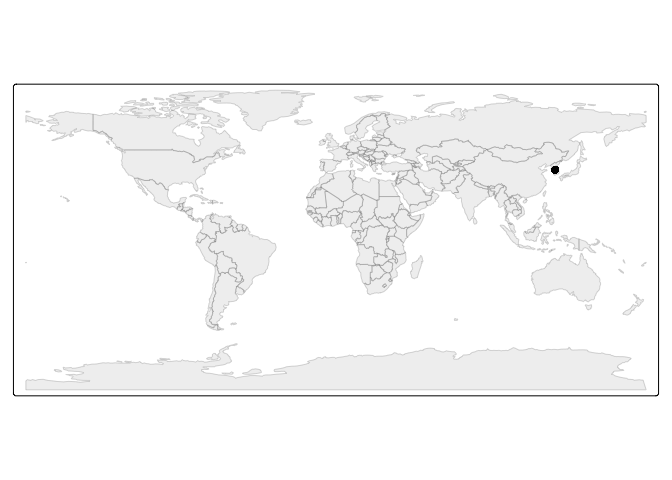
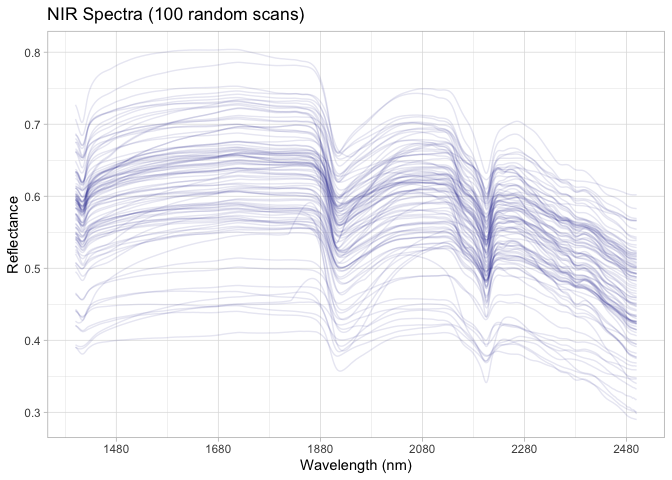

# Korean dataset preparation for the OSSL
Ran Zhi, Jose L. Safanelli, Jonathan Sanderman
— 06 March, 2026.

- [The Korean original data](#the-korean-original-data)
- [Data standardization to the OSSL
  format](#data-standardization-to-the-ossl-format)
- [References](#references)

Code repository for preparing and importing the Korean NIR Soil Spectral
Dataset into the Open Soil Spectral Library.

Project: [Soil Spectroscopy for Global
Good](https://soilspectroscopy.org)  
Development: <https://github.com/soilspectroscopy>  
Last update: 2026-03-06  
Additional documentation:

## The Korean original data

Site data, Soil lab data, and Near-Infrared (NIR) data from Gyeonggi
Province, South Korea. Further information of the dataset can be found
in detail at Bae et al. ([2026](#ref-bae_spatially_2026)).

Original files:  
- `Gyeonggi Soil Spectral Library (G-SSL).xlsx`: xlsx file with site
information, soil information, and NIR spectral data.

Directory/folder path with original files (not uploaded to GitHub).

``` r
dir = "/Users/rzhi/Projects/git/ossl-imports-internal/dataset/Korean"
tic()
```

## Data standardization to the OSSL format

### Site information

``` r
korean.metadata <- read_excel(path(dir, "Gyeonggi Soil Spectral Library (G-SSL).xlsx"),
                            sheet = "SOC")

# Function to convert GPS
dms_to_dd <- function(x) {
  parts <- str_match(x, "(\\d+)°(\\d+)'(\\d+)\"([NSEW])")
  deg <- as.numeric(parts[,2])
  min <- as.numeric(parts[,3])
  sec <- as.numeric(parts[,4])
  dir <- parts[,5]
  
  dd <- deg + (min / 60) + (sec / 3600)
  dd <- ifelse(dir %in% c("W", "S"), -dd, dd)
  return(dd)
}


korean.sitedata <- korean.metadata %>%
  select(No., Region, Location, `Land cover type`) %>%
  rename(id.layer_local_c = No.) %>%
  # Separate "37°...N 127°...E" into two columns at the space
  separate(Location, into = c("lat_raw", "lon_raw"), sep = " (?=\\d)", remove = FALSE) %>%
  mutate(
    latitude.point_wgs84_dd = dms_to_dd(lat_raw),
    longitude.point_wgs84_dd = dms_to_dd(lon_raw)
  ) %>%
  mutate(layer.upper.depth_usda_cm = 0,
         layer.lower.depth_usda_cm = 15) %>%
  mutate(id.project_ascii_txt = "Gyeonggi Soil Spectral Library",
         dataset.code_ascii_txt = "Korean.NIR",
         observation.ogc.schema.title_ogc_txt = "Open Soil Spectroscopy Library",
         observation.ogc.schema_idn_url = "https://soilspectroscopy.github.io",
         dataset.title_utf8_txt = "Gyeonggi Soil Spectral Library",
         dataset.owner_utf8_txt = "Jeehwan Bae",
         dataset.doi_idf_url = "https://zenodo.org/records/17941270",
         dataset.license.title_ascii_txt = "CC-BY",
         dataset.license.address_idn_url = "https://doi.org/10.6084/m9.figshare.29380574",
         dataset.contact.name_utf8_txt = "Gayoung Yoo",
         dataset.contact_ietf_email = "gayoo@khu.ac.kr") %>%
  mutate(id.layer_uuid_txt = openssl::md5(paste0(dataset.code_ascii_txt, id.layer_local_c)),
         .after = id.project_ascii_txt) %>%
  mutate(across(starts_with("id."), as.character))

# Saving version to dataset root dir
site.qs = path(dir, "ossl_soilsite_v2.0.qs")
qs::qsave(korean.sitedata, site.qs, preset = "high")
```

Plotting sites map:

``` r
data("World")

points <- korean.sitedata %>%
  filter(!is.na(longitude.point_wgs84_dd),
         !is.na(latitude.point_wgs84_dd)) %>%
  st_as_sf(coords = c('longitude.point_wgs84_dd', 'latitude.point_wgs84_dd'), crs = 4326)

tmap_mode("plot")
```

    ℹ tmap modes "plot" - "view"
    ℹ toggle with `tmap::ttm()`

``` r
tm_shape(World) +
  tm_polygons('#f0f0f0f0', border.alpha = 0.2) +
  tm_shape(points) +
  tm_dots()
```


    ── tmap v3 code detected ───────────────────────────────────────────────────────
    [v3->v4] `tm_polygons()`: use `col_alpha` instead of `border.alpha`.[tip] Consider a suitable map projection, e.g. by adding `+ tm_crs("auto")`.



### Soil lab information (reference analytical data)

NOTE: The code chunk below must be run just once for getting a template
for scripted column standardization. Just run once for getting the
original names of soil properties, descriptions, data types, and units.
Then upload to Google Sheet for editing and manually defining the rules
for integrating with the OSSL. Requires Google authentication. A copy of
the output file is saved to this folder for archiving purposes.

``` r
# Getting soillab original variables

soillab.names <- korean.metadata %>%
  select(No., 'mSOC(%)') %>%
  rename(id.layer_local_c = No.) %>%
  names() %>%
  tibble(original_name = .) %>%
  dplyr::mutate(table = 'Gyeonggi Soil Spectral Library (G-SSL).xlsx', .before = 1) %>%
  dplyr::mutate(import = '', original_unit = '', original_method = '', comment = '', ossl_abbrev = '', 
                ossl_method = '', ossl_unit = '', ossl_convert = '', ossl_name = '', .after = original_name)

readr::write_csv(soillab.names, path(getwd(), "soillab_original_names.csv"))

# Uploading to google sheet

# Drive 'Open Soil Spectral Library'
# Folder 'Database v2'
googledrive::drive_ls(as_id("1l9VM4fFks2xBloDE69EFTfPgQeFx5aGw"))

# Use the ID of the file 'OSSL_v2_tab2_soildata_importing'
OSSL.soildata.importing <- "1mWTDJDuMp4oObcCxAy9gofSkrkcSWWf1TtEW2SuC1es"

# Checking metadata
googlesheets4::as_sheets_id(OSSL.soildata.importing)

# Checking readme
googlesheets4::read_sheet(OSSL.soildata.importing, sheet = 'readme')

# Preparing soillab.names for this dataset
upload <- dplyr::as_tibble(soillab.names)

# Uploading with TEMP name. Check online, move to sequence, and update name
googlesheets4::write_sheet(upload, ss = OSSL.soildata.importing, sheet = "TEMP")

# Checking metadata
googlesheets4::as_sheets_id(OSSL.soildata.importing)
```

NOTE: The code chunk below must be run just once. Run for getting the
column standardization rules after editing online on Google Sheets. A
copy of the output file is saved to this folder for archiving purposes.

``` r
# Downloading from google sheet

# Checking metadata
googlesheets4::as_sheets_id("1mWTDJDuMp4oObcCxAy9gofSkrkcSWWf1TtEW2SuC1es")

# Preparing soillab.names
transvalues <- googlesheets4::read_sheet("1mWTDJDuMp4oObcCxAy9gofSkrkcSWWf1TtEW2SuC1es",
                                         sheet = "Korean") %>%
  filter(import == TRUE) %>%
  select(contains(c("table", "id", "original_name", "original_unit" , "ossl_")))

# Saving to folder
write_csv(transvalues, path(getwd(), "soillab_standardized_names.csv"))
```

Reading standardization rules:

``` r
transvalues <- read_csv(path(getwd(), "soillab_standardized_names.csv"),
                        show_col_types = F)
knitr::kable(transvalues)
```

| table | original_name | original_unit | ossl_abbrev | ossl_method | ossl_unit | ossl_convert | ossl_name |
|:---|:---|:---|:---|:---|:---|:---|:---|
| Gyeonggi Soil Spectral Library (G-SSL).xlsx | mSOC(%) | % | oc | iso.10694 | w.pct | ifelse(as.numeric(x) \< 0, NA, as.numeric(x) \* 1) | oc_iso.10694_w.pct |

Standardizing soil data to the OSSL format:

``` r
korean.reference <- korean.metadata

# Harmonization of names and units

valid_mappings <- transvalues %>%
  filter(table == "Gyeonggi Soil Spectral Library (G-SSL).xlsx") %>%
  filter(!is.na(ossl_name) & ossl_name != "") 

analytes.old.names <- valid_mappings %>% pull(original_name)
analytes.new.names <- valid_mappings %>% pull(ossl_name)

korean.soildata <- korean.reference %>%
  rename(id.layer_local_c = No.) %>%
  select(id.layer_local_c, all_of(analytes.old.names)) %>%
  rename_with(~analytes.new.names, all_of(analytes.old.names)) %>%
  mutate(id.layer_local_c = as.character(id.layer_local_c)) %>%
  as.data.frame()

# Getting the formulas
functions.list <- transvalues %>%
  filter(table == "Gyeonggi Soil Spectral Library (G-SSL).xlsx") %>%
  mutate(ossl_name = factor(ossl_name, levels = names(korean.soildata))) %>%
  arrange(ossl_name) %>%
  pull(ossl_convert) %>%
  c("x", .)

# Applying transformation rules
korean.soildata.trans <- transform_values(df = korean.soildata,
                                       out.name = names(korean.soildata),
                                       in.name = names(korean.soildata),
                                       fun.lst = functions.list)

# Final soillab data
korean.soildata <- korean.soildata.trans %>%
  mutate_at(vars(starts_with("id.")), as.character)

# Checking total number of observations
korean.soildata %>%
  distinct(id.layer_local_c) %>%
  summarise(count = n())
```

      count
    1  1500

``` r
# Saving version to dataset root dir
soillab.qs = path(dir, "ossl_soillab_v2.0.qs")
qs::qsave(korean.soildata, soillab.qs, preset = "high")
```

Soil lab data summary.

``` r
korean.soildata %>%
  mutate(id.layer_local_c = factor(id.layer_local_c)) %>%
  skimr::skim() %>%
  dplyr::select(-numeric.hist, -complete_rate)
```

|                                                  |            |
|:-------------------------------------------------|:-----------|
| Name                                             | Piped data |
| Number of rows                                   | 1500       |
| Number of columns                                | 2          |
| \_\_\_\_\_\_\_\_\_\_\_\_\_\_\_\_\_\_\_\_\_\_\_   |            |
| Column type frequency:                           |            |
| factor                                           | 1          |
| numeric                                          | 1          |
| \_\_\_\_\_\_\_\_\_\_\_\_\_\_\_\_\_\_\_\_\_\_\_\_ |            |
| Group variables                                  | None       |

Data summary

**Variable type: factor**

| skim_variable    | n_missing | ordered | n_unique | top_counts                  |
|:-----------------|----------:|:--------|---------:|:----------------------------|
| id.layer_local_c |         0 | FALSE   |     1500 | 1: 1, 10: 1, 100: 1, 100: 1 |

**Variable type: numeric**

| skim_variable      | n_missing | mean |  sd |  p0 | p25 | p50 | p75 | p100 |
|:-------------------|----------:|-----:|----:|----:|----:|----:|----:|-----:|
| oc_iso.10694_w.pct |       788 | 2.78 | 1.8 | 0.1 | 1.5 | 2.5 | 3.7 | 10.5 |

### NIR spectra

``` r
korean.nir <- read_excel(path(dir, "Gyeonggi Soil Spectral Library (G-SSL).xlsx"),
                            sheet = "NIR_raw")
# Renaming

korean.nir.proc <- korean.nir %>%
  rename(id.layer_local_c = No.) 

# Need to resample spectra
spec.cols <- names(korean.nir.proc)[-1] # Remove the ID column
old.wavelengths <- as.numeric(spec.cols)
new.wavelengths <- seq(1400, max(old.wavelengths), by = 2)

# Resampling spectra

korean.nir.resampled <- korean.nir.proc %>%
  column_to_rownames("id.layer_local_c") %>%
  as.matrix() %>%
  prospectr::resample(X = ., wav = old.wavelengths, new.wav = new.wavelengths, interpol = "spline") %>%
  as_tibble(rownames = "id.layer_local_c")

# Check for NAs
scans.na.gaps <- korean.nir.resampled %>%
  select(-id.layer_local_c) %>%
  apply(1, function(x) round(100*(sum(is.na(x)))/(length(x)), 2)) %>%
  tibble(id.layer_local_c = korean.nir.resampled$id.layer_local_c, proportion_NA = .)

# Check for extreme negative values 
scans.extreme.neg <- korean.nir.resampled %>%
  select(-id.layer_local_c) %>%
  apply(1, function(x) round(100*(sum(x < 0, na.rm=TRUE))/(length(x)), 2)) %>%
  tibble(id.layer_local_c = korean.nir.resampled$id.layer_local_c, proportion_lower0 = .)

# Check for extreme positive values 
scans.extreme.pos <- korean.nir.resampled %>%
  select(-id.layer_local_c) %>%
  apply(1, function(x) round(100*(sum(x > 1.5, na.rm=TRUE))/(length(x)), 2)) %>%
  tibble(id.layer_local_c = korean.nir.resampled$id.layer_local_c, proportion_higherAbs5 = .)

# Summary of problematic scans
scans.summary <- scans.na.gaps %>%
  left_join(scans.extreme.neg, by = "id.layer_local_c") %>%
  left_join(scans.extreme.pos, by = "id.layer_local_c")

# 4. Renaming and Metadata
final.visnir.names <- paste0("scan_nir.", new.wavelengths, "_ref")
korean.nir.final <- korean.nir.resampled %>%
  rename_with(~final.visnir.names, as.character(new.wavelengths))

# Customizing metadata for the Korean dataset
korean.nir.metadata <- korean.nir.final %>%
  select(id.layer_local_c) %>%
  mutate(
    id.scan_local_c = id.layer_local_c,
    scan.nir.date.begin_iso.8601_yyyy = ymd("2024-01-01"), 
    scan.visnir.date.end_iso.8601_yyyy = ymd("2024-12-31"), 
    scan.nir.model.name_utf8_txt = "benchtop NIR spectrometer (Unity  Scientific, Spectra Star XT, Westborough, MA, USA)", 
    scan.nir.license.title_ascii_txt = "CC-BY 4.0",
    scan.nir.contact.name_utf8_txt = "Jeehwan Bae, and Gayoung Yoo",
    scan.nir.doi_idf_url = "https://doi.org/10.6084/m9.figshare.29380574",
    scan.nir.contact.name_utf8_txt = "Gayoung Yoo",
    scan.nir.contact.email_ietf_txt = "gayoo@khu.ac.kr"
  )

# 5. Export
korean.nir.export <- korean.nir.metadata %>%
  left_join(korean.nir.final, by = "id.layer_local_c")

# Save as .qs file
qs::qsave(korean.nir.export, "ossl_nir_v2.0.qs", preset = "high")
```

### Quality control for NIR

The final table must be joined as follows:

- NIR is used as first reference for left join.
- Then it is left joined with the site and soil lab data. This drop data
  without any available scan.

The availability of data is summarized below:

``` r
# Taking a few representative columns for checking the consistency of joins
korean.availability <- korean.nir.export %>%
  select(id.layer_local_c, scan_nir.1400_ref) %>%
  left_join({korean.metadata %>%
      rename(id.layer_local_c = No.) %>%
      mutate(id.layer_local_c = as.character(id.layer_local_c)) %>%
      select(id.layer_local_c, `Land cover type`, `mSOC(%)`)}, by = "id.layer_local_c") %>%
  filter(!is.na(id.layer_local_c))

# Availability of information summary
# This tells us how many samples have spectra vs. lab/site data
korean.availability %>%
  mutate(across(everything(), as.character)) %>%
  pivot_longer(everything(), names_to = "column", values_to = "value") %>%
  filter(!is.na(value)) %>%
  group_by(column) %>%
  summarise(count = n())
```

    # A tibble: 4 × 2
      column            count
      <chr>             <int>
    1 Land cover type    1500
    2 id.layer_local_c   1500
    3 mSOC(%)             712
    4 scan_nir.1400_ref  1500

``` r
# Repeats check 
korean.availability %>%
  mutate(across(everything(), as.character)) %>%
  select(id.layer_local_c) %>%
  pivot_longer(everything(), names_to = "column", values_to = "value") %>%
  group_by(column, value) %>%
  summarise(repeats = n(), .groups = 'drop') %>%
  group_by(column, repeats) %>%
  summarise(count = n(), .groups = 'drop')
```

    # A tibble: 1 × 3
      column           repeats count
      <chr>              <int> <int>
    1 id.layer_local_c       1  1500

Soil analytical data summary for NIR. Note: many scans could not be
linked with the wetchem.

``` r
korean.soildata %>%
  filter(id.layer_local_c %in% korean.nir.export$id.layer_local_c) %>%
  mutate(id.layer_local_c = factor(id.layer_local_c)) %>%
  skimr::skim() %>%
  dplyr::select(-numeric.hist, -complete_rate)
```

|                                                  |            |
|:-------------------------------------------------|:-----------|
| Name                                             | Piped data |
| Number of rows                                   | 1500       |
| Number of columns                                | 2          |
| \_\_\_\_\_\_\_\_\_\_\_\_\_\_\_\_\_\_\_\_\_\_\_   |            |
| Column type frequency:                           |            |
| factor                                           | 1          |
| numeric                                          | 1          |
| \_\_\_\_\_\_\_\_\_\_\_\_\_\_\_\_\_\_\_\_\_\_\_\_ |            |
| Group variables                                  | None       |

Data summary

**Variable type: factor**

| skim_variable    | n_missing | ordered | n_unique | top_counts                  |
|:-----------------|----------:|:--------|---------:|:----------------------------|
| id.layer_local_c |         0 | FALSE   |     1500 | 1: 1, 10: 1, 100: 1, 100: 1 |

**Variable type: numeric**

| skim_variable      | n_missing | mean |  sd |  p0 | p25 | p50 | p75 | p100 |
|:-------------------|----------:|-----:|----:|----:|----:|----:|----:|-----:|
| oc_iso.10694_w.pct |       788 | 2.78 | 1.8 | 0.1 | 1.5 | 2.5 | 3.7 | 10.5 |

NIR spectral visualization (100 random spectra):

``` r
set.seed(42)
korean.nir.export %>%
  sample_n(100) %>%
  select(all_of(c("id.layer_local_c")), starts_with("scan_nir.")) %>%
  tidyr::pivot_longer(-all_of(c("id.layer_local_c")),
                      names_to = "wavelength", values_to = "reflectance") %>%
  dplyr::mutate(wavelength = gsub("scan_nir.|_ref", "", wavelength)) %>%
  dplyr::mutate(wavelength = as.numeric(wavelength)) %>%
  ggplot(aes(x = wavelength, y = reflectance, group = id.layer_local_c)) +
  geom_line(alpha = 0.1, color = "darkblue") +
  scale_x_continuous(breaks = seq(680, 2500, by = 200))+
  labs(title = "NIR Spectra (100 random scans)",
       x = "Wavelength (nm)",
       y = "Reflectance")+
  theme_light()
```



``` r
toc()
```

    1.897 sec elapsed

``` r
rm(list = ls())
gc()
```

              used  (Mb) gc trigger  (Mb) limit (Mb) max used  (Mb)
    Ncells 4412300 235.7    6838305 365.3         NA  6838305 365.3
    Vcells 7636518  58.3   21225182 162.0      24576 21225121 162.0

## References

<div id="refs" class="references csl-bib-body hanging-indent"
entry-spacing="0" line-spacing="2">

<div id="ref-bae_spatially_2026" class="csl-entry">

Bae, J., Seo, I., Hyun, J., Park, Y., Jeong, M., Kim, J., … Yoo, G.
(2026). A spatially rich, temporally coherent soil spectral dataset for
soil organic carbon estimation. *Scientific Data*, *13*(1), 230.
doi:[10.1038/s41597-026-06546-3](https://doi.org/10.1038/s41597-026-06546-3)

</div>

</div>
