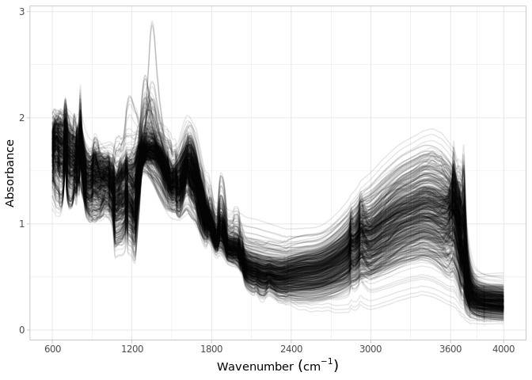

Dataset import: Garrett et al. (2022)
================
Jose Lucas Safanelli (<jsafanelli@woodwellclimate.org>) and Jonathan
Sanderman (<jsanderman@woodwellclimate.org>)
17 October, 2022


-   [The Garrett et al. (2022) Soil Spectral
    Library](#the-garrett-et-al-2022-soil-spectral-library)
-   [Data import](#data-import)
    -   [Soil site information](#soil-site-information)
    -   [Soil lab information](#soil-lab-information)
    -   [Mid-infrared spectroscopy
        data](#mid-infrared-spectroscopy-data)
    -   [Quality control](#quality-control)
    -   [Rendering report](#rendering-report)
-   [References](#references)

[](https://soilspectroscopy.org/)

[](http://creativecommons.org/licenses/by-sa/4.0/)

This work is licensed under a [Creative Commons Attribution-ShareAlike
4.0 International
License](http://creativecommons.org/licenses/by-sa/4.0/).

## The Garrett et al. (2022) Soil Spectral Library

Part of: <https://github.com/soilspectroscopy>  
Project: [Soil Spectroscopy for Global
Good](https://soilspectroscopy.org)  
Last update: 2022-10-17  
Dataset:
[GARRETT.SSL](https://soilspectroscopy.github.io/ossl-manual/soil-spectroscopy-tools-and-users.html#garrett.ssl)

Mid-Infrared Spectra (MIRS) of 186 soil samples described in [Garrett et
al.](#ref-Garrett2022) ([2022](#ref-Garrett2022)).

Directory/folder path:

``` r
dir = "/mnt/soilspec4gg/ossl/dataset/Garrett/"
```

## Data import

The dataset is publicly shared at Figshare
<https://doi.org/10.6084/m9.figshare.20506587.v2>.

``` r
# Checking shared files
list.files(dir)
```

    ##  [1] "FR380_chemical.xlsx"        "FR380_MIR spectra"          "FR380_MIR spectra_csv"      "FR380_MIR spectra_csv.zip" 
    ##  [5] "FR380_MIR spectra.zip"      "FR380_particlesize.xlsx"    "FR380_physical.xlsx"        "FR380_sitedescription.xlsx"
    ##  [9] "FR380_Soil Profile.zip"     "FR380_soilprofile.xlsx"     "ossl_mir_v1.rds"            "ossl_soillab_v1.rds"       
    ## [13] "ossl_soilsite_v1.rds"       "SoilProfile"

``` r
# Checking FR380_sitedescription
# excel_sheets(paste0(dir, "/FR380_sitedescription.xlsx"))
garrett.sitedescription <- readxl::read_xlsx(paste0(dir, "/FR380_sitedescription.xlsx"), sheet = "FR380_site description")
names(garrett.sitedescription)
```

    ##  [1] "LCR_Soil Profile ID"                                                   
    ##  [2] "Trial ID"                                                              
    ##  [3] "Date observed"                                                         
    ##  [4] "Latitude (°)"                                                          
    ##  [5] "Longitude (°)"                                                         
    ##  [6] "Altitude (m)"                                                          
    ##  [7] "Slope (°)"                                                             
    ##  [8] "Aspect (°)"                                                            
    ##  [9] "Provider of soil profile description"                                  
    ## [10] "Soil series"                                                           
    ## [11] "Soil type"                                                             
    ## [12] "NZSC Order"                                                            
    ## [13] "NZSC Group"                                                            
    ## [14] "NZSC Subgroup"                                                         
    ## [15] "NZSC soil form M1"                                                     
    ## [16] "NZSC soil form M2"                                                     
    ## [17] "NZSC soil form M3"                                                     
    ## [18] "NZSC soil form M4"                                                     
    ## [19] "Profile shape"                                                         
    ## [20] "Surface outcrops (%)"                                                  
    ## [21] "Surface boulders (%)"                                                  
    ## [22] "Soil profile drainage"                                                 
    ## [23] "Land management prior to FR380 trial planting"                         
    ## [24] "Forest rotation number prior to FR380 trial planting"                  
    ## [25] "Planted tree species prior to FR380 trial planting or pasture land use"
    ## [26] "Forest rotation number of the FR380 trial"                             
    ## [27] "Soil parent material"                                                  
    ## [28] "Geological substrate"                                                  
    ## [29] "Top soil depth (m)"                                                    
    ## [30] "Total rooting depth (m)"                                               
    ## [31] "Limiting horizon - nature and depth (m)"                               
    ## [32] "Profile exposed in"

``` r
# Checking FR380_soilprofile
# excel_sheets(paste0(dir, "/FR380_soilprofile.xlsx"))
garrett.soilprofile <- readxl::read_xlsx(paste0(dir, "/FR380_soilprofile.xlsx"), sheet = "FR380_soil profile")
names(garrett.soilprofile)
```

    ##  [1] "Trial ID"                                       "LCR_Soil profile ID"                           
    ##  [3] "LCR_Horizon number"                             "Horizon notation"                              
    ##  [5] "Horizon top (cm)"                               "Horizon base (cm)"                             
    ##  [7] "Soil water description"                         "Colour code"                                   
    ##  [9] "Colour description"                             "Mottles 1 abundance (%)"                       
    ## [11] "Mottles 1 abundance description"                "Mottles 1 size (mm)"                           
    ## [13] "Mottles 1 size class"                           "Mottles 1 contrast"                            
    ## [15] "Mottles 1 colour code"                          "Mottles 2 abundance (%)"                       
    ## [17] "Mottles 2 abundance description"                "Mottles 2 size (mm)"                           
    ## [19] "Mottles 2 size class"                           "Mottles 2 contrast"                            
    ## [21] "Mottles 2 colour code"                          "Texture class"                                 
    ## [23] "Texture sand class"                             "Texture organic matter"                        
    ## [25] "Gravel <200mm abundance (%)"                    "Gravel <200mm abundance class"                 
    ## [27] "Gravel <200mm abundance size (mm)"              "Gravel <200mm abundance size class"            
    ## [29] "Gravel <200mm weathering"                       "Gravel <200mm rounding"                        
    ## [31] "Gravel <200mm rock"                             "Boulders >200mm abundance (%)"                 
    ## [33] "Boulders >200mm abundance class"                "Boulders >200mm size (mm)"                     
    ## [35] "Boulders >200mm size class"                     "Boulders >200mm weathering"                    
    ## [37] "Boulders >200mm roundness"                      "Boulders >200mm rock"                          
    ## [39] "Parent material - determination"                "Parent material - partile size"                
    ## [41] "Parent material - orgin"                        "Parent material - alteration"                  
    ## [43] "Parent material - induration"                   "Soil strength"                                 
    ## [45] "Ped strength"                                   "Failure"                                       
    ## [47] "Fluidity"                                       "Penetration resistence description"            
    ## [49] "Packing description"                            "Particle packing description"                  
    ## [51] "Sensitivity"                                    "Induration description"                        
    ## [53] "Plasticity"                                     "Stickyness"                                    
    ## [55] "Pedality type"                                  "Apedal materials"                              
    ## [57] "Pedality degree"                                "Primary macrofabric - Abundance description"   
    ## [59] "Primary macrofabric - Size description"         "Primary macrofabric - Shape"                   
    ## [61] "Link"                                           "Secondary macrofabric - Abundance description" 
    ## [63] "Secondary macrofabric - Size description"       "Secondary macrofabric - Shape"                 
    ## [65] "Voids abundance (%)"                            "Voids size (mm)"                               
    ## [67] "Voids ture"                                     "Concentration abundance (%)"                   
    ## [69] "Concentration abundance description"            "Concentration size (mm)"                       
    ## [71] "Concentration colour code"                      "Concentration type"                            
    ## [73] "Pan type"                                       "Surface features - coats kind"                 
    ## [75] "Surface features - coats location"              "Surface features - coats abundance (%)"        
    ## [77] "Surface features - coats abundance description" "Surface features - coats continuity"           
    ## [79] "Surface features - coats distinction"           "Surface features - coat thickness (mm)"        
    ## [81] "Surface features - coats thickness description" "Surface features - coats roughness"            
    ## [83] "Surface features - coats colour code"           "Surface features - coats colour description"   
    ## [85] "Root 1 abundance description"                   "Root 1 size (mm)"                              
    ## [87] "Root 1 size description"                        "Root 1 location"                               
    ## [89] "Root 1 type"                                    "Root 2 abundance description"                  
    ## [91] "Root 2 size (mm)"                               "Root 2 size description"                       
    ## [93] "Root 2 location"                                "Root 2 type"                                   
    ## [95] "Horizon boundary distinction"                   "Horizon boundary shape"

``` r
# Checking FR380_physical
# excel_sheets(paste0(dir, "/FR380_physical.xlsx"))
garrett.physical <- readxl::read_xlsx(paste0(dir, "/FR380_physical.xlsx"), sheet = "FR380_Physical")
# View(read_xlsx(paste0(dir, "/FR380_physical.xlsx"), sheet = "Data dictionary"))
names(garrett.physical)
```

    ##  [1] "Trial ID"                                                            
    ##  [2] "Location of sample"                                                  
    ##  [3] "Sample Method"                                                       
    ##  [4] "Sample plots 'Disturbed' or 'Undisturbed'"                           
    ##  [5] "Horizon notation"                                                    
    ##  [6] "Horizon top (cm)"                                                    
    ##  [7] "Horizon base (cm)"                                                   
    ##  [8] "LCR_Soil profile ID"                                                 
    ##  [9] "LCR_Lab letter"                                                      
    ## [10] "LCR_Horizon number"                                                  
    ## [11] "Lab Code"                                                            
    ## [12] "Particle density (g/cm3)"                                            
    ## [13] "Bulk density (g/cm3)"                                                
    ## [14] "Porosity (%)"                                                        
    ## [15] "Macro-porosity (%)"                                                  
    ## [16] "Air capacity (%)"                                                    
    ## [17] "Void Ratio"                                                          
    ## [18] "Field capacity (%)"                                                  
    ## [19] "Water content at saturation (calculation) (%w/w)"                    
    ## [20] "Water content at 5 kPa (%w/w)"                                       
    ## [21] "Water content at 10 kPa (%w/w)"                                      
    ## [22] "Water content at 100 kPa (%w/w)"                                     
    ## [23] "Water content at 1500 kPa (%w/w)"                                    
    ## [24] "Water content at saturation (calculation) (%v/v)"                    
    ## [25] "Water content at 5 kPa (%v/v)"                                       
    ## [26] "Water content at 10 kPa (%v/v)"                                      
    ## [27] "Water content at 100 kPa (%v/v)"                                     
    ## [28] "Water content at 1500 kPa (%v/v)"                                    
    ## [29] "Penetration Resistance at 10 kPa, 3-6 cm at FC, Mean of 2 reps (MPa)"
    ## [30] "Water content at field moisture (%w/w)"                              
    ## [31] "Water content at field moisture (%v/v)"                              
    ## [32] "RAW \r\n(10-100 kPa)"                                                
    ## [33] "TAW\r\n(10-1500 kPa)"                                                
    ## [34] "Pedology stone content (%)"                                          
    ## [35] "RAW (10-100 kPa) (stone corr.) (%)"                                  
    ## [36] "TAW (100-1500 kPa) (stone corr.) (%)"

``` r
# Checking FR380_chemical
# excel_sheets(paste0(dir, "/FR380_chemical.xlsx"))
garrett.chemical <- readxl::read_xlsx(paste0(dir, "/FR380_chemical.xlsx"), sheet = "FR380_Chemical", skip = 1)
# View(read_xlsx(paste0(dir, "/FR380_chemical.xlsx"), sheet = "Data dictionary"))
names(garrett.chemical)
```

    ##  [1] "Trial ID"                               "Sampling Date"                          "Sample Method"                         
    ##  [4] "Horizon top (cm)"                       "Horizon base (cm)"                      "0-10cm sample disturbed or undistrubed"
    ##  [7] "Comment"                                "LCR_Sample ID"                          "LCR_Soil profile ID"                   
    ## [10] "LCR_Lab letter"                         "LCR_Horizon number"                     "LCR_pH [H2O]"                          
    ## [13] "LCR_Total Carbon (%)"                   "LCR_Total Nitrogen (%)"                 "LCR_Carbon/Nitrogen"                   
    ## [16] "LCR_P Olsen Available (ug/g)"           "LCR_P Bray Available (ug/g)"            "LCR_P inorganic (mg%)"                 
    ## [19] "LCR_P organic (mg%)"                    "LCR_P Total (mg%)"                      "LCR_P retention (%)"                   
    ## [22] "LCR_CEC (me.%)"                         "LCR_Sum bases (me.%)"                   "LCR_Base saturation (%)"               
    ## [25] "LCR_Exchange Ca (me.%)"                 "LCR_Exchange Mg (me.%)"                 "LCR_Exchange K (me.%)"                 
    ## [28] "LCR_Exchange Na (me.%)"                 "Scion_Sample ID"                        "Scion_pH [H2O]"                        
    ## [31] "Scion_Bray P (mg/kg) seq 1"             "Scion_Bray P (mg/kg) seq 2"             "Scion_Bray P (mg/kg) seq 3"            
    ## [34] "Scion_Mehlich 3 B (mg/kg)"              "Scion_Mehlich 3 Al (mg/kg)"             "Scion_Mehlich 3 Na (mg/kg)"            
    ## [37] "Scion_Mehlich 3 Mg (mg/kg)"             "Scion_Mehlich 3 P (mg/kg)"              "Scion_Mehlich 3 K (mg/kg)"             
    ## [40] "Scion_Mehlich 3 Ca (mg/kg)"             "Scion_Mehlich 3 Mn (mg/kg)"             "Scion_Mehlich 3 Fe (mg/kg)"            
    ## [43] "Scion_Mehlich 3 Cu (mg/kg)"             "Scion_Mehlich 3 Zn (mg/kg)"             "Lab 3_Sulphate S (mg/kg)"              
    ## [46] "Lab 4_Total B (mg/kg)"                  "Lab 4_Total Na (mg/kg)"                 "Lab 4_Total Mg (mg/kg)"                
    ## [49] "Lab 4_Total Al (mg/kg)"                 "Lab 4_Total P (mg/kg)"                  "Lab 4_Total S (mg/kg)"                 
    ## [52] "Lab 4_Total K (mg/kg)"                  "Lab 4_Total Ca (mg/kg)"                 "Lab 4_Total V (mg/kg)"                 
    ## [55] "Lab 4_Total Cr (mg/kg)"                 "Lab 4_Total Mn (mg/kg)"                 "Lab 4_Total Fe (mg/kg"                 
    ## [58] "Lab 4_Total Co (mg/kg)"                 "Lab 4_Total Ni (mg/kg)"                 "Lab 4_Total Cu (mg/kg)"                
    ## [61] "Lab 4_Total Zn (mg/kg)"                 "Lab 4_Total As (mg/kg)"                 "Lab 4_Total Se (mg/kg)"                
    ## [64] "Lab 4_Total Sr (mg/kg)"                 "Lab 4_Total Cd (mg/kg)"                 "Lab 4_Total Ba (mg/kg)"                
    ## [67] "Lab 4_Total Tl (mg/kg)"                 "Lab 4_Total Pb (mg/kg)"                 "Lab 4_Total U (mg/kg)"

``` r
# Checking FR380_particlesize
# excel_sheets(paste0(dir, "/FR380_particlesize.xlsx"))
garrett.particlesize <- readxl::read_xlsx(paste0(dir, "/FR380_particlesize.xlsx"), sheet = "FR380_Particle size", skip = 0)
# View(read_xlsx(paste0(dir, "/FR380_particlesize.xlsx"), sheet = "Data dictionary"))
names(garrett.particlesize)
```

    ##  [1] "Trial ID"            "LCR_Soil profile ID" "LCR_Lab letter"      "LCR_Horizon number"  "Coarse sand (%)"     "Medium sand (%)"    
    ##  [7] "Fine sand (%)"       "Sand (%)"            "Silt (%)"            "Clay (%)"

``` r
# Spectral measurements
scans.csv <- list.files(paste0(dir, "/FR380_MIR spectra_csv"), full.names = TRUE)
scans.names <- list.files(paste0(dir, "/FR380_MIR spectra_csv"), full.names = FALSE)

# # Spectra is stored in long format without header, first column wavenumber, second column absorbance
# mir.test <- readr::read_csv(scans.csv[1], show_col_types = FALSE, col_names = FALSE) %>%
#   setNames(c("wavenumber", "absorbance"))
# ggplot(mir.test) + geom_line(aes(x = wavenumber, y = absorbance, group = 1))

mir.allspectra <- purrr::map_dfr(.x = scans.csv, .f = readr::read_csv, .id = "source",
                                 show_col_types = FALSE, col_names = FALSE) # Additional arguments of read_csv

mir.allspectra <- mir.allspectra %>%
  tidyr::pivot_wider(names_from = "X1", values_from = "X2") %>%
  dplyr::mutate(id = scans.names, .before = 1) %>%
  dplyr::mutate(id = gsub(".csv", "", id))
```

Spectral data filenames follow Scion\_Sample ID present in chemical
data, but there are other id columns from LCR and site ids that are
necessary for binding with other tables (like physical). Anyway,
Scion\_Sample ID will be used as `id.layer_local_c` in the OSSL.

``` r
garrett.ids <- garrett.chemical %>%
  dplyr::select(`Scion_Sample ID`, `Trial ID`,
                `LCR_Sample ID`, `LCR_Soil profile ID`,
                `LCR_Lab letter`, `LCR_Horizon number`,
                `Horizon top (cm)`, `Horizon base (cm)`,) %>%
  dplyr::rename(id.layer_local_c = `Scion_Sample ID`,
                id.user.site_ascii_c = `Trial ID`,
                layer.upper.depth_usda_cm = `Horizon top (cm)`,
                layer.lower.depth_usda_cm = `Horizon base (cm)`) %>%
  dplyr::filter(!is.na(id.layer_local_c)) %>%
  dplyr::mutate(id.user.site_ascii_c = gsub("\\s", "", id.user.site_ascii_c))

# Checking number of spectral replicates 
mir.allspectra %>%
  tidyr::separate(id, into = c("id", "replicate"), sep = "-") %>%
  dplyr::group_by(id) %>%
  dplyr::summarise(n = n()) %>%
  dplyr::group_by(n) %>%
  dplyr::summarise(count = n())

# Checking number of unique spectral samples
mir.allspectra %>%
  tidyr::separate(id, into = c("id", "replicate"), sep = "-") %>%
  dplyr::group_by(id) %>%
  dplyr::summarise(n = n()) %>%
  dplyr::ungroup() %>%
  nrow()
```

    ## [1] 184

``` r
# Same number of samples in chemical data
garrett.ids %>%
  dplyr::summarise(count = n())

# Are there duplicates? No
garrett.ids %>%
  dplyr::distinct(id.layer_local_c) %>%
  dplyr::summarise(count = n())
```

### Soil site information

``` r
# Formatting to OSSL standard
garrett.soilsite <- garrett.sitedescription %>%
  dplyr::select(`Trial ID`, `Date observed`, `Latitude (°)`, `Longitude (°)`) %>%
  dplyr::rename(longitude_wgs84_dd = `Longitude (°)`, latitude_wgs84_dd = `Latitude (°)`,
                id.user.site_ascii_c = `Trial ID`) %>%
  dplyr::mutate(id.user.site_ascii_c = gsub("\\s", "", id.user.site_ascii_c)) %>%
  dplyr::mutate(id.dataset.site_ascii_c = id.user.site_ascii_c,
                `Date observed` = lubridate::ymd(`Date observed`)) %>%
  dplyr::mutate(observation.date.begin_iso.8601_yyyy.mm.dd = stringr::str_c(lubridate::year(`Date observed`),
                                                                            lubridate::month(`Date observed`),
                                                                            lubridate::day(`Date observed`),
                                                                            sep = "."),
                observation.date.end_iso.8601_yyyy.mm.dd = stringr::str_c(lubridate::year(`Date observed`),
                                                                            lubridate::month(`Date observed`),
                                                                            lubridate::day(`Date observed`),
                                                                            sep = ".")) %>%
  dplyr::select(id.user.site_ascii_c, id.dataset.site_ascii_c,
                longitude_wgs84_dd, latitude_wgs84_dd,
                observation.date.begin_iso.8601_yyyy.mm.dd,
                observation.date.end_iso.8601_yyyy.mm.dd) %>%
  dplyr::left_join({garrett.ids %>%
      dplyr::select(-contains("LCR"))}, ., by = "id.user.site_ascii_c") %>%
  dplyr::mutate(id.layer_uuid_c = openssl::md5(id.layer_local_c), # Adding missing metadata
                id.location_olc_c = olctools::encode_olc(latitude_wgs84_dd, longitude_wgs84_dd, 10),
                observation.ogc.schema.title_ogc_txt = 'Open Soil Spectroscopy Library',
                observation.ogc.schema_idn_url = 'https://soilspectroscopy.github.io',
                location.address_utf8_txt = "New Zealand",
                location.country_iso.3166_c = "NZL",
                location.method_any_c = "survey",
                location.error_any_m = 1111, # Only two decimal places in lat long
                surveyor.title_utf8_txt = "Loretta Garrett",
                surveyor.contact_ietf_email = "loretta.garrett@scionresearch.com",
                surveyor.address_utf8_txt = 'Scion, Private Bag 3020, Rotorua 3046, New Zealand',
                dataset.title_utf8_txt = 'Garrett et al. (2022)',
                dataset.owner_utf8_txt = 'Garrett et al. (2022)',
                dataset.code_ascii_txt = 'GARRETT.SSL',
                dataset.address_idn_url = 'https://doi.org/10.6084/m9.figshare.20506587.v2',
                dataset.license.title_ascii_txt = 'CC-BY 4.0',
                dataset.license.address_idn_url = 'https://creativecommons.org/licenses/by/4.0/legalcode',
                dataset.doi_idf_c = 'https://doi.org/10.6084/m9.figshare.20506587.v2',
                dataset.contact.name_utf8_txt = "Loretta Garrett",
                dataset.contact.email_ietf_email = "loretta.garrett@scionresearch.com",
                id.project_ascii_c = "GARRETT") %>%
  dplyr::select(id.layer_uuid_c, # Following the sequence from ossl-manual
                id.layer_local_c,
                id.location_olc_c,
                observation.ogc.schema.title_ogc_txt,
                observation.ogc.schema_idn_url,
                observation.date.begin_iso.8601_yyyy.mm.dd,
                observation.date.end_iso.8601_yyyy.mm.dd,
                location.address_utf8_txt,
                location.country_iso.3166_c,
                location.method_any_c,
                surveyor.title_utf8_txt,
                surveyor.contact_ietf_email,
                surveyor.address_utf8_txt,
                longitude_wgs84_dd,
                latitude_wgs84_dd,
                location.error_any_m,
                dataset.title_utf8_txt,
                dataset.owner_utf8_txt,
                dataset.code_ascii_txt,
                dataset.address_idn_url,
                dataset.license.title_ascii_txt,
                dataset.license.address_idn_url,
                dataset.doi_idf_c,
                dataset.contact.name_utf8_txt,
                dataset.contact.email_ietf_email,
                id.dataset.site_ascii_c,
                id.user.site_ascii_c,
                id.project_ascii_c)
```

Exporting soilsite data

``` r
soilsite.rds = paste0(dir, "/ossl_soilsite_v1.rds")
saveRDS(garrett.soilsite, soilsite.rds)
```

### Soil lab information

``` r
# names(garrett.chemical)

in.names.chemical <- c("LCR_Total Carbon (%)", "LCR_Total Nitrogen (%)", "Scion_pH [H2O]",
                       "Scion_Mehlich 3 Al (mg/kg)", "Scion_Mehlich 3 Na (mg/kg)", "Scion_Mehlich 3 Mg (mg/kg)",
                       "Scion_Mehlich 3 P (mg/kg)", "Scion_Mehlich 3 K (mg/kg)", "Scion_Mehlich 3 Ca (mg/kg)")

out.names.chemical <- c("c.tot_usda.4h2_wpct", "n.tot_usda.4h2_wpct", "ph.h2o_usda.4c1_index",
                        "al.kcl_usda.4b3_cmolkg", "na.ext_usda.4b1_cmolkg", "mg.ext_usda.4b1_cmolkg",
                        "p.ext_usda.4d6_mgkg", "k.ext_usda.4b1_cmolkg", "ca.ext_usda.4b1_cmolkg")

garrett.soil.chemical <- garrett.chemical %>%
  dplyr::rename(id.layer_local_c = `Scion_Sample ID`) %>%
  dplyr::relocate(id.layer_local_c, .before = 1) %>%
  dplyr::rename_with(~out.names.chemical, all_of(in.names.chemical)) %>%
  dplyr::select(id.layer_local_c, all_of(out.names.chemical)) %>%
  dplyr::mutate_at(vars(-id.layer_local_c), as.numeric) %>% # mg.kg to cmolc.kg =  = atomic_mass/valence/100=g*1000=mg
  dplyr::mutate(al.kcl_usda.4b3_cmolkg = al.kcl_usda.4b3_cmolkg/(26.982/3/100*1000),
                na.ext_usda.4b1_cmolkg = na.ext_usda.4b1_cmolkg/(22.990/1/100*1000),
                mg.ext_usda.4b1_cmolkg = mg.ext_usda.4b1_cmolkg/(24.305/2/100*1000),
                k.ext_usda.4b1_cmolkg = k.ext_usda.4b1_cmolkg/(39.098/1/100*1000),
                ca.ext_usda.4b1_cmolkg = ca.ext_usda.4b1_cmolkg/(40.078/2/100*1000)) %>%
  dplyr::mutate(sum_of_bases = ca.ext_usda.4b1_cmolkg+mg.ext_usda.4b1_cmolkg+k.ext_usda.4b1_cmolkg+na.ext_usda.4b1_cmolkg,
                cec.ext_usda.4b1_cmolkg = sum_of_bases+al.kcl_usda.4b3_cmolkg) %>%
  dplyr::mutate(alsat_usda.4b4_wpct = al.kcl_usda.4b3_cmolkg/cec.ext_usda.4b1_cmolkg*100,
                bsat_usda.4b4_wpct = sum_of_bases/cec.ext_usda.4b1_cmolkg*100) %>%
  dplyr::select(-sum_of_bases)

# names(garrett.particlesize)

garrett.soil.psd <- garrett.particlesize %>%
  dplyr::rename("sand.tot_usda.3a1_wpct" = "Sand (%)", "silt.tot_usda.3a1_wpct" = "Silt (%)", "clay.tot_usda.3a1_wpct" = "Clay (%)") %>%
  dplyr::select(`LCR_Soil profile ID`, `LCR_Lab letter`,
         sand.tot_usda.3a1_wpct, silt.tot_usda.3a1_wpct, clay.tot_usda.3a1_wpct) %>%
  dplyr::left_join(garrett.ids, by = c("LCR_Soil profile ID", "LCR_Lab letter")) %>%
  dplyr::select(id.layer_local_c, sand.tot_usda.3a1_wpct, silt.tot_usda.3a1_wpct, clay.tot_usda.3a1_wpct)

# names(garrett.physical)

garrett.soil.physical <- garrett.physical %>%
  dplyr::filter(`Sample plots 'Disturbed' or 'Undisturbed'` == "Undisturbed") %>%
  dplyr::rename("bd.od_usda.3b2_gcm3" = "Bulk density (g/cm3)",
                "wr.33kbar_usda.3c1_wpct" = "Water content at 10 kPa (%w/w)",
                "wr.1500kbar_usda.3c1_wpct" = "Water content at 1500 kPa (%w/w)") %>%
  dplyr::mutate(`LCR_Horizon number` = str_sub(`LCR_Horizon number`, 1, 1)) %>%
  dplyr::select(`LCR_Soil profile ID`, `LCR_Horizon number`,
                bd.od_usda.3b2_gcm3, wr.33kbar_usda.3c1_wpct, wr.1500kbar_usda.3c1_wpct) %>%
  dplyr::left_join(garrett.ids, by = c("LCR_Soil profile ID", "LCR_Horizon number")) %>%
  dplyr::select(id.layer_local_c, bd.od_usda.3b2_gcm3, wr.33kbar_usda.3c1_wpct, wr.1500kbar_usda.3c1_wpct) %>%
  dplyr::mutate_at(vars(-c('id.layer_local_c')), as.numeric) %>%
  filter(!is.na(id.layer_local_c))

garrett.soillab <- garrett.ids %>%
  dplyr::select(id.layer_local_c) %>%
  dplyr::left_join(garrett.soil.psd, by = "id.layer_local_c") %>%
  dplyr::left_join(garrett.soil.physical, by = "id.layer_local_c") %>%
  dplyr::left_join(garrett.soil.chemical, by = "id.layer_local_c") %>%
  dplyr::mutate(id.layer_uuid_c = openssl::md5(id.layer_local_c), .after = 1)
```

Exporting soillab data

``` r
soillab.rds = paste0(dir, "/ossl_soillab_v1.rds")
saveRDS(garrett.soillab, soillab.rds)
```

### Mid-infrared spectroscopy data

Mid-infrared (MIR) soil spectroscopy raw data
(<https://doi.org/10.6084/m9.figshare.20506587.v2>).

``` r
# garrett.ids
# mir.allspectra

# head(mir.allspectra[, 1:10])

# Removing source column (it comes from csv importing when mapping listed files. number is row/object id)
garrett.mir <- mir.allspectra %>%
  dplyr::select(-source) %>%
  dplyr::rename(scan.file_any_c = id) %>%
  dplyr::mutate(id.scan_local_c = scan.file_any_c, .after = scan.file_any_c) %>%
  tidyr::separate(id.scan_local_c, into = c("id.scan_local_c", "table_code"), sep = "_") %>%
  dplyr::select(-table_code) %>%
  dplyr::mutate(id.layer_local_c = str_sub(id.scan_local_c, 1, -3), .before = 1)

# head(garrett.mir[, 1:10])

# Checking spectral range and resolution
spectra <- garrett.mir %>%
  dplyr::select(-contains(c("id.", "scan.")))

old.spectral.range <- as.numeric(names(spectra))
cat("Spectral range between", range(old.spectral.range)[1], "and", range(old.spectral.range)[2], "cm-1 \n")
```

    ## Spectral range between 600 and 4000 cm-1

``` r
cat("Spectral resolution is", old.spectral.range[2]-old.spectral.range[1], "cm-1 \n")
```

    ## Spectral resolution is -2 cm-1

``` r
# Preparing final MIR spectra
new.spectra.names <- paste0("scan_mir.", old.spectral.range, "_abs")

garrett.mir <- garrett.mir %>%
  dplyr::rename_with(~new.spectra.names, .cols = as.character(old.spectral.range))

# head(garrett.mir[, 1:10])
```

Binding together and exporting:

``` r
soilmir.rds = paste0(dir, "/ossl_mir_v1.rds")
saveRDS(garrett.mir, soilmir.rds)
```

### Quality control

Checking IDs:

``` r
# Checking if soil site ids are unique
table(duplicated(garrett.soilsite$id.layer_uuid_c))
```

    ## 
    ## FALSE 
    ##   184

``` r
# Checking if soilab ids are compatible
table(garrett.soilsite$id.layer_uuid_c %in% garrett.soillab$id.layer_uuid_c)
```

    ## 
    ## TRUE 
    ##  184

``` r
# Checking if mir ids are compatible. In this case there 30 samples missing spectra
table(garrett.soilsite$id.layer_local_c %in% garrett.mir$id.layer_local_c)
```

    ## 
    ## TRUE 
    ##  184

Plotting sites map:

``` r
data("World")

points <- garrett.soilsite %>%
   sf::st_as_sf(coords = c('longitude_wgs84_dd', 'latitude_wgs84_dd'), crs = 4326)

tmap::tmap_mode("plot")
```

    ## tmap mode set to plotting

``` r
tmap::tm_shape(World) +
  tmap::tm_polygons('#f0f0f0f0', border.alpha = 0.2) +
  tmap::tm_shape(points) +
  tmap::tm_dots()
```

<!-- -->

Soil analytical data summary:

``` r
garrett.soillab %>%
  skimr::skim() %>%
  dplyr::select(-numeric.hist, -complete_rate)
```

    ## Warning: Couldn't find skimmers for class: hash, md5; No user-defined `sfl` provided. Falling back to `character`.

|                                                  |            |
|:-------------------------------------------------|:-----------|
| Name                                             | Piped data |
| Number of rows                                   | 207        |
| Number of columns                                | 20         |
| \_\_\_\_\_\_\_\_\_\_\_\_\_\_\_\_\_\_\_\_\_\_\_   |            |
| Column type frequency:                           |            |
| character                                        | 2          |
| numeric                                          | 18         |
| \_\_\_\_\_\_\_\_\_\_\_\_\_\_\_\_\_\_\_\_\_\_\_\_ |            |
| Group variables                                  | None       |

Data summary

**Variable type: character**

| skim\_variable     | n\_missing | min | max | empty | n\_unique | whitespace |
|:-------------------|-----------:|----:|----:|------:|----------:|-----------:|
| id.layer\_local\_c |          0 |   6 |   6 |     0 |       184 |          0 |
| id.layer\_uuid\_c  |          0 |  32 |  32 |     0 |       184 |          0 |

**Variable type: numeric**

| skim\_variable              | n\_missing |  mean |    sd |    p0 |   p25 |   p50 |   p75 |   p100 |
|:----------------------------|-----------:|------:|------:|------:|------:|------:|------:|-------:|
| sand.tot\_usda.3a1\_wpct    |         52 | 41.88 | 26.85 |  3.00 | 21.50 | 36.00 | 56.00 | 100.00 |
| silt.tot\_usda.3a1\_wpct    |         52 | 38.28 | 19.29 |  0.00 | 27.00 | 39.00 | 50.00 |  79.00 |
| clay.tot\_usda.3a1\_wpct    |         52 | 19.81 | 14.64 |  0.00 |  7.50 | 18.00 | 29.00 |  61.00 |
| bd.od\_usda.3b2\_gcm3       |        101 |  0.94 |  0.27 |  0.25 |  0.72 |  0.96 |  1.12 |   1.52 |
| wr.33kbar\_usda.3c1\_wpct   |        101 | 47.57 | 26.15 |  6.52 | 33.67 | 40.62 | 56.74 | 150.63 |
| wr.1500kbar\_usda.3c1\_wpct |        101 | 21.63 | 14.05 |  0.90 | 10.14 | 19.75 | 29.40 |  70.10 |
| c.tot\_usda.4h2\_wpct       |          0 |  3.52 |  3.26 |  0.08 |  1.01 |  2.69 |  5.05 |  21.56 |
| n.tot\_usda.4h2\_wpct       |          0 |  0.18 |  0.16 |  0.00 |  0.06 |  0.14 |  0.27 |   0.67 |
| ph.h2o\_usda.4c1\_index     |          0 |  4.81 |  0.65 |  3.40 |  4.35 |  4.74 |  5.14 |   6.43 |
| al.kcl\_usda.4b3\_cmolkg    |          0 | 13.45 |  5.58 |  0.37 |  8.91 | 14.60 | 17.46 |  28.16 |
| na.ext\_usda.4b1\_cmolkg    |          0 |  0.11 |  0.08 |  0.03 |  0.07 |  0.09 |  0.14 |   0.67 |
| mg.ext\_usda.4b1\_cmolkg    |          0 |  0.87 |  2.29 |  0.02 |  0.16 |  0.43 |  0.82 |  19.59 |
| p.ext\_usda.4d6\_mgkg       |          0 | 22.25 | 20.63 |  1.89 |  6.44 | 16.28 | 31.32 | 140.30 |
| k.ext\_usda.4b1\_cmolkg     |          0 |  0.17 |  0.15 |  0.01 |  0.06 |  0.13 |  0.23 |   0.80 |
| ca.ext\_usda.4b1\_cmolkg    |          0 |  1.65 |  2.41 |  0.09 |  0.31 |  0.74 |  2.04 |  16.65 |
| cec.ext\_usda.4b1\_cmolkg   |          0 | 16.26 |  5.64 |  0.53 | 13.70 | 16.90 | 19.90 |  29.41 |
| alsat\_usda.4b4\_wpct       |          0 | 82.62 | 17.33 | 18.75 | 76.54 | 87.72 | 95.22 |  98.89 |
| bsat\_usda.4b4\_wpct        |          0 | 17.38 | 17.33 |  1.11 |  4.78 | 12.28 | 23.46 |  81.25 |

Spectral visualization:

``` r
garrett.mir %>%
  tidyr::pivot_longer(-all_of(c("id.layer_local_c", "scan.file_any_c", "id.scan_local_c")),
                      names_to = "wavenumber", values_to = "absorbance") %>%
  dplyr::mutate(wavenumber = gsub("scan_mir.|_abs", "", wavenumber)) %>%
  dplyr::mutate(wavenumber = as.numeric(wavenumber)) %>%
  ggplot(aes(x = wavenumber, y = absorbance, group = id.scan_local_c)) +
  geom_line(alpha = 0.1) +
  scale_x_continuous(breaks = c(600, 1200, 1800, 2400, 3000, 3600, 4000)) +
  labs(x = bquote("Wavenumber"~(cm^-1)), y = "Absorbance") +
  theme_light()
```

<!-- -->

### Rendering report

Exporting to md/html for GitHub.

``` r
rmarkdown::render("README.Rmd")
```

## References

<div id="refs" class="references csl-bib-body hanging-indent"
line-spacing="2">

<div id="ref-Garrett2022" class="csl-entry">

Garrett, L. G., Sanderman, J., Palmer, D. J., Dean, F., Patel, S.,
Bridson, J. H., & Carlin, T. (2022). Mid-infrared spectroscopy for
planted forest soil and foliage nutrition predictions, new zealand case
study. *Trees, Forests and People*, *8*, 100280.
doi:[10.1016/j.tfp.2022.100280](https://doi.org/10.1016/j.tfp.2022.100280)

</div>

</div>
