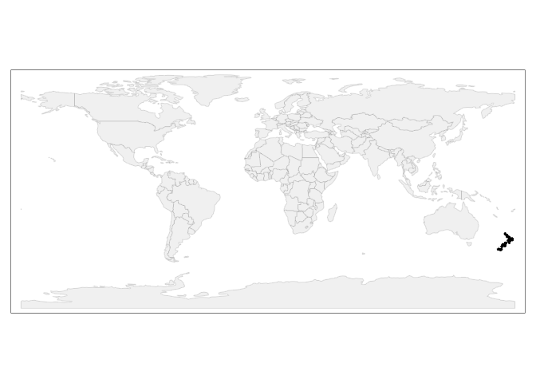
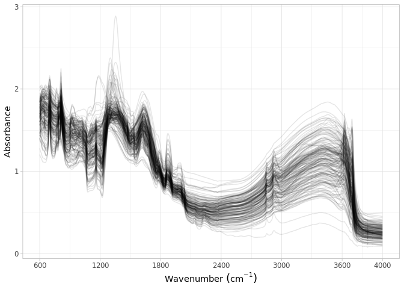

Dataset import: Garrett et al. (2022)
================
Jose Lucas Safanelli (<jsafanelli@woodwellclimate.org>) and Jonathan
Sanderman (<jsanderman@woodwellclimate.org>)
16 December, 2022


-   [The Garrett et al. (2022) Soil Spectral
    Library](#the-garrett-et-al-2022-soil-spectral-library)
-   [Data import](#data-import)
    -   [Soil site information](#soil-site-information)
    -   [Soil lab information](#soil-lab-information)
    -   [Mid-infrared spectroscopy
        data](#mid-infrared-spectroscopy-data)
    -   [Quality control](#quality-control)
-   [References](#references)

[](https://soilspectroscopy.org/)

[](http://creativecommons.org/licenses/by-sa/4.0/)

This work is licensed under a [Creative Commons Attribution-ShareAlike
4.0 International
License](http://creativecommons.org/licenses/by-sa/4.0/).

## The Garrett et al. (2022) Soil Spectral Library

Part of: <https://github.com/soilspectroscopy>  
Project: [Soil Spectroscopy for Global
Good](https://soilspectroscopy.org)  
Last update: 2022-12-16  
Dataset:
[GARRETT.SSL](https://soilspectroscopy.github.io/ossl-manual/soil-spectroscopy-tools-and-users.html#garrett.ssl)

Mid-Infrared Spectra (MIRS) of 186 soil samples from forest soils of New
Zealand (Surveyed by Scion Research) described in [Garrett et
al.](#ref-Garrett2022) ([2022](#ref-Garrett2022)).

The dataset is publicly shared at Figshare
<https://doi.org/10.6084/m9.figshare.20506587.v2>.

Input datasets:  
- `FR380_sitedescription.xlsx` and `FR380_soilprofile.xlsx`: files with
site information;  
- `FR380_physical.xlsx`, `FR380_chemical.xlsx`, and
`FR380_particlesize.xlsx`: files with soil information;  
- `FR380_MIR spectra_csv`: folder with exported MIR spectral scans;

Directory/folder path:

``` r
dir = "/mnt/soilspec4gg/ossl/dataset/Garrett/"
tic()
```

## Data import

### Soil site information

Spectral data filenames follow Scion\_Sample ID present in chemical
data, but there are other id columns from LCR and site ids that are
necessary for binding with other tables (like physical). In this case,
Scion\_Sample ID will be used as `id.layer_local_c` in the OSSL.

``` r
# Getting FR380_chemical
garrett.chemical <- readxl::read_xlsx(paste0(dir, "/FR380_chemical.xlsx"), sheet = "FR380_Chemical", skip = 1)

garrett.ids <- garrett.chemical %>%
  select(`Scion_Sample ID`, `Trial ID`,
         `LCR_Sample ID`, `LCR_Soil profile ID`,
         `LCR_Lab letter`, `LCR_Horizon number`,
         `Horizon top (cm)`, `Horizon base (cm)`,) %>%
  rename(id.layer_local_c = `Scion_Sample ID`,
         id.dataset.site_ascii_txt = `Trial ID`,
         layer.upper.depth_usda_cm = `Horizon top (cm)`,
         layer.lower.depth_usda_cm = `Horizon base (cm)`) %>%
  mutate(id.layer_local_c = as.character(id.layer_local_c)) %>%
  filter(!is.na(id.layer_local_c)) %>%
  mutate(id.dataset.site_ascii_txt = gsub("\\s", "", id.dataset.site_ascii_txt))

# Getting FR380_sitedescription
garrett.sitedescription <- readxl::read_xlsx(paste0(dir, "/FR380_sitedescription.xlsx"), sheet = "FR380_site description")

# Getting FR380_soilprofile
garrett.soilprofile <- readxl::read_xlsx(paste0(dir, "/FR380_soilprofile.xlsx"), sheet = "FR380_soil profile")

# Preparing soilsite information
garrett.sitedata <- garrett.sitedescription %>%
  select(`Trial ID`, `Date observed`, `Latitude (°)`, `Longitude (°)`, `Soil type`) %>%
  rename(longitude.point_wgs84_dd = `Longitude (°)`, latitude.point_wgs84_dd = `Latitude (°)`,
         id.dataset.site_ascii_txt = `Trial ID`, layer.texture_usda_txt = `Soil type`) %>%
  mutate(id.dataset.site_ascii_txt = gsub("\\s", "", id.dataset.site_ascii_txt)) %>%
  mutate(`Date observed` = lubridate::ymd(`Date observed`)) %>%
  mutate(observation.date.begin_iso.8601_yyyy.mm.dd = stringr::str_c(lubridate::year(`Date observed`),
                                                                     lubridate::month(`Date observed`),
                                                                     lubridate::day(`Date observed`),
                                                                     sep = "."),
         observation.date.end_iso.8601_yyyy.mm.dd = stringr::str_c(lubridate::year(`Date observed`),
                                                                   lubridate::month(`Date observed`),
                                                                   lubridate::day(`Date observed`),
                                                                   sep = ".")) %>%
  select(id.dataset.site_ascii_txt,
         longitude.point_wgs84_dd, latitude.point_wgs84_dd,
         observation.date.begin_iso.8601_yyyy.mm.dd,
         observation.date.end_iso.8601_yyyy.mm.dd,
         layer.texture_usda_txt) %>%
  left_join({garrett.ids %>%
      select(-contains("LCR"))}, ., by = "id.dataset.site_ascii_txt") %>%
  mutate(id.project_ascii_txt = "Forest soil data from New Zealand (Scion Research)",
         observation.ogc.schema.title_ogc_txt = 'Open Soil Spectroscopy Library',
         observation.ogc.schema_idn_url = 'https://soilspectroscopy.github.io',
         pedon.taxa_usda_txt = "",
         horizon.designation_usda_txt = "",
         longitude.county_wgs84_dd = NA,
         latitude.county_wgs84_dd = NA,
         location.country_iso.3166_txt = "NZL",
         location.point.error_any_m = 1111, # Only two decimal places in lat long
         surveyor.title_utf8_txt = "Loretta Garrett",
         surveyor.contact_ietf_email = "loretta.garrett@scionresearch.com",
         surveyor.address_utf8_txt = 'Scion, Private Bag 3020, Rotorua 3046, New Zealand',
         dataset.title_utf8_txt = 'Garrett et al. (2022)',
         dataset.owner_utf8_txt = 'Garrett et al. (2022)',
         dataset.code_ascii_txt = 'GARRETT.SSL',
         dataset.address_idn_url = 'https://doi.org/10.6084/m9.figshare.20506587.v2',
         dataset.license.title_ascii_txt = 'CC-BY',
         dataset.license.address_idn_url = 'https://creativecommons.org/licenses/by/4.0/legalcode',
         dataset.doi_idf_url = 'https://doi.org/10.6084/m9.figshare.20506587.v2',
         dataset.contact.name_utf8_txt = "Loretta Garrett",
         dataset.contact_ietf_email = "loretta.garrett@scionresearch.com") %>%
  mutate(id.layer_uuid_txt = openssl::md5(paste0(dataset.code_ascii_txt, id.layer_local_c)),
         id.location_olc_txt = olctools::encode_olc(latitude.point_wgs84_dd, longitude.point_wgs84_dd, 10),
         .after = id.project_ascii_txt) %>%
  select(id.layer_uuid_txt, # Following the sequence from ossl-manual
         id.layer_local_c,
         id.location_olc_txt,
         id.dataset.site_ascii_txt,
         id.project_ascii_txt,
         observation.date.begin_iso.8601_yyyy.mm.dd,
         observation.date.end_iso.8601_yyyy.mm.dd,
         longitude.point_wgs84_dd,
         latitude.point_wgs84_dd,
         pedon.taxa_usda_txt,
         layer.texture_usda_txt,
         horizon.designation_usda_txt,
         longitude.county_wgs84_dd,
         latitude.county_wgs84_dd,
         location.country_iso.3166_txt,
         location.point.error_any_m,
         observation.ogc.schema.title_ogc_txt,
         observation.ogc.schema_idn_url,
         surveyor.title_utf8_txt,
         surveyor.contact_ietf_email,
         surveyor.address_utf8_txt,
         dataset.title_utf8_txt,
         dataset.owner_utf8_txt,
         dataset.code_ascii_txt,
         dataset.address_idn_url,
         dataset.license.title_ascii_txt,
         dataset.license.address_idn_url,
         dataset.doi_idf_url,
         dataset.contact.name_utf8_txt,
         dataset.contact_ietf_email) %>%
  mutate_at(vars(starts_with("id.")), as.character)

# Saving version to dataset root dir
site.qs = paste0(dir, "/ossl_soilsite_v1.2.qs")
qs::qsave(garrett.sitedata, site.qs, preset = "high")
```

### Soil lab information

NOTE: The code chunk below this paragraph is hidden. Just run once for
getting the original names of soil properties, descriptions, data types,
and units. Run once and upload to Google Sheet for formatting and
integrating with the OSSL. Requires Google authentication.

<!-- ```{r, eval=FALSE, echo=TRUE} -->
<!-- garrett.physical.desc <- readxl::read_xlsx(paste0(dir, "/FR380_physical.xlsx"), sheet = "Data dictionary") -->
<!-- garrett.chemical.desc <- readxl::read_xlsx(paste0(dir, "/FR380_chemical.xlsx"), sheet = "Data dictionary") -->
<!-- garrett.particlesize.desc <- readxl::read_xlsx(paste0(dir, "/FR380_particlesize.xlsx"), sheet = "Data dictionary") -->
<!-- soillab.names <- garrett.particlesize.desc %>% -->
<!--   dplyr::mutate(table = "FR380_particlesize", .before = 1) %>% -->
<!--   dplyr::rename(original_name = `Field name`, original_description = `Field name description`, -->
<!--          comment1 = `Specific test method`, comment2 = `Relevant reference`) %>% -->
<!--   mutate(comment = paste0(comment1, "; ", comment2)) %>% -->
<!--   dplyr::select(table, original_name, original_description, comment) %>% -->
<!--   bind_rows({ -->
<!--     garrett.physical.desc %>% -->
<!--       dplyr::mutate(table = "FR380_physical", .before = 1) %>% -->
<!--       dplyr::rename(original_name = `Field name`, original_description = `Field name description`, -->
<!--                     comment1 = `Specific test method`, comment2 = `Relevant reference`) %>% -->
<!--   mutate(comment = paste0(comment1, "; ", comment2)) %>% -->
<!--       dplyr::select(table, original_name, original_description, comment) -->
<!--   }) %>% -->
<!--   bind_rows({ -->
<!--     garrett.chemical.desc %>% -->
<!--       dplyr::mutate(table = "FR380_chemical", .before = 1) %>% -->
<!--       dplyr::rename(original_name = `Field name`, original_description = `Field name description`, -->
<!--                     comment1 = `Specific chemical test method`, comment2 = `Relevant reference`) %>% -->
<!--       mutate(comment = paste0(comment1, "; ", comment2)) %>% -->
<!--       dplyr::select(table, original_name, original_description, comment) -->
<!--   }) %>% -->
<!--   dplyr::mutate(import = '', ossl_name = '', .after = original_name) -->
<!-- readr::write_csv(soillab.names, paste0(getwd(), "/garrett_soillab_names.csv")) -->
<!-- # Uploading to google sheet -->
<!-- # FACT CIN folder. Get ID for soildata importing table -->
<!-- googledrive::drive_ls(as_id("0AHDIWmLAj40_Uk9PVA")) -->
<!-- OSSL.soildata.importing <- "19LeILz9AEnKVK7GK0ZbK3CCr2RfeP-gSWn5VpY8ETVM" -->
<!-- # Checking metadata -->
<!-- googlesheets4::as_sheets_id(OSSL.soildata.importing) -->
<!-- # Checking readme -->
<!-- googlesheets4::read_sheet(OSSL.soildata.importing, sheet = 'readme') -->
<!-- # Preparing soillab.names -->
<!-- upload <- dplyr::as_tibble(soillab.names) -->
<!-- # Uploading -->
<!-- googlesheets4::write_sheet(upload, ss = OSSL.soildata.importing, sheet = "Garrett") -->
<!-- # Checking metadata -->
<!-- googlesheets4::as_sheets_id(OSSL.soildata.importing) -->
<!-- ``` -->

NOTE: The code chunk below this paragraph is hidden. Run once for
importing the transformation rules. The table can be edited online at
Google Sheets. A copy is downloaded to github for archiving.

<!-- ```{r soilab_download, include=FALSE, echo=FALSE, eval=FALSE} -->
<!-- # Downloading from google sheet -->
<!-- # FACT CIN folder id -->
<!-- listed.table <- googledrive::drive_ls(as_id("0AHDIWmLAj40_Uk9PVA"), -->
<!--                                       pattern = "OSSL_tab2_soildata_importing") -->
<!-- OSSL.soildata.importing <- listed.table[[1,"id"]] -->
<!-- # Checking metadata -->
<!-- googlesheets4::as_sheets_id(OSSL.soildata.importing) -->
<!-- # Preparing soillab.names -->
<!-- transvalues <- googlesheets4::read_sheet(OSSL.soildata.importing, sheet = "Garrett") %>% -->
<!--   filter(import == TRUE) %>% -->
<!--   select(contains(c("table", "id", "original_name", "ossl_"))) -->
<!-- # Saving to folder -->
<!-- write_csv(transvalues, paste0(getwd(), "/OSSL_transvalues.csv")) -->
<!-- ``` -->

Reading AFSIS1-to-OSSL transformation values:

``` r
transvalues <- read_csv(paste0(getwd(), "/OSSL_transvalues.csv"))
knitr::kable(transvalues)
```

| table               | original\_name                   | ossl\_abbrev | ossl\_method | ossl\_unit | ossl\_convert                                      | ossl\_name                   |
|:--------------------|:---------------------------------|:-------------|:-------------|:-----------|:---------------------------------------------------|:-----------------------------|
| FR380\_particlesize | Sand (%)                         | clay.tot     | usda.a334    | w.pct      | ifelse(as.numeric(x) &lt; 0, NA, as.numeric(x)\*1) | clay.tot\_usda.a334\_w.pct   |
| FR380\_particlesize | Silt (%)                         | sand.tot     | usda.c60     | w.pct      | ifelse(as.numeric(x) &lt; 0, NA, as.numeric(x)\*1) | sand.tot\_usda.c60\_w.pct    |
| FR380\_particlesize | Clay (%)                         | silt.tot     | usda.c62     | w.pct      | ifelse(as.numeric(x) &lt; 0, NA, as.numeric(x)\*1) | silt.tot\_usda.c62\_w.pct    |
| FR380\_physical     | Bulk density (g/cm3)             | bd           | usda.a4      | g.cm3      | ifelse(as.numeric(x) &lt; 0, NA, as.numeric(x)\*1) | bd\_usda.a4\_g.cm3           |
| FR380\_physical     | Water content at 10 kPa (%w/w)   | wr.10kPa     | usda.a414    | w.pct      | ifelse(as.numeric(x) &lt; 0, NA, as.numeric(x)\*1) | wr.10kPa\_usda.a414\_w.pct   |
| FR380\_physical     | Water content at 1500 kPa (%w/w) | wr.1500kPa   | usda.a417    | w.pct      | ifelse(as.numeric(x) &lt; 0, NA, as.numeric(x)\*1) | wr.1500kPa\_usda.a417\_w.pct |
| FR380\_chemical     | LCR\_Total Carbon (%)            | c.tot        | usda.a622    | w.pct      | ifelse(as.numeric(x) &lt; 0, NA, as.numeric(x)\*1) | c.tot\_usda.a622\_w.pct      |
| FR380\_chemical     | LCR\_Total Nitrogen (%)          | n.tot        | usda.a623    | w.pct      | ifelse(as.numeric(x) &lt; 0, NA, as.numeric(x)\*1) | n.tot\_usda.a623\_w.pct      |
| FR380\_chemical     | LCR\_P Olsen Available (ug/g)    | p.ext        | usda.a274    | mg.kg      | ifelse(as.numeric(x) &lt; 0, NA, as.numeric(x)\*1) | p.ext\_usda.a274\_mg.kg      |
| FR380\_chemical     | LCR\_P Bray Available (ug/g)     | p.ext        | usda.a270    | mg.kg      | ifelse(as.numeric(x) &lt; 0, NA, as.numeric(x)\*1) | p.ext\_usda.a270\_mg.kg      |
| FR380\_chemical     | LCR\_CEC (me.%)                  | cec          | usda.a723    | cmolc.kg   | ifelse(as.numeric(x) &lt; 0, NA, as.numeric(x)\*1) | cec\_usda.a723\_cmolc.kg     |
| FR380\_chemical     | LCR\_Exchange Ca (me.%)          | ca.ext       | usda.a722    | cmolc.kg   | ifelse(as.numeric(x) &lt; 0, NA, as.numeric(x)\*1) | ca.ext\_usda.a722\_cmolc.kg  |
| FR380\_chemical     | LCR\_Exchange Mg (me.%)          | mg.ext       | usda.a724    | cmolc.kg   | ifelse(as.numeric(x) &lt; 0, NA, as.numeric(x)\*1) | mg.ext\_usda.a724\_cmolc.kg  |
| FR380\_chemical     | LCR\_Exchange K (me.%)           | k.ext        | usda.a725    | cmolc.kg   | ifelse(as.numeric(x) &lt; 0, NA, as.numeric(x)\*1) | k.ext\_usda.a725\_cmolc.kg   |
| FR380\_chemical     | LCR\_Exchange Na (me.%)          | na.ext       | usda.a726    | cmolc.kg   | ifelse(as.numeric(x) &lt; 0, NA, as.numeric(x)\*1) | na.ext\_usda.a726\_cmolc.kg  |
| FR380\_chemical     | Scion\_pH \[H2O\]                | ph.h2o       | usda.a268    | index      | ifelse(as.numeric(x) &lt; 0, NA, as.numeric(x)\*1) | ph.h2o\_usda.a268\_index     |
| FR380\_chemical     | Scion\_Mehlich 3 B (mg/kg)       | b.ext        | mel3         | mg.kg      | ifelse(as.numeric(x) &lt; 0, NA, as.numeric(x)\*1) | b.ext\_mel3\_mg.kg           |
| FR380\_chemical     | Scion\_Mehlich 3 Al (mg/kg)      | al.ext       | usda.a1056   | mg.kg      | ifelse(as.numeric(x) &lt; 0, NA, as.numeric(x)\*1) | al.ext\_usda.a1056\_mg.kg    |
| FR380\_chemical     | Scion\_Mehlich 3 Na (mg/kg)      | na.ext       | usda.a1068   | mg.kg      | ifelse(as.numeric(x) &lt; 0, NA, as.numeric(x)\*1) | na.ext\_usda.a1068\_mg.kg    |
| FR380\_chemical     | Scion\_Mehlich 3 Mg (mg/kg)      | mg.ext       | usda.a1066   | mg.kg      | ifelse(as.numeric(x) &lt; 0, NA, as.numeric(x)\*1) | mg.ext\_usda.a1066\_mg.kg    |
| FR380\_chemical     | Scion\_Mehlich 3 P (mg/kg)       | p.ext        | usda.a652    | mg.kg      | ifelse(as.numeric(x) &lt; 0, NA, as.numeric(x)\*1) | p.ext\_usda.a652\_mg.kg      |
| FR380\_chemical     | Scion\_Mehlich 3 K (mg/kg)       | k.ext        | usda.a1065   | mg.kg      | ifelse(as.numeric(x) &lt; 0, NA, as.numeric(x)\*1) | k.ext\_usda.a1065\_mg.kg     |
| FR380\_chemical     | Scion\_Mehlich 3 Ca (mg/kg)      | ca.ext       | usda.a1059   | mg.kg      | ifelse(as.numeric(x) &lt; 0, NA, as.numeric(x)\*1) | ca.ext\_usda.a1059\_mg.kg    |
| FR380\_chemical     | Scion\_Mehlich 3 Mn (mg/kg)      | mn.ext       | usda.a1067   | mg.kg      | ifelse(as.numeric(x) &lt; 0, NA, as.numeric(x)\*1) | mn.ext\_usda.a1067\_mg.kg    |
| FR380\_chemical     | Scion\_Mehlich 3 Fe (mg/kg)      | fe.ext       | usda.a1064   | mg.kg      | ifelse(as.numeric(x) &lt; 0, NA, as.numeric(x)\*1) | fe.ext\_usda.a1064\_mg.kg    |
| FR380\_chemical     | Scion\_Mehlich 3 Cu (mg/kg)      | cu.ext       | usda.a1063   | mg.kg      | ifelse(as.numeric(x) &lt; 0, NA, as.numeric(x)\*1) | cu.ext\_usda.a1063\_mg.kg    |
| FR380\_chemical     | Scion\_Mehlich 3 Zn (mg/kg)      | zn.ext       | usda.a1073   | mg.kg      | ifelse(as.numeric(x) &lt; 0, NA, as.numeric(x)\*1) | zn.ext\_usda.a1073\_mg.kg    |

``` r
# Getting FR380_chemical
garrett.chemical <- readxl::read_xlsx(paste0(dir, "/FR380_chemical.xlsx"), sheet = "FR380_Chemical", skip = 1)

# Getting FR380_physical
garrett.physical <- readxl::read_xlsx(paste0(dir, "/FR380_physical.xlsx"), sheet = "FR380_Physical")

# Getting FR380_particlesize
garrett.particlesize <- readxl::read_xlsx(paste0(dir, "/FR380_particlesize.xlsx"), sheet = "FR380_Particle size", skip = 0)

# Harmonization of names and units for chemical data
analytes.old.names <- transvalues %>%
  filter(table == "FR380_chemical") %>%
  pull(original_name)

analytes.new.names <- transvalues %>%
  filter(table == "FR380_chemical") %>%
  pull(ossl_name)

garrett.soil.chemical <- garrett.chemical %>%
  rename(id.layer_local_c = `Scion_Sample ID`,
         layer.upper.depth_usda_cm = `Horizon top (cm)`,
         layer.lower.depth_usda_cm = `Horizon base (cm)`) %>%
  mutate(id.layer_local_c = as.character(id.layer_local_c)) %>%
  select(id.layer_local_c, layer.upper.depth_usda_cm, layer.lower.depth_usda_cm, all_of(analytes.old.names)) %>%
  rename_with(~analytes.new.names, analytes.old.names) %>%
  mutate_at(vars(-id.layer_local_c), as.numeric) %>%
  as.data.frame()

# Harmonization of names and units for psd data
analytes.old.names <- transvalues %>%
  filter(table == "FR380_particlesize") %>%
  pull(original_name)

analytes.new.names <- transvalues %>%
  filter(table == "FR380_particlesize") %>%
  pull(ossl_name)

garrett.soil.psd <- garrett.particlesize %>%
  rename_with(~analytes.new.names, analytes.old.names) %>%
  select(`LCR_Soil profile ID`, `LCR_Lab letter`, all_of(analytes.new.names)) %>%
  left_join(garrett.ids, by = c("LCR_Soil profile ID", "LCR_Lab letter")) %>%
  select(id.layer_local_c, all_of(analytes.new.names))

# Harmonization of names and units for physical data
analytes.old.names <- transvalues %>%
  filter(table == "FR380_physical") %>%
  pull(original_name)

analytes.new.names <- transvalues %>%
  filter(table == "FR380_physical") %>%
  pull(ossl_name)

garrett.soil.physical <- garrett.physical %>%
  filter(`Sample plots 'Disturbed' or 'Undisturbed'` == "Undisturbed") %>%
  rename_with(~analytes.new.names, analytes.old.names) %>%
  select(`LCR_Soil profile ID`, `LCR_Horizon number`, all_of(analytes.new.names)) %>%
  left_join(garrett.ids, by = c("LCR_Soil profile ID", "LCR_Horizon number")) %>%
  select(id.layer_local_c, all_of(analytes.new.names)) %>%
  mutate_at(vars(-c('id.layer_local_c')), as.numeric) %>%
  filter(!is.na(id.layer_local_c))
  
analytes.new.names <- transvalues %>%
  pull(ossl_name)

garrett.soildata <- garrett.ids %>%
  select(id.layer_local_c) %>%
  left_join(garrett.soil.psd, by = "id.layer_local_c") %>%
  left_join(garrett.soil.chemical, by = "id.layer_local_c") %>%
  left_join(garrett.soil.physical, by = "id.layer_local_c") %>%
  group_by(id.layer_local_c) %>%
  summarise_all(first, .group = "drop") %>%
  select(id.layer_local_c, layer.upper.depth_usda_cm, layer.lower.depth_usda_cm, all_of(analytes.new.names)) %>%
  as.data.frame()

# Getting the formulas
functions.list <- transvalues %>%
  mutate(ossl_name = factor(ossl_name, levels = names(garrett.soildata))) %>%
  arrange(ossl_name) %>%
  pull(ossl_convert) %>%
  c("x", "x", "x", .)

# Applying transformation rules
garrett.soildata.trans <- transform_values(df = garrett.soildata,
                                           out.name = names(garrett.soildata),
                                           in.name = names(garrett.soildata),
                                           fun.lst = functions.list)

# Final soillab data
garrett.soildata <- garrett.soildata.trans %>%
  mutate_at(vars(starts_with("id.")), as.character)

# Checking total number of observations
garrett.soildata %>%
  distinct(id.layer_local_c) %>%
  summarise(count = n())
```

    ##   count
    ## 1   184

``` r
# Saving version to dataset root dir
soillab.qs = paste0(dir, "/ossl_soillab_v1.2.qs")
qs::qsave(garrett.soildata, soillab.qs, preset = "high")
```

### Mid-infrared spectroscopy data

``` r
# Spectral measurements
scans.csv <- list.files(paste0(dir, "/FR380_MIR spectra_csv"), full.names = TRUE)
scans.names <- list.files(paste0(dir, "/FR380_MIR spectra_csv"), full.names = FALSE)

# Spectra is stored in long format without header, first column wavenumber, second column absorbance
mir.test <- readr::read_csv(scans.csv[1], show_col_types = FALSE, col_names = FALSE) %>%
  setNames(c("wavenumber", "absorbance"))

mir.allspectra <- purrr::map_dfr(.x = scans.csv, .f = fread, .id = "source", header = FALSE)

mir.allspectra <- mir.allspectra %>%
  pivot_wider(names_from = "V1", values_from = "V2") %>%
  mutate(id = scans.names, .before = 1) %>%
  mutate(id = gsub(".csv", "", id))

# Checking number of spectral replicates
mir.allspectra %>%
  separate(id, into = c("id", "replicate"), sep = "-") %>%
  group_by(id) %>%
  summarise(n = n()) %>%
  group_by(n) %>%
  summarise(count = n())
```

    ## # A tibble: 2 × 2
    ##       n count
    ##   <int> <int>
    ## 1     3   144
    ## 2     4    40

``` r
# Checking number of unique spectral samples
mir.allspectra %>%
  separate(id, into = c("id", "replicate"), sep = "-") %>%
  group_by(id) %>%
  summarise(n = n()) %>%
  ungroup() %>%
  nrow()
```

    ## [1] 184

``` r
# Removing source column (it comes from csv importing when mapping listed files. number is row/object id)
garrett.mir <- mir.allspectra %>%
  select(-source) %>%
  rename(scan.file_any_c = id) %>%
  mutate(id.scan_local_c = scan.file_any_c, .after = scan.file_any_c) %>%
  separate(id.scan_local_c, into = c("id.scan_local_c", "table_code"), sep = "_") %>%
  select(-table_code) %>%
  mutate(id.layer_local_c = str_sub(id.scan_local_c, 1, -3), .before = 1) %>%
  mutate(id.layer_local_c = as.character(id.layer_local_c))

# The spectra is already formatted between 600-4000 cm-1
# But it is necessary to average them
old.wavenumbers <- seq(600, 4000, by = 2)
new.wavenumbers <- paste0("scan_mir.", old.wavenumbers, "_abs")

garrett.mir <- garrett.mir %>%
  select(id.layer_local_c, as.character(rev(old.wavenumbers))) %>%
  rename_with(~new.wavenumbers, as.character(old.wavenumbers)) %>%
  group_by(id.layer_local_c) %>%
  summarize_all(mean)
  
# Preparing metadata
garrett.mir.metadata <- garrett.mir %>%
  select(id.layer_local_c) %>%
  mutate(id.scan_local_c = id.layer_local_c) %>%
  mutate(scan.mir.date.begin_iso.8601_yyyy.mm.dd = ymd("2019-07-01"),
         scan.mir.date.end_iso.8601_yyyy.mm.dd = ymd("2019-08-31"),
         scan.mir.model.name_utf8_txt = "Bruker Invenio-S with HTS-XT",
         scan.mir.model.code_any_txt = "Bruker_InvenioS_HTS.XT",
         scan.mir.method.optics_any_txt = "",
         scan.mir.method.preparation_any_txt = "",
         scan.mir.license.title_ascii_txt = "CC-BY",
         scan.mir.license.address_idn_url = "https://creativecommons.org/licenses/by/4.0/",
         scan.mir.doi_idf_url = "https://doi.org/10.6084/m9.figshare.20506587.v2",
         scan.mir.contact.name_utf8_txt = "Loretta Garrett",
         scan.mir.contact.email_ietf_txt = "loretta.garrett@scionresearch.com")

# Final preparation
garrett.mir.export <- garrett.mir.metadata %>%
  left_join(garrett.mir, by = "id.layer_local_c") %>%
  mutate_at(vars(starts_with("id.")), as.character)

# Saving version to dataset root dir
soilmir.qs = paste0(dir, "/ossl_mir_v1.2.qs")
qs::qsave(garrett.mir.export, soilmir.qs, preset = "high")
```

### Quality control

The final table must be joined as:

-   MIR is used as first reference.
-   Then it is left joined with the site and soil lab data. This drop
    data without any scan.

The availabilty of data is summarised below:

``` r
# Taking a few representative columns for checking the consistency of joins
garrett.availability <- garrett.mir.export %>%
  select(id.layer_local_c, scan_mir.600_abs) %>%
  left_join({garrett.sitedata %>%
      select(id.layer_local_c, latitude.point_wgs84_dd)}, by = "id.layer_local_c") %>%
  left_join({garrett.soildata %>%
      select(id.layer_local_c, c.tot_usda.a622_w.pct)}, by = "id.layer_local_c") %>%
  filter(!is.na(id.layer_local_c))

# Availability of information from garrett
garrett.availability %>%
  mutate_all(as.character) %>%
  pivot_longer(everything(), names_to = "column", values_to = "value") %>%
  filter(!is.na(value)) %>%
  group_by(column) %>%
  summarise(count = n())
```

    ## # A tibble: 4 × 2
    ##   column                  count
    ##   <chr>                   <int>
    ## 1 c.tot_usda.a622_w.pct     184
    ## 2 id.layer_local_c          184
    ## 3 latitude.point_wgs84_dd   184
    ## 4 scan_mir.600_abs          184

``` r
# Repeats check - Duplicates are dropped
garrett.availability %>%
  mutate_all(as.character) %>%
  select(id.layer_local_c) %>%
  pivot_longer(everything(), names_to = "column", values_to = "value") %>%
  group_by(column, value) %>%
  summarise(repeats = n()) %>%
  group_by(column, repeats) %>%
  summarise(count = n())
```

    ## # A tibble: 1 × 3
    ## # Groups:   column [1]
    ##   column           repeats count
    ##   <chr>              <int> <int>
    ## 1 id.layer_local_c       1   184

Plotting sites map:

``` r
data("World")

points <- garrett.sitedata %>%
  filter(!is.na(longitude.point_wgs84_dd)) %>%
  st_as_sf(coords = c('longitude.point_wgs84_dd', 'latitude.point_wgs84_dd'), crs = 4326)

tmap_mode("plot")

tm_shape(World) +
  tm_polygons('#f0f0f0f0', border.alpha = 0.2) +
  tm_shape(points) +
  tm_dots()
```

<!-- -->

Soil analytical data summary. Note: many scans could not be linked with
the wetchem.

``` r
garrett.soildata %>%
  mutate(id.layer_local_c = factor(id.layer_local_c)) %>%
  skimr::skim() %>%
  dplyr::select(-numeric.hist, -complete_rate)
```

|                                                  |            |
|:-------------------------------------------------|:-----------|
| Name                                             | Piped data |
| Number of rows                                   | 184        |
| Number of columns                                | 30         |
| \_\_\_\_\_\_\_\_\_\_\_\_\_\_\_\_\_\_\_\_\_\_\_   |            |
| Column type frequency:                           |            |
| factor                                           | 1          |
| numeric                                          | 29         |
| \_\_\_\_\_\_\_\_\_\_\_\_\_\_\_\_\_\_\_\_\_\_\_\_ |            |
| Group variables                                  | None       |

Data summary

**Variable type: factor**

| skim\_variable     | n\_missing | ordered | n\_unique | top\_counts                    |
|:-------------------|-----------:|:--------|----------:|:-------------------------------|
| id.layer\_local\_c |          0 | FALSE   |       184 | S40: 1, S40: 1, S40: 1, S40: 1 |

**Variable type: numeric**

| skim\_variable               | n\_missing |    mean |     sd |    p0 |    p25 |     p50 |     p75 |    p100 |
|:-----------------------------|-----------:|--------:|-------:|------:|-------:|--------:|--------:|--------:|
| layer.upper.depth\_usda\_cm  |          0 |   22.33 |  24.62 |  0.00 |   0.00 |   14.50 |   38.00 |   95.00 |
| layer.lower.depth\_usda\_cm  |          4 |   38.54 |  29.32 |  2.00 |  10.00 |   31.50 |   60.00 |  115.00 |
| clay.tot\_usda.a334\_w.pct   |         42 |   41.80 |  27.23 |  3.00 |  21.00 |   36.00 |   55.75 |  100.00 |
| sand.tot\_usda.c60\_w.pct    |         42 |   38.09 |  19.45 |  0.00 |  27.00 |   39.00 |   50.00 |   79.00 |
| silt.tot\_usda.c62\_w.pct    |         42 |   20.06 |  15.05 |  0.00 |   7.00 |   18.50 |   29.00 |   61.00 |
| bd\_usda.a4\_g.cm3           |         94 |    0.95 |   0.28 |  0.25 |   0.75 |    0.97 |    1.16 |    1.52 |
| wr.10kPa\_usda.a414\_w.pct   |         94 |   47.73 |  27.60 |  6.52 |  31.59 |   40.62 |   59.73 |  150.63 |
| wr.1500kPa\_usda.a417\_w.pct |         94 |   21.47 |  14.31 |  0.90 |  10.55 |   19.10 |   28.91 |   70.10 |
| c.tot\_usda.a622\_w.pct      |          0 |    3.23 |   3.27 |  0.08 |   0.86 |    2.27 |    4.51 |   21.56 |
| n.tot\_usda.a623\_w.pct      |          0 |    0.16 |   0.14 |  0.00 |   0.05 |    0.11 |    0.24 |    0.67 |
| p.ext\_usda.a274\_mg.kg      |         48 |    4.34 |   4.98 |  0.00 |   1.01 |    2.45 |    5.81 |   29.07 |
| p.ext\_usda.a270\_mg.kg      |         48 |   14.41 |  31.12 |  0.92 |   3.23 |    6.48 |   14.60 |  328.41 |
| cec\_usda.a723\_cmolc.kg     |          1 |   17.43 |  11.44 |  0.51 |   9.04 |   15.84 |   23.83 |   71.62 |
| ca.ext\_usda.a722\_cmolc.kg  |          1 |    2.82 |   4.41 |  0.00 |   0.32 |    1.11 |    3.66 |   29.03 |
| mg.ext\_usda.a724\_cmolc.kg  |          1 |    1.52 |   4.22 |  0.01 |   0.25 |    0.60 |    1.31 |   32.38 |
| k.ext\_usda.a725\_cmolc.kg   |          1 |    0.28 |   0.27 |  0.00 |   0.08 |    0.17 |    0.39 |    1.25 |
| na.ext\_usda.a726\_cmolc.kg  |          1 |    0.17 |   0.16 |  0.00 |   0.07 |    0.13 |    0.21 |    1.26 |
| ph.h2o\_usda.a268\_index     |          0 |    4.82 |   0.67 |  3.40 |   4.36 |    4.74 |    5.16 |    6.43 |
| b.ext\_mel3\_mg.kg           |          0 |    0.15 |   0.06 |  0.03 |   0.13 |    0.16 |    0.18 |    0.31 |
| al.ext\_usda.a1056\_mg.kg    |          0 | 1188.17 | 515.62 | 33.22 | 744.85 | 1259.12 | 1566.23 | 2532.86 |
| na.ext\_usda.a1068\_mg.kg    |          0 |   25.85 |  18.28 |  6.21 |  14.14 |   21.72 |   31.34 |  153.30 |
| mg.ext\_usda.a1066\_mg.kg    |          0 |  108.40 | 294.04 |  2.14 |  19.04 |   47.67 |   95.49 | 2380.07 |
| p.ext\_usda.a652\_mg.kg      |          0 |   21.02 |  20.36 |  1.89 |   6.07 |   15.62 |   28.87 |  140.30 |
| k.ext\_usda.a1065\_mg.kg     |          0 |   60.00 |  53.61 |  5.36 |  21.57 |   40.35 |   77.41 |  311.90 |
| ca.ext\_usda.a1059\_mg.kg    |          0 |  313.37 | 485.18 | 17.58 |  52.15 |  138.13 |  393.15 | 3336.18 |
| mn.ext\_usda.a1067\_mg.kg    |          1 |   16.77 |  31.06 |  0.06 |   1.07 |    4.13 |   18.33 |  267.85 |
| fe.ext\_usda.a1064\_mg.kg    |          0 |  160.67 | 117.95 | 10.12 |  78.63 |  127.69 |  199.10 |  668.26 |
| cu.ext\_usda.a1063\_mg.kg    |          0 |    0.69 |   0.57 |  0.08 |   0.32 |    0.52 |    0.92 |    4.34 |
| zn.ext\_usda.a1073\_mg.kg    |          0 |    1.32 |   0.90 |  0.33 |   0.68 |    0.99 |    1.65 |    4.53 |

MIR spectral visualization:

``` r
garrett.mir %>%
  select(all_of(c("id.layer_local_c")), starts_with("scan_mir.")) %>%
  tidyr::pivot_longer(-all_of(c("id.layer_local_c")),
                      names_to = "wavenumber", values_to = "absorbance") %>%
  dplyr::mutate(wavenumber = gsub("scan_mir.|_abs", "", wavenumber)) %>%
  dplyr::mutate(wavenumber = as.numeric(wavenumber)) %>%
  ggplot(aes(x = wavenumber, y = absorbance, group = id.layer_local_c)) +
  geom_line(alpha = 0.1) +
  scale_x_continuous(breaks = c(600, 1200, 1800, 2400, 3000, 3600, 4000)) +
  labs(x = bquote("Wavenumber"~(cm^-1)), y = "Absorbance") +
  theme_light()
```

<!-- -->

``` r
toc()
```

    ## 13.697 sec elapsed

``` r
rm(list = ls())
gc()
```

    ##           used  (Mb) gc trigger  (Mb) max used  (Mb)
    ## Ncells 2600279 138.9    4718771 252.1  4718771 252.1
    ## Vcells 5321322  40.6   25913249 197.8 32359166 246.9

## References

<div id="refs" class="references csl-bib-body hanging-indent"
line-spacing="2">

<div id="ref-Garrett2022" class="csl-entry">

Garrett, L. G., Sanderman, J., Palmer, D. J., Dean, F., Patel, S.,
Bridson, J. H., & Carlin, T. (2022). Mid-infrared spectroscopy for
planted forest soil and foliage nutrition predictions, new zealand case
study. *Trees, Forests and People*, *8*, 100280.
doi:[10.1016/j.tfp.2022.100280](https://doi.org/10.1016/j.tfp.2022.100280)

</div>

</div>
