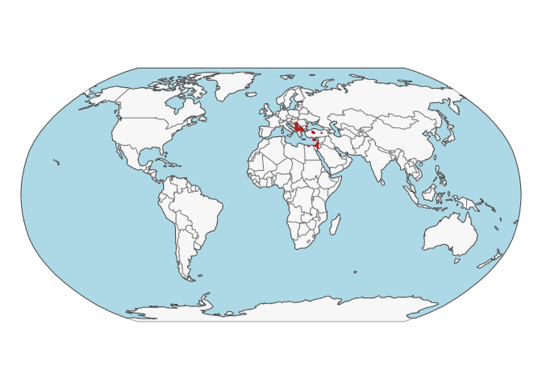
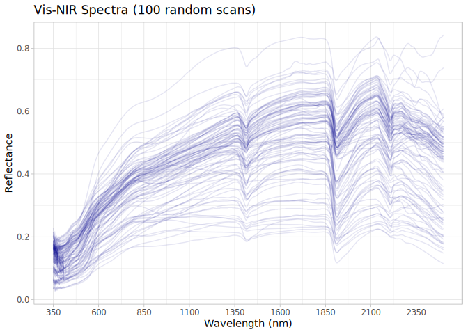

# Geocradle dataset preparation for the OSSL
Ran Zhi, Jose L. Safanelli, Jonathan Sanderman

- [The Geocradle original data](#the-geocradle-original-data)
- [Data standardization to the OSSL
  format](#data-standardization-to-the-ossl-format)
  - [Site information](#site-information)
  - [Soil lab information (reference analytical
    data)](#soil-lab-information-reference-analytical-data)
  - [VisNIR spectra](#visnir-spectra)
  - [Quality control for Vis-NIR](#quality-control-for-vis-nir)
- [References](#references)

Code repository for preparing and importing the Geocradle dataset into
the Open Soil Spectral Library.

Website: [Soil Spectroscopy for Global
Good](https://soilspectroscopy.org)  
Development: <https://github.com/soilspectroscopy>  
Last update: 2026-04-29  
Additional documentation:

## The Geocradle original data

Site data, Soil lab data, and Visible Near-Infrared (Vis-NIR) data from
the Geocradle regional soil spectral library.

Further information of the dataset can be found in detail at Tziolas et
al. ([2020](#ref-tziolas_integrated_2020)) and Tziolas, Tsakiridis,
Ben-Dor, Theocharis, & Zalidis ([2019](#ref-tziolas_memory-based_2019)).

Original files:  
- `SSL_GEOCRADLE_1.csv`: csv file with site information, soil
information, and Vis-NIR spectral data.

Directory/folder path with original files (not uploaded to GitHub).

``` r
# dir = "/Users/rzhi/Projects/git/ossl-imports-internal/dataset/Geocradle"
dir = dir = "~/mnt-ossl-private/database/datasets/Geocradle"
tic()
```

## Data standardization to the OSSL format

### Site information

``` r
geocradle.metadata <- fread(path(dir, "SSL_GEOCRADLE_1.csv"), header = T)

geocradle.sitedata <- geocradle.metadata %>%
  select(ID, Latitude, Longitude,
         Sampling_date, Depth,
         origin,
         Climate_Koeppen, Elevation,
         Soil_type_WRB, Soil_type_extended_WRB,
         Soil_type_USDA, USDA_texture) %>%
  rename(id.layer_local_c = ID,
         longitude.point_wgs84_dd = Longitude,
         latitude.point_wgs84_dd = Latitude,
         layer.lower.depth_usda_cm = Depth,
         loc.country_src_txt = origin,
         site.clim.koeppen_src_code = Climate_Koeppen,
         site.alt_src_m = Elevation,
         pedon.taxa_wrb_code = Soil_type_WRB,
         pedon.taxa_wrb_txt = Soil_type_extended_WRB,
         pedon.taxa_usda_txt = Soil_type_USDA,
         layer.texture_usda_txt = USDA_texture) %>%
  mutate(Sampling_date = str_remove(Sampling_date, "\\.+$")) %>%
  mutate(Sampling_date = str_replace_all(Sampling_date, "\\.", "-")) %>%
  mutate(Sampling_date2 = case_when(grepl("-", Sampling_date) ~ dmy(Sampling_date),
                                    !grepl("-", Sampling_date) ~ as_date(as.numeric(Sampling_date), origin = ymd("1899-12-30")),
                                    TRUE ~ NA)) %>%
  rename(observation.date_src_yyyy.mm.dd = Sampling_date) %>%
  # mutate(id.project_ascii_txt = "Geocradle Regional Soil Spectral Library",
  #        dataset.code_ascii_txt = "GEOCRADLE.SSL",
  #        observation.ogc.schema.title_ogc_txt = "Open Soil Spectroscopy Library",
  #        observation.ogc.schema_idn_url = "https://soilspectroscopy.github.io",
  #        dataset.title_utf8_txt = "GEOCRADLE: Geocradle Regional Soil Spectral Library for Balkans, Middle East, and North Africa",
  #        dataset.owner_utf8_txt = "PILOT 2: Improved Food Security – Water Extremes Management (IFS)",
  #        dataset.doi_idf_url = "http://datahub.geocradle.eu/dataset/regional-soil-spectral-library",
  #        dataset.license.title_ascii_txt = "Open Data Commons Open Database License (ODbL)",
  #        dataset.license.address_idn_url = "https://opendefinition.org/licenses/odc-odbl/",
  #        dataset.contact.name_utf8_txt = "Nikos Tsakiridis",
  #        dataset.contact_ietf_email = "tsakirin@auth.gr") %>%
  mutate(dataset.code_ascii_txt = "Geocradle",
         id.layer_uuid_txt = openssl::md5(paste0(dataset.code_ascii_txt, id.layer_local_c)),
         .before = 1) %>%
  mutate_at(vars(starts_with("id.")), as.character)
```

    Warning: There were 2 warnings in `mutate()`.
    The first warning was:
    ℹ In argument: `Sampling_date2 = case_when(...)`.
    Caused by warning:
    !  229 failed to parse.
    ℹ Run `dplyr::last_dplyr_warnings()` to see the 1 remaining warning.

``` r
# Saving version to dataset root dir
site.exp.file = path(dir, "ossl_soilsite_v1.3")
readr::write_csv(geocradle.sitedata, str_c(site.exp.file, ".csv.gz"))
nanoparquet::write_parquet(geocradle.sitedata, str_c(site.exp.file, ".parquet"))
```

Plotting sites map:

``` r
data("World")

ocean <- ne_download(scale = 110, type = "ocean", category = "physical", returnclass = "sf")
```

    Reading 'ne_110m_ocean.zip' from naturalearth...

``` r
points <- geocradle.sitedata %>%
  filter(!is.na(longitude.point_wgs84_dd),
         !is.na(latitude.point_wgs84_dd)) %>%
  st_as_sf(coords = c('longitude.point_wgs84_dd', 'latitude.point_wgs84_dd'), crs = 4326)

tmap_mode("plot")
```

    ℹ tmap modes "plot" - "view"
    ℹ toggle with `tmap::ttm()`

``` r
tm_shape(ocean) +
  tm_polygons(fill = "lightblue", col = NA) +
  tm_shape(World) +
  tm_polygons(fill = "#f0f0f0", fill_alpha = 0.5, col_alpha = 0.5) +
  tm_shape(points) +
  tm_dots(size = 0.10, fill = "firebrick") +
  tm_crs("ESRI:54030") +
  tm_layout(frame = FALSE)
```

    [tip] Consider a suitable map projection, e.g. by adding `+ tm_crs("auto")`.
    This message is displayed once per session.



### Soil lab information (reference analytical data)

NOTE: The code chunk below must be run just once for getting a template
for scripted column standardization. Just run once for getting the
original names of soil properties, descriptions, data types, and units.
Then upload to Google Sheet for editing and defining the rules for
integrating with the OSSL. Requires Google authentication. A copy of the
output file is saved to this folder for archiving purposes.

**Always leave the sheet name as TEMP to avoid overwritting, then rename
online to download locally.**

``` r
# Getting soillab original variables

soillab.names <- geocradle.metadata %>%
  select(ID, Sand_Fraction, Clay_Fraction, Silt_Fraction, USDA_texture, OC, OM, Soil_type_extended_WRB, Soil_type_USDA,
         Soil_extended_WRB, Soil_type_WRB_description, CaCO3, CEC, LOI, pH_H2O, pH_KCl, pH_CaCl2, EC_muS, NO3) %>%
  rename(id.layer_local_c = ID) %>%
  names() %>%
  tibble(original_name = .) %>%
  dplyr::mutate(table = 'SSL_GEOCRADLE_1.csv', .before = 1) %>%
  dplyr::mutate(import = '', original_unit = '', comment = '', ossl_abbrev = '', ossl_method = '', ossl_unit = '',
                ossl_convert = '', ossl_name = '', .after = original_name)

readr::write_csv(soillab.names, path(getwd(), "soillab_original_names.csv"))

# Uploading to google sheet

# Drive 'Open Soil Spectral Library'
# Folder 'Database v2'
googledrive::drive_ls(as_id("1l9VM4fFks2xBloDE69EFTfPgQeFx5aGw"))

# Use the ID of the file 'OSSL_v2_tab2_soildata_importing'
OSSL.soildata.importing <- "1mWTDJDuMp4oObcCxAy9gofSkrkcSWWf1TtEW2SuC1es"

# Checking metadata
googlesheets4::as_sheets_id(OSSL.soildata.importing)

# Checking readme
googlesheets4::read_sheet(OSSL.soildata.importing, sheet = 'readme')

# Preparing soillab.names for this dataset
upload <- dplyr::as_tibble(soillab.names)

# Uploading with TEMP name. Check online, move to sequence, and update name
googlesheets4::write_sheet(upload, ss = OSSL.soildata.importing, sheet = "TEMP")

# Checking metadata
googlesheets4::as_sheets_id(OSSL.soildata.importing)
```

NOTE: The code chunk below must be run just once. Run for getting the
column standardization rules after editing online on Google Sheets. A
copy of the output file is saved to this folder for archiving purposes.

``` r
# Downloading from google sheet

# Checking metadata
googlesheets4::as_sheets_id("1mWTDJDuMp4oObcCxAy9gofSkrkcSWWf1TtEW2SuC1es")

# Preparing soillab.names
transvalues <- googlesheets4::read_sheet("1mWTDJDuMp4oObcCxAy9gofSkrkcSWWf1TtEW2SuC1es",
                                         sheet = "Geocradle")

# Saving to folder
write_csv(transvalues, path(getwd(), "soillab_standardized_names.csv"))
```

Reading standardization rules:

``` r
transvalues <- read_csv(path(getwd(), "soillab_standardized_names.csv"),
                        show_col_types = F) %>%
  filter(import == TRUE) %>%
  select(contains(c("table", "id", "original_name", "original_unit" , "ossl_")))

knitr::kable(transvalues)
```

| table | original_name | original_unit | ossl_abbrev | ossl_method | ossl_unit | ossl_convert | ossl_name |
|:---|:---|:---|:---|:---|:---|:---|:---|
| SSL_GEOCRADLE_1.csv | Sand_Fraction | % | sand.tot | usda.c405 | w.pct | ifelse(as.numeric(x) \< 0, NA, as.numeric(x) \* 1) | sand.tot_usda.c405_w.pct |
| SSL_GEOCRADLE_1.csv | Clay_Fraction | % | clay.tot | usda.a334 | w.pct | ifelse(as.numeric(x) \< 0, NA, as.numeric(x) \* 1) | clay.tot_usda.a334_w.pct |
| SSL_GEOCRADLE_1.csv | Silt_Fraction | % | silt.tot | usda.c407 | w.pct | ifelse(as.numeric(x) \< 0, NA, as.numeric(x) \* 1) | silt.tot_usda.c407_w.pct |
| SSL_GEOCRADLE_1.csv | OC | % | oc | iso.10694 | w.pct | ifelse(as.numeric(x) \< 0, NA, as.numeric(x) \* 1) | oc_iso.10694_w.pct |
| SSL_GEOCRADLE_1.csv | CaCO3 | % | caco3 | iso.10693 | w.pct | ifelse(as.numeric(x) \< 0, NA, as.numeric(x) \* 1) | caco3_iso.10693_w.pct |
| SSL_GEOCRADLE_1.csv | pH_H2O | NA | ph.h2o | usda.a268 | index | ifelse(as.numeric(x) \< 0, NA, as.numeric(x) \* 1) | ph.h2o_usda.a268_index |
| SSL_GEOCRADLE_1.csv | EC_muS | mS/cm | ec | iso.11265 | ds.m | ifelse(as.numeric(x) \< 0, NA, as.numeric(x) \* 1) | ec_iso.11265_ds.m |

Standardizing soil data to the OSSL format:

``` r
geocradle.reference <- geocradle.metadata

# Standardization of names and units
valid_mappings <- transvalues %>%
  filter(table == "SSL_GEOCRADLE_1.csv") %>%
  filter(!is.na(ossl_name) & ossl_name != "") 

analytes.old.names <- valid_mappings %>% pull(original_name)
analytes.new.names <- valid_mappings %>% pull(ossl_name)

analytes.old.names.clean <- analytes.old.names[analytes.old.names != "ID"]
analytes.new.names.clean <- analytes.new.names[analytes.old.names != "ID"]

geocradle.soildata <- geocradle.reference %>%
  rename(id.layer_local_c = ID) %>%
  select(id.layer_local_c, all_of(analytes.old.names.clean)) %>%
  rename_with(~analytes.new.names.clean, all_of(analytes.old.names.clean)) %>%
  mutate(id.layer_local_c = as.character(id.layer_local_c)) %>%
  as.data.frame()

# Getting the formulas
functions.list <- transvalues %>%
  filter(table == "SSL_GEOCRADLE_1.csv") %>%
  mutate(ossl_name = factor(ossl_name, levels = names(geocradle.soildata))) %>%
  arrange(ossl_name) %>%
  pull(ossl_convert) %>%
  c("x", .)

# Applying transformation rules
geocradle.soildata.trans <- transform_values(df = geocradle.soildata,
                                       out.name = names(geocradle.soildata),
                                       in.name = names(geocradle.soildata),
                                       fun.lst = functions.list)

# Final soillab data
geocradle.soildata <- geocradle.soildata.trans %>%
  mutate(id.layer_local_c = as.character(id.layer_local_c)) %>%
  mutate(id.layer_local_c = make.unique(id.layer_local_c))

# Checking total number of observations
geocradle.soildata %>%
  distinct(id.layer_local_c) %>%
  summarise(count = n())
```

      count
    1  1753

``` r
# Saving version to dataset root dir
soillab.exp.file = path(dir, "ossl_soillab_v1.3")
readr::write_csv(geocradle.soildata, str_c(soillab.exp.file, ".csv.gz"))
nanoparquet::write_parquet(geocradle.soildata, str_c(soillab.exp.file, ".parquet"))
```

Soil lab data summary.

``` r
geocradle.soildata %>%
  mutate(id.layer_local_c = factor(id.layer_local_c)) %>%
  skimr::skim() %>%
  dplyr::select(-numeric.hist, -complete_rate)
```

|                                                  |            |
|:-------------------------------------------------|:-----------|
| Name                                             | Piped data |
| Number of rows                                   | 1753       |
| Number of columns                                | 8          |
| \_\_\_\_\_\_\_\_\_\_\_\_\_\_\_\_\_\_\_\_\_\_\_   |            |
| Column type frequency:                           |            |
| factor                                           | 1          |
| numeric                                          | 7          |
| \_\_\_\_\_\_\_\_\_\_\_\_\_\_\_\_\_\_\_\_\_\_\_\_ |            |
| Group variables                                  | None       |

Data summary

**Variable type: factor**

| skim_variable    | n_missing | ordered | n_unique | top_counts                     |
|:-----------------|----------:|:--------|---------:|:-------------------------------|
| id.layer_local_c |         0 | FALSE   |     1753 | AL-: 1, AL-: 1, AL-: 1, AL-: 1 |

**Variable type: numeric**

| skim_variable            | n_missing |  mean |    sd |   p0 |   p25 |   p50 |   p75 |   p100 |
|:-------------------------|----------:|------:|------:|-----:|------:|------:|------:|-------:|
| sand.tot_usda.c405_w.pct |       264 | 53.48 | 22.85 | 0.40 | 36.85 | 54.00 | 69.00 |  99.00 |
| clay.tot_usda.a334_w.pct |        77 | 21.26 | 16.01 | 0.00 |  9.39 | 17.00 | 29.10 |  94.80 |
| silt.tot_usda.c407_w.pct |       264 | 26.67 | 14.31 | 0.00 | 16.00 | 26.00 | 37.40 |  68.00 |
| oc_iso.10694_w.pct       |      1555 |  1.33 |  1.60 | 0.00 |  0.78 |  1.12 |  1.52 |  20.75 |
| caco3_iso.10693_w.pct    |       388 |  6.83 | 14.87 | 0.00 |  0.00 |  0.20 |  3.40 |  89.99 |
| ph.h2o_usda.a268_index   |      1141 |  7.22 |  1.09 | 3.50 |  6.50 |  7.44 |  8.01 |  10.07 |
| ec_iso.11265_ds.m        |      1412 |  2.29 |  9.32 | 0.02 |  0.16 |  0.67 |  1.42 | 120.00 |

### VisNIR spectra

Spectra is given in reflectance units. Splice correction can be applied
at 1000 and 1800 nm.

``` r
# Renaming and ID Preparation
geocradle.visnir.proc <- geocradle.metadata %>%
  as_tibble() %>%
  rename(id.layer_local_c = ID) %>%
  mutate(id.layer_local_c = as.character(id.layer_local_c))

# Extracting wavelengths from column names
spec.cols <- grep("^X[0-9].", names(geocradle.visnir.proc), value = TRUE)
old.wavelengths <- gsub("X", "", spec.cols)
head(spec.cols)
```

    [1] "X350" "X351" "X352" "X353" "X354" "X355"

``` r
tail(spec.cols)
```

    [1] "X2495" "X2496" "X2497" "X2498" "X2499" "X2500"

``` r
# Resampling spectra
geocradle.visnir.proc <- geocradle.visnir.proc %>%
  select(id.layer_local_c, all_of(spec.cols))

geocradle.visnir.proc <- geocradle.visnir.proc %>%
  rename_with(~old.wavelengths, all_of(spec.cols))

new.wavelengths <- as.character(seq(350, 2500, by = 2))

geocradle.visnir.proc <- geocradle.visnir.proc %>%
  select(id.layer_local_c, all_of(new.wavelengths))

# Splice correction
geocradle.visnir.proc <- geocradle.visnir.proc %>%
  select(-id.layer_local_c) %>%
  as.matrix() %>%
  spliceCorrection(wav = as.numeric(new.wavelengths),
                   splice = c(1000, 1764), interpol.bands = 10) %>%
  as_tibble() %>%
  bind_cols({geocradle.visnir.proc %>%
      select(id.layer_local_c)}, .)
  
# Gaps Analysis
scans.na.gaps <- geocradle.visnir.proc %>%
  select(-id.layer_local_c) %>%
  apply(., 1, function(x) round(100*(sum(is.na(x)))/(length(x)), 2)) %>%
  tibble(proportion_NA = .) %>%
  bind_cols(geocradle.visnir.proc %>% select(id.layer_local_c), .)

# Extreme negative checks
scans.extreme.neg <- geocradle.visnir.proc %>%
  select(-id.layer_local_c) %>%
  apply(., 1, function(x) {round(100*(sum(x < 0, na.rm=TRUE))/(length(x)), 2)}) %>%
  tibble(proportion_lower0 = .) %>%
  bind_cols(geocradle.visnir.proc %>% select(id.layer_local_c), .)

# Extreme positive checks
scans.extreme.pos <- geocradle.visnir.proc %>%
  select(-id.layer_local_c) %>%
  apply(., 1, function(x) {round(100*(sum(x > 1, na.rm=TRUE))/(length(x)), 2)}) %>%
  tibble(proportion_higherRef1 = .) %>%
  bind_cols(geocradle.visnir.proc %>% select(id.layer_local_c), .)

# Consistency summary
scans.summary <- scans.na.gaps %>%
  left_join(scans.extreme.neg, by = "id.layer_local_c") %>%
  left_join(scans.extreme.pos, by = "id.layer_local_c")
```

    Warning in left_join(., scans.extreme.neg, by = "id.layer_local_c"): Detected an unexpected many-to-many relationship between `x` and `y`.
    ℹ Row 162 of `x` matches multiple rows in `y`.
    ℹ Row 162 of `y` matches multiple rows in `x`.
    ℹ If a many-to-many relationship is expected, set `relationship =
      "many-to-many"` to silence this warning.

    Warning in left_join(., scans.extreme.pos, by = "id.layer_local_c"): Detected an unexpected many-to-many relationship between `x` and `y`.
    ℹ Row 162 of `x` matches multiple rows in `y`.
    ℹ Row 162 of `y` matches multiple rows in `x`.
    ℹ If a many-to-many relationship is expected, set `relationship =
      "many-to-many"` to silence this warning.

``` r
# Display problematic scans count
scans.summary %>%
  select(-id.layer_local_c) %>%
  pivot_longer(everything(), names_to = "check", values_to = "value") %>%
  filter(value > 0) %>%
  group_by(check) %>%
  summarise(count = n())
```

    # A tibble: 0 × 2
    # ℹ 2 variables: check <chr>, count <int>

``` r
# Final column renaming for OSSL standard
final.visnir.names <- paste0("scan_visnir.", new.wavelengths, "_ref")

geocradle.visnir.proc <- geocradle.visnir.proc %>%
  rename_with(~final.visnir.names, as.character(new.wavelengths))

# # Preparing metadata
# geocradle.visnir.metadata <- geocradle.visnir.proc %>%
#   select(id.layer_local_c) %>%
#   mutate(id.scan_local_c = id.layer_local_c,
#          scan.visnir.date.begin_iso.8601_yyyy = ymd("2017-01-01"), 
#          scan.visnir.date.end_iso.8601_yyyy = ymd("2017-12-31"), 
#          scan.visnir.model.name_utf8_txt = "ASD Fieldspec Pro (PANanalytical B·V, Boulder, CO, USA formerly Analytical Spectral Devices, at IS, CY and TR) and a PSR + spectrometer (Spectral Evolution Inc., Lawrence, Massachusetts, USA, at GR, AL, FY, BG, EG, and RS)", 
#          scan.visnir.license.title_ascii_txt = "Open Data Commons Open Database License (ODbL)",
#          scan.visnir.method.optics_any_txt = "",
#          scan.visnir.method.preparation_any_txt = "Standard preparation",
#          scan.visnir.license.address_idn_url = "https://opendefinition.org/licenses/odc-odbl/",
#          scan.visnir.doi_idf_url = "http://datahub.geocradle.eu/dataset/regional-soil-spectral-library",
#          scan.visnir.contact.name_utf8_txt = "Nikos Tsakiridis",
#          scan.visnir.contact.email_ietf_txt = "tsakirin@auth.gr")

# # Final preparation
#  geocradle.visnir.export <- geocradle.visnir.metadata %>%
#   left_join(geocradle.visnir.proc, by = "id.layer_local_c") %>%
#   mutate(across(starts_with("id."), as.character))

# Saving version to dataset root dir
visnir.exp.file = path(dir, "ossl_visnir_v1.3")
readr::write_csv(geocradle.visnir.proc, str_c(visnir.exp.file, ".csv.gz"))
nanoparquet::write_parquet(geocradle.visnir.proc, str_c(visnir.exp.file, ".parquet"))
```

### Quality control for Vis-NIR

The final table must be joined as follows:

- VisNIR is used as first reference for pairing with soil data.
- Site and soil lab data are left joined to VisNIR. This drop data
  without any available scan.

The availability of data is summarized below:

``` r
# Checking the consistency of joins
geocradle.availability <- geocradle.visnir.proc %>%
  select(id.layer_local_c, scan_visnir.600_ref) %>%
  left_join(geocradle.soildata, by = "id.layer_local_c")

# Availability of information from besb
geocradle.availability %>%
  mutate_all(as.character) %>%
  pivot_longer(everything(), names_to = "column", values_to = "value") %>%
  filter(!is.na(value)) %>%
  group_by(column) %>%
  summarise(count = n())
```

    # A tibble: 9 × 2
      column                   count
      <chr>                    <int>
    1 caco3_iso.10693_w.pct     1367
    2 clay.tot_usda.a334_w.pct  1676
    3 ec_iso.11265_ds.m          341
    4 id.layer_local_c          1753
    5 oc_iso.10694_w.pct         198
    6 ph.h2o_usda.a268_index     612
    7 sand.tot_usda.c405_w.pct  1489
    8 scan_visnir.600_ref       1753
    9 silt.tot_usda.c407_w.pct  1489

Soil analytical data summary for VisNIR. Note: some scans may not be
linked with the wetchem.

``` r
geocradle.availability %>%
  mutate(id.layer_local_c = factor(id.layer_local_c)) %>%
  skimr::skim() %>%
  dplyr::select(-numeric.hist, -complete_rate)
```

|                                                  |            |
|:-------------------------------------------------|:-----------|
| Name                                             | Piped data |
| Number of rows                                   | 1753       |
| Number of columns                                | 9          |
| \_\_\_\_\_\_\_\_\_\_\_\_\_\_\_\_\_\_\_\_\_\_\_   |            |
| Column type frequency:                           |            |
| factor                                           | 1          |
| numeric                                          | 8          |
| \_\_\_\_\_\_\_\_\_\_\_\_\_\_\_\_\_\_\_\_\_\_\_\_ |            |
| Group variables                                  | None       |

Data summary

**Variable type: factor**

| skim_variable    | n_missing | ordered | n_unique | top_counts                     |
|:-----------------|----------:|:--------|---------:|:-------------------------------|
| id.layer_local_c |         0 | FALSE   |     1747 | BG-: 3, BG-: 3, BG-: 3, AL-: 1 |

**Variable type: numeric**

| skim_variable            | n_missing |  mean |    sd |   p0 |   p25 |   p50 |   p75 |   p100 |
|:-------------------------|----------:|------:|------:|-----:|------:|------:|------:|-------:|
| scan_visnir.600_ref      |         0 |  0.27 |  0.08 | 0.05 |  0.22 |  0.27 |  0.31 |   0.65 |
| sand.tot_usda.c405_w.pct |       264 | 53.47 | 22.86 | 0.40 | 36.85 | 54.00 | 69.00 |  99.00 |
| clay.tot_usda.a334_w.pct |        77 | 21.28 | 16.04 | 0.00 |  9.39 | 17.00 | 29.10 |  94.80 |
| silt.tot_usda.c407_w.pct |       264 | 26.66 | 14.31 | 0.00 | 16.00 | 26.00 | 37.10 |  68.00 |
| oc_iso.10694_w.pct       |      1555 |  1.33 |  1.60 | 0.00 |  0.78 |  1.11 |  1.52 |  20.75 |
| caco3_iso.10693_w.pct    |       386 |  6.83 | 14.86 | 0.00 |  0.00 |  0.20 |  3.50 |  89.99 |
| ph.h2o_usda.a268_index   |      1141 |  7.22 |  1.09 | 3.50 |  6.52 |  7.44 |  8.01 |  10.07 |
| ec_iso.11265_ds.m        |      1412 |  2.29 |  9.32 | 0.02 |  0.16 |  0.67 |  1.42 | 120.00 |

Vis-NIR spectral visualization (100 random spectra):

``` r
set.seed(42)
geocradle.visnir.proc %>%
  sample_n(100) %>%
  select(all_of(c("id.layer_local_c")), starts_with("scan_visnir.")) %>%
  tidyr::pivot_longer(-all_of(c("id.layer_local_c")),
                      names_to = "wavelength", values_to = "reflectance") %>%
  dplyr::mutate(wavelength = gsub("scan_visnir.|_ref", "", wavelength)) %>%
  dplyr::mutate(wavelength = as.numeric(wavelength)) %>%
  ggplot(aes(x = wavelength, y = reflectance, group = id.layer_local_c)) +
  geom_line(alpha = 0.1, color = "darkblue") +
  scale_x_continuous(breaks = seq(350, 2500, by = 250))+
  labs(title = "Vis-NIR Spectra (100 random scans)",
       x = "Wavelength (nm)",
       y = "Reflectance")+
  theme_light()
```



``` r
toc()
```

    14.797 sec elapsed

``` r
rm(list = ls())
gc()
```

               used  (Mb) gc trigger  (Mb) max used  (Mb)
    Ncells  6462420 345.2   11589711 619.0 11589711 619.0
    Vcells 11170118  85.3   30109810 229.8 30109744 229.8

## References

<div id="refs" class="references csl-bib-body hanging-indent"
entry-spacing="0" line-spacing="2">

<div id="ref-tziolas_memory-based_2019" class="csl-entry">

Tziolas, N., Tsakiridis, N., Ben-Dor, E., Theocharis, J., & Zalidis, G.
(2019). A memory-based learning approach utilizing combined spectral
sources and geographical proximity for improved VIS-NIR-SWIR soil
properties estimation. *Geoderma*, *340*, 11–24.
doi:[10.1016/j.geoderma.2018.12.044](https://doi.org/10.1016/j.geoderma.2018.12.044)

</div>

<div id="ref-tziolas_integrated_2020" class="csl-entry">

Tziolas, N., Tsakiridis, N., Ogen, Y., Kalopesa, E., Ben-Dor, E.,
Theocharis, J., & Zalidis, G. (2020). An integrated methodology using
open soil spectral libraries and Earth Observation data for soil organic
carbon estimations in support of soil-related SDGs. *Remote Sensing of
Environment*, *244*, 111793.
doi:[10.1016/j.rse.2020.111793](https://doi.org/10.1016/j.rse.2020.111793)

</div>

</div>
