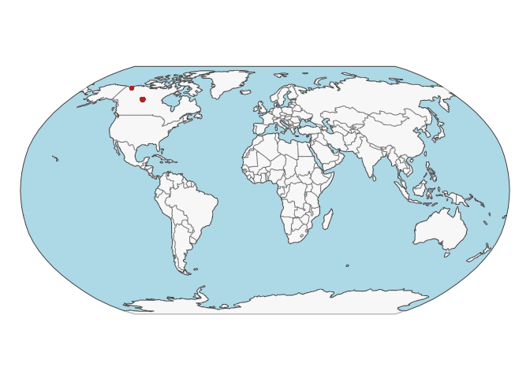
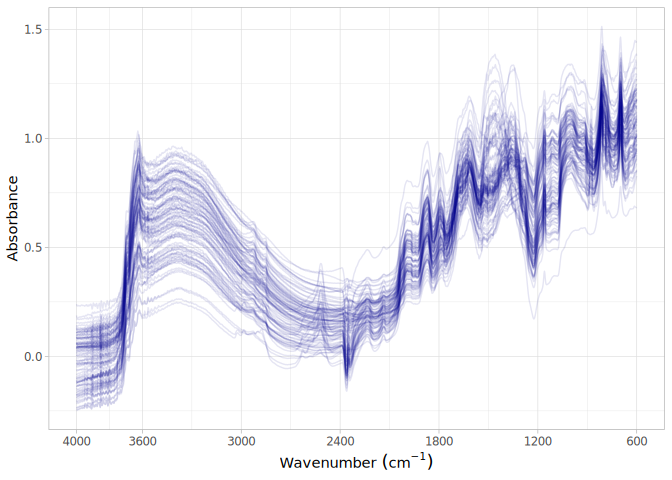

# High-Latitude Forest soils of North Canada (HLF_CAN)
Jose L. Safanelli, Ran Zhi, Tomislav Hengl, Jonathan Sanderman

- [Original data](#original-data)
- [Data standardization to the OSSL
  format](#data-standardization-to-the-ossl-format)
  - [Site information](#site-information)
  - [Soil lab information (reference analytical
    data)](#soil-lab-information-reference-analytical-data)
  - [Mid-infrared spectra](#mid-infrared-spectra)
- [Quality control](#quality-control)
- [References](#references)

Code repository for standardizing and importing spectra from
High-Latitude Forest soils of North Canada.

Website: [Soil Spectroscopy for Global
Good](https://soilspectroscopy.org)  
Development: <https://github.com/soilspectroscopy>  
Last update: 2026-05-01  
Additional documentation:

## Original data

Site, Soil, and Mid-Infrared Spectra compiled and analyzed by Schiedung,
Bellè, Malhotra, & Abiven ([2022](#ref-Schiedung2022)), with a public
version available on [Zenodo](https://doi.org/10.5281/zenodo.6024831).

Input datasets:  
- `ID_DRIFT_all.xlsx`: excel file with site information;  
- `ID_DRIFT_all.xlsx`: csv file with soil information;  
- `Schiedung_opusimport.xlsx`: MIR spectral scans;

Input files: - `cssl_metadata_all.csv`: csv file with site
information; - `ssl_refdata_all.csv`: csv file with soil information; -
`cssl_spectra.csv`: csv with MIR spectral scans;

Directory/folder path with original files (not uploaded to GitHub).

``` r
# dir = "./"
dir = "~/mnt-ossl-private/database/datasets/HLF_CAN"
tic()
```

## Data standardization to the OSSL format

### Site information

``` r
# Reading site information
schiedung.info <- read_xlsx(path(dir, "/ID_DRIFT_all.xlsx"), sheet = 1)

# Formatting to OSSL standard
schiedung.sitedata <- schiedung.info %>%
  mutate(id.layer_local_c = paste0(EUP, ".", sample_point, "_", increment), .before = 1) %>%
  mutate(id.layer_local_c = as.character(id.layer_local_c)) %>%
  rename(longitude.point_wgs84_dd = Latitute_DD, latitude.point_wgs84_dd = Longitute_DD) %>%
  mutate(id.dataset.site_ascii_txt = paste(EUP, sample_point, sep = ".")) %>%
  separate(increment, into = c("layer.upper.depth_usda_cm",
                               "layer.lower.depth_usda_cm"), sep = "-") %>%
  mutate(layer.upper.depth_usda_cm = as.numeric(layer.upper.depth_usda_cm),
         layer.lower.depth_usda_cm = as.numeric(layer.lower.depth_usda_cm)) %>%
  select(id.layer_local_c, longitude.point_wgs84_dd,
         latitude.point_wgs84_dd, id.dataset.site_ascii_txt,
         layer.upper.depth_usda_cm, layer.lower.depth_usda_cm) %>%
  # dplyr::mutate(id.project_ascii_txt = "High-latitude forest soil data",
  #               observation.ogc.schema.title_ogc_txt = 'Open Soil Spectroscopy Library',
  #               observation.ogc.schema_idn_url = 'https://soilspectroscopy.github.io',
  #               observation.date.begin_iso.8601_yyyy.mm.dd = "2019-07-01",
  #               observation.date.end_iso.8601_yyyy.mm.dd = "2019-08-31",
  #               pedon.taxa_usda_txt = "",
  #               layer.texture_usda_txt = "",
  #               horizon.designation_usda_txt = "",
  #               longitude.county_wgs84_dd = NA,
  #               latitude.county_wgs84_dd = NA,
  #               location.country_iso.3166_txt = "CAN",
  #               location.point.error_any_m = 30,
  #               surveyor.title_utf8_txt = "Marcus Schiedung",
  #               surveyor.contact_ietf_email = "marcus.schiedung@geo.uzh.ch",
  #               surveyor.address_utf8_txt = 'University of Zurich, Winterthurerstrasse 190, 8057 Zurich, Switzerland',
  #               dataset.title_utf8_txt = 'Schiedung et al. (2022)',
  #               dataset.owner_utf8_txt = 'Schiedung et al. (2022)',
  #               dataset.code_ascii_txt = 'SCHIEDUNG.SSL',
  #               dataset.address_idn_url = 'https://zenodo.org/record/6024831',
  #               dataset.license.title_ascii_txt = 'CC-BY',
  #               dataset.license.address_idn_url = 'https://creativecommons.org/licenses/by/4.0/legalcode',
  #               dataset.doi_idf_url = 'https://doi.org/10.5281/zenodo.6024831',
  #               dataset.contact.name_utf8_txt = "Marcus Schiedung",
  #               dataset.contact_ietf_email = "marcus.schiedung@geo.uzh.ch") %>%
  mutate(dataset.code_ascii_txt = 'HLF_CAN',
         id.layer_uuid_txt = openssl::md5(paste0(dataset.code_ascii_txt, id.layer_local_c)),
         .before = 1) %>%
  mutate_at(vars(starts_with("id.")), as.character)

# Saving version to dataset root dir
site.exp.file = path(dir, "ossl_soilsite_v1.3")
readr::write_csv(schiedung.sitedata, str_c(site.exp.file, ".csv.gz"))
nanoparquet::write_parquet(schiedung.sitedata, str_c(site.exp.file, ".parquet"))
```

Plotting map:

``` r
data("World")

ocean <- ne_download(scale = 110, type = "ocean", category = "physical", returnclass = "sf")
```

    Reading 'ne_110m_ocean.zip' from naturalearth...

``` r
points <- schiedung.sitedata %>%
  filter(!is.na(longitude.point_wgs84_dd),
         !is.na(latitude.point_wgs84_dd)) %>%
  st_as_sf(coords = c('longitude.point_wgs84_dd', 'latitude.point_wgs84_dd'), crs = 4326)

tmap_mode("plot")
```

    ℹ tmap modes "plot" - "view"
    ℹ toggle with `tmap::ttm()`

``` r
tm_shape(ocean) +
  tm_polygons(fill = "lightblue", col = NA) +
  tm_shape(World) +
  tm_polygons(fill = "#f0f0f0", fill_alpha = 0.5, col_alpha = 0.5) +
  tm_shape(points) +
  tm_dots(fill = "firebrick") +
  tm_crs("ESRI:54030") +
  tm_layout(frame = FALSE)
```

    [tip] Consider a suitable map projection, e.g. by adding `+ tm_crs("auto")`.
    This message is displayed once per session.



### Soil lab information (reference analytical data)

NOTE: The code chunk below must be run just once for getting a template
for scripted column standardization. Just run once for getting the
original names of soil properties, descriptions, data types, and units.
Then upload to Google Sheet for editing and manually defining the rules
for integrating with the OSSL. Requires Google authentication. A copy of
the output file is saved to this folder for archiving purposes.

**Always leave the sheet name as TEMP to avoid overwritting, then rename
online to download locally.**

``` r
# Checking shared files
# list.files(dir)

# Checking column description
schiedung.desc <- read_xlsx(paste0(dir, "/Var_names_ID_DRIFT_all.xlsx"), sheet = 1)

soillab.names <- schiedung.desc %>%
  dplyr::rename(original_name = Variable, original_description = Description) %>%
  dplyr::mutate(import = '', ossl_name = '', .after = original_name) %>%
  dplyr::mutate(comment = '')

readr::write_csv(soillab.names, paste0(getwd(), "/schiedung_soillab_names.csv"))

# Uploading to google sheet

# FACT CIN folder. Get ID for soildata importing table
googledrive::drive_ls(as_id("0AHDIWmLAj40_Uk9PVA"))

OSSL.soildata.importing <- "19LeILz9AEnKVK7GK0ZbK3CCr2RfeP-gSWn5VpY8ETVM"

# Checking metadata
googlesheets4::as_sheets_id(OSSL.soildata.importing)

# Checking readme
googlesheets4::read_sheet(OSSL.soildata.importing, sheet = 'readme')

# Preparing soillab.names
upload <- dplyr::as_tibble(soillab.names)

# Uploading
googlesheets4::write_sheet(upload, ss = OSSL.soildata.importing, sheet = "TEMP")

# Checking metadata
googlesheets4::as_sheets_id(OSSL.soildata.importing)
```

NOTE: The code chunk below must be run just once. Run for getting the
column standardization rules after editing online on Google Sheets. A
copy of the edited standardization template is saved to this dataset
folder.

``` r
# Downloading from google sheet

# Checking metadata
googlesheets4::as_sheets_id("1mWTDJDuMp4oObcCxAy9gofSkrkcSWWf1TtEW2SuC1es")

# Preparing soillab.names
transvalues <- googlesheets4::read_sheet("1mWTDJDuMp4oObcCxAy9gofSkrkcSWWf1TtEW2SuC1es",
                                         sheet = "HLF_CAN")

# Saving to folder
write_csv(transvalues, path(getwd(), "soillab_standardized_names.csv"))
```

Reading standardization rules:

``` r
transvalues <- read_csv(path(getwd(), "soillab_standardized_names.csv"),
                        show_col_types = F) %>%
  filter(import == TRUE) %>%
  select(contains(c("table", "id", "original_name", "ossl_")))

knitr::kable(transvalues)
```

| original_name | ossl_abbrev | ossl_method | ossl_unit | ossl_convert | ossl_name |
|:---|:---|:---|:---|:---|:---|
| BD_fine | bd | iso.11272 | g.cm3 | ifelse(as.numeric(x) \< 0, NA, as.numeric(x)\*1) | bd_iso.11272_g.cm3 |
| TN | n.tot | iso.13878 | w.pct | ifelse(as.numeric(x) \< 0, NA, as.numeric(x)\*1) | n.tot_iso.13878_w.pct |
| TC | c.tot | iso.10694 | w.pct | ifelse(as.numeric(x) \< 0, NA, as.numeric(x)\*1) | c.tot_iso.10694_w.pct |
| SOC | oc | iso.10694 | w.pct | ifelse(as.numeric(x) \< 0, NA, as.numeric(x)\*1) | oc_iso.10694_w.pct |
| pH_CaCl2_site | ph.cacl2 | iso.10390 | index | ifelse(as.numeric(x) \< 0, NA, as.numeric(x)\*1) | ph.cacl2_iso.10390_index |
| EC_CaCl2_site | ec | iso.11265 | ds.m | ifelse(as.numeric(x) \< 0, NA, as.numeric(x)\*1) | ec_iso.11265_ds.m |
| clay_site | clay.tot | iso.11277 | w.pct | ifelse(as.numeric(x) \< 0, NA, as.numeric(x)\*1) | clay.tot_iso.11277_w.pct |
| silt_site | silt.tot | iso.11277 | w.pct | ifelse(as.numeric(x) \< 0, NA, as.numeric(x)\*1) | silt.tot_iso.11277_w.pct |
| sand_site | sand.tot | iso.11277 | w.pct | ifelse(as.numeric(x) \< 0, NA, as.numeric(x)\*1) | sand.tot_iso.11277_w.pct |

Standardizing soil data to the OSSL format:

``` r
# Reading soil information
schiedung.info <- read_xlsx(paste0(dir, "/ID_DRIFT_all.xlsx"), sheet = 1)

# Harmonization of names and units
analytes.old.names <- transvalues %>%
  pull(original_name)

analytes.new.names <- transvalues %>%
  pull(ossl_name)

# Selecting and renaming
schiedung.soildata <- schiedung.info %>%
  mutate(id.layer_local_c = paste0(EUP, ".", sample_point, "_", increment), .before = 1) %>%
  select(id.layer_local_c, all_of(analytes.old.names)) %>%
  rename_with(~analytes.new.names, all_of(analytes.old.names)) %>%
  mutate(across(-id.layer_local_c, ~as.numeric(.x))) %>%
  as.data.frame()
```

    Warning: There were 5 warnings in `mutate()`.
    The first warning was:
    ℹ In argument: `across(-id.layer_local_c, ~as.numeric(.x))`.
    Caused by warning:
    ! NAs introduced by coercion
    ℹ Run `dplyr::last_dplyr_warnings()` to see the 4 remaining warnings.

``` r
# Removing duplicates
schiedung.soildata %>%
  group_by(id.layer_local_c) %>%
  summarise(repeats = n()) %>%
  group_by(repeats) %>%
  summarise(count = n())
```

    # A tibble: 1 × 2
      repeats count
        <int> <int>
    1       1   289

``` r
# Getting the formulas
functions.list <- transvalues %>%
  mutate(ossl_name = factor(ossl_name, levels = names(schiedung.soildata))) %>%
  arrange(ossl_name) %>%
  pull(ossl_convert) %>%
  c("x", "x", "x", .)

# Applying transformation rules
schiedung.soildata.trans <- transform_values(df = schiedung.soildata,
                                             out.name = names(schiedung.soildata),
                                             in.name = names(schiedung.soildata),
                                             fun.lst = functions.list)

# Final soillab data
schiedung.soildata <- schiedung.soildata.trans %>%
  mutate_at(vars(starts_with("id.")), as.character)

# Checking total number of observations
schiedung.soildata %>%
  distinct(id.layer_local_c) %>%
  summarise(count = n())
```

      count
    1   289

``` r
# Saving version to dataset root dir
soillab.exp.file = path(dir, "ossl_soillab_v1.3")
readr::write_csv(schiedung.soildata, str_c(soillab.exp.file, ".csv.gz"))
nanoparquet::write_parquet(schiedung.soildata, str_c(soillab.exp.file, ".parquet"))
```

Soil lab data summary.

``` r
schiedung.soildata %>%
  mutate(id.layer_local_c = factor(id.layer_local_c)) %>%
  skimr::skim() %>%
  dplyr::select(-numeric.hist, -complete_rate)
```

|                                                  |            |
|:-------------------------------------------------|:-----------|
| Name                                             | Piped data |
| Number of rows                                   | 289        |
| Number of columns                                | 10         |
| \_\_\_\_\_\_\_\_\_\_\_\_\_\_\_\_\_\_\_\_\_\_\_   |            |
| Column type frequency:                           |            |
| factor                                           | 1          |
| numeric                                          | 9          |
| \_\_\_\_\_\_\_\_\_\_\_\_\_\_\_\_\_\_\_\_\_\_\_\_ |            |
| Group variables                                  | None       |

Data summary

**Variable type: factor**

| skim_variable    | n_missing | ordered | n_unique | top_counts                     |
|:-----------------|----------:|:--------|---------:|:-------------------------------|
| id.layer_local_c |         0 | FALSE   |      289 | 1.1: 1, 1.1: 1, 1.1: 1, 1.1: 1 |

**Variable type: numeric**

| skim_variable            | n_missing |  mean |    sd |    p0 |   p25 |   p50 |   p75 |  p100 |
|:-------------------------|----------:|------:|------:|------:|------:|------:|------:|------:|
| bd_iso.11272_g.cm3       |         0 |  1.27 |  0.25 |  0.38 |  1.17 |  1.33 |  1.44 |  1.72 |
| n.tot_iso.13878_w.pct    |        23 |  0.10 |  0.09 |  0.02 |  0.04 |  0.07 |  0.14 |  0.68 |
| c.tot_iso.10694_w.pct    |         0 |  1.79 |  1.97 |  0.00 |  0.53 |  1.24 |  2.38 | 15.68 |
| oc_iso.10694_w.pct       |         0 |  1.56 |  1.87 |  0.07 |  0.31 |  0.90 |  2.13 | 11.84 |
| ph.cacl2_iso.10390_index |        13 |  5.24 |  0.91 |  3.65 |  4.53 |  5.18 |  5.87 |  7.07 |
| ec_iso.11265_ds.m        |        13 |  2.32 |  0.03 |  2.25 |  2.31 |  2.32 |  2.34 |  2.41 |
| clay.tot_iso.11277_w.pct |        13 | 14.18 | 11.32 |  2.00 |  5.00 |  8.00 | 25.00 | 40.00 |
| silt.tot_iso.11277_w.pct |        13 | 30.47 | 18.68 |  3.00 | 15.00 | 28.00 | 50.00 | 66.00 |
| sand.tot_iso.11277_w.pct |        13 | 54.16 | 29.64 | 12.00 | 23.75 | 65.00 | 81.00 | 95.00 |

### Mid-infrared spectra

Samples have different spectral range, therefore two spectral sets were
formatted and binded together.

``` r
# excel_sheets(paste0(dir, "/Schiedung_opusimport.xlsx"))

# First dataset
schiedung.spec1 <- read_xlsx(paste0(dir, "/Schiedung_opusimport.xlsx"), sheet = 1)
# schiedung.spec1 %>% pull(ID) # ID is the merge of EUP, sample_point, and increment

# Removing filename column
schiedung.spec1 <- schiedung.spec1 %>%
  select(-filename) %>%
  rename(id.layer_local_c = ID)

# Need to resample spectra
old.wavenumber <- na.omit(as.numeric(names(schiedung.spec1)))
```

    Warning in na.omit(as.numeric(names(schiedung.spec1))): NAs introduced by
    coercion

``` r
new.wavenumbers <- rev(seq(600, 4000, by = 2))

schiedung.mir1 <- schiedung.spec1 %>%
  select(-id.layer_local_c) %>%
  as.matrix() %>%
  prospectr::resample(X = ., wav = old.wavenumber, new.wav = new.wavenumbers, interpol = "spline") %>%
  as_tibble() %>%
  bind_cols({schiedung.spec1 %>%
      select(id.layer_local_c)}, .) %>%
  select(id.layer_local_c, as.character(rev(new.wavenumbers)))

# Second dataset
schiedung.spec2 <- read_xlsx(paste0(dir, "/Schiedung_opusimport.xlsx"), sheet = 2)
# schiedung.spec2 %>% pull(ID) # ID is the merge of EUP, sample_point, and increment

# Removing filename column
schiedung.spec2 <- schiedung.spec2 %>%
  select(-filename) %>%
  rename(id.layer_local_c = ID)

# Need to resample spectra
old.wavenumber <- na.omit(as.numeric(names(schiedung.spec2)))
```

    Warning in na.omit(as.numeric(names(schiedung.spec2))): NAs introduced by
    coercion

``` r
new.wavenumbers <- rev(seq(600, 4000, by = 2))

schiedung.mir2 <- schiedung.spec2 %>%
  select(-id.layer_local_c) %>%
  as.matrix() %>%
  prospectr::resample(X = ., wav = old.wavenumber, new.wav = new.wavenumbers, interpol = "spline") %>%
  as_tibble() %>%
  bind_cols({schiedung.spec2 %>%
      select(id.layer_local_c)}, .) %>%
  select(id.layer_local_c, as.character(rev(new.wavenumbers)))

# Binding together and exporting
schiedung.mir <- bind_rows(schiedung.mir1, schiedung.mir2) %>%
  dplyr::mutate(id.layer_local_c = gsub("0-12", "0-15", id.layer_local_c)) %>%
  dplyr::mutate(id.layer_local_c = gsub("16-28", "15-30", id.layer_local_c)) %>%
  dplyr::mutate(id.layer_local_c = gsub("32-44", "30-45", id.layer_local_c)) %>%
  dplyr::mutate(id.layer_local_c = gsub("48-60", "45-60", id.layer_local_c))

# Gaps
scans.na.gaps <- schiedung.mir %>%
  select(-id.layer_local_c) %>%
  apply(., 1, function(x) round(100*(sum(is.na(x)))/(length(x)), 2)) %>%
  tibble(proportion_NA = .) %>%
  bind_cols({schiedung.mir %>% select(id.layer_local_c)}, .)

# Extreme negative - irreversible erratic patterns
scans.extreme.neg <- schiedung.mir %>%
  select(-id.layer_local_c) %>%
  apply(., 1, function(x) {round(100*(sum(x < -1, na.rm=TRUE))/(length(x)), 2)}) %>%
  tibble(proportion_lower0 = .) %>%
  bind_cols({schiedung.mir %>% select(id.layer_local_c)}, .)

# Extreme positive, irreversible erratic patterns
scans.extreme.pos <- schiedung.mir %>%
  select(-id.layer_local_c) %>%
  apply(., 1, function(x) {round(100*(sum(x > 5, na.rm=TRUE))/(length(x)), 2)}) %>%
  tibble(proportion_higherAbs5 = .) %>%
  bind_cols({schiedung.mir %>% select(id.layer_local_c)}, .)

# Consistency summary - problematic scans
scans.summary <- scans.na.gaps %>%
  left_join(scans.extreme.neg, by = "id.layer_local_c") %>%
  left_join(scans.extreme.pos, by = "id.layer_local_c")

scans.summary %>%
  select(-id.layer_local_c) %>%
  pivot_longer(everything(), names_to = "check", values_to = "value") %>%
  filter(value > 0) %>%
  group_by(check) %>%
  summarise(count = n())
```

    # A tibble: 0 × 2
    # ℹ 2 variables: check <chr>, count <int>

``` r
# Renaming
old.wavenumbers <- seq(600, 4000, by = 2)
new.wavenumbers <- paste0("scan_mir.", old.wavenumbers, "_abs")

schiedung.mir <- schiedung.mir %>%
  rename_with(~new.wavenumbers, as.character(old.wavenumbers)) %>%
  mutate(id.layer_local_c = as.character(id.layer_local_c))

# # Preparing metadata
# schiedung.mir.metadata <- schiedung.mir %>%
#   select(id.layer_local_c) %>%
#   mutate(id.scan_local_c = id.layer_local_c) %>%
#   mutate(scan.mir.date.begin_iso.8601_yyyy.mm.dd = ymd("2019-07-01"),
#          scan.mir.date.end_iso.8601_yyyy.mm.dd = ymd("2019-08-31"),
#          scan.mir.model.name_utf8_txt = "Bruker Tensor 27",
#          scan.mir.model.code_any_txt = "Bruker_Tensor_27",
#          scan.mir.method.optics_any_txt = "Kbr background",
#          scan.mir.method.preparation_any_txt = "Finelly ground <80 mesh",
#          scan.mir.license.title_ascii_txt = "CC-BY",
#          scan.mir.license.address_idn_url = "https://creativecommons.org/licenses/by/4.0/",
#          scan.mir.doi_idf_url = 'https://doi.org/10.5281/zenodo.6024831',
#          scan.mir.contact.name_utf8_txt = "Marcus Schiedung",
#          scan.mir.contact.email_ietf_txt = "marcus.schiedung@geo.uzh.ch")
# 
# # Final preparation
# schiedung.mir.export <- schiedung.mir.metadata %>%
#   left_join(schiedung.mir, by = "id.layer_local_c") %>%
#   mutate_at(vars(starts_with("id.")), as.character)

mir.exp.file = path(dir, "ossl_mir_v1.3")
readr::write_csv(schiedung.mir, str_c(mir.exp.file, ".csv.gz"))
nanoparquet::write_parquet(schiedung.mir, str_c(mir.exp.file, ".parquet"))
```

## Quality control

The final table must be joined as follows:

- MIR is used as first reference for pairing with soil data.
- Soil lab data are left joined to MIR. This drop data without any
  available scan.

The availability of data is summarized below:

``` r
# Taking a few representative columns for checking the consistency of joins
schiedung.availability <- schiedung.mir %>%
  select(id.layer_local_c, scan_mir.800_abs) %>%
  left_join(schiedung.soildata, by = "id.layer_local_c") %>%
  filter(!is.na(id.layer_local_c))

# Availability of information from schiedung
schiedung.availability %>%
  mutate_all(as.character) %>%
  pivot_longer(everything(), names_to = "column", values_to = "value") %>%
  filter(!is.na(value)) %>%
  group_by(column) %>%
  summarise(count = n())
```

    # A tibble: 11 × 2
       column                   count
       <chr>                    <int>
     1 bd_iso.11272_g.cm3         259
     2 c.tot_iso.10694_w.pct      259
     3 clay.tot_iso.11277_w.pct   250
     4 ec_iso.11265_ds.m          250
     5 id.layer_local_c           271
     6 n.tot_iso.13878_w.pct      239
     7 oc_iso.10694_w.pct         259
     8 ph.cacl2_iso.10390_index   250
     9 sand.tot_iso.11277_w.pct   250
    10 scan_mir.800_abs           271
    11 silt.tot_iso.11277_w.pct   250

``` r
# Repeats check - Duplicates are dropped
schiedung.availability %>%
  mutate_all(as.character) %>%
  select(id.layer_local_c) %>%
  pivot_longer(everything(), names_to = "column", values_to = "value") %>%
  group_by(column, value) %>%
  summarise(repeats = n()) %>%
  group_by(column, repeats) %>%
  summarise(count = n())
```

    `summarise()` has grouped output by 'column'. You can override using the
    `.groups` argument.
    `summarise()` has grouped output by 'column'. You can override using the
    `.groups` argument.

    # A tibble: 1 × 3
    # Groups:   column [1]
      column           repeats count
      <chr>              <int> <int>
    1 id.layer_local_c       1   271

MIR spectral visualization (100 random spectra):

``` r
set.seed(42)
schiedung.mir %>%
  sample_n(100) %>%
  select(all_of(c("id.layer_local_c")), starts_with("scan_mir.")) %>%
  tidyr::pivot_longer(-all_of(c("id.layer_local_c")),
                      names_to = "wavenumber", values_to = "absorbance") %>%
  dplyr::mutate(wavenumber = gsub("scan_mir.|_abs", "", wavenumber)) %>%
  dplyr::mutate(wavenumber = as.numeric(wavenumber)) %>%
  ggplot(aes(x = wavenumber, y = absorbance, group = id.layer_local_c)) +
  geom_line(alpha = 0.1, color = "darkblue") +
  scale_x_continuous(breaks = c(600, 1200, 1800, 2400, 3000, 3600, 4000),
                     transform = "reverse") +
  labs(x = bquote("Wavenumber"~(cm^-1)), y = "Absorbance") +
  theme_light()
```



``` r
toc()
```

    12.157 sec elapsed

``` r
rm(list = ls())
gc()
```

               used  (Mb) gc trigger  (Mb) max used  (Mb)
    Ncells  6436077 343.8   11094752 592.6  8836653 472.0
    Vcells 11271410  86.0   25983906 198.3 25804640 196.9

## References

<div id="refs" class="references csl-bib-body hanging-indent"
entry-spacing="0" line-spacing="2">

<div id="ref-Schiedung2022" class="csl-entry">

Schiedung, M., Bellè, S.-L., Malhotra, A., & Abiven, S. (2022). Organic
carbon stocks, quality and prediction in permafrost-affected forest
soils in north canada. *CATENA*, *213*, 106194.
doi:[10.1016/j.catena.2022.106194](https://doi.org/10.1016/j.catena.2022.106194)

</div>

</div>
