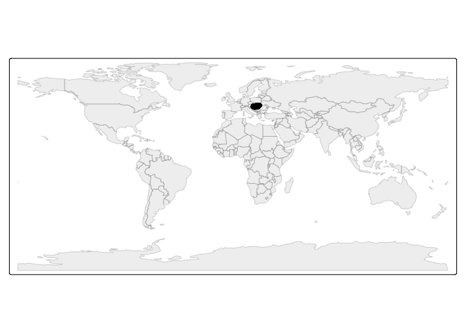
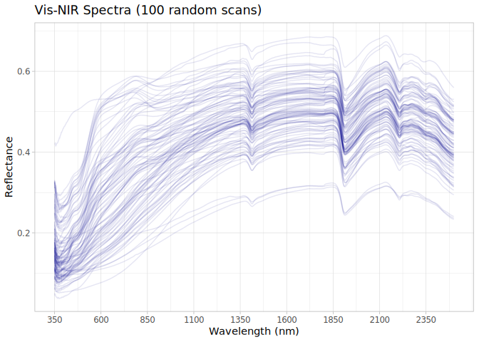

# Hungarian dataset preparation for the OSSL
Ran Zhi, Jose L. Safanelli, Jonathan Sanderman

- [Original data](#original-data)
- [Data standardization to the OSSL
  format](#data-standardization-to-the-ossl-format)
  - [Site information](#site-information)
  - [Soil lab information (reference analytical
    data)](#soil-lab-information-reference-analytical-data)
  - [Vis-NIR spectra](#vis-nir-spectra)
  - [Quality control for Vis-NIR](#quality-control-for-vis-nir)
- [References](#references)

Code repository for preparing and importing the Hungarian Soil
Degradation Observation System (HSDOS) dataset into the Open Soil
Spectral Library.

Website: [Soil Spectroscopy for Global
Good](https://soilspectroscopy.org)  
Development: <https://github.com/soilspectroscopy>  
Last update: 2026-05-01  
Additional documentation:

## Original data

Site data, Soil lab data, and Visible Near-Infrared (Vis-NIR) data from
the Hungarian Soil Degradation Observation System (HSDOS). Further
information of the dataset can be at Mészáros et al.
([2025](#ref-meszaros_vis-nir_2025)).

Original files:  
- `HSDOS_SSL_ver1.1.csv`: csv file with site information, soil
information, and Vis-NIR spectral data.

Directory/folder path with original files (not uploaded to GitHub).

``` r
# dir = "/Users/rzhi/Projects/git/ossl-imports-internal/dataset/Hungarian"
dir = "~/mnt-ossl-private/database/datasets/HSDOS"
tic()
```

## Data standardization to the OSSL format

### Site information

``` r
hsdos.metadata <- fread(path(dir, "HSDOS_SSL_ver1.1.csv"), header = T)

hsdos.sitedata <- hsdos.metadata %>%
  select(SAMPLE_TDR_ID, SAMPLING_DATE, LON_WGS84, LAT_WGS84, PROFILE_LEVEL) %>%
  rename(id.layer_local_c = SAMPLE_TDR_ID,
         longitude.point_wgs84_dd = LON_WGS84,
         latitude.point_wgs84_dd = LAT_WGS84,
         observation.date_src_yyy.mm.dd = SAMPLING_DATE) %>%
  mutate(layer.upper.depth_usda_cm = case_when(PROFILE_LEVEL == 1 ~ 0,
                                               PROFILE_LEVEL == 2 ~ 30,
                                               PROFILE_LEVEL == 3 ~ 60,
                                               TRUE ~ NA_real_),
         layer.lower.depth_usda_cm = case_when(PROFILE_LEVEL == 1 ~ 30,
                                               PROFILE_LEVEL == 2 ~ 60,
                                               PROFILE_LEVEL == 3 ~ 90,
                                               TRUE ~ NA_real_),
         layer.sequence_usda_uint16 = as.integer(PROFILE_LEVEL)) %>%
  # mutate(id.project_ascii_txt = "Hungarian Soil Degradation Observation System",
  #        dataset.code_ascii_txt = "HSDOS.SSL",
  #        observation.ogc.schema.title_ogc_txt = "Open Soil Spectroscopy Library",
  #        observation.ogc.schema_idn_url = "https://soilspectroscopy.github.io",
  #        dataset.title_utf8_txt = "HSDOS: Hungarian Soil Degradation Observation System Dataset",
  #        dataset.owner_utf8_txt = "Open access funding provided by HUN-REN Centre for Agricultural Research",
  #        dataset.doi_idf_url = "https://zenodo.org/records/13955229",
  #        dataset.license.title_ascii_txt = "CC-BY",
  #        dataset.license.address_idn_url = "https://creativecommons.org/licenses/by/4.0/legalcode",
  #        dataset.contact.name_utf8_txt = "János Mészáros",
  #        dataset.contact_ietf_email = "koos.sandor@atk.hun-ren.hu") %>%
  mutate(dataset.code_ascii_txt = "HSDOS",
         id.layer_uuid_txt = openssl::md5(paste0(dataset.code_ascii_txt, id.layer_local_c)),
         .before = 1) %>%
  mutate_at(vars(starts_with("id.")), as.character)

# Saving version to dataset root dir
site.exp.file = path(dir, "ossl_soilsite_v1.3")
readr::write_csv(hsdos.sitedata, str_c(site.exp.file, ".csv.gz"))
nanoparquet::write_parquet(hsdos.sitedata, str_c(site.exp.file, ".parquet"))
```

Plotting map:

``` r
data("World")

ocean <- ne_download(scale = 110, type = "ocean", category = "physical", returnclass = "sf")
```

    Reading 'ne_110m_ocean.zip' from naturalearth...

``` r
points <- hsdos.sitedata %>%
  filter(!is.na(longitude.point_wgs84_dd),
         !is.na(latitude.point_wgs84_dd)) %>%
  st_as_sf(coords = c('longitude.point_wgs84_dd', 'latitude.point_wgs84_dd'), crs = 4326)

tmap_mode("plot")
```

    ℹ tmap modes "plot" - "view"
    ℹ toggle with `tmap::ttm()`

``` r
tm_shape(ocean) +
  tm_polygons(fill = "lightblue", col = NA) +
  tm_shape(World) +
  tm_polygons(fill = "#f0f0f0", fill_alpha = 0.5, col_alpha = 0.5) +
  tm_shape(points) +
  tm_dots(size = 0.10, fill = "firebrick") +
  tm_crs("ESRI:54030") +
  tm_layout(frame = FALSE)
```

    [tip] Consider a suitable map projection, e.g. by adding `+ tm_crs("auto")`.
    This message is displayed once per session.



### Soil lab information (reference analytical data)

NOTE: The code chunk below must be run just once for getting a template
for scripted column standardization. Just run once for getting the
original names of soil properties, descriptions, data types, and units.
Then upload to Google Sheet for editing and defining the rules for
integrating with the OSSL. Requires Google authentication. A copy of the
output file is saved to this folder for archiving purposes.

**Always leave the sheet name as TEMP to avoid overwriting, then rename
online to download locally.**

``` r
# Getting soillab original variables

soillab.names <- hsdos.metadata %>%
  select(SAMPLE_TDR_ID, pH_KCl, SOM, CaCO3, TSC, TN, P2O5_AL, K2O_AL, PLI) %>%
  rename(id.layer_local_c = SAMPLE_TDR_ID) %>%
  names() %>%
  tibble(original_name = .) %>%
  dplyr::mutate(table = 'HSDOS_SSL_ver1.1.csv', .before = 1) %>%
  dplyr::mutate(import = '', comment = '', ossl_abbrev = '', ossl_method = '', ossl_unit = '',
                ossl_convert = '', ossl_name = '', .after = original_name)

readr::write_csv(soillab.names, path(getwd(), "soillab_original_names.csv"))

# Uploading to google sheet

# Drive 'Open Soil Spectral Library'
# Folder 'Database v2'
googledrive::drive_ls(as_id("1l9VM4fFks2xBloDE69EFTfPgQeFx5aGw"))

# Use the ID of the file 'OSSL_v2_tab2_soildata_importing'
OSSL.soildata.importing <- "1mWTDJDuMp4oObcCxAy9gofSkrkcSWWf1TtEW2SuC1es"

# Checking metadata
googlesheets4::as_sheets_id(OSSL.soildata.importing)

# Checking readme
googlesheets4::read_sheet(OSSL.soildata.importing, sheet = 'readme')

# Preparing soillab.names for this dataset
upload <- dplyr::as_tibble(soillab.names)

# Uploading with TEMP name. Check online, move to sequence, and update name
googlesheets4::write_sheet(upload, ss = OSSL.soildata.importing, sheet = "TEMP")

# Checking metadata
googlesheets4::as_sheets_id(OSSL.soildata.importing)
```

NOTE: The code chunk below must be run just once. Run for getting the
column standardization rules after editing online on Google Sheets. A
copy of the edited standardization template is saved to this dataset
folder.

``` r
# Downloading from google sheet

# Checking metadata
googlesheets4::as_sheets_id("1mWTDJDuMp4oObcCxAy9gofSkrkcSWWf1TtEW2SuC1es")

# Preparing soillab.names
transvalues <- googlesheets4::read_sheet("1mWTDJDuMp4oObcCxAy9gofSkrkcSWWf1TtEW2SuC1es",
                                         sheet = "HSDOS")

# Saving to folder
write_csv(transvalues, path(getwd(), "soillab_standardized_names.csv"))
```

Reading standardization rules:

``` r
transvalues <- read_csv(path(getwd(), "soillab_standardized_names.csv"),
                        show_col_types = F) %>%
  filter(import == TRUE) %>%
  select(contains(c("table", "id", "original_name", "original_unit" , "ossl_")))

knitr::kable(transvalues)
```

| table | original_name | original_unit | ossl_abbrev | ossl_method | ossl_unit | ossl_convert | ossl_name |
|:---|:---|:---|:---|:---|:---|:---|:---|
| HSDOS_SSL_ver1.1.csv | pH_KCl | NA | ph_kcl | iso.10390 | index | ifelse(as.numeric(x) \< 0, NA, as.numeric(x)\*1) | ph_kcl_iso.10390_index |
| HSDOS_SSL_ver1.1.csv | SOM | % | oc | wb1934 | w.pct | ifelse(as.numeric(x) \< 0, NA, as.numeric(x) \* 1) | oc_wb1934_w.pct |
| HSDOS_SSL_ver1.1.csv | CaCO3 | % | caco3 | iso.10693 | w.pct | ifelse(as.numeric(x) \< 0, NA, as.numeric(x) \* 1) | caco3_iso.10693_w.pct |
| HSDOS_SSL_ver1.1.csv | TSC | w/w % | ec | iso.11265 | ds.m | ifelse(as.numeric(x) \< 0, NA, as.numeric(x) \* 25) | ec_iso.11265_ds.m |
| HSDOS_SSL_ver1.1.csv | TN | mg/kg | n.tot | iso.11261 | w.pct | ifelse(as.numeric(x) \< 0, NA, as.numeric(x) / 10000) | n.tot_iso.11261_w.pct |
| HSDOS_SSL_ver1.1.csv | P2O5_AL | mg/kg | p.ext | msz.20135 | mg.kg | ifelse(as.numeric(x) \< 0, NA, as.numeric(x)\*1) | p.ext_msz.20135_mg.kg |
| HSDOS_SSL_ver1.1.csv | K2O_AL | mg/kg | k.ext | msz.20135 | mg.kg | ifelse(as.numeric(x) \< 0, NA, as.numeric(x)\*1) | k.ext_msz.20135_mg.kg |

Standardizing soil data to the OSSL format:

``` r
hsdos.reference <- hsdos.metadata

# Standardization of names and units
valid_mappings <- transvalues %>%
  filter(table == "HSDOS_SSL_ver1.1.csv") %>%
  filter(!is.na(ossl_name) & ossl_name != "") 

analytes.old.names <- valid_mappings %>% pull(original_name)
analytes.new.names <- valid_mappings %>% pull(ossl_name)

analytes.old.names.clean <- analytes.old.names[analytes.old.names != "SAMPLE_TDR_ID"]
analytes.new.names.clean <- analytes.new.names[analytes.old.names != "SAMPLE_TDR_ID"]

hsdos.soildata <- hsdos.reference %>%
  rename(id.layer_local_c = SAMPLE_TDR_ID) %>%
  select(id.layer_local_c, all_of(analytes.old.names.clean)) %>%
  rename_with(~analytes.new.names.clean, all_of(analytes.old.names.clean)) %>%
  mutate(id.layer_local_c = as.character(id.layer_local_c)) %>%
  as.data.frame()

# Getting the formulas
functions.list <- transvalues %>%
  filter(table == "HSDOS_SSL_ver1.1.csv") %>%
  mutate(ossl_name = factor(ossl_name, levels = names(hsdos.soildata))) %>%
  arrange(ossl_name) %>%
  pull(ossl_convert) %>%
  c("x", .)

# Applying transformation rules
hsdos.soildata.trans <- transform_values(df = hsdos.soildata,
                                         out.name = names(hsdos.soildata),
                                         in.name = names(hsdos.soildata),
                                         fun.lst = functions.list)

# Final soillab data
hsdos.soildata <- hsdos.soildata.trans %>%
  mutate_at(vars(starts_with("id.")), as.character)

# Checking total number of observations
hsdos.soildata %>%
  distinct(id.layer_local_c) %>%
  summarise(count = n())
```

      count
    1  5490

``` r
# Saving version to dataset root dir
soillab.exp.file = path(dir, "ossl_soillab_v1.3")
readr::write_csv(hsdos.soildata, str_c(soillab.exp.file, ".csv.gz"))
nanoparquet::write_parquet(hsdos.soildata, str_c(soillab.exp.file, ".parquet"))
```

Soil lab data summary.

``` r
hsdos.soildata %>%
  mutate(id.layer_local_c = factor(id.layer_local_c)) %>%
  skimr::skim() %>%
  dplyr::select(-numeric.hist, -complete_rate)
```

|                                                  |            |
|:-------------------------------------------------|:-----------|
| Name                                             | Piped data |
| Number of rows                                   | 5490       |
| Number of columns                                | 8          |
| \_\_\_\_\_\_\_\_\_\_\_\_\_\_\_\_\_\_\_\_\_\_\_   |            |
| Column type frequency:                           |            |
| factor                                           | 1          |
| numeric                                          | 7          |
| \_\_\_\_\_\_\_\_\_\_\_\_\_\_\_\_\_\_\_\_\_\_\_\_ |            |
| Group variables                                  | None       |

Data summary

**Variable type: factor**

| skim_variable    | n_missing | ordered | n_unique | top_counts                     |
|:-----------------|----------:|:--------|---------:|:-------------------------------|
| id.layer_local_c |         0 | FALSE   |     5490 | 020: 1, 020: 1, 020: 1, 020: 1 |

**Variable type: numeric**

| skim_variable          | n_missing |   mean |     sd |   p0 |    p25 |    p50 |    p75 |    p100 |
|:-----------------------|----------:|-------:|-------:|-----:|-------:|-------:|-------:|--------:|
| ph_kcl_iso.10390_index |         0 |   7.36 |   0.85 | 4.18 |   6.84 |   7.62 |   7.94 |    9.93 |
| oc_wb1934_w.pct        |         0 |   1.63 |   0.99 | 0.10 |   0.84 |   1.46 |   2.21 |    8.00 |
| caco3_iso.10693_w.pct  |         0 |   7.81 |  10.16 | 0.00 |   0.00 |   3.60 |  13.00 |   90.00 |
| ec_iso.11265_ds.m      |         0 |   0.99 |   0.93 | 0.50 |   0.50 |   0.50 |   1.25 |   12.75 |
| n.tot_iso.11261_w.pct  |         0 |   0.00 |   0.00 | 0.00 |   0.00 |   0.00 |   0.00 |    0.05 |
| p.ext_msz.20135_mg.kg  |         0 | 162.69 | 297.26 | 1.50 |  38.90 |  83.70 | 176.00 | 7900.00 |
| k.ext_msz.20135_mg.kg  |         0 | 197.12 | 160.74 | 5.10 | 103.00 | 158.00 | 242.00 | 3320.00 |

### Vis-NIR spectra

Spectra is in reflectance, 1 nm interval, but we retain spectra at 2 nm
interval. Need splice correction at 1800 nm, but it does not work
(probably because the spectra was smoothed).

``` r
# Renaming and ID Preparation
hsdos.visnir.proc <- hsdos.metadata %>%
  as_tibble() %>%
  rename(id.layer_local_c = SAMPLE_TDR_ID) %>%
  mutate(id.layer_local_c = as.character(id.layer_local_c))

# Extracting wavelengths from column names (e.g., "SPC.350" -> 350)
spec.cols <- grep("^SPC\\.", names(hsdos.visnir.proc), value = TRUE)
old.wavelengths <- gsub("SPC\\.", "", spec.cols)
new.wavelengths <- seq(350, 2500, by = 2)

# Resampling spectra
hsdos.visnir.proc <- hsdos.visnir.proc %>%
  select(id.layer_local_c, all_of(spec.cols))

hsdos.visnir.proc <- hsdos.visnir.proc %>%
  rename_with(~old.wavelengths, all_of(spec.cols))
  
hsdos.visnir.proc <- hsdos.visnir.proc %>%
  select(id.layer_local_c, all_of(as.character(new.wavelengths)))

# Splice correction
# hsdos.visnir.proc <- hsdos.visnir.proc %>%
#   select(-id.layer_local_c) %>%
#   as.matrix() %>%
#   spliceCorrection(wav = as.numeric(new.wavelengths),
#                    splice = c(1800), interpol.bands = 10) %>%
#   as_tibble() %>%
#   bind_cols({hsdos.visnir.proc %>%
#       select(id.layer_local_c)}, .)

# Gaps Analysis
scans.na.gaps <- hsdos.visnir.proc %>%
  select(-id.layer_local_c) %>%
  apply(., 1, function(x) round(100*(sum(is.na(x)))/(length(x)), 2)) %>%
  tibble(proportion_NA = .) %>%
  bind_cols(hsdos.visnir.proc %>% select(id.layer_local_c), .)

# Extreme negative checks
scans.extreme.neg <- hsdos.visnir.proc %>%
  select(-id.layer_local_c) %>%
  apply(., 1, function(x) {round(100*(sum(x < 0, na.rm=TRUE))/(length(x)), 2)}) %>%
  tibble(proportion_lower0 = .) %>%
  bind_cols(hsdos.visnir.proc %>% select(id.layer_local_c), .)

# Extreme positive checks
scans.extreme.pos <- hsdos.visnir.proc %>%
  select(-id.layer_local_c) %>%
  apply(., 1, function(x) {round(100*(sum(x > 1, na.rm=TRUE))/(length(x)), 2)}) %>%
  tibble(proportion_higherRef1 = .) %>%
  bind_cols(hsdos.visnir.proc %>% select(id.layer_local_c), .)

# Consistency summary
scans.summary <- scans.na.gaps %>%
  left_join(scans.extreme.neg, by = "id.layer_local_c") %>%
  left_join(scans.extreme.pos, by = "id.layer_local_c")

# Display problematic scans count
scans.summary %>%
  select(-id.layer_local_c) %>%
  pivot_longer(everything(), names_to = "check", values_to = "value") %>%
  filter(value > 0) %>%
  group_by(check) %>%
  summarise(count = n())
```

    # A tibble: 1 × 2
      check                 count
      <chr>                 <int>
    1 proportion_higherRef1     2

``` r
# Final column renaming for OSSL standard
final.visnir.names <- paste0("scan_visnir.", new.wavelengths, "_ref")

hsdos.visnir.proc <- hsdos.visnir.proc %>%
  rename_with(~final.visnir.names, as.character(new.wavelengths))

# # Preparing metadata
# hsdos.visnir.metadata <- hsdos.visnir.proc %>%
#   select(id.layer_local_c) %>%
#   mutate(id.scan_local_c = id.layer_local_c,
#          scan.visnir.date.begin_iso.8601_yyyy = ymd("2011-01-01"), 
#          scan.visnir.date.end_iso.8601_yyyy = ymd("2011-12-31"), 
#          scan.visnir.model.name_utf8_txt = "FieldSpec 4 spectroradiometer", 
#          scan.visnir.license.title_ascii_txt = "CC-BY",
#          scan.visnir.method.optics_any_txt = "",
#          scan.visnir.method.preparation_any_txt = "Standard preparation",
#          scan.visnir.license.address_idn_url = "https://creativecommons.org/licenses/by/4.0/legalcode",
#          scan.visnir.doi_idf_url = "https://zenodo.org/records/13955229",
#          scan.visnir.contact.name_utf8_txt = "János Mészáros",
#          scan.visnir.contact.email_ietf_txt = "koos.sandor@atk.hun-ren.hu")
# 
# # Final preparation
# hsdos.visnir.export <- hsdos.visnir.metadata %>%
#   left_join(hsdos.visnir.proc, by = "id.layer_local_c") %>%
#   mutate(across(starts_with("id."), as.character))

# Saving version to dataset root dir
visnir.exp.file = path(dir, "ossl_visnir_v1.3")
readr::write_csv(hsdos.visnir.proc, str_c(visnir.exp.file, ".csv.gz"))
nanoparquet::write_parquet(hsdos.visnir.proc, str_c(visnir.exp.file, ".parquet"))
```

### Quality control for Vis-NIR

The final table must be joined as follows:

- VisNIR is used as first reference for pairing with soil data.
- Site and soil lab data are left joined to VisNIR. This drop data
  without any available scan.

The availability of data is summarized below:

``` r
# Taking a few representative columns for checking the consistency of joins
hsdos.availability <- hsdos.visnir.proc %>%
  select(id.layer_local_c, scan_visnir.800_ref) %>%
  left_join(hsdos.soildata, by = "id.layer_local_c") %>%
  filter(!is.na(id.layer_local_c))

# Availability of information summary
# This tells us how many samples have spectra vs. lab/site data
hsdos.availability %>%
  mutate(across(everything(), as.character)) %>%
  pivot_longer(everything(), names_to = "column", values_to = "value") %>%
  filter(!is.na(value)) %>%
  group_by(column) %>%
  summarise(count = n())
```

    # A tibble: 9 × 2
      column                 count
      <chr>                  <int>
    1 caco3_iso.10693_w.pct   5490
    2 ec_iso.11265_ds.m       5490
    3 id.layer_local_c        5490
    4 k.ext_msz.20135_mg.kg   5490
    5 n.tot_iso.11261_w.pct   5490
    6 oc_wb1934_w.pct         5490
    7 p.ext_msz.20135_mg.kg   5490
    8 ph_kcl_iso.10390_index  5490
    9 scan_visnir.800_ref     5490

``` r
# Repeats check - Checking for duplicate SAMPLE_TDR_IDs
hsdos.availability %>%
  mutate(across(everything(), as.character)) %>%
  select(id.layer_local_c) %>%
  pivot_longer(everything(), names_to = "column", values_to = "value") %>%
  group_by(column, value) %>%
  summarise(repeats = n(), .groups = 'drop') %>%
  group_by(column, repeats) %>%
  summarise(count = n(), .groups = 'drop')
```

    # A tibble: 1 × 3
      column           repeats count
      <chr>              <int> <int>
    1 id.layer_local_c       1  5490

Soil analytical data summary for Vis-NIR. Note: some scans may not be
linked with the wetchem.

``` r
hsdos.availability %>%
  mutate(id.layer_local_c = factor(id.layer_local_c)) %>%
  skimr::skim() %>%
  dplyr::select(-numeric.hist, -complete_rate)
```

|                                                  |            |
|:-------------------------------------------------|:-----------|
| Name                                             | Piped data |
| Number of rows                                   | 5490       |
| Number of columns                                | 9          |
| \_\_\_\_\_\_\_\_\_\_\_\_\_\_\_\_\_\_\_\_\_\_\_   |            |
| Column type frequency:                           |            |
| factor                                           | 1          |
| numeric                                          | 8          |
| \_\_\_\_\_\_\_\_\_\_\_\_\_\_\_\_\_\_\_\_\_\_\_\_ |            |
| Group variables                                  | None       |

Data summary

**Variable type: factor**

| skim_variable    | n_missing | ordered | n_unique | top_counts                     |
|:-----------------|----------:|:--------|---------:|:-------------------------------|
| id.layer_local_c |         0 | FALSE   |     5490 | 020: 1, 020: 1, 020: 1, 020: 1 |

**Variable type: numeric**

| skim_variable          | n_missing |   mean |     sd |   p0 |    p25 |    p50 |    p75 |    p100 |
|:-----------------------|----------:|-------:|-------:|-----:|-------:|-------:|-------:|--------:|
| scan_visnir.800_ref    |         0 |   0.35 |   0.11 | 0.12 |   0.26 |   0.34 |   0.44 |    0.96 |
| ph_kcl_iso.10390_index |         0 |   7.36 |   0.85 | 4.18 |   6.84 |   7.62 |   7.94 |    9.93 |
| oc_wb1934_w.pct        |         0 |   1.63 |   0.99 | 0.10 |   0.84 |   1.46 |   2.21 |    8.00 |
| caco3_iso.10693_w.pct  |         0 |   7.81 |  10.16 | 0.00 |   0.00 |   3.60 |  13.00 |   90.00 |
| ec_iso.11265_ds.m      |         0 |   0.99 |   0.93 | 0.50 |   0.50 |   0.50 |   1.25 |   12.75 |
| n.tot_iso.11261_w.pct  |         0 |   0.00 |   0.00 | 0.00 |   0.00 |   0.00 |   0.00 |    0.05 |
| p.ext_msz.20135_mg.kg  |         0 | 162.69 | 297.26 | 1.50 |  38.90 |  83.70 | 176.00 | 7900.00 |
| k.ext_msz.20135_mg.kg  |         0 | 197.12 | 160.74 | 5.10 | 103.00 | 158.00 | 242.00 | 3320.00 |

Vis-NIR spectral visualization (100 random spectra):

``` r
set.seed(42)
hsdos.visnir.proc %>%
  sample_n(100) %>%
  select(all_of(c("id.layer_local_c")), starts_with("scan_visnir.")) %>%
  tidyr::pivot_longer(-all_of(c("id.layer_local_c")),
                      names_to = "wavelength", values_to = "reflectance") %>%
  dplyr::mutate(wavelength = gsub("scan_visnir.|_ref", "", wavelength)) %>%
  dplyr::mutate(wavelength = as.numeric(wavelength)) %>%
  ggplot(aes(x = wavelength, y = reflectance, group = id.layer_local_c)) +
  geom_line(alpha = 0.1, color = "darkblue") +
  scale_x_continuous(breaks = seq(350, 2500, by = 250))+
  labs(title = "Vis-NIR Spectra (100 random scans)",
       x = "Wavelength (nm)",
       y = "Reflectance")+
  theme_light()
```



``` r
toc()
```

    21.586 sec elapsed

``` r
rm(list = ls())
gc()
```

               used  (Mb) gc trigger  (Mb) max used  (Mb)
    Ncells  6407892 342.3   11461330 612.2 10048997 536.7
    Vcells 11079262  84.6   50324061 384.0 62904878 480.0

## References

<div id="refs" class="references csl-bib-body hanging-indent"
entry-spacing="0" line-spacing="2">

<div id="ref-meszaros_vis-nir_2025" class="csl-entry">

Mészáros, J., Kovács, Z., László, P., Vass-Meyndt, S., Koós, S., Pirkó,
B., … Pásztor, L. (2025). Vis-NIR soil spectral library of the Hungarian
Soil Degradation Observation System. *Scientific Data*, *12*(1), 363.
doi:[10.1038/s41597-025-04667-9](https://doi.org/10.1038/s41597-025-04667-9)

</div>

</div>
