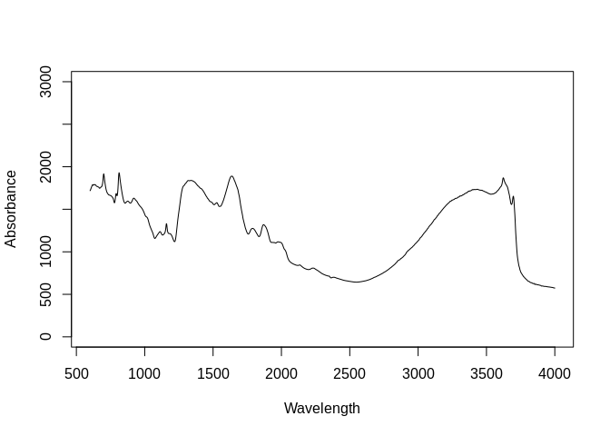
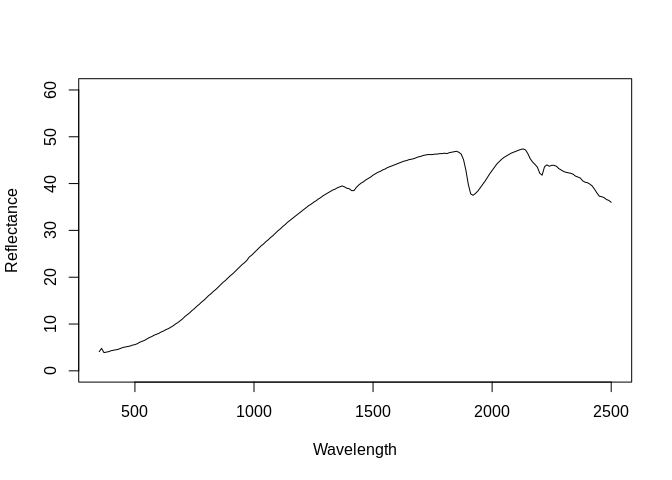
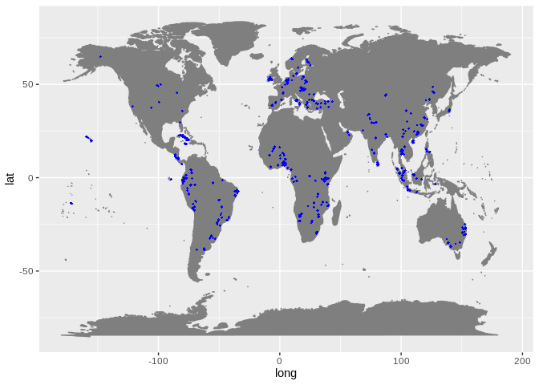

Dataset import: The ICRAF-ISRIC Soil and Spectral Library (ICRAF-ISRIC)
================
Tomislav Hengl (<tom.hengl@opengeohub.org>), Wanderson Mendes de Sousa
(<wanderson.mendes@zalf.de>) and Jonathan Sanderman
(<jsanderman@woodwellclimate.org>)
04 December, 2021


-   [ICRAF-ISRIC inputs](#icraf-isric-inputs)
-   [Data import](#data-import)
    -   [Soil site and laboratory data
        import:](#soil-site-and-laboratory-data-import)
        -   [Soil lab information](#soil-lab-information)
        -   [Soil site information](#soil-site-information)
    -   [Mid-infrared spectroscopy
        data](#mid-infrared-spectroscopy-data)
    -   [Visible and near-infrared spectroscopy
        data](#visible-and-near-infrared-spectroscopy-data)
    -   [Quality control](#quality-control)
    -   [Distribution of points](#distribution-of-points)
-   [References](#references)

[](https://soilspectroscopy.org/)

[](http://creativecommons.org/licenses/by-sa/4.0/)

This work is licensed under a [Creative Commons Attribution-ShareAlike
4.0 International
License](http://creativecommons.org/licenses/by-sa/4.0/).

## ICRAF-ISRIC inputs

Part of: <https://github.com/soilspectroscopy>  
Project: [Soil Spectroscopy for Global
Good](https://soilspectroscopy.org)  
Last update: 2021-12-04  
Dataset:
[ICRAF.ISRIC](https://soilspectroscopy.github.io/ossl-manual/soil-spectroscopy-tools-and-users.html#icraf.isric)

The ICRAF-ISRIC Soil and Spectral Library ([Garrity & Bindraban,
2004](#ref-garrity2004globally)) has samples from 58 countries worldwide
including 5 continents (Africa, Europe, South America, North America,
and Asia). The soil samples were retrieved from the Soil Information
System (ISIS), which already had the analytical data, and the spectra
were analysed in the World Agroforestry Centre’s (ICRAF). Dataset
properties and licences are explained in detail in [ISRIC’ data
portal](https://data.isric.org/geonetwork/srv/api/records/1b65024a-cd9f-11e9-a8f9-a0481ca9e724).

Input datasets:

-   `ICRAF_ISRIC_MIR_spectra.csv`: MIR soil spectral reflectances
    (&gt;3578 channels);
-   `ICRAF_ISRIC_VNIR_spectra.csv`: VNIR soil spectral reflectances
    (&gt;216 channels);
-   `ICRAF_ISRIC_reference_data.csv`: Database with site and soil
    analytes;

For the ICRAF-ISRIC dataset properties refer also to [Aitkenhead &
Black](#ref-aitkenhead2018exploring)
([2018](#ref-aitkenhead2018exploring)).

Data folder path:

``` r
dir = "/mnt/soilspec4gg/ossl/dataset/ICRAF_ISRIC/"
```

## Data import

### Soil site and laboratory data import:

``` r
icraf.df = vroom::vroom(paste(dir, "ICRAF_ISRIC_reference_data.csv", sep = ""))
```

    ## New names:
    ## * Remarks -> Remarks...41
    ## * Remarks -> Remarks...64

    ## Rows: 4,239
    ## Columns: 64
    ## Delimiter: ","
    ## chr [ 7]: Batch and labid, Country name, Plotcode, N / S, E / W, Remarks, Remarks
    ## dbl [53]: ICRAF sample codes.SAMPLENO, HORI, BTOP, BBOT, Dsed, Lat: degr, Lat: min, Lat: sec, Long: degr, Long: min, Long: sec, Sample no, pH (H2O...
    ## lgl [ 4]: pH (CaCl2), CaSO4, COLE, SSA
    ## 
    ## Use `spec()` to retrieve the guessed column specification
    ## Pass a specification to the `col_types` argument to quiet this message

``` r
## dataset ISIS: https://www.isric.org/sites/default/files/isric_report_1995_10b.pdf
```

#### Soil lab information

``` r
in.name = c("pH (H2O)", "pH (KCl)", "pH (CaCl2)", "CaCO3", "Org C", "Org N", "Ca", 
            "Mg", "Na", "K", "Exch acid", "Exch Al", "CEC soil", "ECEC", "Tot S",
            "Tot Si", "Clay", "BD", "El cond", "Base sat", "pF4.2", "pF2.7")
icraf.yw = as.data.frame(icraf.df[,in.name])
out.name = c("ph.h2o_usda.4c1_index", "ph.kcl_usda.4c1_index", "ph.cacl2_usda.4c1_index", "caco3_usda.4e1_wpct", "oc_usda.calc_wpct", "n.tot_usda.4h2_wpct", "ca.ext_usda.4b1_cmolkg",
             "mg.ext_usda.4b1_cmolkg", "na.ext_usda.4b1_cmolkg", "k.ext_usda.4b1_cmolkg", "acid.tea_usda4b2_cmolkg", "al.kcl_usda.4b3_cmolkg", "cec.ext_usda.4b1_cmolkg", "ecec_usda.4b4_cmolkg", "sand.tot_usda.3a1_wpct", "silt.tot_usda.3a1_wpct", "clay.tot_usda.3a1_wpct", "bd.od_usda.3b2_gcm3", "ec.w_usda.4f1_dsm", "bsat_usda.4b4_wpct", "wr.1500kbar_usda.3c2_wpct", "wr.33kbar_usda.3c1_wpct")
## compare values
#summary(icraf.yw$`pH (H2O)`)
#summary(icraf.yw$`Org C`)
#summary(icraf.yw$`Org N`)
#summary(icraf.yw$`Ca`)
#summary(icraf.yw$`BD`)
#summary(icraf.yw$`Clay`)
#summary(icraf.yw$`pF4.2`)
fun.lst = as.list(rep("x*1", length(in.name)))
fun.lst[[which(in.name=="BD")]] = "ifelse(x<0.05, NA, x*1)"
## save translation rules:
#View(data.frame(in.name, out.name, unlist(fun.lst)))
write.csv(data.frame(in.name, out.name, unlist(fun.lst)), "./icraf_soilab_transvalues.csv")
icraf.soil = transvalues(icraf.yw, out.name, in.name, fun.lst)
icraf.soil$id.layer_local_c = icraf.df$`Batch and labid`
#summary(duplicated(icraf.soil$id.layer_local_c))
```

Exporting the table:

``` r
icraf.soil$id.layer_uuid_c = openssl::md5(make.unique(icraf.soil$id.layer_local_c))
icraf.soil$sample.doi_idf_c = "10.34725/DVN/MFHA9C"
icraf.soil$sample.contact.name_utf8_txt = "Keith Shepherd"
icraf.soil$sample.contact.email_ietf_email = "afsis.info@africasoils.net"
x.na = soilab.name[which(!soilab.name %in% names(icraf.soil))]
if(length(x.na)>0){ for(i in x.na){ icraf.soil[,i] <- NA } }
soilab.rds = paste0(dir, "ossl_soillab_v1.rds")
if(!file.exists(soilab.rds)){
  saveRDS.gz(icraf.soil[,soilab.name], soilab.rds)
}
```

#### Soil site information

``` r
icraf.site = as.data.frame(icraf.df[,1:17])
icraf.site$`Long: sec` = ifelse(is.na(icraf.site$`Long: sec`), 0, icraf.site$`Long: sec`)
icraf.site$`Lat: sec` = ifelse(is.na(icraf.site$`Lat: sec`), 0, icraf.site$`Lat: sec`)
icraf.site$lat = ifelse(icraf.site$`N / S`=="South", paste0("-", icraf.site$`Lat: degr`, " ", icraf.site$`Lat: min`, " ", icraf.site$`Lat: sec`), paste0(icraf.site$`Lat: degr`, " ", icraf.site$`Lat: min`, " ", icraf.site$`Lat: sec`))
icraf.site$lon = ifelse(icraf.site$`E / W`=="West", paste0("-", icraf.site$`Long: degr`, " ", icraf.site$`Long: min`, " ", icraf.site$`Long: sec`), paste0(icraf.site$`Long: degr`, " ", icraf.site$`Long: min`, " ", icraf.site$`Long: sec`))
icraf.site$layer.sequence_usda_uint16 = icraf.site$HORI
icraf.site$layer.upper.depth_usda_cm = icraf.site$BTOP
icraf.site$layer.lower.depth_usda_cm = icraf.site$BBOT
## soil taxonomy:
isis.xy <- read.csv("/mnt/diskstation/data/Soil_points/INT/ISRIC_ISIS/Sites.csv", stringsAsFactors = FALSE)
#str(isis.xy)
isis.xy$SiteId = isis.xy$Id
isis.xy$Plotcode = paste(isis.xy$CountryISO, isis.xy$Id)
isis.des <- read.csv("/mnt/diskstation/data/Soil_points/INT/ISRIC_ISIS/SitedescriptionResults.csv", stringsAsFactors = FALSE)
id0.lst = c(236,235,224); nm0.lst = c("longitude_decimal_degrees", "latitude_decimal_degrees", "site_obsdate")
isis.site.l = plyr::join_all(lapply(1:length(id0.lst), function(i){plyr::rename(subset(isis.des, ValueId==id0.lst[i])[,c("SampleId","Value")], replace=c("Value"=paste(nm0.lst[i])))}), type = "full")
```

    ## Joining by: SampleId
    ## Joining by: SampleId

``` r
isis.tax.smp = read.csv("/mnt/diskstation/data/Soil_points/INT/ISRIC_ISIS/ClassificationSamples.csv", stringsAsFactors = FALSE)
isis.tax.smp$SampleId = isis.tax.smp$Id
isis.tax.smp$Plotcode = plyr::join(isis.tax.smp, isis.xy, by="SiteId")$Plotcode
isis.xy$SampleId = plyr::join(isis.xy, isis.tax.smp, by="SiteId", match="first")$SampleId
isis.xy = join(isis.xy, isis.site.l)
```

    ## Joining by: SampleId

``` r
isis.tax = read.csv("/mnt/diskstation/data/Soil_points/INT/ISRIC_ISIS/ClassificationResults.csv", stringsAsFactors = FALSE)
id0.lst = c(195,196,198,199,200); nm0.lst = c("USGG_75", "USGG_99", "USSG_75", "USSG_92", "USSG_99")
tax.kst = plyr::join_all(lapply(1:length(id0.lst), function(i){plyr::rename(subset(isis.tax, ValueId==id0.lst[i])[,c("SampleId","Value")], replace=c("Value"=paste(nm0.lst[i])))}), type = "full")
```

    ## Joining by: SampleId
    ## Joining by: SampleId
    ## Joining by: SampleId
    ## Joining by: SampleId

``` r
tax.kst$Plotcode = plyr::join(tax.kst, isis.tax.smp[,c("SampleId", "Plotcode")])$Plotcode
```

    ## Joining by: SampleId

``` r
tax.kst$pedon.taxa_usda_c = paste0(ifelse(is.na(tax.kst$USSG_99), ifelse(is.na(tax.kst$USSG_92), tax.kst$USSG_75, tax.kst$USSG_92), tax.kst$USSG_99), " ", ifelse(is.na(tax.kst$USGG_99), tax.kst$USGG_75, tax.kst$USGG_99))
#tax.kst[1:4,]
icraf.site$pedon.taxa_usda_c = plyr::join(icraf.site, tax.kst[,c("Plotcode", "pedon.taxa_usda_c")])$pedon.taxa_usda_c
```

    ## Joining by: Plotcode

``` r
icraf.site$longitude_wgs84_dd = plyr::join(icraf.site, isis.xy)$longitude_decimal_degrees
```

    ## Joining by: Plotcode

``` r
icraf.site$latitude_wgs84_dd = plyr::join(icraf.site, isis.xy)$latitude_decimal_degrees
```

    ## Joining by: Plotcode

``` r
icraf.site$longitude_wgs84_dd = as.numeric(ifelse(is.na(icraf.site$longitude_wgs84_dd), measurements::conv_unit(icraf.site$lon, from = 'deg_min_sec', to = 'dec_deg'), icraf.site$longitude_wgs84_dd))
```

    ## Warning in split(as.numeric(unlist(strsplit(x_na_free, " "))) * c(3600, : NAs introduced by coercion

``` r
icraf.site$latitude_wgs84_dd = as.numeric(ifelse(is.na(icraf.site$latitude_wgs84_dd), measurements::conv_unit(icraf.site$lat, from = 'deg_min_sec', to = 'dec_deg'), icraf.site$latitude_wgs84_dd))
```

    ## Warning in split(as.numeric(unlist(strsplit(x_na_free, " "))) * c(3600, : NAs introduced by coercion

``` r
#plot(icraf.site[,c("longitude_wgs84_dd","latitude_wgs84_dd")])
icraf.site$id.layer_local_c = icraf.df$`Batch and labid`
icraf.site$id.location_olc_c = olctools::encode_olc(icraf.site$latitude_wgs84_dd, icraf.site$longitude_wgs84_dd, 10)
```

Exporting the table:

``` r
icraf.site$id.layer_uuid_c = openssl::md5(make.unique(icraf.site$id.layer_local_c))
icraf.site$observation.ogc.schema.title_ogc_txt = 'Open Soil Spectroscopy Library'
icraf.site$observation.ogc.schema_idn_url = 'https://soilspectroscopy.github.io'
icraf.site$location.method_any_c = "GPS"
icraf.site$location.error_any_m = 30
icraf.site$dataset.license.title_ascii_txt = "CC-BY"
icraf.site$dataset.license.address_idn_url = "https://creativecommons.org/licenses/by/4.0/"
icraf.site$dataset.title_utf8_txt = "ICRAF-ISRIC Soil MIR Spectral Library"
icraf.site$surveyor.address_utf8_txt = "ICRAF, PO Box 30677, Nairobi, 00100, Kenya"
icraf.site$dataset.code_ascii_c = "ICRAF.ISRIC"
icraf.site$dataset.address_idn_url = "https://www.isric.org/explore/ISRIC-collections"
icraf.site$dataset.owner_utf8_txt = "World Agroforestry Centre (ICRAF) / ISRIC - World Soil Information"
icraf.site$surveyor.title_utf8_txt = "Stephan Mantel"
icraf.site$surveyor.contact_ietf_email = "stephan.mantel@wur.nl"
icraf.site$dataset.contact.name_utf8_txt = "Keith Shepherd"
icraf.site$dataset.contact_ietf_email = "afsis.info@africasoils.net"
x.na = site.name[which(!site.name %in% names(icraf.site))]
if(length(x.na)>0){ for(i in x.na){ icraf.site[,i] <- NA } }
soilsite.rds = paste0(dir, "ossl_soilsite_v1.rds")
if(!file.exists(soilsite.rds)){
  saveRDS.gz(icraf.site[,site.name], soilsite.rds)
}
```

### Mid-infrared spectroscopy data

Mid-infrared (MIR) soil spectroscopy raw data:

``` r
icraf.mir = vroom::vroom(paste(dir, "ICRAF_ISRIC_MIR_spectra.csv", sep = ""))
```

    ## Rows: 4,308
    ## Columns: 3,579
    ## Delimiter: ","
    ## chr [   1]: SSN
    ## dbl [3578]: m7498, m7496, m7494.1, m7492.2, m7490.3, m7488.3, m7486.4, m7484.5, m7482.5, m7480.6, m7478.7, m7476.8, m7474.8, m7472.9, m7471, m7469, m7...
    ## 
    ## Use `spec()` to retrieve the guessed column specification
    ## Pass a specification to the `col_types` argument to quiet this message

Some duplicates (average values?).

``` r
# MIR data
sum(duplicated(icraf.mir$SSN)) # 155 obs.
```

    ## [1] 155

``` r
#icraf.mir <- icraf.mir %>%
#  group_by(SSN) %>%
#  summarise_all(mean)
#sum(duplicated(icraf.mir$SSN))
```

Add the [Universal Unique
Identifier](https://cran.r-project.org/web/packages/uuid/) (UUI):

``` r
icraf.mir$id.scan_uuid_c = openssl::md5(make.unique(paste0("ICRAF.ISRIC", icraf.mir$SSN)))
```

Resampling the MIR spectra from the original window size to 2 cm-1 in
`icraf.abs`. This operation can be time-consuming:

``` r
sel.abs = names(icraf.mir)[grep("^m", names(icraf.mir))]
## 3578
icraf.abs = icraf.mir[,c("id.scan_uuid_c", "SSN", sel.abs)]
dim(icraf.abs)
```

    ## [1] 4308 3580

``` r
wav.mir = as.numeric(gsub("m", "", sel.abs)) # Get wavelength only
# Creating a matrix with only spectral values to resample it
icraf.mir.spec = as.matrix(icraf.mir[,sel.abs])
colnames(icraf.mir.spec) = wav.mir
rownames(icraf.mir.spec) = icraf.mir$id.scan_uuid_c
## remove values out of range
icraf.mir = prospectr::resample(icraf.mir.spec, wav.mir, seq(600, 4000, 2), interpol = "spline") 
## Wavelength by 2 cm-1
icraf.mir = as.data.frame(icraf.mir)
mir.n = paste0("scan_mir.", seq(600, 4000, 2), "_abs")
colnames(icraf.mir) = mir.n
dim(icraf.mir)
```

    ## [1] 4308 1701

``` r
summary(icraf.mir$scan_mir.602_abs)
```

    ##    Min. 1st Qu.  Median    Mean 3rd Qu.    Max. 
    ##  0.6825  1.5428  1.6628  1.6458  1.7637  2.1997

Cleaning values out of range:

``` r
icraf.mir.f = parallel::mclapply(icraf.mir, function(j){ round(ifelse(j<0, NA, ifelse(j>3, NA, j))*1000) }, mc.cores=32)
icraf.mir.f = as.data.frame(do.call(cbind, icraf.mir.f))
icraf.mir.f$id.scan_uuid_c = rownames(icraf.mir)
```

Plotting MIR spectra to see if it is still negative values in the table:

``` r
#str(names(icraf.mir.f))
matplot(y=as.vector(t(icraf.mir.f[250,mir.n])), x=seq(600, 4000, 2),
        ylim = c(0,3000),
        type = 'l', 
        xlab = "Wavelength", 
        ylab = "Absorbance"
        )
```

<!-- -->

Export final MIR table:

``` r
icraf.mir.f$id.layer_local_c = plyr::join(icraf.mir.f["id.scan_uuid_c"], icraf.abs[c("id.scan_uuid_c","SSN")])$SSN
```

    ## Joining by: id.scan_uuid_c

``` r
icraf.mir.f$id.layer_uuid_c = plyr::join(icraf.mir.f["id.layer_local_c"], icraf.soil[c("id.layer_local_c","id.layer_uuid_c")], match="first")$id.layer_uuid_c
```

    ## Joining by: id.layer_local_c

``` r
summary(is.na(icraf.mir.f$id.layer_uuid_c))
```

    ##    Mode   FALSE 
    ## logical    4308

``` r
icraf.mir.f$model.name_utf8_txt = "Bruker Vertex 70 with HTS-XT accessory"
icraf.mir.f$model.code_any_c = "Bruker_Vertex_70.HTS.XT"
icraf.mir.f$method.light.source_any_c = ""
icraf.mir.f$method.preparation_any_c = ""
icraf.mir.f$scan.file_any_c = ""
icraf.mir.f$scan.date.begin_iso.8601_yyyy.mm.dd = as.Date("2004-02-01")
icraf.mir.f$scan.date.end_iso.8601_yyyy.mm.dd = as.Date("2004-11-01")
icraf.mir.f$scan.license.title_ascii_txt = "CC-BY"
icraf.mir.f$scan.license.address_idn_url = "https://creativecommons.org/licenses/by/4.0/"
icraf.mir.f$scan.doi_idf_c = "10.34725/DVN/MFHA9C"
icraf.mir.f$scan.contact.name_utf8_txt = "Keith Shepherd"
icraf.mir.f$scan.contact.email_ietf_email = "afsis.info@africasoils.net"
```

Save to RDS file:

``` r
x.na = mir.name[which(!mir.name %in% names(icraf.mir.f))]
if(length(x.na)>0){ for(i in x.na){ icraf.mir.f[,i] <- NA } }
str(icraf.mir.f[,mir.name[1:24]])
```

    ## 'data.frame':    4308 obs. of  24 variables:
    ##  $ id.scan_uuid_c                     : chr  "155ec7d951a8bbb6edca2879e69f9cbc" "4a52861bd5a47d3f32e6b6a7f2b63e01" "594ef6c549138844cf79a0fece6de7d2" "7417caf4328373c2f6b2977817f508b6" ...
    ##  $ id.scan_local_c                    : logi  NA NA NA NA NA NA ...
    ##  $ id.layer_uuid_c                    : chr  "df8de22c558bad75c33e85c351df3f77" "20cd3644dfddd6b1d849b6c093582f47" "53151bcd2c3beb1afa4f477cfb27e3a3" "f6dfc5401cdefff4e53cdace613453b0" ...
    ##  $ id.layer_local_c                   : chr  "FS15R_FS4747" "FS15R_FS4748" "FS15R_FS4068" "FS15R_FS4069" ...
    ##  $ model.name_utf8_txt                : chr  "Bruker Vertex 70 with HTS-XT accessory" "Bruker Vertex 70 with HTS-XT accessory" "Bruker Vertex 70 with HTS-XT accessory" "Bruker Vertex 70 with HTS-XT accessory" ...
    ##  $ model.code_any_c                   : chr  "Bruker_Vertex_70.HTS.XT" "Bruker_Vertex_70.HTS.XT" "Bruker_Vertex_70.HTS.XT" "Bruker_Vertex_70.HTS.XT" ...
    ##  $ method.light.source_any_c          : chr  "" "" "" "" ...
    ##  $ method.preparation_any_c           : chr  "" "" "" "" ...
    ##  $ scan.file_any_c                    : chr  "" "" "" "" ...
    ##  $ scan.date.begin_iso.8601_yyyy.mm.dd: Date, format: "2004-02-01" "2004-02-01" "2004-02-01" "2004-02-01" ...
    ##  $ scan.date.end_iso.8601_yyyy.mm.dd  : Date, format: "2004-11-01" "2004-11-01" "2004-11-01" "2004-11-01" ...
    ##  $ scan.license.title_ascii_txt       : chr  "CC-BY" "CC-BY" "CC-BY" "CC-BY" ...
    ##  $ scan.license.address_idn_url       : chr  "https://creativecommons.org/licenses/by/4.0/" "https://creativecommons.org/licenses/by/4.0/" "https://creativecommons.org/licenses/by/4.0/" "https://creativecommons.org/licenses/by/4.0/" ...
    ##  $ scan.doi_idf_c                     : chr  "10.34725/DVN/MFHA9C" "10.34725/DVN/MFHA9C" "10.34725/DVN/MFHA9C" "10.34725/DVN/MFHA9C" ...
    ##  $ scan.contact.name_utf8_txt         : chr  "Keith Shepherd" "Keith Shepherd" "Keith Shepherd" "Keith Shepherd" ...
    ##  $ scan.contact.email_ietf_email      : chr  "afsis.info@africasoils.net" "afsis.info@africasoils.net" "afsis.info@africasoils.net" "afsis.info@africasoils.net" ...
    ##  $ scan_mir.600_abs                   : num  1372 1303 1565 1605 1620 ...
    ##  $ scan_mir.602_abs                   : num  1377 1294 1572 1615 1628 ...
    ##  $ scan_mir.604_abs                   : num  1379 1294 1580 1625 1641 ...
    ##  $ scan_mir.606_abs                   : num  1382 1298 1591 1637 1658 ...
    ##  $ scan_mir.608_abs                   : num  1387 1301 1606 1653 1679 ...
    ##  $ scan_mir.610_abs                   : num  1395 1301 1626 1674 1703 ...
    ##  $ scan_mir.612_abs                   : num  1403 1303 1646 1695 1723 ...
    ##  $ scan_mir.614_abs                   : num  1409 1304 1660 1710 1739 ...

``` r
mir.rds = paste0(dir, "ossl_mir_v1.rds")
if(!file.exists(mir.rds)){
  saveRDS.gz(icraf.mir.f[,mir.name], mir.rds)
}
#rm(icraf.mir.spec); rm(icraf.mir); rm(icraf.abs)
#gc()
```

### Visible and near-infrared spectroscopy data

Visible and near-infrared (VNIR) soil spectroscopy raw data:

``` r
icraf.vnir = vroom::vroom(paste(dir, "ICRAF_ISRIC_VNIR_spectra.csv", sep = ""))
```

    ## Rows: 4,439
    ## Columns: 217
    ## Delimiter: ","
    ## chr [  1]: Batch.Labid
    ## dbl [216]: W350, W360, W370, W380, W390, W400, W410, W420, W430, W440, W450, W460, W470, W480, W490, W500, W510, W520, W530, W540, W550, W560, W570,...
    ## 
    ## Use `spec()` to retrieve the guessed column specification
    ## Pass a specification to the `col_types` argument to quiet this message

``` r
icraf.vnir$id.layer_local_c = icraf.vnir$Batch.Labid
#str(which(!icraf.vnir$id.layer_local_c %in% icraf.soil$id.layer_local_c))
#283 not matching!
```

Clean up / remove negative values:

``` r
sel.vnir = grep("W", names(icraf.vnir))
## 216
icraf.vnir.f = parallel::mclapply(icraf.vnir[,sel.vnir], function(j){round(ifelse(j<0, NA, ifelse(j>1, NA, j))*100, 1)}, mc.cores=32)
icraf.vnir.f = as.data.frame(do.call(cbind, icraf.vnir.f))
dim(icraf.vnir.f)
```

    ## [1] 4439  216

``` r
vnir.s = sapply(names(icraf.vnir)[sel.vnir], function(i){ strsplit(i, "W")[[1]][2] })
vnir.n = paste0("scan_visnir.", vnir.s, "_pcnt")
names(icraf.vnir.f) = vnir.n
```

Resample:

``` r
icraf.vnir.spec = icraf.vnir.f[,grep("scan_visnir.", names(icraf.vnir.f))]
wav.nir = sapply(names(icraf.vnir.spec), function(i){strsplit(strsplit(i, "scan_visnir.")[[1]][2], "_pcnt")[[1]][1]})
colnames(icraf.vnir.spec) = wav.nir
## large processing time
icraf.vnir.f = prospectr::resample(icraf.vnir.spec, wav.nir, seq(350, 2500, by=2), interpol = "spline") 
## Wavelength by 2 cm-1
icraf.vnir.f = as.data.frame(icraf.vnir.f)
visnir.n = paste0("scan_visnir.", seq(350, 2500, by=2), "_pcnt")
colnames(icraf.vnir.f) = visnir.n
```

Plot and check individual curves:

``` r
matplot(y=as.vector(t(icraf.vnir.f[100,vnir.n])), x=vnir.s,
        ylim = c(0,60),
        type = 'l', 
        xlab = "Wavelength", 
        ylab = "Reflectance"
        )
```

<!-- -->

Adding basic columns:

``` r
icraf.vnir.f$id.layer_local_c = icraf.vnir$id.layer_local_c
icraf.vnir.f$id.scan_uuid_c = plyr::join(icraf.vnir.f[c("id.layer_local_c")], icraf.mir.f[c("id.layer_local_c", "id.scan_uuid_c")], match = "first")$id.scan_uuid_c
```

    ## Joining by: id.layer_local_c

``` r
summary(is.na(icraf.vnir.f$id.scan_uuid_c))
```

    ##    Mode   FALSE    TRUE 
    ## logical    4154     285

``` r
## 285 missing IDs
v.unique_id = openssl::md5(make.unique(paste0("ICRAF.ISRIC", icraf.vnir.f$id.layer_local_c)))
icraf.vnir.f$id.scan_uuid_c = ifelse(is.na(icraf.vnir.f$id.scan_uuid_c), v.unique_id, icraf.vnir.f$id.scan_uuid_c)
icraf.vnir.f$id.layer_uuid_c = plyr::join(icraf.vnir.f["id.layer_local_c"], icraf.soil[c("id.layer_local_c","id.layer_uuid_c")], match="first")$id.layer_uuid_c
```

    ## Joining by: id.layer_local_c

``` r
summary(is.na(icraf.vnir.f$id.layer_uuid_c))
```

    ##    Mode   FALSE    TRUE 
    ## logical    4156     283

``` r
## 284 missing
icraf.vnir.f$model.name_utf8_txt = "ASD FieldSpec Pro FR"
icraf.vnir.f$model.code_any_c = "ASD_FieldSpec_FR"
icraf.vnir.f$method.light.source_any_c = ""
icraf.vnir.f$method.preparation_any_c = ""
#icraf.vnir.f$scan.file_any_c = ""
icraf.vnir.f$scan.date.begin_iso.8601_yyyy.mm.dd = as.Date("2004-02-01")
icraf.vnir.f$scan.date.end_iso.8601_yyyy.mm.dd = as.Date("2004-11-01")
icraf.vnir.f$scan.license.title_ascii_txt = "CC-BY"
icraf.vnir.f$scan.license.address_idn_url = "https://creativecommons.org/licenses/by/4.0/"
icraf.vnir.f$scan.doi_idf_c = "10.34725/DVN/MFHA9C"
icraf.vnir.f$scan.contact.name_utf8_txt = "Keith Shepherd"
icraf.vnir.f$scan.contact.email_ietf_email = "afsis.info@africasoils.net"
```

Save final table:

``` r
x.na = visnir.name[which(!visnir.name %in% names(icraf.vnir.f))]
if(length(x.na)>0){ for(i in x.na){ icraf.vnir.f[,i] <- NA } }
str(icraf.vnir.f[,visnir.name[1:24]])
```

    ## 'data.frame':    4439 obs. of  24 variables:
    ##  $ id.scan_uuid_c                     : chr  "bf2ea7ea2964e7d0bd42443e095d1b56" "2507c34c14815cb6ec303e5bf9156072" "77ea06418e6901dcedb71bc1be0b9bee" "d48040524124537e5c07d0f7c8c2a91a" ...
    ##  $ id.scan_local_c                    : logi  NA NA NA NA NA NA ...
    ##  $ id.layer_uuid_c                    : chr  "24fb402f3a586bf94e801efd44cb9241" "66c328f1d7053069881d5116244facc2" "bdaebe82df81bbf98b67aa9d65499eb9" "8c4aee0cd181b70dcb51356fcd87ea36" ...
    ##  $ id.layer_local_c                   : chr  "FS15R_FS4076" "FS15R_FS4077" "FS15R_FS4078" "FS15R_FS4079" ...
    ##  $ model.name_utf8_txt                : chr  "ASD FieldSpec Pro FR" "ASD FieldSpec Pro FR" "ASD FieldSpec Pro FR" "ASD FieldSpec Pro FR" ...
    ##  $ model.code_any_c                   : chr  "ASD_FieldSpec_FR" "ASD_FieldSpec_FR" "ASD_FieldSpec_FR" "ASD_FieldSpec_FR" ...
    ##  $ method.light.source_any_c          : chr  "" "" "" "" ...
    ##  $ method.preparation_any_c           : chr  "" "" "" "" ...
    ##  $ scan.file_any_c                    : logi  NA NA NA NA NA NA ...
    ##  $ scan.date.begin_iso.8601_yyyy.mm.dd: Date, format: "2004-02-01" "2004-02-01" "2004-02-01" "2004-02-01" ...
    ##  $ scan.date.end_iso.8601_yyyy.mm.dd  : Date, format: "2004-11-01" "2004-11-01" "2004-11-01" "2004-11-01" ...
    ##  $ scan.license.title_ascii_txt       : chr  "CC-BY" "CC-BY" "CC-BY" "CC-BY" ...
    ##  $ scan.license.address_idn_url       : chr  "https://creativecommons.org/licenses/by/4.0/" "https://creativecommons.org/licenses/by/4.0/" "https://creativecommons.org/licenses/by/4.0/" "https://creativecommons.org/licenses/by/4.0/" ...
    ##  $ scan.doi_idf_c                     : chr  "10.34725/DVN/MFHA9C" "10.34725/DVN/MFHA9C" "10.34725/DVN/MFHA9C" "10.34725/DVN/MFHA9C" ...
    ##  $ scan.contact.name_utf8_txt         : chr  "Keith Shepherd" "Keith Shepherd" "Keith Shepherd" "Keith Shepherd" ...
    ##  $ scan.contact.email_ietf_email      : chr  "afsis.info@africasoils.net" "afsis.info@africasoils.net" "afsis.info@africasoils.net" "afsis.info@africasoils.net" ...
    ##  $ scan_visnir.350_pcnt               : num  8.7 9.2 8.9 9.5 9.1 9.1 9.5 6.9 6.4 6.2 ...
    ##  $ scan_visnir.352_pcnt               : num  8.3 8.55 8.2 9.47 8.27 ...
    ##  $ scan_visnir.354_pcnt               : num  7.95 8.02 7.67 9.39 7.62 ...
    ##  $ scan_visnir.356_pcnt               : num  7.65 7.61 7.29 9.26 7.14 ...
    ##  $ scan_visnir.358_pcnt               : num  7.4 7.31 7.04 9.09 6.81 ...
    ##  $ scan_visnir.360_pcnt               : num  7.2 7.1 6.9 8.9 6.6 7.8 8.1 5.4 5.3 5.1 ...
    ##  $ scan_visnir.362_pcnt               : num  7.04 6.97 6.85 8.7 6.5 ...
    ##  $ scan_visnir.364_pcnt               : num  6.92 6.9 6.86 8.49 6.47 ...

``` r
visnir.rds = paste0(dir, "ossl_visnir_v1.rds")
#icraf.vnir.f = icraf.vnir.f[!is.na(icraf.vnir.f$id.layer_local_c),]
if(!file.exists(visnir.rds)){
  saveRDS.gz(icraf.vnir.f[,visnir.name], visnir.rds)
}
```

### Quality control

Check if some points don’t have any spectral scans:

``` r
mis.r = icraf.mir.f$id.layer_uuid_c %in% icraf.site$id.layer_uuid_c
summary(mis.r)
```

    ##    Mode    TRUE 
    ## logical    4308

``` r
## All OK
summary(is.na(icraf.vnir.f$id.scan_uuid_c))
```

    ##    Mode   FALSE 
    ## logical    4439

``` r
summary(is.na(icraf.mir.f$id.scan_uuid_c))
```

    ##    Mode   FALSE 
    ## logical    4308

### Distribution of points

We can plot an world map showing distribution of the sampling locations
for the ICRAF-ISRIC data.

``` r
icraf.map = NULL
mapWorld = borders('world', colour = 'gray50', fill = 'gray50')
icraf.map = ggplot() + mapWorld
icraf.map = icraf.map + geom_point(aes(x=icraf.site$longitude_wgs84_dd, y=icraf.site$latitude_wgs84_dd), color = 'blue', shape = 18, size=.9)
icraf.map
```

    ## Warning: Removed 453 rows containing missing values (geom_point).

<!-- -->

Fig. 1: ICRAF-ISRIC locations of sites across the globe.

``` r
#save.image.pigz(file=paste0(dir, "ICRAF.RData"), n.cores=32)
#rmarkdown::render("dataset/ICRAF_ISRIC/README.Rmd")
```

## References

<div id="refs" class="references csl-bib-body hanging-indent"
line-spacing="2">

<div id="ref-aitkenhead2018exploring" class="csl-entry">

Aitkenhead, M. J., & Black, H. I. (2018). <span class="nocase">Exploring
the impact of different input data types on soil variable estimation
using the ICRAF-ISRIC global soil spectral database</span>. *Applied
Spectroscopy*, *72*(2), 188–198.
doi:[10.1177/0003702817739013](https://doi.org/10.1177/0003702817739013)

</div>

<div id="ref-garrity2004globally" class="csl-entry">

Garrity, D., & Bindraban, P. (2004). *A globally distributed soil
spectral library visible near infrared diffuse reflectance spectra*.
Nairobi, Kenya: ICRAF (World Agroforestry Centre) / ISRIC (World Soil
Information) Spectral Library. Retrieved from
<https://doi.org/10.34725/DVN/MFHA9C>

</div>

</div>
