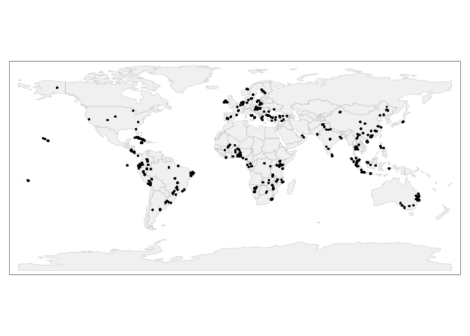
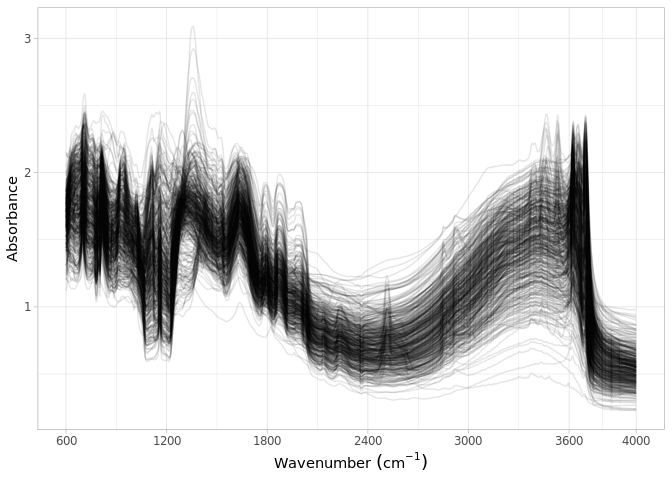
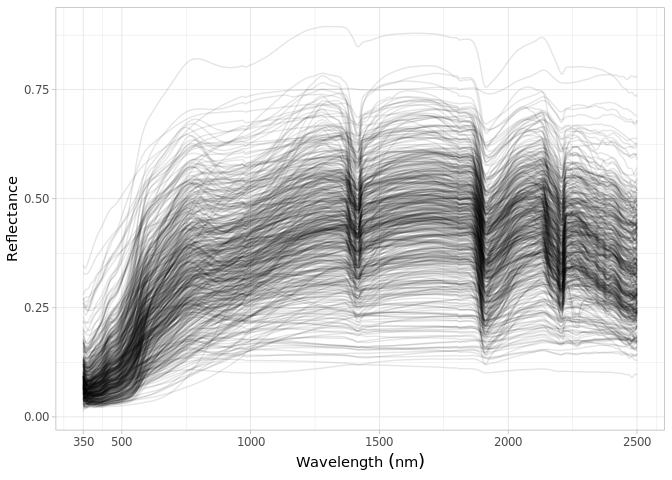

Dataset import: The ICRAF-ISRIC Soil and Spectral Library (ICRAF-ISRIC)
================
Jose Lucas Safanelli (<jsafanelli@woodwellclimate.org>), Tomislav Hengl
(<tom.hengl@opengeohub.org>), Wanderson Mendes de Sousa
(<wanderson.mendes@zalf.de>), Jonathan Sanderman
(<jsanderman@woodwellclimate.org>) -
06 December, 2022


-   [ICRAF-ISRIC inputs](#icraf-isric-inputs)
-   [Data import](#data-import)
    -   [Soil site information](#soil-site-information)
    -   [Soil lab information](#soil-lab-information)
    -   [Mid-infrared spectroscopy
        data](#mid-infrared-spectroscopy-data)
    -   [Visible and Near-infrared spectroscopy
        data](#visible-and-near-infrared-spectroscopy-data)
    -   [Quality control](#quality-control)
-   [References](#references)

[](https://soilspectroscopy.org/)

[](http://creativecommons.org/licenses/by-sa/4.0/)

This work is licensed under a [Creative Commons Attribution-ShareAlike
4.0 International
License](http://creativecommons.org/licenses/by-sa/4.0/).

## ICRAF-ISRIC inputs

Part of: <https://github.com/soilspectroscopy>  
Project: [Soil Spectroscopy for Global
Good](https://soilspectroscopy.org)  
Last update: 2022-12-06  
Dataset:
[ICRAF.ISRIC](https://soilspectroscopy.github.io/ossl-manual/soil-spectroscopy-tools-and-users.html#icraf.isric)

The ICRAF-ISRIC Soil and Spectral Library ([Garrity & Bindraban,
2004](#ref-garrity2004globally)) has samples from 58 countries worldwide
including 5 continents (Africa, Europe, South America, North America,
and Asia). The soil samples were retrieved from the Soil Information
System (ISIS) for the analytical data, while the spectra were obtained
in the World Agroforestry Centre’s (ICRAF). Dataset properties and
licences are explained in detail in [‘ISRIC’ data
portal](https://data.isric.org/geonetwork/srv/api/records/1b65024a-cd9f-11e9-a8f9-a0481ca9e724).

Input datasets:  
- `ICRAF_ISRIC_MIR_spectra.csv`: MIR soil spectral reflectances
(&gt;3578 channels);  
- `ICRAF_ISRIC_VNIR_spectra.csv`: VNIR soil spectral reflectances
(&gt;216 channels);  
- `ICRAF_ISRIC_reference_data.csv`: Database with site and soil
analytes;

For the ICRAF-ISRIC dataset properties refer also to [Aitkenhead &
Black](#ref-aitkenhead2018exploring)
([2018](#ref-aitkenhead2018exploring)).

Directory/folder path:

``` r
dir = "/mnt/soilspec4gg/ossl/dataset/ICRAF_ISRIC/"
tic()
```

## Data import

### Soil site information

``` r
# Icraf site data
icraf.isric.reference = fread(paste0(dir, "/ICRAF_ISRIC_reference_data.csv"))

icraf.isric.reference <- icraf.isric.reference %>%
  select(-Remarks) %>%
  rename(id.layer_local_c = `Batch and labid`,
         layer.sequence_usda_uint16 = HORI,
         layer.upper.depth_usda_cm = BTOP,
         layer.lower.depth_usda_cm = BBOT) %>%
  mutate(id.layer_local_c = as.character(id.layer_local_c)) %>%
  mutate(`Long: sec` = ifelse(is.na(`Long: sec`), 0, `Long: sec`),
         `Lat: sec` = ifelse(is.na(`Lat: sec`), 0, `Lat: sec`)) %>%
  mutate(lat = ifelse(`N / S`=="South",
                      paste0("-", `Lat: degr`, " ", `Lat: min`, " ", `Lat: sec`),
                      paste0(`Lat: degr`, " ", `Lat: min`, " ", `Lat: sec`)),
         lon = ifelse(`E / W`=="West",
                      paste0("-", `Long: degr`, " ", `Long: min`, " ", `Long: sec`),
                      paste0(`Long: degr`, " ", `Long: min`, " ", `Long: sec`))) %>%
  select(id.layer_local_c, Plotcode, layer.sequence_usda_uint16,
         layer.upper.depth_usda_cm, layer.lower.depth_usda_cm,
         lat, lon) %>%
  mutate(lat = ifelse(grepl("NA", lat), NA, lat),
         lon = ifelse(grepl("NA", lon), NA, lon)) %>%
  mutate(lat = measurements::conv_unit(lat, from = 'deg_min_sec', to = 'dec_deg'),
         lon = measurements::conv_unit(lon, from = 'deg_min_sec', to = 'dec_deg'))

# ISIS sitedata
isis.xy <- fread("/mnt/diskstation/data/Soil_points/INT/ISRIC_ISIS/Sites.csv")
isis.des <- fread("/mnt/diskstation/data/Soil_points/INT/ISRIC_ISIS/SitedescriptionResults.csv")
isis.tax.smp <- fread("/mnt/diskstation/data/Soil_points/INT/ISRIC_ISIS/ClassificationSamples.csv")
isis.tax <- fread("/mnt/diskstation/data/Soil_points/INT/ISRIC_ISIS/ClassificationResults.csv")

id0.lst = c(236,235,224)
nm0.lst = c("long2", "lat2", "site_obsdate")
names(nm0.lst) <- id0.lst

isis.des <- isis.des %>%
  filter(ValueId %in% id0.lst) %>%
  mutate(Name = recode(ValueId, !!!nm0.lst)) %>%
  select(Name, Value, SampleId)

isis.xy <- isis.xy %>%
  mutate(SiteId = Id,
         Plotcode = paste(CountryISO, SiteNumber)) %>%
  select(SiteId, Plotcode)

isis.tax.smp <- isis.tax.smp %>%
  mutate(SampleId = Id) %>%
  left_join(isis.xy, by = "SiteId") %>%
  select(SiteId, SampleId, Plotcode)

isis.site <- isis.tax.smp %>%
  left_join(isis.des, by = "SampleId") %>%
  pivot_wider(names_from = "Name", values_from = "Value") %>%
  select(-`NA`)

id0.lst = c(195,196,198,199,200)
nm0.lst = c("USGG_75", "USGG_99", "USSG_75", "USSG_92", "USSG_99")
names(nm0.lst) <- id0.lst

isis.tax <- isis.tax %>%
  filter(ValueId %in% id0.lst) %>%
  mutate(Name = recode(ValueId, !!!nm0.lst)) %>%
  select(Name, Value, SampleId) %>%
  pivot_wider(names_from = "Name", values_from = "Value")

isis.sitedata <- full_join(isis.site, isis.tax, by = "SampleId") %>%
  select(-SiteId, -SampleId) %>%
  mutate(site_obsdate = ifelse(site_obsdate == 0, NA, site_obsdate),
         pedon.taxa_usda_c = paste0(ifelse(is.na(USSG_99), USSG_75, USSG_99),
                                    " ",
                                    ifelse(is.na(USGG_99), USGG_75, USGG_99))) %>%
  mutate(pedon.taxa_usda_c = gsub("NA| NA | NA|NA ", "", pedon.taxa_usda_c)) %>%
  select(-any_of(nm0.lst)) %>%
  arrange(Plotcode, site_obsdate) %>%
  group_by(Plotcode) %>%
  summarise_all(first)

# Joining both datasets
icraf.isric.sitedata <- icraf.isric.reference %>%
  left_join(isis.sitedata, by = "Plotcode") %>%
  mutate(longitude.point_wgs84_dd = ifelse(is.na(lon), as.numeric(long2), as.numeric(lon)),
         latitude.point_wgs84_dd = ifelse(is.na(lat), as.numeric(lat2), as.numeric(lat)),
         site_obsdate = lubridate::ymd(paste0(site_obsdate, "-01-01"))) %>%
  rename(id.dataset.site_ascii_c = Plotcode,
         observation.date.begin_iso.8601_yyyy.mm.dd = site_obsdate) %>%
  mutate(id.layer_local_c = as.character(id.layer_local_c)) %>%
  mutate(observation.date.end_iso.8601_yyyy.mm.dd = observation.date.begin_iso.8601_yyyy.mm.dd) %>%
  select(id.layer_local_c, latitude.point_wgs84_dd, longitude.point_wgs84_dd,
         id.dataset.site_ascii_c, observation.date.begin_iso.8601_yyyy.mm.dd, observation.date.end_iso.8601_yyyy.mm.dd,
         layer.sequence_usda_uint16, layer.upper.depth_usda_cm, layer.lower.depth_usda_cm, pedon.taxa_usda_c) %>% 
  mutate(id.project_ascii_c = "ICRAF-ISRIC Soil Spectral Library",
         id.layer_uuid_c = openssl::md5(as.character(id.layer_local_c)),
         id.location_olc_c = olctools::encode_olc(latitude.point_wgs84_dd, longitude.point_wgs84_dd, 10),
         layer.texture_usda_c = "",
         horizon.designation_usda_c = "",
         longitude.county_wgs84_dd = NA,
         latitude.county_wgs84_dd = NA,
         location.point.error_any_m = 30,
         location.country_iso.3166_c = "",
         observation.ogc.schema.title_ogc_txt = "Open Soil Spectroscopy Library",
         observation.ogc.schema_idn_url = "https://soilspectroscopy.github.io",
         surveyor.title_utf8_txt = "Stephan Mantel",
         surveyor.contact_ietf_email = "stephan.mantel@wur.nl",
         surveyor.address_utf8_txt = "ICRAF, PO Box 30677, Nairobi, 00100, Kenya",
         dataset.title_utf8_txt = "ICRAF-ISRIC Soil Spectral Library",
         dataset.owner_utf8_txt = "World Agroforestry Centre (ICRAF) / ISRIC - World Soil Information",
         dataset.code_ascii_c = "ICRAF.ISRIC",
         dataset.address_idn_url = "https://www.isric.org/explore/ISRIC-collections",
         dataset.doi_idf_url = "https://doi.org/10.34725/DVN/MFHA9C",
         dataset.license.title_ascii_txt = "CC-BY",
         dataset.license.address_idn_url = "https://creativecommons.org/licenses/by/4.0/",
         dataset.contact.name_utf8_txt = "Keith Shepherd",
         dataset.contact_ietf_email = "afsis.info@africasoils.net")

# Removing duplicates
# icraf.isric.sitedata %>%
#   group_by(id.layer_local_c) %>%
#   summarise(repeats = n()) %>%
#   group_by(repeats) %>%
#   summarise(count = n())

dupli.ids <- icraf.isric.sitedata %>%
  group_by(id.layer_local_c) %>%
  summarise(repeats = n()) %>%
  filter(repeats > 1) %>%
  pull(id.layer_local_c)

icraf.isric.sitedata <- icraf.isric.sitedata %>%
  filter(!(id.layer_local_c %in% dupli.ids)) %>%
  mutate_at(vars(starts_with("id.")), as.character) %>%
  as.data.frame()

# Saving version to dataset root dir
site.qs = paste0(dir, "/ossl_soilsite_v1.2.qs")
qs::qsave(icraf.isric.sitedata, site.qs, preset = "high")
```

### Soil lab information

NOTE: The code chunk below this paragraph is hidden. Just run once for
getting the original names of soil properties, descriptions, data types,
and units. Run once and upload to Google Sheet for formatting and
integrating with the OSSL. Requires Google authentication.

<!-- ```{r, eval=FALSE, echo=TRUE} -->
<!-- icraf.df = vroom::vroom(paste0(dir, "ICRAF_ISRIC_reference_data.csv")) -->
<!-- soillab.names <- icraf.df %>% -->
<!--   names(.) %>% -->
<!--   tibble::tibble(original_name = .) %>% -->
<!--   dplyr::mutate(table = 'ICRAF_ISRIC_reference_data.csv', .before = 1) %>% -->
<!--   dplyr::mutate(import = '', ossl_name = '', .after = original_name) %>% -->
<!--   dplyr::mutate(comment = '') -->
<!-- readr::write_csv(soillab.names, paste0(getwd(), "/icraf_isric_soillab_names.csv")) -->
<!-- # Uploading to google sheet -->
<!-- # FACT CIN folder. Get ID for soildata importing table -->
<!-- googledrive::drive_ls(as_id("0AHDIWmLAj40_Uk9PVA")) -->
<!-- OSSL.soildata.importing <- "19LeILz9AEnKVK7GK0ZbK3CCr2RfeP-gSWn5VpY8ETVM" -->
<!-- # Checking metadata -->
<!-- googlesheets4::as_sheets_id(OSSL.soildata.importing) -->
<!-- # Checking readme -->
<!-- googlesheets4::read_sheet(OSSL.soildata.importing, sheet = 'readme') -->
<!-- # Preparing soillab.names -->
<!-- upload <- dplyr::as_tibble(soillab.names) -->
<!-- # Uploading -->
<!-- googlesheets4::write_sheet(upload, ss = OSSL.soildata.importing, sheet = "ICRAF_ISRIC") -->
<!-- # Checking metadata -->
<!-- googlesheets4::as_sheets_id(OSSL.soildata.importing) -->
<!-- ``` -->

NOTE: The code chunk below this paragraph is hidden. Run once for
importing the transformation rules. The table can be edited online at
Google Sheets. A copy is downloaded to github for archiving.

<!-- ```{r soilab_download, include=FALSE, echo=FALSE, eval=FALSE} -->
<!-- # Downloading from google sheet -->
<!-- # FACT CIN folder id -->
<!-- listed.table <- googledrive::drive_ls(as_id("0AHDIWmLAj40_Uk9PVA"), -->
<!--                                       pattern = "OSSL_tab2_soildata_importing") -->
<!-- OSSL.soildata.importing <- listed.table[[1,"id"]] -->
<!-- # Checking metadata -->
<!-- googlesheets4::as_sheets_id(OSSL.soildata.importing) -->
<!-- # Preparing soillab.names -->
<!-- transvalues <- googlesheets4::read_sheet(OSSL.soildata.importing, sheet = "ICRAF_ISRIC") %>% -->
<!--   filter(import == TRUE) %>% -->
<!--   select(contains(c("table", "id", "original_name", "ossl_"))) -->
<!-- # Saving to folder -->
<!-- write_csv(transvalues, paste0(getwd(), "/OSSL_transvalues.csv")) -->
<!-- ``` -->

Reading ICRAF-ISRIC-to-OSSL transformation values:

``` r
transvalues <- read_csv(paste0(getwd(), "/OSSL_transvalues.csv"))
knitr::kable(transvalues)
```

| table                             | original\_name | ossl\_abbrev | ossl\_method | ossl\_unit | ossl\_convert                                         | ossl\_name                   |
|:----------------------------------|:---------------|:-------------|:-------------|:-----------|:------------------------------------------------------|:-----------------------------|
| ICRAF\_ISRIC\_reference\_data.csv | pH (H2O)       | ph.h2o       | usda.a268    | index      | ifelse(as.numeric(x) &lt; 0, NA, as.numeric(x)\*1)    | ph.h2o\_usda.a268\_index     |
| ICRAF\_ISRIC\_reference\_data.csv | pH (CaCl2)     | ph.cacl2     | usda.a481    | index      | ifelse(as.numeric(x) &lt; 0, NA, as.numeric(x)\*1)    | ph.cacl2\_usda.a481\_index   |
| ICRAF\_ISRIC\_reference\_data.csv | CaCO3          | caco3        | usda.a54     | w.pct      | ifelse(as.numeric(x) &lt; 0, NA, as.numeric(x)\*1)    | caco3\_usda.a54\_w.pct       |
| ICRAF\_ISRIC\_reference\_data.csv | Org C          | oc           | usda.c1059   | w.pct      | ifelse(as.numeric(x) &lt; 0, NA, as.numeric(x)\*1)    | oc\_usda.c1059\_w.pct        |
| ICRAF\_ISRIC\_reference\_data.csv | Ca             | ca.ext       | usda.a722    | cmolc.kg   | ifelse(as.numeric(x) &lt; 0, NA, as.numeric(x)\*1)    | ca.ext\_usda.a722\_cmolc.kg  |
| ICRAF\_ISRIC\_reference\_data.csv | Mg             | mg.ext       | usda.a724    | cmolc.kg   | ifelse(as.numeric(x) &lt; 0, NA, as.numeric(x)\*1)    | mg.ext\_usda.a724\_cmolc.kg  |
| ICRAF\_ISRIC\_reference\_data.csv | Na             | na.ext       | usda.a726    | cmolc.kg   | ifelse(as.numeric(x) &lt; 0, NA, as.numeric(x)\*1)    | na.ext\_usda.a726\_cmolc.kg  |
| ICRAF\_ISRIC\_reference\_data.csv | K              | k.ext        | usda.a725    | cmolc.kg   | ifelse(as.numeric(x) &lt; 0, NA, as.numeric(x)\*1)    | k.ext\_usda.a725\_cmolc.kg   |
| ICRAF\_ISRIC\_reference\_data.csv | Exch acid      | acidity      | usda.a795    | cmolc.kg   | ifelse(as.numeric(x) &lt; 0, NA, as.numeric(x)\*1)    | acidity\_usda.a795\_cmolc.kg |
| ICRAF\_ISRIC\_reference\_data.csv | Exch Al        | al.ext       | usda.a69     | cmolc.kg   | ifelse(as.numeric(x) &lt; 0, NA, as.numeric(x)\*1)    | al.ext\_usda.a69\_cmolc.kg   |
| ICRAF\_ISRIC\_reference\_data.csv | CEC soil       | cec          | usda.a723    | cmolc.kg   | ifelse(as.numeric(x) &lt; 0, NA, as.numeric(x)\*1)    | cec\_usda.a723\_cmolc.kg     |
| ICRAF\_ISRIC\_reference\_data.csv | Tot S          | sand.tot     | usda.c60     | w.pct      | ifelse(as.numeric(x) &lt; 0, NA, as.numeric(x)\*1)    | sand.tot\_usda.c60\_w.pct    |
| ICRAF\_ISRIC\_reference\_data.csv | Tot Si         | silt.tot     | usda.c62     | w.pct      | ifelse(as.numeric(x) &lt; 0, NA, as.numeric(x)\*1)    | silt.tot\_usda.c62\_w.pct    |
| ICRAF\_ISRIC\_reference\_data.csv | Clay           | clay.tot     | usda.a334    | w.pct      | ifelse(as.numeric(x) &lt; 0, NA, as.numeric(x)\*1)    | clay.tot\_usda.a334\_w.pct   |
| ICRAF\_ISRIC\_reference\_data.csv | BD             | bd           | usda.a21     | g.cm3      | ifelse(as.numeric(x) &lt; 0.05, NA, as.numeric(x)\*1) | bd\_usda.a21\_g.cm3          |
| ICRAF\_ISRIC\_reference\_data.csv | pF2.0          | wr.10kPa     | usda.a8      | w.pct      | ifelse(as.numeric(x) &lt; 0, NA, as.numeric(x)\*1)    | wr.10kPa\_usda.a8\_w.pct     |
| ICRAF\_ISRIC\_reference\_data.csv | pF2.7          | wr.33kPa     | usda.a9      | w.pct      | ifelse(as.numeric(x) &lt; 0, NA, as.numeric(x)\*1)    | wr.33kPa\_usda.a9\_w.pct     |
| ICRAF\_ISRIC\_reference\_data.csv | pF4.2          | wr.1500kPa   | usda.a417    | w.pct      | ifelse(as.numeric(x) &lt; 0, NA, as.numeric(x)\*1)    | wr.1500kPa\_usda.a417\_w.pct |

Preparing soil data from different files:

``` r
icraf.isric.reference = fread(paste0(dir, "/ICRAF_ISRIC_reference_data.csv"))

# Harmonization of names and units
analytes.old.names <- transvalues %>%
  filter(table == "ICRAF_ISRIC_reference_data.csv") %>%
  pull(original_name)

analytes.new.names <- transvalues %>%
  filter(table == "ICRAF_ISRIC_reference_data.csv") %>%
  pull(ossl_name)

# Selecting and renaming
icraf.isric.soildata <- icraf.isric.reference %>%
  select(-Remarks) %>%
  rename(id.layer_local_c = `Batch and labid`) %>%
  select(id.layer_local_c, all_of(analytes.old.names)) %>%
  rename_with(~analytes.new.names, analytes.old.names)

# Removing duplicates
# icraf.isric.soildata %>%
#   group_by(id.layer_local_c) %>%
#   summarise(repeats = n()) %>%
#   group_by(repeats) %>%
#   summarise(count = n())

dupli.ids <- icraf.isric.soildata %>%
  group_by(id.layer_local_c) %>%
  summarise(repeats = n()) %>%
  filter(repeats > 1) %>%
  pull(id.layer_local_c)

icraf.isric.soildata <- icraf.isric.soildata %>%
  filter(!(id.layer_local_c %in% dupli.ids)) %>%
  as.data.frame()

# Getting the formulas
functions.list <- transvalues %>%
  filter(table == "ICRAF_ISRIC_reference_data.csv") %>%
  mutate(ossl_name = factor(ossl_name, levels = names(icraf.isric.soildata))) %>%
  arrange(ossl_name) %>%
  pull(ossl_convert) %>%
  c("x", .)

# Applying transformation rules
icraf.isric.soildata.trans <- transform_values(df = icraf.isric.soildata,
                                               out.name = names(icraf.isric.soildata),
                                               in.name = names(icraf.isric.soildata),
                                               fun.lst = functions.list)

# Final soillab data
icraf.isric.soildata <- icraf.isric.soildata.trans %>%
  mutate_at(vars(starts_with("id.")), as.character)

# Checking total number of observations
icraf.isric.soildata %>%
  distinct(id.layer_local_c) %>%
  summarise(count = n())
```

    ##   count
    ## 1  4073

``` r
# Saving version to dataset root dir
soillab.qs = paste0(dir, "/ossl_soillab_v1.2.qs")
qs::qsave(icraf.isric.soildata, soillab.qs, preset = "high")
```

### Mid-infrared spectroscopy data

``` r
# Floating wavenumbers
mir.scans <- fread(paste0(dir, "/ICRAF_ISRIC_MIR_spectra.csv"), header = TRUE)

old.names <- names(mir.scans)
new.names <- gsub("m", "", old.names)

icraf.isric.mir <- mir.scans %>%
  rename_with(~new.names, old.names) %>%
  rename(id.layer_local_c = SSN) %>%
  mutate(id.layer_local_c = as.character(id.layer_local_c))

# Need to resample spectra
old.wavenumber <- na.omit(as.numeric(names(icraf.isric.mir)))
new.wavenumbers <- rev(seq(600, 4000, by = 2))

icraf.isric.mir <- icraf.isric.mir %>%
  select(-id.layer_local_c) %>%
  as.matrix() %>%
  prospectr::resample(X = ., wav = old.wavenumber, new.wav = new.wavenumbers, interpol = "spline") %>%
  as_tibble() %>%
  bind_cols({icraf.isric.mir %>%
      select(id.layer_local_c)}, .) %>%
  select(id.layer_local_c, as.character(rev(new.wavenumbers)))

icraf.isric.mir <- icraf.isric.mir %>%
  group_by(id.layer_local_c) %>%
  summarise_all(mean)

# Gaps
scans.na.gaps <- icraf.isric.mir %>%
  select(-id.layer_local_c) %>%
  apply(., 1, function(x) round(100*(sum(is.na(x)))/(length(x)), 2)) %>%
  tibble(proportion_NA = .) %>%
  bind_cols({icraf.isric.mir %>% select(id.layer_local_c)}, .)

# Extreme negative - irreversible erratic patterns
scans.extreme.neg <- icraf.isric.mir %>%
  select(-id.layer_local_c) %>%
  apply(., 1, function(x) {round(100*(sum(x < -1, na.rm=TRUE))/(length(x)), 2)}) %>%
  tibble(proportion_lower0 = .) %>%
  bind_cols({icraf.isric.mir %>% select(id.layer_local_c)}, .)

# Extreme positive, irreversible erratic patterns
scans.extreme.pos <- icraf.isric.mir %>%
  select(-id.layer_local_c) %>%
  apply(., 1, function(x) {round(100*(sum(x > 5, na.rm=TRUE))/(length(x)), 2)}) %>%
  tibble(proportion_higherAbs5 = .) %>%
  bind_cols({icraf.isric.mir %>% select(id.layer_local_c)}, .)

# Consistency summary - problematic scans
scans.summary <- scans.na.gaps %>%
  left_join(scans.extreme.neg, by = "id.layer_local_c") %>%
  left_join(scans.extreme.pos, by = "id.layer_local_c")

scans.summary %>%
  select(-id.layer_local_c) %>%
  pivot_longer(everything(), names_to = "check", values_to = "value") %>%
  filter(value > 0) %>%
  group_by(check) %>%
  summarise(count = n())
```

    ## # A tibble: 0 × 2
    ## # … with 2 variables: check <chr>, count <int>

``` r
# Checking duplicates
dupli.ids <- icraf.isric.mir %>%
  group_by(id.layer_local_c) %>%
  summarise(repeats = n()) %>%
  filter(repeats > 1) %>%
  pull(id.layer_local_c)

icraf.isric.mir <- icraf.isric.mir %>%
  filter(!(id.layer_local_c %in% dupli.ids))

# # These few scans with extreme values are filled with interpolation
# target.wavenumbers <- rev(seq(600, 4000, by = 2))
# 
# icraf.isric.mir.clean <- icraf.isric.mir %>%
#   pivot_longer(-id.layer_local_c, names_to = "wavenumber", values_to = "absorbance") %>%
#   mutate(absorbance = ifelse(absorbance > 3.5, NA, absorbance)) %>%
#   group_by(id.layer_local_c) %>%
#   mutate(absorbance = approx(wavenumber, absorbance, target.wavenumbers)$y) %>%
#   pivot_wider(names_from = "wavenumber", values_from = "absorbance")

# Renaming
old.wavenumbers <- seq(600, 4000, by = 2)
new.wavenumbers <- paste0("scan_mir.", old.wavenumbers, "_abs")

icraf.isric.mir <- icraf.isric.mir %>%
  rename_with(~new.wavenumbers, as.character(old.wavenumbers))

# Preparing metadata
icraf.isric.mir.metadata <- icraf.isric.mir %>%
  select(id.layer_local_c) %>%
  mutate(id.scan_local_c = id.layer_local_c) %>%
  mutate(scan.mir.date.begin_iso.8601_yyyy.mm.dd = ymd("2004-02-01"),
         scan.mir.date.end_iso.8601_yyyy.mm.dd = ymd("2004-11-01"),
         scan.mir.model.name_utf8_txt = "Bruker Vertex 70 with HTS-XT accessory",
         scan.mir.model.code_any_c = "Bruker_Vertex_70.HTS.XT",
         scan.mir.method.light.source_any_c = "",
         scan.mir.method.preparation_any_c = "",
         scan.mir.license.title_ascii_txt = "CC-BY",
         scan.mir.license.address_idn_url = "https://creativecommons.org/licenses/by/4.0/",
         scan.mir.doi_idf_c = "https://doi.org/10.34725/DVN/MFHA9C",
         scan.mir.contact.name_utf8_txt = "Keith Shepherd",
         scan.mir.contact.email_ietf_email = "afsis.info@africasoils.net")

# Final preparation
icraf.isric.mir.export <- icraf.isric.mir.metadata %>%
  left_join(icraf.isric.mir, by = "id.layer_local_c") %>%
  mutate_at(vars(starts_with("id.")), as.character)

# Saving version to dataset root dir
soilmir.qs = paste0(dir, "/ossl_mir_v1.2.qs")
qs::qsave(icraf.isric.mir.export, soilmir.qs, preset = "high")
```

### Visible and Near-infrared spectroscopy data

Reading the ViSNIR scans. The spectra is in absorbance log units and
placed in a matrix inside the dataframe.

``` r
# Floating wavenumbers
visnir.scans <- fread(paste0(dir, "/ICRAF_ISRIC_VNIR_spectra.csv"), header = TRUE)

old.names <- names(visnir.scans)
new.names <- gsub("W", "", old.names)

icraf.isric.visnir <- visnir.scans %>%
  rename_with(~new.names, old.names) %>%
  rename(id.layer_local_c = Batch.Labid) %>%
  mutate(id.layer_local_c = as.character(id.layer_local_c))

# Need to resample spectra
old.wavelengths <- na.omit(as.numeric(names(icraf.isric.visnir)))
new.wavelengths <- rev(seq(350, 2500, by = 2))

icraf.isric.visnir <- icraf.isric.visnir %>%
  select(-id.layer_local_c) %>%
  as.matrix() %>%
  prospectr::resample(X = ., wav = old.wavelengths, new.wav = new.wavelengths, interpol = "spline") %>%
  as_tibble() %>%
  bind_cols({icraf.isric.visnir %>%
      select(id.layer_local_c)}, .) %>%
  select(id.layer_local_c, as.character(rev(new.wavelengths)))

icraf.isric.visnir <- icraf.isric.visnir %>%
  group_by(id.layer_local_c) %>%
  summarise_all(mean)

# Spectral consistency analysis

# Gaps
scans.na.gaps <- icraf.isric.visnir %>%
  select(all_of(as.character(new.wavelengths))) %>%
  apply(., 1, function(x) round(100*(sum(is.na(x)))/(length(x)), 2)) %>%
  tibble(proportion_NA = .) %>%
  bind_cols({icraf.isric.visnir %>% select(id.layer_local_c)}, .)

# Extreme negative
scans.extreme.neg <- icraf.isric.visnir %>%
  select(all_of(as.character(new.wavelengths))) %>%
  apply(., 1, function(x) {round(100*(sum(x < 0, na.rm=TRUE))/(length(x)), 2)}) %>%
  tibble(proportion_lower0 = .) %>%
  bind_cols({icraf.isric.visnir %>% select(id.layer_local_c)}, .)

# Extreme positive
scans.extreme.pos <- icraf.isric.visnir %>%
  select(all_of(as.character(new.wavelengths))) %>%
  apply(., 1, function(x) {round(100*(sum(x > 1, na.rm=TRUE))/(length(x)), 2)}) %>%
  tibble(proportion_higherRef1 = .) %>%
  bind_cols({icraf.isric.visnir %>% select(id.layer_local_c)}, .)

# Consistency summary - problematic scans
scans.summary <- scans.na.gaps %>%
  left_join(scans.extreme.neg, by = "id.layer_local_c") %>%
  left_join(scans.extreme.pos, by = "id.layer_local_c")

# Will omit this. Preprocessing handle baseline offset
scans.summary %>%
  select(-id.layer_local_c) %>%
  pivot_longer(everything(), names_to = "check", values_to = "value") %>%
  filter(value > 0) %>%
  group_by(check) %>%
  summarise(count = n())
```

    ## # A tibble: 1 × 2
    ##   check             count
    ##   <chr>             <int>
    ## 1 proportion_lower0     1

``` r
# Checking duplicates
dupli.ids <- icraf.isric.visnir %>%
  group_by(id.layer_local_c) %>%
  summarise(repeats = n()) %>%
  filter(repeats > 1) %>%
  pull(id.layer_local_c)

icraf.isric.visnir <- icraf.isric.visnir %>%
  filter(!(id.layer_local_c %in% dupli.ids))

# Renaming
old.wavelengths <- seq(350, 2500, by = 2)
new.wavelengths <- paste0("scan_visnir.", old.wavelengths, "_ref")

icraf.isric.visnir <- icraf.isric.visnir %>%
  rename_with(~new.wavelengths, as.character(old.wavelengths))

# Preparing metadata
icraf.isric.visnir.metadata <- icraf.isric.visnir %>%
  select(id.layer_local_c) %>%
  mutate(id.scan_local_c = id.layer_local_c) %>%
  mutate(scan.visnir.date.begin_iso.8601_yyyy.mm.dd = ymd("2004-02-01"),
         scan.visnir.date.end_iso.8601_yyyy.mm.dd = ymd("2004-11-01"),
         scan.visnir.model.name_utf8_txt = "ASD FieldSpec Pro FR",
         scan.visnir.model.code_any_c = "ASD_FieldSpec_FR",
         scan.visnir.method.light.source_any_c = "4.5 W halogen lamp",
         scan.visnir.method.preparation_any_c = "",
         scan.visnir.license.title_ascii_txt = "CC-BY",
         scan.visnir.license.address_idn_url = "https://creativecommons.org/licenses/by/4.0/",
         scan.visnir.doi_idf_c = "https://doi.org/10.34725/DVN/MFHA9C",
         scan.visnir.contact.name_utf8_txt = "Keith Shepherd",
         scan.visnir.contact.email_ietf_email = "afsis.info@africasoils.net")

# Final preparation
icraf.isric.visnir.export <- icraf.isric.visnir.metadata %>%
  left_join(icraf.isric.visnir, by = "id.layer_local_c") %>%
  mutate_at(vars(starts_with("id.")), as.character)

# Saving version to dataset root dir
soilvisnir.qs = paste0(dir, "/ossl_visnir_v1.2.qs")
qs::qsave(icraf.isric.visnir.export, soilvisnir.qs, preset = "high")
```

### Quality control

The final table must be joined as:

-   VisNIR is used as first reference.
-   It is fully joined with MIR.
-   The result is left joined with the site and soil lab data. This drop
    data without any scan.

The availabilty of data is summarised below:

``` r
# Taking a few representative columns for checking the consistency of joins
icraf.isric.availability <- icraf.isric.visnir.export %>%
  select(id.layer_local_c, scan_visnir.450_ref) %>%
  full_join({icraf.isric.mir.export %>%
      select(id.layer_local_c, scan_mir.600_abs)}, by = "id.layer_local_c") %>%
  left_join({icraf.isric.sitedata %>%
      select(id.layer_local_c, layer.upper.depth_usda_cm)}, by = "id.layer_local_c") %>%
  left_join({icraf.isric.soildata %>%
      select(id.layer_local_c, ph.h2o_usda.a268_index)}, by = "id.layer_local_c") %>%
  filter(!is.na(id.layer_local_c))

# Availability of information from icraf.isric
icraf.isric.availability %>%
  mutate_all(as.character) %>%
  pivot_longer(everything(), names_to = "column", values_to = "value") %>%
  filter(!is.na(value)) %>%
  group_by(column) %>%
  summarise(count = n())
```

    ## # A tibble: 5 × 2
    ##   column                    count
    ##   <chr>                     <int>
    ## 1 id.layer_local_c           4438
    ## 2 layer.upper.depth_usda_cm  4073
    ## 3 ph.h2o_usda.a268_index     3776
    ## 4 scan_mir.600_abs           4153
    ## 5 scan_visnir.450_ref        4438

``` r
# Repeats check - Duplicates are dropped
icraf.isric.availability %>%
  mutate_all(as.character) %>%
  select(id.layer_local_c) %>%
  pivot_longer(everything(), names_to = "column", values_to = "value") %>%
  group_by(column, value) %>%
  summarise(repeats = n()) %>%
  group_by(column, repeats) %>%
  summarise(count = n())
```

    ## # A tibble: 1 × 3
    ## # Groups:   column [1]
    ##   column           repeats count
    ##   <chr>              <int> <int>
    ## 1 id.layer_local_c       1  4438

This summary shows that, at total, about 40k observations are available.
Some rows have both MIR and VisNIR scans, many not.

NOTE: As the duplicated layers represent a minor fraction (n=26) of the
database, they will be dropped when binding all the datasets for making
the OSSL level 0.

Plotting sites map:

``` r
data("World")

points <- icraf.isric.sitedata %>%
  filter(!is.na(longitude.point_wgs84_dd)) %>%
  st_as_sf(coords = c('longitude.point_wgs84_dd', 'latitude.point_wgs84_dd'), crs = 4326)

tmap_mode("plot")

tm_shape(World) +
  tm_polygons('#f0f0f0f0', border.alpha = 0.2) +
  tm_shape(points) +
  tm_dots()
```

<!-- -->

Soil analytical data summary:

``` r
icraf.isric.soildata %>%
  mutate(id.layer_local_c = factor(id.layer_local_c)) %>%
  skimr::skim() %>%
  dplyr::select(-numeric.hist, -complete_rate)
```

|                                                  |            |
|:-------------------------------------------------|:-----------|
| Name                                             | Piped data |
| Number of rows                                   | 4073       |
| Number of columns                                | 19         |
| \_\_\_\_\_\_\_\_\_\_\_\_\_\_\_\_\_\_\_\_\_\_\_   |            |
| Column type frequency:                           |            |
| factor                                           | 1          |
| numeric                                          | 18         |
| \_\_\_\_\_\_\_\_\_\_\_\_\_\_\_\_\_\_\_\_\_\_\_\_ |            |
| Group variables                                  | None       |

Data summary

**Variable type: factor**

| skim\_variable     | n\_missing | ordered | n\_unique | top\_counts                    |
|:-------------------|-----------:|:--------|----------:|:-------------------------------|
| id.layer\_local\_c |          0 | FALSE   |      4073 | FS1: 1, FS1: 1, FS1: 1, FS1: 1 |

**Variable type: numeric**

| skim\_variable               | n\_missing |  mean |    sd |   p0 |   p25 |   p50 |   p75 |   p100 |
|:-----------------------------|-----------:|------:|------:|-----:|------:|------:|------:|-------:|
| ph.h2o\_usda.a268\_index     |        297 |  6.11 |  1.40 | 3.00 |  5.00 |  5.90 |  7.10 |  10.50 |
| ph.cacl2\_usda.a481\_index   |       4039 |  4.99 |  1.26 | 3.10 |  4.00 |  5.10 |  6.05 |   7.90 |
| caco3\_usda.a54\_w.pct       |       2956 |  9.94 | 16.41 | 0.00 |  1.00 |  2.60 | 11.60 |  99.70 |
| oc\_usda.c1059\_w.pct        |        373 |  1.20 |  2.66 | 0.00 |  0.22 |  0.48 |  1.20 |  60.00 |
| ca.ext\_usda.a722\_cmolc.kg  |        401 | 10.81 | 15.58 | 0.00 |  0.40 |  3.60 | 14.90 | 168.20 |
| mg.ext\_usda.a724\_cmolc.kg  |        393 |  2.81 |  4.69 | 0.00 |  0.20 |  1.00 |  3.40 |  68.00 |
| na.ext\_usda.a726\_cmolc.kg  |        409 |  0.62 |  2.39 | 0.00 |  0.00 |  0.10 |  0.30 |  31.60 |
| k.ext\_usda.a725\_cmolc.kg   |        399 |  0.33 |  0.57 | 0.00 |  0.10 |  0.20 |  0.40 |   9.80 |
| acidity\_usda.a795\_cmolc.kg |       2562 |  1.99 |  2.95 | 0.00 |  0.20 |  0.90 |  2.60 |  25.50 |
| al.ext\_usda.a69\_cmolc.kg   |       2532 |  1.58 |  2.56 | 0.00 |  0.00 |  0.70 |  2.10 |  25.30 |
| cec\_usda.a723\_cmolc.kg     |        419 | 16.27 | 16.41 | 0.00 |  5.20 | 11.50 | 21.60 | 189.60 |
| sand.tot\_usda.c60\_w.pct    |        392 | 38.24 | 29.15 | 0.00 | 11.10 | 33.00 | 61.20 |  99.60 |
| silt.tot\_usda.c62\_w.pct    |        339 | 29.22 | 20.39 | 0.00 | 13.00 | 25.00 | 42.50 | 256.00 |
| clay.tot\_usda.a334\_w.pct   |        333 | 32.60 | 22.27 | 0.00 | 14.70 | 30.10 | 47.00 |  96.80 |
| bd\_usda.a21\_g.cm3          |       3074 |  1.26 |  0.29 | 0.28 |  1.10 |  1.31 |  1.48 |   1.89 |
| wr.10kPa\_usda.a8\_w.pct     |       3145 | 36.77 | 13.27 | 4.40 | 28.60 | 36.45 | 45.62 |  77.30 |
| wr.33kPa\_usda.a9\_w.pct     |       3150 | 31.82 | 13.34 | 2.30 | 22.90 | 31.40 | 41.50 |  71.40 |
| wr.1500kPa\_usda.a417\_w.pct |       3102 | 21.74 | 11.44 | 0.10 | 12.90 | 21.90 | 29.55 |  56.40 |

MIR spectral visualization:

``` r
set.seed(1993)
icraf.isric.mir %>%
  sample_n(500) %>%
  select(all_of(c("id.layer_local_c")), starts_with("scan_mir.")) %>%
  tidyr::pivot_longer(-all_of(c("id.layer_local_c")),
                      names_to = "wavenumber", values_to = "absorbance") %>%
  dplyr::mutate(wavenumber = gsub("scan_mir.|_abs", "", wavenumber)) %>%
  dplyr::mutate(wavenumber = as.numeric(wavenumber)) %>%
  ggplot(aes(x = wavenumber, y = absorbance, group = id.layer_local_c)) +
  geom_line(alpha = 0.1) +
  scale_x_continuous(breaks = c(600, 1200, 1800, 2400, 3000, 3600, 4000)) +
  labs(x = bquote("Wavenumber"~(cm^-1)), y = "Absorbance") +
  theme_light()
```

<!-- -->

ViSNIR spectral visualization:

``` r
set.seed(1993)
icraf.isric.visnir %>%
  select(all_of(c("id.layer_local_c")), starts_with("scan_visnir.")) %>%
  sample_n(500) %>%
  mutate_at(vars(starts_with("scan_visnir.")), as.numeric) %>%
  tidyr::pivot_longer(-all_of(c("id.layer_local_c")), names_to = "wavelength", values_to = "reflectance") %>%
  dplyr::mutate(wavelength = gsub("scan_visnir.|_ref", "", wavelength)) %>%
  dplyr::mutate(wavelength = as.numeric(wavelength)) %>%
  ggplot(aes(x = wavelength, y = reflectance, group = id.layer_local_c)) +
  geom_line(alpha = 0.1) +
  scale_x_continuous(breaks = c(350, 500, 1000, 1500, 2000, 2500)) +
  labs(x = bquote("Wavelength"~(nm)), y = "Reflectance") +
  theme_light()
```

<!-- -->

``` r
toc()
```

    ## 100.646 sec elapsed

``` r
rm(list = ls())
gc()
```

    ##           used  (Mb) gc trigger  (Mb)  max used  (Mb)
    ## Ncells 2632508 140.6    7101248 379.3  14395440 768.8
    ## Vcells 7601770  58.0   89861607 685.6 112295295 856.8

## References

<div id="refs" class="references csl-bib-body hanging-indent"
line-spacing="2">

<div id="ref-aitkenhead2018exploring" class="csl-entry">

Aitkenhead, M. J., & Black, H. I. (2018). <span class="nocase">Exploring
the impact of different input data types on soil variable estimation
using the ICRAF-ISRIC global soil spectral database</span>. *Applied
Spectroscopy*, *72*(2), 188–198.
doi:[10.1177/0003702817739013](https://doi.org/10.1177/0003702817739013)

</div>

<div id="ref-garrity2004globally" class="csl-entry">

Garrity, D., & Bindraban, P. (2004). *A globally distributed soil
spectral library visible near infrared diffuse reflectance spectra*.
Nairobi, Kenya: ICRAF (World Agroforestry Centre) / ISRIC (World Soil
Information) Spectral Library. Retrieved from
<https://doi.org/10.34725/DVN/MFHA9C>

</div>

</div>
