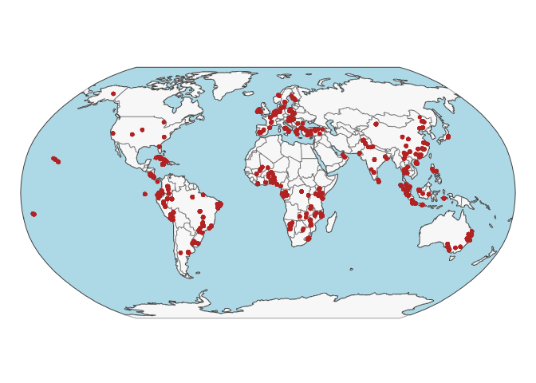
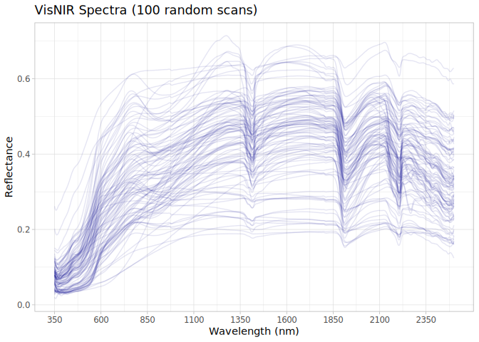
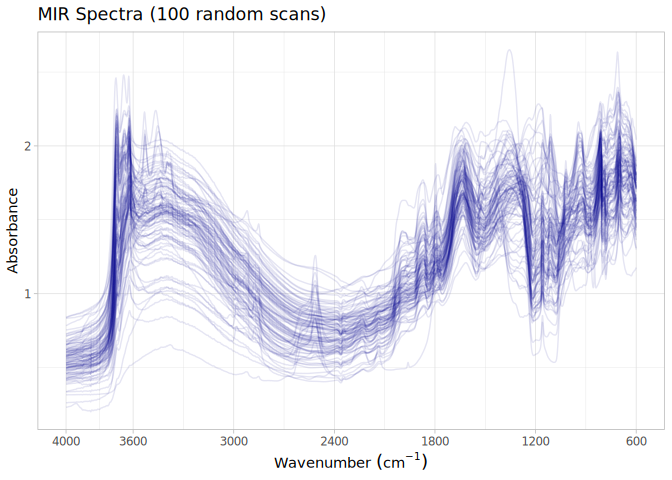

# The ICRAF-ISRIC Soil Spectral Library
Jose L. Safanelli, Ran Zhi, Tomislav Hengl, Jonathan Sanderman

- [Original data](#original-data)
- [Data standardization to the OSSL
  format](#data-standardization-to-the-ossl-format)
  - [Site information](#site-information)
  - [Soil lab information (reference analytical
    data)](#soil-lab-information-reference-analytical-data)
  - [VisNIR spectra](#visnir-spectra)
  - [Quality control for Vis-NIR](#quality-control-for-vis-nir)
  - [Mid-infrared spectra (MIR)](#mid-infrared-spectra-mir)
  - [Quality control for MIR](#quality-control-for-mir)
- [References](#references)

Code repository for standardizing and importing the ICRAF-ISRIC Soil
Spectral Library.

Website: [Soil Spectroscopy for Global
Good](https://soilspectroscopy.org)  
Development: <https://github.com/soilspectroscopy>  
Last update: 2026-05-17  
Additional documentation:

## Original data

The ICRAF-ISRIC Soil and Spectral Library (World Agroforestry (ICRAF) &
International Soil Reference And Information Centre (ISRIC)
([2021](#ref-icraf_isric))) has soil samples from 58 countries and 5
continents (Africa, Europe, South America, North America, and Asia). The
soil samples were retrieved from the Soil Information System (ISIS) for
the analytical characterization, while the spectra were scanned in the
World Agroforestry Centre (ICRAF). Dataset properties and licences are
explained in detail on [ISRIC data
portal](https://data.isric.org/geonetwork/srv/api/records/1b65024a-cd9f-11e9-a8f9-a0481ca9e724).

Further information about this dataset can be found in Shepherd & Walsh
([2002](#ref-Shepherd2002)) and Terhoeven-Urselmans, Vagen, Spaargaren,
& Shepherd ([2010](#ref-TerhoevenUrselmans2010)).

Input datasets: - `ICRAF_ISRIC_MIR_spectra.csv`: MIR soil spectral
reflectances (\>3578 channels).  
- `ICRAF_ISRIC_VNIR_spectra.csv`: VNIR soil spectral reflectances (\>216
channels).  
- `ICRAF_ISRIC_reference_data.csv`: Database with site and soil
analytes.  

Directory/folder path with original files (not uploaded to GitHub).

``` r
# dir = "./"
dir = "~/mnt-ossl-private/database/datasets/ICRAF_ISRIC"
tic()
```

## Data standardization to the OSSL format

### Site information

``` r
# Icraf site data
icraf.isric.reference = fread(paste0(dir, "/ICRAF_ISRIC_reference_data.csv"))

icraf.isric.reference <- icraf.isric.reference %>%
  select(-Remarks) %>%
  rename(id.layer_local_c = `Batch and labid`,
         layer.sequence_usda_uint16 = HORI,
         layer.upper.depth_usda_cm = BTOP,
         layer.lower.depth_usda_cm = BBOT,
         loc.country_src_txt = `Country name`) %>%
  mutate(id.layer_local_c = as.character(id.layer_local_c)) %>%
  mutate(`Long: sec` = ifelse(is.na(`Long: sec`), 0, `Long: sec`),
         `Lat: sec` = ifelse(is.na(`Lat: sec`), 0, `Lat: sec`)) %>%
  mutate(lat = ifelse(`N / S`=="South",
                      paste0("-", `Lat: degr`, " ", `Lat: min`, " ", `Lat: sec`),
                      paste0(`Lat: degr`, " ", `Lat: min`, " ", `Lat: sec`)),
         lon = ifelse(`E / W`=="West",
                      paste0("-", `Long: degr`, " ", `Long: min`, " ", `Long: sec`),
                      paste0(`Long: degr`, " ", `Long: min`, " ", `Long: sec`))) %>%
  select(id.layer_local_c, loc.country_src_txt, layer.sequence_usda_uint16,
         layer.upper.depth_usda_cm, layer.lower.depth_usda_cm,
         lat, lon) %>%
  mutate(lat = ifelse(grepl("NA", lat), NA, lat),
         lon = ifelse(grepl("NA", lon), NA, lon)) %>%
  mutate(lat = measurements::conv_unit(lat, from = 'deg_min_sec', to = 'dec_deg'),
         lon = measurements::conv_unit(lon, from = 'deg_min_sec', to = 'dec_deg'))

# # ISIS sitedata
# isis.xy <- fread("/mnt/diskstation/data/Soil_points/INT/ISRIC_ISIS/Sites.csv")
# isis.des <- fread("/mnt/diskstation/data/Soil_points/INT/ISRIC_ISIS/SitedescriptionResults.csv")
# isis.tax.smp <- fread("/mnt/diskstation/data/Soil_points/INT/ISRIC_ISIS/ClassificationSamples.csv")
# isis.tax <- fread("/mnt/diskstation/data/Soil_points/INT/ISRIC_ISIS/ClassificationResults.csv")
# 
# id0.lst = c(236,235,224)
# nm0.lst = c("long2", "lat2", "site_obsdate")
# names(nm0.lst) <- id0.lst
# 
# isis.des <- isis.des %>%
#   filter(ValueId %in% id0.lst) %>%
#   mutate(Name = recode(ValueId, !!!nm0.lst)) %>%
#   select(Name, Value, SampleId)
# 
# isis.xy <- isis.xy %>%
#   mutate(SiteId = Id,
#          Plotcode = paste(CountryISO, SiteNumber)) %>%
#   select(SiteId, Plotcode)
# 
# isis.tax.smp <- isis.tax.smp %>%
#   mutate(SampleId = Id) %>%
#   left_join(isis.xy, by = "SiteId") %>%
#   select(SiteId, SampleId, Plotcode)
# 
# isis.site <- isis.tax.smp %>%
#   left_join(isis.des, by = "SampleId") %>%
#   pivot_wider(names_from = "Name", values_from = "Value") %>%
#   select(-`NA`)
# 
# id0.lst = c(195,196,198,199,200)
# nm0.lst = c("USGG_75", "USGG_99", "USSG_75", "USSG_92", "USSG_99")
# names(nm0.lst) <- id0.lst
# 
# isis.tax <- isis.tax %>%
#   filter(ValueId %in% id0.lst) %>%
#   mutate(Name = recode(ValueId, !!!nm0.lst)) %>%
#   select(Name, Value, SampleId) %>%
#   pivot_wider(names_from = "Name", values_from = "Value")
# 
# isis.sitedata <- full_join(isis.site, isis.tax, by = "SampleId") %>%
#   select(-SiteId, -SampleId) %>%
#   mutate(site_obsdate = ifelse(site_obsdate == 0, NA, site_obsdate),
#          pedon.taxa_usda_txt = paste0(ifelse(is.na(USSG_99), USSG_75, USSG_99),
#                                     " ",
#                                     ifelse(is.na(USGG_99), USGG_75, USGG_99))) %>%
#   mutate(pedon.taxa_usda_txt = gsub("NA| NA | NA|NA ", "", pedon.taxa_usda_txt)) %>%
#   select(-any_of(nm0.lst)) %>%
#   arrange(Plotcode, site_obsdate) %>%
#   group_by(Plotcode) %>%
#   summarise_all(first)

# # Joining both datasets
# icraf.isric.sitedata <- icraf.isric.reference %>%
#   left_join(isis.sitedata, by = "Plotcode") %>%
#   mutate(longitude.point_wgs84_dd = ifelse(is.na(lon), as.numeric(long2), as.numeric(lon)),
#          latitude.point_wgs84_dd = ifelse(is.na(lat), as.numeric(lat2), as.numeric(lat)),
#          site_obsdate = lubridate::ymd(paste0(site_obsdate, "-01-01"))) %>%
#   rename(id.dataset.site_ascii_txt = Plotcode,
#          observation.date.begin_iso.8601_yyyy.mm.dd = site_obsdate) %>%
#   mutate(id.layer_local_c = as.character(id.layer_local_c)) %>%
#   mutate(observation.date.end_iso.8601_yyyy.mm.dd = observation.date.begin_iso.8601_yyyy.mm.dd) %>%
#   select(id.layer_local_c, latitude.point_wgs84_dd, longitude.point_wgs84_dd,
#          id.dataset.site_ascii_txt, observation.date.begin_iso.8601_yyyy.mm.dd, observation.date.end_iso.8601_yyyy.mm.dd,
#          layer.sequence_usda_uint16, layer.upper.depth_usda_cm, layer.lower.depth_usda_cm, pedon.taxa_usda_txt) %>% 
#   mutate(id.project_ascii_txt = "ICRAF-ISRIC Soil Spectral Library",
#          layer.texture_usda_txt = "",
#          horizon.designation_usda_txt = "",
#          longitude.county_wgs84_dd = NA,
#          latitude.county_wgs84_dd = NA,
#          location.point.error_any_m = 30,
#          location.country_iso.3166_txt = "",
#          observation.ogc.schema.title_ogc_txt = "Open Soil Spectroscopy Library",
#          observation.ogc.schema_idn_url = "https://soilspectroscopy.github.io",
#          surveyor.title_utf8_txt = "Stephan Mantel",
#          surveyor.contact_ietf_email = "stephan.mantel@wur.nl",
#          surveyor.address_utf8_txt = "ICRAF, PO Box 30677, Nairobi, 00100, Kenya",
#          dataset.title_utf8_txt = "ICRAF-ISRIC Soil Spectral Library",
#          dataset.owner_utf8_txt = "World Agroforestry Centre (ICRAF) / ISRIC - World Soil Information",
#          dataset.code_ascii_txt = "ICRAF.ISRIC",
#          dataset.address_idn_url = "https://www.isric.org/explore/ISRIC-collections",
#          dataset.doi_idf_url = "https://doi.org/10.34725/DVN/MFHA9C",
#          dataset.license.title_ascii_txt = "CC-BY",
#          dataset.license.address_idn_url = "https://creativecommons.org/licenses/by/4.0/",
#          dataset.contact.name_utf8_txt = "Keith Shepherd",
#          dataset.contact_ietf_email = "afsis.info@africasoils.net") %>%
#   mutate(id.layer_uuid_txt = openssl::md5(paste0(dataset.code_ascii_txt, id.layer_local_c)),
#          id.location_olc_txt = olctools::encode_olc(latitude.point_wgs84_dd, longitude.point_wgs84_dd, 10),
#          .after = id.project_ascii_txt)

# Joining both datasets
icraf.isric.sitedata <- icraf.isric.reference %>%
  mutate(longitude.point_wgs84_dd = ifelse(is.na(lon), NA, as.numeric(lon)),
         latitude.point_wgs84_dd = ifelse(is.na(lat), NA, as.numeric(lat))) %>%
  select(-lon, -lat) %>%
  mutate(id.layer_local_c = as.character(id.layer_local_c)) %>%
  mutate(dataset.code_ascii_txt = "ICRAF_ISRIC",
         id.layer_uuid_txt = openssl::md5(paste0(dataset.code_ascii_txt, id.layer_local_c)),
         .before = 1)

# Removing duplicates
# icraf.isric.sitedata %>%
#   group_by(id.layer_local_c) %>%
#   summarise(repeats = n()) %>%
#   group_by(repeats) %>%
#   summarise(count = n())

dupli.ids <- icraf.isric.sitedata %>%
  group_by(id.layer_local_c) %>%
  summarise(repeats = n()) %>%
  filter(repeats > 1) %>%
  pull(id.layer_local_c)

icraf.isric.sitedata <- icraf.isric.sitedata %>%
  filter(!(id.layer_local_c %in% dupli.ids)) %>%
  mutate_at(vars(starts_with("id.")), as.character) %>%
  as.data.frame()

# Saving version to dataset root dir
site.exp.file = path(dir, "ossl_soilsite_v1.3")
readr::write_csv(icraf.isric.sitedata, str_c(site.exp.file, ".csv.gz"))
nanoparquet::write_parquet(icraf.isric.sitedata, str_c(site.exp.file, ".parquet"))
```

Plotting map:

``` r
data("World")

ocean <- ne_download(scale = 110, type = "ocean", category = "physical", returnclass = "sf")
```

    Reading 'ne_110m_ocean.zip' from naturalearth...

``` r
points <- icraf.isric.sitedata %>%
  filter(!is.na(longitude.point_wgs84_dd),
         !is.na(latitude.point_wgs84_dd)) %>%
  st_as_sf(coords = c('longitude.point_wgs84_dd', 'latitude.point_wgs84_dd'), crs = 4326)

tmap_mode("plot")
```

    ℹ tmap modes "plot" - "view"
    ℹ toggle with `tmap::ttm()`

``` r
tm_shape(ocean) +
  tm_polygons(fill = "lightblue", col = NA) +
  tm_shape(World) +
  tm_polygons(fill = "#f0f0f0", fill_alpha = 0.5, col_alpha = 0.5) +
  tm_shape(points) +
  tm_dots(fill = "firebrick") +
  tm_crs("ESRI:54030") +
  tm_layout(frame = FALSE)
```

    [tip] Consider a suitable map projection, e.g. by adding `+ tm_crs("auto")`.
    This message is displayed once per session.



### Soil lab information (reference analytical data)

NOTE: The code chunk below must be run just once for getting a template
for scripted column standardization. Just run once for getting the
original names of soil properties, descriptions, data types, and units.
Then upload to Google Sheet for editing and manually defining the rules
for integrating with the OSSL. Requires Google authentication. A copy of
the output file is saved to this folder for archiving purposes.

**Always leave the sheet name as TEMP to avoid overwritting, then rename
online to download locally.**

``` r
icraf.df = vroom::vroom(path(dir, "ICRAF_ISRIC_reference_data.csv"))

soillab.names <- icraf.df %>%
  names(.) %>%
  tibble::tibble(original_name = .) %>%
  dplyr::mutate(table = 'ICRAF_ISRIC_reference_data.csv', .before = 1) %>%
  dplyr::mutate(import = '', ossl_name = '', .after = original_name) %>%
  dplyr::mutate(comment = '')

readr::write_csv(soillab.names, paste0(getwd(), "/icraf_isric_soillab_names.csv"))

# Uploading to google sheet

# FACT CIN folder. Get ID for soildata importing table
googledrive::drive_ls(as_id("0AHDIWmLAj40_Uk9PVA"))

OSSL.soildata.importing <- "19LeILz9AEnKVK7GK0ZbK3CCr2RfeP-gSWn5VpY8ETVM"

# Checking metadata
googlesheets4::as_sheets_id(OSSL.soildata.importing)

# Checking readme
googlesheets4::read_sheet(OSSL.soildata.importing, sheet = 'readme')

# Preparing soillab.names
upload <- dplyr::as_tibble(soillab.names)

# Uploading
googlesheets4::write_sheet(upload, ss = OSSL.soildata.importing, sheet = "ICRAF_ISRIC")

# Checking metadata
googlesheets4::as_sheets_id(OSSL.soildata.importing)
```

NOTE: The code chunk below must be run just once. Run for getting the
column standardization rules after editing online on Google Sheets. A
copy of the edited standardization template is saved to this dataset
folder.

``` r
# Downloading from google sheet

# Checking metadata
googlesheets4::as_sheets_id("1mWTDJDuMp4oObcCxAy9gofSkrkcSWWf1TtEW2SuC1es")

# Preparing soillab.names
transvalues <- googlesheets4::read_sheet("1mWTDJDuMp4oObcCxAy9gofSkrkcSWWf1TtEW2SuC1es",
                                         sheet = "ICRAF_ISRIC")

# Saving to folder
write_csv(transvalues, path(getwd(), "soillab_standardized_names.csv"))
```

Reading standardization rules:

``` r
transvalues <- read_csv(path(getwd(), "soillab_standardized_names.csv"),
                        show_col_types = F) %>%
  filter(import == TRUE) %>%
  select(contains(c("table", "id", "original_name", "ossl_")))

knitr::kable(transvalues)
```

| table | original_name | ossl_abbrev | ossl_method | ossl_unit | ossl_convert | ossl_name |
|:---|:---|:---|:---|:---|:---|:---|
| ICRAF_ISRIC_reference_data.csv | pH (H2O) | ph.h2o | usda.a268 | index | ifelse(as.numeric(x) \< 0, NA, as.numeric(x)\*1) | ph.h2o_usda.a268_index |
| ICRAF_ISRIC_reference_data.csv | pH (CaCl2) | ph.cacl2 | usda.a481 | index | ifelse(as.numeric(x) \< 0, NA, as.numeric(x)\*1) | ph.cacl2_usda.a481_index |
| ICRAF_ISRIC_reference_data.csv | CaCO3 | caco3 | usda.a54 | w.pct | ifelse(as.numeric(x) \< 0, NA, as.numeric(x)\*1) | caco3_usda.a54_w.pct |
| ICRAF_ISRIC_reference_data.csv | Org C | oc | usda.c1059 | w.pct | ifelse(as.numeric(x) \< 0, NA, as.numeric(x)\*1) | oc_usda.c1059_w.pct |
| ICRAF_ISRIC_reference_data.csv | Ca | ca.ext | usda.a722 | cmolc.kg | ifelse(as.numeric(x) \< 0, NA, as.numeric(x)\*1) | ca.ext_usda.a722_cmolc.kg |
| ICRAF_ISRIC_reference_data.csv | Mg | mg.ext | usda.a724 | cmolc.kg | ifelse(as.numeric(x) \< 0, NA, as.numeric(x)\*1) | mg.ext_usda.a724_cmolc.kg |
| ICRAF_ISRIC_reference_data.csv | Na | na.ext | usda.a726 | cmolc.kg | ifelse(as.numeric(x) \< 0, NA, as.numeric(x)\*1) | na.ext_usda.a726_cmolc.kg |
| ICRAF_ISRIC_reference_data.csv | K | k.ext | usda.a725 | cmolc.kg | ifelse(as.numeric(x) \< 0, NA, as.numeric(x)\*1) | k.ext_usda.a725_cmolc.kg |
| ICRAF_ISRIC_reference_data.csv | Exch acid | acidity | usda.a795 | cmolc.kg | ifelse(as.numeric(x) \< 0, NA, as.numeric(x)\*1) | acidity_usda.a795_cmolc.kg |
| ICRAF_ISRIC_reference_data.csv | Exch Al | al.ext | usda.a69 | cmolc.kg | ifelse(as.numeric(x) \< 0, NA, as.numeric(x)\*1) | al.ext_usda.a69_cmolc.kg |
| ICRAF_ISRIC_reference_data.csv | CEC soil | cec | usda.a723 | cmolc.kg | ifelse(as.numeric(x) \< 0, NA, as.numeric(x)\*1) | cec_usda.a723_cmolc.kg |
| ICRAF_ISRIC_reference_data.csv | Tot S | sand.tot | usda.c60 | w.pct | ifelse(as.numeric(x) \< 0, NA, as.numeric(x)\*1) | sand.tot_usda.c60_w.pct |
| ICRAF_ISRIC_reference_data.csv | Tot Si | silt.tot | usda.c62 | w.pct | ifelse(as.numeric(x) \< 0, NA, as.numeric(x)\*1) | silt.tot_usda.c62_w.pct |
| ICRAF_ISRIC_reference_data.csv | Clay | clay.tot | usda.a334 | w.pct | ifelse(as.numeric(x) \< 0, NA, as.numeric(x)\*1) | clay.tot_usda.a334_w.pct |
| ICRAF_ISRIC_reference_data.csv | BD | bd | usda.a21 | g.cm3 | ifelse(as.numeric(x) \< 0.05, NA, as.numeric(x)\*1) | bd_usda.a21_g.cm3 |
| ICRAF_ISRIC_reference_data.csv | pF2.0 | wr.10kPa | usda.a8 | w.pct | ifelse(as.numeric(x) \< 0, NA, as.numeric(x)\*1) | wr.10kPa_usda.a8_w.pct |
| ICRAF_ISRIC_reference_data.csv | pF2.7 | wr.33kPa | usda.a9 | w.pct | ifelse(as.numeric(x) \< 0, NA, as.numeric(x)\*1) | wr.33kPa_usda.a9_w.pct |
| ICRAF_ISRIC_reference_data.csv | pF4.2 | wr.1500kPa | usda.a417 | w.pct | ifelse(as.numeric(x) \< 0, NA, as.numeric(x)\*1) | wr.1500kPa_usda.a417_w.pct |

Standardizing soil data to the OSSL format:

``` r
icraf.isric.reference = fread(path(dir, "/ICRAF_ISRIC_reference_data.csv"))

# Standardization of names and units
analytes.old.names <- transvalues %>%
  filter(table == "ICRAF_ISRIC_reference_data.csv") %>%
  pull(original_name)

analytes.new.names <- transvalues %>%
  filter(table == "ICRAF_ISRIC_reference_data.csv") %>%
  pull(ossl_name)

# Selecting and renaming
icraf.isric.soildata <- icraf.isric.reference %>%
  select(-Remarks) %>%
  rename(id.layer_local_c = `Batch and labid`) %>%
  select(id.layer_local_c, all_of(analytes.old.names)) %>%
  rename_with(~analytes.new.names, all_of(analytes.old.names))

# Removing duplicates
# icraf.isric.soildata %>%
#   group_by(id.layer_local_c) %>%
#   summarise(repeats = n()) %>%
#   group_by(repeats) %>%
#   summarise(count = n())

dupli.ids <- icraf.isric.soildata %>%
  group_by(id.layer_local_c) %>%
  summarise(repeats = n()) %>%
  filter(repeats > 1) %>%
  pull(id.layer_local_c)

icraf.isric.soildata <- icraf.isric.soildata %>%
  filter(!(id.layer_local_c %in% dupli.ids)) %>%
  as.data.frame()

# Getting the formulas
functions.list <- transvalues %>%
  filter(table == "ICRAF_ISRIC_reference_data.csv") %>%
  mutate(ossl_name = factor(ossl_name, levels = names(icraf.isric.soildata))) %>%
  arrange(ossl_name) %>%
  pull(ossl_convert) %>%
  c("x", .)

# Applying transformation rules
icraf.isric.soildata.trans <- transform_values(df = icraf.isric.soildata,
                                               out.name = names(icraf.isric.soildata),
                                               in.name = names(icraf.isric.soildata),
                                               fun.lst = functions.list)

# Final soillab data
icraf.isric.soildata <- icraf.isric.soildata.trans %>%
  mutate_at(vars(starts_with("id.")), as.character)

# Checking total number of observations
icraf.isric.soildata %>%
  distinct(id.layer_local_c) %>%
  summarise(count = n())
```

      count
    1  4073

``` r
# Saving version to dataset root dir
soillab.exp.file = path(dir, "ossl_soillab_v1.3")
readr::write_csv(icraf.isric.soildata, str_c(soillab.exp.file, ".csv.gz"))
nanoparquet::write_parquet(icraf.isric.soildata, str_c(soillab.exp.file, ".parquet"))
```

Soil lab data summary.

``` r
icraf.isric.soildata %>%
  mutate(id.layer_local_c = factor(id.layer_local_c)) %>%
  skimr::skim() %>%
  dplyr::select(-numeric.hist, -complete_rate)
```

|                                                  |            |
|:-------------------------------------------------|:-----------|
| Name                                             | Piped data |
| Number of rows                                   | 4073       |
| Number of columns                                | 19         |
| \_\_\_\_\_\_\_\_\_\_\_\_\_\_\_\_\_\_\_\_\_\_\_   |            |
| Column type frequency:                           |            |
| factor                                           | 1          |
| numeric                                          | 18         |
| \_\_\_\_\_\_\_\_\_\_\_\_\_\_\_\_\_\_\_\_\_\_\_\_ |            |
| Group variables                                  | None       |

Data summary

**Variable type: factor**

| skim_variable    | n_missing | ordered | n_unique | top_counts                     |
|:-----------------|----------:|:--------|---------:|:-------------------------------|
| id.layer_local_c |         0 | FALSE   |     4073 | FS1: 1, FS1: 1, FS1: 1, FS1: 1 |

**Variable type: numeric**

| skim_variable              | n_missing |  mean |    sd |   p0 |   p25 |   p50 |   p75 |   p100 |
|:---------------------------|----------:|------:|------:|-----:|------:|------:|------:|-------:|
| ph.h2o_usda.a268_index     |       297 |  6.11 |  1.40 | 3.00 |  5.00 |  5.90 |  7.10 |  10.50 |
| ph.cacl2_usda.a481_index   |      4039 |  4.99 |  1.26 | 3.10 |  4.00 |  5.10 |  6.05 |   7.90 |
| caco3_usda.a54_w.pct       |      2956 |  9.94 | 16.41 | 0.00 |  1.00 |  2.60 | 11.60 |  99.70 |
| oc_usda.c1059_w.pct        |       373 |  1.20 |  2.66 | 0.00 |  0.22 |  0.48 |  1.20 |  60.00 |
| ca.ext_usda.a722_cmolc.kg  |       401 | 10.81 | 15.58 | 0.00 |  0.40 |  3.60 | 14.90 | 168.20 |
| mg.ext_usda.a724_cmolc.kg  |       393 |  2.81 |  4.69 | 0.00 |  0.20 |  1.00 |  3.40 |  68.00 |
| na.ext_usda.a726_cmolc.kg  |       409 |  0.62 |  2.39 | 0.00 |  0.00 |  0.10 |  0.30 |  31.60 |
| k.ext_usda.a725_cmolc.kg   |       399 |  0.33 |  0.57 | 0.00 |  0.10 |  0.20 |  0.40 |   9.80 |
| acidity_usda.a795_cmolc.kg |      2562 |  1.99 |  2.95 | 0.00 |  0.20 |  0.90 |  2.60 |  25.50 |
| al.ext_usda.a69_cmolc.kg   |      2532 |  1.58 |  2.56 | 0.00 |  0.00 |  0.70 |  2.10 |  25.30 |
| cec_usda.a723_cmolc.kg     |       419 | 16.27 | 16.41 | 0.00 |  5.20 | 11.50 | 21.60 | 189.60 |
| sand.tot_usda.c60_w.pct    |       392 | 38.24 | 29.15 | 0.00 | 11.10 | 33.00 | 61.20 |  99.60 |
| silt.tot_usda.c62_w.pct    |       339 | 29.22 | 20.39 | 0.00 | 13.00 | 25.00 | 42.50 | 256.00 |
| clay.tot_usda.a334_w.pct   |       333 | 32.60 | 22.27 | 0.00 | 14.70 | 30.10 | 47.00 |  96.80 |
| bd_usda.a21_g.cm3          |      3074 |  1.26 |  0.29 | 0.28 |  1.10 |  1.31 |  1.48 |   1.89 |
| wr.10kPa_usda.a8_w.pct     |      3145 | 36.77 | 13.27 | 4.40 | 28.60 | 36.45 | 45.62 |  77.30 |
| wr.33kPa_usda.a9_w.pct     |      3150 | 31.82 | 13.34 | 2.30 | 22.90 | 31.40 | 41.50 |  71.40 |
| wr.1500kPa_usda.a417_w.pct |      3102 | 21.74 | 11.44 | 0.10 | 12.90 | 21.90 | 29.55 |  56.40 |

### VisNIR spectra

Reading the ViSNIR scans. The spectra is in reflectance units, space 10
nm, and need splice correction.

``` r
visnir.scans <- fread(path(dir, "/ICRAF_ISRIC_VNIR_spectra.csv"), header = TRUE)

old.names <- names(visnir.scans)
new.names <- gsub("W", "", old.names)

icraf.isric.visnir <- visnir.scans %>%
  rename_with(~new.names, all_of(old.names)) %>%
  rename(id.layer_local_c = Batch.Labid) %>%
  mutate(id.layer_local_c = as.character(id.layer_local_c))

# Splice correction
old.wavelengths <- na.omit(as.numeric(names(icraf.isric.visnir)))
```

    Warning in na.omit(as.numeric(names(icraf.isric.visnir))): NAs introduced by
    coercion

``` r
icraf.isric.visnir %>%
  select(-id.layer_local_c) %>%
  as.matrix() %>%
  spliceCorrection(wav = as.numeric(old.wavelengths),
                   splice = c(970, 1800), interpol.bands = 10) %>%
  as_tibble() %>%
  bind_cols({icraf.isric.visnir %>% select(id.layer_local_c)}, .)
```

          id.layer_local_c        350        360        370        380        390
                    <char>      <num>      <num>      <num>      <num>      <num>
       1:     FS15R_FS4076 0.08529740 0.07032440 0.06591340 0.06930940 0.06893990
       2:     FS15R_FS4077 0.08905263 0.06811313 0.06631163 0.06742463 0.06950713
       3:     FS15R_FS4078 0.08598210 0.06623860 0.06654960 0.06508810 0.06694210
       4:     FS15R_FS4079 0.09500880 0.08906130 0.08111530 0.08357630 0.08549830
       5:     FS15R_FS4080 0.09378393 0.06825793 0.06849143 0.06876243 0.06882143
      ---                                                                        
    4435:      FS21_FS9996 0.04883763 0.04933463 0.04721413 0.04810213 0.04753613
    4436:      FS21_FS9997 0.06098703 0.04247703 0.04242653 0.04307503 0.04386953
    4437:      FS21_FS9998 0.07268113 0.05945413 0.05139213 0.05047313 0.05067263
    4438:      FS21_FS9999 0.06877637 0.06103137 0.05864987 0.05488487 0.05212287
    4439:      FS21_FS9623 0.20280827 0.19231227 0.19084227 0.19491727 0.21155027
                 400        410        420        430        440        450
               <num>      <num>      <num>      <num>      <num>      <num>
       1: 0.07363290 0.07690390 0.08022340 0.08622740 0.09370540 0.09924340
       2: 0.07339913 0.07629413 0.08041013 0.08635813 0.09406263 0.10039813
       3: 0.06842260 0.06900760 0.07211410 0.07710310 0.08404410 0.08997610
       4: 0.08645980 0.08758380 0.09028830 0.09587380 0.10337130 0.11044030
       5: 0.06681743 0.06606543 0.06779693 0.07125443 0.07582043 0.08079493
      ---                                                                  
    4435: 0.04629613 0.04778263 0.04774913 0.04919013 0.05261013 0.05496763
    4436: 0.04215753 0.04415853 0.04435703 0.04676903 0.04898253 0.05151303
    4437: 0.05170713 0.05113713 0.05135213 0.05339013 0.05523513 0.05795363
    4438: 0.05228437 0.05146687 0.05198237 0.05351137 0.05575087 0.05852587
    4439: 0.22643727 0.23962127 0.25558427 0.27625527 0.29878927 0.31838427
                 460        470        480        490        500        510
               <num>      <num>      <num>      <num>      <num>      <num>
       1: 0.10248640 0.10423640 0.10712290 0.11257440 0.12018390 0.12855140
       2: 0.10327963 0.10527013 0.10822263 0.11372213 0.12252863 0.13184513
       3: 0.09238460 0.09392010 0.09652960 0.10178110 0.10991710 0.11855860
       4: 0.11474430 0.11748330 0.12112880 0.12664180 0.13436380 0.14323630
       5: 0.08382993 0.08588543 0.08843693 0.09249643 0.09813193 0.10450243
      ---                                                                  
    4435: 0.05703763 0.05865363 0.06030363 0.06259813 0.06560613 0.06857163
    4436: 0.05325653 0.05442503 0.05616003 0.05837953 0.06109453 0.06395653
    4437: 0.06000363 0.06129963 0.06310813 0.06562813 0.06885663 0.07206513
    4438: 0.06042287 0.06211787 0.06363337 0.06629937 0.06968787 0.07317437
    4439: 0.33293527 0.34381227 0.35489327 0.36877127 0.38573427 0.40489527
                 520        530        540        550        560       570
               <num>      <num>      <num>      <num>      <num>     <num>
       1: 0.13733640 0.14695240 0.15838290 0.17154790 0.18618840 0.2004159
       2: 0.14202663 0.15345963 0.16759513 0.18494963 0.20500163 0.2252831
       3: 0.12809160 0.13934360 0.15447260 0.17464560 0.20035910 0.2293861
       4: 0.15277430 0.16431380 0.17997480 0.20128880 0.22802930 0.2581323
       5: 0.11112243 0.11956693 0.13200393 0.15020843 0.17622643 0.2100874
      ---                                                                 
    4435: 0.07154563 0.07545013 0.08065463 0.08796213 0.09724063 0.1077546
    4436: 0.06696353 0.07073153 0.07638753 0.08432203 0.09518453 0.1080890
    4437: 0.07570463 0.08062413 0.08817263 0.09987213 0.11721763 0.1400811
    4438: 0.07691837 0.08196087 0.09008437 0.10291787 0.12208987 0.1481744
    4439: 0.42606527 0.44811227 0.47018227 0.49104527 0.51067427 0.5271833
                580       590       600       610       620       630       640
              <num>     <num>     <num>     <num>     <num>     <num>     <num>
       1: 0.2144109 0.2261264 0.2355324 0.2425479 0.2477289 0.2541354 0.2664774
       2: 0.2460961 0.2639511 0.2773931 0.2863821 0.2906591 0.2970966 0.3163756
       3: 0.2605741 0.2880546 0.3095771 0.3231546 0.3290121 0.3360771 0.3581706
       4: 0.2914773 0.3215453 0.3451713 0.3603858 0.3665148 0.3762478 0.4075498
       5: 0.2499829 0.2881464 0.3235139 0.3516319 0.3732094 0.3909479 0.4094554
      ---                                                                      
    4435: 0.1180746 0.1264936 0.1335976 0.1392056 0.1440431 0.1484816 0.1526826
    4436: 0.1214805 0.1327645 0.1423015 0.1497790 0.1558095 0.1612280 0.1660490
    4437: 0.1666136 0.1910766 0.2130686 0.2305161 0.2443621 0.2559336 0.2657276
    4438: 0.1792479 0.2085534 0.2353639 0.2562169 0.2726414 0.2858274 0.2965859
    4439: 0.5413003 0.5525993 0.5618923 0.5693563 0.5757383 0.5826173 0.5895593
                650       660       670       680       690       700       710
              <num>     <num>     <num>     <num>     <num>     <num>     <num>
       1: 0.2775104 0.2865509 0.2954264 0.3039669 0.3125899 0.3211299 0.3294059
       2: 0.3324611 0.3440371 0.3544866 0.3644621 0.3743446 0.3841801 0.3936101
       3: 0.3757016 0.3873671 0.3979601 0.4084351 0.4191461 0.4302161 0.4412336
       4: 0.4328343 0.4499163 0.4645633 0.4780043 0.4911393 0.5038503 0.5158168
       5: 0.4251164 0.4384359 0.4518424 0.4653464 0.4794584 0.4935894 0.5074454
      ---                                                                      
    4435: 0.1567856 0.1606136 0.1646886 0.1689041 0.1732206 0.1774671 0.1816636
    4436: 0.1704035 0.1747365 0.1792365 0.1837575 0.1883260 0.1929665 0.1974080
    4437: 0.2747116 0.2831281 0.2921331 0.3010896 0.3102806 0.3194666 0.3282066
    4438: 0.3061104 0.3153139 0.3249704 0.3349179 0.3452904 0.3555659 0.3654499
    4439: 0.5966453 0.6038283 0.6115393 0.6188153 0.6262983 0.6334453 0.6402243
                720       730       740       750       760       770       780
              <num>     <num>     <num>     <num>     <num>     <num>     <num>
       1: 0.3376229 0.3452794 0.3522919 0.3588739 0.3645269 0.3695689 0.3738689
       2: 0.4030331 0.4115821 0.4192156 0.4258181 0.4310986 0.4350111 0.4377516
       3: 0.4520186 0.4617236 0.4694356 0.4753966 0.4789486 0.4798716 0.4787351
       4: 0.5270343 0.5365743 0.5440938 0.5496113 0.5525363 0.5531943 0.5518878
       5: 0.5202229 0.5305884 0.5376574 0.5414149 0.5412509 0.5379229 0.5321039
      ---                                                                      
    4435: 0.1858621 0.1895941 0.1931051 0.1963336 0.1991801 0.2017761 0.2042691
    4436: 0.2016560 0.2054800 0.2087490 0.2116495 0.2138965 0.2157780 0.2172850
    4437: 0.3364271 0.3432241 0.3484526 0.3520636 0.3538276 0.3541876 0.3533826
    4438: 0.3745714 0.3819549 0.3872564 0.3903784 0.3910554 0.3899844 0.3873954
    4439: 0.6469113 0.6530453 0.6585823 0.6639233 0.6685043 0.6726433 0.6763903
                790       800       810       820       830       840       850
              <num>     <num>     <num>     <num>     <num>     <num>     <num>
       1: 0.3772509 0.3800209 0.3824354 0.3843274 0.3858774 0.3873719 0.3886954
       2: 0.4390881 0.4394396 0.4394441 0.4385756 0.4374501 0.4362591 0.4351861
       3: 0.4753411 0.4708346 0.4658716 0.4603991 0.4547711 0.4496341 0.4447336
       4: 0.5484708 0.5439318 0.5390078 0.5335688 0.5280898 0.5232388 0.5186873
       5: 0.5245759 0.5161769 0.5078459 0.4996304 0.4921629 0.4858174 0.4805639
      ---                                                                      
    4435: 0.2062986 0.2083346 0.2103216 0.2122036 0.2140061 0.2161221 0.2181996
    4436: 0.2184690 0.2193365 0.2201845 0.2209785 0.2218370 0.2228815 0.2240095
    4437: 0.3514786 0.3491166 0.3465576 0.3438521 0.3414686 0.3394956 0.3381576
    4438: 0.3836484 0.3793514 0.3750394 0.3707024 0.3667064 0.3635079 0.3610164
    4439: 0.6792893 0.6817633 0.6838593 0.6853783 0.6864593 0.6873023 0.6876303
                860       870       880       890       900       910       920
              <num>     <num>     <num>     <num>     <num>     <num>     <num>
       1: 0.3899259 0.3913709 0.3930329 0.3947439 0.3967349 0.3987319 0.4012434
       2: 0.4341646 0.4333141 0.4330916 0.4333006 0.4338396 0.4345311 0.4360211
       3: 0.4404191 0.4369261 0.4345271 0.4330291 0.4321861 0.4320876 0.4327836
       4: 0.5146923 0.5119948 0.5102318 0.5092478 0.5093358 0.5099058 0.5117493
       5: 0.4765944 0.4739224 0.4728974 0.4730954 0.4744619 0.4767519 0.4806579
      ---                                                                      
    4435: 0.2203306 0.2228731 0.2255336 0.2283206 0.2312256 0.2341781 0.2374896
    4436: 0.2253795 0.2270875 0.2290715 0.2312915 0.2337000 0.2362780 0.2392815
    4437: 0.3372911 0.3371301 0.3376786 0.3389591 0.3408816 0.3432661 0.3464021
    4438: 0.3591614 0.3583369 0.3583914 0.3592504 0.3607679 0.3630649 0.3663634
    4439: 0.6877743 0.6882343 0.6884863 0.6889093 0.6894393 0.6900253 0.6909413
                930       940       950       960       970       980       990
              <num>     <num>     <num>     <num>     <num>     <num>     <num>
       1: 0.4040544 0.4066909 0.4092724 0.4124834 0.4153519 0.4199575 0.4231125
       2: 0.4380101 0.4403426 0.4422056 0.4447791 0.4472516 0.4523235 0.4556590
       3: 0.4341816 0.4359861 0.4379596 0.4407356 0.4430781 0.4490210 0.4534610
       4: 0.5146583 0.5175308 0.5201393 0.5243398 0.5275278 0.5342650 0.5397940
       5: 0.4855229 0.4909309 0.4967024 0.5036019 0.5098349 0.5174480 0.5257835
      ---                                                                      
    4435: 0.2409691 0.2443541 0.2478401 0.2516776 0.2553121 0.2584965 0.2620605
    4436: 0.2425865 0.2458710 0.2492760 0.2530450 0.2565605 0.2595310 0.2632820
    4437: 0.3500266 0.3542301 0.3582116 0.3627661 0.3674381 0.3702460 0.3748490
    4438: 0.3699794 0.3740584 0.3783929 0.3832489 0.3881189 0.3907535 0.3953660
    4439: 0.6921703 0.6928793 0.6937013 0.6945733 0.6960083 0.6975610 0.6993800
               1000      1010      1020      1030      1040      1050      1060
              <num>     <num>     <num>     <num>     <num>     <num>     <num>
       1: 0.4265115 0.4307035 0.4344810 0.4387285 0.4427410 0.4463680 0.4503300
       2: 0.4593600 0.4632310 0.4674515 0.4718180 0.4759250 0.4802560 0.4845520
       3: 0.4578475 0.4624490 0.4671990 0.4723765 0.4774150 0.4825375 0.4880530
       4: 0.5448680 0.5510510 0.5571330 0.5633330 0.5692295 0.5754015 0.5814585
       5: 0.5342810 0.5425535 0.5506500 0.5587525 0.5667515 0.5745425 0.5821515
      ---                                                                      
    4435: 0.2660530 0.2696375 0.2731835 0.2768365 0.2804110 0.2835460 0.2868525
    4436: 0.2669115 0.2704750 0.2741920 0.2778580 0.2810665 0.2843245 0.2873960
    4437: 0.3791955 0.3841175 0.3886465 0.3926385 0.3963860 0.3996125 0.4027705
    4438: 0.4006330 0.4053310 0.4097065 0.4138075 0.4175355 0.4209020 0.4241215
    4439: 0.7016540 0.7029180 0.7048190 0.7064990 0.7082670 0.7099630 0.7116950
               1070      1080      1090      1100      1110      1120      1130
              <num>     <num>     <num>     <num>     <num>     <num>     <num>
       1: 0.4546160 0.4586860 0.4630160 0.4674405 0.4717045 0.4761935 0.4806940
       2: 0.4893185 0.4941475 0.4992260 0.5044120 0.5096010 0.5149190 0.5203785
       3: 0.4940425 0.5002335 0.5067575 0.5137485 0.5209305 0.5283305 0.5358455
       4: 0.5878495 0.5945835 0.6015165 0.6087340 0.6159310 0.6233905 0.6310555
       5: 0.5906910 0.5990875 0.6081165 0.6171175 0.6262325 0.6358455 0.6455580
      ---                                                                      
    4435: 0.2902255 0.2934790 0.2969935 0.3004465 0.3036940 0.3069850 0.3103715
    4436: 0.2904615 0.2936600 0.2967700 0.2999830 0.3030120 0.3060925 0.3092750
    4437: 0.4060205 0.4091895 0.4122905 0.4153690 0.4182385 0.4212635 0.4242735
    4438: 0.4273895 0.4306525 0.4338125 0.4369025 0.4397620 0.4427565 0.4457760
    4439: 0.7134320 0.7153830 0.7173210 0.7192600 0.7213690 0.7234450 0.7254120
               1140      1150      1160      1170      1180      1190      1200
              <num>     <num>     <num>     <num>     <num>     <num>     <num>
       1: 0.4850560 0.4890525 0.4928000 0.4965275 0.5001290 0.5036575 0.5070810
       2: 0.5257875 0.5304850 0.5351275 0.5396200 0.5439870 0.5481930 0.5521905
       3: 0.5431200 0.5503215 0.5568885 0.5635030 0.5698220 0.5756995 0.5811830
       4: 0.6381855 0.6450490 0.6515310 0.6583025 0.6653310 0.6717210 0.6779415
       5: 0.6548925 0.6640030 0.6725085 0.6812550 0.6896855 0.6975850 0.7048440
      ---                                                                      
    4435: 0.3136440 0.3167220 0.3197155 0.3227530 0.3255895 0.3283585 0.3313350
    4436: 0.3123180 0.3152385 0.3179410 0.3205580 0.3231605 0.3258345 0.3284925
    4437: 0.4270690 0.4295130 0.4317960 0.4338005 0.4359260 0.4379435 0.4399660
    4438: 0.4484315 0.4509515 0.4532395 0.4554245 0.4575415 0.4595120 0.4613855
    4439: 0.7271750 0.7284410 0.7297430 0.7314980 0.7333570 0.7353450 0.7371620
               1210      1220      1230      1240      1250      1260      1270
              <num>     <num>     <num>     <num>     <num>     <num>     <num>
       1: 0.5103125 0.5131005 0.5153915 0.5174240 0.5199650 0.5224105 0.5245740
       2: 0.5556690 0.5586825 0.5605930 0.5623250 0.5649850 0.5675930 0.5696245
       3: 0.5860520 0.5899200 0.5922180 0.5938820 0.5973470 0.6003690 0.6026320
       4: 0.6833410 0.6877560 0.6898870 0.6916935 0.6963245 0.7012005 0.7049190
       5: 0.7112095 0.7165775 0.7194295 0.7215685 0.7263000 0.7309370 0.7344175
      ---                                                                      
    4435: 0.3341390 0.3369405 0.3394075 0.3420255 0.3445090 0.3470720 0.3495935
    4436: 0.3310345 0.3335145 0.3356760 0.3378820 0.3401180 0.3423160 0.3445145
    4437: 0.4418545 0.4434465 0.4447180 0.4457585 0.4470560 0.4484355 0.4495535
    4438: 0.4630980 0.4645165 0.4654740 0.4662030 0.4673700 0.4685185 0.4694655
    4439: 0.7389760 0.7405970 0.7420240 0.7435020 0.7449170 0.7463180 0.7476830
               1280      1290      1300      1310      1320      1330      1340
              <num>     <num>     <num>     <num>     <num>     <num>     <num>
       1: 0.5261380 0.5267135 0.5268370 0.5269605 0.5275140 0.5277880 0.5282835
       2: 0.5706790 0.5700245 0.5686400 0.5672965 0.5668650 0.5659350 0.5653335
       3: 0.6031430 0.6005710 0.5968690 0.5931415 0.5911560 0.5884635 0.5863235
       4: 0.7057765 0.7016590 0.6955475 0.6896970 0.6865555 0.6824860 0.6789880
       5: 0.7351705 0.7310675 0.7250605 0.7194210 0.7161590 0.7119145 0.7083880
      ---                                                                      
    4435: 0.3518390 0.3539665 0.3558835 0.3579570 0.3600270 0.3622910 0.3644200
    4436: 0.3464020 0.3480650 0.3495825 0.3510855 0.3528680 0.3545520 0.3563700
    4437: 0.4503970 0.4506610 0.4505690 0.4505360 0.4510230 0.4514670 0.4519600
    4438: 0.4700295 0.4699465 0.4693795 0.4688145 0.4688175 0.4688430 0.4689945
    4439: 0.7489450 0.7496870 0.7501590 0.7507100 0.7511740 0.7514800 0.7515440
               1350      1360      1370      1380      1390      1400      1410
              <num>     <num>     <num>     <num>     <num>     <num>     <num>
       1: 0.5265830 0.5225555 0.5197035 0.5062500 0.4815335 0.4715610 0.4639500
       2: 0.5615515 0.5538740 0.5478965 0.5266490 0.4915960 0.4783735 0.4685315
       3: 0.5791765 0.5658150 0.5554270 0.5223990 0.4745015 0.4584800 0.4461490
       4: 0.6672300 0.6459480 0.6274960 0.5761970 0.5121515 0.4979860 0.4788405
       5: 0.6974345 0.6781440 0.6643575 0.6211270 0.5586715 0.5377735 0.5241580
      ---                                                                      
    4435: 0.3662035 0.3675115 0.3681380 0.3660500 0.3638540 0.3646950 0.3612455
    4436: 0.3575895 0.3580465 0.3576920 0.3530625 0.3481435 0.3483340 0.3428745
    4437: 0.4515445 0.4493325 0.4456160 0.4335880 0.4218485 0.4205340 0.4093400
    4438: 0.4679230 0.4649125 0.4601050 0.4454810 0.4316095 0.4305915 0.4176680
    4439: 0.7516390 0.7514560 0.7495420 0.7435600 0.7313880 0.7114920 0.6915680
               1420      1430      1440      1450      1460      1470      1480
              <num>     <num>     <num>     <num>     <num>     <num>     <num>
       1: 0.4660705 0.5053980 0.5171430 0.5216460 0.5245620 0.5270750 0.5300100
       2: 0.4724215 0.5249280 0.5418485 0.5482215 0.5520250 0.5550660 0.5587365
       3: 0.4512280 0.5199275 0.5440950 0.5529285 0.5581225 0.5624700 0.5674560
       4: 0.4913825 0.5777745 0.6095020 0.6237600 0.6334975 0.6417785 0.6515045
       5: 0.5322940 0.6165650 0.6478835 0.6602170 0.6677270 0.6741515 0.6817230
      ---                                                                      
    4435: 0.3634815 0.3731495 0.3767275 0.3791125 0.3811250 0.3833135 0.3855805
    4436: 0.3457480 0.3592410 0.3638015 0.3662765 0.3684310 0.3706105 0.3729345
    4437: 0.4138545 0.4378110 0.4449450 0.4478730 0.4500400 0.4522155 0.4543835
    4438: 0.4228675 0.4509560 0.4592550 0.4624405 0.4646860 0.4669345 0.4690955
    4439: 0.6884310 0.6983690 0.7070760 0.7130140 0.7164250 0.7195830 0.7247700
               1490      1500      1510      1520      1530      1540      1550
              <num>     <num>     <num>     <num>     <num>     <num>     <num>
       1: 0.5327520 0.5350985 0.5377055 0.5400435 0.5420090 0.5436705 0.5449760
       2: 0.5620415 0.5648635 0.5679640 0.5705275 0.5725720 0.5743220 0.5755550
       3: 0.5720120 0.5758160 0.5801000 0.5836335 0.5863210 0.5884465 0.5901980
       4: 0.6599345 0.6672785 0.6760290 0.6830725 0.6884505 0.6930965 0.6968695
       5: 0.6884975 0.6943090 0.7007730 0.7058465 0.7099080 0.7133080 0.7161795
      ---                                                                      
    4435: 0.3877695 0.3898285 0.3922385 0.3944865 0.3966975 0.3987380 0.4005825
    4436: 0.3750235 0.3770615 0.3793785 0.3814060 0.3834145 0.3853350 0.3871210
    4437: 0.4560595 0.4576120 0.4598545 0.4616745 0.4631975 0.4646280 0.4658230
    4438: 0.4707255 0.4721770 0.4744385 0.4762775 0.4777655 0.4790910 0.4802645
    4439: 0.7300850 0.7344670 0.7380430 0.7411900 0.7439910 0.7464070 0.7482390
               1560      1570      1580      1590      1600      1610      1620
              <num>     <num>     <num>     <num>     <num>     <num>     <num>
       1: 0.5462820 0.5474750 0.5486765 0.5498130 0.5509745 0.5519660 0.5527540
       2: 0.5767420 0.5777170 0.5787855 0.5797450 0.5805705 0.5812895 0.5818365
       3: 0.5916185 0.5926455 0.5934945 0.5943605 0.5949635 0.5953160 0.5954635
       4: 0.7002930 0.7033435 0.7058115 0.7079550 0.7100275 0.7115890 0.7127085
       5: 0.7184255 0.7200785 0.7214175 0.7227635 0.7236495 0.7240895 0.7243740
      ---                                                                      
    4435: 0.4024155 0.4040840 0.4058985 0.4077065 0.4093420 0.4109980 0.4126270
    4436: 0.3888065 0.3903905 0.3920995 0.3936885 0.3953120 0.3967460 0.3982245
    4437: 0.4670420 0.4682470 0.4692955 0.4703745 0.4714360 0.4723895 0.4733190
    4438: 0.4814535 0.4824350 0.4835350 0.4844750 0.4854375 0.4862975 0.4871455
    4439: 0.7500130 0.7516070 0.7530610 0.7544160 0.7555240 0.7563810 0.7571880
               1630      1640      1650      1660      1670      1680      1690
              <num>     <num>     <num>     <num>     <num>     <num>     <num>
       1: 0.5536715 0.5544105 0.5550095 0.5555625 0.5560290 0.5562505 0.5564950
       2: 0.5823050 0.5827090 0.5830125 0.5832480 0.5834070 0.5832720 0.5830405
       3: 0.5955010 0.5955215 0.5954160 0.5952630 0.5949520 0.5944580 0.5937705
       4: 0.7133230 0.7138970 0.7142145 0.7142195 0.7138380 0.7128205 0.7115860
       5: 0.7242425 0.7241385 0.7237420 0.7233940 0.7229435 0.7221530 0.7211075
      ---                                                                      
    4435: 0.4142340 0.4158350 0.4173050 0.4186350 0.4203705 0.4218810 0.4235020
    4436: 0.3995865 0.4009925 0.4023320 0.4036155 0.4050395 0.4065430 0.4080385
    4437: 0.4743315 0.4752235 0.4763335 0.4773545 0.4783305 0.4791530 0.4800695
    4438: 0.4879545 0.4886775 0.4895520 0.4905020 0.4914905 0.4922995 0.4931815
    4439: 0.7579940 0.7587810 0.7593250 0.7599720 0.7606150 0.7612320 0.7613080
               1700      1710      1720      1730      1740      1750      1760
              <num>     <num>     <num>     <num>     <num>     <num>     <num>
       1: 0.5567385 0.5567150 0.5563330 0.5557420 0.5553770 0.5547565 0.5541170
       2: 0.5830045 0.5825320 0.5817625 0.5806015 0.5795150 0.5784295 0.5769535
       3: 0.5930670 0.5920635 0.5905815 0.5887085 0.5866670 0.5843900 0.5819055
       4: 0.7102890 0.7083390 0.7057340 0.7023995 0.6988555 0.6947025 0.6900875
       5: 0.7201200 0.7186360 0.7166100 0.7137860 0.7104925 0.7067235 0.7026620
      ---                                                                      
    4435: 0.4250700 0.4265165 0.4277015 0.4286710 0.4294565 0.4303850 0.4312175
    4436: 0.4093340 0.4106985 0.4117990 0.4125670 0.4131155 0.4135270 0.4141405
    4437: 0.4810385 0.4818115 0.4824925 0.4827770 0.4827565 0.4826270 0.4825920
    4438: 0.4939160 0.4945695 0.4952690 0.4954580 0.4951830 0.4948425 0.4945810
    4439: 0.7612220 0.7612970 0.7609150 0.7598560 0.7581250 0.7562750 0.7548490
               1770      1780      1790      1800      1810      1820      1830
              <num>     <num>     <num>     <num>     <num>     <num>     <num>
       1: 0.5533850 0.5525340 0.5515330 0.5514740 0.5513760 0.5523265 0.5536935
       2: 0.5756100 0.5737830 0.5720670 0.5710900 0.5712854 0.5715924 0.5724719
       3: 0.5791390 0.5761455 0.5728365 0.5707275 0.5712949 0.5710569 0.5718874
       4: 0.6846090 0.6786580 0.6724445 0.6684780 0.6697625 0.6689900 0.6694945
       5: 0.6982365 0.6931000 0.6877710 0.6845210 0.6854402 0.6846622 0.6853017
      ---                                                                      
    4435: 0.4320810 0.4328855 0.4338175 0.4350345 0.4348472 0.4367187 0.4380317
    4436: 0.4145245 0.4151170 0.4154545 0.4163380 0.4162900 0.4180235 0.4195955
    4437: 0.4822860 0.4823225 0.4820000 0.4822345 0.4822983 0.4835708 0.4851103
    4438: 0.4942715 0.4938895 0.4934250 0.4936640 0.4936454 0.4947934 0.4957669
    4439: 0.7534860 0.7524610 0.7515560 0.7511710 0.7503001 0.7507591 0.7506221
               1840      1850      1860      1870      1880      1890      1900
              <num>     <num>     <num>     <num>     <num>     <num>     <num>
       1: 0.5540955 0.5548290 0.5536305 0.5457070 0.5299495 0.5071570 0.4778020
       2: 0.5721919 0.5729944 0.5705664 0.5585374 0.5362629 0.5102564 0.4772184
       3: 0.5706659 0.5711179 0.5667024 0.5475579 0.5160869 0.4864874 0.4496129
       4: 0.6665135 0.6664465 0.6584195 0.6271615 0.5787030 0.5338520 0.4802210
       5: 0.6830412 0.6829197 0.6760832 0.6492157 0.6083682 0.5710862 0.5245517
      ---                                                                      
    4435: 0.4398032 0.4409842 0.4417827 0.4403587 0.4353157 0.4261542 0.4118377
    4436: 0.4212045 0.4224250 0.4226045 0.4197695 0.4123345 0.4016020 0.3859955
    4437: 0.4862748 0.4876333 0.4872103 0.4824233 0.4715468 0.4599553 0.4435123
    4438: 0.4967769 0.4980244 0.4972904 0.4911899 0.4792794 0.4678979 0.4516984
    4439: 0.7490251 0.7456491 0.7385731 0.7208201 0.6893911 0.6422811 0.5863931
               1910      1920      1930      1940      1950      1960      1970
              <num>     <num>     <num>     <num>     <num>     <num>     <num>
       1: 0.4579530 0.4545100 0.4582595 0.4636575 0.4705560 0.4776915 0.4851660
       2: 0.4553334 0.4531669 0.4589974 0.4654489 0.4727189 0.4806874 0.4887989
       3: 0.4241859 0.4220264 0.4288269 0.4357629 0.4435674 0.4519684 0.4606984
       4: 0.4439145 0.4427460 0.4539855 0.4640385 0.4738050 0.4844780 0.4957980
       5: 0.4937262 0.4932227 0.5033382 0.5121862 0.5207247 0.5297262 0.5398172
      ---                                                                      
    4435: 0.4003227 0.3968132 0.3986067 0.4020057 0.4068042 0.4119907 0.4170797
    4436: 0.3740640 0.3711280 0.3729185 0.3763405 0.3810035 0.3858230 0.3909945
    4437: 0.4313228 0.4297253 0.4329373 0.4368388 0.4413358 0.4463623 0.4521508
    4438: 0.4399379 0.4393279 0.4431559 0.4475989 0.4518509 0.4568104 0.4622249
    4439: 0.5641351 0.5770971 0.5939661 0.6059131 0.6151351 0.6241961 0.6339561
               1980      1990      2000      2010      2020      2030      2040
              <num>     <num>     <num>     <num>     <num>     <num>     <num>
       1: 0.4927870 0.5007830 0.5083700 0.5150785 0.5203445 0.5240415 0.5267005
       2: 0.4973164 0.5058269 0.5138704 0.5210314 0.5266069 0.5305749 0.5335234
       3: 0.4701499 0.4794764 0.4880809 0.4962549 0.5029424 0.5080494 0.5113344
       4: 0.5079085 0.5203490 0.5317440 0.5426055 0.5515730 0.5584360 0.5633350
       5: 0.5500272 0.5608302 0.5709912 0.5806227 0.5889042 0.5957427 0.6007672
      ---                                                                      
    4435: 0.4224137 0.4280037 0.4333337 0.4382447 0.4424137 0.4464757 0.4490657
    4436: 0.3963885 0.4019220 0.4071675 0.4121485 0.4166030 0.4207065 0.4242095
    4437: 0.4580243 0.4635483 0.4691018 0.4743088 0.4792548 0.4835248 0.4869583
    4438: 0.4677194 0.4732609 0.4785884 0.4838754 0.4885269 0.4928544 0.4961364
    4439: 0.6442511 0.6547571 0.6666951 0.6796301 0.6911201 0.7013141 0.7093391
               2050      2060      2070      2080      2090      2100      2110
              <num>     <num>     <num>     <num>     <num>     <num>     <num>
       1: 0.5279615 0.5289545 0.5290405 0.5278410 0.5272220 0.5267715 0.5229290
       2: 0.5350289 0.5358699 0.5348764 0.5327034 0.5309504 0.5297894 0.5237199
       3: 0.5136399 0.5139694 0.5120989 0.5090644 0.5059129 0.5041394 0.4956304
       4: 0.5662245 0.5667860 0.5641570 0.5602900 0.5561480 0.5524845 0.5408580
       5: 0.6035817 0.6045252 0.6022732 0.5986202 0.5948997 0.5925422 0.5814617
      ---                                                                      
    4435: 0.4517282 0.4539812 0.4554947 0.4571277 0.4584902 0.4599357 0.4612907
    4436: 0.4266150 0.4287270 0.4302755 0.4316160 0.4328315 0.4336320 0.4338450
    4437: 0.4895303 0.4911878 0.4920228 0.4927388 0.4933893 0.4937158 0.4924368
    4438: 0.4985074 0.4996504 0.5007324 0.5010134 0.5009434 0.5005899 0.4983399
    4439: 0.7161271 0.7220621 0.7263251 0.7299581 0.7336791 0.7372461 0.7409721
               2120      2130      2140      2150      2160      2170      2180
              <num>     <num>     <num>     <num>     <num>     <num>     <num>
       1: 0.5219960 0.5180160 0.5000110 0.4631475 0.4339940 0.4266980 0.4239250
       2: 0.5215494 0.5157984 0.4934244 0.4487719 0.4145409 0.4062279 0.4034574
       3: 0.4921079 0.4837074 0.4555734 0.4044089 0.3663214 0.3571914 0.3541564
       4: 0.5353980 0.5238025 0.4890370 0.4292795 0.3866260 0.3755260 0.3698660
       5: 0.5763242 0.5664017 0.5319677 0.4707822 0.4270637 0.4176252 0.4144147
      ---                                                                      
    4435: 0.4630502 0.4634932 0.4580672 0.4463992 0.4331407 0.4214062 0.4132902
    4436: 0.4353145 0.4339630 0.4260200 0.4106210 0.3930165 0.3788465 0.3687965
    4437: 0.4933803 0.4902098 0.4775678 0.4537128 0.4286158 0.4080843 0.3948313
    4438: 0.4988894 0.4952244 0.4806014 0.4547239 0.4273014 0.4055889 0.3913434
    4439: 0.7453611 0.7487751 0.7475701 0.7425731 0.7351821 0.7248371 0.7121011
               2190      2200      2210      2220      2230      2240      2250
              <num>     <num>     <num>     <num>     <num>     <num>     <num>
       1: 0.4126905 0.3828960 0.3685980 0.4374885 0.4578230 0.4562635 0.4619905
       2: 0.3910474 0.3582094 0.3442119 0.4207449 0.4439304 0.4423969 0.4502964
       3: 0.3420669 0.3082819 0.2947009 0.3758214 0.4013564 0.3996829 0.4102774
       4: 0.3531105 0.3134710 0.3056970 0.3965610 0.4276490 0.4276365 0.4364620
       5: 0.3992537 0.3601267 0.3450262 0.4392032 0.4689897 0.4671557 0.4778287
      ---                                                                      
    4435: 0.4099122 0.3988007 0.4012672 0.4312507 0.4407422 0.4414682 0.4404782
    4436: 0.3646710 0.3515915 0.3548340 0.3921595 0.4041990 0.4056070 0.4053830
    4437: 0.3896768 0.3718098 0.3766393 0.4278983 0.4451858 0.4474098 0.4477458
    4438: 0.3864194 0.3667679 0.3714124 0.4271189 0.4457674 0.4478859 0.4482814
    4439: 0.6964181 0.6791181 0.6704641 0.6765161 0.6816801 0.6831831 0.6848931
               2260      2270      2280      2290      2300      2310      2320
              <num>     <num>     <num>     <num>     <num>     <num>     <num>
       1: 0.4611845 0.4562270 0.4489015 0.4425170 0.4347465 0.4255030 0.4201855
       2: 0.4503834 0.4447944 0.4360849 0.4286014 0.4198374 0.4081844 0.4026734
       3: 0.4108584 0.4044794 0.3951324 0.3863329 0.3757309 0.3628879 0.3557249
       4: 0.4360925 0.4287865 0.4178530 0.4063225 0.3936615 0.3795010 0.3716225
       5: 0.4789337 0.4711372 0.4594502 0.4489882 0.4363922 0.4219132 0.4134977
      ---                                                                      
    4435: 0.4395872 0.4386612 0.4371457 0.4335777 0.4300707 0.4268182 0.4257297
    4436: 0.4043175 0.4027205 0.4005010 0.3971330 0.3916620 0.3875365 0.3850060
    4437: 0.4460588 0.4445718 0.4413458 0.4357208 0.4285918 0.4220898 0.4190783
    4438: 0.4466264 0.4443584 0.4416129 0.4362149 0.4283454 0.4206894 0.4175134
    4439: 0.6846101 0.6808331 0.6713291 0.6609071 0.6553261 0.6512291 0.6442471
               2330      2340      2350      2360      2370      2380      2390
              <num>     <num>     <num>     <num>     <num>     <num>     <num>
       1: 0.4213610 0.4208085 0.4112080 0.4057160 0.4024700 0.3906510 0.3923405
       2: 0.4025469 0.4007859 0.3896339 0.3839379 0.3798219 0.3679934 0.3683529
       3: 0.3549029 0.3526294 0.3396679 0.3333934 0.3274299 0.3153409 0.3159469
       4: 0.3705710 0.3664030 0.3511955 0.3448685 0.3391545 0.3242045 0.3241890
       5: 0.4127262 0.4098702 0.3954237 0.3868027 0.3812807 0.3664432 0.3676627
      ---                                                                      
    4435: 0.4264207 0.4248647 0.4201517 0.4180477 0.4158562 0.4104582 0.4095352
    4436: 0.3850185 0.3821450 0.3756060 0.3728480 0.3697425 0.3626515 0.3617600
    4437: 0.4180608 0.4142468 0.4046563 0.4004628 0.3956098 0.3864978 0.3856068
    4438: 0.4168279 0.4120929 0.4021749 0.3976679 0.3926544 0.3823169 0.3812989
    4439: 0.6317991 0.6240601 0.6313941 0.6430591 0.6481471 0.6465401 0.6415711
               2400      2410      2420      2430      2440      2450      2460
              <num>     <num>     <num>     <num>     <num>     <num>     <num>
       1: 0.3988100 0.3983030 0.3919540 0.3819345 0.3672545 0.3588005 0.3546105
       2: 0.3750749 0.3759384 0.3684854 0.3571309 0.3427519 0.3371984 0.3296729
       3: 0.3232844 0.3232089 0.3165884 0.3053434 0.2918639 0.2854294 0.2815474
       4: 0.3321145 0.3324595 0.3243255 0.3144895 0.2988395 0.2934470 0.2874610
       5: 0.3762692 0.3775812 0.3689107 0.3566667 0.3411067 0.3333287 0.3313962
      ---                                                                      
    4435: 0.4119982 0.4121767 0.4061952 0.3996477 0.3922282 0.3862697 0.3823117
    4436: 0.3644620 0.3637100 0.3582615 0.3502735 0.3412050 0.3364435 0.3325795
    4437: 0.3916823 0.3913418 0.3855408 0.3761313 0.3663373 0.3609823 0.3559108
    4438: 0.3869354 0.3884039 0.3813874 0.3720639 0.3622084 0.3566049 0.3533919
    4439: 0.6362691 0.6301731 0.6212961 0.6109231 0.5994311 0.5887511 0.5772381
               2470      2480      2490      2500
              <num>     <num>     <num>     <num>
       1: 0.3509160 0.3429050 0.3404060 0.3463725
       2: 0.3279434 0.3300064 0.3302249 0.3346874
       3: 0.2812604 0.2739629 0.2851854 0.2808874
       4: 0.2886175 0.2881245 0.2953090 0.2977455
       5: 0.3311352 0.3283867 0.3337637 0.3322667
      ---                                        
    4435: 0.3803587 0.3785582 0.3659022 0.3780687
    4436: 0.3301930 0.3245300 0.3208875 0.3281490
    4437: 0.3473053 0.3447553 0.3516403 0.3471553
    4438: 0.3478684 0.3497114 0.3397124 0.3465914
    4439: 0.5722821 0.5621471 0.5582751 0.5356081

``` r
# Need to resample spectra to 2 nm
new.wavelengths <- rev(seq(350, 2500, by = 2))

icraf.isric.visnir <- icraf.isric.visnir %>%
  select(-id.layer_local_c) %>%
  as.matrix() %>%
  prospectr::resample(X = ., wav = old.wavelengths, 
                      new.wav = new.wavelengths, interpol = "spline") %>%
  as_tibble() %>%
  bind_cols({icraf.isric.visnir %>%
      select(id.layer_local_c)}, .) %>%
  select(id.layer_local_c, as.character(rev(new.wavelengths)))

icraf.isric.visnir <- icraf.isric.visnir %>%
  group_by(id.layer_local_c) %>%
  summarise_all(mean)

# Spectral consistency analysis

# Gaps
scans.na.gaps <- icraf.isric.visnir %>%
  select(all_of(as.character(new.wavelengths))) %>%
  apply(., 1, function(x) round(100*(sum(is.na(x)))/(length(x)), 2)) %>%
  tibble(proportion_NA = .) %>%
  bind_cols({icraf.isric.visnir %>% select(id.layer_local_c)}, .)

# Extreme negative
scans.extreme.neg <- icraf.isric.visnir %>%
  select(all_of(as.character(new.wavelengths))) %>%
  apply(., 1, function(x) {round(100*(sum(x < 0, na.rm=TRUE))/(length(x)), 2)}) %>%
  tibble(proportion_lower0 = .) %>%
  bind_cols({icraf.isric.visnir %>% select(id.layer_local_c)}, .)

# Extreme positive
scans.extreme.pos <- icraf.isric.visnir %>%
  select(all_of(as.character(new.wavelengths))) %>%
  apply(., 1, function(x) {round(100*(sum(x > 1, na.rm=TRUE))/(length(x)), 2)}) %>%
  tibble(proportion_higherRef1 = .) %>%
  bind_cols({icraf.isric.visnir %>% select(id.layer_local_c)}, .)

# Consistency summary - problematic scans
scans.summary <- scans.na.gaps %>%
  left_join(scans.extreme.neg, by = "id.layer_local_c") %>%
  left_join(scans.extreme.pos, by = "id.layer_local_c")

# Will omit this. Preprocessing handle baseline offset
scans.summary %>%
  select(-id.layer_local_c) %>%
  pivot_longer(everything(), names_to = "check", values_to = "value") %>%
  filter(value > 0) %>%
  group_by(check) %>%
  summarise(count = n())
```

    # A tibble: 1 × 2
      check             count
      <chr>             <int>
    1 proportion_lower0     1

``` r
# Checking duplicates
dupli.ids <- icraf.isric.visnir %>%
  group_by(id.layer_local_c) %>%
  summarise(repeats = n()) %>%
  filter(repeats > 1) %>%
  pull(id.layer_local_c)

icraf.isric.visnir <- icraf.isric.visnir %>%
  filter(!(id.layer_local_c %in% dupli.ids))

# Renaming
old.wavelengths <- seq(350, 2500, by = 2)
new.wavelengths <- paste0("scan_visnir.", old.wavelengths, "_ref")

icraf.isric.visnir <- icraf.isric.visnir %>%
  rename_with(~new.wavelengths, all_of(as.character(old.wavelengths)))

# # Preparing metadata
# icraf.isric.visnir.metadata <- icraf.isric.visnir %>%
#   select(id.layer_local_c) %>%
#   mutate(id.scan_local_c = id.layer_local_c) %>%
#   mutate(scan.visnir.date.begin_iso.8601_yyyy.mm.dd = ymd("2004-02-01"),
#          scan.visnir.date.end_iso.8601_yyyy.mm.dd = ymd("2004-11-01"),
#          scan.visnir.model.name_utf8_txt = "ASD FieldSpec Pro FR",
#          scan.visnir.model.code_any_txt = "ASD_FieldSpec_FR",
#          scan.visnir.method.optics_any_txt = "4.5 W halogen lamp",
#          scan.visnir.method.preparation_any_txt = "Sieve <2 mm",
#          scan.visnir.license.title_ascii_txt = "CC-BY",
#          scan.visnir.license.address_idn_url = "https://creativecommons.org/licenses/by/4.0/",
#          scan.visnir.doi_idf_url = "https://doi.org/10.34725/DVN/MFHA9C",
#          scan.visnir.contact.name_utf8_txt = "Keith Shepherd",
#          scan.visnir.contact.email_ietf_txt = "afsis.info@africasoils.net")
# 
# # Final preparation
# icraf.isric.visnir.export <- icraf.isric.visnir.metadata %>%
#   left_join(icraf.isric.visnir, by = "id.layer_local_c") %>%
#   mutate_at(vars(starts_with("id.")), as.character)

# Saving version to dataset root dir
visnir.exp.file = path(dir, "ossl_visnir_v1.3")
readr::write_csv(icraf.isric.visnir, str_c(visnir.exp.file, ".csv.gz"))
nanoparquet::write_parquet(icraf.isric.visnir, str_c(visnir.exp.file, ".parquet"))
```

### Quality control for Vis-NIR

The final table must be joined as follows:

- VisNIR is used as first reference for pairing with soil data.
- Site and soil lab data are left joined to VisNIR. This drop data
  without any available scan.

The availability of data is summarized below:

``` r
# Taking a few representative columns for checking the consistency of joins
icraf.isric.availability <- icraf.isric.visnir %>%
  select(id.layer_local_c, scan_visnir.600_ref) %>%
  left_join(icraf.isric.soildata, by = "id.layer_local_c")

# Availability of information from icraf.isric
icraf.isric.availability %>%
  mutate_all(as.character) %>%
  pivot_longer(everything(), names_to = "column", values_to = "value") %>%
  filter(!is.na(value)) %>%
  group_by(column) %>%
  summarise(count = n())
```

    # A tibble: 20 × 2
       column                     count
       <chr>                      <int>
     1 acidity_usda.a795_cmolc.kg  1511
     2 al.ext_usda.a69_cmolc.kg    1541
     3 bd_usda.a21_g.cm3            999
     4 ca.ext_usda.a722_cmolc.kg   3672
     5 caco3_usda.a54_w.pct        1117
     6 cec_usda.a723_cmolc.kg      3654
     7 clay.tot_usda.a334_w.pct    3740
     8 id.layer_local_c            4438
     9 k.ext_usda.a725_cmolc.kg    3674
    10 mg.ext_usda.a724_cmolc.kg   3680
    11 na.ext_usda.a726_cmolc.kg   3664
    12 oc_usda.c1059_w.pct         3700
    13 ph.cacl2_usda.a481_index      34
    14 ph.h2o_usda.a268_index      3776
    15 sand.tot_usda.c60_w.pct     3681
    16 scan_visnir.600_ref         4438
    17 silt.tot_usda.c62_w.pct     3734
    18 wr.10kPa_usda.a8_w.pct       928
    19 wr.1500kPa_usda.a417_w.pct   971
    20 wr.33kPa_usda.a9_w.pct       923

Soil analytical data summary for Vis-NIR. Note: many scans could not be
linked with the wetchem.

``` r
icraf.isric.availability %>%
  mutate(id.layer_local_c = factor(id.layer_local_c)) %>%
  skimr::skim() %>%
  dplyr::select(-numeric.hist, -complete_rate)
```

|                                                  |            |
|:-------------------------------------------------|:-----------|
| Name                                             | Piped data |
| Number of rows                                   | 4438       |
| Number of columns                                | 20         |
| \_\_\_\_\_\_\_\_\_\_\_\_\_\_\_\_\_\_\_\_\_\_\_   |            |
| Column type frequency:                           |            |
| factor                                           | 1          |
| numeric                                          | 19         |
| \_\_\_\_\_\_\_\_\_\_\_\_\_\_\_\_\_\_\_\_\_\_\_\_ |            |
| Group variables                                  | None       |

Data summary

**Variable type: factor**

| skim_variable    | n_missing | ordered | n_unique | top_counts                     |
|:-----------------|----------:|:--------|---------:|:-------------------------------|
| id.layer_local_c |         0 | FALSE   |     4438 | FS1: 1, FS1: 1, FS1: 1, FS1: 1 |

**Variable type: numeric**

| skim_variable              | n_missing |  mean |    sd |   p0 |   p25 |   p50 |   p75 |   p100 |
|:---------------------------|----------:|------:|------:|-----:|------:|------:|------:|-------:|
| scan_visnir.600_ref        |         0 |  0.25 |  0.11 | 0.03 |  0.16 |  0.23 |  0.32 |   0.83 |
| ph.h2o_usda.a268_index     |       662 |  6.11 |  1.40 | 3.00 |  5.00 |  5.90 |  7.10 |  10.50 |
| ph.cacl2_usda.a481_index   |      4404 |  4.99 |  1.26 | 3.10 |  4.00 |  5.10 |  6.05 |   7.90 |
| caco3_usda.a54_w.pct       |      3321 |  9.94 | 16.41 | 0.00 |  1.00 |  2.60 | 11.60 |  99.70 |
| oc_usda.c1059_w.pct        |       738 |  1.20 |  2.66 | 0.00 |  0.22 |  0.48 |  1.20 |  60.00 |
| ca.ext_usda.a722_cmolc.kg  |       766 | 10.81 | 15.58 | 0.00 |  0.40 |  3.60 | 14.90 | 168.20 |
| mg.ext_usda.a724_cmolc.kg  |       758 |  2.81 |  4.69 | 0.00 |  0.20 |  1.00 |  3.40 |  68.00 |
| na.ext_usda.a726_cmolc.kg  |       774 |  0.62 |  2.39 | 0.00 |  0.00 |  0.10 |  0.30 |  31.60 |
| k.ext_usda.a725_cmolc.kg   |       764 |  0.33 |  0.57 | 0.00 |  0.10 |  0.20 |  0.40 |   9.80 |
| acidity_usda.a795_cmolc.kg |      2927 |  1.99 |  2.95 | 0.00 |  0.20 |  0.90 |  2.60 |  25.50 |
| al.ext_usda.a69_cmolc.kg   |      2897 |  1.58 |  2.56 | 0.00 |  0.00 |  0.70 |  2.10 |  25.30 |
| cec_usda.a723_cmolc.kg     |       784 | 16.27 | 16.41 | 0.00 |  5.20 | 11.50 | 21.60 | 189.60 |
| sand.tot_usda.c60_w.pct    |       757 | 38.24 | 29.15 | 0.00 | 11.10 | 33.00 | 61.20 |  99.60 |
| silt.tot_usda.c62_w.pct    |       704 | 29.22 | 20.39 | 0.00 | 13.00 | 25.00 | 42.50 | 256.00 |
| clay.tot_usda.a334_w.pct   |       698 | 32.60 | 22.27 | 0.00 | 14.70 | 30.10 | 47.00 |  96.80 |
| bd_usda.a21_g.cm3          |      3439 |  1.26 |  0.29 | 0.28 |  1.10 |  1.31 |  1.48 |   1.89 |
| wr.10kPa_usda.a8_w.pct     |      3510 | 36.77 | 13.27 | 4.40 | 28.60 | 36.45 | 45.62 |  77.30 |
| wr.33kPa_usda.a9_w.pct     |      3515 | 31.82 | 13.34 | 2.30 | 22.90 | 31.40 | 41.50 |  71.40 |
| wr.1500kPa_usda.a417_w.pct |      3467 | 21.74 | 11.44 | 0.10 | 12.90 | 21.90 | 29.55 |  56.40 |

Vis-NIR spectral visualization (100 random spectra):

``` r
set.seed(42)
icraf.isric.visnir %>%
  sample_n(100) %>%
  pivot_longer(starts_with("scan_visnir."),
               names_to = "wavelength", values_to = "intensity") %>%
  mutate(wavelength = gsub("scan_visnir.|_ref", "", wavelength)) %>%
  mutate(wavelength = as.numeric(wavelength),
         intensity = as.numeric(intensity)) %>%
  ggplot(aes(x = wavelength, y = intensity, group = id.layer_local_c)) +
  geom_line(alpha = 0.1, color = "darkblue") +
  scale_x_continuous(breaks = seq(350, 2500, by = 250))+
  labs(title = "VisNIR Spectra (100 random scans)",
       x = "Wavelength (nm)",
       y = "Reflectance") +
  theme_light()
```



### Mid-infrared spectra (MIR)

MIR is stored in reflectance units, so we transform to absorbance.

``` r
# Floating wavenumbers
mir.scans <- fread(paste0(dir, "/ICRAF_ISRIC_MIR_spectra.csv"), header = TRUE)

old.names <- names(mir.scans)
new.names <- gsub("m", "", old.names)

icraf.isric.mir <- mir.scans %>%
  rename_with(~new.names, old.names) %>%
  rename(id.layer_local_c = SSN) %>%
  mutate(id.layer_local_c = as.character(id.layer_local_c))
```

    Warning: Using an external vector in selections was deprecated in tidyselect 1.1.0.
    ℹ Please use `all_of()` or `any_of()` instead.
      # Was:
      data %>% select(old.names)

      # Now:
      data %>% select(all_of(old.names))

    See <https://tidyselect.r-lib.org/reference/faq-external-vector.html>.

``` r
# Need to resample spectra
old.wavenumber <- na.omit(as.numeric(names(icraf.isric.mir)))
```

    Warning in na.omit(as.numeric(names(icraf.isric.mir))): NAs introduced by
    coercion

``` r
new.wavenumbers <- rev(seq(600, 4000, by = 2))

icraf.isric.mir <- icraf.isric.mir %>%
  select(-id.layer_local_c) %>%
  as.matrix() %>%
  prospectr::resample(X = ., wav = old.wavenumber,
                      new.wav = new.wavenumbers, interpol = "spline") %>%
  as_tibble() %>%
  bind_cols({icraf.isric.mir %>%
      select(id.layer_local_c)}, .) %>%
  select(id.layer_local_c, as.character(rev(new.wavenumbers)))

icraf.isric.mir <- icraf.isric.mir %>%
  group_by(id.layer_local_c) %>%
  summarise_all(mean)

# Gaps
scans.na.gaps <- icraf.isric.mir %>%
  select(-id.layer_local_c) %>%
  apply(., 1, function(x) round(100*(sum(is.na(x)))/(length(x)), 2)) %>%
  tibble(proportion_NA = .) %>%
  bind_cols({icraf.isric.mir %>% select(id.layer_local_c)}, .)

# Extreme negative - irreversible erratic patterns
scans.extreme.neg <- icraf.isric.mir %>%
  select(-id.layer_local_c) %>%
  apply(., 1, function(x) {round(100*(sum(x < -1, na.rm=TRUE))/(length(x)), 2)}) %>%
  tibble(proportion_lower0 = .) %>%
  bind_cols({icraf.isric.mir %>% select(id.layer_local_c)}, .)

# Extreme positive, irreversible erratic patterns
scans.extreme.pos <- icraf.isric.mir %>%
  select(-id.layer_local_c) %>%
  apply(., 1, function(x) {round(100*(sum(x > 5, na.rm=TRUE))/(length(x)), 2)}) %>%
  tibble(proportion_higherAbs5 = .) %>%
  bind_cols({icraf.isric.mir %>% select(id.layer_local_c)}, .)

# Consistency summary - problematic scans
scans.summary <- scans.na.gaps %>%
  left_join(scans.extreme.neg, by = "id.layer_local_c") %>%
  left_join(scans.extreme.pos, by = "id.layer_local_c")

scans.summary %>%
  select(-id.layer_local_c) %>%
  pivot_longer(everything(), names_to = "check", values_to = "value") %>%
  filter(value > 0) %>%
  group_by(check) %>%
  summarise(count = n())
```

    # A tibble: 0 × 2
    # ℹ 2 variables: check <chr>, count <int>

``` r
# Checking duplicates
dupli.ids <- icraf.isric.mir %>%
  group_by(id.layer_local_c) %>%
  summarise(repeats = n()) %>%
  filter(repeats > 1) %>%
  pull(id.layer_local_c)

icraf.isric.mir <- icraf.isric.mir %>%
  filter(!(id.layer_local_c %in% dupli.ids))

# # These few scans with extreme values are filled with interpolation
# target.wavenumbers <- rev(seq(600, 4000, by = 2))
# 
# icraf.isric.mir.clean <- icraf.isric.mir %>%
#   pivot_longer(-id.layer_local_c, names_to = "wavenumber", values_to = "absorbance") %>%
#   mutate(absorbance = ifelse(absorbance > 3.5, NA, absorbance)) %>%
#   group_by(id.layer_local_c) %>%
#   mutate(absorbance = approx(wavenumber, absorbance, target.wavenumbers)$y) %>%
#   pivot_wider(names_from = "wavenumber", values_from = "absorbance")

# Renaming
old.wavenumbers <- seq(600, 4000, by = 2)
new.wavenumbers <- paste0("scan_mir.", old.wavenumbers, "_abs")

icraf.isric.mir <- icraf.isric.mir %>%
  rename_with(~new.wavenumbers, all_of(as.character(old.wavenumbers)))

# # Preparing metadata
# icraf.isric.mir.metadata <- icraf.isric.mir %>%
#   select(id.layer_local_c) %>%
#   mutate(id.scan_local_c = id.layer_local_c) %>%
#   mutate(scan.mir.date.begin_iso.8601_yyyy.mm.dd = ymd("2004-02-01"),
#          scan.mir.date.end_iso.8601_yyyy.mm.dd = ymd("2004-11-01"),
#          scan.mir.model.name_utf8_txt = "Bruker Tensor 27 with HTS-XT accessory",
#          scan.mir.model.code_any_txt = "Bruker_Tensor_27.HTS.XT",
#          scan.mir.method.optics_any_txt = "HgCdTe detector",
#          scan.mir.method.preparation_any_txt = "Finely ground <0.1 mm",
#          scan.mir.license.title_ascii_txt = "CC-BY",
#          scan.mir.license.address_idn_url = "https://creativecommons.org/licenses/by/4.0/",
#          scan.mir.doi_idf_url = "https://doi.org/10.34725/DVN/MFHA9C",
#          scan.mir.contact.name_utf8_txt = "Keith Shepherd",
#          scan.mir.contact.email_ietf_txt = "afsis.info@africasoils.net")
# 
# # Final preparation
# icraf.isric.mir.export <- icraf.isric.mir.metadata %>%
#   left_join(icraf.isric.mir, by = "id.layer_local_c") %>%
#   mutate_at(vars(starts_with("id.")), as.character)

# Saving version to dataset root dir
mir.exp.file = path(dir, "ossl_mir_v1.3")
readr::write_csv(icraf.isric.mir, str_c(mir.exp.file, ".csv.gz"))
nanoparquet::write_parquet(icraf.isric.mir, str_c(mir.exp.file, ".parquet"))
```

### Quality control for MIR

The final table must be joined as follows:

- MIR is used as first reference for pairing with soil data.
- Soil lab data are left joined to MIR. This drop data without any
  available scan.

The availability of data is summarized below:

``` r
# Taking a few representative columns for checking the consistency of joins
icraf.isric.availability2 <- icraf.isric.mir %>%
  select(id.layer_local_c, scan_mir.1000_abs) %>%
  left_join(icraf.isric.soildata, by = "id.layer_local_c") %>%
  filter(!is.na(id.layer_local_c))

# Availability of information from icraf.isric
icraf.isric.availability2 %>%
  mutate_all(as.character) %>%
  pivot_longer(everything(), names_to = "column", values_to = "value") %>%
  filter(!is.na(value)) %>%
  group_by(column) %>%
  summarise(count = n())
```

    # A tibble: 20 × 2
       column                     count
       <chr>                      <int>
     1 acidity_usda.a795_cmolc.kg  1511
     2 al.ext_usda.a69_cmolc.kg    1541
     3 bd_usda.a21_g.cm3            999
     4 ca.ext_usda.a722_cmolc.kg   3670
     5 caco3_usda.a54_w.pct        1115
     6 cec_usda.a723_cmolc.kg      3652
     7 clay.tot_usda.a334_w.pct    3738
     8 id.layer_local_c            4153
     9 k.ext_usda.a725_cmolc.kg    3672
    10 mg.ext_usda.a724_cmolc.kg   3678
    11 na.ext_usda.a726_cmolc.kg   3662
    12 oc_usda.c1059_w.pct         3698
    13 ph.cacl2_usda.a481_index      34
    14 ph.h2o_usda.a268_index      3774
    15 sand.tot_usda.c60_w.pct     3679
    16 scan_mir.1000_abs           4153
    17 silt.tot_usda.c62_w.pct     3732
    18 wr.10kPa_usda.a8_w.pct       928
    19 wr.1500kPa_usda.a417_w.pct   971
    20 wr.33kPa_usda.a9_w.pct       923

``` r
# Repeats check - Duplicates are dropped
icraf.isric.availability2 %>%
  mutate_all(as.character) %>%
  select(id.layer_local_c) %>%
  pivot_longer(everything(), names_to = "column", values_to = "value") %>%
  group_by(column, value) %>%
  summarise(repeats = n()) %>%
  group_by(column, repeats) %>%
  summarise(count = n())
```

    `summarise()` has grouped output by 'column'. You can override using the
    `.groups` argument.
    `summarise()` has grouped output by 'column'. You can override using the
    `.groups` argument.

    # A tibble: 1 × 3
    # Groups:   column [1]
      column           repeats count
      <chr>              <int> <int>
    1 id.layer_local_c       1  4153

Soil analytical data summary for MIR. Note: many scans could not be
linked with the wetchem.

``` r
icraf.isric.availability2 %>%
  mutate(id.layer_local_c = factor(id.layer_local_c)) %>%
  skimr::skim() %>%
  dplyr::select(-numeric.hist, -complete_rate)
```

|                                                  |            |
|:-------------------------------------------------|:-----------|
| Name                                             | Piped data |
| Number of rows                                   | 4153       |
| Number of columns                                | 20         |
| \_\_\_\_\_\_\_\_\_\_\_\_\_\_\_\_\_\_\_\_\_\_\_   |            |
| Column type frequency:                           |            |
| factor                                           | 1          |
| numeric                                          | 19         |
| \_\_\_\_\_\_\_\_\_\_\_\_\_\_\_\_\_\_\_\_\_\_\_\_ |            |
| Group variables                                  | None       |

Data summary

**Variable type: factor**

| skim_variable    | n_missing | ordered | n_unique | top_counts                     |
|:-----------------|----------:|:--------|---------:|:-------------------------------|
| id.layer_local_c |         0 | FALSE   |     4153 | FS1: 1, FS1: 1, FS1: 1, FS1: 1 |

**Variable type: numeric**

| skim_variable              | n_missing |  mean |    sd |   p0 |   p25 |   p50 |   p75 |   p100 |
|:---------------------------|----------:|------:|------:|-----:|------:|------:|------:|-------:|
| scan_mir.1000_abs          |         0 |  1.49 |  0.17 | 0.90 |  1.37 |  1.48 |  1.61 |   2.15 |
| ph.h2o_usda.a268_index     |       379 |  6.11 |  1.40 | 3.00 |  5.00 |  5.90 |  7.10 |  10.50 |
| ph.cacl2_usda.a481_index   |      4119 |  4.99 |  1.26 | 3.10 |  4.00 |  5.10 |  6.05 |   7.90 |
| caco3_usda.a54_w.pct       |      3038 |  9.93 | 16.41 | 0.00 |  1.00 |  2.60 | 11.55 |  99.70 |
| oc_usda.c1059_w.pct        |       455 |  1.20 |  2.66 | 0.00 |  0.22 |  0.48 |  1.20 |  60.00 |
| ca.ext_usda.a722_cmolc.kg  |       483 | 10.80 | 15.58 | 0.00 |  0.40 |  3.60 | 14.90 | 168.20 |
| mg.ext_usda.a724_cmolc.kg  |       475 |  2.80 |  4.69 | 0.00 |  0.20 |  1.00 |  3.40 |  68.00 |
| na.ext_usda.a726_cmolc.kg  |       491 |  0.61 |  2.39 | 0.00 |  0.00 |  0.10 |  0.30 |  31.60 |
| k.ext_usda.a725_cmolc.kg   |       481 |  0.33 |  0.57 | 0.00 |  0.10 |  0.20 |  0.40 |   9.80 |
| acidity_usda.a795_cmolc.kg |      2642 |  1.99 |  2.95 | 0.00 |  0.20 |  0.90 |  2.60 |  25.50 |
| al.ext_usda.a69_cmolc.kg   |      2612 |  1.58 |  2.56 | 0.00 |  0.00 |  0.70 |  2.10 |  25.30 |
| cec_usda.a723_cmolc.kg     |       501 | 16.27 | 16.41 | 0.00 |  5.20 | 11.50 | 21.63 | 189.60 |
| sand.tot_usda.c60_w.pct    |       474 | 38.26 | 29.15 | 0.00 | 11.15 | 33.10 | 61.20 |  99.60 |
| silt.tot_usda.c62_w.pct    |       421 | 29.20 | 20.38 | 0.00 | 13.00 | 25.00 | 42.50 | 256.00 |
| clay.tot_usda.a334_w.pct   |       415 | 32.60 | 22.28 | 0.00 | 14.70 | 30.10 | 47.00 |  96.80 |
| bd_usda.a21_g.cm3          |      3154 |  1.26 |  0.29 | 0.28 |  1.10 |  1.31 |  1.48 |   1.89 |
| wr.10kPa_usda.a8_w.pct     |      3225 | 36.77 | 13.27 | 4.40 | 28.60 | 36.45 | 45.62 |  77.30 |
| wr.33kPa_usda.a9_w.pct     |      3230 | 31.82 | 13.34 | 2.30 | 22.90 | 31.40 | 41.50 |  71.40 |
| wr.1500kPa_usda.a417_w.pct |      3182 | 21.74 | 11.44 | 0.10 | 12.90 | 21.90 | 29.55 |  56.40 |

MIR spectral visualization (100 random spectra):

``` r
set.seed(42)
icraf.isric.mir %>%
  sample_n(100) %>%
  select(all_of(c("id.layer_local_c")), starts_with("scan_mir.")) %>%
  tidyr::pivot_longer(-all_of(c("id.layer_local_c")),
                      names_to = "wavenumber", values_to = "reflectance") %>%
  dplyr::mutate(wavenumber = gsub("scan_mir.|_abs", "", wavenumber)) %>%
  dplyr::mutate(wavenumber = as.numeric(wavenumber)) %>%
  ggplot(aes(x = wavenumber, y = reflectance, group = id.layer_local_c)) +
  geom_line(alpha = 0.1, color = "darkblue") +
  scale_x_continuous(breaks = c(600, 1200, 1800, 2400, 3000, 3600, 4000),
                     transform = "reverse") +
  labs(title = "MIR Spectra (100 random scans)",
       x = bquote("Wavenumber"~(cm^-1)),
       y = "Absorbance")+
  theme_light()
```



``` r
toc()
```

    153.841 sec elapsed

``` r
rm(list = ls())
gc()
```

               used  (Mb) gc trigger   (Mb) max used   (Mb)
    Ncells  6468902 345.5   19039677 1016.9 19039677 1016.9
    Vcells 11357554  86.7   77484104  591.2 96854836  739.0

## References

<div id="refs" class="references csl-bib-body hanging-indent"
entry-spacing="0" line-spacing="2">

<div id="ref-Shepherd2002" class="csl-entry">

Shepherd, K. D., & Walsh, M. G. (2002). Development of reflectance
spectral libraries for characterization of soil properties. *Soil
Science Society of America Journal*, *66*(3), 988–998.
doi:[10.2136/sssaj2002.9880](https://doi.org/10.2136/sssaj2002.9880)

</div>

<div id="ref-TerhoevenUrselmans2010" class="csl-entry">

Terhoeven-Urselmans, T., Vagen, T.-G., Spaargaren, O., & Shepherd, K. D.
(2010). Prediction of soil fertility properties from a globally
distributed soil mid‐infrared spectral library. *Soil Science Society of
America Journal*, *74*(5), 1792–1799.
doi:[10.2136/sssaj2009.0218](https://doi.org/10.2136/sssaj2009.0218)

</div>

<div id="ref-icraf_isric" class="csl-entry">

World Agroforestry (ICRAF), & International Soil Reference And
Information Centre (ISRIC). (2021). ICRAF-ISRIC soil VNIR spectral
library. World Agroforestry - Research Data Repository.
doi:[10.34725/DVN/MFHA9C](https://doi.org/10.34725/DVN/MFHA9C)

</div>

</div>
