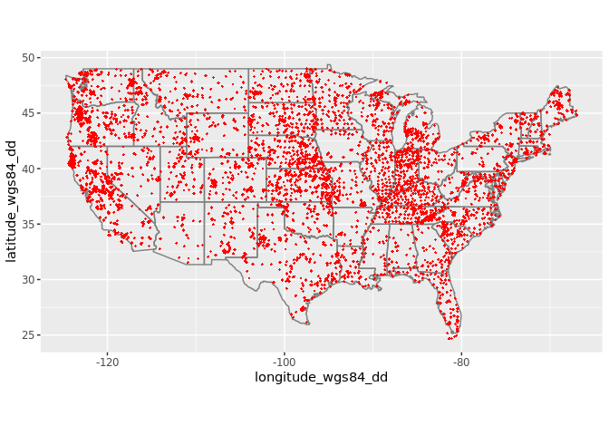

Dataset import: Kellogg Soil Survey Laboratory (KSSL)
================
Tomislav Hengl (<tom.hengl@opengeohub.org>) and Jonathan Sanderman (<jsanderman@woodwellclimate.org>)
26 November, 2021


[](https://soilspectroscopy.org/)

[](http://creativecommons.org/licenses/by-sa/4.0/)

This work is licensed under a [Creative Commons
Attribution-ShareAlike 4.0 International
License](http://creativecommons.org/licenses/by-sa/4.0/).

## Kellogg Soil Survey Laboratory inputs

Part of: <https://github.com/soilspectroscopy>  
Project: [Soil Spectroscopy for Global
Good](https://soilspectroscopy.org)  
Last update: 2021-11-26  
Dataset: [KSSL.SSL](https://soilspectroscopy.github.io/ossl-manual/soil-spectroscopy-tools-and-users.html#kssl.ssl)

The USDA-NRCS Kellogg Soil Survey Laboratory has a large and growing
mid-infrared (MIR) spectral library. Calibration models are being
developed to predict soil properties from MIR spectra. Dataset
properties are explained in detail in Wijewardane, Ge, Wills, & Libohova
([2018](#ref-wijewardane2018predicting)) and Sanderman, Savage, & Dangal
([2020](#ref-sanderman2020mid)).

Input datasets:

  - `MIR_Spectra_Library_spectra_202011_202107.csv`: MIR soil spectral
    reflectances (\>1700 channels);
  - `vnir_09MAR2021.rds`: VNIR soil spectral reflectances (2151
    channels) imported;  
  - `All_Spectra_Access_Portable_7-7-21.mdb`: original DB as Microsoft
    Access MDB file;

For the DB structure and use refer to “Introduction to the KSSL
Laboratory Information Management System” contacts: Rich Ferguson &
Scarlett Murphy (NRCS USDA).

The directory/folder path:

``` r
dir = "/mnt/soilspec4gg/ossl/dataset/KSSL/" 
```

## Import soil laboratory DB

Soil site and laboratory data import:

``` r
if(!exists("kssl.df")){
  kssl.df = mdb.get(paste(dir, "All_Spectra_Access_Portable_7-7-21.mdb", sep = ""))
}
```

``` r
names(kssl.df$sample)
```

    ##  [1] "smp.id"            "lay.id"            "smp.type"          "qc.control.type"   "smp.condition"     "smp.field.vol"    
    ##  [7] "smp.wt"            "instr.id"          "smp.submit.id"     "smp.rcvd.date.id"  "smp.logger.id"     "smp.login.date.id"
    ## [13] "smp.status"        "aphis.reg.code"

``` r
analyte.check = as.data.frame(kssl.df$analyte)
names(kssl.df)
```

    ##  [1] "analyte"            "area"               "calc"               "centroid"           "layer_analyte"     
    ##  [6] "lims_ped_tax_hist"  "lims_pedon"         "lims_site"          "mir_scan_det_data"  "mir_scan_mas_data" 
    ## [11] "project"            "sample"             "site_area_overlap"  "vnir_scan_det_data" "vnir_scan_mas_data"
    ## [16] "layer"              "result"

## Soil laboratory data

Not all soil variables have enough measurements for calibration purposes
and for this reason it was set up a table containing the target
variables
    (`OSSL_soilvars.csv`):

``` r
summary(as.factor(kssl.df$layer_analyte$analyte.id), maxsum = 10)
```

    ##     622     623     624     420     479    1424      34      51      50 (Other) 
    ##   96052   96051   96048   95632   93516   64031   60498   60349   60320 2919453

Join samples with measured soil
analytics

``` r
kssl.y = plyr::join(kssl.df$layer_analyte[,c("lay.analyte.id", "lay.id", "lab.id", "analyte.id", "calc.value")],
                    kssl.df$analyte[,c("analyte.id", "analyte.code", "analyte.abbrev", "uom.abbrev", "analyte.name", "analyte.desc")])
```

    ## Joining by: analyte.id

``` r
kssl.y$analyte_abbrev = kssl.y$analyte.abbrev
```

Join samples with soil analytics calculated by some
formula

``` r
kssl.calc = plyr::join(kssl.df$result[, c("result.id", "result.source.id", "calc.id", "lab.id", "calc.value")], 
                       kssl.df$calc[, c("calc.id", "calc.abbrev", "calc.name", "uom.abbrev", "calc.desc", "calc.algorithm.desc")])
```

    ## Joining by: calc.id

The target soil variables were defined in the `OSSL_soilvars.csv` table:

``` r
analyte = read.csv(paste0(dir, "OSSL_soilvars.csv"))
str(analyte$analyte.id)
```

    ##  int [1:56] 795 65 69 59 NA 4 5 722 622 54 ...

``` r
soil.mv = analyte$analyte_abbrev[which(!analyte$analyte.id %in% levels(as.factor(kssl.y$analyte.id)))]
soil.mv
```

    ## [1] "bsesat_cec3"  "ecec"         "eoc_tot_c"    "sand_tot_psa" "silt_tot_psa" "bs_nh4oac"    ""

Copy values of selected derived variables:

``` r
calc.lst = lapply(soil.mv[1:6], function(i){
  calc.id.tmp <- as.integer(strsplit(analyte[analyte$analyte_abbrev==i,"calc.id"], ", ")[[1]]); 
  calc.df <- kssl.calc[kssl.calc$calc.id %in% calc.id.tmp,];
  calc.df$analyte_abbrev <- i; return(calc.df)})
calc.lst <- do.call(rbind, calc.lst)
## layer ID different name:
calc.lst$lay.id = calc.lst$result.source.id
calc.lst$analyte.name = calc.lst$calc.name 
str(calc.lst[,c("analyte_abbrev", "calc.value", "lay.id", "analyte.name")])
```

    ## 'data.frame':    329570 obs. of  4 variables:
    ##  $ analyte_abbrev: chr  "bsesat_cec3" "bsesat_cec3" "bsesat_cec3" "bsesat_cec3" ...
    ##  $ calc.value    : 'labelled' chr  "85" "63" "100" "100" ...
    ##   ..- attr(*, "label")= chr "calc_value"
    ##  $ lay.id        : 'labelled' int  22179 22188 14944 21326 23159 22189 22196 16907 16096 22191 ...
    ##   ..- attr(*, "label")= chr "result_source_id"
    ##  $ analyte.name  : 'labelled' chr  "Base Saturation, NH4OAc, pH 7.0, CECd-Set 1" "Base Saturation, NH4OAc, pH 7.0, CECd-Set 1" "Base Saturation, NH4OAc, pH 7.0, CECd-Set 1" "Base Saturation, NH4OAc, pH 7.0, CECd-Set 1" ...
    ##   ..- attr(*, "label")= chr "calc_name"

To identify how many samples the KSSL library have for each soil
attribute.

``` r
sm = summary(as.factor(kssl.y$analyte.id), maxsum = length(levels(as.factor(kssl.y$analyte.id))))
analyte$count = plyr::join(analyte["analyte.id"], data.frame(count=sm, analyte.id=attr(sm, "names")))$count
```

    ## Joining by: analyte.id

``` r
#analyte = analyte[, c("ossl_code", "analyte.id", "analyte.abbrev", "name", "uom_abbrev", "method_Orig", "priority", "count")]
#write.csv(analyte, paste0(dir, "KSSL_analyte_count.csv"))
```

Bind measured and calculated
values:

``` r
kssl.yl = rbind(kssl.y[,c("lay.id", "lab.id", "analyte_abbrev", "analyte.name", "calc.value")], calc.lst[,c("lay.id", "lab.id", "analyte_abbrev", "analyte.name", "calc.value")])
# Selecting the target variables
sel.col = paste(analyte$analyte_abbrev)
str(sel.col)
```

    ##  chr [1:56] "acid_tea" "al_dith" "al_kcl" "al_ox" "bsesat_cec3" "db_13b" "db_od" "ca_nh4d" "c_tot_ncs" "caco3" "cecd_nh4" ...

``` r
kssl.yl = kssl.yl[which(kssl.yl$analyte_abbrev %in% sel.col),] 
levels(as.factor(kssl.yl$analyte_abbrev))
```

    ##  [1] "acid_tea"     "al_dith"      "al_el_meh3"   "al_kcl"       "al_ox"        "as_el_meh3"   "ba_el_meh3"   "bs_nh4oac"   
    ##  [9] "bsesat_cec3"  "c_gypl2"      "c_tot_ncs"    "ca_el_meh3"   "ca_nh4d"      "caco3"        "cd_el_meh3"   "cecd_nh4"    
    ## [17] "clay_tot_psa" "co_el_meh3"   "cr_el_meh3"   "cu_el_meh3"   "db_13b"       "db_od"        "ec_12pre"     "ecec"        
    ## [25] "eoc_tot_c"    "fe_dith"      "fe_el_meh3"   "fe_kcl"       "fe_ox"        "k_el_meh3"    "k_nh4d"       "mg_el_meh3"  
    ## [33] "mg_nh4d"      "mo_el_meh3"   "n_tot_ncs"    "na_el_meh3"   "na_nh4d"      "p_el_meh3"    "p_mehlich3"   "p_olsn"      
    ## [41] "pb_el_meh3"   "ph_cacl2"     "ph_h2o"       "ph_kcl"       "ph_naf"       "s_tot_ncs"    "sand_tot_psa" "si_el_meh3"  
    ## [49] "silt_tot_psa" "sr_el_meh3"   "w15l2"        "w3cld"        "zn_el_meh3"

``` r
kssl.yl$ossl_code = plyr::join(kssl.yl["analyte_abbrev"], analyte[c("analyte_abbrev", "ossl_code")], match = "first")$ossl_code
```

    ## Joining by: analyte_abbrev

``` r
#summary(as.factor(kssl.yl$ossl_code))
```

Convert long table to wide so that each soil variable gets unique column
and, the mean and mode could be calculated for n replicates/duplicates.
(note: the most computational / time-consuming step usually):

``` r
kssl.yl$calc.value = as.numeric(kssl.yl$calc.value)
kssl.yw = data.table::dcast(as.data.table(kssl.yl), formula = lay.id ~ ossl_code, value.var = "calc.value", fun.aggregate = mean)
dim(kssl.yw) # 95849 observations of 54 variables
```

    ## [1] 95849    54

Check for duplicates:

``` r
sum(duplicated(kssl.yw$lay.id)) # It should be no duplicates
```

    ## [1] 0

Drop any measurements that do not match `MIR spectra` table: (Note:
There were 30,977 observations that did not match up)

``` r
sel.mis0 = which(!kssl.yw$lay.id %in% kssl.x$lay.id)
str(sel.mis0) 
```

    ##  int [1:30977] 1 1638 1639 1642 1643 1654 1657 1658 1684 1743 ...

``` r
kssl.yw = kssl.yw[-sel.mis0,]
# The final soil analytes table
```

Clean up values:

``` r
kssl.yw$id.layer_local_c = kssl.yw$lay.id
kssl.yw = as.data.frame(kssl.yw)
## clean-up:
for(j in names(kssl.yw)){
  if(is.numeric(kssl.yw[,j])){
    kssl.yw[,j] = replace(kssl.yw[,j], is.infinite(kssl.yw[,j]) | is.nan(kssl.yw[,j]), NA)
  }
}
#kssl.yw = do.call(data.frame, lapply(kssl.yw, function(x) replace(x, is.infinite(x) | is.nan(x), NA)))
```

Exporting the table:

``` r
kssl.yw$sample.contact.name_utf8_txt = 'Scarlett Murphy'
kssl.yw$sample.contact.email_ietf_email = 'Scarlett.Murphy@usda.gov'
kssl.yw$id.layer_uuid_c = openssl::md5(make.unique(paste0(kssl.yw$id.layer_local_c)))
x.na = soilab.name[which(!soilab.name %in% names(kssl.yw))]
x.na
```

    ## [1] "sample.doi_idf_c"   "wpg2_usda.3a2_wpct"

``` r
if(length(x.na)>0){ for(i in x.na){ kssl.yw[,i] <- NA } }
soilab.rds = paste0(dir, "ossl_soillab_v1.rds")
if(!file.exists(soilab.rds)){
  saveRDS.gz(kssl.yw[,soilab.name], soilab.rds)
}
```

## Soil site data

Soil site information includes coordinates, soil site and soil horizon
description
information:

``` r
kssl.site = plyr::join_all(list(kssl.df$lims_site, kssl.df$layer, kssl.df$lims_pedon), by="lims.site.id")
kssl.site$pedon.taxa_usda_c = plyr::join(kssl.site[c("lims.pedon.id")], kssl.df$lims_ped_tax_hist[c("lims.pedon.id", "taxonomic.classification.name")], match = "first")$taxonomic.classification.name
```

    ## Joining by: lims.pedon.id

``` r
dim(kssl.site)
```

    ## [1] 173017     41

Convert coordinates to WGS coordinates:

``` r
library(sp)
datum.ls = summary(as.factor(kssl.site$horizontal.datum.name))
datum.ls
```

    ##                     NAD27        NAD83         NULL old hawaiian        WGS84 
    ##       121953         1988        25444           39           93        23500

``` r
xy.lon = kssl.site$longitude.degrees + kssl.site$longitude.minutes/60 + kssl.site$longitude.seconds/3600
#summary(as.factor(kssl.site$latitude.direction))
#summary(as.factor(kssl.site$longitude.direction))
xy.lat = kssl.site$latitude.degrees + kssl.site$latitude.minutes/60 + kssl.site$latitude.seconds/3600
kssl.site$longitude_wgs84_dd = ifelse(kssl.site$longitude.direction=="east", xy.lon, -xy.lon)
kssl.site$latitude_wgs84_dd = ifelse(kssl.site$latitude.direction=="south", -xy.lat, xy.lat)
## https://epsg.io/4269
for(k in c("NAD83")){ ## "NAD27"
  sel.gps = which(kssl.site$horizontal.datum.name %in% k)
  if(length(sel.gps)>0){
    kssl.xy = kssl.site[sel.gps, c("lay.id", "longitude_wgs84_dd", "latitude_wgs84_dd")]
    kssl.xy = kssl.xy[!is.na(kssl.xy$longitude_wgs84_dd)&!is.na(kssl.xy$latitude_wgs84_dd),]
    coordinates(kssl.xy) = ~ longitude_wgs84_dd + latitude_wgs84_dd
    if(k=="NAD83"){ 
      proj4string(kssl.xy) <- CRS("+proj=longlat +ellps=GRS80")
    } else {
      proj4string(kssl.xy) <- CRS("+proj=longlat +ellps=clrk66 +datum=NAD27 +no_defs")
    }
    kssl.xy.ll = spTransform(kssl.xy, CRS("+proj=longlat +ellps=WGS84 +datum=WGS84"))
    ri = which(kssl.site$lay.id %in% kssl.xy.ll$lay.id)
    kssl.site[ri,"longitude_wgs84_dd"] = kssl.xy.ll@coords[,1]
    kssl.site[ri,"latitude_wgs84_dd"] = kssl.xy.ll@coords[,2]
  }
}
```

    ## Warning in showSRID(uprojargs, format = "PROJ", multiline = "NO", prefer_proj = prefer_proj): Discarded datum Unknown based on
    ## GRS80 ellipsoid in Proj4 definition

``` r
#plot(kssl.site[,c("longitude_wgs84_dd","latitude_wgs84_dd")])
## Discarded datum Unknown based on GRS80 ellipsoid in CRS definition
```

Add the [Open Location
Code](https://cran.r-project.org/web/packages/olctools/vignettes/Introduction_to_olctools.html)
to the site
table:

``` r
kssl.site$id.location_olc_c = olctools::encode_olc(kssl.site$latitude_wgs84_dd, kssl.site$longitude_wgs84_dd, 10)
kssl.site$id.location_olc_c[1:5]
```

    ## [1] "84PRGW8V+X6" "84PRGW8V+X6" "84PRGW8V+X6" "84PRGW8V+X6" "84PRGW8V+X6"

Add the [Universal Unique
Identifier](https://cran.r-project.org/web/packages/uuid/)
(UUI):

``` r
kssl.site$id.layer_uuid_c = plyr::join(kssl.site["lay.id"], kssl.yw[,c("lay.id", "id.layer_uuid_c")])$id.layer_uuid_c 
```

    ## Joining by: lay.id

Add observation date from the project fiscal year (only year
available):

``` r
kssl.site$observation.date.begin_iso.8601_yyyy.mm.dd = as.Date(paste(plyr::join(kssl.site["proj.id"], kssl.df$project[,c("proj.id", "fiscal.year")])$fiscal.year), format="%Y")
```

    ## Joining by: proj.id

``` r
kssl.site$observation.date.end_iso.8601_yyyy.mm.dd = kssl.site$observation.date.begin_iso.8601_yyyy.mm.dd
kssl.site$location.address_utf8_txt = plyr::join(kssl.site["proj.id"], kssl.df$project[,c("proj.id", "submit.proj.name")])$submit.proj.name
```

    ## Joining by: proj.id

Missing coordinates can be derived from county
names:

``` r
site_id.df = plyr::join(kssl.site[,c("lay.id","lims.site.id","longitude_wgs84_dd","latitude_wgs84_dd")], plyr::join_all(list(kssl.df$centroid, kssl.df$area, kssl.df$site_area_overlap)), match="first")
```

    ## Joining by: area.id
    ## Joining by: area.id

    ## Joining by: lims.site.id

``` r
kssl.site$longitude_wgs84_dd = ifelse(is.na(kssl.site$longitude_wgs84_dd), site_id.df$long.xcntr, kssl.site$longitude_wgs84_dd)
kssl.site$latitude_wgs84_dd = ifelse(is.na(kssl.site$latitude_wgs84_dd), site_id.df$lat.ycntr, kssl.site$latitude_wgs84_dd)
```

We assume that the location accuracy for centroid coordinates
(`long.xcntr` and `lat.ycntr`) corresponds to the size of the county,
otherwise it is 30-m i.e. standard GPS location accuracy:

``` r
if(!exists("usa.county")){
  usa.county = rgdal::readOGR(paste0(dir, "tl_2017_us_county/tl_2017_us_county.shp"))  
}
length(usa.county)
```

    ## [1] 3233

``` r
## 3233 counties
usa.county$fips.code = paste0(usa.county$STATEFP, usa.county$COUNTYFP)
usa.county@data[usa.county$fips.code=="17099",]
```

    ##      STATEFP COUNTYFP COUNTYNS GEOID    NAME       NAMELSAD LSAD CLASSFP MTFCC CSAFP CBSAFP METDIVFP FUNCSTAT      ALAND
    ## 1871      17      099 00422247 17099 LaSalle LaSalle County   06      H1 G4020   176  36860     <NA>        A 2939990781
    ##        AWATER    INTPTLAT     INTPTLON fips.code
    ## 1871 33693285 +41.3433407 -088.8859312     17099

``` r
kssl.site$location.error_any_m = 30
site_id.df$location.error_any_m = sqrt(as.numeric(plyr::join(site_id.df["fips.code"], usa.county@data[,c("fips.code","ALAND")])$ALAND)/pi)
```

    ## Joining by: fips.code

``` r
kssl.site$location.error_any_m = ifelse(is.na(kssl.site$latitude.seconds), site_id.df$location.error_any_m, kssl.site$location.error_any_m)
summary(kssl.site$location.error_any_m)
```

    ##    Min. 1st Qu.  Median    Mean 3rd Qu.    Max.    NA's 
    ##      30      30   21959   20345   30285  122432   13449

``` r
#head(kssl.site, 5)
#colnames(kssl.site)
```

Summarizing the soil site
info:

``` r
summary(as.factor(ifelse(kssl.site$location.error_any_m==30, "GPS", "County centroids")))
```

    ## County centroids              GPS             NA's 
    ##           111867            47701            13449

``` r
kssl.site$location.method_any_c = ifelse(kssl.site$location.error_any_m==30, "GPS", "County centroids")
```

Remove all rows that do not match `MIR spectra` table (this is a Soil
Spectral DB so spectra should be available):

``` r
sel.mis = which(!kssl.site$lay.id %in% kssl.x$lay.id)
str(sel.mis)
```

    ##  int [1:55799] 1822 1823 1825 1827 1836 1841 1845 1869 1926 1944 ...

``` r
## 33123
kssl.sitef = kssl.site[-sel.mis,]
```

Add missing columns:

``` r
kssl.sitef$location.country_iso.3166_c = "USA"
kssl.sitef$id.layer_local_c = kssl.sitef$lay.id
kssl.sitef$observation.ogc.schema.title_ogc_txt = 'Open Soil Spectroscopy Library'
kssl.sitef$observation.ogc.schema_idn_url = 'https://soilspectroscopy.github.io'
kssl.sitef$surveyor.title_utf8_txt = 'USDA Natural Resource Conservation Service (NRCS) staff'
kssl.sitef$surveyor.contact_ietf_email = 'rich.ferguson@usda.gov'
kssl.sitef$surveyor.address_utf8_txt = 'USDA-NRCS-NSSC, Federal Building, Room 152, Mail Stop, 100 Centennial Mall North, Lincoln, NE'
kssl.sitef$dataset.title_utf8_txt = 'Kellogg Soil Survey Laboratory database'
kssl.sitef$dataset.owner_utf8_txt = 'USDA, Soil and Plant Science Division, National Soil Survey Center'
kssl.sitef$dataset.code_ascii_c = 'KSSL.SSL'
kssl.sitef$dataset.address_idn_url = 'https://ncsslabdatamart.sc.egov.usda.gov/'
kssl.sitef$dataset.license.title_ascii_txt = 'CC-BY'
kssl.sitef$dataset.license.address_idn_url = 'https://ncsslabdatamart.sc.egov.usda.gov/datause.aspx'
kssl.sitef$dataset.doi_idf_url = ''
kssl.sitef$dataset.contact.name_utf8_txt = 'Scarlett Murphy'
kssl.sitef$dataset.contact_ietf_email = 'Scarlett.Murphy@usda.gov'
kssl.sitef$id.project_ascii_c = kssl.sitef$proj.id
kssl.sitef$layer.sequence_usda_uint16 = ''
kssl.sitef$layer.type_usda_c = ''
kssl.sitef$layer.field.label_any_c = ''
kssl.sitef$layer.upper.depth_usda_cm = kssl.sitef$lay.depth.to.top
kssl.sitef$layer.lower.depth_usda_cm = kssl.sitef$lay.depth.to.bottom
kssl.sitef$horizon.designation_usda_c = paste(kssl.sitef$horz.desgn.master, kssl.sitef$horz.desgn.master.prime, kssl.sitef$horz.desgn.vertical.subdvn, sep="_")
kssl.sitef$horizon.designation.discontinuity_usda_c = kssl.sitef$horz.desgn.discontinuity
kssl.sitef$layer.texture_usda_c = kssl.sitef$texture.description
kssl.sitef$layer.sequence_usda_uint16 = kssl.sitef$lay.rpt.seq.num
kssl.sitef$id.user.site_ascii_c = kssl.sitef$user.site.id
```

Export the final soil site tables:

``` r
x.na = site.name[which(!site.name %in% names(kssl.sitef))]
x.na
```

    ## [1] "dataset.doi_idf_c"             "pedon.completeness_usda_uint8" "layer.structure.type_usda_c"  
    ## [4] "layer.structure.grade_usda_c"

``` r
if(length(x.na)>0){ for(i in x.na){ kssl.sitef[,i] <- NA } }
#str(kssl.sitef[,site.name])
#summary(is.na(kssl.sitef$longitude_wgs84_dd))
summary(as.factor(kssl.sitef$location.method_any_c))
```

    ## County centroids              GPS             NA's 
    ##            67600            40948             8670

``` r
#County centroids              GPS             NA's 
#           67600            40948             8670
site.rds = paste0(dir, "ossl_soilsite_v1.rds")
if(!file.exists(site.rds)){
  saveRDS.gz(kssl.sitef[,site.name], site.rds)
}
```

## Mid-infrared spectroscopy data

Mid-infrared (MIR) soil spectroscopy raw
data:

``` r
kssl.x = vroom::vroom(paste0(dir, "MIR_Spectra_Library_spectra_202011_202107.csv"))
dim(kssl.x)
```

Add the [Universal Unique
Identifier](https://cran.r-project.org/web/packages/uuid/)
(UUI):

``` r
kssl.x$id.scan_uuid_c = openssl::md5(make.unique(paste0("KSSL.SSL", kssl.x$sample_id)))
```

For MIR drop the “XF” = different preparation method spectra scans. The
column names require some adjustments:

``` r
kssl.x$smp.id = substr(kssl.x$sample_id, 1, nchar(kssl.x$sample_id)-2)
str(kssl.x$smp.id)
```

    ##  chr [1:70639] "32987" "32988" "32989" "32990" "32991" "32992" "32993" "32994" "32995" "32996" "32997" "32998" "32999" ...

``` r
length(labels(as.factor(unique(kssl.x$smp.id))))
```

    ## [1] 70004

``` r
kssl.x$lay.id = plyr::join(kssl.x[,c("sample_id","smp.id")], kssl.df$sample, by="smp.id", match = "first")$lay.id
length(labels(as.factor(unique(kssl.x$lay.id))))
```

    ## [1] 69981

``` r
## 69,981
```

Select final columns of interest and export soil spectra table:

``` r
sel.d = grep("XF", kssl.x$sample_id, ignore.case = FALSE)
str(sel.d)
```

    ##  int(0)

``` r
sel.xs = unique(c(grep("XS", kssl.x$sample_id), grep("XN", kssl.x$sample_id)))
sel.abs = names(kssl.x)[-which(names(kssl.x) %in% c("id.scan_uuid_c", "lay.id", "smp.id", "sample_id"))]
## 1699
kssl.abs = as.data.frame(kssl.x)[sel.xs, c("id.scan_uuid_c", "lay.id", "smp.id", sel.abs)]
dim(kssl.abs)
```

    ## [1] 69914  1702

Small number of rows are duplicates:

``` r
sum(duplicated(kssl.abs$lay.id))
```

    ## [1] 77

Resampling the MIR spectra from the original window size to 2 cm-1 in
`kssl.abs`. This operation can be time-consuming:

``` r
wav.mir = as.numeric(gsub("X", "", sel.abs)) # Get wavelength only
summary(wav.mir)
```

    ##    Min. 1st Qu.  Median    Mean 3rd Qu.    Max. 
    ##     602    1451    2300    2300    3149    3998

``` r
# Creating a matrix with only spectral values to resample it
kssl.mir.spec = as.matrix(kssl.abs[,sel.abs])
colnames(kssl.mir.spec) = wav.mir
rownames(kssl.mir.spec) = kssl.abs$id.scan_uuid_c
## remove values out of range
kssl.mir = prospectr::resample(kssl.mir.spec, wav.mir, seq(600, 4000, 2), interpol = "spline") 
## Wavelength by 2 cm-1
kssl.mir = as.data.frame(kssl.mir)
mir.n = paste0("scan_mir.", seq(600, 4000, 2), "_abs")
colnames(kssl.mir) = mir.n
dim(kssl.mir)
```

    ## [1] 69914  1701

Original spectrum range from 4000 to 603 cm-1 with window size of ~1-2
cm-1. The absorbance values can range from 0 (reflectance = 1) to 3
(reflectance = 0.001) hightlighting that is not common in soils
absorbance above 3. This means the electromagnetic energy (light)
blocked by the sample is 99.9% when absorbance value is 3. Cleaning
values out of
range:

``` r
kssl.mir.f = parallel::mclapply(kssl.mir, function(j){ round(ifelse(j<0, NA, ifelse(j>3, NA, j))*1000) }, mc.cores=80)
kssl.mir.f = as.data.frame(do.call(cbind, kssl.mir.f))
```

Plotting MIR spectra to see if it is still negative values in the table:

``` r
#str(names(kssl.mir.f))
kssl.mir.f$id.scan_uuid_c = rownames(kssl.mir)
matplot(y=as.vector(t(kssl.mir.f[5700,mir.n])), x=seq(600, 4000, 2),
        ylim = c(0,3000),
        type = 'l', 
        xlab = "Wavelength", 
        ylab = "Absorbance"
        )
```

<!-- -->

Export final MIR
table:

``` r
kssl.mir.f$id.layer_local_c = plyr::join(kssl.mir.f["id.scan_uuid_c"], kssl.abs[c("id.scan_uuid_c","lay.id")])$lay.id
```

    ## Joining by: id.scan_uuid_c

``` r
str(kssl.mir.f$id.layer_local_c)
```

    ##  'labelled' int [1:69914] 4301 4302 4303 4304 4305 4306 4307 4308 4309 4310 ...
    ##  - attr(*, "label")= chr "lay_id"

``` r
kssl.mir.f$id.layer_uuid_c = plyr::join(kssl.mir.f["id.layer_local_c"], kssl.yw[c("id.layer_local_c","id.layer_uuid_c")], match="first")$id.layer_uuid_c
```

    ## Joining by: id.layer_local_c

``` r
summary(is.na(kssl.mir.f$id.layer_uuid_c))
```

    ##    Mode   FALSE    TRUE 
    ## logical   64788    5126

``` r
## 5126 with missing values
kssl.mir.f$id.scan_local_c = plyr::join(kssl.mir.f["id.scan_uuid_c"], kssl.abs[c("id.scan_uuid_c","smp.id")])$smp.id
```

    ## Joining by: id.scan_uuid_c

``` r
kssl.mir.f$model.name_utf8_txt = "Bruker Vertex 70 with HTS-XT accessory"
kssl.mir.f$model.code_any_c = "Bruker_Vertex_70.HTS.XT"
kssl.mir.f$method.light.source_any_c = ""
kssl.mir.f$method.preparation_any_c = ""
kssl.mir.f$scan.file_any_c = ""
kssl.mir.f$scan.date.begin_iso.8601_yyyy.mm.dd = as.Date("2020-11-20")
kssl.mir.f$scan.date.end_iso.8601_yyyy.mm.dd = as.Date("2020-11-20")
kssl.mir.f$scan.license.title_ascii_txt = "CC-BY"
kssl.mir.f$scan.license.address_idn_url = "https://ncsslabdatamart.sc.egov.usda.gov/datause.aspx"
kssl.mir.f$scan.doi_idf_c = ""
kssl.mir.f$scan.contact.name_utf8_txt = "Scarlett Murphy"
kssl.mir.f$scan.contact.email_ietf_email = "Scarlett.Murphy@usda.gov"
```

Save to RDS file:

``` r
x.na = mir.name[which(!mir.name %in% names(kssl.mir.f))]
if(length(x.na)>0){ for(i in x.na){ kssl.mir.f[,i] <- NA } }
str(kssl.mir.f[,mir.name[1:24]])
```

    ## 'data.frame':    69914 obs. of  24 variables:
    ##  $ id.scan_uuid_c                     : chr  "a10c95104a1549ad1484426cd1595cdb" "789afd6f9f974918679149fef98c5000" "ef4d512f70b2b3259de12b4e5978558c" "31f753480956b63da64e5c5c916bab9a" ...
    ##  $ id.scan_local_c                    : chr  "32987" "32988" "32989" "32990" ...
    ##  $ id.layer_uuid_c                    : chr  "147540e129e096fa91700e9db6588354" "b90ba83119860d7f6a6dfaab9f2aa150" "b052e2e0c0ad1b2d5036bd56e27d061c" "7e889fb76e0e07c11733550f2a6c7a5a" ...
    ##  $ id.layer_local_c                   : 'labelled' int  4301 4302 4303 4304 4305 4306 4307 4308 4309 4310 ...
    ##   ..- attr(*, "label")= chr "lay_id"
    ##  $ model.name_utf8_txt                : chr  "Bruker Vertex 70 with HTS-XT accessory" "Bruker Vertex 70 with HTS-XT accessory" "Bruker Vertex 70 with HTS-XT accessory" "Bruker Vertex 70 with HTS-XT accessory" ...
    ##  $ model.code_any_c                   : chr  "Bruker_Vertex_70.HTS.XT" "Bruker_Vertex_70.HTS.XT" "Bruker_Vertex_70.HTS.XT" "Bruker_Vertex_70.HTS.XT" ...
    ##  $ method.light.source_any_c          : chr  "" "" "" "" ...
    ##  $ method.preparation_any_c           : chr  "" "" "" "" ...
    ##  $ scan.file_any_c                    : chr  "" "" "" "" ...
    ##  $ scan.date.begin_iso.8601_yyyy.mm.dd: Date, format: "2020-11-20" "2020-11-20" "2020-11-20" "2020-11-20" ...
    ##  $ scan.date.end_iso.8601_yyyy.mm.dd  : Date, format: "2020-11-20" "2020-11-20" "2020-11-20" "2020-11-20" ...
    ##  $ scan.license.title_ascii_txt       : chr  "CC-BY" "CC-BY" "CC-BY" "CC-BY" ...
    ##  $ scan.license.address_idn_url       : chr  "https://ncsslabdatamart.sc.egov.usda.gov/datause.aspx" "https://ncsslabdatamart.sc.egov.usda.gov/datause.aspx" "https://ncsslabdatamart.sc.egov.usda.gov/datause.aspx" "https://ncsslabdatamart.sc.egov.usda.gov/datause.aspx" ...
    ##  $ scan.doi_idf_c                     : chr  "" "" "" "" ...
    ##  $ scan.contact.name_utf8_txt         : chr  "Scarlett Murphy" "Scarlett Murphy" "Scarlett Murphy" "Scarlett Murphy" ...
    ##  $ scan.contact.email_ietf_email      : chr  "Scarlett.Murphy@usda.gov" "Scarlett.Murphy@usda.gov" "Scarlett.Murphy@usda.gov" "Scarlett.Murphy@usda.gov" ...
    ##  $ scan_mir.600_abs                   : num  1613 1561 1710 1653 1517 ...
    ##  $ scan_mir.602_abs                   : num  1615 1567 1720 1659 1525 ...
    ##  $ scan_mir.604_abs                   : num  1617 1576 1729 1668 1537 ...
    ##  $ scan_mir.606_abs                   : num  1620 1584 1737 1679 1550 ...
    ##  $ scan_mir.608_abs                   : num  1624 1592 1746 1689 1561 ...
    ##  $ scan_mir.610_abs                   : num  1627 1600 1755 1697 1571 ...
    ##  $ scan_mir.612_abs                   : num  1630 1607 1763 1702 1577 ...
    ##  $ scan_mir.614_abs                   : num  1633 1612 1768 1707 1582 ...

``` r
mir.rds = paste0(dir, "ossl_mir_v1.rds")
if(!file.exists(mir.rds)){
  saveRDS.gz(kssl.mir.f[,mir.name], mir.rds)
}
rm(kssl.mir.spec); rm(kssl.mir); rm(kssl.abs)
gc()
```

    ##             used   (Mb) gc trigger    (Mb)   max used    (Mb)
    ## Ncells  17162230  916.6   30257581  1616.0   30257581  1616.0
    ## Vcells 805355736 6144.4 2148284288 16390.2 1790167046 13657.9

## Visible and near-infrared spectroscopy data

Visible and near-infrared (VNIR) imported using `get_spectra` function
from [asdreader
package](https://rdrr.io/cran/asdreader/man/get_spectra.html):

``` r
kssl.vnir = readRDS.gz(paste0(dir, "vnir_09MAR2021.rds"))
dim(kssl.vnir)
```

    ## [1] 69715  2162

Clean up / remove negative values:

``` r
sel.vnir = grep("spec.vnir_", names(kssl.vnir))
#hist(as.vector(unlist(kssl.vnir[,sel.vnir[sample.int(length(sel.vnir), 10)]])), breaks=45, main="VisNIR")
kssl.vnir.f = parallel::mclapply(kssl.vnir[,sel.vnir], function(j){round(ifelse(j<0, NA, ifelse(j>1, NA, j))*100, 1)}, mc.cores=80)
kssl.vnir.f = as.data.frame(do.call(cbind, kssl.vnir.f))
dim(kssl.vnir.f)
```

    ## [1] 69715  2151

``` r
vnir.s = sapply(names(kssl.vnir)[sel.vnir], function(i){ strsplit(i, "_")[[1]][2] })
vnir.n = paste0("scan_visnir.", vnir.s, "_pcnt")
names(kssl.vnir.f) = vnir.n
```

Plot and check individual curves:

``` r
#str(names(kssl.mir.f))
kssl.vnir.f$smp.id = kssl.vnir$smp.id
matplot(y=as.vector(t(kssl.vnir.f[4700,vnir.n])), x=vnir.s,
        ylim = c(0,60),
        type = 'l', 
        xlab = "Wavelength", 
        ylab = "Reflectance"
        )
```

<!-- -->

Adding basic
columns:

``` r
kssl.vnir.f$id.layer_local_c = plyr::join(kssl.vnir.f[c("smp.id")], kssl.x[c("id.scan_uuid_c", "smp.id", "lay.id")], match = "first")$lay.id
```

    ## Joining by: smp.id

``` r
summary(is.na(kssl.vnir.f$smp.id))
```

    ##    Mode   FALSE    TRUE 
    ## logical   68259    1456

``` r
kssl.vnir.f$id.scan_uuid_c = plyr::join(kssl.vnir.f[c("smp.id")], kssl.x[c("id.scan_uuid_c", "smp.id")], match = "first")$id.scan_uuid_c
```

    ## Joining by: smp.id

``` r
summary(is.na(kssl.vnir.f$id.scan_uuid_c))
```

    ##    Mode   FALSE    TRUE 
    ## logical   33836   35879

``` r
## many missing IDs
#   Mode   FALSE    TRUE 
#logical   33836   35879
v.unique_id = openssl::md5(make.unique(paste0("KSSL.SSL", 1:nrow(kssl.vnir.f))))
kssl.vnir.f$id.scan_uuid_c = ifelse(is.na(kssl.vnir.f$id.scan_uuid_c), v.unique_id, kssl.vnir.f$id.scan_uuid_c)
kssl.vnir.f$id.scan_local_c = kssl.vnir.f$smp.id
kssl.vnir.f$id.layer_uuid_c = plyr::join(kssl.vnir.f["id.layer_local_c"], kssl.yw[c("id.layer_local_c","id.layer_uuid_c")], match="first")$id.layer_uuid_c
```

    ## Joining by: id.layer_local_c

``` r
summary(is.na(kssl.vnir.f$id.layer_uuid_c))
```

    ##    Mode   FALSE    TRUE 
    ## logical   33836   35879

``` r
## 34,423 missing id's
kssl.vnir.f$model.name_utf8_txt = "ASD Labspec 2500 with Muglight accessory"
kssl.vnir.f$model.code_any_c = "ASD_Labspec_2500_MA"
kssl.vnir.f$method.light.source_any_c = ""
kssl.vnir.f$method.preparation_any_c = ""
kssl.vnir.f$scan.file_any_c = kssl.vnir$scan.path.name
kssl.vnir.f$scan.date.begin_iso.8601_yyyy.mm.dd = format(as.POSIXct(kssl.vnir$scan.date, format="%d/%m/%y %H:%M:%S"), "%Y-%m-%d %H:%M:%OS")
kssl.vnir.f$scan.date.end_iso.8601_yyyy.mm.dd = format(as.POSIXct(kssl.vnir$scan.date, format="%d/%m/%y %H:%M:%S"), "%Y-%m-%d %H:%M:%OS")
kssl.vnir.f$scan.license.title_ascii_txt = "CC-BY"
kssl.vnir.f$scan.license.address_idn_url = "https://ncsslabdatamart.sc.egov.usda.gov/datause.aspx"
kssl.vnir.f$scan.doi_idf_c = ""
kssl.vnir.f$scan.contact.name_utf8_txt = "Scarlett Murphy"
kssl.vnir.f$scan.contact.email_ietf_email = "Scarlett.Murphy@usda.gov"
```

Save final table:

``` r
x.na = visnir.name[which(!visnir.name %in% names(kssl.vnir.f))]
if(length(x.na)>0){ for(i in x.na){ kssl.vnir.f[,i] <- NA } }
visnir.rds = paste0(dir, "ossl_visnir_v1.rds")
kssl.vnir.f = kssl.vnir.f[!is.na(kssl.vnir.f$smp.id),]
if(!file.exists(visnir.rds)){
  saveRDS.gz(kssl.vnir.f[,visnir.name], visnir.rds)
}
#rm(kssl.vnir)
```

### Quality control

Check if some points don’t have any spectral scans:

``` r
summary(is.na(kssl.mir.f$id.scan_uuid_c))
```

    ##    Mode   FALSE 
    ## logical   69914

``` r
mis.r = kssl.mir.f$id.layer_uuid_c %in% kssl.sitef$id.layer_uuid_c
summary(mis.r)
```

    ##    Mode   FALSE    TRUE 
    ## logical     649   69265

``` r
## some 649 scans have no soil data
```

## Distribution of points

We can plot an USA map showing distribution of the sampling locations
within the
[USA48](https://www.openstreetmap.org/?box=yes&bbox=-124.848974,24.396308,-66.885444,49.384358#map=5/37.941/-95.867)
using:

``` r
library(maps)
library(ggplot2)
#colnames(kssl.sitef)
usa.xy = kssl.sitef[,c("lay.id", "id.location_olc_c", "longitude_wgs84_dd", "latitude_wgs84_dd")]
## Extent: (-124.848974, 24.396308) - (-66.885444, 49.384358)
usa.xy = usa.xy[usa.xy$latitude_wgs84_dd>24.396308 & usa.xy$latitude_wgs84_dd<49.384358 & usa.xy$longitude_wgs84_dd < -66.885444 & usa.xy$longitude_wgs84_dd > -124.848974,]
plt.usa.xy = ggplot(usa.xy, aes(longitude_wgs84_dd, latitude_wgs84_dd)) +
  borders("state") +
  geom_point(shape=18, size=.9, color="red") +
  scale_size_area() +
  coord_quickmap()
plt.usa.xy
```

    ## Warning: Removed 1851 rows containing missing values (geom_point).

<!-- -->

Fig. 1: USDA KSSL locations of sites within USA48.

``` r
#save.image.pigz(file=paste0(dir, "KSSL.RData"), n.cores=80)
#rmarkdown::render("dataset/KSSL/README.rmd")
```

## References

<div id="refs" class="references">

<div id="ref-sanderman2020mid">

Sanderman, J., Savage, K., & Dangal, S. R. (2020). Mid-infrared
spectroscopy for prediction of soil health indicators in the united
states. *Soil Science Society of America Journal*, *84*(1), 251–261.
doi:[10.1002/saj2.20009](https://doi.org/10.1002/saj2.20009)

</div>

<div id="ref-wijewardane2018predicting">

Wijewardane, N. K., Ge, Y., Wills, S., & Libohova, Z. (2018). Predicting
physical and chemical properties of US soils with a mid-infrared
reflectance spectral library. *Soil Science Society of America Journal*,
*82*(3), 722–731. doi:[10.2136/sssaj2017.10.0361](https://doi.org/10.2136/sssaj2017.10.0361)

</div>

</div>
