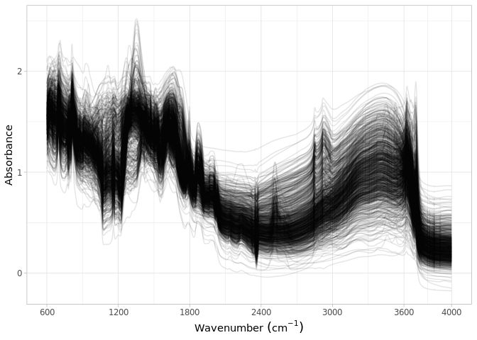

Dataset import: Kellogg Soil Survey Laboratory (KSSL)
================
Jose Lucas Safanelli (<jsafanelli@woodwellclimate.org>), Tomislav Hengl
(<tom.hengl@opengeohub.org>), Jonathan Sanderman
(<jsanderman@woodwellclimate.org>), Develyn Bloom
(<develyn.bloom@ufl.edu>) -
06 December, 2022


-   [Kellogg Soil Survey Laboratory
    inputs](#kellogg-soil-survey-laboratory-inputs)
    -   [Soil site information](#soil-site-information)
    -   [Soil lab information](#soil-lab-information)
    -   [Mid-infrared spectroscopy
        data](#mid-infrared-spectroscopy-data)
    -   [Visible and Near-infrared spectroscopy
        data](#visible-and-near-infrared-spectroscopy-data)
    -   [Quality control](#quality-control)
-   [References](#references)

[](https://soilspectroscopy.org/)

[](http://creativecommons.org/licenses/by-sa/4.0/)

This work is licensed under a [Creative Commons Attribution-ShareAlike
4.0 International
License](http://creativecommons.org/licenses/by-sa/4.0/).

## Kellogg Soil Survey Laboratory inputs

Part of: <https://github.com/soilspectroscopy>  
Project: [Soil Spectroscopy for Global
Good](https://soilspectroscopy.org)  
Last update: 2022-12-06  
Dataset:
[KSSL.SSL](https://soilspectroscopy.github.io/ossl-manual/soil-spectroscopy-tools-and-users.html#kssl.ssl)

The USDA-NRCS NCSS Kellogg Soil Survey Laboratory has a large and
growing mid-infrared (MIR) spectral library. Calibration models are
being developed to predict soil properties from MIR spectra. Dataset
properties are explained in detail in [Wijewardane, Ge, Wills, &
Libohova](#ref-wijewardane2018predicting)
([2018](#ref-wijewardane2018predicting)) and [Sanderman, Savage, &
Dangal](#ref-sanderman2020mid) ([2020](#ref-sanderman2020mid)).

Input datasets (snapshot from Jul 2022):

-   `KSSL_202207_MIR_spectra_all_avg.csv`: csv/rds file with averaged
    MIR scans;
-   `RaCA_measured.csv`: csv/rds file with averaged VNIR scans (from
    RaCA project);
-   `All_Spectra_Access_Portable_20220712`: a folder with all tables
    exported from a Microsoft Access database;

For the DB structure and use refer to “Introduction to the KSSL
Laboratory Information Management System” contacts: Rich Ferguson &
Scarlett Murphy (NRCS USDA).

The directory/folder path:

``` r
dir.files = "/mnt/soilspec4gg/ossl/dataset/KSSL/snapshot_Jul2022"
tic()
```

<!-- Load customized functions: -->
<!-- ```{r, echo=FALSE, eval=FALSE} -->
<!-- #load.pigz(paste0(dir, "KSSL.RData")) -->
<!-- source("../../R-code/functions/SSL_functions.R") -->
<!-- ``` -->
<!-- ## Data import -->

### Soil site information

``` r
dir.db <- paste0(dir.files, "/All_Spectra_Access_Portable_20220712")

# Reading tables with site info
layer <- fread(paste0(dir.db, "/layer.csv"))
sample <- fread(paste0(dir.db, "/sample.csv"))
project <- fread(paste0(dir.db, "/project.csv"))
lims.site <- fread(paste0(dir.db, "/lims_site.csv"))
lims.pedtax <- fread(paste0(dir.db, "/lims_ped_tax_hist.csv"))
centroid <- fread(paste0(dir.db, "/centroid.csv"))
area <- fread(paste0(dir.db, "/area.csv"))
site.area <- fread(paste0(dir.db, "/site_area_overlap.csv"))

# Layer table contains only lay.id and horizon info
layer <- layer %>%
  select(lay.id, lay.type, proj.id, lims.site.id, lims.pedon.id,
         lay.depth.to.top, lay.depth.to.bottom, horizon.designation, texture.description)

# Sample table has lay and smp ids for linking all data in the database
sample <- sample %>%
  select(smp.id, lay.id)

# Project table with date of observation and project name
project <- project %>%
  select(proj.id, fiscal.year, submit.proj.name)

# Coordinates
lims.site <- lims.site %>%
  select(lims.site.id, horizontal.datum.name,
         latitude.std.decimal.degrees, longitude.std.decimal.degrees)

# Taxonomic classification
lims.pedtax <- lims.pedtax %>%
  select(lims.pedon.id, taxonomic.classification.name) %>%
  group_by(lims.pedon.id) %>%
  summarise_all(first)

# County centroids for additional spatial reference
centroid <- centroid %>%
  select(area.id, lat.ycntr, long.xcntr, fips.code)

# Area info
area <- area %>%
  select(area.id, area.type, area.name, area.code)

# Link between layers
site.area <- site.area %>%
  select(lims.site.id, area.id)

# Site area with county coordiantes
site.overview <- site.area %>%
  left_join(area, by = "area.id") %>%
  left_join(centroid, by = "area.id") %>%
  filter(area.type %in% c("county", "country")) %>%
  pivot_wider(names_from = "area.type",
              values_from = c("area.id", "area.name", "area.code")) %>%
  group_by(lims.site.id) %>%
  summarise_all(~first(na.omit(.))) %>%
  left_join(lims.site, by = "lims.site.id")
  
# Joining all data
kssl.sitedata <- layer %>%
  left_join(sample, by = "lay.id") %>%
  relocate(smp.id, .after = "lay.id") %>%
  left_join(project, by = "proj.id") %>%
  left_join(lims.pedtax, by = "lims.pedon.id") %>%
  left_join(site.overview, by = "lims.site.id") %>%
  as_tibble()

# Cleaning repeats and internal projects
kssl.sitedata <- kssl.sitedata %>%
  filter(!(proj.id == 1)) # This proj is used internally

# Just a few repeats, so we can first them
# repeat.ids <- kssl.sitedata %>%
#   group_by(lay.id) %>%
#   summarise(repeats = n()) %>%
#   filter(repeats > 1) %>%
#   pull(lay.id)
# 
# kssl.sitedata %>% filter(lay.id %in% repeat.ids)

kssl.sitedata <- kssl.sitedata %>%
  group_by(lay.id) %>%
  summarise_all(first)

# Available datums
datum.summary <- kssl.sitedata %>%
  rename(hor.datum = horizontal.datum.name) %>%
  group_by(hor.datum) %>%
  summarise(count = n())

datum.summary
```

    ## # A tibble: 7 × 2
    ##   hor.datum      count
    ##   <chr>          <int>
    ## 1 ""             59490
    ## 2 "NAD27"         1938
    ## 3 "NAD83"        21994
    ## 4 "NULL"            39
    ## 5 "old hawaiian"    49
    ## 6 "WGS84"        17035
    ## 7  <NA>           5057

``` r
# We will assume layers with NA, empty and NULL in the datum column as NAD83
# The error between this US system is way smaller than assuming a county centroid
kssl.sitedata <- kssl.sitedata %>%
  mutate(horizontal.datum.name = ifelse(is.na(latitude.std.decimal.degrees),
                            NA, 
                            ifelse(horizontal.datum.name == '' |
                                     horizontal.datum.name == 'NULL' |
                                     is.na(horizontal.datum.name),
                                   "NAD83",
                                   horizontal.datum.name)))

# Corrected datums
datum.summary.cor <- kssl.sitedata %>%
  rename(hor.datum = horizontal.datum.name) %>%
  group_by(hor.datum) %>%
  summarise(count = n())

datum.summary.cor
```

    ## # A tibble: 5 × 2
    ##   hor.datum    count
    ##   <chr>        <int>
    ## 1 NAD27         1927
    ## 2 NAD83        27501
    ## 3 old hawaiian    49
    ## 4 WGS84        15872
    ## 5 <NA>         60253

``` r
# Transforming all datums to WGS84
datums <- kssl.sitedata %>%
  distinct(horizontal.datum.name) %>%
  pull(horizontal.datum.name)

projection.list <- list()

for(i in 1:length(datums)) {
  
  idatum <- datums[i]
  
  if(is.na(idatum)) {
    
    newdata <- kssl.sitedata %>%
      filter(is.na(horizontal.datum.name))
    
  } else if(idatum == "NAD27") {
    
    idata <- kssl.sitedata %>%
      filter(horizontal.datum.name == idatum)
    
    new.coords <- st_as_sf(idata,
                        crs = 4267,
                        coords = c("longitude.std.decimal.degrees",
                                   "latitude.std.decimal.degrees")) %>%
      st_transform(crs = 4326)
    
    newdata <- idata %>%
      mutate(longitude.std.decimal.degrees = st_coordinates(new.coords)[,1],
             latitude.std.decimal.degrees = st_coordinates(new.coords)[,2],
             horizontal.datum.name = "WGS84")
    
  }  else if(idatum == "NAD83") {
    
    idata <- kssl.sitedata %>%
      filter(horizontal.datum.name == idatum)
    
    new.coords <- st_as_sf(idata,
                        crs = 4269,
                        coords = c("longitude.std.decimal.degrees",
                                   "latitude.std.decimal.degrees")) %>%
      st_transform(crs = 4326) 
    
    newdata <- idata %>%
      mutate(longitude.std.decimal.degrees = st_coordinates(new.coords)[,1],
             latitude.std.decimal.degrees = st_coordinates(new.coords)[,2],
             horizontal.datum.name = "WGS84")
    
  } else if(idatum == "old hawaiian") {
    
    idata <- kssl.sitedata %>%
      filter(horizontal.datum.name == idatum)
    
    new.coords <- st_as_sf(idata,
                        crs = 4135,
                        coords = c("longitude.std.decimal.degrees",
                                   "latitude.std.decimal.degrees")) %>%
      st_transform(crs = 4326) 
    
    newdata <- idata %>%
      mutate(longitude.std.decimal.degrees = st_coordinates(new.coords)[,1],
             latitude.std.decimal.degrees = st_coordinates(new.coords)[,2],
             horizontal.datum.name = "WGS84")
    
  } else {
    
    newdata <- kssl.sitedata %>%
      filter(horizontal.datum.name == idatum)
    
  }
  
  projection.list[[i]] <- newdata
  
}

kssl.sitedata <- Reduce(bind_rows, projection.list)

# Correcting incorrect coordinates
check.data <- kssl.sitedata %>%
  filter(longitude.std.decimal.degrees > 0 |
           latitude.std.decimal.degrees < 10) %>%
  select(contains(c("id", "area", "proj", "degrees")))

# Getting project names and ids with issues for comparing with good data
projects <- check.data %>%
  distinct(submit.proj.name) %>%
  pull(submit.proj.name)

wrong.ids <- check.data %>%
  distinct(lay.id) %>%
  pull(lay.id)

# Manually/Visually checking
wrong.data <- kssl.sitedata %>%
  select(contains(c("id", "area", "proj", "degrees"))) %>%
  filter(submit.proj.name %in% projects) %>%
  mutate(wrong = ifelse(lay.id %in% wrong.ids, TRUE, FALSE), .after = 1)

# Unrecoverable coordinates, mistyped?
id.pedons.na <- c(10134, 11930, 12450, 12451, 12452, 12453)

# Pedon ids that need a negative long
id.pedons.neg.longitude <- c(12776, 12778, 12779, 32888, 34509,
                             35124, 35125, 36777, 38043, 38958,
                             39334, 40135)

# Pedon ids that need reverse lat/long, and negative long
id.pedons.reverse.neg.longitude <- c(39332, 39333)

# Site ids that need a negative long
id.site.neg.longitude <- c(33668)

# Final corrected version
kssl.sitedata <- kssl.sitedata %>%
  mutate(longitude.std.decimal.degrees = ifelse(lims.pedon.id %in% id.pedons.na,
                                                NA,
                                                longitude.std.decimal.degrees),
         latitude.std.decimal.degrees = ifelse(lims.pedon.id %in% id.pedons.na, 
                                               NA, 
                                               latitude.std.decimal.degrees)) %>%
  mutate(longitude.std.decimal.degrees = ifelse(lims.pedon.id %in% id.pedons.neg.longitude, 
                                                longitude.std.decimal.degrees*-1, 
                                                longitude.std.decimal.degrees)) %>%
  mutate(longitude.std.decimal.degrees = ifelse(lims.site.id %in% id.site.neg.longitude, 
                                                longitude.std.decimal.degrees*-1, 
                                                longitude.std.decimal.degrees)) %>%
  mutate(temp.long = longitude.std.decimal.degrees,
         temp.lat = latitude.std.decimal.degrees,
         longitude.std.decimal.degrees = ifelse(lims.pedon.id %in% id.pedons.reverse.neg.longitude, 
                                                latitude.std.decimal.degrees*-1, 
                                                longitude.std.decimal.degrees),
         latitude.std.decimal.degrees = ifelse(lims.pedon.id %in% id.pedons.reverse.neg.longitude, 
                                               temp.long, 
                                               temp.lat)) %>%
  select(-temp.long, -temp.lat)

# Summary of pedons, layers and coordinates
sitedata.summary <- kssl.sitedata %>%
      summarise(var = "total_layers", count = n()) %>%
  bind_rows(., tibble(var = "total_profiles", count = {kssl.sitedata %>%
      group_by(lims.pedon.id) %>%
      summarise(first_horizon = first(lay.id)) %>%
      ungroup() %>%
      summarise(count = n()) %>%
      pull(count)})) %>%
  bind_rows(., tibble(var = "profiles_with_point_coords", count = {kssl.sitedata %>%
      group_by(lims.pedon.id) %>%
      summarise(latitude.std.decimal.degrees = mean(latitude.std.decimal.degrees)) %>%
      filter(!is.na(latitude.std.decimal.degrees)) %>%
      ungroup() %>%
      summarise(count = n()) %>%
      pull(count)})) %>%
  bind_rows(., tibble(var = "profiles_with_county_coords", count = {kssl.sitedata %>%
      group_by(lims.pedon.id) %>%
      summarise(lat.ycntr = mean(lat.ycntr)) %>%
      filter(!is.na(lat.ycntr)) %>%
      ungroup() %>%
      summarise(count = n()) %>%
      pull(count)}))

sitedata.summary
```

    ## # A tibble: 4 × 2
    ##   var                          count
    ##   <chr>                        <int>
    ## 1 total_layers                105602
    ## 2 total_profiles               25585
    ## 3 profiles_with_point_coords    9061
    ## 4 profiles_with_county_coords  24871

``` r
# Formatting to OSSL names
kssl.sitedata <- kssl.sitedata %>%
  rename(id.layer_local_c = lay.id,
         id.project_ascii_c = submit.proj.name,
         id.dataset.site_ascii_c = lims.pedon.id,
         layer.upper.depth_usda_cm = lay.depth.to.top,
         layer.lower.depth_usda_cm = lay.depth.to.bottom,
         layer.texture_usda_c = texture.description,
         pedon.taxa_usda_c = taxonomic.classification.name,
         horizon.designation_usda_c = horizon.designation,
         observation.date.end_iso.8601_yyyy.mm.dd = fiscal.year,
         longitude.point_wgs84_dd = longitude.std.decimal.degrees,
         latitude.point_wgs84_dd = latitude.std.decimal.degrees,
         longitude.county_wgs84_dd = long.xcntr,
         latitude.county_wgs84_dd = lat.ycntr) %>%
  mutate(id.layer_local_c = as.character(id.layer_local_c)) %>%
  select(id.layer_local_c, id.project_ascii_c, id.dataset.site_ascii_c,
         layer.upper.depth_usda_cm, layer.lower.depth_usda_cm, layer.texture_usda_c,
         horizon.designation_usda_c, observation.date.end_iso.8601_yyyy.mm.dd,
         longitude.point_wgs84_dd, latitude.point_wgs84_dd,
         longitude.county_wgs84_dd, latitude.county_wgs84_dd) %>%
  mutate(observation.date.end_iso.8601_yyyy.mm.dd = ymd(paste0(observation.date.end_iso.8601_yyyy.mm.dd, "-12-31"))) %>%
  mutate(observation.date.begin_iso.8601_yyyy.mm.dd = floor_date(observation.date.end_iso.8601_yyyy.mm.dd, "year"),
         .before = observation.date.end_iso.8601_yyyy.mm.dd) %>%
  mutate(layer.sequence_usda_uint16 = NA, .after = layer.texture_usda_c) %>%
  mutate(location.point.error_any_m = 30,
         location.country_iso.3166_c = "USA",
         observation.ogc.schema.title_ogc_txt = "Open Soil Spectroscopy Library",
         observation.ogc.schema_idn_url = "https://soilspectroscopy.github.io",
         surveyor.title_utf8_txt = "USDA NRCS staff",
         surveyor.contact_ietf_email = "rich.ferguson@usda.gov",
         surveyor.address_utf8_txt = "USDA-NRCS-NSSC, Federal Building, Room 152, Mail Stop, 100 Centennial Mall North, Lincoln, NE",
         dataset.title_utf8_txt = "Kellogg Soil Survey Laboratory database",
         dataset.owner_utf8_txt = "USDA, Soil and Plant Science Division, National Soil Survey Center",
         dataset.code_ascii_c = "KSSL.SSL",
         dataset.address_idn_url = "https://ncsslabdatamart.sc.egov.usda.gov/",
         dataset.license.title_ascii_txt = "CC-BY",
         dataset.license.address_idn_url = "https://ncsslabdatamart.sc.egov.usda.gov/datause.aspx",
         dataset.doi_idf_url = "",
         dataset.contact.name_utf8_txt = "Scarlett Murphy",
         dataset.contact_ietf_email = "Scarlett.Murphy@usda.gov") %>%
  mutate(id.layer_uuid_c = openssl::md5(as.character(id.layer_local_c)),
         id.location_olc_c = olctools::encode_olc(latitude.point_wgs84_dd, longitude.point_wgs84_dd, 10), 
         .after = id.dataset.site_ascii_c) %>%
  mutate_at(vars(starts_with("id.")), as.character)

# Saving version to dataset root dir
# site.rds = paste0(dirname(dir.files), "/ossl_soilsite_v1.2.rds")
# saveRDS(kssl.sitedata, site.rds)
site.qs = paste0(dirname(dir.files), "/ossl_soilsite_v1.2.qs")
qs::qsave(kssl.sitedata, site.qs, preset = "high")
```

### Soil lab information

NOTE: The code chunk below this paragraph is hidden. Just run once for
getting the original names of soil properties, descriptions, data types,
and units. Run once and upload to Google Sheet for formatting and
integrating with the OSSL. Requires Google authentication.

<!-- ```{r soilab_overview, include=FALSE, echo=FALSE, eval=FALSE} -->
<!-- analyte <- read_csv(paste0(dir, "/All_Spectra_Access_Portable_20220712/analyte.csv")) -->
<!-- calc <- read_csv(paste0(dir, "/All_Spectra_Access_Portable_20220712/calc.csv")) -->
<!-- soillab.names <- analyte %>% -->
<!--   select(analyte.id, analyte.name, analyte.abbrev, uom.abbrev, analyte.desc) %>% -->
<!--   mutate(source = "kssl_analyte", .before = 1) %>% -->
<!--   rename(id = analyte.id, original_name = analyte.name, abbrev = analyte.abbrev, -->
<!--          unit = uom.abbrev, original_description = analyte.desc) %>% -->
<!--   bind_rows({calc %>% -->
<!--       select(calc.id, calc.name, calc.abbrev, uom.abbrev, calc.desc) %>% -->
<!--       mutate(source = "kssl_calc", .before = 1) %>% -->
<!--       rename(id = calc.id, original_name = calc.name, abbrev = calc.abbrev, -->
<!--              unit = uom.abbrev, original_description = calc.desc)}) %>% -->
<!--   arrange(original_name) %>% -->
<!--   dplyr::mutate(import = '', ossl_name = '', .after = original_name) -->
<!-- readr::write_csv(soillab.names, paste0(getwd(), "/kssl_soillab_names.csv")) -->
<!-- # Uploading to google sheet -->
<!-- # FACT CIN folder. Get ID for soildata importing table -->
<!-- googledrive::drive_ls(as_id("0AHDIWmLAj40_Uk9PVA")) -->
<!-- OSSL.soildata.importing <- "19LeILz9AEnKVK7GK0ZbK3CCr2RfeP-gSWn5VpY8ETVM" -->
<!-- # Checking metadata -->
<!-- googlesheets4::as_sheets_id(OSSL.soildata.importing) -->
<!-- # Checking readme -->
<!-- googlesheets4::read_sheet(OSSL.soildata.importing, sheet = 'readme') -->
<!-- # Preparing soillab.names -->
<!-- upload <- dplyr::as_tibble(soillab.names) -->
<!-- # Uploading -->
<!-- googlesheets4::write_sheet(upload, ss = OSSL.soildata.importing, sheet = "KSSL") -->
<!-- # Checking metadata -->
<!-- googlesheets4::as_sheets_id(OSSL.soildata.importing) -->
<!-- ``` -->

NOTE: The code chunk below this paragraph is hidden. Run once for
importing the transformation rules. The table can be edited online at
Google Sheets. A copy is downloaded to github for archiving.

<!-- ```{r soilab_download, include=FALSE, echo=FALSE, eval=FALSE} -->
<!-- # Downloading from google sheet -->
<!-- # FACT CIN folder id -->
<!-- listed.table <- googledrive::drive_ls(as_id("0AHDIWmLAj40_Uk9PVA"), -->
<!--                                       pattern = "OSSL_tab2_soildata_importing") -->
<!-- OSSL.soildata.importing <- listed.table[[1,"id"]] -->
<!-- # Checking metadata -->
<!-- googlesheets4::as_sheets_id(OSSL.soildata.importing) -->
<!-- # Preparing soillab.names -->
<!-- transvalues <- googlesheets4::read_sheet(OSSL.soildata.importing, sheet = "KSSL") %>% -->
<!--   filter(import == TRUE) %>% -->
<!--   select(contains(c("source", "id", "original_name", "ossl_"))) -->
<!-- # Saving to folder -->
<!-- write_csv(transvalues, paste0(getwd(), "/OSSL_transvalues.csv")) -->
<!-- ``` -->

Reading KSSL-to-OSSL transformation values:

``` r
transvalues <- read_csv(paste0(getwd(), "/OSSL_transvalues.csv"))
knitr::kable(transvalues)
```

| source        |   id | kssl\_original\_name                                       | ossl\_abbrev   | ossl\_method | ossl\_unit | ossl\_convert                                      | ossl\_name                        |
|:--------------|-----:|:-----------------------------------------------------------|:---------------|:-------------|:-----------|:---------------------------------------------------|:----------------------------------|
| kssl\_analyte |    4 | Bulk Density, &lt;2mm Fraction, 1/3 Bar                    | bd             | usda.a4      | g.cm3      | ifelse(as.numeric(x) &lt; 0, NA, as.numeric(x)\*1) | bd\_usda.a4\_g.cm3                |
| kssl\_analyte |   21 | Bulk Density, Core, &lt;2 mm fraction, Field Moist         | bd             | usda.a21     | g.cm3      | ifelse(as.numeric(x) &lt; 0, NA, as.numeric(x)\*1) | bd\_usda.a21\_g.cm3               |
| kssl\_calc    |   85 | Weight per Unit Volume, @ 1/3 Bar, Whole Soil              | bd             | usda.c85     | g.cm3      | ifelse(as.numeric(x) &lt; 0, NA, as.numeric(x)\*1) | bd\_usda.c85\_g.cm3               |
| kssl\_calc    |  236 | Coarse Fragments, Greater 2mm, Wt Percent, Whole Soil Base | cf             | usda.c236    | w.pct      | ifelse(as.numeric(x) &lt; 0, NA, as.numeric(x)\*1) | cf\_usda.c236\_w.pct              |
| kssl\_analyte |    9 | Water Retention, 1/3 Bar, &lt;2mm Clod                     | wr.33kPa       | usda.a9      | w.pct      | ifelse(as.numeric(x) &lt; 0, NA, as.numeric(x)\*1) | wr.33kPa\_usda.a9\_w.pct          |
| kssl\_analyte |  415 | Water Retention, 1/3 Bar, &lt;2mm Sieve                    | wr.33kPa       | usda.a415    | w.pct      | ifelse(as.numeric(x) &lt; 0, NA, as.numeric(x)\*1) | wr.33kPa\_usda.a415\_w.pct        |
| kssl\_analyte |    8 | Water Retention, 1/10 Bar, &lt;2mm Clod                    | wr.10kPa       | usda.a8      | w.pct      | ifelse(as.numeric(x) &lt; 0, NA, as.numeric(x)\*1) | wr.10kPa\_usda.a8\_w.pct          |
| kssl\_analyte |  414 | Water Retention, 1/10 Bar, &lt;2mm Sieve, Air-dry          | wr.10kPa       | usda.a414    | w.pct      | ifelse(as.numeric(x) &lt; 0, NA, as.numeric(x)\*1) | wr.10kPa\_usda.a414\_w.pct        |
| kssl\_analyte |  417 | Water Retention, 15 Bar, &lt;2mm, Air-dry                  | wr.1500kPa     | usda.a417    | w.pct      | ifelse(as.numeric(x) &lt; 0, NA, as.numeric(x)\*1) | wr.1500kPa\_usda.a417\_w.pct      |
| kssl\_calc    |   80 | Water Retention Difference, 1/3 to 15 Bar, &lt;2mm         | awc.33.1500kPa | usda.c80     | cm3.cm3    | ifelse(as.numeric(x) &lt; 0, NA, as.numeric(x)\*1) | awc.33.1500kPa\_usda.c80\_cm3.cm3 |
| kssl\_calc    |   60 | Sand, Total                                                | sand.tot       | usda.c60     | w.pct      | ifelse(as.numeric(x) &lt; 0, NA, as.numeric(x)\*1) | sand.tot\_usda.c60\_w.pct         |
| kssl\_calc    |  405 | Sand, Total, N prep                                        | sand.tot       | usda.c405    | w.pct      | ifelse(as.numeric(x) &lt; 0, NA, as.numeric(x)\*1) | sand.tot\_usda.c405\_w.pct        |
| kssl\_calc    |   62 | Silt, Total                                                | silt.tot       | usda.c62     | w.pct      | ifelse(as.numeric(x) &lt; 0, NA, as.numeric(x)\*1) | silt.tot\_usda.c62\_w.pct         |
| kssl\_calc    |  407 | Silt, Total, N prep                                        | silt.tot       | usda.c407    | w.pct      | ifelse(as.numeric(x) &lt; 0, NA, as.numeric(x)\*1) | silt.tot\_usda.c407\_w.pct        |
| kssl\_analyte |  334 | Clay                                                       | clay.tot       | usda.a334    | w.pct      | ifelse(as.numeric(x) &lt; 0, NA, as.numeric(x)\*1) | clay.tot\_usda.a334\_w.pct        |
| kssl\_analyte |    1 | Aggregate Stability, 0.5-2mm Aggregates                    | aggstb         | usda.a1      | w.pct      | ifelse(as.numeric(x) &lt; 0, NA, as.numeric(x)\*1) | aggstb\_usda.a1\_w.pct            |
| kssl\_analyte |  268 | pH, 1:1 Soil-Water Suspension                              | ph.h2o         | usda.a268    | index      | ifelse(as.numeric(x) &lt; 0, NA, as.numeric(x)\*1) | ph.h2o\_usda.a268\_index          |
| kssl\_analyte |  481 | pH, 1:2 Soil-CaCl2 Suspension                              | ph.cacl2       | usda.a481    | index      | ifelse(as.numeric(x) &lt; 0, NA, as.numeric(x)\*1) | ph.cacl2\_usda.a481\_index        |
| kssl\_analyte |  477 | pH, 0.01M CaCl2, Histosol                                  | ph.cacl2       | usda.a477    | index      | ifelse(as.numeric(x) &lt; 0, NA, as.numeric(x)\*1) | ph.cacl2\_usda.a477\_index        |
| kssl\_analyte |  364 | Electrical Conductivity, Predict, 1:2 (w/w)                | ec             | usda.a364    | ds.m       | ifelse(as.numeric(x) &lt; 0, NA, as.numeric(x)\*1) | ec\_usda.a364\_ds.m               |
| kssl\_analyte |  479 | Effervescence, 1N HCl                                      | efferv         | usda.a479    | class      | x                                                  | efferv\_usda.a479\_class          |
| kssl\_analyte |   54 | Carbonate, &lt;2mm Fraction                                | caco3          | usda.a54     | w.pct      | ifelse(as.numeric(x) &lt; 0, NA, as.numeric(x)\*1) | caco3\_usda.a54\_w.pct            |
| kssl\_calc    | 1059 | Estimated Organic Carbon, Total C, N prep                  | oc             | usda.c1059   | w.pct      | ifelse(as.numeric(x) &lt; 0, NA, as.numeric(x)\*1) | oc\_usda.c1059\_w.pct             |
| kssl\_calc    |  729 | Estimated Organic Carbon, Total C, S prep                  | oc             | usda.c729    | w.pct      | ifelse(as.numeric(x) &lt; 0, NA, as.numeric(x)\*1) | oc\_usda.c729\_w.pct              |
| kssl\_analyte |  622 | Carbon, Total NCS                                          | c.tot          | usda.a622    | w.pct      | ifelse(as.numeric(x) &lt; 0, NA, as.numeric(x)\*1) | c.tot\_usda.a622\_w.pct           |
| kssl\_analyte |  623 | Nitrogen, Total NCS                                        | n.tot          | usda.a623    | w.pct      | ifelse(as.numeric(x) &lt; 0, NA, as.numeric(x)\*1) | n.tot\_usda.a623\_w.pct           |
| kssl\_analyte |  624 | Sulfur, Total NCS                                          | s.tot          | usda.a624    | w.pct      | ifelse(as.numeric(x) &lt; 0, NA, as.numeric(x)\*1) | s.tot\_usda.a624\_w.pct           |
| kssl\_analyte |  723 | CEC, NH4OAc, pH 7.0, 2M KCl displacement                   | cec            | usda.a723    | cmolc.kg   | ifelse(as.numeric(x) &lt; 0, NA, as.numeric(x)\*1) | cec\_usda.a723\_cmolc.kg          |
| kssl\_analyte |  722 | Calcium, NH4OAc Extractable, 2M KCl displacement           | ca.ext         | usda.a722    | cmolc.kg   | ifelse(as.numeric(x) &lt; 0, NA, as.numeric(x)\*1) | ca.ext\_usda.a722\_cmolc.kg       |
| kssl\_analyte | 1059 | Calcium, Element Mehlich3 Extractable                      | ca.ext         | usda.a1059   | mg.kg      | ifelse(as.numeric(x) &lt; 0, NA, as.numeric(x)\*1) | ca.ext\_usda.a1059\_mg.kg         |
| kssl\_analyte |  724 | Magnesium, NH4OAc Extractable, 2M KCl displacement         | mg.ext         | usda.a724    | cmolc.kg   | ifelse(as.numeric(x) &lt; 0, NA, as.numeric(x)\*1) | mg.ext\_usda.a724\_cmolc.kg       |
| kssl\_analyte | 1066 | Magnesium, Element Mehlich3 Extractable                    | mg.ext         | usda.a1066   | mg.kg      | ifelse(as.numeric(x) &lt; 0, NA, as.numeric(x)\*1) | mg.ext\_usda.a1066\_mg.kg         |
| kssl\_analyte |  726 | Sodium, NH4OAc Extractable, 2M KCl displacement            | na.ext         | usda.a726    | cmolc.kg   | ifelse(as.numeric(x) &lt; 0, NA, as.numeric(x)\*1) | na.ext\_usda.a726\_cmolc.kg       |
| kssl\_analyte | 1068 | Sodium, Element Mehlich3 Extractable                       | na.ext         | usda.a1068   | mg.kg      | ifelse(as.numeric(x) &lt; 0, NA, as.numeric(x)\*1) | na.ext\_usda.a1068\_mg.kg         |
| kssl\_analyte |  725 | Potassium, NH4OAc Extractable, 2M KCl displacement         | k.ext          | usda.a725    | cmolc.kg   | ifelse(as.numeric(x) &lt; 0, NA, as.numeric(x)\*1) | k.ext\_usda.a725\_cmolc.kg        |
| kssl\_analyte | 1065 | Potassium, Element Mehlich3 Extractable                    | k.ext          | usda.a1065   | mg.kg      | ifelse(as.numeric(x) &lt; 0, NA, as.numeric(x)\*1) | k.ext\_usda.a1065\_mg.kg          |
| kssl\_analyte |   69 | Aluminum, KCl Extractable                                  | al.ext         | usda.a69     | cmolc.kg   | ifelse(as.numeric(x) &lt; 0, NA, as.numeric(x)\*1) | al.ext\_usda.a69\_cmolc.kg        |
| kssl\_analyte | 1056 | Aluminum, Element Mehlich3 Extractable                     | al.ext         | usda.a1056   | mg.kg      | ifelse(as.numeric(x) &lt; 0, NA, as.numeric(x)\*1) | al.ext\_usda.a1056\_mg.kg         |
| kssl\_analyte |  795 | Acidity, BaCl2-TEA Extractable, pH 8.2, centrifuge         | acidity        | usda.a795    | cmolc.kg   | ifelse(as.numeric(x) &lt; 0, NA, as.numeric(x)\*1) | acidity\_usda.a795\_cmolc.kg      |
| kssl\_analyte |  274 | Phosphorus, Olsen Extractable                              | p.ext          | usda.a274    | mg.kg      | ifelse(as.numeric(x) &lt; 0, NA, as.numeric(x)\*1) | p.ext\_usda.a274\_mg.kg           |
| kssl\_analyte |  652 | Phosphorus, Mehlich3 Extractable                           | p.ext          | usda.a652    | mg.kg      | ifelse(as.numeric(x) &lt; 0, NA, as.numeric(x)\*1) | p.ext\_usda.a652\_mg.kg           |
| kssl\_analyte | 1070 | Phosphorus, Element Mehlich3 Extractable                   | p.ext          | usda.a1070   | mg.kg      | ifelse(as.numeric(x) &lt; 0, NA, as.numeric(x)\*1) | p.ext\_usda.a1070\_mg.kg          |
| kssl\_analyte |  270 | Phosphorus, Bray-1 Extractable                             | p.ext          | usda.a270    | mg.kg      | ifelse(as.numeric(x) &lt; 0, NA, as.numeric(x)\*1) | p.ext\_usda.a270\_mg.kg           |
| kssl\_analyte |   70 | Manganese, KCl Extractable                                 | mn.ext         | usda.a70     | mg.kg      | ifelse(as.numeric(x) &lt; 0, NA, as.numeric(x)\*1) | mn.ext\_usda.a70\_mg.kg           |
| kssl\_analyte | 1067 | Manganese, Element Mehlich3 Extractable                    | mn.ext         | usda.a1067   | mg.kg      | ifelse(as.numeric(x) &lt; 0, NA, as.numeric(x)\*1) | mn.ext\_usda.a1067\_mg.kg         |
| kssl\_analyte | 1063 | Copper, Element Mehlich3 Extractable                       | cu.ext         | usda.a1063   | mg.kg      | ifelse(as.numeric(x) &lt; 0, NA, as.numeric(x)\*1) | cu.ext\_usda.a1063\_mg.kg         |
| kssl\_analyte | 1064 | Iron, Element Mehlich3 Extractable                         | fe.ext         | usda.a1064   | mg.kg      | ifelse(as.numeric(x) &lt; 0, NA, as.numeric(x)\*1) | fe.ext\_usda.a1064\_mg.kg         |
| kssl\_analyte | 1073 | Zinc, Element Mehlich3 Extractable                         | zn.ext         | usda.a1073   | mg.kg      | ifelse(as.numeric(x) &lt; 0, NA, as.numeric(x)\*1) | zn.ext\_usda.a1073\_mg.kg         |
| kssl\_analyte |   66 | Iron, Dithionite Citrate Extractable                       | fe.dith        | usda.a66     | w.pct      | ifelse(as.numeric(x) &lt; 0, NA, as.numeric(x)\*1) | fe.dith\_usda.a66\_w.pct          |
| kssl\_analyte |   65 | Aluminum, Dithionite Citrate Extractable                   | al.dith        | usda.a65     | w.pct      | ifelse(as.numeric(x) &lt; 0, NA, as.numeric(x)\*1) | al.dith\_usda.a65\_w.pct          |
| kssl\_analyte |   60 | Iron, Oxalate Extractable                                  | fe.ox          | usda.a60     | w.pct      | ifelse(as.numeric(x) &lt; 0, NA, as.numeric(x)\*1) | fe.ox\_usda.a60\_w.pct            |
| kssl\_analyte |   59 | Aluminum, Oxalate Extractable                              | al.ox          | usda.a59     | w.pct      | ifelse(as.numeric(x) &lt; 0, NA, as.numeric(x)\*1) | al.ox\_usda.a59\_w.pct            |

Preparing soil data from determined and estimated analytes:

``` r
dir.db <- paste0(dir.files, "/All_Spectra_Access_Portable_20220712")

# Reading tables with site info
layer <- fread(paste0(dir.db, "/layer.csv"))
sample <- fread(paste0(dir.db, "/sample.csv"))
layer.analyte <- fread(paste0(dir.db, "/layer_analyte.csv"))
result <- fread(paste0(dir.db, "/result.csv"))

# Analyte selection
analyte.sel.ids <- transvalues %>%
  filter(source == "kssl_analyte") %>%
  pull(id)

analyte.sel.names <- transvalues %>%
  filter(source == "kssl_analyte") %>%
  select(id, ossl_name, ossl_convert)

layer.analyte.sel <- layer.analyte %>%
  filter(analyte.id %in% analyte.sel.ids) %>%
  select(analyte.id, lay.id, calc.value, master.prep.id) %>%
  left_join(analyte.sel.names, by = c("analyte.id" = "id")) %>%
  rename(value = calc.value, prep = master.prep.id) %>%
  select(contains("ossl"), lay.id, value, prep)

# Calc selection
calc.sel.ids <- transvalues %>%
  filter(source == "kssl_calc") %>%
  pull(id)

calc.sel.names <- transvalues %>%
  filter(source == "kssl_calc") %>%
  select(id, ossl_name, ossl_convert)

layer.calc.sel <- result %>%
  filter(calc.id %in% calc.sel.ids) %>%
  select(calc.id, result.source.id, calc.value) %>%
  left_join(calc.sel.names, by = c("calc.id" = "id")) %>%
  rename(value = calc.value, lay.id = result.source.id) %>%
  select(contains("ossl"), lay.id, value)

# Binding determined and calculated analytes
kssl.soildata <- bind_rows(layer.analyte.sel, layer.calc.sel)

# Averaging minor repeats by unique numeric variable.
# The same soil property can have some different preps
# Only 1 NA is produced and filtered out
kssl.soildata.numeric <- kssl.soildata %>%
  filter(ossl_name != "efferv_usda.a479_class") %>%
  group_by(ossl_name, lay.id) %>%
  summarise(value = mean(as.numeric(value), na.rm = TRUE), .groups = "drop") %>%
  filter(!is.na(value))

# Passing the transforming function
# mutate(x = value) %>%
#   mutate(value = eval(parse(text = ossl_convert))) %>%
  
kssl.soildata.numeric.bind <- kssl.soildata.numeric %>%
  mutate(value = round(value, 5)) %>%
  pivot_wider(names_from = "ossl_name", values_from = value) %>%
  as.data.frame()

# The first column lay.id is preserved the same
functions.list <- transvalues %>%
  filter(ossl_name %in% names(kssl.soildata.numeric.bind)) %>%
  mutate(ossl_name = factor(ossl_name, levels = names(kssl.soildata.numeric.bind))) %>%
  arrange(ossl_name) %>%
  pull(ossl_convert) %>%
  c("x", .)

# Applying transformation rules
kssl.soildata.numeric.bind <- transform_values(df = kssl.soildata.numeric.bind,
                                               out.name = names(kssl.soildata.numeric.bind),
                                               in.name = names(kssl.soildata.numeric.bind),
                                               fun.lst = functions.list)

# Firsting minor repeats by unique character variable, i.e. only effervescence
# Checking effervescence levels
effervescence.levels <- kssl.soildata %>%
  filter(ossl_name == "efferv_usda.a479_class") %>%
  distinct(value) %>%
  pull(value)

# Simplifying levels
new.effervescence.levels <- c("none", "strong", "very slight", "violent", "slight",
                              "none", "none", "slight", "strong", "very slight",
                              "slight", "very slight", "very slight", "violent", "violent",
                              "strong", "very slight", "strong", "slight", "slight",
                              "slight", "slight", "slight", "strong", "strong",
                              "violent", "violent")

# Recoding
names(new.effervescence.levels) <- effervescence.levels

kssl.soildata.class <- kssl.soildata %>%
  filter(ossl_name == "efferv_usda.a479_class") %>%
  mutate(x = value) %>%
  mutate(value = eval(parse(text = ossl_convert))) %>%
  group_by(ossl_name, lay.id) %>%
  summarise(value = first(value), .groups = "drop") %>%
  mutate(value = recode(value, !!!new.effervescence.levels))

kssl.soildata.class %>%
  distinct(value) %>%
  pull(value)
```

    ## [1] "strong"      "none"        "violent"     "slight"      "very slight"

``` r
kssl.soildata.class.bind <- kssl.soildata.class %>%
  pivot_wider(names_from = "ossl_name", values_from = value)

# Final soillab data
kssl.soildata <- left_join(kssl.soildata.numeric.bind, kssl.soildata.class.bind, by = "lay.id") %>%
  rename(id.layer_local_c = lay.id) %>%
  mutate_at(vars(starts_with("id.")), as.character)

# Checking total number of observations
kssl.soildata %>%
  distinct(id.layer_local_c) %>%
  summarise(count = n())
```

    ##   count
    ## 1 98138

``` r
# Saving version to dataset root dir
# soillab.rds = paste0(dirname(dir.files), "/ossl_soillab_v1.2.rds")
# saveRDS(kssl.soildata, soillab.rds)
soillab.qs = paste0(dirname(dir.files), "/ossl_soillab_v1.2.qs")
qs::qsave(kssl.soildata, soillab.qs, preset = "high")
```

### Mid-infrared spectroscopy data

Reading the MIR scans. The same sample/layer can have multiple
preparation. We will focus only on XS and XN prep scans.

``` r
dir.mir <- paste0(dir.files, "/KSSL_MIR_export")

# Already formatted to 600-4000 cm-1, with 2 cm-1 interval
mir.scans <- fread(paste0(dir.mir, "/KSSL_202207_MIR_spectra_all_avg.csv"), header = TRUE)

sample <- fread(paste0(dir.db, "/sample.csv"))

# Getting only XS and XN prep scans
imported.mir.ids <- mir.scans %>%
  rename(scan_id = sample_id) %>% # recoded to scan id = sample+prep
  select(scan_id) %>%
  as_tibble() %>%
  mutate(prep = str_sub(scan_id, -2, -1),
         sample_id = as.numeric(str_sub(scan_id, 1, -3)))

mir.selected.smp.ids <- imported.mir.ids %>%
  filter(prep %in% c("XS", "XN")) %>% 
  distinct(sample_id) %>%
  pull()

mir.selected.scan.ids <- imported.mir.ids %>%
  filter(prep %in% c("XS", "XN")) %>% 
  distinct(scan_id) %>%
  pull()

mir.scans <- mir.scans %>%
  filter(sample_id %in% mir.selected.scan.ids)

# Recoding smp.id (sample_id) to lay.id for filtering joining with other tables
mir.selected.lay.ids <- sample %>%
  filter(smp.id %in% mir.selected.smp.ids) %>%
  select(smp.id, lay.id) %>%
  rename(id.layer_local_c = lay.id, sample_id = smp.id)

# Final preparation
kssl.mir <- imported.mir.ids %>%
  filter(sample_id %in% mir.selected.smp.ids) %>%
  left_join(mir.selected.lay.ids, by = "sample_id") %>%
  relocate(id.layer_local_c, .before = 1) %>%
  rename(id.sample_local_c = sample_id, id.scan_local_c = scan_id) %>%
  select(id.scan_local_c, id.layer_local_c) %>%
  right_join(mir.scans, by = c("id.scan_local_c" = "sample_id")) %>%
  mutate_at(vars(-contains("id")), as.numeric)

old.wavenumbers <- seq(600, 4000, by = 2)
new.wavenumbers <- paste0("scan_mir.", old.wavenumbers, "_abs")

kssl.mir <- kssl.mir %>%
  rename_with(~new.wavenumbers, as.character(old.wavenumbers))

# Spectral consistency analysis

# Gaps
scans.na.gaps <- kssl.mir %>%
  select(-id.scan_local_c, -id.layer_local_c) %>%
  apply(., 1, function(x) round(100*(sum(is.na(x)))/(length(x)), 2)) %>%
  tibble(proportion_NA = .) %>%
  bind_cols({kssl.mir %>% select(id.scan_local_c)}, .)

# Extreme negative - irreversible erratic patterns
scans.extreme.neg <- kssl.mir %>%
  select(-id.scan_local_c, -id.layer_local_c) %>%
  apply(., 1, function(x) {round(100*(sum(x < -1, na.rm=TRUE))/(length(x)), 2)}) %>%
  tibble(proportion_lower0 = .) %>%
  bind_cols({kssl.mir %>% select(id.scan_local_c)}, .)

# Extreme positive, irreversible erratic patterns
scans.extreme.pos <- kssl.mir %>%
  select(-id.scan_local_c, -id.layer_local_c) %>%
  apply(., 1, function(x) {round(100*(sum(x > 5, na.rm=TRUE))/(length(x)), 2)}) %>%
  tibble(proportion_higherAbs5 = .) %>%
  bind_cols({kssl.mir %>% select(id.scan_local_c)}, .)

# Consistency summary - problematic scans
scans.summary <- scans.na.gaps %>%
  left_join(scans.extreme.neg, by = "id.scan_local_c") %>%
  left_join(scans.extreme.pos, by = "id.scan_local_c")

scans.summary %>%
  select(-id.scan_local_c) %>%
  pivot_longer(everything(), names_to = "check", values_to = "value") %>%
  filter(value > 0) %>%
  group_by(check) %>%
  summarise(count = n())
```

    ## # A tibble: 2 × 2
    ##   check                 count
    ##   <chr>                 <int>
    ## 1 proportion_higherAbs5    31
    ## 2 proportion_lower0        33

``` r
# These few scans with extreme values are removed - getting ids
extreme.ids <- scans.summary %>%
  filter(proportion_higherAbs5 > 0 | proportion_lower0 > 0) %>%
  pull(id.scan_local_c)

# Removing extremes
kssl.mir <- kssl.mir %>%
  filter(!(id.scan_local_c %in% extreme.ids))

# Metadata
metadata1 <- fread(paste0(dir.mir, "/KSSL_202207_MIR_metadata_20221003.csv"), header = TRUE) %>%
  select(sample_id, date_time_sm) %>%
  mutate(id.scan_local_c = str_sub(sample_id, 1, -3)) %>%
  mutate(scan.mir.date.begin_iso.8601_yyyy.mm.dd = ymd_hms(date_time_sm)) %>%
  mutate(scan.mir.date.begin_iso.8601_yyyy.mm.dd = date(scan.mir.date.begin_iso.8601_yyyy.mm.dd)) %>%
  select(id.scan_local_c, scan.mir.date.begin_iso.8601_yyyy.mm.dd)

metadata2 <- fread(paste0(dir.mir, "/KSSL_202207_MIR_metadata_badfiles_20221110.csv"), header = TRUE) %>%
  select(FileName, SMP_Date) %>%
  mutate(id.scan_local_c = str_sub(FileName, 1, -5)) %>%
  mutate(scan.mir.date.begin_iso.8601_yyyy.mm.dd = ymd(mdy(SMP_Date))) %>%
  select(id.scan_local_c, scan.mir.date.begin_iso.8601_yyyy.mm.dd)

metadata <- bind_rows(metadata1, metadata2)

kssl.mir.metadata <- metadata %>%
  mutate(scan.mir.date.end_iso.8601_yyyy.mm.dd = scan.mir.date.begin_iso.8601_yyyy.mm.dd,
         scan.mir.model.name_utf8_txt = "Bruker Vertex 70 with HTS-XT accessory",
         scan.mir.model.code_any_c = "Bruker_Vertex_70.HTS.XT",
         scan.mir.method.light.source_any_c = "KBr",
         scan.mir.method.preparation_any_c = str_sub(id.scan_local_c, -2, -1),
         scan.mir.license.title_ascii_txt = "CC-BY",
         scan.mir.license.address_idn_url = "https://ncsslabdatamart.sc.egov.usda.gov/datause.aspx",
         scan.mir.doi_idf_c = "",
         scan.mir.contact.name_utf8_txt = "Scarlett Murphy",
         scan.mir.contact.email_ietf_email = "Scarlett.Murphy@usda.gov") %>%
  group_by(id.scan_local_c) %>%
  summarise_all(first)

# Final table
kssl.mir.export <- right_join(kssl.mir.metadata, kssl.mir, by = "id.scan_local_c") %>%
  mutate_at(vars(starts_with("id.")), as.character)

# Saving version to dataset root dir
# soilmir.rds = paste0(dirname(dir.files), "/ossl_mir_v1.2.rds")
# saveRDS(kssl.mir.export, soilmir.rds)
soilmir.qs = paste0(dirname(dir.files), "/ossl_mir_v1.2.qs")
qs::qsave(kssl.mir.export, soilmir.qs, preset = "high")
```

### Visible and Near-infrared spectroscopy data

Reading the ViSNIR scans. This comes from the RaCA project and,
apparently, no VisNIR scan was added since then.

``` r
dir.visnir <- paste0(dir.files, "/RACA_ViSNIR_Jun2022")

# Already formatted to 350-2500 nm, with 1 nm interval
visnir.scans <- fread(paste0(dir.visnir, "/RaCA_measured.csv"), header = TRUE)

sample <- fread(paste0(dir.db, "/sample.csv"))

# Getting smp.id. There is no duplicate
visnir.selected.smp.ids <- visnir.scans %>%
  select(smp_id) %>%
  distinct(smp_id) %>%
  pull()

# Recoding smp.id to lay.id
imported.visnir.lay.ids <- sample %>%
  filter(smp.id %in% visnir.selected.smp.ids) %>%
  select(smp.id, lay.id) %>%
  rename(id.layer_local_c = lay.id, id.sample_local_c = smp.id)

# Final preparation
kssl.visnir <- imported.visnir.lay.ids %>%
  left_join(visnir.scans, by = c("id.sample_local_c" = "smp_id")) %>%
  select(id.layer_local_c, asdfilename, starts_with("X")) %>%
  rename(id.scan_local_c = asdfilename) %>%
  mutate(id.scan_local_c = gsub("\\.asd", "", id.scan_local_c)) %>%
  mutate_at(vars(-contains("id")), as.numeric)

old.wavelengths <- paste0("X", seq(350, 2500, by = 2))
new.wavelengths <- paste0("scan_visnir.", gsub("X", "", old.wavelengths), "_ref")

kssl.visnir <- kssl.visnir %>%
  select(id.layer_local_c, id.scan_local_c, all_of(old.wavelengths)) %>%
  rename_with(~new.wavelengths, as.character(old.wavelengths))

# Spectral consistency analysis
cl = makeCluster(mc <- getOption("cl.cores", data.table::getDTthreads()))

# Gaps
scans.na.gaps <- kssl.visnir %>%
  select(-id.scan_local_c, -id.layer_local_c) %>%
  parallel::parRapply(cl, ., function(x) round(100*(sum(is.na(x)))/(length(x)), 2)) %>%
  tibble(proportion_NA = .) %>%
  bind_cols({kssl.visnir %>% select(id.scan_local_c)}, .)

# Extreme negative
scans.extreme.neg <- kssl.visnir %>%
  select(-id.scan_local_c, -id.layer_local_c) %>%
  parallel::parRapply(cl, ., function(x) {
    round(100*(sum(x < 0, na.rm=TRUE))/(length(x)), 2)
  }) %>%
  tibble(proportion_lower0 = .) %>%
  bind_cols({kssl.visnir %>% select(id.scan_local_c)}, .)

# Extreme positive
scans.extreme.pos <- kssl.visnir %>%
  select(-id.scan_local_c, -id.layer_local_c) %>%
  parallel::parRapply(cl, ., function(x) {
    round(100*(sum(x > 1, na.rm=TRUE))/(length(x)), 2)
  }) %>%
  tibble(proportion_higherRef1 = .) %>%
  bind_cols({kssl.visnir %>% select(id.scan_local_c)}, .)

stopCluster(cl)

# Consistency summary
scans.summary <- scans.na.gaps %>%
  left_join(scans.extreme.neg, by = "id.scan_local_c") %>%
  left_join(scans.extreme.pos, by = "id.scan_local_c")

scans.summary %>%
  select(-id.scan_local_c) %>%
  pivot_longer(everything(), names_to = "check", values_to = "value") %>%
  filter(value > 0) %>%
  group_by(check) %>%
  summarise(count = n())
```

    ## # A tibble: 1 × 2
    ##   check             count
    ##   <chr>             <int>
    ## 1 proportion_lower0     1

``` r
# Metadata
kssl.visnir.metadata <- visnir.scans %>%
  select(asdfilename, scan_date) %>%
  rename(id.scan_local_c = asdfilename) %>%
  mutate(id.scan_local_c = gsub("\\.asd", "", id.scan_local_c)) %>%
  rename(scan.visnir.date.begin_iso.8601_yyyy.mm.dd = scan_date) %>%
  mutate(scan.visnir.date.begin_iso.8601_yyyy.mm.dd = ymd(mdy(scan.visnir.date.begin_iso.8601_yyyy.mm.dd)),
         scan.visnir.date.end_iso.8601_yyyy.mm.dd = scan.visnir.date.begin_iso.8601_yyyy.mm.dd) %>%
  mutate(scan.visnir.model.name_utf8_txt = "ASD Labspec 2500 with Muglight accessory",
         scan.visnir.model.code_any_c = "ASD_Labspec_2500_MA",
         scan.visnir.method.light.source_any_c = "",
         scan.visnir.method.preparation_any_c = "",
         scan.visnir.license.title_ascii_txt = "CC-BY",
         scan.visnir.license.address_idn_url = "https://ncsslabdatamart.sc.egov.usda.gov/datause.aspx",
         scan.visnir.doi_idf_c = "",
         scan.visnir.contact.name_utf8_txt = "Scarlett Murphy",
         scan.visnir.contact.email_ietf_email = "Scarlett.Murphy@usda.gov")

# Final table
kssl.visnir.export <- right_join(kssl.visnir.metadata, kssl.visnir, by = "id.scan_local_c") %>%
  mutate_at(vars(starts_with("id.")), as.character)

# Saving version to dataset root dir
# soilvisnir.rds = paste0(dirname(dir.files), "/ossl_visnir_v1.2.rds")
# saveRDS(kssl.visnir.export, soilvisnir.rds)
soilvisnir.qs = paste0(dirname(dir.files), "/ossl_visnir_v1.2.qs")
qs::qsave(kssl.visnir.export, soilvisnir.qs)
```

### Quality control

For joining site, soil lab and spectral data, we must keep in mind that
soil lab, site and VisNIR do not have repeats in the `id.layer_local_c`.
MIR scans, on the other hand, have repeats due to different preparation
methods. MIR `id.layer_local_c` has repeats, while MIR `id.scan_local_c`
doesn’t. The final table must be joined as:

-   MIR is used as first reference due to repeats.  
-   It is fully joined with VisNIR because some MIR samples does not
    have VisNIR scans.  
-   The result is left joined with the site and soil lab data. This drop
    data without any scan.

The availabilty of data is summarised below:

``` r
# Taking a few representative columns for checking the consistency of joins
kssl.availability <- kssl.mir.export %>%
  select(id.scan_local_c, id.layer_local_c, scan_mir.600_abs) %>%
  full_join({kssl.visnir.export %>%
      select(id.scan_local_c, id.layer_local_c, scan_visnir.350_ref)}, by = "id.layer_local_c") %>%
  mutate(id.scan_local_c = coalesce(id.scan_local_c.x, id.scan_local_c.y, NA), .before = 1) %>%
  select(-id.scan_local_c.x, -id.scan_local_c.y) %>%
  left_join({kssl.sitedata %>%
      select(id.layer_local_c, layer.upper.depth_usda_cm)}, by = "id.layer_local_c") %>%
  left_join({kssl.soildata %>%
      select(id.layer_local_c, c.tot_usda.a622_w.pct)}, by = "id.layer_local_c") %>%
  filter(!is.na(id.layer_local_c))

# Availability of information from KSSL
kssl.availability %>%
  mutate_all(as.character) %>%
  pivot_longer(everything(), names_to = "column", values_to = "value") %>%
  filter(!is.na(value)) %>%
  group_by(column) %>%
  summarise(count = n())
```

    ## # A tibble: 6 × 2
    ##   column                    count
    ##   <chr>                     <int>
    ## 1 c.tot_usda.a622_w.pct     86636
    ## 2 id.layer_local_c          92624
    ## 3 id.scan_local_c           92624
    ## 4 layer.upper.depth_usda_cm 92183
    ## 5 scan_mir.600_abs          82840
    ## 6 scan_visnir.350_ref       19829

``` r
# Repeats check - There are 60 samples duplicated due to different MIR preparations
kssl.availability %>%
  mutate_all(as.character) %>%
  select(id.scan_local_c, id.layer_local_c) %>%
  pivot_longer(everything(), names_to = "column", values_to = "value") %>%
  group_by(column, value) %>%
  summarise(repeats = n()) %>%
  group_by(column, repeats) %>%
  summarise(count = n())
```

    ## # A tibble: 3 × 3
    ## # Groups:   column [2]
    ##   column           repeats count
    ##   <chr>              <int> <int>
    ## 1 id.layer_local_c       1 92504
    ## 2 id.layer_local_c       2    60
    ## 3 id.scan_local_c        1 92624

This summary shows that, at total, about 92k observations are available.
Some rows have both MIR and VisNIR scans, many not. As we have repeats
for MIR (due to different preparations), it means that for the same
layer id we can have different MIR scans, but similar VisNIR scans as
they are repeated when joining.

NOTE: As the duplicated layers represent a minor fraction (n=60) of the
database, they will be dropped when binding all the datasets for making
OSSL level 0.

Plotting sites map:

``` r
data("World")

points <- kssl.sitedata %>%
  filter(!is.na(longitude.point_wgs84_dd)) %>%
  st_as_sf(coords = c('longitude.point_wgs84_dd', 'latitude.point_wgs84_dd'), crs = 4326)

tmap_mode("plot")

tm_shape(World) +
  tm_polygons('#f0f0f0f0', border.alpha = 0.2) +
  tm_shape(points) +
  tm_dots()
```

<!-- -->

Soil analytical data summary:

``` r
kssl.soildata %>%
  mutate(id.layer_local_c = factor(id.layer_local_c)) %>%
  skimr::skim() %>%
  dplyr::select(-numeric.hist, -complete_rate)
```

|                                                  |            |
|:-------------------------------------------------|:-----------|
| Name                                             | Piped data |
| Number of rows                                   | 98138      |
| Number of columns                                | 53         |
| \_\_\_\_\_\_\_\_\_\_\_\_\_\_\_\_\_\_\_\_\_\_\_   |            |
| Column type frequency:                           |            |
| character                                        | 1          |
| factor                                           | 1          |
| numeric                                          | 51         |
| \_\_\_\_\_\_\_\_\_\_\_\_\_\_\_\_\_\_\_\_\_\_\_\_ |            |
| Group variables                                  | None       |

Data summary

**Variable type: character**

| skim\_variable           | n\_missing | min | max | empty | n\_unique | whitespace |
|:-------------------------|-----------:|----:|----:|------:|----------:|-----------:|
| efferv\_usda.a479\_class |       2923 |   4 |  11 |     0 |         5 |          0 |

**Variable type: factor**

| skim\_variable     | n\_missing | ordered | n\_unique | top\_counts                  |
|:-------------------|-----------:|:--------|----------:|:-----------------------------|
| id.layer\_local\_c |          0 | FALSE   |     98138 | 1: 1, 100: 1, 100: 1, 100: 1 |

**Variable type: numeric**

| skim\_variable                    | n\_missing |    mean |      sd |   p0 |    p25 |     p50 |     p75 |     p100 |
|:----------------------------------|-----------:|--------:|--------:|-----:|-------:|--------:|--------:|---------:|
| acidity\_usda.a795\_cmolc.kg      |      65426 |   14.52 |   24.20 | 0.00 |   3.72 |    7.17 |   13.65 |   291.92 |
| aggstb\_usda.a1\_w.pct            |      94525 |   37.51 |   30.59 | 0.00 |   9.00 |   29.00 |   64.00 |   123.00 |
| al.dith\_usda.a65\_w.pct          |      62389 |    0.19 |    0.31 | 0.00 |   0.04 |    0.10 |    0.21 |     7.70 |
| al.ext\_usda.a1056\_mg.kg         |      96393 |  855.81 |  745.07 | 0.00 | 318.66 |  742.53 | 1121.08 |  6748.01 |
| al.ext\_usda.a69\_cmolc.kg        |      81971 |    2.23 |    3.40 | 0.00 |   0.30 |    1.00 |    2.80 |    63.01 |
| al.ox\_usda.a59\_w.pct            |      66830 |    0.25 |    0.49 | 0.00 |   0.06 |    0.12 |    0.23 |     8.80 |
| awc.33.1500kPa\_usda.c80\_cm3.cm3 |      79289 |    0.15 |    0.07 | 0.00 |   0.11 |    0.14 |    0.18 |     0.78 |
| bd\_usda.a21\_g.cm3               |      90292 |    0.94 |    0.50 | 0.01 |   0.53 |    1.04 |    1.32 |     8.10 |
| bd\_usda.a4\_g.cm3                |      78305 |    1.37 |    0.26 | 0.02 |   1.25 |    1.40 |    1.54 |     2.53 |
| bd\_usda.c85\_g.cm3               |      35422 |    1.49 |    0.21 | 0.02 |   1.45 |    1.45 |    1.52 |     2.65 |
| c.tot\_usda.a622\_w.pct           |        310 |    6.23 |   12.46 | 0.00 |   0.52 |    1.45 |    3.81 |    78.45 |
| ca.ext\_usda.a1059\_mg.kg         |      96393 | 5501.26 | 8941.37 | 3.09 | 645.84 | 2333.22 | 4967.32 | 44723.96 |
| ca.ext\_usda.a722\_cmolc.kg       |      38472 |   22.09 |   32.40 | 0.00 |   3.22 |   11.84 |   28.50 |   410.41 |
| caco3\_usda.a54\_w.pct            |      60238 |    7.24 |   12.91 | 0.00 |   0.20 |    0.90 |    9.22 |   105.77 |
| cec\_usda.a723\_cmolc.kg          |      38477 |   20.58 |   22.78 | 0.00 |   7.65 |   15.22 |   24.32 |   584.59 |
| cf\_usda.c236\_w.pct              |      35648 |    8.16 |   16.52 | 0.00 |   0.00 |    0.27 |    7.00 |   100.00 |
| clay.tot\_usda.a334\_w.pct        |      41699 |   22.60 |   16.13 | 0.00 |   9.46 |   20.67 |   32.16 |    96.14 |
| cu.ext\_usda.a1063\_mg.kg         |      96393 |    2.65 |    4.18 | 0.00 |   0.48 |    1.78 |    3.24 |    77.82 |
| ec\_usda.a364\_ds.m               |      62620 |    2.79 |   11.89 | 0.00 |   0.11 |    0.25 |    0.85 |   313.13 |
| fe.dith\_usda.a66\_w.pct          |      62386 |    1.21 |    1.58 | 0.00 |   0.31 |    0.79 |    1.53 |    28.44 |
| fe.ext\_usda.a1064\_mg.kg         |      96393 |  132.09 |  149.40 | 0.00 |  56.44 |   94.14 |  160.02 |  2708.08 |
| fe.ox\_usda.a60\_w.pct            |      66831 |    0.41 |    0.62 | 0.00 |   0.09 |    0.23 |    0.53 |    22.27 |
| k.ext\_usda.a1065\_mg.kg          |      96393 |  183.70 |  190.44 | 0.00 |  75.18 |  141.43 |  237.52 |  3050.82 |
| k.ext\_usda.a725\_cmolc.kg        |      38475 |    0.65 |    1.03 | 0.00 |   0.15 |    0.36 |    0.74 |    32.33 |
| mg.ext\_usda.a1066\_mg.kg         |      96393 |  504.23 |  515.34 | 0.00 |  93.56 |  372.20 |  774.36 |  5608.60 |
| mg.ext\_usda.a724\_cmolc.kg       |      38472 |    5.29 |    8.12 | 0.00 |   0.92 |    2.81 |    6.51 |   172.64 |
| mn.ext\_usda.a1067\_mg.kg         |      96393 |   74.38 |   80.04 | 0.00 |  17.04 |   49.40 |  104.62 |   544.19 |
| mn.ext\_usda.a70\_mg.kg           |      81974 |   12.81 |  104.09 | 0.00 |   0.13 |    0.85 |    3.77 |  9787.33 |
| n.tot\_usda.a623\_w.pct           |        311 |    0.32 |    0.60 | 0.00 |   0.05 |    0.11 |    0.26 |    41.90 |
| na.ext\_usda.a1068\_mg.kg         |      96393 |  202.61 |  775.32 | 0.00 |  11.87 |   30.05 |   99.22 | 15207.10 |
| na.ext\_usda.a726\_cmolc.kg       |      38474 |    3.73 |   22.69 | 0.00 |   0.00 |    0.00 |    0.21 |   868.36 |
| oc\_usda.c1059\_w.pct             |      64195 |    9.60 |   16.22 | 0.00 |   0.48 |    1.40 |    6.87 |    78.45 |
| oc\_usda.c729\_w.pct              |      35769 |    3.96 |    9.52 | 0.00 |   0.31 |    0.91 |    2.45 |    65.60 |
| p.ext\_usda.a1070\_mg.kg          |      96393 |   26.61 |   52.80 | 0.00 |   3.85 |   11.41 |   28.50 |   821.09 |
| p.ext\_usda.a270\_mg.kg           |      90194 |   19.56 |   44.36 | 0.00 |   1.07 |    4.89 |   18.44 |  1436.68 |
| p.ext\_usda.a274\_mg.kg           |      81802 |   13.69 |   22.38 | 0.00 |   1.85 |    5.68 |   16.45 |   686.28 |
| p.ext\_usda.a652\_mg.kg           |      71193 |   30.88 |  157.07 | 0.00 |   2.79 |   11.07 |   36.81 | 24425.23 |
| ph.cacl2\_usda.a477\_index        |      96580 |    4.76 |    1.27 | 1.74 |   3.75 |    4.68 |    5.64 |     8.27 |
| ph.cacl2\_usda.a481\_index        |      38914 |    5.94 |    1.39 | 2.14 |   4.79 |    5.76 |    7.29 |    10.68 |
| ph.h2o\_usda.a268\_index          |      38913 |    6.45 |    1.33 | 1.97 |   5.39 |    6.32 |    7.66 |    10.70 |
| s.tot\_usda.a624\_w.pct           |        313 |    0.15 |    0.94 | 0.00 |   0.00 |    0.01 |    0.04 |    25.24 |
| sand.tot\_usda.c405\_w.pct        |      96735 |   32.85 |   27.07 | 0.30 |   9.80 |   24.00 |   54.60 |   100.00 |
| sand.tot\_usda.c60\_w.pct         |      43103 |   39.20 |   29.24 | 0.10 |  12.80 |   33.70 |   62.20 |   100.00 |
| silt.tot\_usda.c407\_w.pct        |      96735 |   41.41 |   19.58 | 0.00 |  27.55 |   40.90 |   55.75 |    87.60 |
| silt.tot\_usda.c62\_w.pct         |      43102 |   38.28 |   20.52 | 0.00 |  22.60 |   38.40 |   53.80 |    94.50 |
| wr.10kPa\_usda.a414\_w.pct        |      95348 |   29.85 |   19.76 | 0.68 |  17.10 |   29.85 |   38.82 |   355.29 |
| wr.10kPa\_usda.a8\_w.pct          |      96149 |   29.64 |   29.63 | 3.08 |  18.91 |   25.08 |   31.54 |   540.04 |
| wr.1500kPa\_usda.a417\_w.pct      |      51645 |   14.13 |   15.51 | 0.02 |   6.52 |   11.21 |   16.48 |   244.23 |
| wr.33kPa\_usda.a415\_w.pct        |      94796 |   25.77 |   23.89 | 0.26 |  12.44 |   22.22 |   31.92 |   200.26 |
| wr.33kPa\_usda.a9\_w.pct          |      78301 |   26.06 |   26.63 | 1.34 |  17.76 |   23.25 |   29.01 |  2124.87 |
| zn.ext\_usda.a1073\_mg.kg         |      96393 |    2.80 |   11.85 | 0.00 |   0.38 |    1.11 |    2.34 |   314.72 |

MIR spectral visualization:

``` r
set.seed(1993)
kssl.mir %>%
  sample_n(1000) %>%
  tidyr::pivot_longer(-all_of(c("id.scan_local_c", "id.layer_local_c")),
                      names_to = "wavenumber", values_to = "absorbance") %>%
  dplyr::mutate(wavenumber = gsub("scan_mir.|_abs", "", wavenumber)) %>%
  dplyr::mutate(wavenumber = as.numeric(wavenumber)) %>%
  ggplot(aes(x = wavenumber, y = absorbance, group = id.scan_local_c)) +
  geom_line(alpha = 0.1) +
  scale_x_continuous(breaks = c(600, 1200, 1800, 2400, 3000, 3600, 4000)) +
  labs(x = bquote("Wavenumber"~(cm^-1)), y = "Absorbance") +
  theme_light()
```

<!-- -->

ViSNIR spectral visualization:

``` r
set.seed(1993)
kssl.visnir %>%
  sample_n(1000) %>%
  mutate_at(vars(starts_with("scan_visnir.")), as.numeric) %>%
  tidyr::pivot_longer(-all_of(c("id.scan_local_c", "id.layer_local_c")), names_to = "wavelength", values_to = "reflectance") %>%
  dplyr::mutate(wavelength = gsub("scan_visnir.|_ref", "", wavelength)) %>%
  dplyr::mutate(wavelength = as.numeric(wavelength)) %>%
  ggplot(aes(x = wavelength, y = reflectance, group = id.scan_local_c)) +
  geom_line(alpha = 0.1) +
  scale_x_continuous(breaks = c(350, 500, 1000, 1500, 2000, 2500)) +
  labs(x = bquote("Wavelength"~(nm)), y = "Reflectance") +
  theme_light()
```

<!-- -->

``` r
toc()
```

    ## 233.26 sec elapsed

``` r
rm(list = ls())
gc()
```

    ##            used  (Mb) gc trigger   (Mb)   max used   (Mb)
    ## Ncells  2621749 140.1   15856040  846.9   19820050 1058.6
    ## Vcells 35783533 273.1  802290223 6121.0 1002862666 7651.3

## References

<div id="refs" class="references csl-bib-body hanging-indent"
line-spacing="2">

<div id="ref-sanderman2020mid" class="csl-entry">

Sanderman, J., Savage, K., & Dangal, S. R. (2020). Mid-infrared
spectroscopy for prediction of soil health indicators in the united
states. *Soil Science Society of America Journal*, *84*(1), 251–261.
doi:[10.1002/saj2.20009](https://doi.org/10.1002/saj2.20009)

</div>

<div id="ref-wijewardane2018predicting" class="csl-entry">

Wijewardane, N. K., Ge, Y., Wills, S., & Libohova, Z. (2018). <span
class="nocase">Predicting physical and chemical properties of US soils
with a mid-infrared reflectance spectral library</span>. *Soil Science
Society of America Journal*, *82*(3), 722–731.
doi:[10.2136/sssaj2017.10.0361](https://doi.org/10.2136/sssaj2017.10.0361)

</div>

</div>
