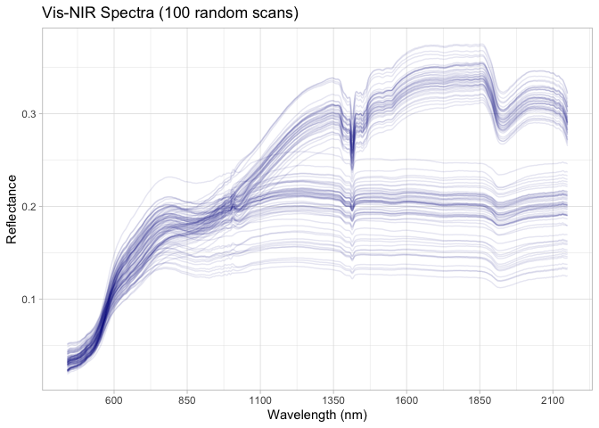

# Spectra from two Brazilian farms
Ran Zhi, Jose L. Safanelli, Jonathan Sanderman

- [Original data](#original-data)
- [Data standardization to the OSSL
  format](#data-standardization-to-the-ossl-format)
  - [Site information](#site-information)
  - [Soil lab information (reference analytical
    data)](#soil-lab-information-reference-analytical-data)
  - [Vis-NIR spectra](#vis-nir-spectra)
  - [Quality control for Vis-NIR](#quality-control-for-vis-nir)
- [References](#references)

Code repository for preparing and importing the spectra from two
Brazilian local farms into the Open Soil Spectral Library.

Website: [Soil Spectroscopy for Global
Good](https://soilspectroscopy.org)  
Development: <https://github.com/soilspectroscopy>  
Last update: 2026-05-01  
Additional documentation:

## Original data

Site data, Soil lab data, and Visible Near-Infrared (Vis-NIR) data from
Brazilian agricultural areas. Further information of the dataset can be
found in detail at Tavares et al. ([2022](#ref-Tavares2022)).

Original files:  
- `soil fertility data.xlsx`: xlsx file with site information and soil
lab information. - `VNIR data.xlsx`: xlsx file with Vis-NIR spectral
data.

Directory/folder path with original files (not uploaded to GitHub).

``` r
# dir = "/Users/rzhi/Projects/git/ossl-imports-internal/dataset/TropicalFarm"
dir = "~/mnt-ossl-private/database/datasets/LF_BRA"
tic()
```

## Data standardization to the OSSL format

### Site information

``` r
tropical.metadata <- read_excel(path(dir, "soil fertility data.xlsx"))

tropical.sitedata <- tropical.metadata %>%
  select(ID, Field) %>%
  rename(id.layer_local_c = ID,
         loc.field_src_txt = Field) %>%
  mutate(layer.upper.depth_usda_cm = 0,
         layer.lower.depth_usda_cm = 20) %>%
  # mutate(id.project_ascii_txt = "Spectral data of tropical soils using dry-chemistry techniques",
  #        observation.ogc.schema.title_ogc_txt = "Open Soil Spectroscopy Library",
  #        observation.ogc.schema_idn_url = "https://soilspectroscopy.github.io",
  #        dataset.owner_utf8_txt = "Universidade de Sao Paulo",
  #        dataset.doi_idf_url = "https://data.mendeley.com/datasets/88c5kvmgbf/1",
  #        dataset.license.title_ascii_txt = "CC-BY 4.0",
  #        dataset.license.address_idn_url = "https://creativecommons.org/licenses/by/4.0/",
  #        dataset.contact.name_utf8_txt = "Tiago Rodrigues Tavares",
  #        dataset.contact_ietf_email = "tiagosrt@usp.br") %>%
  mutate(dataset.code_ascii_txt = "LF_BRA",
         id.layer_uuid_txt = openssl::md5(paste0(dataset.code_ascii_txt, id.layer_local_c)),
         .before = 1) %>%
  mutate_at(vars(starts_with("id.")), as.character)

# Saving version to dataset root dir
site.exp.file = path(dir, "ossl_soilsite_v1.3")
readr::write_csv(tropical.sitedata, str_c(site.exp.file, ".csv.gz"))
nanoparquet::write_parquet(tropical.sitedata, str_c(site.exp.file, ".parquet"))
```

### Soil lab information (reference analytical data)

NOTE: The code chunk below must be run just once for getting a template
for scripted column standardization. Just run once for getting the
original names of soil properties, descriptions, data types, and units.
Then upload to Google Sheet for editing and manually defining the rules
for integrating with the OSSL. Requires Google authentication. A copy of
the output file is saved to this folder for archiving purposes.

``` r
# Getting soillab original variables

soillab.names <- tropical.metadata %>%
  select(ID, Clay, OM, CEC, pH, V, exP, exK, exCa, exMg) %>%
  rename(id.layer_local_c = ID) %>%
  names() %>%
  tibble(original_name = .) %>%
  dplyr::mutate(table = 'soil fertility data.xlsx', .before = 1) %>%
  dplyr::mutate(import = '', original_unit = '', original_method = '', comment = '', ossl_abbrev = '', ossl_method = '', 
                ossl_unit = '', ossl_convert = '', ossl_name = '', .after = original_name)

readr::write_csv(soillab.names, path(getwd(), "soillab_original_names.csv"))

# Uploading to google sheet

# Drive 'Open Soil Spectral Library'
# Folder 'Database v2'
googledrive::drive_ls(as_id("1l9VM4fFks2xBloDE69EFTfPgQeFx5aGw"))

# Use the ID of the file 'OSSL_v2_tab2_soildata_importing'
OSSL.soildata.importing <- "1mWTDJDuMp4oObcCxAy9gofSkrkcSWWf1TtEW2SuC1es"

# Checking metadata
googlesheets4::as_sheets_id(OSSL.soildata.importing)

# Checking readme
googlesheets4::read_sheet(OSSL.soildata.importing, sheet = 'readme')

# Preparing soillab.names for this dataset
upload <- dplyr::as_tibble(soillab.names)

# Uploading with TEMP name. Check online, move to sequence, and update name
googlesheets4::write_sheet(upload, ss = OSSL.soildata.importing, sheet = "TEMP")

# Checking metadata
googlesheets4::as_sheets_id(OSSL.soildata.importing)
```

NOTE: The code chunk below must be run just once. Run for getting the
column standardization rules after editing online on Google Sheets. A
copy of the edited standardization template is saved to this dataset
folder.

``` r
# Downloading from google sheet

# Checking metadata
googlesheets4::as_sheets_id("1mWTDJDuMp4oObcCxAy9gofSkrkcSWWf1TtEW2SuC1es")

# Preparing soillab.names
transvalues <- googlesheets4::read_sheet("1mWTDJDuMp4oObcCxAy9gofSkrkcSWWf1TtEW2SuC1es",
                                         sheet = "LF_BRA")

# Saving to folder
write_csv(transvalues, path(getwd(), "soillab_standardized_names.csv"))
```

Reading standardization rules:

``` r
transvalues <- read_csv(path(getwd(), "soillab_standardized_names.csv"),
                        show_col_types = F)  %>%
  filter(import == TRUE) %>%
  select(contains(c("table", "id", "original_name", "original_unit" , "ossl_")))

knitr::kable(transvalues)
```

| table | original_name | original_unit | ossl_abbrev | ossl_method | ossl_unit | ossl_convert | ossl_name |
|:---|:---|:---|:---|:---|:---|:---|:---|
| soil fertility data.xlsx | Clay | g.dm3 | clay.tot | usda.a334 | w.pct | ifelse(as.numeric(x) \< 0, NA, as.numeric(x) \* 0.1) | clay.tot_usda.a334_w.pct |
| soil fertility data.xlsx | OM | g.dm3 | oc | iso.10694 | w.pct | ifelse(as.numeric(x) \< 0, NA, as.numeric(x) \* 0.1) | oc_iso.10694_w.pct |
| soil fertility data.xlsx | CEC | mmolc.dm3 | cec | usda.a723 | cmolc.kg | ifelse(as.numeric(x) \< 0, NA, as.numeric(x) \* 0.1) | cec_usda.a723_cmolc.kg |
| soil fertility data.xlsx | pH | NA | ph.cacl2 | iso.10390 | index | ifelse(as.numeric(x) \< 0, NA, as.numeric(x) \* 1) | ph.cacl2_iso.10390_index |
| soil fertility data.xlsx | exP | mg.dm3 | p.ext | brazil.ier | mg.kg | ifelse(as.numeric(x) \< 0, NA, as.numeric(x) \* 1) | p.ext_brazil.ier_mg.kg |
| soil fertility data.xlsx | exK | mmolc.dm3 | k.ext | brazil.ier | cmolc.kg | ifelse(as.numeric(x) \< 0, NA, as.numeric(x) \* 0.1) | k.ext_brazil.ier_cmolc.kg |
| soil fertility data.xlsx | exCa | mmolc.dm3 | ca.ext | brazil.ier | cmolc.kg | ifelse(as.numeric(x) \< 0, NA, as.numeric(x) \* 0.1) | ca.ext_brazil.ier_cmolc.kg |
| soil fertility data.xlsx | exMg | mmolc.dm3 | mg.ext | brazil.ier | cmolc.kg | ifelse(as.numeric(x) \< 0, NA, as.numeric(x) \* 0.1) | mg.ext_brazil.ier_cmolc.kg |

Standardizing soil data to the OSSL format:

``` r
tropical.reference <- tropical.metadata

# Harmonization of names and units
valid_mappings <- transvalues %>%
  filter(table == "soil fertility data.xlsx") %>%
  filter(!is.na(ossl_name) & ossl_name != "") 

analytes.old.names <- valid_mappings %>% pull(original_name)
analytes.new.names <- valid_mappings %>% pull(ossl_name)

tropical.soildata <- tropical.reference %>%
  rename(id.layer_local_c = ID) %>%
  select(id.layer_local_c, all_of(analytes.old.names)) %>%
  rename_with(~analytes.new.names, all_of(analytes.old.names)) %>%
  mutate(id.layer_local_c = as.character(id.layer_local_c)) %>%
  as.data.frame()

# Getting the formulas
functions.list <- transvalues %>%
  filter(table == "soil fertility data.xlsx") %>%
  mutate(ossl_name = factor(ossl_name, levels = names(tropical.soildata))) %>%
  arrange(ossl_name) %>%
  pull(ossl_convert) %>%
  c("x", .)

# Applying transformation rules
tropical.soildata.trans <- transform_values(df = tropical.soildata,
                                            out.name = names(tropical.soildata),
                                            in.name = names(tropical.soildata),
                                            fun.lst = functions.list)

# Final soillab data
tropical.soildata <- tropical.soildata.trans %>%
  mutate_at(vars(starts_with("id.")), as.character)

# Checking total number of observations
tropical.soildata %>%
  distinct(id.layer_local_c) %>%
  summarise(count = n())
```

      count
    1   102

``` r
# Saving version to dataset root dir
soillab.exp.file = path(dir, "ossl_soillab_v1.3")
readr::write_csv(tropical.soildata, str_c(soillab.exp.file, ".csv.gz"))
nanoparquet::write_parquet(tropical.soildata, str_c(soillab.exp.file, ".parquet"))
```

Soil lab data summary.

``` r
tropical.soildata %>%
  mutate(id.layer_local_c = factor(id.layer_local_c)) %>%
  skimr::skim() %>%
  dplyr::select(-numeric.hist, -complete_rate)
```

|                                                  |            |
|:-------------------------------------------------|:-----------|
| Name                                             | Piped data |
| Number of rows                                   | 102        |
| Number of columns                                | 9          |
| \_\_\_\_\_\_\_\_\_\_\_\_\_\_\_\_\_\_\_\_\_\_\_   |            |
| Column type frequency:                           |            |
| factor                                           | 1          |
| numeric                                          | 8          |
| \_\_\_\_\_\_\_\_\_\_\_\_\_\_\_\_\_\_\_\_\_\_\_\_ |            |
| Group variables                                  | None       |

Data summary

**Variable type: factor**

| skim_variable    | n_missing | ordered | n_unique | top_counts                  |
|:-----------------|----------:|:--------|---------:|:----------------------------|
| id.layer_local_c |         0 | FALSE   |      102 | 1: 1, 10: 1, 100: 1, 101: 1 |

**Variable type: numeric**

| skim_variable              | n_missing |  mean |    sd |    p0 |   p25 |   p50 |   p75 |   p100 |
|:---------------------------|----------:|------:|------:|------:|------:|------:|------:|-------:|
| clay.tot_usda.a334_w.pct   |         0 | 34.54 |  9.42 | 17.50 | 25.02 | 37.90 | 41.05 |  51.10 |
| oc_iso.10694_w.pct         |         0 |  2.54 |  0.60 |  1.40 |  2.00 |  2.50 |  3.10 |   3.70 |
| cec_usda.a723_cmolc.kg     |         0 |  8.00 |  2.59 |  3.75 |  5.85 |  7.99 |  9.78 |  14.89 |
| ph.cacl2_iso.10390_index   |         0 |  5.33 |  0.44 |  4.60 |  5.00 |  5.20 |  5.60 |   6.30 |
| p.ext_brazil.ier_mg.kg     |         0 | 21.46 | 14.46 |  4.00 | 12.00 | 17.50 | 26.00 | 104.00 |
| k.ext_brazil.ier_cmolc.kg  |         0 |  0.34 |  0.24 |  0.09 |  0.10 |  0.28 |  0.55 |   1.03 |
| ca.ext_brazil.ier_cmolc.kg |         0 |  3.49 |  1.92 |  0.80 |  1.52 |  3.30 |  5.00 |   7.80 |
| mg.ext_brazil.ier_cmolc.kg |         0 |  1.79 |  1.26 |  0.30 |  0.60 |  1.50 |  2.80 |   5.40 |

### Vis-NIR spectra

``` r
tropical.visnir <- read_excel(path(dir, "VNIR data.xlsx"))

# Renaming and ID Preparation
tropical.visnir.proc <- tropical.visnir %>%
  as_tibble() %>%
  rename(id.layer_local_c = ID) %>%
  mutate(id.layer_local_c = as.character(id.layer_local_c))

# Extracting wavelengths from column names (e.g., "SPC.350" -> 350)
spec.cols <- setdiff(names(tropical.visnir.proc), c("id.layer_local_c", "Field"))
old.wavelengths <- as.numeric(spec.cols)

new.wavelengths <- seq(450, 2150, by = 2)

# Resampling spectra
tropical.visnir.resampled <- tropical.visnir.proc %>%
  select(id.layer_local_c, all_of(spec.cols)) %>%
  mutate(across(all_of(spec.cols), ~ as.numeric(.x) / 100))

tropical.visnir.resampled <- tropical.visnir.resampled %>%
  select(all_of(spec.cols)) %>%
  as.matrix() %>%
  prospectr::resample(X = ., 
                      wav = old.wavelengths, 
                      new.wav = new.wavelengths, 
                      interpol = "spline") %>%
  as_tibble() %>%
  bind_cols({tropical.visnir.resampled %>%
      select(id.layer_local_c)}, .) %>%
  select(id.layer_local_c, as.character(new.wavelengths))

# Gaps Analysis
scans.na.gaps <- tropical.visnir.resampled %>%
  select(-id.layer_local_c) %>%
  apply(., 1, function(x) round(100*(sum(is.na(x)))/(length(x)), 2)) %>%
  tibble(proportion_NA = .) %>%
  bind_cols(tropical.visnir.resampled %>% select(id.layer_local_c), .)

# Extreme negative checks
scans.extreme.neg <- tropical.visnir.resampled %>%
  select(-id.layer_local_c) %>%
  apply(., 1, function(x) {round(100*(sum(x < 0, na.rm=TRUE))/(length(x)), 2)}) %>%
  tibble(proportion_lower0 = .) %>%
  bind_cols(tropical.visnir.resampled %>% select(id.layer_local_c), .)

# Extreme positive checks
scans.extreme.pos <- tropical.visnir.resampled %>%
  select(-id.layer_local_c) %>%
  apply(., 1, function(x) {round(100*(sum(x > 1, na.rm=TRUE))/(length(x)), 2)}) %>%
  tibble(proportion_higherRef1 = .) %>%
  bind_cols(tropical.visnir.resampled %>% select(id.layer_local_c), .)

# Consistency summary
scans.summary <- scans.na.gaps %>%
  left_join(scans.extreme.neg, by = "id.layer_local_c") %>%
  left_join(scans.extreme.pos, by = "id.layer_local_c")

# Display problematic scans count
scans.summary %>%
  select(-id.layer_local_c) %>%
  pivot_longer(everything(), names_to = "check", values_to = "value") %>%
  filter(value > 0) %>%
  group_by(check) %>%
  summarise(count = n())
```

    # A tibble: 0 × 2
    # ℹ 2 variables: check <chr>, count <int>

``` r
# Final column renaming for OSSL standard
final.visnir.names <- paste0("scan_visnir.", new.wavelengths, "_ref")

tropical.visnir.proc_final <- tropical.visnir.resampled %>%
  rename_with(~final.visnir.names, as.character(new.wavelengths))

# # Preparing metadata
# tropical.visnir.metadata <- tropical.visnir.proc_final %>%
#   select(id.layer_local_c) %>%
#   mutate(id.scan_local_c = id.layer_local_c,
#          scan.visnir.model.name_utf8_txt = "Veris MSP3 (Veris Technologies, Salina, Kansas, USA)", 
#          scan.visnir.license.title_ascii_txt = "CC-BY 4.0",
#          scan.visnir.method.optics_any_txt = "",
#          scan.visnir.method.preparation_any_txt = "loose powder soil samples (air-dry and grain size ≤ 2 mm).",
#          scan.visnir.license.address_idn_url = "https://creativecommons.org/licenses/by/4.0/",
#          scan.visnir.doi_idf_url = "https://data.mendeley.com/datasets/88c5kvmgbf/1",
#          scan.visnir.contact.name_utf8_txt = "Tiago Rodrigues Tavares",
#          scan.visnir.contact.email_ietf_txt = "tiagosrt@usp.br")
# 
# # Final preparation
# tropical.visnir.export <- tropical.visnir.metadata %>%
#   left_join(tropical.visnir.proc_final, by = "id.layer_local_c") %>%
#   mutate(across(starts_with("id."), as.character))

tropical.visnir.export <- tropical.visnir.proc_final

# Saving version to dataset root dir
visnir.exp.file = path(dir, "ossl_visnir_v1.3")
readr::write_csv(tropical.visnir.export, str_c(visnir.exp.file, ".csv.gz"))
nanoparquet::write_parquet(tropical.visnir.export, str_c(visnir.exp.file, ".parquet"))
```

### Quality control for Vis-NIR

The final table must be joined as follows:

- VisNIR is used as first reference for pairing with soil data.
- Site and soil lab data are left joined to VisNIR. This drop data
  without any available scan.

The availability of data is summarized below:

``` r
# Taking a few representative columns for checking the consistency of joins
tropical.availability <- tropical.visnir.export %>%
  select(id.layer_local_c, scan_visnir.500_ref) %>%
  left_join(tropical.soildata, by = "id.layer_local_c") %>%
  filter(!is.na(id.layer_local_c))

# Availability of information summary
# This tells us how many samples have spectra vs. lab/site data
tropical.availability %>%
  mutate(across(everything(), as.character)) %>%
  pivot_longer(everything(), names_to = "column", values_to = "value") %>%
  filter(!is.na(value)) %>%
  group_by(column) %>%
  summarise(count = n())
```

    # A tibble: 10 × 2
       column                     count
       <chr>                      <int>
     1 ca.ext_brazil.ier_cmolc.kg   102
     2 cec_usda.a723_cmolc.kg       102
     3 clay.tot_usda.a334_w.pct     102
     4 id.layer_local_c             102
     5 k.ext_brazil.ier_cmolc.kg    102
     6 mg.ext_brazil.ier_cmolc.kg   102
     7 oc_iso.10694_w.pct           102
     8 p.ext_brazil.ier_mg.kg       102
     9 ph.cacl2_iso.10390_index     102
    10 scan_visnir.500_ref          102

``` r
# Repeats check - Checking for duplicate SAMPLE_TDR_IDs
tropical.availability %>%
  mutate(across(everything(), as.character)) %>%
  select(id.layer_local_c) %>%
  pivot_longer(everything(), names_to = "column", values_to = "value") %>%
  group_by(column, value) %>%
  summarise(repeats = n(), .groups = 'drop') %>%
  group_by(column, repeats) %>%
  summarise(count = n(), .groups = 'drop')
```

    # A tibble: 1 × 3
      column           repeats count
      <chr>              <int> <int>
    1 id.layer_local_c       1   102

Soil analytical data summary for Vis-NIR. Note: some scans may not be
linked with the wetchem.

``` r
tropical.soildata %>%
  mutate(id.layer_local_c = factor(id.layer_local_c)) %>%
  skimr::skim() %>%
  dplyr::select(-numeric.hist, -complete_rate)
```

|                                                  |            |
|:-------------------------------------------------|:-----------|
| Name                                             | Piped data |
| Number of rows                                   | 102        |
| Number of columns                                | 9          |
| \_\_\_\_\_\_\_\_\_\_\_\_\_\_\_\_\_\_\_\_\_\_\_   |            |
| Column type frequency:                           |            |
| factor                                           | 1          |
| numeric                                          | 8          |
| \_\_\_\_\_\_\_\_\_\_\_\_\_\_\_\_\_\_\_\_\_\_\_\_ |            |
| Group variables                                  | None       |

Data summary

**Variable type: factor**

| skim_variable    | n_missing | ordered | n_unique | top_counts                  |
|:-----------------|----------:|:--------|---------:|:----------------------------|
| id.layer_local_c |         0 | FALSE   |      102 | 1: 1, 10: 1, 100: 1, 101: 1 |

**Variable type: numeric**

| skim_variable              | n_missing |  mean |    sd |    p0 |   p25 |   p50 |   p75 |   p100 |
|:---------------------------|----------:|------:|------:|------:|------:|------:|------:|-------:|
| clay.tot_usda.a334_w.pct   |         0 | 34.54 |  9.42 | 17.50 | 25.02 | 37.90 | 41.05 |  51.10 |
| oc_iso.10694_w.pct         |         0 |  2.54 |  0.60 |  1.40 |  2.00 |  2.50 |  3.10 |   3.70 |
| cec_usda.a723_cmolc.kg     |         0 |  8.00 |  2.59 |  3.75 |  5.85 |  7.99 |  9.78 |  14.89 |
| ph.cacl2_iso.10390_index   |         0 |  5.33 |  0.44 |  4.60 |  5.00 |  5.20 |  5.60 |   6.30 |
| p.ext_brazil.ier_mg.kg     |         0 | 21.46 | 14.46 |  4.00 | 12.00 | 17.50 | 26.00 | 104.00 |
| k.ext_brazil.ier_cmolc.kg  |         0 |  0.34 |  0.24 |  0.09 |  0.10 |  0.28 |  0.55 |   1.03 |
| ca.ext_brazil.ier_cmolc.kg |         0 |  3.49 |  1.92 |  0.80 |  1.52 |  3.30 |  5.00 |   7.80 |
| mg.ext_brazil.ier_cmolc.kg |         0 |  1.79 |  1.26 |  0.30 |  0.60 |  1.50 |  2.80 |   5.40 |

Vis-NIR spectral visualization (100 random spectra):

``` r
tropical.visnir.export %>%
  select(all_of(c("id.layer_local_c")), starts_with("scan_visnir.")) %>%
  tidyr::pivot_longer(-all_of(c("id.layer_local_c")),
                      names_to = "wavelength", values_to = "reflectance") %>%
  dplyr::mutate(wavelength = gsub("scan_visnir.|_ref", "", wavelength)) %>%
  dplyr::mutate(wavelength = as.numeric(wavelength)) %>%
  ggplot(aes(x = wavelength, y = reflectance, group = id.layer_local_c)) +
  geom_line(alpha = 0.1, color = "darkblue") +
  scale_x_continuous(breaks = seq(350, 2500, by = 250))+
  labs(title = "Vis-NIR Spectra (100 random scans)",
       x = "Wavelength (nm)",
       y = "Reflectance")+
  theme_light()
```



``` r
toc()
```

    7.109 sec elapsed

``` r
rm(list = ls())
gc()
```

               used  (Mb) gc trigger  (Mb) max used (Mb)
    Ncells  6067641 324.1   11115327 593.7  8369344  447
    Vcells 10245810  78.2   17824054 136.0 17823926  136

## References

<div id="refs" class="references csl-bib-body hanging-indent"
entry-spacing="0" line-spacing="2">

<div id="ref-Tavares2022" class="csl-entry">

Tavares, T. R., Molin, J. P., Nunes, L. C., Alves, E. E. N., Krug, F.
J., & Carvalho, H. W. P. de. (2022). Spectral data of tropical soils
using dry-chemistry techniques (VNIR, XRF, and LIBS): A dataset for soil
fertility prediction. *Data in Brief*, *41*, 108004.
doi:[10.1016/j.dib.2022.108004](https://doi.org/10.1016/j.dib.2022.108004)

</div>

</div>
