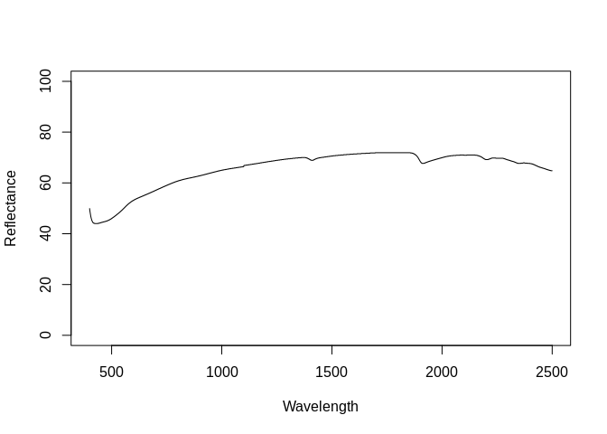
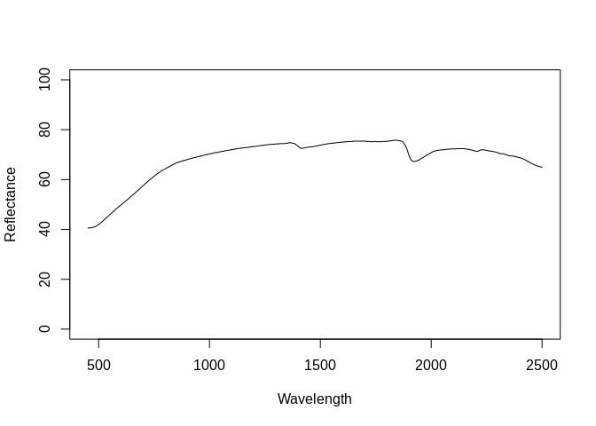
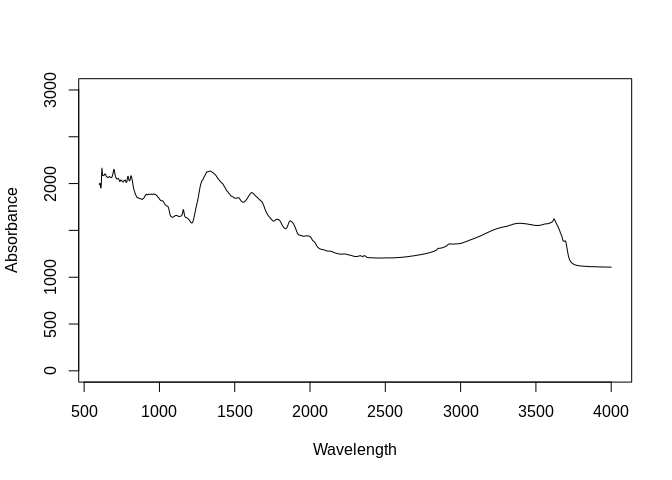
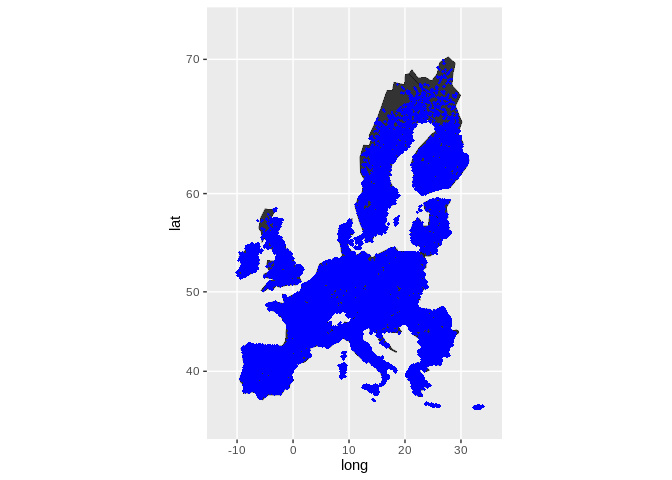

Dataset import: The Land-Use/Cover Area Survey Soil and Spectral Library
(LUCAS)
================
Tomislav Hengl (<tom.hengl@opengeohub.org>) and Leandro Parente
(<leandro.parente@opengeohub.org>)
04 December, 2021


-   [LUCAS inputs](#lucas-inputs)
-   [Data import](#data-import)
    -   [Soil site and laboratory data
        import](#soil-site-and-laboratory-data-import)
        -   [Soil lab information](#soil-lab-information)
        -   [Soil site information](#soil-site-information)
    -   [Visible and near-infrared (VNIR) spectroscopy
        data](#visible-and-near-infrared-vnir-spectroscopy-data)
    -   [MIR data scanned by Woodwell Climate
        Research](#mir-data-scanned-by-woodwell-climate-research)
    -   [Quality control](#quality-control)
    -   [Distribution of points](#distribution-of-points)
-   [References](#references)

[](https://soilspectroscopy.org/)

[](http://creativecommons.org/licenses/by-sa/4.0/)

This work is licensed under a [Creative Commons Attribution-ShareAlike
4.0 International
License](http://creativecommons.org/licenses/by-sa/4.0/).

## LUCAS inputs

Part of: <https://github.com/soilspectroscopy>  
Project: [Soil Spectroscopy for Global
Good](https://soilspectroscopy.org)  
Last update: 2021-12-04  
Dataset:
[LUCAS.SSL](https://soilspectroscopy.github.io/ossl-manual/soil-spectroscopy-tools-and-users.html#lucas.ssl)

The Land-Use/Cover Area frame statistical Survey (LUCAS) Soil and
Spectral Library comprise topsoil information including 28 European
Union Member States in 2009 and 2015 ([Orgiazzi, Ballabio, Panagos,
Jones, & Fernández-Ugalde, 2018](#ref-orgiazzi2018lucas)). Data is
hosted by Joint Research Centre (JRC)- European Soil Data Centre
(ESDAC); dataset properties and licence are explained in detail in
<https://esdac.jrc.ec.europa.eu/projects/lucas>.

Input datasets:

-   `LUCAS.SOIL_corr.Rdata`: VNIR soil spectral reflectances (4200
    channels/ window of 0.5 nm from 400 - 2499.5 nm);
-   `LUCAS_Topsoil_2009_ESPG4326.csv`: 2009 Database with site and soil
    analytes (19,860 observations);  
-   `LUCAS_spectra_2015.rds`: VNIR soil spectral reflectances (4200
    channels/ window of 0.5 nm from 400 - 2499.5 nm);
-   `LUCAS_Topsoil_complete_2015_ESPG4326.csv`: 2015 Database with site
    and soil analytes (21,848 observations);

For the DB structure and use refer to “LUCAS Soil, the largest
expandable soil dataset for Europe: a review” contact: Arwyn Jones
[ec-esdac@jrc.ec.europa.eu](JRC).

Directory/folder path

``` r
dir = "/mnt/soilspec4gg/ossl/dataset/LUCAS/"
```

## Data import

### Soil site and laboratory data import

Soil samples and lab results for some 19,860 in 2009 (2012):

``` r
gpkg.lst = list.files(dir, glob2rx("SoilAttr_*.gpkg$"), full.names = TRUE)
df.2009 = lapply(gpkg.lst, function(i){as.data.frame(readOGR(i))})
```

    ## OGR data source with driver: GPKG 
    ## Source: "/mnt/soilspec4gg/ossl/dataset/LUCAS/SoilAttr_LUCAS2009_CYP_MLT.gpkg", layer: "SoilAttr_LUCAS2009_CYP_MLT"
    ## with 109 features
    ## It has 17 fields
    ## Integer64 fields read as strings:  POINT_ID coarse clay silt sand N 
    ## OGR data source with driver: GPKG 
    ## Source: "/mnt/soilspec4gg/ossl/dataset/LUCAS/SoilAttr_LUCAS2009_ICELAND.gpkg", layer: "SoilAttr_LUCAS2009_ICELAND"
    ## with 65 features
    ## It has 17 fields
    ## Integer64 fields read as strings:  POINT_ID coarse clay silt sand 
    ## OGR data source with driver: GPKG 
    ## Source: "/mnt/soilspec4gg/ossl/dataset/LUCAS/SoilAttr_LUCAS2009.gpkg", layer: "SoilAttr_LUCAS2009"
    ## with 19860 features
    ## It has 17 fields
    ## Integer64 fields read as strings:  POINT_ID coarse clay silt sand 
    ## OGR data source with driver: GPKG 
    ## Source: "/mnt/soilspec4gg/ossl/dataset/LUCAS/SoilAttr_LUCAS2012_BG_RO.gpkg", layer: "SoilAttr_LUCAS2012_BG_RO"
    ## with 2034 features
    ## It has 17 fields
    ## Integer64 fields read as strings:  POINT_ID coarse clay silt sand

``` r
df.2009 = plyr::rbind.fill(df.2009)
str(df.2009)
```

    ## 'data.frame':    22068 obs. of  19 variables:
    ##  $ POINT_ID : chr  "47021454" "47181444" "47081452" "47141452" ...
    ##  $ coarse   : chr  "6" "13" "10" "17" ...
    ##  $ clay     : chr  "27" "28" "47" "24" ...
    ##  $ silt     : chr  "60" "34" "38" "33" ...
    ##  $ sand     : chr  "13" "38" "15" "43" ...
    ##  $ pHinH2O  : num  8.03 8.1 8.11 8.16 8.03 8.36 8.19 8.34 8.26 8.3 ...
    ##  $ pHinCaCl2: num  7.38 7.57 7.41 7.38 7.64 7.62 7.61 7.71 7.58 7.54 ...
    ##  $ OC       : chr  "28" "13.6" "11.9" "22.5" ...
    ##  $ CaCO3    : chr  "680" "488" "416" "692" ...
    ##  $ N        : chr  "2" "2" "2" "2" ...
    ##  $ P        : chr  "26.5" "184.3" "75.9" "93.8" ...
    ##  $ K        : num  436 1378 775 615 582 ...
    ##  $ CEC      : num  18.1 18.7 26 17 9.3 11.9 34.2 26.6 19.3 15.6 ...
    ##  $ NUTS_0   : chr  "MT" "MT" "MT" "MT" ...
    ##  $ NUTS_1   : chr  "MT0" "MT0" "MT0" "MT0" ...
    ##  $ NUTS_2   : chr  "MT00" "MT00" "MT00" "MT00" ...
    ##  $ Country  : chr  "Malta" "Malta" "Malta" "Malta" ...
    ##  $ coords.x1: num  14.2 14.4 14.3 14.3 14.3 ...
    ##  $ coords.x2: num  36.1 35.9 36 36 36 ...

Harmonize values:

``` r
in2009.name = c("coarse", "clay", "silt", "sand", "pHinH2O", "pHinCaCl2", "OC", "CaCO3", "N", 
              "P", "K", "CEC", "coords.x1", "coords.x2")
df.2009w = as.data.frame(df.2009[,in2009.name])
out2009.name = c("wpg2_usda.3a2_wpct", "clay.tot_usda.3a1_wpct", "silt.tot_usda.3a1_wpct", "sand.tot_usda.3a1_wpct",
                 "ph.h2o_usda.4c1_index", "ph.cacl2_usda.4c1_index", "oc_usda.calc_wpct", "caco3_usda.4e1_wpct", 
                 "n.tot_usda.4h2_wpct", "p.ext_usda.4d6_mgkg", "k.ext_usda.4d6_mgkg", "cec.ext_usda.4b1_cmolkg",
                 "longitude_wgs84_dd", "latitude_wgs84_dd")
## compare values
summary(as.numeric(df.2009w$OC))
```

    ## Warning in summary(as.numeric(df.2009w$OC)): NAs introduced by coercion

    ##    Min. 1st Qu.  Median    Mean 3rd Qu.    Max.    NA's 
    ## -999.00   12.80   20.10   46.46   37.30  586.80     234

``` r
fun.lst = as.list(rep("ifelse(as.numeric(x)<0, NA, as.numeric(x))", length(in2009.name)))
fun.lst[[which(in2009.name=="coarse")]] = "ifelse(is.na(as.numeric(x)), 0, as.numeric(x))"
fun.lst[[which(in2009.name=="clay")]] = "ifelse(as.numeric(x)<0, NA, as.numeric(x))"
fun.lst[[which(in2009.name=="sand")]] = "ifelse(as.numeric(x)<0, NA, as.numeric(x))"
fun.lst[[which(in2009.name=="silt")]] = "ifelse(as.numeric(x)<0, NA, as.numeric(x))"
fun.lst[[which(in2009.name=="OC")]] = "ifelse(as.numeric(x)<0, NA, as.numeric(x))/10"
fun.lst[[which(in2009.name=="N")]] = "ifelse(as.numeric(x)<0, NA, as.numeric(x))/10"
fun.lst[[which(in2015.name=="coords.x1")]] = "as.numeric(x)"
fun.lst[[which(in2015.name=="coords.x2")]] = "as.numeric(x)"
## save translation rules:
#View(data.frame(in2009.name, out2009.name, unlist(fun.lst)))
write.csv(data.frame(in2009.name, out2009.name, unlist(fun.lst)), "./lucas2009_soilab_transvalues.csv")
df.2009w = transvalues(df.2009w, out2009.name, in2009.name, fun.lst)
```

    ## Warning in ifelse(as.numeric(x) < 0, NA, as.numeric(x)): NAs introduced by coercion

    ## Warning in ifelse(as.numeric(x) < 0, NA, as.numeric(x)): NAs introduced by coercion

    ## Warning in ifelse(as.numeric(x) < 0, NA, as.numeric(x)): NAs introduced by coercion

    ## Warning in ifelse(as.numeric(x) < 0, NA, as.numeric(x)): NAs introduced by coercion

    ## Warning in ifelse(as.numeric(x) < 0, NA, as.numeric(x)): NAs introduced by coercion

    ## Warning in ifelse(as.numeric(x) < 0, NA, as.numeric(x)): NAs introduced by coercion

``` r
df.2009w$id.layer_local_c = paste0("2009.", df.2009$POINT_ID)
df.2009w$sample.doi_idf_c = "10.2788/97922"
df.2009w$observation.date.begin_iso.8601_yyyy.mm.dd = as.Date("2009-05-01")
df.2009w$observation.date.end_iso.8601_yyyy.mm.dd = as.Date("2012-08-01")
```

Soils samples 21,859 points in 2015.

``` r
df.2015 = vroom::vroom(paste(dir, "LUCAS_Topsoil_2015_20200323.csv", sep = ""))
#head(df.2015)
v.2015 = readOGR(paste0(dir, "LUCAS_Topsoil_2015_20200323.shp"))
df.2015$coords.x1 = plyr::join(df.2015["Point_ID"], as.data.frame(v.2015))$coords.x1
df.2015$coords.x2 = plyr::join(df.2015["Point_ID"], as.data.frame(v.2015))$coords.x2
```

Harmonize values:

``` r
in2015.name = c("Coarse", "Clay", "Silt", "Sand", "pH(H2O)", "pH(CaCl2)", "OC", "CaCO3", "N", 
              "P", "K", "EC", "coords.x1", "coords.x2")
df.2015w = as.data.frame(df.2015[,in2015.name])
out2015.name = c("wpg2_usda.3a2_wpct", "clay.tot_usda.3a1_wpct", "silt.tot_usda.3a1_wpct", "sand.tot_usda.3a1_wpct",
                 "ph.h2o_usda.4c1_index", "ph.cacl2_usda.4c1_index", "oc_usda.calc_wpct", "caco3_usda.4e1_wpct", 
                 "n.tot_usda.4h2_wpct", "p.ext_usda.4d6_mgkg", "k.ext_usda.4d6_mgkg", "ec.w_usda.4f1_dsm",
                 "longitude_wgs84_dd", "latitude_wgs84_dd")
## compare values
summary(as.numeric(df.2015w$OC))
```

    ##    Min. 1st Qu.  Median    Mean 3rd Qu.    Max. 
    ##    0.10   12.50   20.40   43.28   38.60  560.20

``` r
fun2.lst = as.list(rep("ifelse(as.numeric(x)<0, NA, as.numeric(x))", length(in2015.name)))
fun2.lst[[which(in2015.name=="Coarse")]] = "ifelse(is.na(as.numeric(x)), 0, as.numeric(x))"
fun2.lst[[which(in2015.name=="Clay")]] = "ifelse(as.numeric(x)<0, NA, as.numeric(x))"
fun2.lst[[which(in2015.name=="Sand")]] = "ifelse(as.numeric(x)<0, NA, as.numeric(x))"
fun2.lst[[which(in2015.name=="Silt")]] = "ifelse(as.numeric(x)<0, NA, as.numeric(x))"
fun2.lst[[which(in2015.name=="OC")]] = "ifelse(as.numeric(x)<0, NA, as.numeric(x))/10"
fun2.lst[[which(in2015.name=="N")]] = "ifelse(as.numeric(x)<0, NA, as.numeric(x))/10"
fun2.lst[[which(in2015.name=="EC")]] = "ifelse(as.numeric(x)<0, NA, as.numeric(x))/100"
fun2.lst[[which(in2015.name=="coords.x1")]] = "as.numeric(x)"
fun2.lst[[which(in2015.name=="coords.x2")]] = "as.numeric(x)"
## save translation rules:
#View(data.frame(in2015.name, out2015.name, unlist(fun2.lst)))
write.csv(data.frame(in2015.name, out2015.name, unlist(fun2.lst)), "./lucas2015_soilab_transvalues.csv")
df.2015w = transvalues(df.2015w, out2015.name, in2015.name, fun2.lst)
df.2015w$id.layer_local_c = paste0("2015.", df.2015$Point_ID)
df.2015w$sample.doi_idf_c = "10.1111/ejss.12499"
df.2015w$observation.date.begin_iso.8601_yyyy.mm.dd = as.Date("2015-03-01")
df.2015w$observation.date.end_iso.8601_yyyy.mm.dd = as.Date("2015-10-01")
#df.2015$WR_ID = paste(round(df.2015$coords.x1, 2), round(df.2015$coords.x2, 2), sep="_")
```

#### Soil lab information

Bind two datasets:

``` r
lucas.soil = plyr::rbind.fill(df.2009w, df.2015w)
lucas.soil$id.layer_uuid_c = openssl::md5(make.unique(paste0("LUCAS.SSL", lucas.soil$id.layer_local_c)))
```

Exporting the table:

``` r
lucas.soil$sample.contact.name_utf8_txt = "ESDAC - European Commission"
lucas.soil$sample.contact.email_ietf_email = "ec-esdac@jrc.ec.europa.eu"
x.na = soilab.name[which(!soilab.name %in% names(lucas.soil))]
if(length(x.na)>0){ for(i in x.na){ lucas.soil[,i] <- NA } }
soilab.rds = paste0(dir, "ossl_soillab_v1.rds")
if(!file.exists(soilab.rds)){
  saveRDS.gz(lucas.soil[,soilab.name], soilab.rds)
}
```

#### Soil site information

Add the [Open Location
Code](https://cran.r-project.org/web/packages/olctools/vignettes/Introduction_to_olctools.html)
to the site table:

``` r
lucas.site = lucas.soil[,c("longitude_wgs84_dd", "latitude_wgs84_dd", "id.layer_uuid_c", "id.layer_local_c", "sample.doi_idf_c", "observation.date.begin_iso.8601_yyyy.mm.dd", "observation.date.end_iso.8601_yyyy.mm.dd")]
## degrade location accuracy +/-500m so we can share the points
lucas.site$longitude_wgs84_dd = lucas.site$longitude_wgs84_dd + rnorm(nrow(lucas.site), 0, 0.005)
lucas.site$latitude_wgs84_dd = lucas.site$latitude_wgs84_dd + rnorm(nrow(lucas.site), 0, 0.005)
lucas.site$location.method_any_c = "Degraded coordinates"
lucas.site$location.error_any_m = 1000
lucas.site$id.location_olc_c = olctools::encode_olc(lucas.site$latitude_wgs84_dd, lucas.site$longitude_wgs84_dd, 10)
#colnames(lucas.site)
lucas.site$observation.ogc.schema.title_ogc_txt = 'Open Soil Spectroscopy Library'
lucas.site$observation.ogc.schema_idn_url = 'https://soilspectroscopy.github.io'
lucas.site$dataset.title_utf8_txt = "LUCAS 2009, 2015 top-soil data"
lucas.site$dataset.doi_idf_c = "10.1111/ejss.12499"
lucas.site$surveyor.address_utf8_txt = ""
lucas.site$layer.upper.depth_usda_cm = 0
lucas.site$layer.lower.depth_usda_cm = 20
lucas.site$dataset.code_ascii_c = "LUCAS.SSL"
lucas.site$dataset.address_idn_url = "https://esdac.jrc.ec.europa.eu/resource-type/soil-point-data"
lucas.site$dataset.owner_utf8_txt = "European Soil Data Centre (ESDAC), esdac.jrc.ec.europa.eu, European Commission, Joint Research Centre"
lucas.site$surveyor.title_utf8_txt = ""
lucas.site$dataset.license.title_ascii_txt = "JRC License Agreement"
lucas.site$dataset.license.address_idn_url = "https://esdac.jrc.ec.europa.eu/resource-type/soil-point-data"
lucas.site$surveyor.contact_ietf_email = "ec-esdac@jrc.ec.europa.eu"
lucas.site$dataset.contact.name_utf8_txt = "ESDAC - European Commission"
lucas.site$dataset.contact_ietf_email = "ec-esdac@jrc.ec.europa.eu"
lucas.site$id.project_ascii_c = "Land Use and Coverage Area frame Survey (LUCAS)"
x.na = site.name[which(!site.name %in% names(lucas.site))]
if(length(x.na)>0){ for(i in x.na){ lucas.site[,i] <- NA } }
soilsite.rds = paste0(dir, "ossl_soilsite_v1.rds")
if(!file.exists(soilsite.rds)){
  saveRDS.gz(lucas.site[,site.name], soilsite.rds)
  write.csv(lucas.site[,site.name], paste0(dir, "ossl_soilsite_v1.csv"))
}
```

### Visible and near-infrared (VNIR) spectroscopy data

``` r
## Read raw files and bind:
#files = list.files(path = paste0(dir, "LUCAS2015_Soil_Spectra_EU28"), pattern = ".csv", full.names=TRUE, recursive=TRUE)
#temp = lapply(files, fread, sep=",")
#lucas.vnir = rbindlist(temp)
#colnames(lucas.vnir)
#head(lucas.vnir[, c(1:6, 4204:4205)], 5)
#saveRDS.gz(lucas.vnir, paste(dir, "LUCAS_spectra_2015.rds"))
```

VNIR soil spectroscopy raw data:

``` r
load(paste0(dir, "LUCAS.SOIL_corr.Rdata"))
lucas.vnir2009 = LUCAS.SOIL$spc
summary(lucas.vnir2009$`416`)
```

    ##    Min. 1st Qu.  Median    Mean 3rd Qu.    Max. 
    ##  0.3093  0.8255  0.9006  0.9088  0.9894  1.4848

``` r
summary(lucas.vnir2009$`2100`)
```

    ##    Min. 1st Qu.  Median    Mean 3rd Qu.    Max. 
    ##  0.1109  0.3034  0.3534  0.3669  0.4170  0.9567

``` r
lucas.vnir2015 = readRDS.gz(paste0(dir, "LUCAS_spectra_2015.rds"))
summary(lucas.vnir2015$`416`)
```

    ##    Min. 1st Qu.  Median    Mean 3rd Qu.    Max. 
    ##  0.3212  0.8379  0.9063  0.9131  0.9801  1.5294

``` r
summary(as.numeric(lucas.vnir2015$`2100`))
```

    ##    Min. 1st Qu.  Median    Mean 3rd Qu.    Max. 
    ## 0.08286 0.31486 0.36267 0.37528 0.41948 1.10233

Clean up / remove negative values. Values need to be converted to
reflectances.

``` r
sel.vnir2015 = names(lucas.vnir2015)[6:ncol(lucas.vnir2015)]
## 4200
lucas.vnir2015.f = parallel::mclapply(as.data.frame(lucas.vnir2015)[,6:ncol(lucas.vnir2015)], function(j){j <- 1/exp(as.numeric(j)); round(ifelse(j<0, NA, ifelse(j>1, NA, j))*100, 1)}, mc.cores=32)
#lucas.vnir2015.f = parallel::mclapply(as.data.frame(lucas.vnir2015)[,6:ncol(lucas.vnir2015)], function(j){round(ifelse(j<0, NA, ifelse(j>1, NA, j))*100, 1)}, mc.cores=80)
lucas.vnir2015.f = as.data.frame(do.call(cbind, lucas.vnir2015.f))
dim(lucas.vnir2015.f)
```

    ## [1] 43560  4200

``` r
## 43560  4200
vnir2015.n = paste0("scan_visnir.", sel.vnir2015, "_pcnt")
names(lucas.vnir2015.f) = vnir2015.n
lucas.vnir2015.f$id.layer_local_c = paste0("2015.", lucas.vnir2015$PointID)
lucas.vnir2015.f$id.scan_local_c = make.unique(paste(lucas.vnir2015$SampleID))
rm(lucas.vnir2015); gc()
```

    ##             used   (Mb) gc trigger    (Mb)   max used    (Mb)
    ## Ncells   4982452  266.1    8807212   470.4    8807212   470.4
    ## Vcells 695886910 5309.2 1650453960 12592.0 1650407435 12591.7

Plot and check individual curves:

``` r
matplot(y=as.vector(t(lucas.vnir2015.f[10250,vnir2015.n])), x=as.numeric(sel.vnir2015),
        ylim = c(0,100),
        type = 'l', 
        xlab = "Wavelength", 
        ylab = "Reflectance"
        )
```

<!-- -->

``` r
sel.vnir2009 = names(lucas.vnir2009)
lucas.vnir2009.f = parallel::mclapply(as.data.frame(lucas.vnir2009), function(j){j <- 1/exp(as.numeric(j)); round(ifelse(j<0, NA, ifelse(j>1, NA, j))*100, 1)}, mc.cores=32)
lucas.vnir2009.f = as.data.frame(do.call(cbind, lucas.vnir2009.f))
vnir2009.n = paste0("scan_visnir.", sel.vnir2009, "_pcnt")
names(lucas.vnir2009.f) = vnir2009.n
lucas.vnir2009.f$id.layer_local_c = paste0("2009.", LUCAS.SOIL$POINT_ID)
lucas.vnir2009.f$id.scan_local_c = make.unique(paste(LUCAS.SOIL$sample.ID))
rm(lucas.vnir2009); gc()
```

    ##             used   (Mb) gc trigger    (Mb)   max used    (Mb)
    ## Ncells   4982370  266.1    8807212   470.4    8807212   470.4
    ## Vcells 695806385 5308.6 1650453960 12592.0 1650407435 12591.7

Plot and check individual curves:

``` r
matplot(y=as.vector(t(lucas.vnir2009.f[524,vnir2009.n])), x=as.numeric(sel.vnir2009),
        ylim = c(0,100),
        type = 'l', 
        xlab = "Wavelength", 
        ylab = "Reflectance"
        )
```

<!-- -->

Add missing columns:

``` r
lucas.vnir2009.f$scan.date.begin_iso.8601_yyyy.mm.dd = as.Date("2009-06-01")
lucas.vnir2009.f$scan.date.end_iso.8601_yyyy.mm.dd = as.Date("2012-11-01")
lucas.vnir2009.f$scan.license.address_idn_url = "https://esdac.jrc.ec.europa.eu/content/lucas-2009-topsoil-data"
lucas.vnir2009.f$scan.doi_idf_c = "10.1371/journal.pone.0066409"
lucas.vnir2015.f$scan.date.begin_iso.8601_yyyy.mm.dd = as.Date("2015-03-01")
lucas.vnir2015.f$scan.date.end_iso.8601_yyyy.mm.dd = as.Date("2015-12-01")
lucas.vnir2015.f$scan.license.address_idn_url = "https://esdac.jrc.ec.europa.eu/content/lucas2015-topsoil-data"
lucas.vnir2015.f$scan.doi_idf_c = "10.2788/97922"
```

Bind the two periods into a single object:

``` r
lucas.vnir.f = plyr::rbind.fill(lucas.vnir2009.f, lucas.vnir2015.f)
#v.unique_id = uuid::UUIDgenerate(use.time=TRUE, n=nrow(lucas.vnir.f)) 
v.unique_id = openssl::md5(make.unique(paste0("LUCAS.SSL", lucas.vnir.f$id.scan_local_c)))
lucas.vnir.f$id.scan_uuid_c = v.unique_id
```

Resample values and remove artifacts:

``` r
lucas.vnir.spec = lucas.vnir.f[,grep("scan_visnir.", names(lucas.vnir.f))]
wav.nir = sapply(names(lucas.vnir.spec), function(i){strsplit(strsplit(i, "scan_visnir.")[[1]][2], "_pcnt")[[1]][1]})
colnames(lucas.vnir.spec) = wav.nir
rownames(lucas.vnir.spec) = lucas.vnir.f$id.scan_uuid_c
## large processing time
lucas.vnir = prospectr::resample(lucas.vnir.spec, wav.nir, seq(350, 2500, by=2), interpol = "spline") 
## Wavelength by 2 cm-1
lucas.vnir = as.data.frame(lucas.vnir)
visnir.n = paste0("scan_visnir.", seq(350, 2500, by=2), "_pcnt")
colnames(lucas.vnir) = visnir.n
## https://journals.plos.org/plosone/article?id=10.1371/journal.pone.0066409
## The beginning of the Vis (400–500 nm) showed instrumental artifacts and was therefore removed.
lucas.vnir = lucas.vnir[,-(1:length(seq(350, 450, by=2)))]
```

Final check:

``` r
matplot(y=as.vector(t(lucas.vnir[100,])), x=seq(452, 2500, by=2),
        ylim = c(0,100),
        type = 'l', 
        xlab = "Wavelength", 
        ylab = "Reflectance"
        )
```

<!-- -->

Adding other basic columns:

``` r
lucas.vnir$id.scan_uuid_c = rownames(lucas.vnir.spec)
lucas.vnir$id.scan_local_c = plyr::join(lucas.vnir["id.scan_uuid_c"], lucas.vnir.f[,c("id.scan_local_c", "id.scan_uuid_c")])$id.scan_local_c
```

    ## Joining by: id.scan_uuid_c

``` r
lucas.vnir$id.layer_local_c = plyr::join(lucas.vnir["id.scan_uuid_c"], lucas.vnir.f[,c("id.layer_local_c", "id.scan_uuid_c")])$id.layer_local_c
```

    ## Joining by: id.scan_uuid_c

``` r
#summary(is.na(lucas.vnir$id.layer_local_c))
lucas.vnir$id.layer_uuid_c = plyr::join(lucas.vnir["id.layer_local_c"], lucas.soil[,c("id.layer_local_c", "id.layer_uuid_c")])$id.layer_uuid_c
```

    ## Joining by: id.layer_local_c

``` r
summary(is.na(lucas.vnir$id.layer_uuid_c))
```

    ##    Mode   FALSE    TRUE 
    ## logical   62594       2

``` r
## 2 NA
lucas.vnir$scan.date.begin_iso.8601_yyyy.mm.dd = lucas.vnir.f$scan.date.begin_iso.8601_yyyy.mm.dd
lucas.vnir$scan.date.end_iso.8601_yyyy.mm.dd = lucas.vnir.f$scan.date.end_iso.8601_yyyy.mm.dd
lucas.vnir$scan.license.address_idn_url = lucas.vnir.f$scan.license.address_idn_url
lucas.vnir$scan.doi_idf_c = lucas.vnir.f$scan.doi_idf_c
lucas.vnir$model.name_utf8_txt = "XDS Rapid Content Analyzer"
lucas.vnir$model.code_any_c = "XDS_Rapid_Content_Analyzer"
lucas.vnir$method.light.source_any_c = ""
lucas.vnir$method.preparation_any_c = ""
#lucas.vnir.f$scan.file_any_c = ""
lucas.vnir$scan.license.title_ascii_txt = "JRC License Agreement"
lucas.vnir$scan.contact.name_utf8_txt = "ESDAC - European Commission"
lucas.vnir$scan.contact.email_ietf_email = "ec-esdac@jrc.ec.europa.eu"
```

Save final table:

``` r
x.na = visnir.name[which(!visnir.name %in% names(lucas.vnir))]
if(length(x.na)>0){ for(i in x.na){ lucas.vnir[,i] <- NA } }
#str(lucas.vnir[,visnir.name[1:24]])
visnir.rds = paste0(dir, "ossl_visnir_v1.rds")
if(!file.exists(visnir.rds)){
  saveRDS.gz(lucas.vnir[,visnir.name], visnir.rds)
}
```

### MIR data scanned by Woodwell Climate Research

MIR available only for a smaller selection of samples

``` r
lucas.mir = vroom::vroom("/mnt/soilspec4gg/ossl/dataset/validation/LUCAS_Woodwell.csv")
```

    ## Rows: 605
    ## Columns: 3,035
    ## Delimiter: ","
    ## chr [   1]: run_date
    ## dbl [3034]: WHRC_ID, LUCAS_ID, POINT_ID, GPS_LAT, GPS_LONG, coarse, clay, silt, sand, pH_in_H2O, pH_in_CaCl2, OC, CaCO3, N, P, K, CEC, 5996.485, 5994....
    ## 
    ## Use `spec()` to retrieve the guessed column specification
    ## Pass a specification to the `col_types` argument to quiet this message

``` r
dim(lucas.mir)
```

    ## [1]  605 3035

``` r
summary(as.factor(lucas.mir$run_date))
```

    ##  11/6/2019  12/6/2019 13/06/2019 23/04/2019 26/04/2019   6/6/2019 
    ##        176        177         15         60         60        117

``` r
sel.abs = names(lucas.mir)[19:ncol(lucas.mir)]
## 3017
str(lucas.mir$POINT_ID)
```

    ##  num [1:605] 43262402 44882714 47462636 47782686 46502158 ...

``` r
lucas.mir$id.layer_local_c = paste0("2009.", lucas.mir$POINT_ID)
str(lucas.mir$id.layer_local_c[which(!lucas.mir$id.layer_local_c %in% lucas.site$id.layer_local_c)])
```

    ##  chr(0)

``` r
lucas.mir$id.scan_uuid_c = plyr::join(lucas.mir["id.layer_local_c"], lucas.vnir[c("id.scan_uuid_c","id.layer_local_c")])$id.scan_uuid_c
```

    ## Joining by: id.layer_local_c

``` r
#summary(duplicated(lucas.mir$id.scan_uuid_c))
## 8
```

Resampling the MIR spectra from the original window size to 2 cm-1 in
`lucas.abs`. This operation can be time-consuming:

``` r
lucas.abs = lucas.mir[,c("id.scan_uuid_c", sel.abs)]
dim(lucas.abs)
```

    ## [1]  605 3018

``` r
wav.mir = as.numeric(sel.abs) # Get wavelength only
summary(wav.mir)
```

    ##    Min. 1st Qu.  Median    Mean 3rd Qu.    Max. 
    ##   179.4  1633.7  3087.9  3087.9  4542.2  5996.5

``` r
# Creating a matrix with only spectral values to resample it
lucas.mir.spec = as.matrix(lucas.abs[,sel.abs])
colnames(lucas.mir.spec) = wav.mir
#rownames(lucas.mir.spec) = lucas.mir$id.scan_uuid_c
## remove values out of range
lucas.mir = prospectr::resample(lucas.mir.spec, wav.mir, seq(600, 4000, 2)) 
lucas.mir = as.data.frame(lucas.mir)
mir.n = paste0("scan_mir.", seq(600, 4000, 2), "_abs")
colnames(lucas.mir) = mir.n
```

Remove values out of range:

``` r
lucas.mir.f = parallel::mclapply(lucas.mir, function(j){ round(ifelse(j<0, NA, ifelse(j>3, NA, j))*1000) }, mc.cores=32)
lucas.mir.f = as.data.frame(do.call(cbind, lucas.mir.f))
#str(names(lucas.mir.f))
#lucas.mir.f$id.scan_uuid_c = rownames(lucas.mir)
lucas.mir.f$id.scan_uuid_c = lucas.abs$id.scan_uuid_c
```

Plotting MIR spectra to see if there are still maybe negative values in
the table:

``` r
matplot(y=as.vector(t(lucas.mir.f[25,mir.n])), x=seq(600, 4000, 2),
        ylim = c(0,3000),
        type = 'l', 
        xlab = "Wavelength", 
        ylab = "Absorbance"
        )
```

<!-- -->

Export final MIR table:

``` r
lucas.mir.f$id.layer_local_c = plyr::join(lucas.mir.f["id.scan_uuid_c"], lucas.vnir[c("id.scan_uuid_c","id.layer_local_c")], match="first")$id.layer_local_c
```

    ## Joining by: id.scan_uuid_c

``` r
#summary(is.na(lucas.mir.f$id.scan_uuid_c))
lucas.mir.f$id.layer_uuid_c = plyr::join(lucas.mir.f["id.layer_local_c"], lucas.soil[,c("id.layer_local_c", "id.layer_uuid_c")])$id.layer_uuid_c
```

    ## Joining by: id.layer_local_c

``` r
summary(is.na(lucas.mir.f$id.layer_uuid_c))
```

    ##    Mode   FALSE 
    ## logical     605

``` r
lucas.mir.f$model.name_utf8_txt = "Bruker Vertex 70 with HTS-XT accessory"
lucas.mir.f$model.code_any_c = "Bruker_Vertex_70.HTS.XT"
lucas.mir.f$method.light.source_any_c = ""
lucas.mir.f$method.preparation_any_c = ""
lucas.mir.f$scan.file_any_c = ""
lucas.mir.f$scan.date.begin_iso.8601_yyyy.mm.dd = "2019-04-26"
lucas.mir.f$scan.date.end_iso.8601_yyyy.mm.dd = "2019-06-13"
lucas.mir.f$scan.license.title_ascii_txt = "CC-BY"
lucas.mir.f$scan.license.address_idn_url = "https://creativecommons.org/licenses/by/4.0/"
lucas.mir.f$scan.doi_idf_c = "10.3390/s20236729"
lucas.mir.f$scan.contact.name_utf8_txt = "Jonathan Sanderman"
lucas.mir.f$scan.contact.email_ietf_email = "jsanderman@woodwellclimate.org"
```

Save to RDS file:

``` r
x.na = mir.name[which(!mir.name %in% names(lucas.mir.f))]
if(length(x.na)>0){ for(i in x.na){ lucas.mir.f[,i] <- NA } }
#str(lucas.mir.f[,mir.name[1:24]])
mir.rds = paste0(dir, "ossl_mir_v1.rds")
if(!file.exists(mir.rds)){
  saveRDS.gz(lucas.mir.f[,mir.name], mir.rds)
}
```

### Quality control

Check if some points don’t have any spectral scans:

``` r
mis.r = lucas.mir.f$id.layer_local_c %in% lucas.site$id.layer_local_c
summary(mis.r)
```

    ##    Mode    TRUE 
    ## logical     605

``` r
#str(lucas.mir.f$id.layer_local_c[which(!lucas.mir.f$id.layer_local_c %in% lucas.site$id.layer_local_c)])
```

### Distribution of points

We can plot an world map showing distribution of the sampling locations
for the LUCAS data.

``` r
# Get the world map
if(!require(rworldmap)){install.packages("rworldmap"); require(rworldmap)}
```

    ## Loading required package: rworldmap

    ## ### Welcome to rworldmap ###

    ## For a short introduction type :   vignette('rworldmap')

``` r
worldMap = getMap()
# Member States of the European Union
europeanUnion = c("Austria","Belgium","Bulgaria","Croatia","Cyprus",
                   "Czech Rep.","Denmark","Estonia","Finland","France",
                   "Germany","Greece","Hungary","Ireland","Italy","Latvia",
                   "Lithuania","Luxembourg","Malta","Netherlands","Poland",
                   "Portugal","Romania","Slovakia","Slovenia","Spain",
                   "Sweden","United Kingdom","Icelaand")
# Select only the index of states member of the E.U.
indEU = which(worldMap$NAME%in%europeanUnion)
# Extract longitude and latitude border's coordinates of members states of E.U. 
europeCoords = lapply(indEU, function(i){
  df = data.frame(worldMap@polygons[[i]]@Polygons[[1]]@coords)
  df$region = as.character(worldMap$NAME[i])
  colnames(df) = list("long", "lat", "region")
  return(df)
})
europeCoords = do.call("rbind", europeCoords)
lucas.map = ggplot() + geom_polygon(data = europeCoords, aes(x = long, y = lat, group = region), colour = "black", size = 0.1) +
  coord_map(xlim = c(-13, 35),  ylim = c(32, 71))
lucas.map = lucas.map + geom_point(aes(x=lucas.site$longitude_wgs84_dd, y=lucas.site$latitude_wgs84_dd), color = 'blue', shape = 18, size=.9)
lucas.map
```

<!-- -->

Fig. 1: LUCAS locations of sites across the globe.

``` r
rm(lucas.vnir.f); rm(lucas.vnir.spec); rm(LUCAS.SOIL); 
#rm(lucas.vnir2009.f); rm(lucas.vnir2015.f)
gc()
#save.image.pigz(file=paste0(dir, "LUCAS.RData"), n.cores=32)
#rmarkdown::render("dataset/LUCAS/README.Rmd")
```

## References

<div id="refs" class="references csl-bib-body hanging-indent"
line-spacing="2">

<div id="ref-orgiazzi2018lucas" class="csl-entry">

Orgiazzi, A., Ballabio, C., Panagos, P., Jones, A., & Fernández-Ugalde,
O. (2018). <span class="nocase">LUCAS Soil, the largest expandable soil
dataset for Europe: a review</span>. *European Journal of Soil Science*,
*69*(1), 140–153.
doi:[10.1111/ejss.12499](https://doi.org/10.1111/ejss.12499)

</div>

</div>
