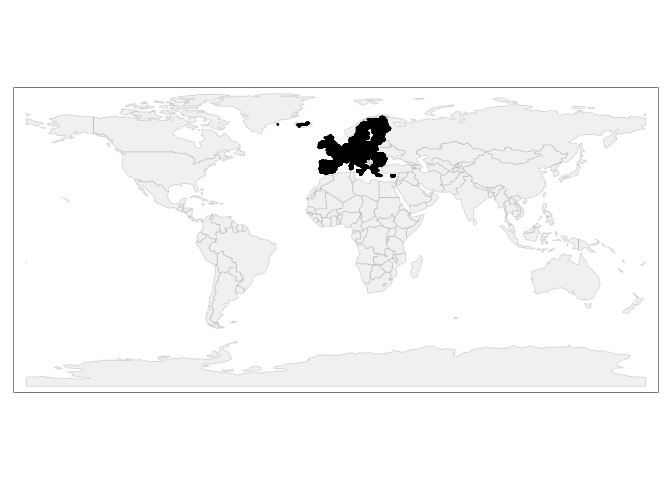
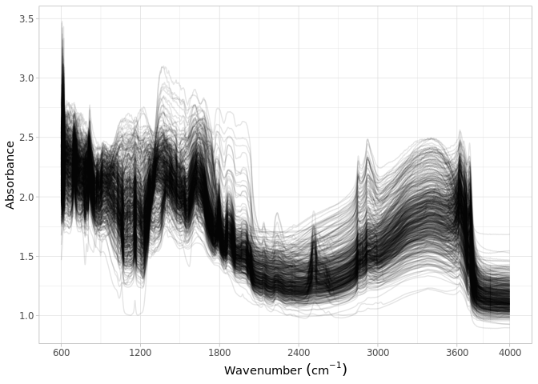
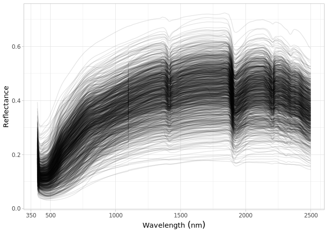

Dataset import: The Land-Use/Cover Area Survey Soil and Spectral Library
(LUCAS)
================
Jose Lucas Safanelli (<jsafanelli@woodwellclimate.org>), Tomislav Hengl
(<tom.hengl@opengeohub.org>), Leandro Parente
(<leandro.parente@opengeohub.org>) -
30 November, 2022


-   [LUCAS](#lucas)
-   [Data import](#data-import)
    -   [Soil site information](#soil-site-information)
    -   [Soil lab information](#soil-lab-information)
    -   [Visible and Near-infrared spectroscopy
        data](#visible-and-near-infrared-spectroscopy-data)
    -   [Mid-infrared spectroscopy
        data](#mid-infrared-spectroscopy-data)
    -   [Quality control](#quality-control)
-   [References](#references)

[](https://soilspectroscopy.org/)

[](http://creativecommons.org/licenses/by-sa/4.0/)

This work is licensed under a [Creative Commons Attribution-ShareAlike
4.0 International
License](http://creativecommons.org/licenses/by-sa/4.0/).

## LUCAS

Part of: <https://github.com/soilspectroscopy>  
Project: [Soil Spectroscopy for Global
Good](https://soilspectroscopy.org)  
Last update: 2022-11-30  
Dataset:
[LUCAS.SSL](https://soilspectroscopy.github.io/ossl-manual/soil-spectroscopy-tools-and-users.html#lucas.ssl)

The Land-Use/Cover Area frame statistical Survey (LUCAS) Soil and
Spectral Library comprise topsoil information including 28 European
Union Member States in 2009 and 2015 ([Orgiazzi, Ballabio, Panagos,
Jones, & Fernández-Ugalde, 2018](#ref-orgiazzi2018lucas)). Data is
hosted by Joint Research Centre (JRC)- European Soil Data Centre
(ESDAC); dataset properties and licence are explained in detail in
<https://esdac.jrc.ec.europa.eu/projects/lucas>.

Input datasets:

-   `LUCAS.SOIL_corr.Rdata`: VNIR soil spectral absorbance (4200
    channels/ window of 0.5 nm from 400 - 2499.5 nm);
-   `LUCAS_Topsoil_2009_ESPG4326.csv`: 2009 Database with site and soil
    analytes (19,860 observations);  
-   `LUCAS_spectra_2015.rds`: VNIR soil spectral reflectance (4200
    channels/ window of 0.5 nm from 400 - 2499.5 nm);
-   `LUCAS_Topsoil_complete_2015_ESPG4326.csv`: 2015 Database with site
    and soil analytes (21,848 observations);

For the DB structure and use refer to “LUCAS Soil, the largest
expandable soil dataset for Europe: a review” contact: Arwyn Jones
[ec-esdac@jrc.ec.europa.eu](JRC).

Directory/folder path

``` r
dir = "/mnt/soilspec4gg/ossl/dataset/LUCAS/"
tic()
```

## Data import

### Soil site information

``` r
# Data from 2009-2012 survey
gpkg.lst = list.files(dir, glob2rx("SoilAttr_*.gpkg$"), full.names = TRUE)

lucas.2009 = lapply(gpkg.lst, function(i){
  sf::st_read(i) %>%
    dplyr::mutate(lon = sf::st_coordinates(.)[,1],
                  lat = sf::st_coordinates(.)[,2]) %>%
    dplyr::as_tibble(.) %>%
    dplyr::select(-geom)})
```

    ## Reading layer `SoilAttr_LUCAS2009_CYP_MLT' from data source 
    ##   `/mnt/soilspec4gg/ossl/dataset/LUCAS/SoilAttr_LUCAS2009_CYP_MLT.gpkg' 
    ##   using driver `GPKG'
    ## Simple feature collection with 109 features and 17 fields
    ## Geometry type: POINT
    ## Dimension:     XY
    ## Bounding box:  xmin: 14.19216 ymin: 34.68497 xmax: 34.02966 ymax: 36.05225
    ## Geodetic CRS:  WGS 84
    ## Reading layer `SoilAttr_LUCAS2009_ICELAND' from data source 
    ##   `/mnt/soilspec4gg/ossl/dataset/LUCAS/SoilAttr_LUCAS2009_ICELAND.gpkg' 
    ##   using driver `GPKG'
    ## Simple feature collection with 65 features and 17 fields
    ## Geometry type: POINT
    ## Dimension:     XY
    ## Bounding box:  xmin: -33.844 ymin: 64.31712 xmax: -16.19763 ymax: 66.29521
    ## Geodetic CRS:  WGS 84
    ## Reading layer `SoilAttr_LUCAS2009' from data source 
    ##   `/mnt/soilspec4gg/ossl/dataset/LUCAS/SoilAttr_LUCAS2009.gpkg' 
    ##   using driver `GPKG'
    ## Simple feature collection with 19860 features and 17 fields
    ## Geometry type: POINT
    ## Dimension:     XY
    ## Bounding box:  xmin: -9.746389 ymin: 34.98376 xmax: 31.2741 ymax: 69.38229
    ## Geodetic CRS:  WGS 84
    ## Reading layer `SoilAttr_LUCAS2012_BG_RO' from data source 
    ##   `/mnt/soilspec4gg/ossl/dataset/LUCAS/SoilAttr_LUCAS2012_BG_RO.gpkg' 
    ##   using driver `GPKG'
    ## Simple feature collection with 2034 features and 17 fields
    ## Geometry type: POINT
    ## Dimension:     XY
    ## Bounding box:  xmin: 20.39508 ymin: 41.2852 xmax: 29.07638 ymax: 48.18803
    ## Geodetic CRS:  WGS 84

``` r
lucas.2009 = Reduce(dplyr::bind_rows, lucas.2009) %>%
  select(POINT_ID, lon, lat) %>%
  mutate(POINT_ID = paste0("2009.", POINT_ID)) %>%
  rename(id.layer_local_c = POINT_ID,
         longitude.point_wgs84_dd = lon,
         latitude.point_wgs84_dd = lat) %>%
  mutate(layer.upper.depth_usda_cm = 0,
         layer.lower.depth_usda_cm = 20,
         observation.date.begin_iso.8601_yyyy.mm.dd = lubridate::ymd("2009-05-01"),
         observation.date.end_iso.8601_yyyy.mm.dd = lubridate::ymd("2012-08-01"),
         dataset.doi_idf_url = "https://data.europa.eu/doi/10.2788/97922")

# Data from 2015 survey
# lucas.2015.x1 = fread(paste0(dir, "/LUCAS_Topsoil_2015_20200323.csv"))
lucas.2015 = sf::st_read(paste0(dir, "/LUCAS_2015.gpkg")) %>%
  dplyr::mutate(lon = sf::st_coordinates(.)[,1],
                lat = sf::st_coordinates(.)[,2]) %>%
  dplyr::as_tibble(.) %>%
  dplyr::select(-geom)
```

    ## Reading layer `LUCAS_2015' from data source 
    ##   `/mnt/soilspec4gg/ossl/dataset/LUCAS/LUCAS_2015.gpkg' using driver `GPKG'
    ## Simple feature collection with 21859 features and 8 fields
    ## Geometry type: POINT
    ## Dimension:     XY
    ## Bounding box:  xmin: -10.05628 ymin: 34.69027 xmax: 34.02966 ymax: 69.95651
    ## Geodetic CRS:  WGS 84

``` r
lucas.2015 <- lucas.2015 %>%
  select(Point_ID, lon, lat) %>%
  mutate(Point_ID = paste0("2015.", Point_ID)) %>%
  rename(id.layer_local_c = Point_ID,
         longitude.point_wgs84_dd = lon,
         latitude.point_wgs84_dd = lat) %>%
  mutate(layer.upper.depth_usda_cm = 0,
         layer.lower.depth_usda_cm = 20,
         observation.date.begin_iso.8601_yyyy.mm.dd = lubridate::ymd("2015-03-01"),
         observation.date.end_iso.8601_yyyy.mm.dd = lubridate::ymd("2015-10-01"),
         dataset.doi_idf_url = "https://data.europa.eu/doi/10.2760/616084")

# Binding datasets
# Degrade location accuracy +/-500m so we can share the points
lucas.sitedata <- bind_rows(lucas.2009, lucas.2015) %>% 
  mutate(longitude.point_wgs84_dd = longitude.point_wgs84_dd + rnorm(n(), 0, 0.005),
         latitude.point_wgs84_dd = latitude.point_wgs84_dd + rnorm(n(), 0, 0.005)) %>% 
  mutate(id.project_ascii_c = "Land Use and Coverage Area frame Survey (LUCAS) topsoil data",
         id.dataset.site_ascii_c = str_sub(id.layer_local_c, 6, -1),
         id.layer_uuid_c = openssl::md5(as.character(id.layer_local_c)),
         id.location_olc_c = olctools::encode_olc(latitude.point_wgs84_dd, longitude.point_wgs84_dd, 10),
         layer.texture_usda_c = "",
         horizon.designation_usda_c = "",
         longitude.county_wgs84_dd = NA,
         latitude.county_wgs84_dd = NA,
         location.point.error_any_m = 1000,
         location.country_iso.3166_c = "",
         observation.ogc.schema.title_ogc_txt = "Open Soil Spectroscopy Library",
         observation.ogc.schema_idn_url = "https://soilspectroscopy.github.io",
         surveyor.title_utf8_txt = "Institute for Environment and Sustainability (Joint Research Centre)",
         surveyor.contact_ietf_email = "ec-esdac@jrc.ec.europa.eu",
         surveyor.address_utf8_txt = "",
         dataset.title_utf8_txt = "LUCAS 2009, 2015 topsoil data",
         dataset.owner_utf8_txt = "European Soil Data Centre (ESDAC), European Commission, Joint Research Centre",
         dataset.code_ascii_c = "LUCAS.SSL",
         dataset.address_idn_url = "https://esdac.jrc.ec.europa.eu/resource-type/soil-point-data",
         dataset.license.title_ascii_txt = "JRC License Agreement",
         dataset.license.address_idn_url = "https://esdac.jrc.ec.europa.eu/resource-type/soil-point-data",
         dataset.contact.name_utf8_txt = "ESDAC - European Commissiony",
         dataset.contact_ietf_email = "ec-esdac@jrc.ec.europa.eu")

# Removing duplicates
lucas.sitedata %>%
  group_by(id.layer_local_c) %>%
  summarise(repeats = n()) %>%
  group_by(repeats) %>%
  summarise(count = n())
```

    ## # A tibble: 2 × 2
    ##   repeats count
    ##     <int> <int>
    ## 1       1 43925
    ## 2       2     1

``` r
dupli.ids <- lucas.sitedata %>%
  group_by(id.layer_local_c) %>%
  summarise(repeats = n()) %>%
  filter(repeats > 1) %>%
  pull(id.layer_local_c)

lucas.sitedata <- lucas.sitedata %>%
  filter(!(id.layer_local_c %in% dupli.ids)) %>%
  as.data.frame()

# Saving version to dataset root dir
site.qs = paste0(dir, "/ossl_soilsite_v1.2.qs")
qs::qsave(lucas.sitedata, site.qs, preset = "high")
```

### Soil lab information

NOTE: The code chunk below this paragraph is hidden. Just run once for
getting the original names of soil properties, descriptions, data types,
and units. Run once and upload to Google Sheet for formatting and
integrating with the OSSL. Requires Google authentication.

<!-- ```{r soilab_overview, include=FALSE, echo=FALSE, eval=FALSE} -->
<!-- gpkg.lst = list.files(dir, glob2rx("SoilAttr_*.gpkg$"), full.names = TRUE) -->
<!-- lucas.2009 = lapply(gpkg.lst, function(i){sf::st_read(i) %>% dplyr::as_tibble(.) %>% dplyr::select(-geom)}) -->
<!-- lucas.2009 = Reduce(dplyr::bind_rows, lucas.2009) -->
<!-- lucas.2015 = fread(paste0(dir, "/LUCAS_Topsoil_2015_20200323.csv")) -->
<!-- soillab.names <- lucas.2009 %>% -->
<!--   names(.) %>% -->
<!--   tibble::tibble(original_name = .) %>% -->
<!--   dplyr::mutate(table = 'LUCAS 2009/2012; SoilAttr_*.gpkg', .before = 1) %>% -->
<!--   dplyr::bind_rows({ -->
<!--     lucas.2015 %>% -->
<!--       names(.) %>% -->
<!--       tibble::tibble(original_name = .) %>% -->
<!--       dplyr::mutate(table = 'LUCAS_Topsoil_2015.csv', .before = 1) -->
<!--   }) %>% -->
<!--   dplyr::mutate(import = '', ossl_name = '', .after = original_name) %>% -->
<!--   dplyr::mutate(comment = '') -->
<!-- readr::write_csv(soillab.names, paste0(getwd(), "/lucas_soillab_names.csv")) -->
<!-- # Uploading to google sheet -->
<!-- # FACT CIN folder. Get ID for soildata importing table -->
<!-- googledrive::drive_ls(as_id("0AHDIWmLAj40_Uk9PVA")) -->
<!-- OSSL.soildata.importing <- "19LeILz9AEnKVK7GK0ZbK3CCr2RfeP-gSWn5VpY8ETVM" -->
<!-- # Checking metadata -->
<!-- googlesheets4::as_sheets_id(OSSL.soildata.importing) -->
<!-- # Checking readme -->
<!-- googlesheets4::read_sheet(OSSL.soildata.importing, sheet = 'readme') -->
<!-- # Preparing soillab.names -->
<!-- upload <- dplyr::as_tibble(soillab.names) -->
<!-- # Uploading -->
<!-- googlesheets4::write_sheet(upload, ss = OSSL.soildata.importing, sheet = "LUCAS") -->
<!-- # Checking metadata -->
<!-- googlesheets4::as_sheets_id(OSSL.soildata.importing) -->
<!-- ``` -->

NOTE: The code chunk below this paragraph is hidden. Run once for
importing the transformation rules. The table can be edited online at
Google Sheets. A copy is downloaded to github for archiving.

<!-- ```{r soilab_download, include=FALSE, echo=FALSE, eval=FALSE} -->
<!-- # Downloading from google sheet -->
<!-- # FACT CIN folder id -->
<!-- listed.table <- googledrive::drive_ls(as_id("0AHDIWmLAj40_Uk9PVA"), -->
<!--                                       pattern = "OSSL_tab2_soildata_importing") -->
<!-- OSSL.soildata.importing <- listed.table[[1,"id"]] -->
<!-- # Checking metadata -->
<!-- googlesheets4::as_sheets_id(OSSL.soildata.importing) -->
<!-- # Preparing soillab.names -->
<!-- transvalues <- googlesheets4::read_sheet(OSSL.soildata.importing, sheet = "LUCAS") %>% -->
<!--   filter(import == TRUE) %>% -->
<!--   select(contains(c("table", "id", "original_name", "ossl_"))) -->
<!-- # Saving to folder -->
<!-- write_csv(transvalues, paste0(getwd(), "/OSSL_transvalues.csv")) -->
<!-- ``` -->

Reading LUCAS-to-OSSL transformation values:

``` r
transvalues <- read_csv(paste0(getwd(), "/OSSL_transvalues.csv"))
knitr::kable(transvalues)
```

| table                              | original\_name | ossl\_abbrev | ossl\_method | ossl\_unit | ossl\_convert                                                  | ossl\_name                 |
|:-----------------------------------|:---------------|:-------------|:-------------|:-----------|:---------------------------------------------------------------|:---------------------------|
| LUCAS 2009/2012; SoilAttr\_\*.gpkg | coarse         | cf           | ISO.11464    | w.pct      | ifelse(as.numeric(x) &lt; 0, NA, as.numeric(x)\*1)             | cf\_ISO.11464\_w.pct       |
| LUCAS 2009/2012; SoilAttr\_\*.gpkg | clay           | clay.tot     | ISO.11277    | w.pct      | ifelse(as.numeric(x) &lt; 0, NA, as.numeric(x)\*1)             | clay.tot\_ISO.11277\_w.pct |
| LUCAS 2009/2012; SoilAttr\_\*.gpkg | silt           | silt.tot     | ISO.11277    | w.pct      | ifelse(as.numeric(x) &lt; 0, NA, as.numeric(x)\*1)             | silt.tot\_ISO.11277\_w.pct |
| LUCAS 2009/2012; SoilAttr\_\*.gpkg | sand           | sand.tot     | ISO.11277    | w.pct      | ifelse(as.numeric(x) &lt; 0, NA, as.numeric(x)\*1)             | sand.tot\_ISO.11277\_w.pct |
| LUCAS 2009/2012; SoilAttr\_\*.gpkg | pHinH2O        | ph.h2o       | ISO.10390    | index      | ifelse(as.numeric(x) &lt; 0, NA, as.numeric(x)\*1)             | ph.h2o\_ISO.10390\_index   |
| LUCAS 2009/2012; SoilAttr\_\*.gpkg | pHinCaCl2      | ph.cacl2     | ISO.10390    | index      | ifelse(as.numeric(x) &lt; 0, NA, as.numeric(x)\*1)             | ph.cacl2\_ISO.10390\_index |
| LUCAS 2009/2012; SoilAttr\_\*.gpkg | OC             | oc           | ISO.10694    | w.pct      | ifelse(as.numeric(x) &lt; 0, NA, as.numeric(x)/10)             | oc\_ISO.10694\_w.pct       |
| LUCAS 2009/2012; SoilAttr\_\*.gpkg | CaCO3          | caco3        | ISO.10693    | w.pct      | ifelse(as.numeric(x) &lt; 0, NA, as.numeric(x)/10)             | caco3\_ISO.10693\_w.pct    |
| LUCAS 2009/2012; SoilAttr\_\*.gpkg | N              | n.tot        | ISO.11261    | w.pct      | ifelse(as.numeric(x) &lt; 0, NA, as.numeric(x)/10)             | n.tot\_ISO.11261\_w.pct    |
| LUCAS 2009/2012; SoilAttr\_\*.gpkg | P              | p.ext        | ISO.11263    | mg.kg      | ifelse(as.numeric(x) &lt; 0, NA, as.numeric(x)\*1)             | p.ext\_ISO.11263\_mg.kg    |
| LUCAS 2009/2012; SoilAttr\_\*.gpkg | K              | k.ext        | usda.a725    | cmolc.kg   | ifelse(as.numeric(x) &lt; 0, NA, as.numeric(x)/(39.098\*10/2)) | k.ext\_usda.a725\_cmolc.kg |
| LUCAS 2009/2012; SoilAttr\_\*.gpkg | CEC            | cec          | ISO.11260    | cmolc.kg   | ifelse(as.numeric(x) &lt; 0, NA, as.numeric(x)\*1)             | cec\_ISO.11260\_cmolc.kg   |
| LUCAS\_Topsoil\_2015.csv           | Coarse         | cf           | ISO.11464    | w.pct      | ifelse(as.numeric(x) &lt; 0, NA, as.numeric(x)\*1)             | cf\_ISO.11464\_w.pct       |
| LUCAS\_Topsoil\_2015.csv           | Clay           | clay.tot     | ISO.11277    | w.pct      | ifelse(as.numeric(x) &lt; 0, NA, as.numeric(x)\*1)             | clay.tot\_ISO.11277\_w.pct |
| LUCAS\_Topsoil\_2015.csv           | Sand           | sand.tot     | ISO.11277    | w.pct      | ifelse(as.numeric(x) &lt; 0, NA, as.numeric(x)\*1)             | sand.tot\_ISO.11277\_w.pct |
| LUCAS\_Topsoil\_2015.csv           | Silt           | silt.tot     | ISO.11277    | w.pct      | ifelse(as.numeric(x) &lt; 0, NA, as.numeric(x)\*1)             | silt.tot\_ISO.11277\_w.pct |
| LUCAS\_Topsoil\_2015.csv           | pH(CaCl2)      | ph.cacl2     | ISO.10390    | index      | ifelse(as.numeric(x) &lt; 0, NA, as.numeric(x)\*1)             | ph.cacl2\_ISO.10390\_index |
| LUCAS\_Topsoil\_2015.csv           | pH(H2O)        | ph.h2o       | ISO.10390    | index      | ifelse(as.numeric(x) &lt; 0, NA, as.numeric(x)\*1)             | ph.h2o\_ISO.10390\_index   |
| LUCAS\_Topsoil\_2015.csv           | EC             | ec           | ISO.11265    | ds.m       | ifelse(as.numeric(x) &lt; 0, NA, as.numeric(x)/100)            | ec\_ISO.11265\_ds.m        |
| LUCAS\_Topsoil\_2015.csv           | OC             | oc           | ISO.10694    | w.pct      | ifelse(as.numeric(x) &lt; 0, NA, as.numeric(x)/10)             | oc\_ISO.10694\_w.pct       |
| LUCAS\_Topsoil\_2015.csv           | CaCO3          | caco3        | ISO.10693    | w.pct      | ifelse(as.numeric(x) &lt; 0, NA, as.numeric(x)/10)             | caco3\_ISO.10693\_w.pct    |
| LUCAS\_Topsoil\_2015.csv           | P              | p.ext        | ISO.11263    | mg.kg      | ifelse(as.numeric(x) &lt; 0, NA, as.numeric(x)\*1)             | p.ext\_ISO.11263\_mg.kg    |
| LUCAS\_Topsoil\_2015.csv           | N              | n.tot        | ISO.11261    | w.pct      | ifelse(as.numeric(x) &lt; 0, NA, as.numeric(x)/10)             | n.tot\_ISO.11261\_w.pct    |
| LUCAS\_Topsoil\_2015.csv           | K              | k.ext        | usda.a725    | cmolc.kg   | ifelse(as.numeric(x) &lt; 0, NA, as.numeric(x)/(39.098\*10/2)) | k.ext\_usda.a725\_cmolc.kg |

Preparing soil data from different files:

``` r
# Data from 2009-2012 survey
gpkg.lst <- list.files(dir, glob2rx("SoilAttr_*.gpkg$"), full.names = TRUE)

lucas.2009 <- lapply(gpkg.lst, function(i){
  sf::st_read(i) %>%
    dplyr::as_tibble(.) %>%
    dplyr::select(-geom)})
```

    ## Reading layer `SoilAttr_LUCAS2009_CYP_MLT' from data source 
    ##   `/mnt/soilspec4gg/ossl/dataset/LUCAS/SoilAttr_LUCAS2009_CYP_MLT.gpkg' 
    ##   using driver `GPKG'
    ## Simple feature collection with 109 features and 17 fields
    ## Geometry type: POINT
    ## Dimension:     XY
    ## Bounding box:  xmin: 14.19216 ymin: 34.68497 xmax: 34.02966 ymax: 36.05225
    ## Geodetic CRS:  WGS 84
    ## Reading layer `SoilAttr_LUCAS2009_ICELAND' from data source 
    ##   `/mnt/soilspec4gg/ossl/dataset/LUCAS/SoilAttr_LUCAS2009_ICELAND.gpkg' 
    ##   using driver `GPKG'
    ## Simple feature collection with 65 features and 17 fields
    ## Geometry type: POINT
    ## Dimension:     XY
    ## Bounding box:  xmin: -33.844 ymin: 64.31712 xmax: -16.19763 ymax: 66.29521
    ## Geodetic CRS:  WGS 84
    ## Reading layer `SoilAttr_LUCAS2009' from data source 
    ##   `/mnt/soilspec4gg/ossl/dataset/LUCAS/SoilAttr_LUCAS2009.gpkg' 
    ##   using driver `GPKG'
    ## Simple feature collection with 19860 features and 17 fields
    ## Geometry type: POINT
    ## Dimension:     XY
    ## Bounding box:  xmin: -9.746389 ymin: 34.98376 xmax: 31.2741 ymax: 69.38229
    ## Geodetic CRS:  WGS 84
    ## Reading layer `SoilAttr_LUCAS2012_BG_RO' from data source 
    ##   `/mnt/soilspec4gg/ossl/dataset/LUCAS/SoilAttr_LUCAS2012_BG_RO.gpkg' 
    ##   using driver `GPKG'
    ## Simple feature collection with 2034 features and 17 fields
    ## Geometry type: POINT
    ## Dimension:     XY
    ## Bounding box:  xmin: 20.39508 ymin: 41.2852 xmax: 29.07638 ymax: 48.18803
    ## Geodetic CRS:  WGS 84

``` r
lucas.2009 <- Reduce(dplyr::bind_rows, lucas.2009) %>%
  mutate(POINT_ID = paste0("2009.", POINT_ID))

# Harmonization of names and units
# 2009 analyte selection and names
analytes.2009.old.names <- transvalues %>%
  filter(table == "LUCAS 2009/2012; SoilAttr_*.gpkg") %>%
  pull(original_name)

analytes.2009.new.names <- transvalues %>%
  filter(table == "LUCAS 2009/2012; SoilAttr_*.gpkg") %>%
  pull(ossl_name)

# Selecting and renaming
lucas.2009 <- lucas.2009 %>%
  rename(id.layer_local_c = POINT_ID) %>%
  select(id.layer_local_c, all_of(analytes.2009.old.names)) %>%
  rename_with(~analytes.2009.new.names, analytes.2009.old.names)

# Removing duplicates
# lucas.2009 %>%
#   group_by(id.layer_local_c) %>%
#   summarise(repeats = n()) %>%
#   group_by(repeats) %>%
#   summarise(count = n())

dupli.ids.2009 <- lucas.2009 %>%
  group_by(id.layer_local_c) %>%
  summarise(repeats = n()) %>%
  filter(repeats > 1) %>%
  pull(id.layer_local_c)

lucas.2009 <- lucas.2009 %>%
  filter(!(id.layer_local_c %in% dupli.ids.2009)) %>%
  as.data.frame()

# Getting the formulas
functions.list <- transvalues %>%
  filter(table == "LUCAS 2009/2012; SoilAttr_*.gpkg") %>%
  mutate(ossl_name = factor(ossl_name, levels = names(lucas.2009))) %>%
  arrange(ossl_name) %>%
  pull(ossl_convert) %>%
  c("x", .)

# Applying transformation rules
lucas.2009.trans <- transform_values(df = lucas.2009,
                                     out.name = names(lucas.2009),
                                     in.name = names(lucas.2009),
                                     fun.lst = functions.list)


# Data from 2015 survey
lucas.2015 = fread(paste0(dir, "/LUCAS_Topsoil_2015_20200323.csv")) %>%
  mutate(Point_ID = paste0("2015.", Point_ID))

# Harmonization of names and units
# 2015 analyte selection and names
analytes.2015.old.names <- transvalues %>%
  filter(table == "LUCAS_Topsoil_2015.csv") %>%
  pull(original_name)

analytes.2015.new.names <- transvalues %>%
  filter(table == "LUCAS_Topsoil_2015.csv") %>%
  pull(ossl_name)

# Selecting and renaming
lucas.2015 <- lucas.2015 %>%
  rename(id.layer_local_c = Point_ID) %>%
  select(id.layer_local_c, all_of(analytes.2015.old.names)) %>%
  rename_with(~analytes.2015.new.names, analytes.2015.old.names)

# Removing duplicates
# lucas.2015 %>%
#   group_by(id.layer_local_c) %>%
#   summarise(repeats = n()) %>%
#   group_by(repeats) %>%
#   summarise(count = n())

dupli.ids.2015 <- lucas.2015 %>%
  group_by(id.layer_local_c) %>%
  summarise(repeats = n()) %>%
  filter(repeats > 1) %>%
  pull(id.layer_local_c)

lucas.2015 <- lucas.2015 %>%
  filter(!(id.layer_local_c %in% dupli.ids.2015)) %>%
  as.data.frame()

# Getting the formulas
functions.list <- transvalues %>%
  filter(table == "LUCAS_Topsoil_2015.csv") %>%
  mutate(ossl_name = factor(ossl_name, levels = names(lucas.2015))) %>%
  arrange(ossl_name) %>%
  pull(ossl_convert) %>%
  c("x", .)

# Applying transformation rules
lucas.2015.trans <- transform_values(df = lucas.2015,
                                     out.name = names(lucas.2015),
                                     in.name = names(lucas.2015),
                                     fun.lst = functions.list)

# Final soillab data
lucas.soildata <- bind_rows(lucas.2009.trans, lucas.2015.trans)

# Checking total number of observations
lucas.soildata %>%
  distinct(id.layer_local_c) %>%
  summarise(count = n())
```

    ##   count
    ## 1 43925

``` r
# Saving version to dataset root dir
soillab.qs = paste0(dir, "/ossl_soillab_v1.2.qs")
qs::qsave(lucas.soildata, soillab.qs, preset = "high")
```

### Visible and Near-infrared spectroscopy data

Reading the ViSNIR scans. The spectra is in absorbance log units and
placed in a matrix inside the dataframe.

``` r
# Spectra from 2009/2012
load(paste0(dir, "LUCAS.SOIL_corr.Rdata"))

visnir.scans.2009 <- LUCAS.SOIL$spc

lucas.2009.keys <- LUCAS.SOIL %>%
  select(ID, POINT_ID) %>%
  rename(id.scan_local_c = ID, id.layer_local_c = POINT_ID)

visnir.scans.2009 <- visnir.scans.2009 %>%
  rownames_to_column(var = "id.scan_local_c") %>%
  select(id.scan_local_c, any_of(as.character(seq(400, 2500, by = 0.5))))

old.wavelength <- names(visnir.scans.2009)[-1]
new.wavelength <- seq(400, 2500, by = 2)

visnir.scans.2009 <- visnir.scans.2009 %>%
  select(-id.scan_local_c) %>%
  as.matrix() %>%
  prospectr::resample(X = ., wav = old.wavelength, new.wav = new.wavelength, interpol = "spline") %>%
  as_tibble() %>%
  bind_cols({visnir.scans.2009 %>%
      select(id.scan_local_c)}, .)

# Metadata 2009/2012
visnir.metadata.2009 <- visnir.scans.2009 %>%
  select(id.scan_local_c) %>%
  mutate(scan.visnir.date.begin_iso.8601_yyyy.mm.dd = lubridate::ymd("2009-05-01"),
         scan.visnir.date.end_iso.8601_yyyy.mm.dd = lubridate::ymd("2012-08-01")) %>%
  mutate(scan.visnir.license.title_ascii_txt = "JRC License Agreement",
         scan.visnir.license.address_idn_url = "https://esdac.jrc.ec.europa.eu/content/lucas-2009-topsoil-data",
         scan.visnir.doi_idf_c = "https://data.europa.eu/doi/10.2788/97922")

lucas.visnir.2009 <- left_join(visnir.metadata.2009, visnir.scans.2009, by = "id.scan_local_c") %>%
  left_join(lucas.2009.keys, ., by = "id.scan_local_c")

lucas.visnir.2009 <- lucas.visnir.2009 %>%
  mutate(id.layer_local_c = paste0("2009.", id.layer_local_c))

# Spectra from 2015
visnir.scans.2015 = readRDS.gz(paste0(dir, "LUCAS_spectra_2015.rds"))

visnir.scans.2015 <- visnir.scans.2015 %>%
  select(PointID, any_of(as.character(seq(400, 2500, by = 0.5)))) %>%
  rename(id.layer_local_c = PointID)

old.wavelength <- names(visnir.scans.2015)[-1]
new.wavelength <- seq(400, 2500, by = 2)

visnir.scans.2015 <- visnir.scans.2015 %>%
  select(-id.layer_local_c) %>%
  as.matrix() %>%
  prospectr::resample(X = ., wav = old.wavelength, new.wav = new.wavelength, interpol = "spline") %>%
  as_tibble() %>%
  bind_cols({visnir.scans.2015 %>%
      select(id.layer_local_c)}, .)

visnir.scans.2015 <- visnir.scans.2015 %>%
  group_by(id.layer_local_c) %>%
  summarise_all(mean)

visnir.metadata.2015 <- visnir.scans.2015 %>%
  select(id.layer_local_c) %>%
  mutate(scan.visnir.date.begin_iso.8601_yyyy.mm.dd = lubridate::ymd("2015-03-01"),
         scan.visnir.date.end_iso.8601_yyyy.mm.dd = lubridate::ymd("2015-12-01")) %>%
  mutate(scan.visnir.license.title_ascii_txt = "JRC License Agreement",
         scan.visnir.license.address_idn_url = "https://esdac.jrc.ec.europa.eu/content/lucas-2015-topsoil-data",
         scan.visnir.doi_idf_c = "https://data.europa.eu/doi/10.2760/616084")

lucas.visnir.2015 <- left_join(visnir.metadata.2015, visnir.scans.2015, by = "id.layer_local_c")

lucas.visnir.2015 <- lucas.visnir.2015 %>%
  mutate(id.scan_local_c = as.character(id.layer_local_c), .after = id.layer_local_c) %>%
  mutate(id.layer_local_c = paste0("2015.", id.layer_local_c))

# Binding both spectra
lucas.visnir <- bind_rows(lucas.visnir.2009, lucas.visnir.2015) %>%
  mutate(id.scan_local_c = id.layer_local_c, .after = id.layer_local_c) %>%
  mutate(scan.visnir.model.name_utf8_txt = "XDS Rapid Content Analyzer",
         scan.visnir.model.code_any_c = "XDS_Rapid_Content_Analyzer",
         scan.visnir.method.light.source_any_c = "",
         scan.visnir.method.preparation_any_c = "",
         scan.visnir.contact.name_utf8_txt = "ESDAC - European Commission",
         scan.visnir.contact.email_ietf_email = "ec-esdac@jrc.ec.europa.eu",
         .after = scan.visnir.doi_idf_c)

old.wavelengths <- as.character(seq(400, 2500, by = 2))
new.wavelengths <- paste0("scan_visnir.", old.wavelengths, "_ref")

lucas.visnir <- lucas.visnir %>%
  mutate_at(all_of(old.wavelengths), ~1/10^(.)) %>%
  rename_with(~new.wavelengths, as.character(old.wavelengths))

# Spectral consistency analysis

# Gaps
scans.na.gaps <- lucas.visnir %>%
  select(all_of(new.wavelengths)) %>%
  apply(., 1, function(x) round(100*(sum(is.na(x)))/(length(x)), 2)) %>%
  tibble(proportion_NA = .) %>%
  bind_cols({lucas.visnir %>% select(id.scan_local_c)}, .)

# Extreme negative
scans.extreme.neg <- lucas.visnir %>%
  select(all_of(new.wavelengths)) %>%
  apply(., 1, function(x) {round(100*(sum(x < 0, na.rm=TRUE))/(length(x)), 2)}) %>%
  tibble(proportion_lower0 = .) %>%
  bind_cols({lucas.visnir %>% select(id.scan_local_c)}, .)

# Extreme positive
scans.extreme.pos <- lucas.visnir %>%
  select(all_of(new.wavelengths)) %>%
  apply(., 1, function(x) {round(100*(sum(x > 1, na.rm=TRUE))/(length(x)), 2)}) %>%
  tibble(proportion_higherRef1 = .) %>%
  bind_cols({lucas.visnir %>% select(id.scan_local_c)}, .)

# Consistency summary
scans.summary <- scans.na.gaps %>%
  left_join(scans.extreme.neg, by = "id.scan_local_c") %>%
  left_join(scans.extreme.pos, by = "id.scan_local_c")

scans.summary %>%
  select(-id.scan_local_c) %>%
  pivot_longer(everything(), names_to = "check", values_to = "value") %>%
  filter(value > 0) %>%
  group_by(check) %>%
  summarise(count = n())
```

    ## # A tibble: 0 × 2
    ## # … with 2 variables: check <chr>, count <int>

``` r
# Saving version to dataset root dir
soilvisnir.qs = paste0(dir, "/ossl_visnir_v1.2.qs")
qs::qsave(lucas.visnir, soilvisnir.qs)
```

### Mid-infrared spectroscopy data

``` r
dir.mir <- "/mnt/soilspec4gg/ossl/dataset/validation"

# Floating wavenumbers
mir.scans <- fread(paste0(dir.mir, "/LUCAS_Woodwell.csv"), header = TRUE)

# Need to resample spectra
old.wavenumber <- na.omit(as.numeric(names(mir.scans)))
new.wavenumbers <- rev(seq(600, 4000, by = 2))

lucas.mir <- mir.scans %>%
  select(POINT_ID, all_of(as.character(old.wavenumber))) %>%
  rename(id.layer_local_c = POINT_ID) %>%
  mutate(id.layer_local_c = paste0("2009.", id.layer_local_c))

lucas.mir <- lucas.mir %>%
  select(-id.layer_local_c) %>%
  as.matrix() %>%
  prospectr::resample(X = ., wav = old.wavenumber, new.wav = new.wavenumbers, interpol = "spline") %>%
  as_tibble() %>%
  bind_cols({lucas.mir %>%
      select(id.layer_local_c)}, .) %>%
  select(id.layer_local_c, as.character(rev(new.wavenumbers)))

# Spectral consistency analysis

# Gaps
scans.na.gaps <- lucas.mir %>%
  select(-id.layer_local_c) %>%
  apply(., 1, function(x) round(100*(sum(is.na(x)))/(length(x)), 2)) %>%
  tibble(proportion_NA = .) %>%
  bind_cols({lucas.mir %>% select(id.layer_local_c)}, .)

# Extreme negative - irreversible erratic patterns
scans.extreme.neg <- lucas.mir %>%
  select(-id.layer_local_c) %>%
  apply(., 1, function(x) {round(100*(sum(x < -1, na.rm=TRUE))/(length(x)), 2)}) %>%
  tibble(proportion_lower0 = .) %>%
  bind_cols({lucas.mir %>% select(id.layer_local_c)}, .)

# Extreme positive, irreversible erratic patterns
scans.extreme.pos <- lucas.mir %>%
  select(-id.layer_local_c) %>%
  apply(., 1, function(x) {round(100*(sum(x > 3.5, na.rm=TRUE))/(length(x)), 2)}) %>%
  tibble(proportion_higherAbs5 = .) %>%
  bind_cols({lucas.mir %>% select(id.layer_local_c)}, .)

# Consistency summary - problematic scans
scans.summary <- scans.na.gaps %>%
  left_join(scans.extreme.neg, by = "id.layer_local_c") %>%
  left_join(scans.extreme.pos, by = "id.layer_local_c")

scans.summary %>%
  select(-id.layer_local_c) %>%
  pivot_longer(everything(), names_to = "check", values_to = "value") %>%
  filter(value > 0) %>%
  group_by(check) %>%
  summarise(count = n())
```

    ## # A tibble: 1 × 2
    ##   check                 count
    ##   <chr>                 <int>
    ## 1 proportion_higherAbs5    22

``` r
# Checking duplicates
dupli.ids <- lucas.mir %>%
  group_by(id.layer_local_c) %>%
  summarise(repeats = n()) %>%
  filter(repeats > 1) %>%
  pull(id.layer_local_c)

lucas.mir <- lucas.mir %>%
  filter(!(id.layer_local_c %in% dupli.ids))

# These few scans with extreme values are filled with interpolation
target.wavenumbers <- rev(seq(600, 4000, by = 2))

lucas.mir.clean <- lucas.mir %>%
  pivot_longer(-id.layer_local_c, names_to = "wavenumber", values_to = "absorbance") %>%
  mutate(absorbance = ifelse(absorbance > 3.5, NA, absorbance)) %>%
  group_by(id.layer_local_c) %>%
  mutate(absorbance = approx(wavenumber, absorbance, target.wavenumbers)$y) %>%
  pivot_wider(names_from = "wavenumber", values_from = "absorbance")

# Renaming
old.wavenumbers <- seq(600, 4000, by = 2)
new.wavenumbers <- paste0("scan_mir.", old.wavenumbers, "_abs")

lucas.mir <- lucas.mir.clean %>%
  rename_with(~new.wavenumbers, as.character(old.wavenumbers))

# Preparing metadata
lucas.mir.metadata <- mir.scans %>%
  select(POINT_ID, WHRC_ID, run_date) %>%
  rename(id.layer_local_c = POINT_ID, id.scan_local_c = WHRC_ID,
         scan.date.begin_iso.8601_yyyy.mm.dd = run_date) %>%
  mutate(id.layer_local_c = paste0("2009.", id.layer_local_c),
         scan.date.begin_iso.8601_yyyy.mm.dd = dmy(scan.date.begin_iso.8601_yyyy.mm.dd)) %>%
  filter(!(id.layer_local_c %in% dupli.ids)) %>%
  mutate(dataset.code_ascii_c = "WOODWELL.LUCAS.SSL",
         scan.date.end_iso.8601_yyyy.mm.dd = scan.date.begin_iso.8601_yyyy.mm.dd,
         scan.mir.model.name_utf8_txt = "Bruker Vertex 70 with HTS-XT accessory",
         scan.mir.model.code_any_c = "Bruker_Vertex_70.HTS.XT",
         scan.mir.method.light.source_any_c = "",
         scan.mir.method.preparation_any_c = "",
         scan.mir.license.title_ascii_txt = "CC-BY",
         scan.mir.license.address_idn_url = "https://creativecommons.org/licenses/by/4.0/",
         scan.mir.doi_idf_c = "https://doi.org/10.3390/s20236729",
         scan.mir.contact.name_utf8_txt = "Jonathan Sanderman",
         scan.mir.contact.email_ietf_email = "jsanderman@woodwellclimate.org")

# Final preparation
lucas.mir.export <- lucas.mir.metadata %>%
  left_join(lucas.mir, by = "id.layer_local_c")

# Saving version to dataset root dir
soilmir.qs = paste0(dir, "/ossl_mir_v1.2.qs")
qs::qsave(lucas.mir.export, soilmir.qs, preset = "high")
```

### Quality control

The final table must be joined as:

-   VisNIR is used as first reference.
-   It is fully joined with MIR.
-   The result is left joined with the site and soil lab data. This drop
    data without any scan.

The availabilty of data is summarised below:

``` r
# Taking a few representative columns for checking the consistency of joins
lucas.availability <- lucas.visnir %>%
  select(id.layer_local_c, scan_visnir.450_ref) %>%
  full_join({lucas.mir.export %>%
      select(id.layer_local_c, dataset.code_ascii_c, scan_mir.600_abs)}, by = "id.layer_local_c") %>%
  left_join({lucas.sitedata %>%
      select(id.layer_local_c, dataset.code_ascii_c, layer.upper.depth_usda_cm)}, by = "id.layer_local_c") %>%
  left_join({lucas.soildata %>%
      select(id.layer_local_c, oc_ISO.10694_w.pct)}, by = "id.layer_local_c") %>%
  mutate(dataset.code_ascii_c = coalesce(dataset.code_ascii_c.x, dataset.code_ascii_c.y, NA),
         .before = 1) %>%
  select(-dataset.code_ascii_c.x, -dataset.code_ascii_c.y) %>%
  filter(!is.na(id.layer_local_c))

# Availability of information from lucas
lucas.availability %>%
  mutate_all(as.character) %>%
  pivot_longer(everything(), names_to = "column", values_to = "value") %>%
  filter(!is.na(value)) %>%
  group_by(column) %>%
  summarise(count = n())
```

    ## # A tibble: 6 × 2
    ##   column                    count
    ##   <chr>                     <int>
    ## 1 dataset.code_ascii_c      40816
    ## 2 id.layer_local_c          40818
    ## 3 layer.upper.depth_usda_cm 40816
    ## 4 oc_ISO.10694_w.pct        40816
    ## 5 scan_mir.600_abs            589
    ## 6 scan_visnir.450_ref       40818

``` r
# Repeats check - Duplicates are dropped
lucas.availability %>%
  mutate_all(as.character) %>%
  select(id.layer_local_c) %>%
  pivot_longer(everything(), names_to = "column", values_to = "value") %>%
  group_by(column, value) %>%
  summarise(repeats = n()) %>%
  group_by(column, repeats) %>%
  summarise(count = n())
```

    ## # A tibble: 2 × 3
    ## # Groups:   column [1]
    ##   column           repeats count
    ##   <chr>              <int> <int>
    ## 1 id.layer_local_c       1 40766
    ## 2 id.layer_local_c       2    26

This summary shows that, at total, about 40k observations are available.
Some rows have both MIR and VisNIR scans, many not.

NOTE: As the duplicated layers represent a minor fraction (n=26) of the
database, they will be dropped when binding all the datasets for making
the OSSL level 0.

Plotting sites map:

``` r
data("World")

points <- lucas.sitedata %>%
  filter(!is.na(longitude.point_wgs84_dd)) %>%
  st_as_sf(coords = c('longitude.point_wgs84_dd', 'latitude.point_wgs84_dd'), crs = 4326)

tmap_mode("plot")

tm_shape(World) +
  tm_polygons('#f0f0f0f0', border.alpha = 0.2) +
  tm_shape(points) +
  tm_dots()
```

<!-- -->

Soil analytical data summary:

``` r
lucas.soildata %>%
  mutate(id.layer_local_c = factor(id.layer_local_c)) %>%
  skimr::skim() %>%
  dplyr::select(-numeric.hist, -complete_rate)
```

|                                                  |            |
|:-------------------------------------------------|:-----------|
| Name                                             | Piped data |
| Number of rows                                   | 43925      |
| Number of columns                                | 14         |
| \_\_\_\_\_\_\_\_\_\_\_\_\_\_\_\_\_\_\_\_\_\_\_   |            |
| Column type frequency:                           |            |
| factor                                           | 1          |
| numeric                                          | 13         |
| \_\_\_\_\_\_\_\_\_\_\_\_\_\_\_\_\_\_\_\_\_\_\_\_ |            |
| Group variables                                  | None       |

Data summary

**Variable type: factor**

| skim\_variable     | n\_missing | ordered | n\_unique | top\_counts                    |
|:-------------------|-----------:|:--------|----------:|:-------------------------------|
| id.layer\_local\_c |          0 | FALSE   |     43925 | 200: 1, 200: 1, 200: 1, 200: 1 |

**Variable type: numeric**

| skim\_variable             | n\_missing |  mean |    sd |   p0 |   p25 |   p50 |   p75 |    p100 |
|:---------------------------|-----------:|------:|------:|-----:|------:|------:|------:|--------:|
| cf\_ISO.11464\_w.pct       |      17601 | 14.89 | 13.09 | 0.00 |  5.00 | 11.00 | 21.00 |   92.00 |
| clay.tot\_ISO.11277\_w.pct |      17628 | 19.69 | 14.63 | 0.00 |  8.00 | 17.00 | 28.00 |   96.00 |
| silt.tot\_ISO.11277\_w.pct |      17630 | 37.24 | 19.06 | 0.00 | 24.00 | 38.00 | 51.00 |   93.00 |
| sand.tot\_ISO.11277\_w.pct |      17628 | 38.78 | 26.01 | 0.00 | 16.00 | 36.00 | 59.00 |  100.00 |
| ph.h2o\_ISO.10390\_index   |          2 |  6.19 |  1.34 | 3.17 |  5.02 |  6.18 |  7.48 |   10.37 |
| ph.cacl2\_ISO.10390\_index |          2 |  5.71 |  1.40 | 2.57 |  4.50 |  5.76 |  7.10 |   10.00 |
| oc\_ISO.10694\_w.pct       |        249 |  4.52 |  8.22 | 0.01 |  1.26 |  2.02 |  3.79 |   58.68 |
| caco3\_ISO.10693\_w.pct    |        697 |  5.44 | 13.05 | 0.00 |  0.00 |  0.10 |  1.60 |   97.60 |
| n.tot\_ISO.11261\_w.pct    |          7 |  0.30 |  0.36 | 0.00 |  0.12 |  0.18 |  0.30 |    3.86 |
| p.ext\_ISO.11263\_mg.kg    |        697 | 31.21 | 32.69 | 0.00 | 10.90 | 22.70 | 43.00 | 1366.40 |
| k.ext\_usda.a725\_cmolc.kg |          2 |  1.02 |  1.18 | 0.00 |  0.39 |  0.74 |  1.29 |   51.31 |
| cec\_ISO.11260\_cmolc.kg   |      21882 | 17.31 | 15.19 | 0.00 |  7.50 | 13.50 | 22.80 |  234.00 |
| ec\_ISO.11265\_ds.m        |      22066 |  0.26 |  0.33 | 0.00 |  0.10 |  0.17 |  0.28 |    9.69 |

MIR spectral visualization:

``` r
lucas.mir %>%
  select(all_of(c("id.layer_local_c")), starts_with("scan_mir.")) %>%
  tidyr::pivot_longer(-all_of(c("id.layer_local_c")),
                      names_to = "wavenumber", values_to = "absorbance") %>%
  dplyr::mutate(wavenumber = gsub("scan_mir.|_abs", "", wavenumber)) %>%
  dplyr::mutate(wavenumber = as.numeric(wavenumber)) %>%
  ggplot(aes(x = wavenumber, y = absorbance, group = id.layer_local_c)) +
  geom_line(alpha = 0.1) +
  scale_x_continuous(breaks = c(600, 1200, 1800, 2400, 3000, 3600, 4000)) +
  labs(x = bquote("Wavenumber"~(cm^-1)), y = "Absorbance") +
  theme_light()
```

<!-- -->

ViSNIR spectral visualization:

``` r
set.seed(1993)
lucas.visnir %>%
  select(all_of(c("id.scan_local_c", "id.layer_local_c")), starts_with("scan_visnir.")) %>%
  sample_n(1000) %>%
  mutate_at(vars(starts_with("scan_visnir.")), as.numeric) %>%
  tidyr::pivot_longer(-all_of(c("id.scan_local_c", "id.layer_local_c")), names_to = "wavelength", values_to = "reflectance") %>%
  dplyr::mutate(wavelength = gsub("scan_visnir.|_ref", "", wavelength)) %>%
  dplyr::mutate(wavelength = as.numeric(wavelength)) %>%
  ggplot(aes(x = wavelength, y = reflectance, group = id.scan_local_c)) +
  geom_line(alpha = 0.1) +
  scale_x_continuous(breaks = c(350, 500, 1000, 1500, 2000, 2500)) +
  labs(x = bquote("Wavelength"~(nm)), y = "Reflectance") +
  theme_light()
```

<!-- -->

``` r
toc()
```

    ## 453.536 sec elapsed

``` r
rm(list = ls())
gc()
```

    ##           used  (Mb) gc trigger   (Mb)  max used   (Mb)
    ## Ncells 2632849 140.7   26813084 1432.0  41895442 2237.5
    ## Vcells 9732428  74.3  403815238 3080.9 985876765 7521.7

## References

<div id="refs" class="references csl-bib-body hanging-indent"
line-spacing="2">

<div id="ref-orgiazzi2018lucas" class="csl-entry">

Orgiazzi, A., Ballabio, C., Panagos, P., Jones, A., & Fernández-Ugalde,
O. (2018). <span class="nocase">LUCAS Soil, the largest expandable soil
dataset for Europe: a review</span>. *European Journal of Soil Science*,
*69*(1), 140–153.
doi:[10.1111/ejss.12499](https://doi.org/10.1111/ejss.12499)

</div>

</div>
