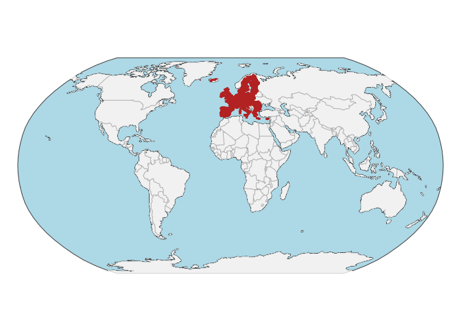
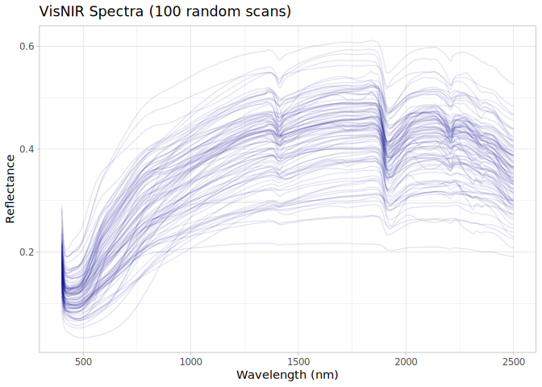
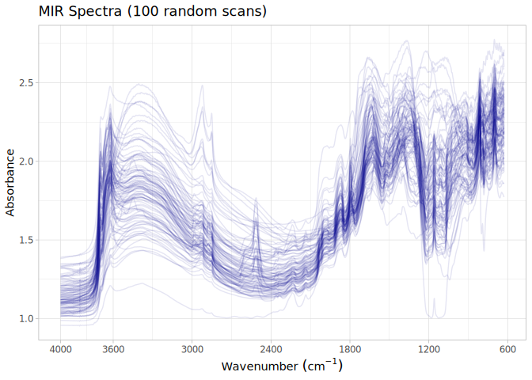

# LUCAS dataset preparation for the OSSL
Jose L. Safanelli, Ran Zhi, Tomislav Hengl, Jonathan Sanderman

- [Original data](#original-data)
- [Data standardization to the OSSL
  format](#data-standardization-to-the-ossl-format)
  - [Site information](#site-information)
  - [Soil lab information (reference analytical
    data)](#soil-lab-information-reference-analytical-data)
  - [VisNIR spectra](#visnir-spectra)
  - [Quality control for Vis-NIR](#quality-control-for-vis-nir)
  - [Mid-infrared spectra (MIR)](#mid-infrared-spectra-mir)
  - [Quality control for MIR](#quality-control-for-mir)
- [References](#references)

Code repository for preparing and importing the Brazilian Soil Spectral
Library (lucas) into the Open Soil Spectral Library.

Website: [Soil Spectroscopy for Global
Good](https://soilspectroscopy.org)  
Development: <https://github.com/soilspectroscopy>  
Last update: 2026-05-17  
Additional documentation:

## Original data

Soil samples from the LUCAS (Land Use/Cover Area frame statistical
Survey) of 23-28 European Union member states collected between 2009 and
2015 were scanned for VisNIR (Stevens, Nocita, Tóth, Montanarella, &
Wesemael ([2013](#ref-Stevens2013)), Nocita et al.
([2014](#ref-Nocita2014))).

The LUCAS topsoil data (Orgiazzi, Ballabio, Panagos, Jones, &
Fernández‐Ugalde ([2017](#ref-Orgiazzi2017))) used in this work was made
available by the European Commission through the European Soil Data
Centre managed by the [Joint Research Centre
(JRC)](http://esdac.jrc.ec.europa.eu/).

JRC has a restrictive license for redistribution, but permission was
granted to share it through the OSSL under the condition that “Graphical
representation of individual units on a map is permitted as far as the
geographical location of the soil samples is not detectable”.

Additional 600 samples from the LUCAS soil samples archive were scanned
at Woodwell Climate Research Center using a MIR instrument Dangal &
Sanderman ([2020](#ref-Dangal2020)).

Input datasets:

- `LUCAS.SOIL_corr.Rdata`: VNIR spectra.
- `LUCAS_Topsoil_2009_ESPG4326.csv`: Site and soil from 2009.
- `LUCAS_spectra_2015.rds`: VNIR from 2015.
- `LUCAS_Topsoil_complete_2015_ESPG4326.csv`: Site and soil from 2015.

Directory/folder path with original files (not uploaded to GitHub).

``` r
dir = "~/mnt-ossl-private/database/datasets/LUCAS"
tic()
```

## Data standardization to the OSSL format

### Site information

``` r
# Data from 2009-2012 survey
gpkg.lst <- list.files(dir, glob2rx("SoilAttr_*.gpkg$"), full.names = TRUE)

lucas.2009 <- lapply(gpkg.lst, function(i){
  sf::st_read(i) %>%
    dplyr::mutate(lon = sf::st_coordinates(.)[,1],
                  lat = sf::st_coordinates(.)[,2]) %>%
    dplyr::as_tibble(.) %>%
    dplyr::select(-geom)})
```

    Reading layer `SoilAttr_LUCAS2009_CYP_MLT' from data source 
      `/home/jsafanelli/mnt-ossl-private/database/datasets/LUCAS/SoilAttr_LUCAS2009_CYP_MLT.gpkg' 
      using driver `GPKG'
    Simple feature collection with 109 features and 17 fields
    Geometry type: POINT
    Dimension:     XY
    Bounding box:  xmin: 14.19216 ymin: 34.68497 xmax: 34.02966 ymax: 36.05225
    Geodetic CRS:  WGS 84
    Reading layer `SoilAttr_LUCAS2009_ICELAND' from data source 
      `/home/jsafanelli/mnt-ossl-private/database/datasets/LUCAS/SoilAttr_LUCAS2009_ICELAND.gpkg' 
      using driver `GPKG'
    Simple feature collection with 65 features and 17 fields
    Geometry type: POINT
    Dimension:     XY
    Bounding box:  xmin: -33.844 ymin: 64.31712 xmax: -16.19763 ymax: 66.29521
    Geodetic CRS:  WGS 84
    Reading layer `SoilAttr_LUCAS2009' from data source 
      `/home/jsafanelli/mnt-ossl-private/database/datasets/LUCAS/SoilAttr_LUCAS2009.gpkg' 
      using driver `GPKG'
    Simple feature collection with 19860 features and 17 fields
    Geometry type: POINT
    Dimension:     XY
    Bounding box:  xmin: -9.746389 ymin: 34.98376 xmax: 31.2741 ymax: 69.38229
    Geodetic CRS:  WGS 84
    Reading layer `SoilAttr_LUCAS2012_BG_RO' from data source 
      `/home/jsafanelli/mnt-ossl-private/database/datasets/LUCAS/SoilAttr_LUCAS2012_BG_RO.gpkg' 
      using driver `GPKG'
    Simple feature collection with 2034 features and 17 fields
    Geometry type: POINT
    Dimension:     XY
    Bounding box:  xmin: 20.39508 ymin: 41.2852 xmax: 29.07638 ymax: 48.18803
    Geodetic CRS:  WGS 84

``` r
lucas.2009.ofc <- fread(path(dir, "EU_2009_20200213.csv"))
```

    Warning in fread(path(dir, "EU_2009_20200213.csv")): Discarded single-line
    footer: <<234,623 rows selected. >>

``` r
lucas.2009.ofc <- lucas.2009.ofc %>%
  select(POINT_ID, LC1)

lucas.2012.ofc <- fread(path(dir, "EU_2012_20200213.CSV"))
```

    Warning in fread(path(dir, "EU_2012_20200213.CSV")): Discarded single-line
    footer: <<270.272 rows selected.>>

``` r
lucas.2012.ofc <- lucas.2012.ofc %>%
  select(POINT_ID, LC1)

lucas.2009 <- Reduce(dplyr::bind_rows, lucas.2009) %>%
  select(POINT_ID, lon, lat, Country) %>%
  left_join(lucas.2009.ofc, by = "POINT_ID") %>%
  left_join(lucas.2012.ofc, by = "POINT_ID") %>%
  mutate(POINT_ID = paste0("2009/2012.", POINT_ID)) %>%
  rename(id.layer_local_c = POINT_ID,
         longitude.point_wgs84_dd = lon,
         latitude.point_wgs84_dd = lat,
         loc.country_src_txt = Country,
         site.landuse2009_src_code = LC1.x,
         site.landuse2012_src_code = LC1.y) %>%
  mutate(id.layer_local_c = as.character(id.layer_local_c)) %>%
  mutate(layer.upper.depth_usda_cm = 0,
         layer.lower.depth_usda_cm = 20,
         observation.date.begin_iso.8601_yyyy.mm.dd = lubridate::ymd("2009-05-01"),
         observation.date.end_iso.8601_yyyy.mm.dd = lubridate::ymd("2012-08-01"))

# Data from 2015 survey
lucas.2015.x1 <- fread(path(dir, "/LUCAS_Topsoil_complete_2015_ESPG4326.csv"))

# lucas.2015 <- sf::st_read(path(dir, "/LUCAS_2015.gpkg")) %>%
#   dplyr::mutate(lon = sf::st_coordinates(.)[,1],
#                 lat = sf::st_coordinates(.)[,2]) %>%
#   dplyr::as_tibble(.) %>%
#   dplyr::select(-geom)

lucas.2015 <- lucas.2015.x1 %>%
  select(Point_ID, xcoord, ycoord, ADMIN, LC) %>%
  mutate(Point_ID = paste0("2015.", Point_ID)) %>%
  rename(id.layer_local_c = Point_ID,
         longitude.point_wgs84_dd = xcoord,
         latitude.point_wgs84_dd = ycoord,
         loc.country_src_txt = ADMIN,
         site.landuse2015_src_code = LC) %>%
  mutate(id.layer_local_c = as.character(id.layer_local_c)) %>%
  mutate(layer.upper.depth_usda_cm = 0,
         layer.lower.depth_usda_cm = 20,
         observation.date.begin_iso.8601_yyyy.mm.dd = lubridate::ymd("2015-03-01"),
         observation.date.end_iso.8601_yyyy.mm.dd = lubridate::ymd("2015-10-01"))

# Binding datasets
# Degrade location accuracy +/-1000m so we can share the points
lucas.sitedata <- bind_rows(lucas.2009, lucas.2015) %>% 
  mutate(longitude.point_wgs84_dd = longitude.point_wgs84_dd + rnorm(n(), 0, 0.005),
         latitude.point_wgs84_dd = latitude.point_wgs84_dd + rnorm(n(), 0, 0.005)) %>% 
  # mutate(id.project_ascii_txt = "Land Use and Coverage Area frame Survey (LUCAS) topsoil data",
  #        id.dataset.site_ascii_txt = str_sub(id.layer_local_c, 6, -1),
  #        layer.texture_usda_txt = "",
  #        pedon.taxa_usda_txt = "",
  #        horizon.designation_usda_txt = "",
  #        longitude.county_wgs84_dd = NA,
  #        latitude.county_wgs84_dd = NA,
  #        location.point.error_any_m = 1000,
  #        location.country_iso.3166_txt = "",
  #        observation.ogc.schema.title_ogc_txt = "Open Soil Spectroscopy Library",
  #        observation.ogc.schema_idn_url = "https://soilspectroscopy.github.io",
  #        surveyor.title_utf8_txt = "Institute for Environment and Sustainability (Joint Research Centre)",
  #        surveyor.contact_ietf_email = "ec-esdac@jrc.ec.europa.eu",
  #        surveyor.address_utf8_txt = "",
  #        dataset.title_utf8_txt = "LUCAS 2009, 2015 topsoil data",
  #        dataset.owner_utf8_txt = "European Soil Data Centre (ESDAC), European Commission, Joint Research Centre",
  #        dataset.code_ascii_txt = "LUCAS.SSL",
  #        dataset.address_idn_url = "https://esdac.jrc.ec.europa.eu/resource-type/soil-point-data",
  #        dataset.license.title_ascii_txt = "JRC License Agreement",
  #        dataset.license.address_idn_url = "https://esdac.jrc.ec.europa.eu/resource-type/soil-point-data",
  #        dataset.contact.name_utf8_txt = "ESDAC - European Commissiony",
  #        dataset.contact_ietf_email = "ec-esdac@jrc.ec.europa.eu") %>%
  mutate(dataset.code_ascii_txt = "LUCAS",
         id.layer_uuid_txt = openssl::md5(paste0(dataset.code_ascii_txt, id.layer_local_c)),
         .before = 1)

# Removing duplicates
lucas.sitedata %>%
  group_by(id.layer_local_c) %>%
  summarise(repeats = n()) %>%
  group_by(repeats) %>%
  summarise(count = n())
```

    # A tibble: 2 × 2
      repeats count
        <int> <int>
    1       1 43914
    2       2     1

``` r
dupli.ids <- lucas.sitedata %>%
  group_by(id.layer_local_c) %>%
  summarise(repeats = n()) %>%
  filter(repeats > 1) %>%
  pull(id.layer_local_c)

lucas.sitedata <- lucas.sitedata %>%
  filter(!(id.layer_local_c %in% dupli.ids)) %>%
  mutate_at(vars(starts_with("id.")), as.character)

# Saving version to dataset root dir
site.exp.file = path(dir, "ossl_soilsite_v1.3")
readr::write_csv(lucas.sitedata, str_c(site.exp.file, ".csv.gz"))
nanoparquet::write_parquet(lucas.sitedata, str_c(site.exp.file, ".parquet"))
```

Plotting sites map:

``` r
data("World")

ocean <- ne_download(scale = 110, type = "ocean", category = "physical", returnclass = "sf")
```

    Reading 'ne_110m_ocean.zip' from naturalearth...

``` r
points <- lucas.sitedata %>%
  filter(!is.na(longitude.point_wgs84_dd),
         !is.na(latitude.point_wgs84_dd)) %>%
  st_as_sf(coords = c('longitude.point_wgs84_dd', 'latitude.point_wgs84_dd'), crs = 4326)

tmap_mode("plot")
```

    ℹ tmap modes "plot" - "view"
    ℹ toggle with `tmap::ttm()`

``` r
tm_shape(ocean) +
  tm_polygons(fill = "lightblue", col = NA) +
  tm_shape(World) +
  tm_polygons('#f0f0f0f0', col_alpha = 0.2) +
  tm_shape(points) +
  tm_dots(size = 0.10, fill = "firebrick") +
  tm_crs("ESRI:54030") +
  tm_layout(frame = FALSE)
```

    [tip] Consider a suitable map projection, e.g. by adding `+ tm_crs("auto")`.
    This message is displayed once per session.



### Soil lab information (reference analytical data)

NOTE: The code chunk below must be run just once for getting a template
for scripted column standardization. Just run once for getting the
original names of soil properties, descriptions, data types, and units.
Then upload to Google Sheet for editing and manually defining the rules
for integrating with the OSSL. Requires Google authentication. A copy of
the output file is saved to this folder for archiving purposes.

**Always leave the sheet name as TEMP to avoid overwriting, then rename
online to download locally.**

``` r
gpkg.lst = list.files(dir, glob2rx("SoilAttr_*.gpkg$"), full.names = TRUE)
lucas.2009 = lapply(gpkg.lst, function(i){sf::st_read(i) %>% dplyr::as_tibble(.) %>% dplyr::select(-geom)})
lucas.2009 = Reduce(dplyr::bind_rows, lucas.2009)

lucas.2015 = fread(paste0(dir, "/LUCAS_Topsoil_2015_20200323.csv"))

soillab.names <- lucas.2009 %>%
  names(.) %>%
  tibble::tibble(original_name = .) %>%
  dplyr::mutate(table = 'LUCAS 2009/2012; SoilAttr_*.gpkg', .before = 1) %>%
  dplyr::bind_rows({
    lucas.2015 %>%
      names(.) %>%
      tibble::tibble(original_name = .) %>%
      dplyr::mutate(table = 'LUCAS_Topsoil_2015.csv', .before = 1)
  }) %>%
  dplyr::mutate(import = '', ossl_name = '', .after = original_name) %>%
  dplyr::mutate(comment = '')

readr::write_csv(soillab.names, paste0(getwd(), "/lucas_soillab_names.csv"))

# Uploading to google sheet

# Drive 'Open Soil Spectral Library'
# Folder 'Database v2'
googledrive::drive_ls(as_id("1l9VM4fFks2xBloDE69EFTfPgQeFx5aGw"))

# Use the ID of the file 'OSSL_v2_tab2_soildata_importing'
OSSL.soildata.importing <- "1mWTDJDuMp4oObcCxAy9gofSkrkcSWWf1TtEW2SuC1es"

# Checking metadata
googlesheets4::as_sheets_id(OSSL.soildata.importing)

# Checking readme
googlesheets4::read_sheet(OSSL.soildata.importing, sheet = 'readme')

# Preparing soillab.names for this dataset
upload <- dplyr::as_tibble(soillab.names)

# Uploading with TEMP name. Check online, move to sequence, and update name
googlesheets4::write_sheet(upload, ss = OSSL.soildata.importing, sheet = "TEMP")

# Checking metadata
googlesheets4::as_sheets_id(OSSL.soildata.importing)
```

NOTE: The code chunk below must be run just once. Run for getting the
column standardization rules after editing online on Google Sheets. A
copy of the edited standardization template is saved to this dataset
folder.

``` r
# Downloading from google sheet

# Checking metadata
googlesheets4::as_sheets_id("1mWTDJDuMp4oObcCxAy9gofSkrkcSWWf1TtEW2SuC1es")

# Preparing soillab.names
transvalues <- googlesheets4::read_sheet("1mWTDJDuMp4oObcCxAy9gofSkrkcSWWf1TtEW2SuC1es",
                                         sheet = "LUCAS")

# Saving to folder
write_csv(transvalues, path(getwd(), "soillab_standardized_names.csv"))
```

Reading standardization rules:

``` r
transvalues <- read_csv(path(getwd(), "soillab_standardized_names.csv"),
                        show_col_types = F) %>%
  filter(import == TRUE) %>%
  select(contains(c("table", "id", "original_name", "original_unit" , "ossl_")))

knitr::kable(transvalues)
```

| table | original_name | ossl_abbrev | ossl_method | ossl_unit | ossl_convert | ossl_name |
|:---|:---|:---|:---|:---|:---|:---|
| LUCAS 2009/2012; SoilAttr\_\*.gpkg | coarse | cf | iso.11464 | w.pct | ifelse(as.numeric(x) \< 0, NA, as.numeric(x)\*1) | cf_iso.11464_w.pct |
| LUCAS 2009/2012; SoilAttr\_\*.gpkg | clay | clay.tot | iso.11277 | w.pct | ifelse(as.numeric(x) \< 0, NA, as.numeric(x)\*1) | clay.tot_iso.11277_w.pct |
| LUCAS 2009/2012; SoilAttr\_\*.gpkg | silt | silt.tot | iso.11277 | w.pct | ifelse(as.numeric(x) \< 0, NA, as.numeric(x)\*1) | silt.tot_iso.11277_w.pct |
| LUCAS 2009/2012; SoilAttr\_\*.gpkg | sand | sand.tot | iso.11277 | w.pct | ifelse(as.numeric(x) \< 0, NA, as.numeric(x)\*1) | sand.tot_iso.11277_w.pct |
| LUCAS 2009/2012; SoilAttr\_\*.gpkg | pHinH2O | ph.h2o | iso.10390 | index | ifelse(as.numeric(x) \< 0, NA, as.numeric(x)\*1) | ph.h2o_iso.10390_index |
| LUCAS 2009/2012; SoilAttr\_\*.gpkg | pHinCaCl2 | ph.cacl2 | iso.10390 | index | ifelse(as.numeric(x) \< 0, NA, as.numeric(x)\*1) | ph.cacl2_iso.10390_index |
| LUCAS 2009/2012; SoilAttr\_\*.gpkg | OC | oc | iso.10694 | w.pct | ifelse(as.numeric(x) \< 0, NA, as.numeric(x)/10) | oc_iso.10694_w.pct |
| LUCAS 2009/2012; SoilAttr\_\*.gpkg | CaCO3 | caco3 | iso.10693 | w.pct | ifelse(as.numeric(x) \< 0, NA, as.numeric(x)/10) | caco3_iso.10693_w.pct |
| LUCAS 2009/2012; SoilAttr\_\*.gpkg | N | n.tot | iso.11261 | w.pct | ifelse(as.numeric(x) \< 0, NA, as.numeric(x)/10) | n.tot_iso.11261_w.pct |
| LUCAS 2009/2012; SoilAttr\_\*.gpkg | P | p.ext | iso.11263 | mg.kg | ifelse(as.numeric(x) \< 0, NA, as.numeric(x)\*1) | p.ext_iso.11263_mg.kg |
| LUCAS 2009/2012; SoilAttr\_\*.gpkg | K | k.ext | usda.a725 | cmolc.kg | ifelse(as.numeric(x) \< 0, NA, as.numeric(x)/(39.098\*10/2)) | k.ext_usda.a725_cmolc.kg |
| LUCAS 2009/2012; SoilAttr\_\*.gpkg | CEC | cec | iso.11260 | cmolc.kg | ifelse(as.numeric(x) \< 0, NA, as.numeric(x)\*1) | cec_iso.11260_cmolc.kg |
| LUCAS_Topsoil_2015.csv | Coarse | cf | iso.11464 | w.pct | ifelse(as.numeric(x) \< 0, NA, as.numeric(x)\*1) | cf_iso.11464_w.pct |
| LUCAS_Topsoil_2015.csv | Clay | clay.tot | iso.11277 | w.pct | ifelse(as.numeric(x) \< 0, NA, as.numeric(x)\*1) | clay.tot_iso.11277_w.pct |
| LUCAS_Topsoil_2015.csv | Sand | sand.tot | iso.11277 | w.pct | ifelse(as.numeric(x) \< 0, NA, as.numeric(x)\*1) | sand.tot_iso.11277_w.pct |
| LUCAS_Topsoil_2015.csv | Silt | silt.tot | iso.11277 | w.pct | ifelse(as.numeric(x) \< 0, NA, as.numeric(x)\*1) | silt.tot_iso.11277_w.pct |
| LUCAS_Topsoil_2015.csv | pH(CaCl2) | ph.cacl2 | iso.10390 | index | ifelse(as.numeric(x) \< 0, NA, as.numeric(x)\*1) | ph.cacl2_iso.10390_index |
| LUCAS_Topsoil_2015.csv | pH(H2O) | ph.h2o | iso.10390 | index | ifelse(as.numeric(x) \< 0, NA, as.numeric(x)\*1) | ph.h2o_iso.10390_index |
| LUCAS_Topsoil_2015.csv | EC | ec | iso.11265 | ds.m | ifelse(as.numeric(x) \< 0, NA, as.numeric(x)/100) | ec_iso.11265_ds.m |
| LUCAS_Topsoil_2015.csv | OC | oc | iso.10694 | w.pct | ifelse(as.numeric(x) \< 0, NA, as.numeric(x)/10) | oc_iso.10694_w.pct |
| LUCAS_Topsoil_2015.csv | CaCO3 | caco3 | iso.10693 | w.pct | ifelse(as.numeric(x) \< 0, NA, as.numeric(x)/10) | caco3_iso.10693_w.pct |
| LUCAS_Topsoil_2015.csv | P | p.ext | iso.11263 | mg.kg | ifelse(as.numeric(x) \< 0, NA, as.numeric(x)\*1) | p.ext_iso.11263_mg.kg |
| LUCAS_Topsoil_2015.csv | N | n.tot | iso.11261 | w.pct | ifelse(as.numeric(x) \< 0, NA, as.numeric(x)/10) | n.tot_iso.11261_w.pct |
| LUCAS_Topsoil_2015.csv | K | k.ext | usda.a725 | cmolc.kg | ifelse(as.numeric(x) \< 0, NA, as.numeric(x)/(39.098\*10/2)) | k.ext_usda.a725_cmolc.kg |

Standardizing soil data to the OSSL format:

``` r
# Data from 2009-2012 survey
gpkg.lst <- list.files(dir, glob2rx("SoilAttr_*.gpkg$"), full.names = TRUE)

lucas.2009 <- lapply(gpkg.lst, function(i){
  sf::st_read(i) %>%
    dplyr::as_tibble(.) %>%
    dplyr::select(-geom)})
```

    Reading layer `SoilAttr_LUCAS2009_CYP_MLT' from data source 
      `/home/jsafanelli/mnt-ossl-private/database/datasets/LUCAS/SoilAttr_LUCAS2009_CYP_MLT.gpkg' 
      using driver `GPKG'
    Simple feature collection with 109 features and 17 fields
    Geometry type: POINT
    Dimension:     XY
    Bounding box:  xmin: 14.19216 ymin: 34.68497 xmax: 34.02966 ymax: 36.05225
    Geodetic CRS:  WGS 84
    Reading layer `SoilAttr_LUCAS2009_ICELAND' from data source 
      `/home/jsafanelli/mnt-ossl-private/database/datasets/LUCAS/SoilAttr_LUCAS2009_ICELAND.gpkg' 
      using driver `GPKG'
    Simple feature collection with 65 features and 17 fields
    Geometry type: POINT
    Dimension:     XY
    Bounding box:  xmin: -33.844 ymin: 64.31712 xmax: -16.19763 ymax: 66.29521
    Geodetic CRS:  WGS 84
    Reading layer `SoilAttr_LUCAS2009' from data source 
      `/home/jsafanelli/mnt-ossl-private/database/datasets/LUCAS/SoilAttr_LUCAS2009.gpkg' 
      using driver `GPKG'
    Simple feature collection with 19860 features and 17 fields
    Geometry type: POINT
    Dimension:     XY
    Bounding box:  xmin: -9.746389 ymin: 34.98376 xmax: 31.2741 ymax: 69.38229
    Geodetic CRS:  WGS 84
    Reading layer `SoilAttr_LUCAS2012_BG_RO' from data source 
      `/home/jsafanelli/mnt-ossl-private/database/datasets/LUCAS/SoilAttr_LUCAS2012_BG_RO.gpkg' 
      using driver `GPKG'
    Simple feature collection with 2034 features and 17 fields
    Geometry type: POINT
    Dimension:     XY
    Bounding box:  xmin: 20.39508 ymin: 41.2852 xmax: 29.07638 ymax: 48.18803
    Geodetic CRS:  WGS 84

``` r
lucas.2009 <- Reduce(dplyr::bind_rows, lucas.2009) %>%
  mutate(POINT_ID = paste0("2009/2012.", POINT_ID))

# Harmonization of names and units
# 2009 analyte selection and names
analytes.2009.old.names <- transvalues %>%
  filter(table == "LUCAS 2009/2012; SoilAttr_*.gpkg") %>%
  filter(original_name != "POINT_ID") %>%
  pull(original_name)

analytes.2009.new.names <- transvalues %>%
  filter(table == "LUCAS 2009/2012; SoilAttr_*.gpkg") %>%
  filter(original_name != "POINT_ID") %>%
  pull(ossl_name)

# Selecting and renaming
lucas.2009 <- lucas.2009 %>%
  rename(id.layer_local_c = POINT_ID) %>%
  select(id.layer_local_c, all_of(analytes.2009.old.names)) %>%
  rename_with(~analytes.2009.new.names, all_of(analytes.2009.old.names))

# Removing duplicates
# lucas.2009 %>%
#   group_by(id.layer_local_c) %>%
#   summarise(repeats = n()) %>%
#   group_by(repeats) %>%
#   summarise(count = n())

dupli.ids.2009 <- lucas.2009 %>%
  group_by(id.layer_local_c) %>%
  summarise(repeats = n()) %>%
  filter(repeats > 1) %>%
  pull(id.layer_local_c)

lucas.2009 <- lucas.2009 %>%
  filter(!(id.layer_local_c %in% dupli.ids.2009)) %>%
  as.data.frame()

# Getting the formulas
functions.list <- transvalues %>%
  filter(table == "LUCAS 2009/2012; SoilAttr_*.gpkg") %>%
  mutate(ossl_name = factor(ossl_name, levels = names(lucas.2009))) %>%
  arrange(ossl_name) %>%
  pull(ossl_convert) %>%
  c("x", .)

# Applying transformation rules
lucas.2009.trans <- transform_values(df = lucas.2009,
                                     out.name = names(lucas.2009),
                                     in.name = names(lucas.2009),
                                     fun.lst = functions.list)
```

    Warning in ifelse(as.numeric(x) < 0, NA, as.numeric(x)/10): NAs introduced by
    coercion
    Warning in ifelse(as.numeric(x) < 0, NA, as.numeric(x)/10): NAs introduced by
    coercion
    Warning in ifelse(as.numeric(x) < 0, NA, as.numeric(x)/10): NAs introduced by
    coercion
    Warning in ifelse(as.numeric(x) < 0, NA, as.numeric(x)/10): NAs introduced by
    coercion

    Warning in ifelse(as.numeric(x) < 0, NA, as.numeric(x) * 1): NAs introduced by
    coercion
    Warning in ifelse(as.numeric(x) < 0, NA, as.numeric(x) * 1): NAs introduced by
    coercion

``` r
# Data from 2015 survey
lucas.2015 = fread(path(dir, "/LUCAS_Topsoil_2015_20200323.csv")) %>%
  mutate(Point_ID = paste0("2015.", Point_ID))

# Harmonization of names and units
# 2015 analyte selection and names
analytes.2015.old.names <- transvalues %>%
  filter(table == "LUCAS_Topsoil_2015.csv") %>%
  filter(original_name != "POINT_ID") %>%
  pull(original_name)

analytes.2015.new.names <- transvalues %>%
  filter(table == "LUCAS_Topsoil_2015.csv") %>%
  filter(original_name != "POINT_ID") %>%
  pull(ossl_name)

# Selecting and renaming
lucas.2015 <- lucas.2015 %>%
  rename(id.layer_local_c = Point_ID) %>%
  select(id.layer_local_c, all_of(analytes.2015.old.names)) %>%
  rename_with(~analytes.2015.new.names, all_of(analytes.2015.old.names))

# Removing duplicates
# lucas.2015 %>%
#   group_by(id.layer_local_c) %>%
#   summarise(repeats = n()) %>%
#   group_by(repeats) %>%
#   summarise(count = n())

dupli.ids.2015 <- lucas.2015 %>%
  group_by(id.layer_local_c) %>%
  summarise(repeats = n()) %>%
  filter(repeats > 1) %>%
  pull(id.layer_local_c)

lucas.2015 <- lucas.2015 %>%
  filter(!(id.layer_local_c %in% dupli.ids.2015)) %>%
  as.data.frame()

# Getting the formulas
functions.list <- transvalues %>%
  filter(table == "LUCAS_Topsoil_2015.csv") %>%
  mutate(ossl_name = factor(ossl_name, levels = names(lucas.2015))) %>%
  arrange(ossl_name) %>%
  pull(ossl_convert) %>%
  c("x", .)

# Applying transformation rules
lucas.2015.trans <- transform_values(df = lucas.2015,
                                     out.name = names(lucas.2015),
                                     in.name = names(lucas.2015),
                                     fun.lst = functions.list)

# Final soillab data
lucas.soildata <- bind_rows(lucas.2009.trans, lucas.2015.trans) %>%
  mutate_at(vars(starts_with("id.")), as.character)

# Checking total number of observations
lucas.soildata %>%
  distinct(id.layer_local_c) %>%
  summarise(count = n())
```

      count
    1 43925

``` r
# Saving version to dataset root dir
soillab.exp.file = path(dir, "ossl_soillab_v1.3")
readr::write_csv(lucas.soildata, str_c(soillab.exp.file, ".csv.gz"))
nanoparquet::write_parquet(lucas.soildata, str_c(soillab.exp.file, ".parquet"))
```

Soil lab data summary.

``` r
lucas.soildata %>%
  mutate(id.layer_local_c = factor(id.layer_local_c)) %>%
  skimr::skim() %>%
  dplyr::select(-numeric.hist, -complete_rate)
```

|                                                  |            |
|:-------------------------------------------------|:-----------|
| Name                                             | Piped data |
| Number of rows                                   | 43925      |
| Number of columns                                | 14         |
| \_\_\_\_\_\_\_\_\_\_\_\_\_\_\_\_\_\_\_\_\_\_\_   |            |
| Column type frequency:                           |            |
| factor                                           | 1          |
| numeric                                          | 13         |
| \_\_\_\_\_\_\_\_\_\_\_\_\_\_\_\_\_\_\_\_\_\_\_\_ |            |
| Group variables                                  | None       |

Data summary

**Variable type: factor**

| skim_variable    | n_missing | ordered | n_unique | top_counts                     |
|:-----------------|----------:|:--------|---------:|:-------------------------------|
| id.layer_local_c |         0 | FALSE   |    43925 | 200: 1, 200: 1, 200: 1, 200: 1 |

**Variable type: numeric**

| skim_variable            | n_missing |  mean |    sd |   p0 |   p25 |   p50 |   p75 |    p100 |
|:-------------------------|----------:|------:|------:|-----:|------:|------:|------:|--------:|
| cf_iso.11464_w.pct       |     17601 | 14.89 | 13.09 | 0.00 |  5.00 | 11.00 | 21.00 |   92.00 |
| clay.tot_iso.11277_w.pct |     17628 | 19.69 | 14.63 | 0.00 |  8.00 | 17.00 | 28.00 |   96.00 |
| silt.tot_iso.11277_w.pct |     17630 | 37.24 | 19.06 | 0.00 | 24.00 | 38.00 | 51.00 |   93.00 |
| sand.tot_iso.11277_w.pct |     17628 | 38.78 | 26.01 | 0.00 | 16.00 | 36.00 | 59.00 |  100.00 |
| ph.h2o_iso.10390_index   |         2 |  6.19 |  1.34 | 3.17 |  5.02 |  6.18 |  7.48 |   10.37 |
| ph.cacl2_iso.10390_index |         2 |  5.71 |  1.40 | 2.57 |  4.50 |  5.76 |  7.10 |   10.00 |
| oc_iso.10694_w.pct       |       249 |  4.52 |  8.22 | 0.01 |  1.26 |  2.02 |  3.79 |   58.68 |
| caco3_iso.10693_w.pct    |       697 |  5.44 | 13.05 | 0.00 |  0.00 |  0.10 |  1.60 |   97.60 |
| n.tot_iso.11261_w.pct    |         7 |  0.30 |  0.36 | 0.00 |  0.12 |  0.18 |  0.30 |    3.86 |
| p.ext_iso.11263_mg.kg    |       697 | 31.21 | 32.69 | 0.00 | 10.90 | 22.70 | 43.00 | 1366.40 |
| k.ext_usda.a725_cmolc.kg |         2 |  1.02 |  1.18 | 0.00 |  0.39 |  0.74 |  1.29 |   51.31 |
| cec_iso.11260_cmolc.kg   |     21882 | 17.31 | 15.19 | 0.00 |  7.50 | 13.50 | 22.80 |  234.00 |
| ec_iso.11265_ds.m        |     22066 |  0.26 |  0.33 | 0.00 |  0.10 |  0.17 |  0.28 |    9.69 |

### VisNIR spectra

VNIR spectra is stored in absorbacen units, need to transform to
reflectance. Also, splice correction at

``` r
# Spectra from 2009/2012
load(path(dir, "LUCAS.SOIL_corr.Rdata"))

visnir.scans.2009 <- LUCAS.SOIL$spc

lucas.2009.keys <- LUCAS.SOIL %>%
  select(ID, POINT_ID) %>%
  rename(id.scan_local_c = ID, id.layer_local_c = POINT_ID)

visnir.scans.2009 <- visnir.scans.2009 %>%
  rownames_to_column(var = "id.scan_local_c") %>%
  select(id.scan_local_c, any_of(as.character(seq(400, 2500, by = 0.5))))

# Not interpolation to avoid smoothing the splice
old.wavelength <- names(visnir.scans.2009)[-1]
new.wavelength <- seq(400, 2500, by = 2)

visnir.scans.2009 <- visnir.scans.2009 %>%
  select(id.scan_local_c, any_of(as.character(new.wavelength)))
# as.matrix() %>%
# prospectr::resample(X = ., wav = old.wavelength, 
#                     new.wav = new.wavelength, interpol = "spline") %>%
# as_tibble() %>%
# bind_cols({visnir.scans.2009 %>%
#     select(id.scan_local_c)}, .)

# # Metadata 2009/2012
# visnir.metadata.2009 <- visnir.scans.2009 %>%
#   select(id.scan_local_c) %>%
#   mutate(scan.visnir.date.begin_iso.8601_yyyy.mm.dd = lubridate::ymd("2009-05-01"),
#          scan.visnir.date.end_iso.8601_yyyy.mm.dd = lubridate::ymd("2012-08-01")) %>%
#   mutate(scan.visnir.license.title_ascii_txt = "JRC License Agreement",
#          scan.visnir.license.address_idn_url = "https://esdac.jrc.ec.europa.eu/content/lucas-2009-topsoil-data",
#          scan.visnir.doi_idf_url = "https://data.europa.eu/doi/10.2788/97922")

# lucas.visnir.2009 <- left_join(visnir.metadata.2009, visnir.scans.2009, by = "id.scan_local_c") %>%
#   left_join(lucas.2009.keys, ., by = "id.scan_local_c")

lucas.visnir.2009 <- left_join(visnir.scans.2009, lucas.2009.keys, by = "id.scan_local_c")

lucas.visnir.2009 <- lucas.visnir.2009 %>%
  mutate(id.layer_local_c = paste0("2009/2012.", id.layer_local_c)) %>%
  relocate(id.layer_local_c, .before = 1)

# Spectra from 2015
visnir.scans.2015 <- readRDS(path(dir, "LUCAS_spectra_2015.rds"))

visnir.scans.2015 <- visnir.scans.2015 %>%
  select(PointID, any_of(as.character(seq(400, 2500, by = 0.5)))) %>%
  rename(id.layer_local_c = PointID)

old.wavelength <- names(visnir.scans.2015)[-1]
new.wavelength <- seq(400, 2500, by = 2)

# No interpolation needed
visnir.scans.2015 <- visnir.scans.2015 %>%
  select(id.layer_local_c, any_of(as.character(new.wavelength)))
  # select(-id.layer_local_c) %>%
  # as.matrix() %>%
  # prospectr::resample(X = ., wav = old.wavelength,
  #                     new.wav = new.wavelength, interpol = "spline") %>%
  # as_tibble() %>%
  # bind_cols({visnir.scans.2015 %>%
  #     select(id.layer_local_c)}, .)

# visnir.scans.2015 <- visnir.scans.2015 %>%
#   group_by(id.layer_local_c) %>%
#   summarise_all(mean)

visnir.scans.2015 <- visnir.scans.2015 %>%
  mutate(across(-id.layer_local_c, ~as.numeric(.x)))

visnir.scans.2015 <- visnir.scans.2015[, lapply(.SD, mean), by = id.layer_local_c]

# visnir.metadata.2015 <- visnir.scans.2015 %>%
#   select(id.layer_local_c) %>%
#   mutate(scan.visnir.date.begin_iso.8601_yyyy.mm.dd = lubridate::ymd("2015-03-01"),
#          scan.visnir.date.end_iso.8601_yyyy.mm.dd = lubridate::ymd("2015-12-01")) %>%
#   mutate(scan.visnir.license.title_ascii_txt = "JRC License Agreement",
#          scan.visnir.license.address_idn_url = "https://esdac.jrc.ec.europa.eu/content/lucas-2015-topsoil-data",
#          scan.visnir.doi_idf_url = "https://data.europa.eu/doi/10.2760/616084")
# 
# lucas.visnir.2015 <- left_join(visnir.metadata.2015, visnir.scans.2015, by = "id.layer_local_c")

lucas.visnir.2015 <- visnir.scans.2015 %>%
  mutate(id.scan_local_c = as.character(id.layer_local_c), .after = id.layer_local_c) %>%
  mutate(id.layer_local_c = paste0("2015.", id.layer_local_c))

# Binding both spectra
# lucas.visnir <- bind_rows(lucas.visnir.2009, lucas.visnir.2015) %>%
#   mutate(id.scan_local_c = id.layer_local_c, .after = id.layer_local_c) %>%
#   mutate(scan.visnir.model.name_utf8_txt = "Metrohm NIRS XDS RapidContent Analyzer",
#          scan.visnir.model.code_any_txt = "Metrohm_NIRS_XDS_RapidContent_Analyzer",
#          scan.visnir.method.optics_any_txt = "",
#          scan.visnir.method.preparation_any_txt = "Sieved <2 mm",
#          scan.visnir.contact.name_utf8_txt = "ESDAC - European Commission",
#          scan.visnir.contact.email_ietf_txt = "ec-esdac@jrc.ec.europa.eu",
#          .after = scan.visnir.doi_idf_url)

# Padding and reflectance transform
lucas.visnir <- bind_rows(lucas.visnir.2009, lucas.visnir.2015)

lucas.visnir <- lucas.visnir %>%
  mutate(`2500` = `2498`)

lucas.visnir <- lucas.visnir %>%
  mutate(across(all_of(as.character(new.wavelength)), ~1/10^(.x)))

# Splice correction
lucas.visnir <- lucas.visnir %>%
  select(-starts_with("id")) %>%
  as.matrix() %>%
  spliceCorrection(wav = new.wavelength,
                   splice = c(1098), interpol.bands = 10) %>%
  as_tibble() %>%
  bind_cols({lucas.visnir %>%
      select(starts_with("id"))}, .)

# Spectral consistency analysis

# Gaps
scans.na.gaps <- lucas.visnir %>%
  dplyr::select(all_of(as.character(new.wavelength))) %>%
  apply(., 1, function(x) round(100*(sum(is.na(x)))/(length(x)), 2)) %>%
  tibble(proportion_NA = .) %>%
  bind_cols({lucas.visnir %>% select(id.scan_local_c)}, .)

# Extreme negative
scans.extreme.neg <- lucas.visnir %>%
  select(all_of(as.character(new.wavelength))) %>%
  apply(., 1, function(x) {round(100*(sum(x < 0, na.rm=TRUE))/(length(x)), 2)}) %>%
  tibble(proportion_lower0 = .) %>%
  bind_cols({lucas.visnir %>% select(id.scan_local_c)}, .)

# Extreme positive
scans.extreme.pos <- lucas.visnir %>%
  select(all_of(as.character(new.wavelength))) %>%
  apply(., 1, function(x) {round(100*(sum(x > 1, na.rm=TRUE))/(length(x)), 2)}) %>%
  tibble(proportion_higherRef1 = .) %>%
  bind_cols({lucas.visnir %>% select(id.scan_local_c)}, .)

# Consistency summary
scans.summary <- scans.na.gaps %>%
  left_join(scans.extreme.neg, by = "id.scan_local_c") %>%
  left_join(scans.extreme.pos, by = "id.scan_local_c")

scans.summary %>%
  select(-id.scan_local_c) %>%
  pivot_longer(everything(), names_to = "check", values_to = "value") %>%
  filter(value > 0) %>%
  group_by(check) %>%
  summarise(count = n())
```

    # A tibble: 0 × 2
    # ℹ 2 variables: check <chr>, count <int>

``` r
# Renaming and exporting
old.wavelength <- as.character(seq(400, 2500, by = 2))
new.wavelength <- paste0("scan_visnir.", old.wavelength, "_ref")

lucas.visnir <- lucas.visnir %>%
  rename_with(~new.wavelength, all_of(as.character(old.wavelength)))

lucas.visnir.export <- lucas.visnir %>%
  mutate_at(vars(starts_with("id.")), as.character)

# Saving version to dataset root dir
visnir.exp.file = path(dir, "ossl_visnir_v1.3")
readr::write_csv(lucas.visnir.export, str_c(visnir.exp.file, ".csv.gz"))
nanoparquet::write_parquet(lucas.visnir.export, str_c(visnir.exp.file, ".parquet"))
```

### Quality control for Vis-NIR

The final table must be joined as follows:

- VisNIR is used as first reference for pairing with soil data.
- Site and soil lab data are left joined to VisNIR. This drop data
  without any available scan.

The availability of data is summarized below:

``` r
# Taking a few representative columns for checking the consistency of joins
lucas.availability <- lucas.visnir.export %>%
  select(id.layer_local_c, scan_visnir.600_ref) %>%
  left_join(lucas.soildata, by = "id.layer_local_c")

# Availability of information from lucas
lucas.availability %>%
  mutate_all(as.character) %>%
  pivot_longer(everything(), names_to = "column", values_to = "value") %>%
  filter(!is.na(value)) %>%
  group_by(column) %>%
  summarise(count = n())
```

    # A tibble: 15 × 2
       column                   count
       <chr>                    <int>
     1 caco3_iso.10693_w.pct    40816
     2 cec_iso.11260_cmolc.kg   19034
     3 cf_iso.11464_w.pct       23289
     4 clay.tot_iso.11277_w.pct 23291
     5 ec_iso.11265_ds.m        21782
     6 id.layer_local_c         40818
     7 k.ext_usda.a725_cmolc.kg 40816
     8 n.tot_iso.11261_w.pct    40816
     9 oc_iso.10694_w.pct       40816
    10 p.ext_iso.11263_mg.kg    40816
    11 ph.cacl2_iso.10390_index 40816
    12 ph.h2o_iso.10390_index   40816
    13 sand.tot_iso.11277_w.pct 23291
    14 scan_visnir.600_ref      40818
    15 silt.tot_iso.11277_w.pct 23291

Soil analytical data summary for Vis-NIR. Note: many scans could not be
linked with the wetchem.

``` r
lucas.availability %>%
  mutate(id.layer_local_c = factor(id.layer_local_c)) %>%
  skimr::skim() %>%
  dplyr::select(-numeric.hist, -complete_rate)
```

|                                                  |            |
|:-------------------------------------------------|:-----------|
| Name                                             | Piped data |
| Number of rows                                   | 40818      |
| Number of columns                                | 15         |
| \_\_\_\_\_\_\_\_\_\_\_\_\_\_\_\_\_\_\_\_\_\_\_   |            |
| Column type frequency:                           |            |
| factor                                           | 1          |
| numeric                                          | 14         |
| \_\_\_\_\_\_\_\_\_\_\_\_\_\_\_\_\_\_\_\_\_\_\_\_ |            |
| Group variables                                  | None       |

Data summary

**Variable type: factor**

| skim_variable    | n_missing | ordered | n_unique | top_counts                     |
|:-----------------|----------:|:--------|---------:|:-------------------------------|
| id.layer_local_c |         0 | FALSE   |    40792 | 200: 2, 200: 2, 200: 2, 200: 2 |

**Variable type: numeric**

| skim_variable            | n_missing |  mean |    sd |   p0 |   p25 |   p50 |   p75 |    p100 |
|:-------------------------|----------:|------:|------:|-----:|------:|------:|------:|--------:|
| scan_visnir.600_ref      |         0 |  0.21 |  0.07 | 0.03 |  0.16 |  0.21 |  0.25 |    0.66 |
| cf_iso.11464_w.pct       |     17529 | 14.71 | 11.96 | 0.00 |  6.00 | 11.00 | 20.00 |   90.00 |
| clay.tot_iso.11277_w.pct |     17527 | 18.06 | 12.94 | 0.00 |  7.00 | 16.00 | 26.00 |   79.00 |
| silt.tot_iso.11277_w.pct |     17527 | 37.37 | 18.96 | 0.00 | 24.00 | 38.00 | 51.00 |   92.00 |
| sand.tot_iso.11277_w.pct |     17527 | 39.86 | 25.98 | 0.00 | 18.00 | 38.00 | 60.00 |  100.00 |
| ph.h2o_iso.10390_index   |         2 |  6.16 |  1.35 | 3.17 |  4.96 |  6.13 |  7.46 |   10.37 |
| ph.cacl2_iso.10390_index |         2 |  5.67 |  1.41 | 2.57 |  4.40 |  5.70 |  7.10 |   10.00 |
| oc_iso.10694_w.pct       |         2 |  4.64 |  8.39 | 0.01 |  1.26 |  2.05 |  3.91 |   58.68 |
| caco3_iso.10693_w.pct    |         2 |  5.47 | 13.09 | 0.00 |  0.00 |  0.10 |  1.50 |   97.60 |
| n.tot_iso.11261_w.pct    |         2 |  0.30 |  0.37 | 0.00 |  0.12 |  0.19 |  0.31 |    3.86 |
| p.ext_iso.11263_mg.kg    |         2 | 31.43 | 32.64 | 0.00 | 11.10 | 23.10 | 43.40 | 1366.40 |
| k.ext_usda.a725_cmolc.kg |         2 |  1.00 |  1.18 | 0.00 |  0.38 |  0.72 |  1.26 |   51.31 |
| cec_iso.11260_cmolc.kg   |     21784 | 15.78 | 14.46 | 1.00 |  7.00 | 12.40 | 20.30 |  234.00 |
| ec_iso.11265_ds.m        |     19036 |  0.26 |  0.33 | 0.00 |  0.10 |  0.17 |  0.28 |    9.69 |

Vis-NIR spectral visualization (100 random spectra):

``` r
set.seed(42)
lucas.visnir.export %>%
  sample_n(100) %>%
  pivot_longer(starts_with("scan_visnir."),
               names_to = "wavelength", values_to = "intensity") %>%
  mutate(wavelength = gsub("scan_visnir.|_ref", "", wavelength)) %>%
  mutate(wavelength = as.numeric(wavelength),
         intensity = as.numeric(intensity)) %>%
  ggplot(aes(x = wavelength, y = intensity, group = id.layer_local_c)) +
  geom_line(alpha = 0.1, color = "darkblue") +
  # scale_x_continuous(breaks = seq(350, 2500, by = 250))+
  labs(title = "VisNIR Spectra (100 random scans)",
       x = "Wavelength (nm)",
       y = "Reflectance") +
  theme_light()
```



### Mid-infrared spectra (MIR)

MIR is stored in reflectance units, so we transform to absorbance.

``` r
# Floating wavenumbers
mir.scans <- fread(path(dir, "LUCAS_Woodwell.csv"), header = TRUE)

# Need to resample spectra
old.wavenumber <- na.omit(as.numeric(names(mir.scans)))
```

    Warning in na.omit(as.numeric(names(mir.scans))): NAs introduced by coercion

``` r
new.wavenumbers <- rev(seq(628, 4000, by = 2))

lucas.mir <- mir.scans %>%
  select(POINT_ID, all_of(as.character(old.wavenumber))) %>%
  rename(id.layer_local_c = POINT_ID) %>%
  mutate(id.layer_local_c = paste0("2009/2012.", id.layer_local_c))

lucas.mir <- lucas.mir %>%
  select(-id.layer_local_c) %>%
  as.matrix() %>%
  prospectr::resample(X = ., wav = old.wavenumber,
                      new.wav = new.wavenumbers, interpol = "spline") %>%
  as_tibble() %>%
  bind_cols({lucas.mir %>%
      select(id.layer_local_c)}, .) %>%
  select(id.layer_local_c, as.character(rev(new.wavenumbers))) %>%
  mutate(id.layer_local_c = as.character(id.layer_local_c))

# Checking duplicates
dupli.ids <- lucas.mir %>%
  group_by(id.layer_local_c) %>%
  summarise(repeats = n()) %>%
  filter(repeats > 1) %>%
  pull(id.layer_local_c)

lucas.mir <- lucas.mir %>%
  filter(!(id.layer_local_c %in% dupli.ids)) %>%
  as_tibble()

# Spectral consistency analysis

# Gaps
scans.na.gaps <- lucas.mir %>%
  select(-id.layer_local_c) %>%
  apply(., 1, function(x) round(100*(sum(is.na(x)))/(length(x)), 2)) %>%
  tibble(proportion_NA = .) %>%
  bind_cols({lucas.mir %>% select(id.layer_local_c)}, .)

# Extreme negative - irreversible erratic patterns
scans.extreme.neg <- lucas.mir %>%
  select(-id.layer_local_c) %>%
  apply(., 1, function(x) {round(100*(sum(x < -1, na.rm=TRUE))/(length(x)), 2)}) %>%
  tibble(proportion_lower0 = .) %>%
  bind_cols({lucas.mir %>% select(id.layer_local_c)}, .)

# Extreme positive, irreversible erratic patterns
scans.extreme.pos <- lucas.mir %>%
  select(-id.layer_local_c) %>%
  apply(., 1, function(x) {round(100*(sum(x > 3.5, na.rm=TRUE))/(length(x)), 2)}) %>%
  tibble(proportion_higherAbs5 = .) %>%
  bind_cols({lucas.mir %>% select(id.layer_local_c)}, .)

# Consistency summary - problematic scans
scans.summary <- scans.na.gaps %>%
  left_join(scans.extreme.neg, by = "id.layer_local_c") %>%
  left_join(scans.extreme.pos, by = "id.layer_local_c")

scans.summary %>%
  select(-id.layer_local_c) %>%
  pivot_longer(everything(), names_to = "check", values_to = "value") %>%
  filter(value > 0) %>%
  group_by(check) %>%
  summarise(count = n())
```

    # A tibble: 0 × 2
    # ℹ 2 variables: check <chr>, count <int>

``` r
# # These few scans with extreme values are filled with interpolation
# target.wavenumbers <- seq(600, 4000, by = 2)
# 
# lucas.mir.clean <- lucas.mir %>%
#   pivot_longer(-id.layer_local_c, names_to = "wavenumber", values_to = "absorbance") %>%
#   mutate(absorbance = ifelse(absorbance > 3.5, NA, absorbance)) %>%
#   group_by(id.layer_local_c) %>%
#   mutate(absorbance = approx(wavenumber, absorbance, target.wavenumbers)$y) %>%
#   pivot_wider(names_from = "wavenumber", values_from = "absorbance")

# Renaming
new.wavenumbers.names <- paste0("scan_mir.", new.wavenumbers, "_abs")

lucas.mir <- lucas.mir %>%
  rename_with(~new.wavenumbers.names, as.character(new.wavenumbers))

# # Preparing metadata
# lucas.mir.metadata <- mir.scans %>%
#   select(POINT_ID, WHRC_ID, run_date) %>%
#   rename(id.layer_local_c = POINT_ID, id.scan_local_c = WHRC_ID,
#          scan.mir.date.begin_iso.8601_yyyy.mm.dd = run_date) %>%
#   mutate(id.layer_local_c = as.character(id.layer_local_c)) %>%
#   mutate(id.layer_local_c = paste0("2009.", id.layer_local_c),
#          scan.mir.date.begin_iso.8601_yyyy.mm.dd = dmy(scan.mir.date.begin_iso.8601_yyyy.mm.dd)) %>%
#   filter(!(id.layer_local_c %in% dupli.ids)) %>%
#   mutate(dataset.code_ascii_txt = "LUCAS.WOODWELL.SSL",
#          scan.mir.date.end_iso.8601_yyyy.mm.dd = scan.mir.date.begin_iso.8601_yyyy.mm.dd,
#          scan.mir.model.name_utf8_txt = "Bruker Vertex 70 with with PikeAutoDiff accessory",
#          scan.mir.model.code_any_txt = "Bruker_Vertex_70.PikeAutoDiff",
#          scan.mir.method.optics_any_txt = "KBr beamsplitter; Gold mirror; Mirror background",
#          scan.mir.method.preparation_any_txt = "",
#          scan.mir.license.title_ascii_txt = "CC-BY",
#          scan.mir.license.address_idn_url = "https://creativecommons.org/licenses/by/4.0/",
#          scan.mir.doi_idf_url = "https://doi.org/10.3390/s20236729",
#          scan.mir.contact.name_utf8_txt = "Jonathan Sanderman",
#          scan.mir.contact.email_ietf_txt = "jsanderman@woodwellclimate.org")

# Final preparation
# lucas.mir.export <- lucas.mir.metadata %>%
#   left_join(lucas.mir, by = "id.layer_local_c") %>%
#   mutate_at(vars(starts_with("id.")), as.character)

lucas.mir.export <- lucas.mir %>%
  mutate_at(vars(starts_with("id.")), as.character)

# Saving version to dataset root dir
mir.exp.file = path(dir, "ossl_mir_v1.3")
readr::write_csv(lucas.mir.export, str_c(mir.exp.file, ".csv.gz"))
nanoparquet::write_parquet(lucas.mir.export, str_c(mir.exp.file, ".parquet"))
```

### Quality control for MIR

The final table must be joined as follows:

- MIR is used as first reference for pairing with soil data.
- Soil lab data are left joined to MIR. This drop data without any
  available scan.

The availability of data is summarized below:

``` r
# Taking a few representative columns for checking the consistency of joins
lucas.availability2 <- lucas.mir.export %>%
  select(id.layer_local_c, scan_mir.1000_abs) %>%
  left_join(lucas.soildata, by = "id.layer_local_c") %>%
  filter(!is.na(id.layer_local_c))

# Availability of information from lucas
lucas.availability2 %>%
  mutate_all(as.character) %>%
  pivot_longer(everything(), names_to = "column", values_to = "value") %>%
  filter(!is.na(value)) %>%
  group_by(column) %>%
  summarise(count = n())
```

    # A tibble: 14 × 2
       column                   count
       <chr>                    <int>
     1 caco3_iso.10693_w.pct      589
     2 cec_iso.11260_cmolc.kg     589
     3 cf_iso.11464_w.pct         589
     4 clay.tot_iso.11277_w.pct   589
     5 id.layer_local_c           589
     6 k.ext_usda.a725_cmolc.kg   589
     7 n.tot_iso.11261_w.pct      589
     8 oc_iso.10694_w.pct         589
     9 p.ext_iso.11263_mg.kg      589
    10 ph.cacl2_iso.10390_index   589
    11 ph.h2o_iso.10390_index     589
    12 sand.tot_iso.11277_w.pct   589
    13 scan_mir.1000_abs          589
    14 silt.tot_iso.11277_w.pct   589

``` r
# Repeats check - Duplicates are dropped
lucas.availability2 %>%
  mutate_all(as.character) %>%
  select(id.layer_local_c) %>%
  pivot_longer(everything(), names_to = "column", values_to = "value") %>%
  group_by(column, value) %>%
  summarise(repeats = n()) %>%
  group_by(column, repeats) %>%
  summarise(count = n())
```

    `summarise()` has grouped output by 'column'. You can override using the
    `.groups` argument.
    `summarise()` has grouped output by 'column'. You can override using the
    `.groups` argument.

    # A tibble: 1 × 3
    # Groups:   column [1]
      column           repeats count
      <chr>              <int> <int>
    1 id.layer_local_c       1   589

Soil analytical data summary for MIR. Note: many scans could not be
linked with the wetchem.

``` r
lucas.availability2 %>%
  mutate(id.layer_local_c = factor(id.layer_local_c)) %>%
  skimr::skim() %>%
  dplyr::select(-numeric.hist, -complete_rate)
```

|                                                  |            |
|:-------------------------------------------------|:-----------|
| Name                                             | Piped data |
| Number of rows                                   | 589        |
| Number of columns                                | 15         |
| \_\_\_\_\_\_\_\_\_\_\_\_\_\_\_\_\_\_\_\_\_\_\_   |            |
| Column type frequency:                           |            |
| factor                                           | 1          |
| numeric                                          | 14         |
| \_\_\_\_\_\_\_\_\_\_\_\_\_\_\_\_\_\_\_\_\_\_\_\_ |            |
| Group variables                                  | None       |

Data summary

**Variable type: factor**

| skim_variable    | n_missing | ordered | n_unique | top_counts                     |
|:-----------------|----------:|:--------|---------:|:-------------------------------|
| id.layer_local_c |         0 | FALSE   |      589 | 200: 1, 200: 1, 200: 1, 200: 1 |

**Variable type: numeric**

| skim_variable            | n_missing |  mean |    sd |   p0 |   p25 |   p50 |   p75 |   p100 |
|:-------------------------|----------:|------:|------:|-----:|------:|------:|------:|-------:|
| scan_mir.1000_abs        |         0 |  2.04 |  0.20 | 1.24 |  1.90 |  2.04 |  2.19 |   2.47 |
| cf_iso.11464_w.pct       |         0 | 14.34 | 11.75 | 0.00 |  5.00 | 12.00 | 21.00 |  65.00 |
| clay.tot_iso.11277_w.pct |         0 | 21.54 | 17.80 | 0.00 |  7.00 | 17.00 | 34.00 |  79.00 |
| silt.tot_iso.11277_w.pct |         0 | 32.58 | 18.71 | 0.00 | 19.00 | 33.00 | 47.00 |  83.00 |
| sand.tot_iso.11277_w.pct |         0 | 38.58 | 28.49 | 0.00 | 12.00 | 35.00 | 62.00 |  98.00 |
| ph.h2o_iso.10390_index   |         0 |  6.31 |  1.32 | 3.55 |  5.19 |  6.32 |  7.53 |   8.55 |
| ph.cacl2_iso.10390_index |         0 |  5.69 |  1.37 | 2.85 |  4.51 |  5.77 |  7.10 |   7.84 |
| oc_iso.10694_w.pct       |         0 |  5.23 |  9.77 | 0.10 |  1.14 |  1.96 |  3.49 |  53.42 |
| caco3_iso.10693_w.pct    |         0 |  4.71 | 10.56 | 0.00 |  0.00 |  0.10 |  2.40 |  66.90 |
| n.tot_iso.11261_w.pct    |         0 |  0.32 |  0.51 | 0.00 |  0.11 |  0.16 |  0.26 |   3.34 |
| p.ext_iso.11263_mg.kg    |         0 | 23.80 | 30.87 | 0.00 |  0.00 | 15.40 | 34.50 | 288.00 |
| k.ext_usda.a725_cmolc.kg |         0 |  1.31 |  2.67 | 0.00 |  0.36 |  0.73 |  1.49 |  37.56 |
| cec_iso.11260_cmolc.kg   |         0 | 20.53 | 22.20 | 1.00 |  7.60 | 14.60 | 26.30 | 193.10 |
| ec_iso.11265_ds.m        |       589 |   NaN |    NA |   NA |    NA |    NA |    NA |     NA |

MIR spectral visualization (100 random spectra):

``` r
set.seed(42)
lucas.mir.export %>%
  sample_n(100) %>%
  select(all_of(c("id.layer_local_c")), starts_with("scan_mir.")) %>%
  tidyr::pivot_longer(-all_of(c("id.layer_local_c")),
                      names_to = "wavenumber", values_to = "reflectance") %>%
  dplyr::mutate(wavenumber = gsub("scan_mir.|_abs", "", wavenumber)) %>%
  dplyr::mutate(wavenumber = as.numeric(wavenumber)) %>%
  ggplot(aes(x = wavenumber, y = reflectance, group = id.layer_local_c)) +
  geom_line(alpha = 0.1, color = "darkblue") +
  scale_x_continuous(breaks = c(600, 1200, 1800, 2400, 3000, 3600, 4000),
                     transform = "reverse") +
  labs(title = "MIR Spectra (100 random scans)",
       x = bquote("Wavenumber"~(cm^-1)),
       y = "Absorbance")+
  theme_light()
```



``` r
toc()
```

    289.838 sec elapsed

``` r
rm(list = ls())
gc()
```

               used  (Mb) gc trigger   (Mb)  max used   (Mb)
    Ncells  6469808 345.6   12649758  675.6  12649758  675.6
    Vcells 12199964  93.1  348916503 2662.1 436145590 3327.6

## References

<div id="refs" class="references csl-bib-body hanging-indent"
entry-spacing="0" line-spacing="2">

<div id="ref-Dangal2020" class="csl-entry">

Dangal, S. R. S., & Sanderman, J. (2020). Is standardization necessary
for sharing of a large mid-infrared soil spectral library? *Sensors*,
*20*(23), 6729.
doi:[10.3390/s20236729](https://doi.org/10.3390/s20236729)

</div>

<div id="ref-Nocita2014" class="csl-entry">

Nocita, M., Stevens, A., Toth, G., Panagos, P., Wesemael, B. van, &
Montanarella, L. (2014). Prediction of soil organic carbon content by
diffuse reflectance spectroscopy using a local partial least square
regression approach. *Soil Biology and Biochemistry*, *68*, 337–347.
doi:[10.1016/j.soilbio.2013.10.022](https://doi.org/10.1016/j.soilbio.2013.10.022)

</div>

<div id="ref-Orgiazzi2017" class="csl-entry">

Orgiazzi, A., Ballabio, C., Panagos, P., Jones, A., & Fernández‐Ugalde,
O. (2017). LUCAS soil, the largest expandable soil dataset for europe: A
review. *European Journal of Soil Science*, *69*(1), 140–153.
doi:[10.1111/ejss.12499](https://doi.org/10.1111/ejss.12499)

</div>

<div id="ref-Stevens2013" class="csl-entry">

Stevens, A., Nocita, M., Tóth, G., Montanarella, L., & Wesemael, B. van.
(2013). Prediction of soil organic carbon at the european scale by
visible and near InfraRed reflectance spectroscopy. *PLoS ONE*, *8*(6),
e66409.
doi:[10.1371/journal.pone.0066409](https://doi.org/10.1371/journal.pone.0066409)

</div>

</div>
