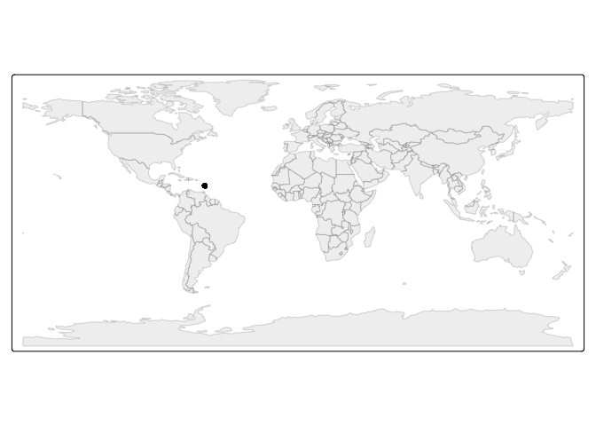
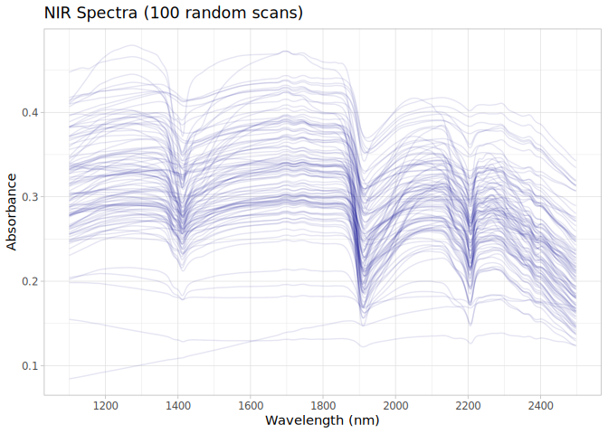

# Martinique dataset preparation for the OSSL
Ran Zhi, Jose L. Safanelli, Jonathan Sanderman

- [Original data](#original-data)
- [Data standardization to the OSSL
  format](#data-standardization-to-the-ossl-format)
  - [Site information](#site-information)
  - [Soil lab information (reference analytical
    data)](#soil-lab-information-reference-analytical-data)
  - [NIR spectra](#nir-spectra)
  - [Quality control for NIR](#quality-control-for-nir)
- [References](#references)

Code repository for preparing and importing the Martinique NIR Soil
Spectral Dataset (MTQ) into the Open Soil Spectral Library.

Website: [Soil Spectroscopy for Global
Good](https://soilspectroscopy.org)  
Development: <https://github.com/soilspectroscopy>  
Last update: 2026-05-01  
Additional documentation:

## Original data

Site data, Soil lab data, and Near-Infrared (NIR) data from rural areas
of the Martinique island. Further information of the dataset can be
found at Barthès, Venkatapen, Cambou, & Blanchart
([2024](#ref-barthes_soil_2024)).

Original files:  
- `SoilCarbonMartinique_v2.tab`: tab file with site information, soil
information, and NIR spectral data.

Directory/folder path with original files (not uploaded to GitHub).

``` r
# dir = "/Users/rzhi/Projects/git/ossl-imports-internal/dataset/Martinique"
dir = "~/mnt-ossl-private/database/datasets/MTQ"
tic()
```

## Data standardization to the OSSL format

### Site information

``` r
martinique.metadata <- read_tsv(path(dir, "SoilCarbonMartinique_v2.tab"),
                                locale = locale(encoding = "latin1"))
```

    Rows: 516 Columns: 721
    ── Column specification ────────────────────────────────────────────────────────
    Delimiter: "\t"
    chr  (10): Sample, Region, Municipality, Site, Latitude, Longitude, Depth la...
    dbl (711): Coarse particles > 2 mm (% total soil), Sand 0.5-2 mm (% soil < 2...

    ℹ Use `spec()` to retrieve the full column specification for this data.
    ℹ Specify the column types or set `show_col_types = FALSE` to quiet this message.

``` r
# Function to convert "14° 49' N" to decimal degrees
dms_to_dd <- function(x) {
  parts <- str_match(x, "([0-9.]+)[^0-9.]+([0-9.]+)[^0-9.]+([NSEW])")
  deg <- as.numeric(parts[,2])
  min <- as.numeric(parts[,3])
  dir <- parts[,4]
  dd <- deg + (min / 60)
  dd <- ifelse(dir %in% c("W", "S"), -dd, dd)
  return(dd)
}

martinique.sitedata <- martinique.metadata %>%
  select(Sample, Site, Region, Municipality,
         Longitude, Latitude, `Depth layer`, `Soil type`, 
         `Land use`, `Land-use duration and previous use`) %>%
  rename(id.layer_local_c = Sample,
         site.id_src_txt = Site,
         loc.region_src_txt = Region,
         loc.municipality_src_txt = Municipality,
         pedon.taxa_src_txt = `Soil type`, 
         site.land.use_src_txt = `Land use`,
         site.land.history_src_txt = `Land-use duration and previous use`) %>%
  mutate(latitude.point_wgs84_dd = dms_to_dd(Latitude),
         longitude.point_wgs84_dd = dms_to_dd(Longitude),
         .after = Latitude) %>%
  select(-Longitude, -Latitude) %>%
  mutate(depth_temp = gsub(" cm", "", `Depth layer`)) %>%
  separate(depth_temp, into = c("layer.upper.depth_usda_cm",
                                "layer.lower.depth_usda_cm"), sep = "-") %>%
  mutate(across(c(layer.upper.depth_usda_cm, layer.lower.depth_usda_cm), as.numeric)) %>%
  select(-`Depth layer`) %>%
  group_by(site.id_src_txt) %>%
  arrange(layer.upper.depth_usda_cm, .by_group = TRUE) %>%
  mutate(layer.sequence_usda_uint16 = row_number()) %>%
  ungroup() %>%
  # mutate(id.project_ascii_txt = "Data on soil organic carbon content and stock in Martinique – relations to near infrared spectra",
  #        observation.ogc.schema.title_ogc_txt = "Open Soil Spectroscopy Library",
  #        observation.ogc.schema_idn_url = "https://soilspectroscopy.github.io",
  #        dataset.title_utf8_txt = "Data on soil organic carbon content and stock in Martinique – relations to NIR",
  #        dataset.owner_utf8_txt = "Aurélie Cambou (UMR Eco&Sols - Univ. Montpellier, CIRAD, INRAE, IRD, L'Institut Agro Montpellier - France)",
  #        dataset.doi_idf_url = "https://dataverse.ird.fr/dataset.xhtml?persistentId=doi:10.23708/C2TV6W",
  #        dataset.license.title_ascii_txt = "CC-BY 4.0",
  #        dataset.license.address_idn_url = "https://creativecommons.org/licenses/by-nc/4.0/",
  #        dataset.contact.name_utf8_txt = "Aurélie Cambou",
  #        dataset.contact_ietf_email = "aurelie.cambou@ird.fr") %>%
  mutate(dataset.code_ascii_txt = "MTQ",
         id.layer_uuid_txt = openssl::md5(paste0(dataset.code_ascii_txt, id.layer_local_c)),
         .before = 1) %>%
  mutate(across(starts_with("id."), as.character))

# Saving version to dataset root dir
site.exp.file = path(dir, "ossl_soilsite_v1.3")
readr::write_csv(martinique.sitedata, str_c(site.exp.file, ".csv.gz"))
nanoparquet::write_parquet(martinique.sitedata, str_c(site.exp.file, ".parquet"))
```

Plotting map:

``` r
data("World")

ocean <- ne_download(scale = 110, type = "ocean", category = "physical", returnclass = "sf")
```

    Reading 'ne_110m_ocean.zip' from naturalearth...

``` r
points <- martinique.sitedata %>%
  filter(!is.na(longitude.point_wgs84_dd),
         !is.na(latitude.point_wgs84_dd)) %>%
  st_as_sf(coords = c('longitude.point_wgs84_dd', 'latitude.point_wgs84_dd'), crs = 4326)

tmap_mode("plot")
```

    ℹ tmap modes "plot" - "view"
    ℹ toggle with `tmap::ttm()`

``` r
tm_shape(ocean) +
  tm_polygons(fill = "lightblue", col = NA) +
  tm_shape(World) +
  tm_polygons(fill = "#f0f0f0", fill_alpha = 0.5, col_alpha = 0.5) +
  tm_shape(points) +
  tm_dots(size = 0.5, fill = "firebrick") +
  tm_crs("ESRI:54030") +
  tm_layout(frame = FALSE)
```

    [tip] Consider a suitable map projection, e.g. by adding `+ tm_crs("auto")`.
    This message is displayed once per session.



### Soil lab information (reference analytical data)

NOTE: The code chunk below must be run just once for getting a template
for scripted column standardization. Just run once for getting the
original names of soil properties, descriptions, data types, and units.
Then upload to Google Sheet for editing and defining the rules for
integrating with the OSSL. Requires Google authentication. A copy of the
output file is saved to this folder for archiving purposes.

``` r
# Getting soillab original variables

soillab.names <- martinique.metadata %>%
  select(Sample, `SOCg (g/kg soil < 2 mm)`, 
    `Nt (g/kg soil < 2 mm)`, 
    `Clay 0-0.002 mm (% soil < 2 mm)`,
    `Sand 0.5-2 mm (% soil < 2 mm)`, 
    `Sand 0.2-0.5 mm (% soil < 2 mm)`, 
    `Sand 0.05-0.2 mm (% soil < 2 mm)`,
    `Silt 0.02-0.05 mm (% soil < 2 mm)`, 
    `Silt 0.002-0.02 mm (% soil < 2 mm)`,
    `Bulk density (kg total soil/dm3 total soil)`,
    `Coarse particles > 2 mm (% total soil)`,
    `SOCv (kg/dm3 total soil)`) %>%
  rename(id.layer_local_c = Sample) %>%
  names() %>%
  tibble(original_name = .) %>%
  dplyr::mutate(table = 'SoilCarbonMartinique_v2.tab', .before = 1) %>%
  dplyr::mutate(import = '', original_unit = '', original_method = '',
                comment = '', ossl_abbrev = '', ossl_method = '',
                ossl_unit = '', ossl_convert = '', ossl_name = '', .after = original_name)

readr::write_csv(soillab.names, path(getwd(), "soillab_original_names.csv"))

# Uploading to google sheet

# Drive 'Open Soil Spectral Library'
# Folder 'Database v2'
googledrive::drive_ls(as_id("1l9VM4fFks2xBloDE69EFTfPgQeFx5aGw"))

# Use the ID of the file 'OSSL_v2_tab2_soildata_importing'
OSSL.soildata.importing <- "1mWTDJDuMp4oObcCxAy9gofSkrkcSWWf1TtEW2SuC1es"

# Checking metadata
googlesheets4::as_sheets_id(OSSL.soildata.importing)

# Checking readme
googlesheets4::read_sheet(OSSL.soildata.importing, sheet = 'readme')

# Preparing soillab.names for this dataset
upload <- dplyr::as_tibble(soillab.names)

# Uploading with TEMP name. Check online, move to sequence, and update name
googlesheets4::write_sheet(upload, ss = OSSL.soildata.importing, sheet = "TEMP")

# Checking metadata
googlesheets4::as_sheets_id(OSSL.soildata.importing)
```

NOTE: The code chunk below must be run just once. Run for getting the
column standardization rules after editing online on Google Sheets. A
copy of the edited standardization template is saved to this dataset
folder.

``` r
# Downloading from google sheet

# Checking metadata
googlesheets4::as_sheets_id("1mWTDJDuMp4oObcCxAy9gofSkrkcSWWf1TtEW2SuC1es")

# Preparing soillab.names
transvalues <- googlesheets4::read_sheet("1mWTDJDuMp4oObcCxAy9gofSkrkcSWWf1TtEW2SuC1es",
                                         sheet = "MTQ")

# Saving to folder
write_csv(transvalues, path(getwd(), "soillab_standardized_names.csv"))
```

Reading standardization rules:

``` r
transvalues <- read_csv(path(getwd(), "soillab_standardized_names.csv"),
                        show_col_types = F) %>%
  filter(import == TRUE) %>%
  select(contains(c("table", "id", "original_name", "original_unit" , "ossl_")))

knitr::kable(transvalues)
```

| table | original_name | original_unit | ossl_abbrev | ossl_method | ossl_unit | ossl_convert | ossl_name |
|:---|:---|:---|:---|:---|:---|:---|:---|
| SoilCarbonMartinique_v2.tab | SOCg (g/kg soil \< 2 mm) | g/kg | oc | iso.10694 | w.pct | ifelse(as.numeric(x) \< 0, NA, as.numeric(x) \* 0.1) | oc_iso.10694_w.pct |
| SoilCarbonMartinique_v2.tab | Nt (g/kg soil \< 2 mm) | g/kg | n.tot | iso.13878 | w.pct | ifelse(as.numeric(x) \< 0, NA, as.numeric(x) \* 0.1) | n.tot_iso.13878_w.pct |
| SoilCarbonMartinique_v2.tab | Clay 0-0.002 mm (% soil \< 2 mm) | % | clay.tot | iso.11277 | w.pct | ifelse(as.numeric(x) \< 0, NA, as.numeric(x) \* 1) | clay.tot_iso.11277_w.pct |
| SoilCarbonMartinique_v2.tab | Sand.total.new | NA | sand.tot | iso.11277 | w.pct | ifelse(as.numeric(Sand 0.5-2 mm (% soil \< 2 mm)) \< 0, NA, as.numeric(Sand 0.5-2 mm (% soil \< 2 mm)) + as.numeric(Sand 0.2-0.5 mm (% soil \< 2 mm)) + as.numeric(Sand 0.05-0.2 mm (% soil \< 2 mm))) | sand.tot_iso.11277_w.pct |
| SoilCarbonMartinique_v2.tab | Sand 0.5-2 mm (% soil \< 2 mm) | % | sand.m.temporary | iso.11277 | w.pct | ifelse(as.numeric(x) \< 0, NA, as.numeric(x) \* 1) | sand.m.temporary_iso.11277_w.pct |
| SoilCarbonMartinique_v2.tab | Sand 0.2-0.5 mm (% soil \< 2 mm) | % | sand.f.temporary | iso.11277 | w.pct | ifelse(as.numeric(x) \< 0, NA, as.numeric(x) \* 1) | sand.f.temporary_iso.11277_w.pct |
| SoilCarbonMartinique_v2.tab | Sand 0.05-0.2 mm (% soil \< 2 mm) | % | san.vf.temporary | iso.11277 | w.pct | ifelse(as.numeric(x) \< 0, NA, as.numeric(x) \* 1) | san.vf.temporary_iso.11277_w.pct |
| SoilCarbonMartinique_v2.tab | Silt.total.new | NA | silt.tot | iso.11277 | w.pct | ifelse(as.numeric(Silt 0.002-0.02 mm (% soil \< 2 mm)) \< 0, NA, as.numeric(Silt 0.002-0.02 mm (% soil \< 2 mm)) + as.numeric(Silt 0.02-0.05 mm (% soil \< 2 mm))) | silt.tot_iso.11277_w.pct |
| SoilCarbonMartinique_v2.tab | Silt 0.02-0.05 mm (% soil \< 2 mm) | % | silt.c.temporary | iso.11277 | w.pct | ifelse(as.numeric(x) \< 0, NA, as.numeric(x) \* 1) | silt.c.temporary_iso.11277_w.pct |
| SoilCarbonMartinique_v2.tab | Silt 0.002-0.02 mm (% soil \< 2 mm) | % | silt.f.temporary | iso.11277 | w.pct | ifelse(as.numeric(x) \< 0, NA, as.numeric(x) \* 1) | silt.f.temporary_iso.11277_w.pct |
| SoilCarbonMartinique_v2.tab | Bulk density (kg total soil/dm3 total soil) | kg/dm3 | bd | iso.11277 | g.cm3 | ifelse(as.numeric(x) \< 0, NA, as.numeric(x) \* 1) | bd_iso.11277_g.cm3 |
| SoilCarbonMartinique_v2.tab | Coarse particles \> 2 mm (% total soil) | % | cf | iso.11464 | w.pct | ifelse(as.numeric(x) \< 0, NA, as.numeric(x) \* 1) | cf_iso.11464_w.pct |

Standardizing soil data to the OSSL format:

``` r
# Harmonization of names and units

valid_mappings <- transvalues %>%
  filter(table == "SoilCarbonMartinique_v2.tab") %>%
  filter(!is.na(ossl_name) & ossl_name != "" &
           !original_name %in% c("Sand.total.new", "Silt.total.new"))

analytes.old.names <- valid_mappings %>% pull(original_name)
analytes.new.names <- valid_mappings %>% pull(ossl_name)

# Initial selection and renaming to OSSL/Temporary names
martinique.soildata <- martinique.metadata %>%
  rename(id.layer_local_c = Sample) %>%
  select(id.layer_local_c, all_of(analytes.old.names)) %>%
  rename_with(~analytes.new.names, all_of(analytes.old.names)) %>%
  mutate(id.layer_local_c = as.character(id.layer_local_c)) %>%
  as.data.frame()

# Getting the formulas
functions.list <- valid_mappings %>%
  filter(table == "SoilCarbonMartinique_v2.tab") %>%
  mutate(ossl_name = factor(ossl_name, levels = names(martinique.soildata))) %>%
  arrange(ossl_name) %>%
  pull(ossl_convert) %>%
  c("x", .)

# Applying transformation rules
martinique.soildata.trans <- transform_values(df = martinique.soildata,
                                              out.name = names(martinique.soildata),
                                              in.name = names(martinique.soildata),
                                              fun.lst = functions.list)

# Accumulate Silt and Sand into Total OSSL Columns ---
martinique.soildata <- martinique.soildata.trans %>%
  mutate(sand.tot_iso.11277_w.pct = ifelse(is.na(sand.m.temporary_iso.11277_w.pct) | 
                                             is.na(sand.f.temporary_iso.11277_w.pct) | 
                                             is.na(san.vf.temporary_iso.11277_w.pct), 
                                           NA, 
                                           sand.m.temporary_iso.11277_w.pct +
                                             sand.f.temporary_iso.11277_w.pct +
                                             san.vf.temporary_iso.11277_w.pct),
         silt.tot_iso.11277_w.pct = ifelse(is.na(silt.c.temporary_iso.11277_w.pct) | 
                                             is.na(silt.f.temporary_iso.11277_w.pct), 
                                           NA, 
                                           silt.c.temporary_iso.11277_w.pct +
                                             silt.f.temporary_iso.11277_w.pct))

# Final soillab data
martinique.soildata <- martinique.soildata %>%
  select(-contains("temporary")) %>%
  mutate_at(vars(starts_with("id.")), as.character)

# Checking total number of observations
martinique.soildata %>%
  distinct(id.layer_local_c) %>%
  summarise(count = n())
```

      count
    1   516

``` r
# Saving version to dataset root dir
soillab.exp.file = path(dir, "ossl_soillab_v1.3")
readr::write_csv(martinique.soildata, str_c(soillab.exp.file, ".csv.gz"))
nanoparquet::write_parquet(martinique.soildata, str_c(soillab.exp.file, ".parquet"))
```

Soil lab data summary.

``` r
martinique.soildata %>%
  mutate(id.layer_local_c = factor(id.layer_local_c)) %>%
  skimr::skim() %>%
  dplyr::select(-numeric.hist, -complete_rate)
```

|                                                  |            |
|:-------------------------------------------------|:-----------|
| Name                                             | Piped data |
| Number of rows                                   | 516        |
| Number of columns                                | 8          |
| \_\_\_\_\_\_\_\_\_\_\_\_\_\_\_\_\_\_\_\_\_\_\_   |            |
| Column type frequency:                           |            |
| factor                                           | 1          |
| numeric                                          | 7          |
| \_\_\_\_\_\_\_\_\_\_\_\_\_\_\_\_\_\_\_\_\_\_\_\_ |            |
| Group variables                                  | None       |

Data summary

**Variable type: factor**

| skim_variable    | n_missing | ordered | n_unique | top_counts                     |
|:-----------------|----------:|:--------|---------:|:-------------------------------|
| id.layer_local_c |         0 | FALSE   |      516 | AB1: 1, AB1: 1, AB1: 1, AB1: 1 |

**Variable type: numeric**

| skim_variable            | n_missing |  mean |    sd |   p0 |   p25 |   p50 |   p75 |  p100 |
|:-------------------------|----------:|------:|------:|-----:|------:|------:|------:|------:|
| oc_iso.10694_w.pct       |         0 |  1.60 |  1.19 | 0.09 |  0.74 |  1.33 |  2.08 |  8.85 |
| n.tot_iso.13878_w.pct    |         0 |  0.15 |  0.10 | 0.01 |  0.07 |  0.13 |  0.18 |  0.62 |
| clay.tot_iso.11277_w.pct |       222 | 43.10 | 21.94 | 3.30 | 21.00 | 50.40 | 61.30 | 82.40 |
| bd_iso.11277_g.cm3       |         0 |  0.92 |  0.18 | 0.35 |  0.79 |  0.92 |  1.04 |  1.49 |
| cf_iso.11464_w.pct       |       344 | 38.81 | 15.16 | 2.10 | 29.10 | 39.15 | 46.87 | 88.90 |
| sand.tot_iso.11277_w.pct |       222 | 36.47 | 21.93 | 2.30 | 18.22 | 29.35 | 58.05 | 87.90 |
| silt.tot_iso.11277_w.pct |       222 | 20.46 |  6.14 | 6.40 | 16.70 | 21.05 | 25.10 | 34.30 |

### NIR spectra

In absorbance units, transforming to reflectance

``` r
# Renaming
martinique.nir.proc <- martinique.metadata %>%
  rename(id.layer_local_c = Sample) %>%
  select(id.layer_local_c, starts_with("Abs"))

# Filter out samples without spectra
martinique.nir.proc <- martinique.nir.proc %>%
  filter(!is.na(`Abs 1100 nm`))

# Need to resample spectra
spec.cols <- names(martinique.nir.proc)[-1] # Remove the ID column
old.wavelengths <- as.numeric(gsub("Abs | nm", "", spec.cols))
new.wavelengths <- seq(1100, max(old.wavelengths), by = 2)

# 2 nm spectra
martinique.nir.resampled <- martinique.nir.proc %>%
  rename_with(~as.character(new.wavelengths), all_of(spec.cols))

martinique.nir.resampled <- martinique.nir.resampled %>%
  select(id.layer_local_c, all_of(as.character(new.wavelengths)))

# Back to reflectance
martinique.nir.resampled <- martinique.nir.resampled %>%
  mutate(across(as.character(new.wavelengths), ~1/10^(.x)))

# Gaps Analysis
scans.na.gaps <- martinique.nir.resampled %>%
  select(-id.layer_local_c) %>%
  apply(., 1, function(x) round(100*(sum(is.na(x)))/(length(x)), 2)) %>%
  tibble(proportion_NA = .) %>%
  bind_cols(martinique.nir.resampled %>% select(id.layer_local_c), .)

# Extreme negative checks
scans.extreme.neg <- martinique.nir.resampled %>%
  select(-id.layer_local_c) %>%
  apply(., 1, function(x) {round(100*(sum(x < 0, na.rm=TRUE))/(length(x)), 2)}) %>%
  tibble(proportion_lower0 = .) %>%
  bind_cols(martinique.nir.resampled %>% select(id.layer_local_c), .)

# Extreme positive checks
scans.extreme.pos <- martinique.nir.resampled %>%
  select(-id.layer_local_c) %>%
  apply(., 1, function(x) {round(100*(sum(x > 1, na.rm=TRUE))/(length(x)), 2)}) %>%
  tibble(proportion_higherRef1 = .) %>%
  bind_cols(martinique.nir.resampled %>% select(id.layer_local_c), .)

# Summary of problematic scans
scans.summary <- scans.na.gaps %>%
  left_join(scans.extreme.neg, by = "id.layer_local_c") %>%
  left_join(scans.extreme.pos, by = "id.layer_local_c")

scans.summary %>%
  select(-id.layer_local_c) %>%
  pivot_longer(everything(), names_to = "check", values_to = "value") %>%
  filter(value > 0) %>%
  group_by(check) %>%
  summarise(count = n())
```

    # A tibble: 0 × 2
    # ℹ 2 variables: check <chr>, count <int>

``` r
# Renaming and Metadata
final.visnir.names <- paste0("scan_nir.", new.wavelengths, "_ref")

martinique.nir.final <- martinique.nir.resampled %>%
  rename_with(~final.visnir.names, as.character(new.wavelengths))

# # Customizing metadata for the Martinique dataset
# martinique.nir.metadata <- martinique.nir.final %>%
#   select(id.layer_local_c) %>%
#   mutate(
#     id.scan_local_c = id.layer_local_c,
#     scan.nir.date.begin_iso.8601_yyyy = ymd("2004-01-01"), 
#     scan.visnir.date.end_iso.8601_yyyy = ymd("2005-12-31"), 
#     scan.nir.model.name_utf8_txt = "Foss NIRSystems 5000 spectrophotometer (Laurel, MD, USA)", 
#     scan.nir.license.title_ascii_txt = "CC-BY 4.0",
#     scan.nir.doi_idf_url = "https://dataverse.ird.fr/dataset.xhtml?persistentId=doi:10.23708/C2TV6W",
#     scan.nir.contact.name_utf8_txt = "Aurélie Cambou",
#     scan.nir.contact.email_ietf_txt = "aurelie.cambou@ird.fr"
#   )

# Export
# martinique.nir.export <- martinique.nir.metadata %>%
#   left_join(martinique.nir.final, by = "id.layer_local_c")

martinique.nir.export <- martinique.nir.final

# Saving version to dataset root dir
nir.exp.file = path(dir, "ossl_nir_v1.3")
readr::write_csv(martinique.nir.export, str_c(nir.exp.file, ".csv.gz"))
nanoparquet::write_parquet(martinique.nir.export, str_c(nir.exp.file, ".parquet"))
```

### Quality control for NIR

The final table must be joined as follows:

- NIR is used as first reference for pairing with soil data.
- Site and soil lab data are left joined to NIR This drop data without
  any available scan.

The availability of data is summarized below:

``` r
# Taking a few representative columns for checking the consistency of joins
martinique.availability <- martinique.nir.export %>%
  select(id.layer_local_c, scan_nir.1100_ref) %>%
  left_join(martinique.soildata, by = "id.layer_local_c") %>%
  filter(!is.na(id.layer_local_c))

# Availability of information summary
# This tells us how many samples have spectra vs. lab/site data
martinique.availability %>%
  mutate(across(everything(), as.character)) %>%
  pivot_longer(everything(), names_to = "column", values_to = "value") %>%
  filter(!is.na(value)) %>%
  group_by(column) %>%
  summarise(count = n())
```

    # A tibble: 9 × 2
      column                   count
      <chr>                    <int>
    1 bd_iso.11277_g.cm3         407
    2 cf_iso.11464_w.pct          96
    3 clay.tot_iso.11277_w.pct   231
    4 id.layer_local_c           407
    5 n.tot_iso.13878_w.pct      407
    6 oc_iso.10694_w.pct         407
    7 sand.tot_iso.11277_w.pct   231
    8 scan_nir.1100_ref          407
    9 silt.tot_iso.11277_w.pct   231

``` r
# Repeats check 
martinique.availability %>%
  mutate(across(everything(), as.character)) %>%
  select(id.layer_local_c) %>%
  pivot_longer(everything(), names_to = "column", values_to = "value") %>%
  group_by(column, value) %>%
  summarise(repeats = n(), .groups = 'drop') %>%
  group_by(column, repeats) %>%
  summarise(count = n(), .groups = 'drop')
```

    # A tibble: 1 × 3
      column           repeats count
      <chr>              <int> <int>
    1 id.layer_local_c       1   407

Soil analytical data summary for NIR. Note: some scans may not be linked
with the wetchem.

``` r
martinique.availability %>%
  mutate(id.layer_local_c = factor(id.layer_local_c)) %>%
  skimr::skim() %>%
  dplyr::select(-numeric.hist, -complete_rate)
```

|                                                  |            |
|:-------------------------------------------------|:-----------|
| Name                                             | Piped data |
| Number of rows                                   | 407        |
| Number of columns                                | 9          |
| \_\_\_\_\_\_\_\_\_\_\_\_\_\_\_\_\_\_\_\_\_\_\_   |            |
| Column type frequency:                           |            |
| factor                                           | 1          |
| numeric                                          | 8          |
| \_\_\_\_\_\_\_\_\_\_\_\_\_\_\_\_\_\_\_\_\_\_\_\_ |            |
| Group variables                                  | None       |

Data summary

**Variable type: factor**

| skim_variable    | n_missing | ordered | n_unique | top_counts                     |
|:-----------------|----------:|:--------|---------:|:-------------------------------|
| id.layer_local_c |         0 | FALSE   |      407 | AB1: 1, BF1: 1, BF2: 1, BP1: 1 |

**Variable type: numeric**

| skim_variable            | n_missing |  mean |    sd |   p0 |   p25 |   p50 |   p75 |  p100 |
|:-------------------------|----------:|------:|------:|-----:|------:|------:|------:|------:|
| scan_nir.1100_ref        |         0 |  0.31 |  0.06 | 0.08 |  0.27 |  0.30 |  0.34 |  0.51 |
| oc_iso.10694_w.pct       |         0 |  1.58 |  1.17 | 0.09 |  0.74 |  1.33 |  2.04 |  8.85 |
| n.tot_iso.13878_w.pct    |         0 |  0.14 |  0.10 | 0.01 |  0.07 |  0.13 |  0.18 |  0.58 |
| clay.tot_iso.11277_w.pct |       176 | 48.30 | 19.31 | 7.10 | 35.10 | 53.80 | 62.15 | 82.40 |
| bd_iso.11277_g.cm3       |         0 |  0.91 |  0.16 | 0.35 |  0.81 |  0.92 |  1.02 |  1.31 |
| cf_iso.11464_w.pct       |       311 | 34.17 | 13.16 | 2.60 | 25.58 | 35.40 | 41.65 | 75.30 |
| sand.tot_iso.11277_w.pct |       176 | 31.48 | 19.33 | 2.30 | 16.95 | 24.10 | 49.25 | 77.40 |
| silt.tot_iso.11277_w.pct |       176 | 20.26 |  6.10 | 6.40 | 16.65 | 20.80 | 24.90 | 34.30 |

NIR spectral visualization (100 random spectra):

``` r
set.seed(42)
martinique.nir.export %>%
  sample_n(100) %>%
  select(all_of(c("id.layer_local_c")), starts_with("scan_nir.")) %>%
  tidyr::pivot_longer(-all_of(c("id.layer_local_c")),
                      names_to = "wavelength", values_to = "reflectance") %>%
  dplyr::mutate(wavelength = gsub("scan_nir.|_ref", "", wavelength)) %>%
  dplyr::mutate(wavelength = as.numeric(wavelength)) %>%
  ggplot(aes(x = wavelength, y = reflectance, group = id.layer_local_c)) +
  geom_line(alpha = 0.1, color = "darkblue") +
  scale_x_continuous(breaks = seq(400, 2500, by = 200))+
  labs(title = "NIR Spectra (100 random scans)",
       x = "Wavelength (nm)",
       y = "Absorbance")+
  theme_light()
```



``` r
toc()
```

    9.99 sec elapsed

``` r
rm(list = ls())
gc()
```

               used  (Mb) gc trigger  (Mb) max used  (Mb)
    Ncells  6404810 342.1   10922661 583.4  8372795 447.2
    Vcells 10921106  83.4   21478978 163.9 17830444 136.1

## References

<div id="refs" class="references csl-bib-body hanging-indent"
entry-spacing="0" line-spacing="2">

<div id="ref-barthes_soil_2024" class="csl-entry">

Barthès, B. G., Venkatapen, C., Cambou, A., & Blanchart, E. (2024). Soil
organic carbon content and stock in Martinique – relations to near
infrared spectra. *European Journal of Soil Science*, *75*(1), e13453.
doi:[10.1111/ejss.13453](https://doi.org/10.1111/ejss.13453)

</div>

</div>
