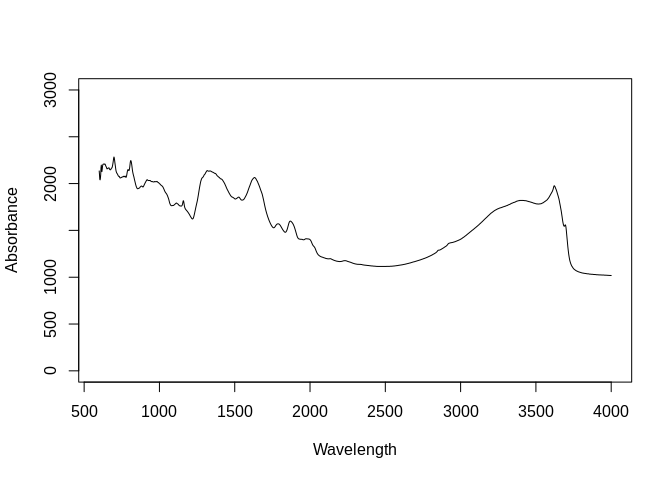
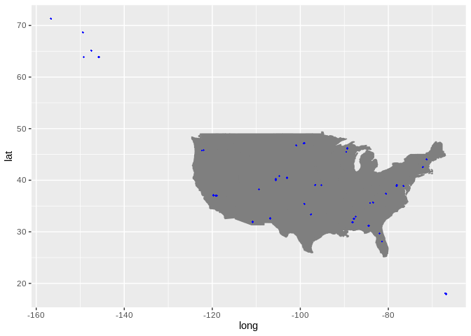

Dataset import: The National Ecological Observatory Network (NEON) Soil
Spectral Library
================
Tomislav Hengl (<tom.hengl@opengeohub.org>) and Jonathan Sanderman
(<jsanderman@woodwellclimate.org>)
08 May, 2022


-   [The National Ecological Observatory Network (NEON) Soil Spectral
    Library
    inputs](#the-national-ecological-observatory-network-neon-soil-spectral-library-inputs)
-   [Data import](#data-import)
    -   [Soil site and laboratory data
        import:](#soil-site-and-laboratory-data-import)
        -   [Soil lab information](#soil-lab-information)
        -   [Soil site information](#soil-site-information)
    -   [Mid-infrared spectroscopy
        data](#mid-infrared-spectroscopy-data)
    -   [Quality control](#quality-control)
    -   [Distribution of points](#distribution-of-points)
-   [References](#references)

[](https://soilspectroscopy.org/)

[](http://creativecommons.org/licenses/by-sa/4.0/)

This work is licensed under a [Creative Commons Attribution-ShareAlike
4.0 International
License](http://creativecommons.org/licenses/by-sa/4.0/).

## The National Ecological Observatory Network (NEON) Soil Spectral Library inputs

Part of: <https://github.com/soilspectroscopy>  
Project: [Soil Spectroscopy for Global
Good](https://soilspectroscopy.org)  
Last update: 2022-05-08  
Dataset:
[NEON.SSL](https://soilspectroscopy.github.io/ossl-manual/soil-spectroscopy-tools-and-users.html#neon.ssl)

Mid-Infrared Spectra (MIRS) from The National Ecological Observatory
Network (NEON) Soil Spectral Library explained in detail in [Dangal &
Sanderman](#ref-dangal2020standardization)
([2020](#ref-dangal2020standardization)). NEON data standards are
explained in detail in [Ayres](#ref-ayres2019quantitative)
([2019](#ref-ayres2019quantitative)).

Directory/folder path:

``` r
dir = "/mnt/soilspec4gg/ossl/dataset/NEON/"
#load.pigz(paste0(dir, "NEONSSL.RData"))
```

## Data import

### Soil site and laboratory data import:

Get coordinates (download from
<https://data.neonscience.org/data-products/explore>). Metadata is
available in [tabular
format](https://docs.google.com/spreadsheets/d/1kovs1g68VCnTByJ-HnMsgM2SzWzQjczeZdUh9TB7Ki0/edit#gid=1704927749).

``` r
crds.lst = list.files(dir, glob2rx("*mgp_permegapit*.csv"), full.names=TRUE, recursive = TRUE)
neon.xy = plyr::rbind.fill(lapply(crds.lst, read.csv))
#plot(neon.xy[,c("decimalLongitude","decimalLatitude")])
neon.soil$longitude_wgs84_dd = plyr::join(neon.soil["pitNamedLocation"], neon.xy)$decimalLongitude 
```

    ## Joining by: pitNamedLocation

``` r
neon.soil$latitude_wgs84_dd = plyr::join(neon.soil["pitNamedLocation"], neon.xy)$decimalLatitude
```

    ## Joining by: pitNamedLocation

``` r
neon.soil$id.layer_uuid_c = neon.soil$uid
neon.soil$id.layer_local_c = neon.soil$horizonID
neon.soil$observation.date.begin_iso.8601_yyyy.mm.dd = format(as.Date(neon.soil$collectDate, format="%m/%d/%Y"), "%Y-%m-%d")
neon.soil$observation.date.end_iso.8601_yyyy.mm.dd = format(as.Date(neon.soil$collectDate, format="%m/%d/%Y"), "%Y-%m-%d")
neon.soil$layer.upper.depth_usda_cm = neon.soil$biogeoTopDepth
neon.soil$layer.lower.depth_usda_cm = neon.soil$biogeoBottomDepth
```

#### Soil lab information

Harmonization function:

``` r
in.name = c("phCacl2", "phH2o", "ec12pre", "gypsumConc", "caco3Conc", "caNh4d", "kNh4d", 
            "mgNh4d", "naNh4d", "cecdNh4", "baseSumCecd10", "ececCecd33", 
            "alKcl", "feKcl", "carbonTot", "nitrogenTot", "sulfurTot", 
            "finalOC", "bulkDensExclCoarseFrag", 
            "sandTotal", "siltTotal", "clayTotal")
neon.soillab = as.data.frame(neon.soil[,in.name])
out.name = c("ph.cacl2_usda.4c1_index", "ph.h2o_usda.4c1_index", "ec.w_usda.4f1_dsm", "gyp_usda.4e2_wpct", 
             "caco3_usda.4e1_wpct", "ca.ext_usda.4b1_cmolkg", "k.ext_usda.4b1_cmolkg", 
             "mg.ext_usda.4b1_cmolkg", "na.ext_usda.4b1_cmolkg", "cec.ext_usda.4b1_cmolkg",
             "sum.bases_4b4b2a_cmolkg", "ecec_usda.4b4_cmolkg", "al.kcl_usda.4b3_cmolkg",
             "fe.kcl_usda.4b3_mgkg", "c.tot_usda.4h2_wpct", "n.tot_usda.4h2_wpct", 
             "s.tot_usda.4h2_wpct", "oc_usda.calc_wpct", "bd.od_usda.3b2_gcm3",
             "sand.tot_usda.3a1_wpct", "silt.tot_usda.3a1_wpct", "clay.tot_usda.3a1_wpct")
## compare values
summary(neon.soillab$carbonTot)
```

    ##    Min. 1st Qu.  Median    Mean 3rd Qu.    Max. 
    ##    0.20    2.40   11.05   40.44   29.70  555.10

``` r
summary(neon.soillab$bulkDensExclCoarseFrag) ## some very high BD?
```

    ##    Min. 1st Qu.  Median    Mean 3rd Qu.    Max.    NA's 
    ##  0.0264  1.0592  1.3262  1.2382  1.5274  2.2713       6

``` r
summary(neon.soillab$clayTotal)
```

    ##    Min. 1st Qu.  Median    Mean 3rd Qu.    Max.    NA's 
    ##    0.00    5.70   13.20   17.56   26.70   60.30      11

``` r
summary(neon.soillab$sandTotal)
```

    ##    Min. 1st Qu.  Median    Mean 3rd Qu.    Max.    NA's 
    ##    1.60   28.00   55.30   52.15   77.40   97.60      11

``` r
fun.lst = as.list(rep("x*1", length(in.name)))
fun.lst[[which(in.name=="carbonTot")]] = "x/10"
fun.lst[[which(in.name=="nitrogenTot")]] = "x/10"
fun.lst[[which(in.name=="sulfurTot")]] = "x/10"
fun.lst[[which(in.name=="finalOC")]] = "x/10"
fun.lst[[which(in.name=="gypsumConc")]] = "x/10"
fun.lst[[which(in.name=="caco3Conc")]] = "x/10"
## save translation rules:
#View(data.frame(in.name, out.name, unlist(fun.lst)))
write.csv(data.frame(in.name, out.name, unlist(fun.lst)), "./neon_soilab_transvalues.csv")
neon.soil.f = transvalues(neon.soillab, out.name, in.name, fun.lst)
neon.soil.f$wpg2_usda.3a2_wpct = rowSums(neon.soil[,c("coarseFrag2To5", "coarseFrag5To20")], na.rm=TRUE)
```

Exporting the table:

``` r
neon.soil.f$id.layer_local_c = neon.soil$id.layer_local_c
neon.soil.f$id.layer_uuid_c = neon.soil$id.layer_uuid_c
neon.soil.f$sample.doi_idf_c = "10.3390/s20236729"
neon.soil.f$sample.contact.name_utf8_txt = "Jonathan Sanderman"
neon.soil.f$sample.contact.email_ietf_email = "jsanderman@woodwellclimate.org"
x.na = soilab.name[which(!soilab.name %in% names(neon.soil.f))]
if(length(x.na)>0){ for(i in x.na){ neon.soil.f[,i] <- NA } }
soilab.rds = paste0(dir, "ossl_soillab_v1.rds")
if(!file.exists(soilab.rds)){
  saveRDS.gz(neon.soil.f[,soilab.name], soilab.rds)
}
```

#### Soil site information

``` r
neon.site = as.data.frame(neon.soil[,c("layer.upper.depth_usda_cm", "layer.lower.depth_usda_cm", 
                                          "latitude_wgs84_dd", "longitude_wgs84_dd",
                                           "id.layer_local_c", "id.layer_uuid_c", 
                                       "observation.date.begin_iso.8601_yyyy.mm.dd",
                                       "observation.date.end_iso.8601_yyyy.mm.dd")])
neon.site$id.location_olc_c = olctools::encode_olc(neon.site$latitude_wgs84_dd, neon.site$longitude_wgs84_dd, 10)
```

Exporting the table:

``` r
neon.site$observation.ogc.schema.title_ogc_txt = 'Open Soil Spectroscopy Library'
neon.site$observation.ogc.schema_idn_url = 'https://soilspectroscopy.github.io/'
neon.site$dataset.title_utf8_txt = "Soil physical and chemical properties, Megapit, RELEASE-2021 (DP1.00096.001)"
neon.site$dataset.doi_idf_c = "10.48443/rfmw-p030"
neon.site$surveyor.address_utf8_txt = "Terrestrial Instrument System (TIS)"
neon.site$surveyor.contact_ietf_email = "jsanderman@woodwellclimate.org"
neon.site$dataset.code_ascii_c = "NEON.SSL"
neon.site$location.method_any_c = "GPS"
neon.site$id.project_ascii_c = "NEON Megapit Soil Archive"
neon.site$horizon.designation_usda_c = neon.soil$horizonName
neon.site$dataset.license.title_ascii_txt = "CC-BY" 
neon.site$dataset.license.address_idn_url = "https://creativecommons.org/licenses/by/4.0/"
neon.site$dataset.address_idn_url = "https://data.neonscience.org/data-products/DP1.00096.001"
neon.site$dataset.owner_utf8_txt = "Woodwell Climate Research"
neon.site$dataset.contact.name_utf8_txt = "Jonathan Sanderman"
neon.site$dataset.contact_ietf_email = "jsanderman@woodwellclimate.org"
x.na = site.name[which(!site.name %in% names(neon.site))]
if(length(x.na)>0){ for(i in x.na){ neon.site[,i] <- NA } }
soilsite.rds = paste0(dir, "ossl_soilsite_v1.rds")
if(!file.exists(soilsite.rds)){
  saveRDS.gz(neon.site[,site.name], soilsite.rds)
}
```

### Mid-infrared spectroscopy data

Mid-infrared (MIR) soil spectroscopy raw data
(<https://doi.org/10.5281/zenodo.4351254>):

``` r
## 2 repetitions / different wavelengths
neon.mir = vroom::vroom(paste0(dir, "NEON_Woodwell.csv"))
```

    ## Rows: 333
    ## Columns: 3,111
    ## Delimiter: ","
    ## chr [  16]: biogeoID, uid, domainID, siteID, pitNamedLocation, pitID, horizonID, horizonName, biogeoSampleType, setDate, collectDate, laboratoryName, labProjID, remarks, ...
    ## dbl [3091]: WHRCID, kssl_smp_id, biogeoHorizonProportion, biogeoTopDepth, biogeoBottomDepth, biogeoCenterDepth, carbonTot, nitrogenTot, sulfurTot, estimatedOC, finalOC, a...
    ## lgl [   4]: feKcl, bSatx, resist, clayFineContent
    ## 
    ## Use `spec()` to retrieve the guessed column specification
    ## Pass a specification to the `col_types` argument to quiet this message

``` r
## For some reasons there are only 304 rows but import leads to 333
neon.soil = neon.mir[1:304,1:94]
## Already in KSSL!
#neon.mir2 = vroom::vroom(paste0(dir, "NEON_KSSL.csv"))[1:304,95:ncol(neon.mir2)]
#names(neon.mir2) = paste0("X", names(neon.mir2))
#dim(neon.mir2)
## different wavelengths?
#summary(!names(neon.mir)[95:100] %in% paste0("X", names(neon.mir2)))
neon.mir = neon.mir[1:304,95:ncol(neon.mir)]
dim(neon.mir)
```

    ## [1]  304 3017

Resampling the MIR spectra from the original window size to 2 cm-1 in
`neon.abs`. Detect any problems:

``` r
wav.mir = as.numeric(gsub("X", "", names(neon.mir)))
#wav2.mir = as.numeric(gsub("X", "", names(neon.mir2)))
#summary(wav2.mir); summary(wav2.mir)
# Creating a matrix with only spectral values to resample it
neon.mir.spec = as.matrix(neon.mir)
#neon2.mir.spec = as.matrix(neon.mir2)
colnames(neon.mir.spec) = wav.mir
#colnames(neon2.mir.spec) = wav2.mir
## remove values out of range
#na.lst = rowSums(neon.mir)
#str(which(is.na(na.lst)))
samples.na.gaps = apply(neon.mir.spec, 1, FUN=function(j){ round(100*sum(is.na(j))/length(j), 3)}) 
samples.negative = apply(neon.mir.spec, 1, FUN=function(j){ round(100*sum(j <= 0, na.rm=TRUE)/length(j), 3) })
sum(samples.negative>0)
```

    ## [1] 0

``` r
samples.extreme = apply(neon.mir.spec, 1, FUN=function(j){ round(100*sum(j >= 3, na.rm=TRUE)/length(j), 3) })
sum(samples.extreme>0)
```

    ## [1] 12

``` r
neon.mir.f = prospectr::resample(neon.mir.spec, wav.mir, seq(600, 4000, 2))
#neon2.mir = prospectr::resample(neon2.mir.spec, wav2.mir, seq(600, 4000, 2))
#neonA.mir = plyr::rbind.fill(as.data.frame(neon.mir), as.data.frame(neon2.mir))
neon.mir.f = round(as.data.frame(neon.mir.f)*1000)
mir.n = paste0("scan_mir.", seq(600, 4000, 2), "_abs")
colnames(neon.mir.f) = mir.n
neon.mir.f$id.layer_local_c = neon.soil$horizonID #rep(neon.soil$horizonID, 2)
neon.mir.f$id.layer_uuid_c = plyr::join(neon.mir.f["id.layer_local_c"], neon.soil.f[c("id.layer_local_c","id.layer_uuid_c")], match="first")$id.layer_uuid_c
```

    ## Joining by: id.layer_local_c

``` r
summary(is.na(neon.mir.f$id.layer_uuid_c))
```

    ##    Mode   FALSE 
    ## logical     304

``` r
neon.mir.f$id.scan_local_c = paste0("WCR.", neon.soil$kssl_smp_id) #c(paste0("WCR.", neon.soil$kssl_smp_id), paste0("KSSL.", neon.soil$kssl_smp_id))
```

Plotting MIR spectra to see if there are still maybe negative values in
the table:

``` r
matplot(y=as.vector(t(neon.mir.f[100,mir.n])), x=seq(600, 4000, 2),
        ylim = c(0,3000),
        type = 'l', 
        xlab = "Wavelength", 
        ylab = "Absorbance"
        )
```

<!-- -->

Export final MIR table:

``` r
neon.mir.f$id.scan_uuid_c = openssl::md5(make.unique(paste0("NEON", neon.mir.f$id.scan_local_c)))
neon.mir.f$model.name_utf8_txt = "Bruker Vertex 70 with HTS-XT accessory"
neon.mir.f$model.code_any_c = "Bruker_Vertex_70.HTS.XT"
neon.mir.f$method.light.source_any_c = ""
neon.mir.f$method.preparation_any_c = ""
neon.mir.f$scan.file_any_c = ""
neon.mir.f$scan.date.begin_iso.8601_yyyy.mm.dd = as.Date("2019-01-01")
neon.mir.f$scan.date.end_iso.8601_yyyy.mm.dd = as.Date("2020-08-01")
neon.mir.f$scan.license.title_ascii_txt = "CC-BY"
neon.mir.f$scan.license.address_idn_url = "https://creativecommons.org/licenses/by/4.0/"
neon.mir.f$scan.doi_idf_c = "10.3390/s20236729"
neon.mir.f$scan.contact.name_utf8_txt = "Jonathan Sanderman"
neon.mir.f$scan.contact.email_ietf_email = "jsanderman@woodwellclimate.org"
neon.mir.f$scan.mir.nafreq_ossl_pct = samples.na.gaps
neon.mir.f$scan.mir.negfreq_ossl_pct = samples.negative
neon.mir.f$scan.mir.extfreq_ossl_pct = samples.extreme
```

Save to RDS file:

``` r
x.na = mir.name[which(!mir.name %in% names(neon.mir.f))]
if(length(x.na)>0){ for(i in x.na){ neon.mir.f[,i] <- NA } }
mir.rds = paste0(dir, "ossl_mir_v1.rds")
if(!file.exists(mir.rds)){
  saveRDS.gz(neon.mir.f[,mir.name], mir.rds)
}
```

### Quality control

Check if some points don’t have any spectral scans:

``` r
mis.r = neon.mir.f$id.layer_uuid_c %in% neon.site$id.layer_uuid_c
summary(mis.r)
```

    ##    Mode    TRUE 
    ## logical     304

``` r
## All OK
```

### Distribution of points

We can plot an world map showing distribution of the sampling locations
for the NEON points.

``` r
neon.map = NULL
mapWorld = borders('state', colour = 'gray50', fill = 'gray50')
neon.map = ggplot() + mapWorld
neon.map = neon.map + geom_point(aes(x=neon.site$longitude_wgs84_dd, y=neon.site$latitude_wgs84_dd), color = 'blue', shape = 18, size=.9)
neon.map
```

<!-- -->

Fig. 1: The NEON soil archive locations of sites across the USA.

``` r
#save.image.pigz(file=paste0(dir, "NEONSSL.RData"), n.cores=32)
#rmarkdown::render("dataset/NEON/README.Rmd")
```

## References

<div id="refs" class="references csl-bib-body hanging-indent"
line-spacing="2">

<div id="ref-ayres2019quantitative" class="csl-entry">

Ayres, E. (2019). Quantitative guidelines for establishing and operating
soil archives. *Soil Science Society of America Journal*, *83*(4),
973–981.
doi:[10.2136/sssaj2019.02.0050](https://doi.org/10.2136/sssaj2019.02.0050)

</div>

<div id="ref-dangal2020standardization" class="csl-entry">

Dangal, S. R., & Sanderman, J. (2020). Is standardization necessary for
sharing of a large mid-infrared soil spectral library? *Sensors*,
*20*(23), 6729.
doi:[10.3390/s20236729](https://doi.org/10.3390/s20236729)

</div>

</div>
