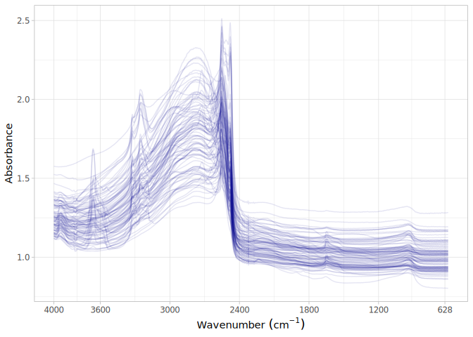

# National Ecological Observatory Network (NEON)
Jose L. Safanelli, Ran Zhi, Tomislav Hengl, Jonathan Sanderman

- [Original data](#original-data)
- [Data standardization to the OSSL
  format](#data-standardization-to-the-ossl-format)
  - [Site information](#site-information)
  - [Soil lab information (reference analytical
    data)](#soil-lab-information-reference-analytical-data)
  - [Mid-infrared spectra](#mid-infrared-spectra)
- [Quality control](#quality-control)
- [References](#references)

Code repository for standardizing and importing the National Ecological
Observatory Network (NEON) Megapit Soil Archive into the Open Soil
Spectral Library.

Website: [Soil Spectroscopy for Global
Good](https://soilspectroscopy.org)  
Development: <https://github.com/soilspectroscopy>  
Last update: 2026-05-17  
Additional documentation:

## Original data

Site data, soil lab data, and Mid-Infrared Spectra (MIR) from the
National Ecological Observatory Network (NEON) (Keller, Schimel,
Hargrove, & Hoffman ([2008](#ref-Keller2008))) and its Megapit Soil
Archive National Ecological Observatory Network (NEON)
([2026](#ref-NEON_soil)).

MIR spectra was collected at the Kellog Soil Survey Laboratory and
Woodwell Climate with different spectrophotometers. Further information
can be found in Dangal & Sanderman ([2020](#ref-Dangal2020)).

The official NEON Megapit Soil Archive website is
<https://www.neonscience.org/samples/soil-archive>.

“The National Ecological Observatory Network is a program sponsored by
the National Science Foundation and operated under cooperative agreement
by Battelle Memorial Institute. This material is based in part upon work
supported by the National Science Foundation through the NEON Program,
including samples provided by the NEON Megapit Soil Archive.”

Input files:  
- `NEON_soilp`: site and soil information.  
- `NEON_soilp`: MIR spectra from KSSL (Bruker Vertex 70 with HTS-HX
accessory).  
- `cssl_spectra.csv`: MIR spectra from Woodwell Climate (Bruker Vertex
70 with Pike AutoDiff).  

Directory/folder path with original files (not uploaded to GitHub).

``` r
# dir = "./"
dir = "~/mnt-ossl-private/database/datasets/NEON/"
tic()
```

## Data standardization to the OSSL format

### Site information

``` r
neon.soilp <- read_csv(path(dir, "NEON_soilp.csv"))
```

    Rows: 333 Columns: 93
    ── Column specification ────────────────────────────────────────────────────────
    Delimiter: ","
    chr (16): uid, biogeoID, domainID, siteID, pitNamedLocation, pitID, horizonI...
    dbl (73): WHRCID, biogeoHorizonProportion, biogeoTopDepth, biogeoBottomDepth...
    lgl  (4): feKcl, bSatx, resist, clayFineContent

    ℹ Use `spec()` to retrieve the full column specification for this data.
    ℹ Specify the column types or set `show_col_types = FALSE` to quiet this message.

``` r
neon.sitedata <- neon.soilp %>%
  select(uid,
         biogeoID, domainID, siteID, pitID, collectDate,
         pitNamedLocation, horizonName,
         biogeoTopDepth, biogeoBottomDepth) %>%
  rename(id.layer_local_c = uid,
         id.biogeo_src_txt = biogeoID,
         site.domain_src_txt = domainID,
         site.id_src_txt = siteID,
         site.pit_src_txt = pitID,
         site.pit.name_src_txt = pitNamedLocation,
         pedon.horizon_src_tst = horizonName,
         observation.date_src_yyyy.mm.dd = collectDate,
         layer.upper.depth_usda_cm = biogeoTopDepth,
         layer.lower.depth_usda_cm = biogeoBottomDepth) %>%
  mutate(observation.date_src_yyyy.mm.dd = mdy(observation.date_src_yyyy.mm.dd)) %>%
  mutate(dataset.code_ascii_txt = "NEON",
         id.layer_uuid_txt = openssl::md5(paste0(dataset.code_ascii_txt, id.layer_local_c)),
         .before = 1) %>%
  mutate_at(vars(starts_with("id.")), as.character)

# Saving version to dataset root dir
site.exp.file = path(dir, "ossl_soilsite_v1.3")
readr::write_csv(neon.sitedata, str_c(site.exp.file, ".csv.gz"))
nanoparquet::write_parquet(neon.sitedata, str_c(site.exp.file, ".parquet"))
```

### Soil lab information (reference analytical data)

NOTE: The code chunk below must be run just once for getting a template
for scripted column standardization. Just run once for getting the
original names of soil properties, descriptions, data types, and units.
Then upload to Google Sheet for editing and manually defining the rules
for integrating with the OSSL. Requires Google authentication. A copy of
the output file is saved to this folder for archiving purposes.

**Always leave the sheet name as TEMP to avoid overwritting, then rename
online to download locally.**

``` r
# Getting soillab original variables
neon.soilp <- read_csv(path(dir, "NEON_soilp.csv"))

soillab.names <- neon.soilp %>%
  names(.) %>%
  tibble(original_name = .) %>%
  dplyr::mutate(table = 'ssl_refdata_all', .before = 1) %>%
  dplyr::mutate(import = '', ossl_name = '', .after = original_name) %>%
  dplyr::mutate(comment = '')

readr::write_csv(soillab.names, paste0(getwd(), "/soillab_original_names.csv"))

# Uploading to google sheet

# Drive 'Open Soil Spectral Library'
# Use the ID of the file 'OSSL_v2_tab2_soildata_importing'
OSSL.soildata.importing <- "1mWTDJDuMp4oObcCxAy9gofSkrkcSWWf1TtEW2SuC1es"

# Checking metadata
googlesheets4::as_sheets_id(OSSL.soildata.importing)

# Checking readme
googlesheets4::read_sheet(OSSL.soildata.importing, sheet = 'readme')

# Preparing soillab.names for this dataset
upload <- dplyr::as_tibble(soillab.names)

# Uploading with TEMP name. Check online, move to sequence, and update name
googlesheets4::write_sheet(upload, ss = OSSL.soildata.importing, sheet = "TEMP")
```

NOTE: The code chunk below must be run just once. Run for getting the
column standardization rules after editing online on Google Sheets. A
copy of the edited standardization template is saved to this dataset
folder.

``` r
# Downloading from google sheet

# Checking metadata
googlesheets4::as_sheets_id("1mWTDJDuMp4oObcCxAy9gofSkrkcSWWf1TtEW2SuC1es")

# Preparing soillab.names
transvalues <- googlesheets4::read_sheet("1mWTDJDuMp4oObcCxAy9gofSkrkcSWWf1TtEW2SuC1es",
                                         sheet = "NEON")

# Saving to folder
write_csv(transvalues, path(getwd(), "soillab_standardized_names.csv"))
```

Reading standardization rules:

``` r
transvalues <- read_csv(path(getwd(), "soillab_standardized_names.csv"),
                        show_col_types = F) %>%
  filter(import == TRUE) %>%
  select(contains(c("table", "id", "original_name", "ossl_")))

knitr::kable(transvalues)
```

| table | original_name | ossl_abbrev | ossl_method | ossl_unit | ossl_convert | ossl_name |
|:---|:---|:---|:---|:---|:---|:---|
| ssl_refdata_all | carbonTot | c.tot | usda.a622 | w.pct | ifelse(as.numeric(x) \< 0, NA, as.numeric(x)/10) | c.tot_usda.a622_w.pct |
| ssl_refdata_all | nitrogenTot | n.tot | usda.a623 | w.pct | ifelse(as.numeric(x) \< 0, NA, as.numeric(x)/10) | n.tot_usda.a623_w.pct |
| ssl_refdata_all | sulfurTot | s.tot | usda.a624 | w.pct | ifelse(as.numeric(x) \< 0, NA, as.numeric(x)/10) | s.tot_usda.a624_w.pct |
| ssl_refdata_all | estimatedOC | oc | usda.c729 | w.pct | ifelse(as.numeric(x) \< 0, NA, as.numeric(x)/10) | oc_usda.c729_w.pct |
| ssl_refdata_all | phCacl2 | ph.h2o | usda.a268 | index | ifelse(as.numeric(x) \< 0, NA, as.numeric(x)\*1) | ph.h2o_usda.a268_index |
| ssl_refdata_all | phH2o | ph.cacl2 | usda.a481 | index | ifelse(as.numeric(x) \< 0, NA, as.numeric(x)\*1) | ph.cacl2_usda.a481_index |
| ssl_refdata_all | ec12pre | ec | usda.a364 | ds.m | ifelse(as.numeric(x) \< 0, NA, as.numeric(x)\*1) | ec_usda.a364_ds.m |
| ssl_refdata_all | caco3Conc | caco3 | usda.a54 | w.pct | ifelse(as.numeric(x) \< 0, NA, as.numeric(x)/10) | caco3_usda.a54_w.pct |
| ssl_refdata_all | caNh4d | ca.ext | usda.a722 | cmolc.kg | ifelse(as.numeric(x) \< 0, NA, as.numeric(x)\*1) | ca.ext_usda.a722_cmolc.kg |
| ssl_refdata_all | kNh4d | k.ext | usda.a725 | cmolc.kg | ifelse(as.numeric(x) \< 0, NA, as.numeric(x)\*1) | k.ext_usda.a725_cmolc.kg |
| ssl_refdata_all | mgNh4d | mg.ext | usda.a724 | cmolc.kg | ifelse(as.numeric(x) \< 0, NA, as.numeric(x)\*1) | mg.ext_usda.a724_cmolc.kg |
| ssl_refdata_all | naNh4d | na.ext | usda.a726 | cmolc.kg | ifelse(as.numeric(x) \< 0, NA, as.numeric(x)\*1) | na.ext_usda.a726_cmolc.kg |
| ssl_refdata_all | cecdNh4 | cec | usda.a723 | cmolc.kg | ifelse(as.numeric(x) \< 0, NA, as.numeric(x)\*1) | cec_usda.a723_cmolc.kg |
| ssl_refdata_all | alKcl | al.ext | usda.a69 | cmolc.kg | ifelse(as.numeric(x) \< 0, NA, as.numeric(x)\*1) | al.ext_usda.a69_cmolc.kg |
| ssl_refdata_all | coarseFrag2To5 | cf | usda.c232 | w.pct | ifelse(as.numeric(x) \< 0, NA, as.numeric(x)/10) | cf_usda.c232_w.pct |
| ssl_refdata_all | coarseFrag5To20 | cf | usda.c235 | w.pct | ifelse(as.numeric(x) \< 0, NA, as.numeric(x)/10) | cf_usda.c235_w.pct |
| ssl_refdata_all | sandTotal | sand.tot | usda.c60 | w.pct | ifelse(as.numeric(x) \< 0, NA, as.numeric(x)\*1) | sand.tot_usda.c60_w.pct |
| ssl_refdata_all | siltTotal | silt.tot | usda.c62 | w.pct | ifelse(as.numeric(x) \< 0, NA, as.numeric(x)\*1) | silt.tot_usda.c62_w.pct |
| ssl_refdata_all | clayTotal | clay.tot | usda.a334 | w.pct | ifelse(as.numeric(x) \< 0, NA, as.numeric(x)\*1) | clay.tot_usda.a334_w.pct |
| ssl_refdata_all | bulkDensExclCoarseFrag | bd | usda.a4 | g.cm3 | ifelse(as.numeric(x) \< 0, NA, as.numeric(x)\*1) | bd_usda.a4_g.cm3 |

Standardizing soil data to the OSSL format:

``` r
neon.soilp <- read_csv(path(dir, "NEON_soilp.csv"))
```

    Rows: 333 Columns: 93
    ── Column specification ────────────────────────────────────────────────────────
    Delimiter: ","
    chr (16): uid, biogeoID, domainID, siteID, pitNamedLocation, pitID, horizonI...
    dbl (73): WHRCID, biogeoHorizonProportion, biogeoTopDepth, biogeoBottomDepth...
    lgl  (4): feKcl, bSatx, resist, clayFineContent

    ℹ Use `spec()` to retrieve the full column specification for this data.
    ℹ Specify the column types or set `show_col_types = FALSE` to quiet this message.

``` r
# Harmonization of names and units
analytes.old.names <- transvalues %>%
  filter(table == "ssl_refdata_all") %>%
  pull(original_name)

analytes.new.names <- transvalues %>%
  filter(table == "ssl_refdata_all") %>%
  pull(ossl_name)

# Selecting and renaming
neon.soildata <- neon.soilp %>%
  rename(id.layer_local_c = uid) %>%
  select(id.layer_local_c, all_of(analytes.old.names)) %>%
  rename_with(~analytes.new.names, all_of(analytes.old.names)) %>%
  mutate(id.layer_local_c = as.character(id.layer_local_c)) %>%
  as.data.frame()

# Removing duplicates
# neon.soildata %>%
#   group_by(id.layer_local_c) %>%
#   summarise(repeats = n()) %>%
#   group_by(repeats) %>%
#   summarise(count = n())

# Getting the formulas
functions.list <- transvalues %>%
  filter(table == "ssl_refdata_all") %>%
  mutate(ossl_name = factor(ossl_name, levels = names(neon.soildata))) %>%
  arrange(ossl_name) %>%
  pull(ossl_convert) %>%
  c("x", .)

# Applying transformation rules
neon.soildata.trans <- transform_values(df = neon.soildata,
                                        out.name = names(neon.soildata),
                                        in.name = names(neon.soildata),
                                        fun.lst = functions.list)

# Final soillab data
neon.soildata <- neon.soildata.trans %>%
  mutate_at(vars(starts_with("id.")), as.character) %>%
  mutate(caco3_usda.a54_w.pct = replace_na(caco3_usda.a54_w.pct, 0))

# Checking total number of observations
neon.soildata %>%
  distinct(id.layer_local_c) %>%
  summarise(count = n())
```

      count
    1   333

``` r
# Saving version to dataset root dir
soillab.exp.file = path(dir, "ossl_soillab_v1.3")
readr::write_csv(neon.soildata, str_c(soillab.exp.file, ".csv.gz"))
nanoparquet::write_parquet(neon.soildata, str_c(soillab.exp.file, ".parquet"))
```

Soil lab data summary.

``` r
neon.soildata %>%
  mutate(id.layer_local_c = factor(id.layer_local_c)) %>%
  skimr::skim() %>%
  dplyr::select(-numeric.hist, -complete_rate)
```

|                                                  |            |
|:-------------------------------------------------|:-----------|
| Name                                             | Piped data |
| Number of rows                                   | 333        |
| Number of columns                                | 21         |
| \_\_\_\_\_\_\_\_\_\_\_\_\_\_\_\_\_\_\_\_\_\_\_   |            |
| Column type frequency:                           |            |
| factor                                           | 1          |
| numeric                                          | 20         |
| \_\_\_\_\_\_\_\_\_\_\_\_\_\_\_\_\_\_\_\_\_\_\_\_ |            |
| Group variables                                  | None       |

Data summary

**Variable type: factor**

| skim_variable    | n_missing | ordered | n_unique | top_counts                     |
|:-----------------|----------:|:--------|---------:|:-------------------------------|
| id.layer_local_c |         0 | FALSE   |      333 | 009: 1, 017: 1, 01e: 1, 021: 1 |

**Variable type: numeric**

| skim_variable             | n_missing |  mean |    sd |   p0 |   p25 |   p50 |   p75 |   p100 |
|:--------------------------|----------:|------:|------:|-----:|------:|------:|------:|-------:|
| c.tot_usda.a622_w.pct     |         0 |  3.92 |  8.87 | 0.02 |  0.25 |  1.09 |  2.96 |  55.51 |
| n.tot_usda.a623_w.pct     |        25 |  0.20 |  0.32 | 0.01 |  0.04 |  0.07 |  0.20 |   1.82 |
| s.tot_usda.a624_w.pct     |       138 |  0.05 |  0.15 | 0.01 |  0.01 |  0.02 |  0.04 |   2.01 |
| oc_usda.c729_w.pct        |         0 |  3.49 |  8.93 | 0.00 |  0.10 |  0.50 |  2.00 |  55.50 |
| ph.h2o_usda.a268_index    |         1 |  5.72 |  1.50 | 3.10 |  4.60 |  5.10 |  7.40 |   8.70 |
| ph.cacl2_usda.a481_index  |         1 |  6.40 |  1.40 | 3.80 |  5.30 |  5.80 |  7.90 |   9.20 |
| ec_usda.a364_ds.m         |         2 |  0.40 |  1.06 | 0.01 |  0.03 |  0.09 |  0.24 |   7.70 |
| caco3_usda.a54_w.pct      |         0 |  3.62 |  9.95 | 0.00 |  0.00 |  0.00 |  0.00 |  68.00 |
| ca.ext_usda.a722_cmolc.kg |         0 | 16.48 | 21.40 | 0.00 |  0.70 |  4.70 | 26.30 | 142.00 |
| k.ext_usda.a725_cmolc.kg  |         0 |  0.46 |  0.67 | 0.00 |  0.10 |  0.20 |  0.50 |   4.30 |
| mg.ext_usda.a724_cmolc.kg |         0 |  3.63 |  6.12 | 0.00 |  0.20 |  1.50 |  5.10 |  70.70 |
| na.ext_usda.a726_cmolc.kg |         0 |  0.83 |  3.66 | 0.00 |  0.00 |  0.00 |  0.00 |  36.40 |
| cec_usda.a723_cmolc.kg    |         0 | 16.26 | 16.19 | 0.00 |  5.60 | 10.60 | 21.10 | 100.30 |
| al.ext_usda.a69_cmolc.kg  |       161 |  2.12 |  2.50 | 0.00 |  0.30 |  1.00 |  2.92 |  11.80 |
| cf_usda.c232_w.pct        |         0 |  5.33 |  6.78 | 0.00 |  0.00 |  2.50 |  8.60 |  36.80 |
| cf_usda.c235_w.pct        |         0 |  6.18 | 10.54 | 0.00 |  0.00 |  1.00 |  8.60 |  72.80 |
| sand.tot_usda.c60_w.pct   |        11 | 50.93 | 27.81 | 1.60 | 27.52 | 53.20 | 74.55 |  97.60 |
| silt.tot_usda.c62_w.pct   |        11 | 31.15 | 17.57 | 1.30 | 17.02 | 29.90 | 44.03 |  78.80 |
| clay.tot_usda.a334_w.pct  |        11 | 17.92 | 14.35 | 0.00 |  5.90 | 14.55 | 27.40 |  60.30 |
| bd_usda.a4_g.cm3          |         6 |  1.23 |  0.42 | 0.03 |  1.04 |  1.30 |  1.52 |   2.27 |

### Mid-infrared spectra

``` r
spectra.kssl <- read_csv(path(dir,"NEON_kssl.csv"), show_col_types = F)
spectra.wcrc <- read_csv(path(dir,"NEON_whrc.csv"), show_col_types = F)

## Woodwell spectra

# Renaming
old.spectral.columns <- spectra.wcrc %>%
  select(starts_with("X")) %>%
  names()

head(old.spectral.columns)
```

    [1] "X5996.5" "X5994.6" "X5992.6" "X5990.7" "X5988.8" "X5986.8"

``` r
tail(old.spectral.columns)
```

    [1] "X189"   "X187.1" "X185.2" "X183.2" "X181.3" "X179.4"

``` r
wcrc.mir <- spectra.wcrc %>%
  rename(id.layer_local_c = uid,
         id.scan_local_c = WHRCID) %>%
  mutate(id.layer_local_c = as.character(id.layer_local_c),
         id.scan_local_c = as.character(id.scan_local_c)) %>%
  mutate(across(all_of(old.spectral.columns), as.numeric))

# Removing spikes between 550-650
spectral.cols.spike <- wcrc.mir %>%
  pivot_longer(starts_with("X")) %>%
  mutate(name = as.numeric(gsub("X", "", name))) %>%
  filter(name >= 550 & name <= 650) %>%
  mutate(name = paste0("X",name)) %>%
  distinct(name) %>%
  pull(name)

wcrc.mir <- wcrc.mir %>%
  arrange(id.scan_local_c) %>%
  select(all_of(spectral.cols.spike)) %>%
  as.matrix() %>%
  mdatools::prep.spikes(., width = 11, threshold = 3) %>%
  mdatools::prep.savgol(., width = 11, porder = 2, dorder = 0) %>%
  as_tibble() %>%
  bind_cols({wcrc.mir %>%
      arrange(id.scan_local_c) %>%
      select(-all_of(spectral.cols.spike))}, .) %>%
  pivot_longer(starts_with("X")) %>%
  mutate(name = as.numeric(gsub("X", "", name))) %>%
  arrange(id.scan_local_c, name) %>%
  pivot_wider()

# Need to resample spectra
old.wavenumbers <- as.numeric(gsub("X","",old.spectral.columns))
new.wavenumbers <- rev(seq(600, 4000, by = 2))

wcrc.mir <- wcrc.mir %>%
  select(-starts_with("id.")) %>%
  as.matrix() %>%
  prospectr::resample(X = .,
                      wav = old.wavenumbers,
                      new.wav = new.wavenumbers,
                      interpol = "spline") %>%
  as_tibble() %>%
  bind_cols({wcrc.mir %>%
      select(starts_with("id."))}, .)

wcrc.mir <- wcrc.mir %>%
  mutate(id.scan.lab_src_txt = "WCRC", .before = 1)

# Gaps
scans.na.gaps <- wcrc.mir %>%
  select(-starts_with("id.")) %>%
  apply(., 1, function(x) round(100*(sum(is.na(x)))/(length(x)), 2)) %>%
  tibble(proportion_NA = .) %>%
  bind_cols({wcrc.mir %>% select(starts_with("id."))}, .)

# Extreme negative - irreversible erratic patterns
scans.extreme.neg <- wcrc.mir %>%
  select(-starts_with("id.")) %>%
  apply(., 1, function(x) {round(100*(sum(x < -1, na.rm=TRUE))/(length(x)), 2)}) %>%
  tibble(proportion_lower0 = .) %>%
  bind_cols({wcrc.mir %>% select(starts_with("id."))}, .)

# Extreme positive, irreversible erratic patterns
scans.extreme.pos <- wcrc.mir %>%
  select(-starts_with("id.")) %>%
  apply(., 1, function(x) {round(100*(sum(x > 5, na.rm=TRUE))/(length(x)), 2)}) %>%
  tibble(proportion_higherAbs5 = .) %>%
  bind_cols({wcrc.mir %>% select(starts_with("id."))}, .)

# Consistency summary - problematic scans
scans.summary <- scans.na.gaps %>%
  left_join(scans.extreme.neg) %>%
  left_join(scans.extreme.pos)
```

    Joining with `by = join_by(id.scan.lab_src_txt, id.scan_local_c,
    id.layer_local_c)`
    Joining with `by = join_by(id.scan.lab_src_txt, id.scan_local_c,
    id.layer_local_c)`

``` r
scans.summary %>%
  select(-starts_with("id.")) %>%
  pivot_longer(everything(), names_to = "check", values_to = "value") %>%
  filter(value > 0) %>%
  group_by(check) %>%
  summarise(count = n())
```

    # A tibble: 0 × 2
    # ℹ 2 variables: check <chr>, count <int>

``` r
## KSSL spectra

# Renaming
old.spectral.columns <- spectra.kssl %>%
  select(-sample_id, -uid) %>%
  names()

head(old.spectral.columns)
```

    [1] "6001.488" "5999.56"  "5997.631" "5995.703" "5993.774" "5991.846"

``` r
tail(old.spectral.columns)
```

    [1] "609.4053" "607.4771" "605.5483" "603.6201" "601.6914" "599.7632"

``` r
kssl.mir <- spectra.kssl %>%
  rename(id.layer_local_c = uid,
         id.scan_local_c = sample_id) %>%
  mutate(id.layer_local_c = as.character(id.layer_local_c),
         id.scan_local_c = as.character(id.scan_local_c)) %>%
  mutate(across(all_of(old.spectral.columns), as.numeric))

# Need to resample spectra
old.wavenumbers <- as.numeric(old.spectral.columns)
new.wavenumbers <- rev(seq(600, 4000, by = 2))

kssl.mir <- kssl.mir %>%
  select(-starts_with("id.")) %>%
  as.matrix() %>%
  prospectr::resample(X = .,
                      wav = old.wavenumbers,
                      new.wav = new.wavenumbers,
                      interpol = "spline") %>%
  as_tibble() %>%
  bind_cols({kssl.mir %>%
      select(starts_with("id."))}, .)

kssl.mir <- kssl.mir %>%
  mutate(id.scan.lab_src_txt = "KSSL", .before = 1)

# Gaps
scans.na.gaps <- kssl.mir %>%
  select(-starts_with("id.")) %>%
  apply(., 1, function(x) round(100*(sum(is.na(x)))/(length(x)), 2)) %>%
  tibble(proportion_NA = .) %>%
  bind_cols({kssl.mir %>% select(starts_with("id."))}, .)

# Extreme negative - irreversible erratic patterns
scans.extreme.neg <- kssl.mir %>%
  select(-starts_with("id.")) %>%
  apply(., 1, function(x) {round(100*(sum(x < -1, na.rm=TRUE))/(length(x)), 2)}) %>%
  tibble(proportion_lower0 = .) %>%
  bind_cols({kssl.mir %>% select(starts_with("id."))}, .)

# Extreme positive, irreversible erratic patterns
scans.extreme.pos <- kssl.mir %>%
  select(-starts_with("id.")) %>%
  apply(., 1, function(x) {round(100*(sum(x > 5, na.rm=TRUE))/(length(x)), 2)}) %>%
  tibble(proportion_higherAbs5 = .) %>%
  bind_cols({kssl.mir %>% select(starts_with("id."))}, .)

# Consistency summary - problematic scans
scans.summary <- scans.na.gaps %>%
  left_join(scans.extreme.neg) %>%
  left_join(scans.extreme.pos)
```

    Joining with `by = join_by(id.scan.lab_src_txt, id.scan_local_c,
    id.layer_local_c)`
    Joining with `by = join_by(id.scan.lab_src_txt, id.scan_local_c,
    id.layer_local_c)`

``` r
scans.summary %>%
  select(-starts_with("id.")) %>%
  pivot_longer(everything(), names_to = "check", values_to = "value") %>%
  filter(value > 0) %>%
  group_by(check) %>%
  summarise(count = n())
```

    # A tibble: 0 × 2
    # ℹ 2 variables: check <chr>, count <int>

``` r
## Merging both spectral datasets together
neon.mir <- bind_rows(kssl.mir, wcrc.mir) %>%
  select(starts_with("id"),
         all_of(as.character(rev(new.wavenumbers))))

# Renaming
old.wavenumbers <- seq(600, 4000, by = 2)
new.wavenumbers <- paste0("scan_mir.", old.wavenumbers, "_abs")

neon.mir <- neon.mir %>%
  rename_with(~new.wavenumbers, as.character(old.wavenumbers))

# Exporting
mir.exp.file = path(dir, "ossl_mir_v1.3")
readr::write_csv(neon.mir, str_c(mir.exp.file, ".csv.gz"))
nanoparquet::write_parquet(neon.mir, str_c(mir.exp.file, ".parquet"))
```

## Quality control

The final table must be joined as follows:

- MIR is used as first reference for pairing with soil data.
- Soil lab data are left joined to MIR. This drop data without any
  available scan.

The availability of data is summarized below:

``` r
# Taking a few representative columns for checking the consistency of joins
# KSSL spectra dropped for this check
neon.availability <- neon.mir %>%
  filter(id.scan.lab_src_txt == "WCRC") %>%
  select(id.layer_local_c, scan_mir.1000_abs) %>%
  left_join(neon.soildata, by = "id.layer_local_c") %>%
  filter(!is.na(id.layer_local_c))

# Availability of information from neon
neon.availability %>%
  mutate_all(as.character) %>%
  pivot_longer(everything(), names_to = "column", values_to = "value") %>%
  filter(!is.na(value)) %>%
  group_by(column) %>%
  summarise(count = n())
```

    # A tibble: 22 × 2
       column                    count
       <chr>                     <int>
     1 al.ext_usda.a69_cmolc.kg    172
     2 bd_usda.a4_g.cm3            327
     3 c.tot_usda.a622_w.pct       333
     4 ca.ext_usda.a722_cmolc.kg   333
     5 caco3_usda.a54_w.pct        333
     6 cec_usda.a723_cmolc.kg      333
     7 cf_usda.c232_w.pct          333
     8 cf_usda.c235_w.pct          333
     9 clay.tot_usda.a334_w.pct    322
    10 ec_usda.a364_ds.m           331
    # ℹ 12 more rows

``` r
# Repeats check - Duplicates are dropped
neon.availability %>%
  mutate_all(as.character) %>%
  select(id.layer_local_c) %>%
  pivot_longer(everything(), names_to = "column", values_to = "value") %>%
  group_by(column, value) %>%
  summarise(repeats = n(), .groups = 'drop') %>%
  group_by(column, repeats) %>%
  summarise(count = n(), .groups = 'drop')
```

    # A tibble: 1 × 3
      column           repeats count
      <chr>              <int> <int>
    1 id.layer_local_c       1   333

MIR spectral visualization (100 random spectra):

``` r
set.seed(42)
neon.mir %>%
  filter(id.scan.lab_src_txt == "WCRC") %>%
  sample_n(100) %>%
  select(all_of(c("id.layer_local_c")), starts_with("scan_mir.")) %>%
  tidyr::pivot_longer(-all_of(c("id.layer_local_c")),
                      names_to = "wavenumber", values_to = "absorbance") %>%
  dplyr::mutate(wavenumber = gsub("scan_mir.|_abs", "", wavenumber)) %>%
  dplyr::mutate(wavenumber = as.numeric(wavenumber)) %>%
  ggplot(aes(x = wavenumber, y = absorbance, group = id.layer_local_c)) +
  geom_line(alpha = 0.1, color = "darkblue") +
  scale_x_continuous(breaks = c(628, 1200, 1800, 2400, 3000, 3600, 4000),
                     transform = "reverse") +
  labs(x = bquote("Wavenumber"~(cm^-1)), y = "Absorbance") +
  theme_light()
```



``` r
toc()
```

    23.135 sec elapsed

``` r
rm(list = ls())
gc()
```

               used  (Mb) gc trigger  (Mb) max used  (Mb)
    Ncells  6426089 343.2   11420458 610.0 10016931 535.0
    Vcells 12027939  91.8   34826367 265.8 34826262 265.8

## References

<div id="refs" class="references csl-bib-body hanging-indent"
entry-spacing="0" line-spacing="2">

<div id="ref-Dangal2020" class="csl-entry">

Dangal, S. R. S., & Sanderman, J. (2020). Is standardization necessary
for sharing of a large mid-infrared soil spectral library? *Sensors*,
*20*(23), 6729.
doi:[10.3390/s20236729](https://doi.org/10.3390/s20236729)

</div>

<div id="ref-Keller2008" class="csl-entry">

Keller, M., Schimel, D. S., Hargrove, W. W., & Hoffman, F. M. (2008). A
continental strategy for the national ecological observatory network.
*Frontiers in Ecology and the Environment*, *6*(5), 282–284.
doi:[10.1890/1540-9295(2008)6\[282:acsftn\]2.0.co;2](https://doi.org/10.1890/1540-9295(2008)6[282:acsftn]2.0.co;2)

</div>

<div id="ref-NEON_soil" class="csl-entry">

National Ecological Observatory Network (NEON). (2026). Soil physical
and chemical properties, distributed initial characterization
(DP1.10047.001). National Ecological Observatory Network (NEON).
Retrieved from
<https://data.neonscience.org/data-products/DP1.10047.001>

</div>

</div>
