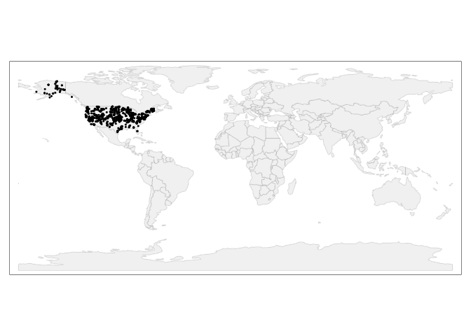
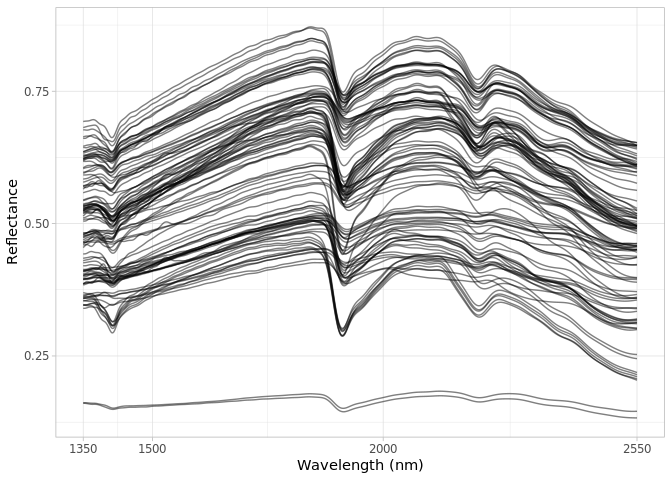
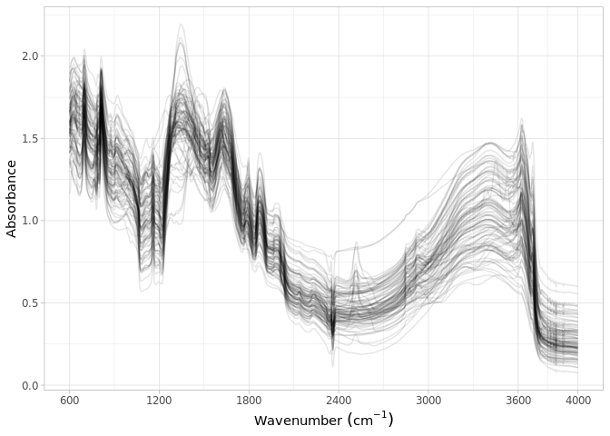

Dataset import: Neospectra
================
Jose Lucas Safanelli (<jsafanelli@woodwellclimate.org>), Colleen Smith
(<csmith@woodwellclimate.org>), Jonathan Sanderman
(<jsanderman@woodwellclimate.org>) -
31 January, 2023


-   [Neospectra database](#neospectra-database)
-   [Data import](#data-import)
    -   [Soil site information](#soil-site-information)
    -   [Soil lab information](#soil-lab-information)
    -   [Near-infrared spectroscopy
        data](#near-infrared-spectroscopy-data)
    -   [Mid-infrared spectroscopy
        data](#mid-infrared-spectroscopy-data)
    -   [Quality control](#quality-control)
-   [References](#references)

[](https://soilspectroscopy.org/)

[](http://creativecommons.org/licenses/by-sa/4.0/)

This work is licensed under a [Creative Commons Attribution-ShareAlike
4.0 International
License](http://creativecommons.org/licenses/by-sa/4.0/).

## Neospectra database

Part of: <https://github.com/soilspectroscopy>  
Project: [Soil Spectroscopy for Global
Good](https://soilspectroscopy.org)  
Last update: 2023-01-31  
Dataset: [Neospectra
database](https://soilspectroscopy.github.io/ossl-manual/neospectra-database.html)

A NIR soil spectral library was compiled using the NeoSpectra Handheld
NIR Analyzer developed by Si-Ware ([Sanderman et
al.](#ref-sanderman_jonathan_2023_7586622)
([2023](#ref-sanderman_jonathan_2023_7586622))). This library includes
2,106 distinct mineral soil samples scanned across 9 of these portable
low-cost NIR spectrometers (indicated by serial no). All samples were
scanned on dry and 2mm sieved soil. Site, soil and MIR spectra were
fetched from KSSL database.

The database is available in <https://doi.org/10.5281/zenodo.7586622>.

Input datasets:  
- `Neospectra_WoodwellKSSL_avg_soil+site+NIR.csv`.  
- `Neospectra_WoodwellKSSL_avg_MIR.csv`.

Directory/folder path

``` r
dir = "/mnt/soilspec4gg/ossl/dataset/Neospectra/"
tic()
```

## Data import

### Soil site information

``` r
# Reading files
neospectra <- read_csv(paste0(dir, "/Neospectra_WoodwellKSSL_avg_soil+site+NIR.csv"))

# # Checking names. Spectra starts at column 55
# names(neospectra[,1:56])
# View(neospectra[,1:56])

neospectra.sitedata <- neospectra %>%
  rename(id.layer_local_c = lay_id,
         id.sample_local_c = kssl_id,
         longitude.point_wgs84_dd = longitude.std.decimal.degrees,
         latitude.point_wgs84_dd = latitude.std.decimal.degrees,
         layer.upper.depth_usda_cm = lay.depth.to.top,
         layer.lower.depth_usda_cm = lay.depth.to.bottom,
         layer.texture_usda_txt = texture.description,
         pedon.taxa_usda_txt = taxonomic.classification.name,
         horizon.designation_usda_txt = horizon.designation,
         longitude.county_wgs84_dd = long.xcntr,
         latitude.county_wgs84_dd = lat.ycntr,
         observation.date.begin_iso.8601_yyyy.mm.dd = fiscal.year) %>%
  mutate(id.layer_local_c = as.character(id.layer_local_c),
         location.point.error_any_m = 30,
         observation.date.end_iso.8601_yyyy.mm.dd = observation.date.begin_iso.8601_yyyy.mm.dd,
         location.country_iso.3166_txt = countrycode::countrycode(country, origin = 'country.name', destination = 'iso3c')) %>%
  mutate(layer.sequence_usda_uint16 = NA,
         id.project_ascii_txt = "Neospectra database",
         observation.ogc.schema.title_ogc_txt = "Open Soil Spectroscopy Library",
         observation.ogc.schema_idn_url = "https://soilspectroscopy.github.io",
         surveyor.title_utf8_txt = "USDA NRCS staff",
         surveyor.contact_ietf_email = "rich.ferguson@usda.gov",
         surveyor.address_utf8_txt = "USDA-NRCS-NSSC, Federal Building, Room 152, Mail Stop, 100 Centennial Mall North, Lincoln, NE",
         dataset.title_utf8_txt = "Neospectra NIR soil spectral library",
         dataset.owner_utf8_txt = "USDA-NRCS-NSSC-KSSL; WCRC; UNL; iSDA",
         dataset.code_ascii_txt = "NEOSPECTRA.SSL",
         dataset.address_idn_url = "https://doi.org/10.5281/zenodo.7586622",
         dataset.doi_idf_url = "https://doi.org/10.5281/zenodo.7586622",
         dataset.license.title_ascii_txt = "CC-BY",
         dataset.license.address_idn_url = "https://creativecommons.org/licenses/by/4.0/",
         dataset.contact.name_utf8_txt = "Jonathan Sanderman",
         dataset.contact_ietf_email = "jsanderman@woodwellclimate.org") %>%
  mutate(id.location_olc_txt = olctools::encode_olc(latitude.point_wgs84_dd, longitude.point_wgs84_dd, 10),
         .after = id.project_ascii_txt) %>%
  select(id.sample_local_c,
         id.layer_local_c,
         longitude.point_wgs84_dd,
         latitude.point_wgs84_dd,
         location.point.error_any_m,
         layer.upper.depth_usda_cm,
         layer.lower.depth_usda_cm,
         layer.sequence_usda_uint16,
         id.project_ascii_txt,
         id.location_olc_txt,
         location.country_iso.3166_txt,
         layer.texture_usda_txt,
         pedon.taxa_usda_txt,
         horizon.designation_usda_txt,
         observation.date.begin_iso.8601_yyyy.mm.dd,
         observation.date.end_iso.8601_yyyy.mm.dd,
         longitude.county_wgs84_dd,
         latitude.county_wgs84_dd,
         observation.ogc.schema.title_ogc_txt,
         observation.ogc.schema_idn_url,
         dataset.code_ascii_txt,
         dataset.title_utf8_txt,
         dataset.owner_utf8_txt,
         dataset.address_idn_url,
         dataset.doi_idf_url,
         surveyor.title_utf8_txt,
         surveyor.contact_ietf_email,
         surveyor.address_utf8_txt,
         dataset.license.title_ascii_txt,
         dataset.license.address_idn_url,
         dataset.contact.name_utf8_txt,
         dataset.contact_ietf_email) %>%
  mutate_at(vars(starts_with("id.")), as.character) %>%
  group_by(id.sample_local_c) %>%
  summarise_all(first)

# Saving version to dataset root dir
site.qs = paste0(dir, "ossl/neospectra_soilsite_v1.2.qs")
qs::qsave(neospectra.sitedata, site.qs, preset = "high")
```

### Soil lab information

NOTE: The code chunk below this paragraph is hidden. Just run once for
getting the original names of soil properties, descriptions, data types,
and units. Run once and upload to Google Sheet for formatting and
integrating with the OSSL. Requires Google authentication.

<!-- ```{r, eval=FALSE, echo=TRUE} -->
<!-- # Reading files -->
<!-- neospectra <- read_csv(paste0(dir, "/Neospectra_WoodwellKSSL_avg_soil+site+NIR.csv")) -->
<!-- # # Checking names. Spectra starts at column 55 -->
<!-- # names(neospectra[,1:56]) -->
<!-- # View(neospectra[,1:56]) -->
<!-- # Getting soillab original variables -->
<!-- soillab.names <- neospectra %>% -->
<!--   select(1:2, 33:55) %>% -->
<!--   names(.) %>% -->
<!--   tibble(original_name = .) %>% -->
<!--   dplyr::mutate(table = '_avg_soil+site+NIR', .before = 1) %>% -->
<!--   dplyr::mutate(import = '', -->
<!--                 ossl_abbrev = '', -->
<!--                 ossl_method = '', -->
<!--                 ossl_unit = '', -->
<!--                 ossl_convert = '', -->
<!--                 ossl_name = '', -->
<!--                 .after = original_name) %>% -->
<!--   dplyr::mutate(comment = '') -->
<!-- readr::write_csv(soillab.names, paste0(getwd(), "/neospectra_soillab_names.csv")) -->
<!-- # Uploading to google sheet -->
<!-- # FACT CIN folder. Get ID for soildata importing table -->
<!-- googledrive::drive_ls(as_id("0AHDIWmLAj40_Uk9PVA")) -->
<!-- OSSL.soildata.importing <- "19LeILz9AEnKVK7GK0ZbK3CCr2RfeP-gSWn5VpY8ETVM" -->
<!-- # Checking metadata -->
<!-- googlesheets4::as_sheets_id(OSSL.soildata.importing) -->
<!-- # Checking readme -->
<!-- googlesheets4::read_sheet(OSSL.soildata.importing, sheet = 'readme') -->
<!-- # Preparing soillab.names -->
<!-- upload <- dplyr::as_tibble(soillab.names) -->
<!-- # Uploading -->
<!-- googlesheets4::write_sheet(upload, ss = OSSL.soildata.importing, sheet = "Neospectra") -->
<!-- # Checking metadata -->
<!-- googlesheets4::as_sheets_id(OSSL.soildata.importing) -->
<!-- ``` -->

NOTE: The code chunk below this paragraph is hidden. Run once for
importing the transformation rules. The table can be edited online at
Google Sheets. A copy is downloaded to github for archiving.

<!-- ```{r soilab_download, include=FALSE, echo=FALSE, eval=FALSE} -->
<!-- # Downloading from google sheet -->
<!-- # FACT CIN folder id -->
<!-- listed.table <- googledrive::drive_ls(as_id("0AHDIWmLAj40_Uk9PVA"), -->
<!--                                       pattern = "OSSL_tab2_soildata_importing") -->
<!-- OSSL.soildata.importing <- listed.table[[1,"id"]] -->
<!-- # Checking metadata -->
<!-- googlesheets4::as_sheets_id(OSSL.soildata.importing) -->
<!-- # Preparing soillab.names -->
<!-- transvalues <- googlesheets4::read_sheet(OSSL.soildata.importing, sheet = "Neospectra") %>% -->
<!--   filter(import == TRUE) %>% -->
<!--   select(contains(c("table", "id", "original_name", "ossl_", "comment"))) -->
<!-- # Saving to folder -->
<!-- write_csv(transvalues, paste0(getwd(), "/OSSL_transvalues.csv")) -->
<!-- ``` -->

Reading AFSIS1-to-OSSL transformation values:

``` r
transvalues <- read_csv(paste0(getwd(), "/OSSL_transvalues.csv")) %>%
  select(-comment)
knitr::kable(transvalues)
```

| table                | original\_name | ossl\_abbrev | ossl\_method | ossl\_unit | ossl\_convert | ossl\_name                   |
|:---------------------|:---------------|:-------------|:-------------|:-----------|:--------------|:-----------------------------|
| \_avg\_soil+site+NIR | eoc\_tot\_c    | oc           | usda.c729    | w.pct      | x             | oc\_usda.c729\_w.pct         |
| \_avg\_soil+site+NIR | c\_tot\_ncs    | c.tot        | usda.a622    | w.pct      | x             | c.tot\_usda.a622\_w.pct      |
| \_avg\_soil+site+NIR | n\_tot\_ncs    | n.tot        | usda.a623    | w.pct      | x             | n.tot\_usda.a623\_w.pct      |
| \_avg\_soil+site+NIR | s\_tot\_ncs    | s.tot        | usda.a624    | w.pct      | x             | s.tot\_usda.a624\_w.pct      |
| \_avg\_soil+site+NIR | ph\_h2o        | ph.h2o       | usda.a268    | index      | x             | ph.h2o\_usda.a268\_index     |
| \_avg\_soil+site+NIR | db\_13b        | bd           | usda.a4      | g.cm3      | x             | bd\_usda.a4\_g.cm3           |
| \_avg\_soil+site+NIR | clay\_tot\_psa | clay.tot     | usda.a334    | w.pct      | x             | clay.tot\_usda.a334\_w.pct   |
| \_avg\_soil+site+NIR | silt\_tot\_psa | silt.tot     | usda.c62     | w.pct      | x             | silt.tot\_usda.c62\_w.pct    |
| \_avg\_soil+site+NIR | sand\_tot\_psa | sand.tot     | usda.c60     | w.pct      | x             | sand.tot\_usda.c60\_w.pct    |
| \_avg\_soil+site+NIR | caco3          | caco3        | usda.a54     | w.pct      | x             | caco3\_usda.a54\_w.pct       |
| \_avg\_soil+site+NIR | efferv\_1nhcl  | efferv       | usda.a479    | class      | x             | efferv\_usda.a479\_class     |
| \_avg\_soil+site+NIR | cecd\_nh4      | cec          | usda.a723    | cmolc.kg   | x             | cec\_usda.a723\_cmolc.kg     |
| \_avg\_soil+site+NIR | ca\_nh4d       | ca.ext       | usda.a722    | cmolc.kg   | x             | ca.ext\_usda.a722\_cmolc.kg  |
| \_avg\_soil+site+NIR | mg\_nh4d       | mg.ext       | usda.a724    | cmolc.kg   | x             | mg.ext\_usda.a724\_cmolc.kg  |
| \_avg\_soil+site+NIR | k\_nh4d        | k.ext        | usda.a725    | cmolc.kg   | x             | k.ext\_usda.a725\_cmolc.kg   |
| \_avg\_soil+site+NIR | na\_nh4d       | na.ext       | usda.a726    | cmolc.kg   | x             | na.ext\_usda.a726\_cmolc.kg  |
| \_avg\_soil+site+NIR | w32l2          | wr.33kPa     | usda.a415    | w.pct      | x             | wr.33kPa\_usda.a415\_w.pct   |
| \_avg\_soil+site+NIR | w15l2          | wr.1500kPa   | usda.a417    | w.pct      | x             | wr.1500kPa\_usda.a417\_w.pct |
| \_avg\_soil+site+NIR | al\_dith       | al.dith      | usda.a65     | w.pct      | x             | al.dith\_usda.a65\_w.pct     |
| \_avg\_soil+site+NIR | p\_mehlich3    | p.ext        | usda.a652    | mg.kg      | x             | p.ext\_usda.a652\_mg.kg      |
| \_avg\_soil+site+NIR | p\_el\_meh3    | p.ext        | usda.a1070   | mg.kg      | x             | p.ext\_usda.a1070\_mg.kg     |
| \_avg\_soil+site+NIR | k\_el\_meh3    | k.ext        | usda.a1065   | mg.kg      | x             | k.ext\_usda.a1065\_mg.kg     |
| \_avg\_soil+site+NIR | ec\_12pre      | ec           | usda.a364    | ds.m       | x             | ec\_usda.a364\_ds.m          |

Preparing soil data:

``` r
neospectra <- read_csv(paste0(dir, "/Neospectra_WoodwellKSSL_avg_soil+site+NIR.csv"))

# Harmonization of names and units
analytes.old.names <- transvalues %>%
  pull(original_name)

analytes.new.names <- transvalues %>%
  pull(ossl_name)

# Selecting and renaming
neospectra.soildata <- neospectra %>%
  rename(id.sample_local_c = kssl_id) %>%
  select(id.sample_local_c, all_of(analytes.old.names)) %>%
  group_by(id.sample_local_c) %>%
  summarise_all(first) %>%
  rename_with(~analytes.new.names, analytes.old.names) %>%
  mutate(id.sample_local_c = as.character(id.sample_local_c)) %>%
  as.data.frame()

# Removing duplicates
neospectra.soildata %>%
  group_by(id.sample_local_c) %>%
  summarise(repeats = n()) %>%
  group_by(repeats) %>%
  summarise(count = n())
```

    ## # A tibble: 1 × 2
    ##   repeats count
    ##     <int> <int>
    ## 1       1  2106

``` r
# Getting the formulas
functions.list <- transvalues %>%
  mutate(ossl_name = factor(ossl_name, levels = names(neospectra.soildata))) %>%
  arrange(ossl_name) %>%
  pull(ossl_convert) %>%
  c("x", .)

# Applying transformation rules
neospectra.soildata.trans <- transform_values(df = neospectra.soildata,
                                              out.name = names(neospectra.soildata),
                                              in.name = names(neospectra.soildata),
                                              fun.lst = functions.list)

# Final soillab data
neospectra.soildata <- neospectra.soildata.trans %>%
  mutate_at(vars(starts_with("id.")), as.character)

# Checking total number of observations
neospectra.soildata %>%
  distinct(id.sample_local_c) %>%
  summarise(count = n())
```

    ##   count
    ## 1  2106

``` r
# Saving version to dataset root dir
soillab.qs = paste0(dir, "ossl/neospectra_soillab_v1.2.qs")
qs::qsave(neospectra.soildata, soillab.qs, preset = "high")
```

### Near-infrared spectroscopy data

``` r
# Floating wavelength
neospectra <- read_csv(paste0(dir, "/Neospectra_WoodwellKSSL_avg_soil+site+NIR.csv"))
# names(neospectra[,1:56])

# Resampling to 2 nm interval
# Formatting as fraction percent with 5 digits of precision
old.spectra.columns <- neospectra %>%
  select(56:ncol(neospectra)) %>%
  names()

neospectra.nir <- neospectra %>%
  rename(id.scan_local_c = Lab_ID) %>%
  select(id.scan_local_c, all_of(old.spectra.columns))

new.spectra.columns <- seq(2550, 1350, by = -2)

neospectra.nir.2nm <- neospectra.nir %>%
  select(all_of(old.spectra.columns)) %>%
  as.matrix() %>%
  prospectr::resample(X = ., wav = as.numeric(old.spectra.columns), new.wav = new.spectra.columns, interpol = "spline") %>%
  as_tibble() %>%
  bind_cols({neospectra.nir %>%
      select(id.scan_local_c)}, .) %>%
  select(id.scan_local_c, all_of(rev(as.character(new.spectra.columns)))) %>%
  mutate_if(is.numeric, function(x){round(x/100, 5)})

# Gaps
scans.na.gaps <- neospectra.nir.2nm %>%
  select(-id.scan_local_c) %>%
  apply(., 1, function(x) round(100*(sum(is.na(x)))/(length(x)), 2)) %>%
  tibble(proportion_NA = .) %>%
  bind_cols({neospectra.nir.2nm %>% select(id.scan_local_c)}, .)

# Extreme negative - irreversible erratic patterns
scans.extreme.neg <- neospectra.nir.2nm %>%
  select(-id.scan_local_c) %>%
  apply(., 1, function(x) {round(100*(sum(x < 0, na.rm=TRUE))/(length(x)), 2)}) %>%
  tibble(proportion_lower0 = .) %>%
  bind_cols({neospectra.nir.2nm %>% select(id.scan_local_c)}, .)

# Extreme positive, irreversible erratic patterns
scans.extreme.pos <- neospectra.nir.2nm %>%
  select(-id.scan_local_c) %>%
  apply(., 1, function(x) {round(100*(sum(x > 1, na.rm=TRUE))/(length(x)), 2)}) %>%
  tibble(proportion_higherRef1 = .) %>%
  bind_cols({neospectra.nir.2nm %>% select(id.scan_local_c)}, .)

# Consistency summary - problematic scans
scans.summary <- scans.na.gaps %>%
  left_join(scans.extreme.neg, by = "id.scan_local_c") %>%
  left_join(scans.extreme.pos, by = "id.scan_local_c")

scans.summary %>%
  select(-id.scan_local_c) %>%
  pivot_longer(everything(), names_to = "check", values_to = "value") %>%
  filter(value > 0) %>%
  group_by(check) %>%
  summarise(count = n())
```

    ## # A tibble: 1 × 2
    ##   check                 count
    ##   <chr>                 <int>
    ## 1 proportion_higherRef1    19

``` r
# Renaming
old.wavenumbers <- seq(1350, 2250, by = 2)
new.wavenumbers <- paste0("scan_nir.", old.wavenumbers, "_ref")

neospectra.nir.2nm <- neospectra.nir.2nm %>%
  rename_with(~new.wavenumbers, as.character(old.wavenumbers))

# Metadata
neospectra.nir.metadata <- neospectra %>%
  rename(id.sample_local_c = kssl_id,
         id.scan_local_c = Lab_ID,
         scan.lab_utf8_txt = Lab,
         scan.nir.model.name_utf8_txt = scanner_name,
         scan.nir.model.serialnumber_utf8_int = scanner_SerialNo,
         scan.nir.accessory.used_utf8_txt = saucer) %>%
  mutate(scan.nir.date.begin_iso.8601_yyyy.mm.dd = "2021-01-01",
         scan.nir.date.end_iso.8601_yyyy.mm.dd = "2022-12-31",
         scan.nir.method.preparation_any_txt = "<2 mm",
         scan.nir.license.title_ascii_txt = "CC-BY",
         scan.nir.license.address_idn_url = "https://creativecommons.org/licenses/by/4.0/",
         scan.nir.doi_idf_url = "https://doi.org/10.5281/zenodo.7586622",
         scan.nir.contact.name_utf8_txt = "Jonathan Sanderman",
         scan.nir.contact.email_ietf_txt = "jsanderman@woodwellclimate.org") %>%
  select(id.sample_local_c, id.scan_local_c, scan.lab_utf8_txt,
         scan.nir.date.begin_iso.8601_yyyy.mm.dd, scan.nir.date.end_iso.8601_yyyy.mm.dd,
         scan.nir.model.name_utf8_txt, scan.nir.model.serialnumber_utf8_int,
         scan.nir.accessory.used_utf8_txt, scan.nir.method.preparation_any_txt,
         scan.nir.license.title_ascii_txt, scan.nir.license.address_idn_url,
         scan.nir.doi_idf_url, scan.nir.contact.name_utf8_txt, scan.nir.contact.email_ietf_txt)

# Final preparation
neospectra.nir.export <- neospectra.nir.metadata %>%
  left_join(neospectra.nir.2nm, by = "id.scan_local_c") %>%
  mutate_at(vars(starts_with("id.")), as.character)

# Saving version to dataset root dir
nir.qs = paste0(dir, "ossl/neospectra_nir_v1.2.qs")
qs::qsave(neospectra.nir.export, nir.qs, preset = "high")
```

### Mid-infrared spectroscopy data

The MIR spectra available on Zenodo is already formatted to OSSL
specifications. It was fetched from the OSSL database rather than the
original KSSL database.

``` r
# Floating wavenumbers
neospectra.mir <- read_csv(paste0(dir, "/Neospectra_WoodwellKSSL_avg_MIR.csv"))

neospectra.mir <- neospectra.mir %>%
  rename(id.sample_local_c = kssl_id)

# Gaps
scans.na.gaps <- neospectra.mir %>%
  select(-id.sample_local_c) %>%
  apply(., 1, function(x) round(100*(sum(is.na(x)))/(length(x)), 2)) %>%
  tibble(proportion_NA = .) %>%
  bind_cols({neospectra.mir %>% select(id.sample_local_c)}, .)

# Extreme negative - irreversible erratic patterns
scans.extreme.neg <- neospectra.mir %>%
  select(-id.sample_local_c) %>%
  apply(., 1, function(x) {round(100*(sum(x < -1, na.rm=TRUE))/(length(x)), 2)}) %>%
  tibble(proportion_lower0 = .) %>%
  bind_cols({neospectra.mir %>% select(id.sample_local_c)}, .)

# Extreme positive, irreversible erratic patterns
scans.extreme.pos <- neospectra.mir %>%
  select(-id.sample_local_c) %>%
  apply(., 1, function(x) {round(100*(sum(x > 5, na.rm=TRUE))/(length(x)), 2)}) %>%
  tibble(proportion_higherAbs5 = .) %>%
  bind_cols({neospectra.mir %>% select(id.sample_local_c)}, .)

# Consistency summary - problematic scans
scans.summary <- scans.na.gaps %>%
  left_join(scans.extreme.neg, by = "id.sample_local_c") %>%
  left_join(scans.extreme.pos, by = "id.sample_local_c")

scans.summary %>%
  select(-id.sample_local_c) %>%
  pivot_longer(everything(), names_to = "check", values_to = "value") %>%
  filter(value > 0) %>%
  group_by(check) %>%
  summarise(count = n())
```

    ## # A tibble: 0 × 2
    ## # … with 2 variables: check <chr>, count <int>

``` r
# Renaming
old.wavenumbers <- seq(600, 4000, by = 2)
new.wavenumbers <- paste0("scan_mir.", old.wavenumbers, "_abs")

neospectra.mir <- neospectra.mir %>%
  rename_with(~new.wavenumbers, as.character(old.wavenumbers))

# Preparing metadata
neospectra.mir.metadata <- neospectra.mir %>%
  select(id.sample_local_c) %>%
  mutate(scan.mir.date.begin_iso.8601_yyyy.mm.dd = ymd("2022-01-01"),
         scan.mir.date.end_iso.8601_yyyy.mm.dd = ymd("2022-12-31"),
         scan.mir.model.name_utf8_txt = "Bruker Vertex 70 with HTS-XT accessory",
         scan.mir.method.optics_any_txt = "KSSL SOPs",
         scan.mir.method.preparation_any_txt = "Finely ground <80 mesh",
         scan.mir.license.title_ascii_txt = "CC-BY",
         scan.mir.license.address_idn_url = "https://creativecommons.org/licenses/by/4.0/",
         scan.mir.doi_idf_url = "https://doi.org/10.5281/zenodo.4351254",
         scan.mir.contact.name_utf8_txt = "Laura Summerauer",
         scan.mir.contact.email_ietf_txt = "laura.summerauer@usys.ethz.ch")

# Final preparation
neospectra.mir.export <- neospectra.mir.metadata %>%
  left_join(neospectra.mir, by = "id.sample_local_c") %>%
  mutate_at(vars(starts_with("id.")), as.character)

# Saving version to dataset root dir
mir.qs = paste0(dir, "ossl/neospectra_mir_v1.2.qs")
qs::qsave(neospectra.mir.export, mir.qs, preset = "high")
```

### Quality control

The final table must be joined as:

-   For NIR, left\_join site and soil to NIR using “id.scan\_local\_c.”
-   For MIR, left\_join site and soil to MIR using
    “id.sample\_local\_c.”

The availabilty of data is summarised below:

``` r
# Taking a few representative columns for checking the consistency of joins
neospectra.availability <- neospectra.nir.export %>%
  select(id.scan_local_c, id.sample_local_c, scan_nir.2000_ref) %>%
  left_join({neospectra.mir.export %>%
      select(id.sample_local_c, scan_mir.1000_abs)}, by = "id.sample_local_c") %>%
  left_join({neospectra.sitedata %>%
      select(id.sample_local_c, layer.upper.depth_usda_cm)}, by = "id.sample_local_c") %>%
  left_join({neospectra.soildata %>%
      select(id.sample_local_c, ph.h2o_usda.a268_index)}, by = "id.sample_local_c")

# Availability of information from neospectra
neospectra.availability %>%
  mutate_all(as.character) %>%
  pivot_longer(everything(), names_to = "column", values_to = "value") %>%
  filter(!is.na(value)) %>%
  group_by(column) %>%
  summarise(count = n())
```

    ## # A tibble: 6 × 2
    ##   column                    count
    ##   <chr>                     <int>
    ## 1 id.sample_local_c          8151
    ## 2 id.scan_local_c            8151
    ## 3 layer.upper.depth_usda_cm  8151
    ## 4 ph.h2o_usda.a268_index     8131
    ## 5 scan_mir.1000_abs          7790
    ## 6 scan_nir.2000_ref          8151

``` r
# Repeats check - scans may have same id but different metadata (scanning device, accessory, etc)
neospectra.availability %>%
  mutate_all(as.character) %>%
  select(id.scan_local_c) %>%
  pivot_longer(everything(), names_to = "column", values_to = "value") %>%
  group_by(column, value) %>%
  summarise(repeats = n()) %>%
  group_by(column, repeats) %>%
  summarise(count = n())
```

    ## # A tibble: 2 × 3
    ## # Groups:   column [1]
    ##   column          repeats count
    ##   <chr>             <int> <int>
    ## 1 id.scan_local_c       1  8039
    ## 2 id.scan_local_c       4    28

Plotting sites map:

``` r
data("World")

points <- neospectra.sitedata %>%
  filter(!is.na(longitude.point_wgs84_dd)) %>%
  st_as_sf(coords = c('longitude.point_wgs84_dd', 'latitude.point_wgs84_dd'), crs = 4326)

tmap_mode("plot")

tm_shape(World) +
  tm_polygons('#f0f0f0f0', border.alpha = 0.2) +
  tm_shape(points) +
  tm_dots()
```

<!-- -->

Soil analytical data summary.

``` r
neospectra.soildata %>%
  mutate(id.sample_local_c = factor(id.sample_local_c)) %>%
  skimr::skim() %>%
  dplyr::select(-numeric.hist, -complete_rate)
```

|                                                  |            |
|:-------------------------------------------------|:-----------|
| Name                                             | Piped data |
| Number of rows                                   | 2106       |
| Number of columns                                | 24         |
| \_\_\_\_\_\_\_\_\_\_\_\_\_\_\_\_\_\_\_\_\_\_\_   |            |
| Column type frequency:                           |            |
| character                                        | 1          |
| factor                                           | 1          |
| numeric                                          | 22         |
| \_\_\_\_\_\_\_\_\_\_\_\_\_\_\_\_\_\_\_\_\_\_\_\_ |            |
| Group variables                                  | None       |

Data summary

**Variable type: character**

| skim\_variable           | n\_missing | min | max | empty | n\_unique | whitespace |
|:-------------------------|-----------:|----:|----:|------:|----------:|-----------:|
| efferv\_usda.a479\_class |         93 |   4 |  11 |     0 |         5 |          0 |

**Variable type: factor**

| skim\_variable      | n\_missing | ordered | n\_unique | top\_counts                    |
|:--------------------|-----------:|:--------|----------:|:-------------------------------|
| id.sample\_local\_c |          0 | FALSE   |      2106 | 100: 1, 101: 1, 101: 1, 101: 1 |

**Variable type: numeric**

| skim\_variable               | n\_missing |   mean |     sd |    p0 |   p25 |    p50 |    p75 |    p100 |
|:-----------------------------|-----------:|-------:|-------:|------:|------:|-------:|-------:|--------:|
| oc\_usda.c729\_w.pct         |          0 |   2.00 |   2.71 | -0.03 |  0.59 |   1.31 |   2.63 |   53.88 |
| c.tot\_usda.a622\_w.pct      |         90 |   2.29 |   2.80 |  0.02 |  0.82 |   1.59 |   2.97 |   53.88 |
| n.tot\_usda.a623\_w.pct      |          0 |   0.17 |   0.18 |  0.00 |  0.06 |   0.12 |   0.22 |    3.02 |
| s.tot\_usda.a624\_w.pct      |         90 |   0.13 |   1.02 |  0.00 |  0.00 |   0.01 |   0.03 |   18.38 |
| ph.h2o\_usda.a268\_index     |         10 |   6.25 |   1.26 |  3.69 |  5.21 |   6.12 |   7.35 |    9.52 |
| bd\_usda.a4\_g.cm3           |       1142 |   1.31 |   0.24 |  0.30 |  1.18 |   1.34 |   1.47 |    2.03 |
| clay.tot\_usda.a334\_w.pct   |          0 |  20.55 |  14.54 |  0.00 |  9.08 |  18.33 |  28.82 |   86.69 |
| silt.tot\_usda.c62\_w.pct    |          0 |  37.57 |  20.30 |  0.00 | 21.80 |  37.40 |  52.10 |   87.90 |
| sand.tot\_usda.c60\_w.pct    |          0 |  41.88 |  27.95 |  0.30 | 17.60 |  39.25 |  64.38 |  100.00 |
| caco3\_usda.a54\_w.pct       |       1413 |   5.91 |   9.49 | -0.57 |  0.26 |   1.64 |   7.61 |   89.03 |
| cec\_usda.a723\_cmolc.kg     |         10 |  16.05 |  12.11 |  0.13 |  7.74 |  14.08 |  21.96 |  190.11 |
| ca.ext\_usda.a722\_cmolc.kg  |         10 |  19.23 |  31.73 |  0.00 |  2.52 |   9.78 |  22.19 |  363.64 |
| mg.ext\_usda.a724\_cmolc.kg  |         10 |   3.24 |   4.52 |  0.00 |  0.68 |   1.98 |   4.29 |   82.14 |
| k.ext\_usda.a725\_cmolc.kg   |         10 |   0.55 |   0.73 |  0.00 |  0.14 |   0.33 |   0.68 |   11.25 |
| na.ext\_usda.a726\_cmolc.kg  |         10 |   0.88 |   8.10 |  0.00 |  0.00 |   0.00 |   0.05 |  202.96 |
| wr.33kPa\_usda.a415\_w.pct   |       1875 |  23.87 |  13.74 |  1.00 | 14.17 |  24.22 |  31.44 |  127.90 |
| wr.1500kPa\_usda.a417\_w.pct |         35 |  11.59 |   7.27 |  0.08 |  6.49 |  10.81 |  15.21 |   96.14 |
| al.dith\_usda.a65\_w.pct     |        231 |   0.18 |   0.25 |  0.00 |  0.04 |   0.10 |   0.19 |    2.28 |
| p.ext\_usda.a652\_mg.kg      |       1378 |  35.21 |  81.75 |  0.00 |  2.96 |  11.25 |  34.89 | 1358.90 |
| p.ext\_usda.a1070\_mg.kg     |       2030 |  27.26 |  35.04 |  0.36 |  6.52 |  15.96 |  39.22 |  256.44 |
| k.ext\_usda.a1065\_mg.kg     |       2030 | 185.49 | 136.84 |  0.00 | 82.01 | 147.45 | 256.33 |  730.19 |
| ec\_usda.a364\_ds.m          |       1154 |   1.00 |   4.72 |  0.01 |  0.13 |   0.23 |   0.46 |   81.93 |

NIR spectral visualization:

``` r
set.seed(1993)
selected.ids <- sample(neospectra.nir.export$id.sample_local_c, 20)
neospectra.nir.export %>%
  filter(id.sample_local_c %in% selected.ids) %>%
  select(all_of(c("id.scan_local_c", "scan.nir.model.serialnumber_utf8_int")), starts_with("scan_nir.")) %>%
  tidyr::pivot_longer(-all_of(c("id.scan_local_c", "scan.nir.model.serialnumber_utf8_int")),
                      names_to = "wavelength", values_to = "reflectance") %>%
  dplyr::mutate(wavelength = gsub("scan_nir.|_ref", "", wavelength)) %>%
  dplyr::mutate(wavelength = as.numeric(wavelength)) %>%
  ggplot(aes(x = wavelength, y = reflectance, group = id.scan_local_c)) +
  geom_line(alpha = 0.5, size = 0.5) +
  scale_x_continuous(breaks = c(1350, 1500, 1750, 2000, 2250)) +
  labs(x = "Wavelength (nm)", y = "Reflectance", color = "") +
  theme_light()
```

<!-- -->

MIR spectral visualization:

``` r
set.seed(1993)
neospectra.mir %>%
  sample_n(100) %>%
  select(all_of(c("id.sample_local_c")), starts_with("scan_mir.")) %>%
  tidyr::pivot_longer(-all_of(c("id.sample_local_c")),
                      names_to = "wavenumber", values_to = "absorbance") %>%
  dplyr::mutate(wavenumber = gsub("scan_mir.|_abs", "", wavenumber)) %>%
  dplyr::mutate(wavenumber = as.numeric(wavenumber)) %>%
  ggplot(aes(x = wavenumber, y = absorbance, group = id.sample_local_c)) +
  geom_line(alpha = 0.1) +
  scale_x_continuous(breaks = c(600, 1200, 1800, 2400, 3000, 3600, 4000)) +
  labs(x = bquote("Wavenumber"~(cm^-1)), y = "Absorbance") +
  theme_light()
```

<!-- -->

``` r
toc()
```

    ## 23.359 sec elapsed

``` r
rm(list = ls())
gc()
```

    ##           used  (Mb) gc trigger  (Mb) max used  (Mb)
    ## Ncells 2605095 139.2    5041442 269.3  5041442 269.3
    ## Vcells 5080255  38.8   37338236 284.9 40205959 306.8

## References

<div id="refs" class="references csl-bib-body hanging-indent"
line-spacing="2">

<div id="ref-sanderman_jonathan_2023_7586622" class="csl-entry">

Sanderman, J., Smith, C., Safanelli, J. L., Mitu, S. M., Ge, Y., Murad,
O., … Ferguson, R. R. (2023, January). <span
class="nocase">Near-infrared (NIR) soil spectral library using the
NeoSpectra Handheld NIR Analyzer by Si-Ware</span>. Zenodo.
doi:[10.5281/zenodo.7586622](https://doi.org/10.5281/zenodo.7586622)

</div>

</div>
