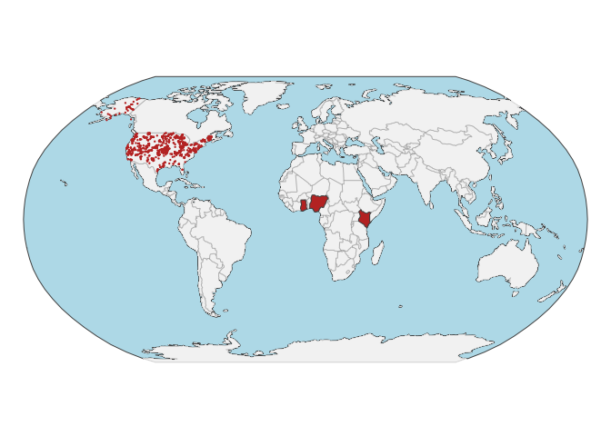
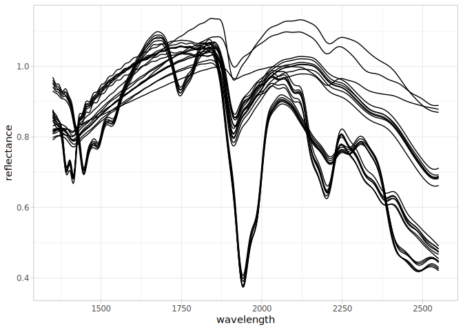
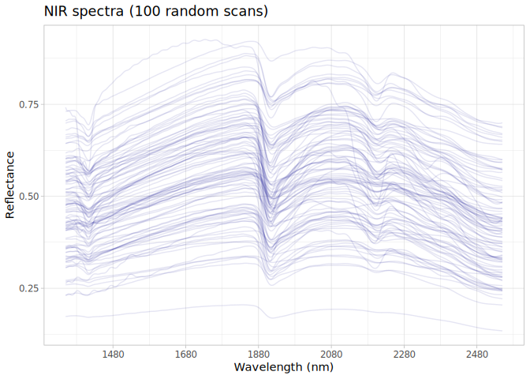
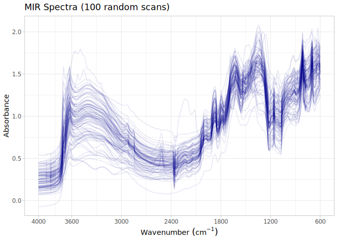

# Neospectra (now ProxiScout) near-infrared (NIR) library
Jose L. Safanelli, Colleen Partida, Jonathan Sanderman

- [Original data](#original-data)
- [Data standardization to the OSSL
  format](#data-standardization-to-the-ossl-format)
  - [Site information](#site-information)
  - [Soil lab information (reference analytical
    data)](#soil-lab-information-reference-analytical-data)
  - [Near-infrared spectroscopy data](#near-infrared-spectroscopy-data)
  - [Quality control for NIR](#quality-control-for-nir)
  - [Mid-infrared spectroscopy data](#mid-infrared-spectroscopy-data)
  - [Quality control for MIR](#quality-control-for-mir)
- [References](#references)

Code repository for standardizing and importing the Neospectra library
into the Open Soil Spectral Library.

Website: [Soil Spectroscopy for Global
Good](https://soilspectroscopy.org)  
Development: <https://github.com/soilspectroscopy>  
Last update: 2026-05-20  
Additional documentation:

## Original data

A NIR soil spectral library was compiled using the formerly known
NeoSpectra Handheld NIR Analyzer developed by Si-Ware (Mitu et al.
([2024](#ref-Mitu2024)), Partida et al. ([2025](#ref-Partida2025))) -
now rebranded as BUCHI ProxiScout.

This library includes 2,106 distinct mineral soil samples scanned across
9 of these portable low-cost NIR spectrometers (indicated by serial no).
All samples were scanned on dry and 2 mm sieved soil. Site, soil and
paired MIR spectra were fetched from the KSSL database.

The database is available in <https://doi.org/10.5281/zenodo.7586622>.

Input datasets:  
- `Neospectra_WoodwellKSSL_avg_soil+site+NIR.csv`.  
- `Neospectra_WoodwellKSSL_avg_MIR.csv`.

Directory/folder path

``` r
dir = "~/mnt-ossl-private/database/datasets/Neospectra"
tic()
```

## Data standardization to the OSSL format

### Site information

``` r
# Reading files
neospectra <- read_csv(paste0(dir,
                              "/Neospectra_WoodwellKSSL_avg_soil+site+NIR.csv"))

# # Checking names. Spectra starts at column 55
# names(neospectra[,1:56])
# View(neospectra[,1:56])


neospectra.sitedata <- neospectra %>%
  rename(id.kssl.lay_local_txt = lay_id,
         id.kssl.smp_local_txt = kssl_id,
         loc.country_src_txt = country,
         loc.fips.code = fips.code,
         longitude.point_wgs84_dd = longitude.std.decimal.degrees,
         latitude.point_wgs84_dd = latitude.std.decimal.degrees,
         longitude.county_wgs84_dd = long.xcntr,
         latitude.county_wgs84_dd = lat.ycntr,
         pedon.taxa_usda_txt = taxonomic.classification.name,
         pedon.horizon_usda_txt = horizon.designation,
         layer.texture_usda_txt = texture.description,
         layer.upper.depth_usda_cm = lay.depth.to.top,
         layer.lower.depth_usda_cm = lay.depth.to.bottom,
         scan.lab_src_txt = Lab,
         scan.scanner.name_src_txt = scanner_name,
         scan.scanner.sn_src_int = scanner_SerialNo,
         scan.accessory_src_txt = saucer) %>%
  mutate(id.layer_local_c = str_c(scan.lab_src_txt,
                                  scan.scanner.name_src_txt,
                                  id.kssl.smp_local_txt,
                                  sep = "::"),
         .before = 1) %>%
  mutate(dataset.code_ascii_txt = "Neospectra",
         .after = id.layer_local_c) %>%
  mutate(id.presentation_src_txt = "Instrument average",
         .after = id.layer_local_c) %>%
  mutate_at(vars(starts_with("id.")), as.character) %>%
  select(dataset.code_ascii_txt,id.layer_local_c, id.presentation_src_txt,
         id.kssl.lay_local_txt,id.kssl.smp_local_txt,
         loc.country_src_txt,loc.fips.code,longitude.point_wgs84_dd,
         latitude.point_wgs84_dd,longitude.county_wgs84_dd,latitude.county_wgs84_dd,
         pedon.taxa_usda_txt,pedon.horizon_usda_txt,layer.texture_usda_txt,
         layer.upper.depth_usda_cm, layer.lower.depth_usda_cm)

neospectra.sitedata.avg <- neospectra.sitedata %>%
  group_by(id.kssl.lay_local_txt) %>%
  summarise_all(first) %>%
  relocate(dataset.code_ascii_txt, id.layer_local_c,
           .before = id.kssl.lay_local_txt) %>%
  mutate(id.layer_local_c = str_c("AVG",
                                  id.kssl.smp_local_txt,
                                  sep = "::")) %>%
  mutate(id.presentation_src_txt = "Layer average",
         .after = id.layer_local_c)

neospectra.sitedata <- bind_rows(neospectra.sitedata.avg,
                                 neospectra.sitedata)

# Saving version to dataset root dir
site.exp.file = path(dir, "ossl_soilsite_v1.3")
readr::write_csv(neospectra.sitedata, str_c(site.exp.file, ".csv.gz"))
nanoparquet::write_parquet(neospectra.sitedata, str_c(site.exp.file, ".parquet"))
```

Plotting map:

``` r
data("World")
Ghana <- World[World$name == "Ghana",]
Nigeria <- World[World$name == "Nigeria",]
Kenya <- World[World$name == "Kenya",]

ocean <- ne_download(scale = 110, type = "ocean",
                     category = "physical", returnclass = "sf")

points <- neospectra.sitedata %>%
  filter(!is.na(longitude.point_wgs84_dd),
         !is.na(latitude.point_wgs84_dd)) %>%
  distinct(longitude.point_wgs84_dd, latitude.point_wgs84_dd) %>%
  st_as_sf(coords = c('longitude.point_wgs84_dd', 'latitude.point_wgs84_dd'),
           crs = 4326)

tmap_mode("plot")

tm_shape(ocean) +
  tm_polygons(fill = "lightblue", col = NA) +
  tm_shape(World) +
  tm_polygons('#f0f0f0f0', col_alpha = 0.2) +
  tm_shape(points) +
  tm_dots(size = 0.10, fill = "firebrick") +
  tm_shape(Ghana) +
  tm_polygons(fill = "firebrick") +
  tm_shape(Nigeria) +
  tm_polygons(fill = "firebrick") +
  tm_shape(Kenya) +
  tm_polygons(fill = "firebrick") +
  tm_crs("ESRI:54030") +
  tm_layout(frame = FALSE)
```



### Soil lab information (reference analytical data)

NOTE: The code chunk below must be run just once for getting a template
for scripted column standardization. Just run once for getting the
original names of soil properties, descriptions, data types, and units.
Then upload to Google Sheet for editing and defining the rules for
integrating with the OSSL. Requires Google authentication. A copy of the
output file is saved to this folder for archiving purposes.

**Always leave the sheet name as TEMP to avoid overwritting, then rename
online to dataset code and download a copy for this repository.**

``` r
# Reading files
neospectra <- read_csv(paste0(dir,
                              "/Neospectra_WoodwellKSSL_avg_soil+site+NIR.csv"))

# # Checking names. Spectra starts at column 55
# names(neospectra[,1:56])
# View(neospectra[,1:56])

# Getting soillab original variables
soillab.names <- neospectra %>%
  select(1:2, 33:55) %>%
  names(.) %>%
  tibble(original_name = .) %>%
  dplyr::mutate(table = '_avg_soil+site+NIR', .before = 1) %>%
  dplyr::mutate(import = '',
                ossl_abbrev = '',
                ossl_method = '',
                ossl_unit = '',
                ossl_convert = '',
                ossl_name = '',
                .after = original_name) %>%
  dplyr::mutate(comment = '')

readr::write_csv(soillab.names, paste0(getwd(), "/neospectra_soillab_names.csv"))

# Uploading to google sheet
OSSL.soildata.importing <- "1mWTDJDuMp4oObcCxAy9gofSkrkcSWWf1TtEW2SuC1es"

# Checking metadata
googlesheets4::as_sheets_id(OSSL.soildata.importing)

# Checking readme
googlesheets4::read_sheet(OSSL.soildata.importing, sheet = 'readme')

# Preparing soillab.names
upload <- dplyr::as_tibble(soillab.names)

# Uploading
googlesheets4::write_sheet(upload, ss = OSSL.soildata.importing, sheet = "TEMP")

# Checking metadata
googlesheets4::as_sheets_id(OSSL.soildata.importing)
```

NOTE: The code chunk below must be run just once. Run for getting the
column standardization rules after editing online on Google Sheets. A
copy of the edited standardization template is saved to this dataset
folder.

``` r
# Downloading from google sheet

# Checking metadata
googlesheets4::as_sheets_id("1mWTDJDuMp4oObcCxAy9gofSkrkcSWWf1TtEW2SuC1es")

# Preparing soillab.names
transvalues <- googlesheets4::read_sheet("1mWTDJDuMp4oObcCxAy9gofSkrkcSWWf1TtEW2SuC1es",
                                         sheet = "Neospectra")

# Saving to folder
readr::write_csv(transvalues, path(getwd(), "soillab_standardized_names.csv"))
```

Reading standardization rules:

``` r
transvalues <- read_csv(path(getwd(), "soillab_standardized_names.csv"),
                        show_col_types = F)

 transvalues <- transvalues%>%
  filter(import == TRUE) %>%
  select(contains(c("table", "id", "original_name", "original_unit" , "ossl_")))
 
knitr::kable(transvalues)
```

| table | original_name | ossl_abbrev | ossl_method | ossl_unit | ossl_convert | ossl_name |
|:---|:---|:---|:---|:---|:---|:---|
| \_avg_soil+site+NIR | eoc_tot_c | oc | usda.c729 | w.pct | x | oc_usda.c729_w.pct |
| \_avg_soil+site+NIR | c_tot_ncs | c.tot | usda.a622 | w.pct | x | c.tot_usda.a622_w.pct |
| \_avg_soil+site+NIR | n_tot_ncs | n.tot | usda.a623 | w.pct | x | n.tot_usda.a623_w.pct |
| \_avg_soil+site+NIR | s_tot_ncs | s.tot | usda.a624 | w.pct | x | s.tot_usda.a624_w.pct |
| \_avg_soil+site+NIR | ph_h2o | ph.h2o | usda.a268 | index | x | ph.h2o_usda.a268_index |
| \_avg_soil+site+NIR | db_13b | bd | usda.a4 | g.cm3 | x | bd_usda.a4_g.cm3 |
| \_avg_soil+site+NIR | clay_tot_psa | clay.tot | usda.a334 | w.pct | x | clay.tot_usda.a334_w.pct |
| \_avg_soil+site+NIR | silt_tot_psa | silt.tot | usda.c62 | w.pct | x | silt.tot_usda.c62_w.pct |
| \_avg_soil+site+NIR | sand_tot_psa | sand.tot | usda.c60 | w.pct | x | sand.tot_usda.c60_w.pct |
| \_avg_soil+site+NIR | caco3 | caco3 | usda.a54 | w.pct | x | caco3_usda.a54_w.pct |
| \_avg_soil+site+NIR | efferv_1nhcl | efferv | usda.a479 | class | x | efferv_usda.a479_class |
| \_avg_soil+site+NIR | cecd_nh4 | cec | usda.a723 | cmolc.kg | x | cec_usda.a723_cmolc.kg |
| \_avg_soil+site+NIR | ca_nh4d | ca.ext | usda.a722 | cmolc.kg | x | ca.ext_usda.a722_cmolc.kg |
| \_avg_soil+site+NIR | mg_nh4d | mg.ext | usda.a724 | cmolc.kg | x | mg.ext_usda.a724_cmolc.kg |
| \_avg_soil+site+NIR | k_nh4d | k.ext | usda.a725 | cmolc.kg | x | k.ext_usda.a725_cmolc.kg |
| \_avg_soil+site+NIR | na_nh4d | na.ext | usda.a726 | cmolc.kg | x | na.ext_usda.a726_cmolc.kg |
| \_avg_soil+site+NIR | w32l2 | wr.33kPa | usda.a415 | w.pct | x | wr.33kPa_usda.a415_w.pct |
| \_avg_soil+site+NIR | w15l2 | wr.1500kPa | usda.a417 | w.pct | x | wr.1500kPa_usda.a417_w.pct |
| \_avg_soil+site+NIR | al_dith | al.dith | usda.a65 | w.pct | x | al.dith_usda.a65_w.pct |
| \_avg_soil+site+NIR | p_mehlich3 | p.ext | usda.a652 | mg.kg | x | p.ext_usda.a652_mg.kg |
| \_avg_soil+site+NIR | p_el_meh3 | p.ext | usda.a1070 | mg.kg | x | p.ext_usda.a1070_mg.kg |
| \_avg_soil+site+NIR | k_el_meh3 | k.ext | usda.a1065 | mg.kg | x | k.ext_usda.a1065_mg.kg |
| \_avg_soil+site+NIR | ec_12pre | ec | usda.a364 | ds.m | x | ec_usda.a364_ds.m |

Standardizing soil data to the OSSL format:

``` r
neospectra <- read_csv(paste0(dir,
                              "/Neospectra_WoodwellKSSL_avg_soil+site+NIR.csv"))
```

    Rows: 8095 Columns: 312
    ── Column specification ────────────────────────────────────────────────────────
    Delimiter: ","
    chr  (17): Lab, WOODWELL_ID, Lab_ID, country, scanner_name, saucer, lay.type...
    dbl (295): kssl_id, lay_id, scanner_SerialNo, proj.id, lims.site.id, lims.pe...

    ℹ Use `spec()` to retrieve the full column specification for this data.
    ℹ Specify the column types or set `show_col_types = FALSE` to quiet this message.

``` r
# Harmonization of names and units
analytes.old.names <- transvalues %>%
  pull(original_name)

analytes.new.names <- transvalues %>%
  pull(ossl_name)

# Selecting and renaming
neospectra.soildata <- neospectra %>%
  rename(id.kssl.lay_local_txt = lay_id,
         id.kssl.smp_local_txt = kssl_id,
         scan.lab_src_txt = Lab,
         scan.scanner.name_src_txt = scanner_name,
         scan.scanner.sn_src_int = scanner_SerialNo,
         scan.accessory_src_txt = saucer) %>%
  mutate(id.layer_local_c = str_c(scan.lab_src_txt,
                                  scan.scanner.name_src_txt,
                                  id.kssl.smp_local_txt,
                                  sep = "::"),
         .before = 1) %>%
  select(id.layer_local_c, all_of(analytes.old.names)) %>%
  rename_with(~analytes.new.names, analytes.old.names) %>%
  mutate(id.layer_local_c = as.character(id.layer_local_c)) %>%
  as.data.frame()
```

    Warning: Using an external vector in selections was deprecated in tidyselect 1.1.0.
    ℹ Please use `all_of()` or `any_of()` instead.
      # Was:
      data %>% select(analytes.old.names)

      # Now:
      data %>% select(all_of(analytes.old.names))

    See <https://tidyselect.r-lib.org/reference/faq-external-vector.html>.

``` r
neospectra.soildata.avg <- neospectra %>%
  rename(id.kssl.smp_local_txt = kssl_id) %>%
  select(id.kssl.smp_local_txt, all_of(analytes.old.names)) %>%
  group_by(id.kssl.smp_local_txt) %>%
  summarise_all(first) %>%
  mutate(id.layer_local_c = str_c("AVG",
                                  id.kssl.smp_local_txt,
                                  sep = "::"),
         .before = 1) %>%
  select(id.layer_local_c, all_of(analytes.old.names)) %>%
  rename_with(~analytes.new.names, analytes.old.names) %>%
  mutate(id.layer_local_c = as.character(id.layer_local_c)) %>%
  # mutate(efferv_usda.a479_class = as.character(efferv_usda.a479_class)) %>%
  as.data.frame()

neospectra.soildata <- bind_rows(neospectra.soildata.avg,
                                 neospectra.soildata)

# Removing duplicates
neospectra.soildata %>%
  group_by(id.layer_local_c) %>%
  summarise(repeats = n()) %>%
  group_by(repeats) %>%
  summarise(count = n())
```

    # A tibble: 1 × 2
      repeats count
        <int> <int>
    1       1 10201

``` r
# Getting the formulas
functions.list <- transvalues %>%
  mutate(ossl_name = factor(ossl_name, levels = names(neospectra.soildata))) %>%
  arrange(ossl_name) %>%
  pull(ossl_convert) %>%
  c("x", .)

# Applying transformation rules
neospectra.soildata.trans <- transform_values(df = neospectra.soildata,
                                              out.name = names(neospectra.soildata),
                                              in.name = names(neospectra.soildata),
                                              fun.lst = functions.list)

# Final soillab data
neospectra.soildata <- neospectra.soildata.trans %>%
  mutate_at(vars(starts_with("id.")), as.character)

# Checking total number of observations
neospectra.soildata %>%
  distinct(id.layer_local_c) %>%
  summarise(count = n())
```

      count
    1 10201

``` r
# Saving version to dataset root dir
soillab.exp.file = path(dir, "ossl_soillab_v1.3")
readr::write_csv(neospectra.soildata, str_c(soillab.exp.file, ".csv.gz"))
nanoparquet::write_parquet(neospectra.soildata, str_c(soillab.exp.file, ".parquet"))
```

### Near-infrared spectroscopy data

``` r
# Floating wavelength
neospectra <- read_csv(paste0(dir, "/Neospectra_WoodwellKSSL_avg_soil+site+NIR.csv"))
# names(neospectra[,1:56])

# Resampling to 2 nm interval
# Formatting as fraction percent with 5 digits of precision
old.spectra.columns <- neospectra %>%
  select(56:ncol(neospectra)) %>%
  names()

neospectra.nir <- neospectra %>%
  rename(id.kssl.lay_local_txt = lay_id,
         id.kssl.smp_local_txt = kssl_id,
         scan.lab_src_txt = Lab,
         scan.scanner.name_src_txt = scanner_name,
         scan.scanner.sn_src_int = scanner_SerialNo,
         scan.accessory_src_txt = saucer) %>%
  mutate(id.layer_local_c = str_c(scan.lab_src_txt,
                                  scan.scanner.name_src_txt,
                                  id.kssl.smp_local_txt,
                                  sep = "::"),
         .before = 1) %>%
  select(id.layer_local_c, all_of(old.spectra.columns))

new.spectra.columns <- seq(2550, 1350, by = -2)

neospectra.nir.2nm <- neospectra.nir %>%
  select(all_of(old.spectra.columns)) %>%
  as.matrix() %>%
  prospectr::resample(X = ., wav = as.numeric(old.spectra.columns), new.wav = new.spectra.columns, interpol = "spline") %>%
  as_tibble() %>%
  bind_cols({neospectra.nir %>%
      select(id.layer_local_c)}, .) %>%
  select(id.layer_local_c, all_of(rev(as.character(new.spectra.columns)))) %>%
  mutate_if(is.numeric, function(x){round(x/100, 5)})

neospectra.nir.2nm.avg <- neospectra.nir.2nm %>%
  mutate(id.layer_local_c = str_split_i(id.layer_local_c, "::", 3)) %>%
  mutate(id.layer_local_c = str_c("AVG", id.layer_local_c, sep = "::")) %>%
  group_by(id.layer_local_c) %>%
  summarise_all(mean)

neospectra.nir.2nm <- bind_rows(neospectra.nir.2nm.avg, neospectra.nir.2nm)

# Gaps
scans.na.gaps <- neospectra.nir.2nm %>%
  select(-id.layer_local_c) %>%
  apply(., 1, function(x) round(100*(sum(is.na(x)))/(length(x)), 2)) %>%
  tibble(proportion_NA = .) %>%
  bind_cols({neospectra.nir.2nm %>% select(id.layer_local_c)}, .)

# Extreme negative - irreversible erratic patterns
scans.extreme.neg <- neospectra.nir.2nm %>%
  select(-id.layer_local_c) %>%
  apply(., 1, function(x) {round(100*(sum(x < 0, na.rm=TRUE))/(length(x)), 2)}) %>%
  tibble(proportion_lower0 = .) %>%
  bind_cols({neospectra.nir.2nm %>% select(id.layer_local_c)}, .)

# Extreme positive, irreversible erratic patterns
scans.extreme.pos <- neospectra.nir.2nm %>%
  select(-id.layer_local_c) %>%
  apply(., 1, function(x) {round(100*(sum(x > 1, na.rm=TRUE))/(length(x)), 2)}) %>%
  tibble(proportion_higherRef1 = .) %>%
  bind_cols({neospectra.nir.2nm %>% select(id.layer_local_c)}, .)

# Consistency summary - problematic scans
scans.summary <- scans.na.gaps %>%
  left_join(scans.extreme.neg, by = "id.layer_local_c") %>%
  left_join(scans.extreme.pos, by = "id.layer_local_c")

scans.summary %>%
  select(-id.layer_local_c) %>%
  pivot_longer(everything(), names_to = "check", values_to = "value") %>%
  filter(value > 0) %>%
  group_by(check) %>%
  summarise(count = n())
```

    # A tibble: 1 × 2
      check                 count
      <chr>                 <int>
    1 proportion_higherRef1    23

``` r
check.ids <- scans.extreme.pos %>%
  filter(proportion_higherRef1 > 1) %>%
  pull(id.layer_local_c)

# IDs with possible issues
check.ids
```

     [1] "AVG::112841"            "AVG::112842"            "AVG::126272"           
     [4] "AVG::192844"            "Woodwell::NEO1::126272" "Woodwell::NEO1::192844"
     [7] "Woodwell::NEO2::119164" "KSSL::NEO2::120491"     "Woodwell::NEO2::126272"
    [10] "Woodwell::NEO2::192844" "Woodwell::NEO3::126272" "Woodwell::NEO3::192844"
    [13] "Woodwell::NEO3::236478" "Woodwell::NEO4::126272" "Woodwell::NEO4::192844"
    [16] "Woodwell::NEO5::126272" "Woodwell::NEO5::192844" "KSSL::NEO6::112841"    
    [19] "KSSL::NEO6::112842"     "Woodwell::NEO6::126272" "Woodwell::NEO6::192844"
    [22] "KSSL::NEO7::112841"     "KSSL::NEO7::112842"    

``` r
# Visualization
neospectra.nir.2nm %>%
  filter(id.layer_local_c %in% check.ids) %>%
  pivot_longer(-id.layer_local_c,
               names_to = "wavelength",
               values_to = "reflectance") %>%
  mutate(wavelength = as.numeric(wavelength)) %>%
  ggplot() +
  geom_line(aes(x = wavelength, y = reflectance, group = id.layer_local_c)) +
  theme_light()
```



``` r
# Will keep them, but workth removing them when modeling
# SNV removes the offset if that's the only issue

# Renaming
old.wavenumbers <- seq(1350, 2550, by = 2)
new.wavenumbers <- paste0("scan_nir.", old.wavenumbers, "_ref")

neospectra.nir.2nm <- neospectra.nir.2nm %>%
  rename_with(~new.wavenumbers, all_of(as.character(old.wavenumbers)))

# Metadata
neospectra.nir.metadata <- neospectra %>%
  rename(id.kssl.lay_local_txt = lay_id,
         id.kssl.smp_local_txt = kssl_id,
         scan.lab_src_txt = Lab,
         scan.scanner.name_src_txt = scanner_name,
         scan.scanner.sn_src_int = scanner_SerialNo,
         scan.accessory_src_txt = saucer) %>%
  mutate(id.layer_local_c = str_c(scan.lab_src_txt,
                                  scan.scanner.name_src_txt,
                                  id.kssl.smp_local_txt,
                                  sep = "::"),
         .before = 1) %>%
  select(id.layer_local_c, scan.lab_src_txt,
         scan.scanner.name_src_txt, scan.scanner.sn_src_int,
         scan.accessory_src_txt) %>%
  mutate(across(starts_with("scan"), as.character)) %>%
  bind_rows({neospectra %>%
      rename(id.kssl.lay_local_txt = lay_id,
             id.kssl.smp_local_txt = kssl_id,
             scan.lab_src_txt = Lab,
             scan.scanner.name_src_txt = scanner_name,
             scan.scanner.sn_src_int = scanner_SerialNo,
             scan.accessory_src_txt = saucer) %>%
      mutate(id.layer_local_c = str_c("AVG",
                                      id.kssl.smp_local_txt,
                                      sep = "::"),
             .before = 1) %>%
      select(id.layer_local_c, scan.lab_src_txt,
             scan.scanner.name_src_txt, scan.scanner.sn_src_int,
             scan.accessory_src_txt) %>%
      group_by(id.layer_local_c) %>%
      summarise_all(first) %>%
      mutate(scan.lab_src_txt = "Multiple",
             scan.scanner.name_src_txt = "Multiple",
             scan.scanner.sn_src_int = "Multiple",
             scan.accessory_src_txt = "Multiple")}, .)

# Final preparation
neospectra.nir.export <- neospectra.nir.metadata %>%
  left_join(neospectra.nir.2nm, by = "id.layer_local_c") %>%
  mutate_at(vars(starts_with("id.")), as.character)

# Saving to disk
nir.exp.file = path(dir, "ossl_nir_v1.3")
readr::write_csv(neospectra.nir.export, str_c(nir.exp.file, ".csv.gz"))
nanoparquet::write_parquet(neospectra.nir.export, str_c(nir.exp.file, ".parquet"))
```

### Quality control for NIR

The final table must be joined as follows:

- NIR is used as first reference for pairing with site and soil data.
- Site and soil lab data are left joined to nir. This drop data without
  any available scan.

The availability of data is summarized below (Sample AVG + Instrument
AVG):

``` r
# Taking a few representative columns for checking the consistency of joins
neospectra.availability <- neospectra.nir.export %>%
  select(id.layer_local_c, scan_nir.1500_ref) %>%
  left_join(neospectra.soildata, by = "id.layer_local_c") %>%
  filter(!is.na(id.layer_local_c))

# Availability of information summary
# This tells us how many samples have spectra vs. lab/site data
neospectra.availability %>%
  mutate(across(everything(), as.character)) %>%
  pivot_longer(everything(), names_to = "column", values_to = "value") %>%
  filter(!is.na(value)) %>%
  group_by(column) %>%
  summarise(count = n())
```

    # A tibble: 25 × 2
       column                    count
       <chr>                     <int>
     1 al.dith_usda.a65_w.pct     8704
     2 bd_usda.a4_g.cm3           4850
     3 c.tot_usda.a622_w.pct      9931
     4 ca.ext_usda.a722_cmolc.kg 10171
     5 caco3_usda.a54_w.pct       3477
     6 cec_usda.a723_cmolc.kg    10171
     7 clay.tot_usda.a334_w.pct  10201
     8 ec_usda.a364_ds.m          4701
     9 efferv_usda.a479_class     9911
    10 id.layer_local_c          10201
    # ℹ 15 more rows

``` r
# Repeats check 
neospectra.availability %>%
  mutate(across(everything(), as.character)) %>%
  select(id.layer_local_c) %>%
  pivot_longer(everything(), names_to = "column", values_to = "value") %>%
  group_by(column, value) %>%
  summarise(repeats = n(), .groups = 'drop') %>%
  group_by(column, repeats) %>%
  summarise(count = n(), .groups = 'drop')
```

    # A tibble: 1 × 3
      column           repeats count
      <chr>              <int> <int>
    1 id.layer_local_c       1 10201

Soil analytical data summary with NIR. Note: only average spectra is
used for this report.

``` r
neospectra.availability %>%
  filter(grepl("AVG",id.layer_local_c)) %>%
  mutate(id.layer_local_c = factor(id.layer_local_c)) %>%
  skimr::skim() %>%
  dplyr::select(-numeric.hist, -complete_rate)
```

|                                                  |            |
|:-------------------------------------------------|:-----------|
| Name                                             | Piped data |
| Number of rows                                   | 2106       |
| Number of columns                                | 25         |
| \_\_\_\_\_\_\_\_\_\_\_\_\_\_\_\_\_\_\_\_\_\_\_   |            |
| Column type frequency:                           |            |
| character                                        | 1          |
| factor                                           | 1          |
| numeric                                          | 23         |
| \_\_\_\_\_\_\_\_\_\_\_\_\_\_\_\_\_\_\_\_\_\_\_\_ |            |
| Group variables                                  | None       |

Data summary

**Variable type: character**

| skim_variable          | n_missing | min | max | empty | n_unique | whitespace |
|:-----------------------|----------:|----:|----:|------:|---------:|-----------:|
| efferv_usda.a479_class |        93 |   4 |  11 |     0 |        5 |          0 |

**Variable type: factor**

| skim_variable    | n_missing | ordered | n_unique | top_counts                     |
|:-----------------|----------:|:--------|---------:|:-------------------------------|
| id.layer_local_c |         0 | FALSE   |     2106 | AVG: 1, AVG: 1, AVG: 1, AVG: 1 |

**Variable type: numeric**

| skim_variable | n_missing | mean | sd | p0 | p25 | p50 | p75 | p100 |
|:---|---:|---:|---:|---:|---:|---:|---:|---:|
| scan_nir.1500_ref | 0 | 0.48 | 0.12 | 0.11 | 0.40 | 0.48 | 0.56 | 0.93 |
| oc_usda.c729_w.pct | 0 | 2.00 | 2.71 | -0.03 | 0.59 | 1.31 | 2.63 | 53.88 |
| c.tot_usda.a622_w.pct | 90 | 2.29 | 2.80 | 0.02 | 0.82 | 1.59 | 2.97 | 53.88 |
| n.tot_usda.a623_w.pct | 0 | 0.17 | 0.18 | 0.00 | 0.06 | 0.12 | 0.22 | 3.02 |
| s.tot_usda.a624_w.pct | 90 | 0.13 | 1.02 | 0.00 | 0.00 | 0.01 | 0.03 | 18.38 |
| ph.h2o_usda.a268_index | 10 | 6.25 | 1.26 | 3.69 | 5.21 | 6.12 | 7.35 | 9.52 |
| bd_usda.a4_g.cm3 | 1142 | 1.31 | 0.24 | 0.30 | 1.18 | 1.34 | 1.47 | 2.03 |
| clay.tot_usda.a334_w.pct | 0 | 20.55 | 14.54 | 0.00 | 9.08 | 18.33 | 28.82 | 86.69 |
| silt.tot_usda.c62_w.pct | 0 | 37.57 | 20.30 | 0.00 | 21.80 | 37.40 | 52.10 | 87.90 |
| sand.tot_usda.c60_w.pct | 0 | 41.88 | 27.95 | 0.30 | 17.60 | 39.25 | 64.38 | 100.00 |
| caco3_usda.a54_w.pct | 1413 | 5.91 | 9.49 | -0.57 | 0.26 | 1.64 | 7.61 | 89.03 |
| cec_usda.a723_cmolc.kg | 10 | 16.05 | 12.11 | 0.13 | 7.74 | 14.08 | 21.96 | 190.11 |
| ca.ext_usda.a722_cmolc.kg | 10 | 19.23 | 31.73 | 0.00 | 2.52 | 9.78 | 22.19 | 363.64 |
| mg.ext_usda.a724_cmolc.kg | 10 | 3.24 | 4.52 | 0.00 | 0.68 | 1.98 | 4.29 | 82.14 |
| k.ext_usda.a725_cmolc.kg | 10 | 0.55 | 0.73 | 0.00 | 0.14 | 0.33 | 0.68 | 11.25 |
| na.ext_usda.a726_cmolc.kg | 10 | 0.88 | 8.10 | 0.00 | 0.00 | 0.00 | 0.05 | 202.96 |
| wr.33kPa_usda.a415_w.pct | 1875 | 23.87 | 13.74 | 1.00 | 14.17 | 24.22 | 31.44 | 127.90 |
| wr.1500kPa_usda.a417_w.pct | 35 | 11.59 | 7.27 | 0.08 | 6.49 | 10.81 | 15.21 | 96.14 |
| al.dith_usda.a65_w.pct | 231 | 0.18 | 0.25 | 0.00 | 0.04 | 0.10 | 0.19 | 2.28 |
| p.ext_usda.a652_mg.kg | 1378 | 35.21 | 81.75 | 0.00 | 2.96 | 11.25 | 34.89 | 1358.90 |
| p.ext_usda.a1070_mg.kg | 2030 | 27.26 | 35.04 | 0.36 | 6.52 | 15.96 | 39.22 | 256.44 |
| k.ext_usda.a1065_mg.kg | 2030 | 185.49 | 136.84 | 0.00 | 82.01 | 147.45 | 256.33 | 730.19 |
| ec_usda.a364_ds.m | 1154 | 1.00 | 4.72 | 0.01 | 0.13 | 0.23 | 0.46 | 81.93 |

NIR spectral visualization (100 random spectra).  

**PLEASE NOTE the bad interpolation between the detectors switch around
1350 nm. Unfortunately, simple splice correction does not work in this
case.**

``` r
set.seed(42)
neospectra.nir.export %>%
  sample_n(100) %>%
  select(all_of(c("id.layer_local_c")), starts_with("scan_nir.")) %>%
  tidyr::pivot_longer(-all_of(c("id.layer_local_c")),
                      names_to = "wavelength", values_to = "reflectance") %>%
  dplyr::mutate(wavelength = gsub("scan_nir.|_ref", "", wavelength)) %>%
  dplyr::mutate(wavelength = as.numeric(wavelength)) %>%
  ggplot(aes(x = wavelength, y = reflectance, group = id.layer_local_c)) +
  geom_line(alpha = 0.1, color = "darkblue") +
  scale_x_continuous(breaks = seq(680, 2500, by = 200))+
  labs(title = "NIR spectra (100 random scans)",
       x = "Wavelength (nm)",
       y = "Reflectance")+
  theme_light()
```



### Mid-infrared spectroscopy data

The MIR spectra available on Zenodo is already formatted to OSSL
specifications. It was fetched from the OSSL database rather than the
original KSSL database.

``` r
neospectra.mir <- read_csv(paste0(dir, "/Neospectra_WoodwellKSSL_avg_MIR.csv"))

neospectra.mir <- neospectra.mir %>%
  rename(id.kssl.smp_local_txt = kssl_id) %>%
  mutate(id.layer_local_c = str_c("AVG",
                                  id.kssl.smp_local_txt,
                                  sep = "::"),
         .before = 1) %>%
  select(-id.kssl.smp_local_txt)

# Gaps
scans.na.gaps <- neospectra.mir %>%
  select(-id.layer_local_c) %>%
  apply(., 1, function(x) round(100*(sum(is.na(x)))/(length(x)), 2)) %>%
  tibble(proportion_NA = .) %>%
  bind_cols({neospectra.mir %>% select(id.layer_local_c)}, .)

# Extreme negative - irreversible erratic patterns
scans.extreme.neg <- neospectra.mir %>%
  select(-id.layer_local_c) %>%
  apply(., 1, function(x) {round(100*(sum(x < -1, na.rm=TRUE))/(length(x)), 2)}) %>%
  tibble(proportion_lower0 = .) %>%
  bind_cols({neospectra.mir %>% select(id.layer_local_c)}, .)

# Extreme positive, irreversible erratic patterns
scans.extreme.pos <- neospectra.mir %>%
  select(-id.layer_local_c) %>%
  apply(., 1, function(x) {round(100*(sum(x > 5, na.rm=TRUE))/(length(x)), 2)}) %>%
  tibble(proportion_higherAbs5 = .) %>%
  bind_cols({neospectra.mir %>% select(id.layer_local_c)}, .)

# Consistency summary - problematic scans
scans.summary <- scans.na.gaps %>%
  left_join(scans.extreme.neg, by = "id.layer_local_c") %>%
  left_join(scans.extreme.pos, by = "id.layer_local_c")

scans.summary %>%
  select(-id.layer_local_c) %>%
  pivot_longer(everything(), names_to = "check", values_to = "value") %>%
  filter(value > 0) %>%
  group_by(check) %>%
  summarise(count = n())
```

    # A tibble: 0 × 2
    # ℹ 2 variables: check <chr>, count <int>

``` r
# Renaming
old.wavenumbers <- seq(600, 4000, by = 2)
new.wavenumbers <- paste0("scan_mir.", old.wavenumbers, "_abs")

neospectra.mir <- neospectra.mir %>%
  rename_with(~new.wavenumbers, as.character(old.wavenumbers))

# Final preparation
neospectra.mir.export <- neospectra.mir

# Saving to disk
mir.exp.file = path(dir, "ossl_mir_v1.3")
readr::write_csv(neospectra.mir.export, str_c(mir.exp.file, ".csv.gz"))
nanoparquet::write_parquet(neospectra.mir.export, str_c(mir.exp.file, ".parquet"))
```

### Quality control for MIR

The final table must be joined as follows:

- MIR is used as first reference for pairing with soil data.
- Soil lab data are left joined to MIR. This drop data without any
  available scan.

The availability of data is summarized below:

``` r
# Taking a few representative columns for checking the consistency of joins
neospectra.availability2 <- neospectra.mir.export %>%
  select(id.layer_local_c, scan_mir.1000_abs) %>%
  left_join(neospectra.soildata, by = "id.layer_local_c") %>%
  filter(!is.na(id.layer_local_c))

# Availability of information
neospectra.availability2 %>%
  mutate_all(as.character) %>%
  pivot_longer(everything(), names_to = "column", values_to = "value") %>%
  filter(!is.na(value)) %>%
  group_by(column) %>%
  summarise(count = n())
```

    # A tibble: 25 × 2
       column                    count
       <chr>                     <int>
     1 al.dith_usda.a65_w.pct     1773
     2 bd_usda.a4_g.cm3            942
     3 c.tot_usda.a622_w.pct      1976
     4 ca.ext_usda.a722_cmolc.kg  1976
     5 caco3_usda.a54_w.pct        683
     6 cec_usda.a723_cmolc.kg     1976
     7 clay.tot_usda.a334_w.pct   1976
     8 ec_usda.a364_ds.m           942
     9 efferv_usda.a479_class     1973
    10 id.layer_local_c           1976
    # ℹ 15 more rows

``` r
# Repeats check - Duplicates are dropped
neospectra.availability2 %>%
  mutate_all(as.character) %>%
  select(id.layer_local_c) %>%
  pivot_longer(everything(), names_to = "column", values_to = "value") %>%
  group_by(column, value) %>%
  summarise(repeats = n()) %>%
  group_by(column, repeats) %>%
  summarise(count = n())
```

    `summarise()` has grouped output by 'column'. You can override using the
    `.groups` argument.
    `summarise()` has grouped output by 'column'. You can override using the
    `.groups` argument.

    # A tibble: 1 × 3
    # Groups:   column [1]
      column           repeats count
      <chr>              <int> <int>
    1 id.layer_local_c       1  1976

Soil analytical data summary for MIR. Note: many scans could not be
linked with the wetchem.

``` r
neospectra.availability2 %>%
  mutate(id.layer_local_c = factor(id.layer_local_c)) %>%
  skimr::skim() %>%
  dplyr::select(-numeric.hist, -complete_rate)
```

|                                                  |            |
|:-------------------------------------------------|:-----------|
| Name                                             | Piped data |
| Number of rows                                   | 1976       |
| Number of columns                                | 25         |
| \_\_\_\_\_\_\_\_\_\_\_\_\_\_\_\_\_\_\_\_\_\_\_   |            |
| Column type frequency:                           |            |
| character                                        | 1          |
| factor                                           | 1          |
| numeric                                          | 23         |
| \_\_\_\_\_\_\_\_\_\_\_\_\_\_\_\_\_\_\_\_\_\_\_\_ |            |
| Group variables                                  | None       |

Data summary

**Variable type: character**

| skim_variable          | n_missing | min | max | empty | n_unique | whitespace |
|:-----------------------|----------:|----:|----:|------:|---------:|-----------:|
| efferv_usda.a479_class |         3 |   4 |  11 |     0 |        5 |          0 |

**Variable type: factor**

| skim_variable    | n_missing | ordered | n_unique | top_counts                     |
|:-----------------|----------:|:--------|---------:|:-------------------------------|
| id.layer_local_c |         0 | FALSE   |     1976 | AVG: 1, AVG: 1, AVG: 1, AVG: 1 |

**Variable type: numeric**

| skim_variable | n_missing | mean | sd | p0 | p25 | p50 | p75 | p100 |
|:---|---:|---:|---:|---:|---:|---:|---:|---:|
| scan_mir.1000_abs | 0 | 1.23 | 0.17 | -0.03 | 1.14 | 1.23 | 1.32 | 2.11 |
| oc_usda.c729_w.pct | 0 | 2.07 | 2.77 | -0.03 | 0.64 | 1.39 | 2.71 | 53.88 |
| c.tot_usda.a622_w.pct | 0 | 2.32 | 2.82 | 0.02 | 0.82 | 1.61 | 3.00 | 53.88 |
| n.tot_usda.a623_w.pct | 0 | 0.17 | 0.18 | 0.00 | 0.07 | 0.13 | 0.22 | 3.02 |
| s.tot_usda.a624_w.pct | 0 | 0.13 | 1.03 | 0.00 | 0.00 | 0.01 | 0.03 | 18.38 |
| ph.h2o_usda.a268_index | 0 | 6.28 | 1.27 | 3.69 | 5.23 | 6.17 | 7.40 | 9.52 |
| bd_usda.a4_g.cm3 | 1034 | 1.31 | 0.24 | 0.30 | 1.18 | 1.33 | 1.47 | 2.03 |
| clay.tot_usda.a334_w.pct | 0 | 19.75 | 13.77 | 0.00 | 8.75 | 17.84 | 27.75 | 76.97 |
| silt.tot_usda.c62_w.pct | 0 | 38.20 | 20.15 | 0.00 | 22.70 | 38.10 | 52.60 | 87.90 |
| sand.tot_usda.c60_w.pct | 0 | 42.04 | 28.09 | 0.30 | 17.80 | 39.20 | 64.62 | 100.00 |
| caco3_usda.a54_w.pct | 1293 | 5.97 | 9.53 | -0.57 | 0.27 | 1.76 | 7.78 | 89.03 |
| cec_usda.a723_cmolc.kg | 0 | 16.28 | 12.18 | 0.13 | 7.98 | 14.40 | 22.09 | 190.11 |
| ca.ext_usda.a722_cmolc.kg | 0 | 20.00 | 32.47 | 0.00 | 2.58 | 10.52 | 23.17 | 363.64 |
| mg.ext_usda.a724_cmolc.kg | 0 | 3.29 | 4.58 | 0.00 | 0.68 | 2.01 | 4.34 | 82.14 |
| k.ext_usda.a725_cmolc.kg | 0 | 0.56 | 0.74 | 0.00 | 0.15 | 0.35 | 0.70 | 11.25 |
| na.ext_usda.a726_cmolc.kg | 0 | 0.90 | 8.33 | 0.00 | 0.00 | 0.00 | 0.05 | 202.96 |
| wr.33kPa_usda.a415_w.pct | 1808 | 22.09 | 14.01 | 1.00 | 12.77 | 22.06 | 28.87 | 127.90 |
| wr.1500kPa_usda.a417_w.pct | 25 | 11.31 | 7.15 | 0.08 | 6.36 | 10.45 | 14.84 | 96.14 |
| al.dith_usda.a65_w.pct | 203 | 0.17 | 0.25 | 0.00 | 0.04 | 0.10 | 0.18 | 2.28 |
| p.ext_usda.a652_mg.kg | 1268 | 35.96 | 82.71 | 0.00 | 3.24 | 11.76 | 35.70 | 1358.90 |
| p.ext_usda.a1070_mg.kg | 1900 | 27.26 | 35.04 | 0.36 | 6.52 | 15.96 | 39.22 | 256.44 |
| k.ext_usda.a1065_mg.kg | 1900 | 185.49 | 136.84 | 0.00 | 82.01 | 147.45 | 256.33 | 730.19 |
| ec_usda.a364_ds.m | 1034 | 1.01 | 4.74 | 0.01 | 0.14 | 0.23 | 0.46 | 81.93 |

MIR spectral visualization (100 random spectra):

``` r
set.seed(42)
neospectra.mir.export %>%
  sample_n(100) %>%
  select(all_of(c("id.layer_local_c")), starts_with("scan_mir.")) %>%
  tidyr::pivot_longer(-all_of(c("id.layer_local_c")),
                      names_to = "wavenumber", values_to = "reflectance") %>%
  dplyr::mutate(wavenumber = gsub("scan_mir.|_abs", "", wavenumber)) %>%
  dplyr::mutate(wavenumber = as.numeric(wavenumber)) %>%
  ggplot(aes(x = wavenumber, y = reflectance, group = id.layer_local_c)) +
  geom_line(alpha = 0.1, color = "darkblue") +
  scale_x_continuous(breaks = c(600, 1200, 1800, 2400, 3000, 3600, 4000),
                     transform = "reverse") +
  labs(title = "MIR Spectra (100 random scans)",
       x = bquote("Wavenumber"~(cm^-1)),
       y = "Absorbance")+
  theme_light()
```



``` r
toc()
```

    50.031 sec elapsed

``` r
rm(list = ls())
gc()
```

               used  (Mb) gc trigger  (Mb) max used  (Mb)
    Ncells  6431396 343.5   11286287 602.8 11286287 602.8
    Vcells 11433782  87.3   48307103 368.6 60382544 460.7

## References

<div id="refs" class="references csl-bib-body hanging-indent"
entry-spacing="0" line-spacing="2">

<div id="ref-Mitu2024" class="csl-entry">

Mitu, S. M., Smith, C., Sanderman, J., Ferguson, R. R., Shepherd, K., &
Ge, Y. (2024). Evaluating consistency across multiple NeoSpectra
(compact fourier transform near‐infrared) spectrometers for estimating
common soil properties. *Soil Science Society of America Journal*,
*88*(4), 1324–1339.
doi:[10.1002/saj2.20678](https://doi.org/10.1002/saj2.20678)

</div>

<div id="ref-Partida2025" class="csl-entry">

Partida, C., Safanelli, J. L., Mitu, S. M., Murad, M. O. F., Ge, Y.,
Ferguson, R., … Sanderman, J. (2025). Building a near-infrared (NIR)
soil spectral dataset and predictive machine learning models using a
handheld NIR spectrophotometer. *Data in Brief*, *58*, 111229.
doi:[10.1016/j.dib.2024.111229](https://doi.org/10.1016/j.dib.2024.111229)

</div>

</div>
