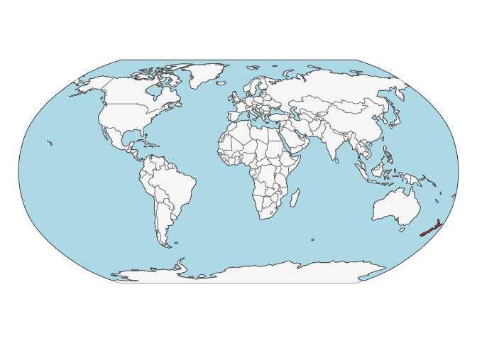
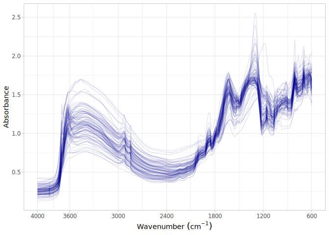

# Planted Forests from New Zealand
Jose L. Safanelli, Ran Zhi, Tomislav Hengl, Jonathan Sanderman

- [Original data](#original-data)
- [Data standardization to the OSSL
  format](#data-standardization-to-the-ossl-format)
  - [Site information](#site-information)
  - [Soil lab information (reference analytical
    data)](#soil-lab-information-reference-analytical-data)
  - [Mid-infrared spectra](#mid-infrared-spectra)
- [Quality control](#quality-control)
- [References](#references)

Code repository for standardizing and importing spectra from Planted
Forest Soils of New Zealand.

Website: [Soil Spectroscopy for Global
Good](https://soilspectroscopy.org)  
Development: <https://github.com/soilspectroscopy>  
Last update: 2026-05-19  
Additional documentation:

## Original data

Site data, soil lab data, and Mid-Infrared Spectra (MIR) from different
trials:  
- FR380 trial series: <https://doi.org/10.6084/m9.figshare.20506587>.  
- FR531 trial series: <https://doi.org/10.6084/m9.figshare.23605746>.  
- FR556 trial series: <https://doi.org/10.6084/m9.figshare.21273114>.  
- FR559 trial series: <https://doi.org/10.6084/m9.figshare.30866348>.  

Further information about the trials and sampling methodology can be
found in Garrett et al. ([2022](#ref-Garrett2022)), Simeon J. Smaill,
Garrett, & Addison ([2023](#ref-Smaill2023)), Paul, Garrett, & Smaill
([2024](#ref-Paul2024)), and Simeon J. Smaill, Matson, & Garrett
([2026](#ref-Smaill2026)).

Input datasets:  
- Excel files with trial, site, soil chemical and physical properties.  
- Zipped files with MIR spectral measurements (Opus and CSV).  

Directory/folder path with original files (not uploaded to GitHub).

``` r
dir = "~/mnt-ossl-private/database/datasets/PF_NZL/"
# tic()
```

## Data standardization to the OSSL format

### Site information

``` r
# FR380
FR380.sitedescription <- read_xlsx(path(dir, "/FR380_sitedescription.xlsx"),
                                   sheet = "FR380_site description")

FR380.chemical <- read_xlsx(path(dir, "/FR380_chemical.xlsx"),
                            sheet = "FR380_Chemical", skip = 1)

FR380.ids <- FR380.chemical %>%
  select(`Scion_Sample ID`, `Trial ID`,
         `Horizon top (cm)`, `Horizon base (cm)`,) %>%
  rename(id.sample_local_c = `Scion_Sample ID`,
         id.site_src_txt = `Trial ID`,
         layer.upper.depth_usda_cm = `Horizon top (cm)`,
         layer.lower.depth_usda_cm = `Horizon base (cm)`) %>%
  mutate(id.period_src_txt = "Time-zero",
         .before = id.sample_local_c) %>%
  mutate(id.sample_local_c = as.character(id.sample_local_c),
         id.layer_local_c = str_c(id.site_src_txt,
                                  "_",layer.upper.depth_usda_cm,
                                  "-",layer.lower.depth_usda_cm,
                                  "_",id.period_src_txt),
         .before = 1) %>%
  mutate(id.trial_src_txt = str_split_i(id.site_src_txt, "/",1),
         .after = id.layer_local_c) %>%
  filter(!is.na(id.sample_local_c)) %>%
  mutate(id.site_src_txt = gsub("\\s", "", id.site_src_txt))

FR380.sitedata <- FR380.sitedescription %>%
  select(`Trial ID`, `Latitude (°)`, `Longitude (°)`, `Date observed`,
         `Altitude (m)`,`Slope (°)`, `Aspect (°)`, `Soil type`,
         `Planted tree species prior to FR380 trial planting or pasture land use`) %>%
  rename(id.site_src_txt = `Trial ID`,
         longitude.point_wgs84_dd = `Longitude (°)`,
         latitude.point_wgs84_dd = `Latitude (°)`,
         observation.date_src_yyyy.mm.dd = `Date observed`,
         site.altitude_src_m = `Altitude (m)`,
         site.aspect_src_deg = `Aspect (°)`,
         site.slope_src_deg = `Slope (°)`,
         site.species_src_txt = `Planted tree species prior to FR380 trial planting or pasture land use`,
         layer.texture_usda_txt = `Soil type`,) %>%
  mutate(id.site_src_txt = gsub("\\s", "", id.site_src_txt)) %>%
  left_join({FR380.ids %>%
      select(-contains("LCR"))}, ., by = "id.site_src_txt") %>%
  mutate(observation.date_src_yyyy.mm.dd = lubridate::ymd(observation.date_src_yyyy.mm.dd),
         layer.upper.depth_usda_cm = as.numeric(layer.upper.depth_usda_cm),
         layer.lower.depth_usda_cm = as.numeric(layer.lower.depth_usda_cm),
         site.altitude_src_m = as.numeric(site.altitude_src_m),
         site.aspect_src_deg = as.numeric(site.aspect_src_deg),
         site.slope_src_deg = as.numeric(site.slope_src_deg)) %>%
  mutate(dataset.code_ascii_txt = 'PF_NZL',
         id.layer_uuid_txt = openssl::md5(paste0(dataset.code_ascii_txt, id.layer_local_c)),
         id.layer_uuid_txt = as.character(id.layer_uuid_txt),
         .before = 1) %>%
  filter(!is.na(id.sample_local_c))

FR380.sitedata <- FR380.sitedata %>%
  group_by(id.layer_local_c) %>%
  summarise_all(first)

# FR531
FR531.sitedescription <- read_xlsx(path(dir, "FR531_Data New Forest.xlsx"),
                                   sheet = "1_New Forest PSP details")

FR531.physical <- read_xlsx(path(dir, "FR531_Data New Forest.xlsx"),
                            sheet = "4_Time zero soil bulk density")

FR531.chemical <- read_xlsx(path(dir, "FR531_Data New Forest.xlsx"),
                            sheet = "3_Time zero soil chemistry")

FR531.sitedata <- FR531.sitedescription %>%
  select(`PSP ID`, `Trial ID`, Site,
         Altitude, Physiography, `Aspect (degrees)`, `Slope (degrees)`, `Slope shape`,
         `Species name`) %>%
  crossing(tibble(depth = c("0-10","10-20","20-30"))) %>%
  relocate(depth, .after = Site) %>%
  rename(id.layer_local_c = `PSP ID`,
         id.site_src_txt = `Trial ID`,
         id.site.name_src_txt = Site,
         site.altitude_src_m = Altitude,
         site.physiography_src_txt = Physiography,
         site.aspect_src_deg = `Aspect (degrees)`,
         site.slope_src_deg = `Slope (degrees)`,
         site.slope.shape_src_txt = `Slope shape`,
         site.species_src_txt = `Species name`) %>%
  mutate(id.period_src_txt = "Time-zero",
         .after = id.layer_local_c) %>%
  mutate(id.layer_local_c = str_c(id.layer_local_c, "_", depth, "_", id.period_src_txt)) %>%
  mutate(layer.upper.depth_usda_cm = as.numeric(str_split_i(depth, "-",1)),
         layer.lower.depth_usda_cm = as.numeric(str_split_i(depth, "-",2)),
         .before = depth) %>%
  mutate(id.trial_src_txt = str_split_i(id.site_src_txt, "/",1),
         .after = id.layer_local_c) %>%
  select(-depth) %>%
  filter(!is.na(id.layer_local_c)) %>%
  mutate(id.site_src_txt = gsub("\\s", "", id.site_src_txt))

FR531.sitedata <- FR531.physical %>%
  select(`PSP ID`, `Sampling Date`, `Depth increment (cm)`) %>%
  rename(id.layer_local_c = `PSP ID`,
         observation.date_src_yyyy.mm.dd = `Sampling Date`,
         depth = `Depth increment (cm)`) %>%
  filter(!is.na(depth)) %>%
  mutate(period = "Time-zero",
         .after = depth) %>%
  mutate(id.layer_local_c = str_c(id.layer_local_c, "_", depth, "_", period)) %>%
  select(-depth, -period) %>%
  left_join({FR531.chemical %>%
      select(`PSP ID`, `Depth increment (cm)`, `Lab ID`) %>%
      rename(id.layer_local_c = `PSP ID`,
             id.sample_local_c = `Lab ID`) %>%
      mutate(period = "Time-zero",
             .after = `Depth increment (cm)`) %>%
      mutate(id.layer_local_c = str_c(id.layer_local_c, "_", `Depth increment (cm)`, "_", period)) %>%
      select(-`Depth increment (cm)`, -period)},
      by = "id.layer_local_c") %>%
  left_join({FR531.sitedata}, ., by = "id.layer_local_c") %>%
  relocate(observation.date_src_yyyy.mm.dd, .before = site.altitude_src_m) %>%
  relocate(id.sample_local_c, .after = id.period_src_txt) %>%
  mutate(observation.date_src_yyyy.mm.dd = lubridate::ymd(observation.date_src_yyyy.mm.dd),
         layer.upper.depth_usda_cm = as.numeric(layer.upper.depth_usda_cm),
         layer.lower.depth_usda_cm = as.numeric(layer.lower.depth_usda_cm),
         site.altitude_src_m = as.numeric(site.altitude_src_m),
         site.aspect_src_deg = as.numeric(site.aspect_src_deg),
         site.slope_src_deg = as.numeric(site.slope_src_deg)) %>%
  mutate(dataset.code_ascii_txt = 'PF_NZL',
         id.layer_uuid_txt = openssl::md5(paste0(dataset.code_ascii_txt, id.layer_local_c)),
         id.layer_uuid_txt = as.character(id.layer_uuid_txt),
         .before = 1) %>%
  filter(!is.na(id.sample_local_c))

# FR556
FR556.details <- read_xlsx(path(dir, "FR556_Data Accelerator Trial.xlsx"),
                           sheet = "5_Accelerator PSP details")

FR556.ph.chemical <- read_xlsx(path(dir, "FR556_Data Accelerator Trial.xlsx"),
                               sheet = "1_Pre-harvest soil chemistry")

FR556.ph.physical <- read_xlsx(path(dir, "FR556_Data Accelerator Trial.xlsx"),
                               sheet = "2_Pre-harvest soil bulk density") # Keep 'Sum' rows

FR556.tz.chemical <- read_xlsx(path(dir, "FR556_Data Accelerator Trial.xlsx"),
                               sheet = "6_Time zero soil chemistry")

FR556.tz.physical <- read_xlsx(path(dir, "FR556_Data Accelerator Trial.xlsx"),
                               sheet = "7_Time zero soil bulk density")

FR556.sitedata <- FR556.details %>%
  select(`PSP ID`, `Trial ID`, Site, `Treatment ID`,
         `Centre Elevation (m)`,
         `Slope direction (degrees, True North); Tokoiti site magnetic N general slope direction`,
         `Average Slope (degrees)`) %>%
  crossing(tibble(period = c("Time-zero", "Pre-harvest")),
           tibble(depth = c("0-5","0-10","10-20","20-30","30-50","50-100"))) %>%
  relocate(depth, period, .after = Site) %>%
  rename(id.layer_local_c = `PSP ID`,
         id.site_src_txt = `Trial ID`,
         id.site.name_src_txt = Site,
         id.treatment_src_txt = `Treatment ID`,
         site.altitude_src_m = `Centre Elevation (m)`,
         site.aspect_src_deg = `Slope direction (degrees, True North); Tokoiti site magnetic N general slope direction`,
         site.slope_src_deg = `Average Slope (degrees)`) %>%
  mutate(id.layer_local_c = str_c(id.layer_local_c, "_", depth, "_", period),
         site.species_src_txt = "Pinus radiata") %>%
  mutate(layer.upper.depth_usda_cm = as.numeric(str_split_i(depth, "-",1)),
         layer.lower.depth_usda_cm = as.numeric(str_split_i(depth, "-",2)),
         .before = depth) %>%
  mutate(id.trial_src_txt = str_split_i(id.site_src_txt, "/",1),
         .after = id.layer_local_c) %>%
  mutate(id.period_src_txt = period,
         .after = id.layer_local_c) %>%
  select(-depth, -period) %>%
  filter(!is.na(id.layer_local_c)) %>%
  mutate(id.site_src_txt = gsub("\\s", "", id.site_src_txt))

FR556.sitedata <- FR556.sitedata %>%
  left_join(bind_rows(
    {FR556.ph.chemical %>%
        select(`PSP ID`, `Sampling Date`, `Depth increment (cm)`, `Lab ID`) %>%
        mutate(`PSP ID` = gsub("/20","/",`PSP ID`)) %>%
        rename(id.layer_local_c = `PSP ID`,
               observation.date_src_yyyy.mm.dd = `Sampling Date`,
               depth = `Depth increment (cm)`,
               id.sample_local_c = `Lab ID`) %>%
        filter(!is.na(depth)) %>%
        mutate(period = "Pre-harvest", .after = depth) %>%
        mutate(id.layer_local_c = str_c(id.layer_local_c, "_", depth, "_", period)) %>%
        mutate(observation.date_src_yyyy.mm.dd = lubridate::ymd(observation.date_src_yyyy.mm.dd)) %>%
        select(-depth, -period)},
    {FR556.tz.chemical %>%
        select(`PSP ID`, `Sampling Date`, `Depth increment (cm)`, `Lab ID`) %>%
        rename(id.layer_local_c = `PSP ID`,
               observation.date_src_yyyy.mm.dd = `Sampling Date`,
               depth = `Depth increment (cm)`,
               id.sample_local_c = `Lab ID`) %>%
        filter(!is.na(depth)) %>%
        mutate(period = "Time-zero", .after = depth) %>%
        mutate(id.layer_local_c = str_c(id.layer_local_c, "_", depth, "_", period)) %>%
        mutate(observation.date_src_yyyy.mm.dd = lubridate::ymd(observation.date_src_yyyy.mm.dd)) %>%
        select(-depth, -period)}),
    by = "id.layer_local_c") %>%
  relocate(observation.date_src_yyyy.mm.dd, .before = id.site.name_src_txt) %>%
  mutate(observation.date_src_yyyy.mm.dd = lubridate::ymd(observation.date_src_yyyy.mm.dd),
         layer.upper.depth_usda_cm = as.numeric(layer.upper.depth_usda_cm),
         layer.lower.depth_usda_cm = as.numeric(layer.lower.depth_usda_cm),
         site.altitude_src_m = as.numeric(site.altitude_src_m),
         site.aspect_src_deg = as.numeric(site.aspect_src_deg),
         site.slope_src_deg = as.numeric(site.slope_src_deg)) %>%
  relocate(id.sample_local_c, .after = id.period_src_txt) %>%
  mutate(dataset.code_ascii_txt = 'PF_NZL',
         id.layer_uuid_txt = openssl::md5(paste0(dataset.code_ascii_txt, id.layer_local_c)),
         id.layer_uuid_txt = as.character(id.layer_uuid_txt),
         .before = 1) %>%
  filter(!is.na(id.sample_local_c))

FR556.sitedata <- FR556.sitedata %>%
  group_by(id.layer_local_c) %>%
  summarise_all(first)

# FR559
FR559.details <- read_xlsx(path(dir, "FR559_Data.xlsx"),
                           sheet = "1_Trial details")

FR559.chemical <- read_xlsx(path(dir, "FR559_Data.xlsx"),
                            sheet = "2_Time zero soil chemistry")

FR559.physical <- read_xlsx(path(dir, "FR559_Data.xlsx"),
                            sheet = "3_Time zero soil bulk density")

FR559.sitedata <- FR559.details %>%
  select(`Trial ID`,
         `Elevation (m asl)`, `Aspect (degrees)`, `Slope (degrees)`) %>%
  crossing(tibble(depth = c("0-10","10-20","20-30","0-30"))) %>%
  relocate(depth, .after = `Trial ID`) %>%
  rename(id.site_src_txt = `Trial ID`,
         site.altitude_src_m = `Elevation (m asl)`,
         site.aspect_src_deg = `Aspect (degrees)`,
         site.slope_src_deg = `Slope (degrees)`) %>%
  mutate(id.period_src_txt = "Time-zero",
         site.species_src_txt = "Pinus radiata",
         .before = id.site_src_txt) %>%
  mutate(id.layer_local_c = str_c(id.site_src_txt, "_", depth, "_", id.period_src_txt),
         .before = 1) %>%
  mutate(layer.upper.depth_usda_cm = as.numeric(str_split_i(depth, "-",1)),
         layer.lower.depth_usda_cm = as.numeric(str_split_i(depth, "-",2)),
         .before = depth) %>%
  mutate(id.trial_src_txt = str_split_i(id.site_src_txt, "/",1),
         .after = id.layer_local_c) %>%
  select(-depth) %>%
  filter(!is.na(id.layer_local_c)) %>%
  mutate(id.site_src_txt = gsub("\\s", "", id.site_src_txt))

FR559.sitedata <- FR559.chemical %>%
  select(`Trial ID`, `Sampling Date`, `Depth increment (cm)`, `Lab ID`) %>%
  rename(id.layer_local_c = `Trial ID`,
         id.sample_local_c = `Lab ID`,
         observation.date_src_yyyy.mm.dd = `Sampling Date`,
         depth = `Depth increment (cm)`) %>%
  filter(!is.na(depth)) %>%
  mutate(period = "Time-zero",
         .after = depth) %>%
  mutate(id.layer_local_c = str_c(id.layer_local_c, "_", depth, "_", period), .before = 1) %>%
  select(-depth, -period) %>%
  left_join({FR559.sitedata}, ., by = "id.layer_local_c") %>%
  relocate(observation.date_src_yyyy.mm.dd, .before = site.altitude_src_m) %>%
  relocate(id.sample_local_c, .after = id.period_src_txt) %>%
  mutate(observation.date_src_yyyy.mm.dd = lubridate::ymd(observation.date_src_yyyy.mm.dd),
         layer.upper.depth_usda_cm = as.numeric(layer.upper.depth_usda_cm),
         layer.lower.depth_usda_cm = as.numeric(layer.lower.depth_usda_cm),
         site.altitude_src_m = as.numeric(site.altitude_src_m),
         site.aspect_src_deg = as.numeric(site.aspect_src_deg),
         site.slope_src_deg = as.numeric(site.slope_src_deg)) %>%
  mutate(dataset.code_ascii_txt = 'PF_NZL',
         id.layer_uuid_txt = openssl::md5(paste0(dataset.code_ascii_txt, id.layer_local_c)),
         id.layer_uuid_txt = as.character(id.layer_uuid_txt),
         .before = 1) %>%
  filter(!is.na(id.sample_local_c))

# Merging together
pfnzl.sitedata <- bind_rows(FR380.sitedata,
                            FR531.sitedata,
                            FR556.sitedata,
                            FR559.sitedata)

# Saving version to dataset root dir
site.exp.file = path(dir, "ossl_soilsite_v1.3")
readr::write_csv(pfnzl.sitedata, str_c(site.exp.file, ".csv.gz"))
nanoparquet::write_parquet(pfnzl.sitedata, str_c(site.exp.file, ".parquet"))
```

Plotting map:

``` r
data("World")

ocean <- ne_download(scale = 110, type = "ocean", category = "physical", returnclass = "sf")
```

    Reading 'ne_110m_ocean.zip' from naturalearth...

``` r
new_zealand <- World[World$name == "New Zealand", ]

tmap_mode("plot")
```

    ℹ tmap modes "plot" - "view"
    ℹ toggle with `tmap::ttm()`

``` r
tm_shape(ocean) +
  tm_polygons(fill = "lightblue", col = NA) +
  tm_shape(World) +
  tm_polygons(fill = "#f0f0f0", fill_alpha = 0.5, col_alpha = 0.5) +
  tm_shape(new_zealand) +
  tm_polygons(fill = "firebrick") +
  tm_crs("ESRI:54030") +
  tm_layout(frame = FALSE)
```

    [tip] Consider a suitable map projection, e.g. by adding `+ tm_crs("auto")`.
    This message is displayed once per session.



### Soil lab information (reference analytical data)

NOTE: The code chunk below must be run just once for getting a template
for scripted column standardization. Just run once for getting the
original names of soil properties, descriptions, data types, and units.
Then upload to Google Sheet for editing and manually defining the rules
for integrating with the OSSL. Requires Google authentication. A copy of
the output file is saved to this folder for archiving purposes.

**Always leave the sheet name as TEMP to avoid overwritting, then rename
online to download locally.**

``` r
# FR380
FR380.chemical.dic <- read_xlsx(path(dir, "/FR380_chemical.xlsx"),
                                sheet = "Data dictionary")

FR380.physical.dic <- read_xlsx(path(dir, "/FR380_physical.xlsx"),
                                sheet = "Data dictionary")

FR380.particlesize.dic <- read_xlsx(path(dir, "/FR380_particlesize.xlsx"),
                                sheet = "Data dictionary")

FR380.soillab.names <- FR380.particlesize.dic %>%
  mutate(table = "FR380_particlesize",
         import = "",
         ossl_abbrev = "",
         ossl_method = "",
         ossl_unit = "",
         ossl_convert = "",
         ossl_name = "",
         .before = 1) %>%
  rename(original_name = `Field name`,
         original_description = `Field name description`,
         comment1 = `Specific test method`,
         comment2 = `Relevant reference`) %>%
  mutate(comment = paste0(comment1, "; ", comment2)) %>%
  select(table, original_name, import,
         ossl_abbrev,ossl_method,ossl_unit,ossl_convert,ossl_name,
         comment, original_description) %>%
  bind_rows({
    FR380.physical.dic %>%
      mutate(table = "FR380_physical",
             import = "",
             ossl_abbrev = "",
             ossl_method = "",
             ossl_unit = "",
             ossl_convert = "",
             ossl_name = "",
             .before = 1) %>%
      rename(original_name = `Field name`,
             original_description = `Field name description`,
             comment1 = `Specific test method`,
             comment2 = `Relevant reference`) %>%
      mutate(comment = paste0(comment1, "; ", comment2)) %>%
      select(table, original_name, import,
             ossl_abbrev,ossl_method,ossl_unit,ossl_convert,ossl_name,
             comment, original_description)
  }) %>%
  bind_rows({
    FR380.chemical.dic %>%
      mutate(table = "FR380_chemical",
             import = "",
             ossl_abbrev = "",
             ossl_method = "",
             ossl_unit = "",
             ossl_convert = "",
             ossl_name = "",
             .before = 1) %>%
      rename(original_name = `Field name`,
             original_description = `Field name description`,
             comment1 = `Specific chemical test method`, comment2 = `Relevant reference`) %>%
      mutate(comment = paste0(comment1, "; ", comment2)) %>%
      select(table, original_name, import,
             ossl_abbrev,ossl_method,ossl_unit,ossl_convert,ossl_name,
             comment, original_description)
  })

# FR531
FR531.physical.dic <- read_xlsx(path(dir, "FR531_Data New Forest.xlsx"),
                                sheet = "4_Time zero soil bulk density",
                                n_max = 1) %>%
  mutate(across(everything(), as.character)) %>%
  pivot_longer(everything()) %>%
  select(-value) %>%
  rename(original_name = name) %>%
  mutate(table = "FR531::4_Time zero soil bulk density", .before = 1) %>%
  mutate(import = "",
         ossl_abbrev = "",
         ossl_method = "",
         ossl_unit = "",
         ossl_convert = "",
         ossl_name = "",
         comment = "",
         original_description = "") %>%
  select(table, original_name, import,
         ossl_abbrev,ossl_method,ossl_unit,ossl_convert,ossl_name,
         comment, original_description)
  
FR531.chemical.dic <- read_xlsx(path(dir, "FR531_Data New Forest.xlsx"),
                                sheet = "3_Time zero soil chemistry",
                                n_max = 1) %>%
  mutate(across(everything(), as.character)) %>%
  pivot_longer(everything()) %>%
  select(-value) %>%
  rename(original_name = name) %>%
  mutate(table = "FR531::3_Time zero soil chemistry", .before = 1) %>%
  mutate(import = "",
         ossl_abbrev = "",
         ossl_method = "",
         ossl_unit = "",
         ossl_convert = "",
         ossl_name = "",
         comment = "",
         original_description = "") %>%
  select(table, original_name, import,
         ossl_abbrev,ossl_method,ossl_unit,ossl_convert,ossl_name,
         comment, original_description)

FR531.soillab.names <- bind_rows(FR531.physical.dic,
                                 FR531.chemical.dic)

# FR556
FR556.ph.chemical.dic <- read_xlsx(path(dir, "FR556_Data Accelerator Trial.xlsx"),
                                   sheet = "1_Pre-harvest soil chemistry",
                                   n_max = 1) %>%
  mutate(across(everything(), as.character)) %>%
  pivot_longer(everything()) %>%
  select(-value) %>%
  rename(original_name = name) %>%
  mutate(table = "FR556::1_Pre-harvest soil chemistry", .before = 1) %>%
  mutate(import = "",
         ossl_abbrev = "",
         ossl_method = "",
         ossl_unit = "",
         ossl_convert = "",
         ossl_name = "",
         comment = "",
         original_description = "") %>%
  select(table, original_name, import,
         ossl_abbrev,ossl_method,ossl_unit,ossl_convert,ossl_name,
         comment, original_description)

FR556.ph.physical.dic <- read_xlsx(path(dir, "FR556_Data Accelerator Trial.xlsx"),
                                   sheet = "2_Pre-harvest soil bulk density",
                                   n_max = 1) %>%
  mutate(across(everything(), as.character)) %>%
  pivot_longer(everything()) %>%
  select(-value) %>%
  rename(original_name = name) %>%
  mutate(table = "FR556::2_Pre-harvest soil bulk density", .before = 1) %>%
  mutate(import = "",
         ossl_abbrev = "",
         ossl_method = "",
         ossl_unit = "",
         ossl_convert = "",
         ossl_name = "",
         comment = "",
         original_description = "") %>%
  select(table, original_name, import,
         ossl_abbrev,ossl_method,ossl_unit,ossl_convert,ossl_name,
         comment, original_description)

FR556.tz.chemical.dic <- read_xlsx(path(dir, "FR556_Data Accelerator Trial.xlsx"),
                                   sheet = "6_Time zero soil chemistry",
                                   n_max = 1) %>%
  mutate(across(everything(), as.character)) %>%
  pivot_longer(everything()) %>%
  select(-value) %>%
  rename(original_name = name) %>%
  mutate(table = "FR556::6_Time zero soil chemistry", .before = 1) %>%
  mutate(import = "",
         ossl_abbrev = "",
         ossl_method = "",
         ossl_unit = "",
         ossl_convert = "",
         ossl_name = "",
         comment = "",
         original_description = "") %>%
  select(table, original_name, import,
         ossl_abbrev,ossl_method,ossl_unit,ossl_convert,ossl_name,
         comment, original_description)

FR556.tz.physical.dic <- read_xlsx(path(dir, "FR556_Data Accelerator Trial.xlsx"),
                                   sheet = "7_Time zero soil bulk density",
                                   n_max = 1) %>%
  mutate(across(everything(), as.character)) %>%
  pivot_longer(everything()) %>%
  select(-value) %>%
  rename(original_name = name) %>%
  mutate(table = "FR556::7_Time zero soil bulk density", .before = 1) %>%
  mutate(import = "",
         ossl_abbrev = "",
         ossl_method = "",
         ossl_unit = "",
         ossl_convert = "",
         ossl_name = "",
         comment = "",
         original_description = "") %>%
  select(table, original_name, import,
         ossl_abbrev,ossl_method,ossl_unit,ossl_convert,ossl_name,
         comment, original_description)

FR556.soillab.names <- bind_rows(FR556.ph.chemical.dic,
                                 FR556.ph.physical.dic,
                                 FR556.tz.chemical.dic,
                                 FR556.tz.physical.dic)

# FR559
FR559.chemical.dic <- read_xlsx(path(dir, "FR559_Data.xlsx"),
                            sheet = "2_Time zero soil chemistry",
                            n_max = 1) %>%
  mutate(across(everything(), as.character)) %>%
  pivot_longer(everything()) %>%
  select(-value) %>%
  rename(original_name = name) %>%
  mutate(table = "FR559::2_Time zero soil chemistry", .before = 1) %>%
  mutate(import = "",
         ossl_abbrev = "",
         ossl_method = "",
         ossl_unit = "",
         ossl_convert = "",
         ossl_name = "",
         comment = "",
         original_description = "") %>%
  select(table, original_name, import,
         ossl_abbrev,ossl_method,ossl_unit,ossl_convert,ossl_name,
         comment, original_description)

FR559.physical.dic <- read_xlsx(path(dir, "FR559_Data.xlsx"),
                            sheet = "3_Time zero soil bulk density",
                            n_max = 1) %>%
  mutate(across(everything(), as.character)) %>%
  pivot_longer(everything()) %>%
  select(-value) %>%
  rename(original_name = name) %>%
  mutate(table = "FR559::3_Time zero soil bulk density", .before = 1) %>%
  mutate(import = "",
         ossl_abbrev = "",
         ossl_method = "",
         ossl_unit = "",
         ossl_convert = "",
         ossl_name = "",
         comment = "",
         original_description = "") %>%
  select(table, original_name, import,
         ossl_abbrev,ossl_method,ossl_unit,ossl_convert,ossl_name,
         comment, original_description)

FR559.soillab.names <- bind_rows(FR559.chemical.dic,
                                 FR559.physical.dic)

# Merge
pfnzl.soillab.names <- bind_rows(FR380.soillab.names, FR531.soillab.names,
                                 FR556.soillab.names, FR559.soillab.names)


write_csv(pfnzl.soillab.names, path(getwd(), "/soillab_original_names.csv"))

# Uploading to google sheet

# Drive 'Open Soil Spectral Library'
# Folder 'Database v2'
googledrive::drive_ls(as_id("1l9VM4fFks2xBloDE69EFTfPgQeFx5aGw"))

# Use the ID of the file 'OSSL_v2_tab2_soildata_importing'
OSSL.soildata.importing <- "1mWTDJDuMp4oObcCxAy9gofSkrkcSWWf1TtEW2SuC1es"

# Checking metadata
googlesheets4::as_sheets_id(OSSL.soildata.importing)

# Checking readme
googlesheets4::read_sheet(OSSL.soildata.importing, sheet = 'readme')

# Preparing pfnzl.soillab.names for this dataset
upload <- dplyr::as_tibble(pfnzl.soillab.names)

# Uploading with TEMP name. Check online, move to sequence, and update name
googlesheets4::write_sheet(upload, ss = OSSL.soildata.importing, sheet = "TEMP")

# Checking metadata
googlesheets4::as_sheets_id(OSSL.soildata.importing)
```

NOTE: The code chunk below must be run just once. Run for getting the
column standardization rules after editing online on Google Sheets. A
copy of the edited standardization template is saved to this dataset
folder.

``` r
# Downloading from google sheet

# Checking metadata
googlesheets4::as_sheets_id("1mWTDJDuMp4oObcCxAy9gofSkrkcSWWf1TtEW2SuC1es")
```


    ── <googlesheets4_spreadsheet> ─────────────────────────────────────────────────
    Spreadsheet name: "OSSL_v2_tab2_soildata_importing"           
                  ID: 1mWTDJDuMp4oObcCxAy9gofSkrkcSWWf1TtEW2SuC1es
              Locale: en_US                                       
           Time zone: America/New_York                            
         # of sheets: 21                                          

    ── <sheets> ────────────────────────────────────────────────────────────────────
     (Sheet name): (Nominal extent in rows x columns)
         'readme': 1003 x 27
           'KSSL': 52 x 11
    'ICRAF_ISRIC': 65 x 9
          'LUCAS': 42 x 9
         'AFSIS1': 42 x 9
         'AFSIS2': 18 x 9
            'CAF': 20 x 10
           'NEON': 94 x 10
        'HLF_CAN': 31 x 8
         'PF_NZL': 377 x 10
            'SRB': 17 x 9
     'Neospectra': 26 x 9
           'BESB': 10 x 10
          'HSDOS': 10 x 11
            'AUT': 15 x 11
          'GEMAS': 15 x 11
      'Geocradle': 20 x 11
            'MTQ': 15 x 11
         'LF_BRA': 11 x 11
          'GPKOR': 3 x 11
       'WS_SWIND': 22 x 11

``` r
# Preparing soillab.names
transvalues <- googlesheets4::read_sheet("1mWTDJDuMp4oObcCxAy9gofSkrkcSWWf1TtEW2SuC1es",
                                         sheet = "PF_NZL")
```

    ✔ Reading from "OSSL_v2_tab2_soildata_importing".

    ✔ Range ''PF_NZL''.

``` r
# Saving to folder
write_csv(transvalues, path(getwd(), "soillab_standardized_names.csv"))
```

Reading standardization rules:

``` r
transvalues <- read_csv(path(getwd(), "soillab_standardized_names.csv"),
                        show_col_types = F) %>%
  filter(import == TRUE) %>%
  select(contains(c("table", "id", "original_name", "ossl_")))

knitr::kable(transvalues)
```

| table | original_name | ossl_abbrev | ossl_method | ossl_unit | ossl_convert | ossl_name |
|:---|:---|:---|:---|:---|:---|:---|
| FR380_particlesize | Sand (%) | clay.tot | usda.a334 | w.pct | ifelse(as.numeric(x) \< 0, NA, as.numeric(x)\*1) | clay.tot_usda.a334_w.pct |
| FR380_particlesize | Silt (%) | sand.tot | usda.c60 | w.pct | ifelse(as.numeric(x) \< 0, NA, as.numeric(x)\*1) | sand.tot_usda.c60_w.pct |
| FR380_particlesize | Clay (%) | silt.tot | usda.c62 | w.pct | ifelse(as.numeric(x) \< 0, NA, as.numeric(x)\*1) | silt.tot_usda.c62_w.pct |
| FR380_physical | Bulk density (g/cm3) | bd | usda.a4 | g.cm3 | ifelse(as.numeric(x) \< 0, NA, as.numeric(x)\*1) | bd_usda.a4_g.cm3 |
| FR380_physical | Water content at 10 kPa (%w/w) | wr.10kPa | usda.a414 | w.pct | ifelse(as.numeric(x) \< 0, NA, as.numeric(x)\*1) | wr.10kPa_usda.a414_w.pct |
| FR380_physical | Water content at 1500 kPa (%w/w) | wr.1500kPa | usda.a417 | w.pct | ifelse(as.numeric(x) \< 0, NA, as.numeric(x)\*1) | wr.1500kPa_usda.a417_w.pct |
| FR380_chemical | LCR_Total Carbon (%) | c.tot | usda.a622 | w.pct | ifelse(as.numeric(x) \< 0, NA, as.numeric(x)\*1) | c.tot_usda.a622_w.pct |
| FR380_chemical | LCR_Total Nitrogen (%) | n.tot | usda.a623 | w.pct | ifelse(as.numeric(x) \< 0, NA, as.numeric(x)\*1) | n.tot_usda.a623_w.pct |
| FR380_chemical | LCR_P Olsen Available (ug/g) | p.ext | usda.a274 | mg.kg | ifelse(as.numeric(x) \< 0, NA, as.numeric(x)\*1) | p.ext_usda.a274_mg.kg |
| FR380_chemical | LCR_P Bray Available (ug/g) | p.ext | usda.a270 | mg.kg | ifelse(as.numeric(x) \< 0, NA, as.numeric(x)\*1) | p.ext_usda.a270_mg.kg |
| FR380_chemical | LCR_CEC (me.%) | cec | usda.a723 | cmolc.kg | ifelse(as.numeric(x) \< 0, NA, as.numeric(x)\*1) | cec_usda.a723_cmolc.kg |
| FR380_chemical | LCR_Exchange Ca (me.%) | ca.ext | usda.a722 | cmolc.kg | ifelse(as.numeric(x) \< 0, NA, as.numeric(x)\*1) | ca.ext_usda.a722_cmolc.kg |
| FR380_chemical | LCR_Exchange Mg (me.%) | mg.ext | usda.a724 | cmolc.kg | ifelse(as.numeric(x) \< 0, NA, as.numeric(x)\*1) | mg.ext_usda.a724_cmolc.kg |
| FR380_chemical | LCR_Exchange K (me.%) | k.ext | usda.a725 | cmolc.kg | ifelse(as.numeric(x) \< 0, NA, as.numeric(x)\*1) | k.ext_usda.a725_cmolc.kg |
| FR380_chemical | LCR_Exchange Na (me.%) | na.ext | usda.a726 | cmolc.kg | ifelse(as.numeric(x) \< 0, NA, as.numeric(x)\*1) | na.ext_usda.a726_cmolc.kg |
| FR380_chemical | Scion_pH \[H2O\] | ph.h2o | usda.a268 | index | ifelse(as.numeric(x) \< 0, NA, as.numeric(x)\*1) | ph.h2o_usda.a268_index |
| FR380_chemical | Scion_Mehlich 3 B (mg/kg) | b.ext | mel3 | mg.kg | ifelse(as.numeric(x) \< 0, NA, as.numeric(x)\*1) | b.ext_mel3_mg.kg |
| FR380_chemical | Scion_Mehlich 3 Al (mg/kg) | al.ext | usda.a1056 | mg.kg | ifelse(as.numeric(x) \< 0, NA, as.numeric(x)\*1) | al.ext_usda.a1056_mg.kg |
| FR380_chemical | Scion_Mehlich 3 Na (mg/kg) | na.ext | usda.a1068 | mg.kg | ifelse(as.numeric(x) \< 0, NA, as.numeric(x)\*1) | na.ext_usda.a1068_mg.kg |
| FR380_chemical | Scion_Mehlich 3 Mg (mg/kg) | mg.ext | usda.a1066 | mg.kg | ifelse(as.numeric(x) \< 0, NA, as.numeric(x)\*1) | mg.ext_usda.a1066_mg.kg |
| FR380_chemical | Scion_Mehlich 3 P (mg/kg) | p.ext | usda.a652 | mg.kg | ifelse(as.numeric(x) \< 0, NA, as.numeric(x)\*1) | p.ext_usda.a652_mg.kg |
| FR380_chemical | Scion_Mehlich 3 K (mg/kg) | k.ext | usda.a1065 | mg.kg | ifelse(as.numeric(x) \< 0, NA, as.numeric(x)\*1) | k.ext_usda.a1065_mg.kg |
| FR380_chemical | Scion_Mehlich 3 Ca (mg/kg) | ca.ext | usda.a1059 | mg.kg | ifelse(as.numeric(x) \< 0, NA, as.numeric(x)\*1) | ca.ext_usda.a1059_mg.kg |
| FR380_chemical | Scion_Mehlich 3 Mn (mg/kg) | mn.ext | usda.a1067 | mg.kg | ifelse(as.numeric(x) \< 0, NA, as.numeric(x)\*1) | mn.ext_usda.a1067_mg.kg |
| FR380_chemical | Scion_Mehlich 3 Fe (mg/kg) | fe.ext | usda.a1064 | mg.kg | ifelse(as.numeric(x) \< 0, NA, as.numeric(x)\*1) | fe.ext_usda.a1064_mg.kg |
| FR380_chemical | Scion_Mehlich 3 Cu (mg/kg) | cu.ext | usda.a1063 | mg.kg | ifelse(as.numeric(x) \< 0, NA, as.numeric(x)\*1) | cu.ext_usda.a1063_mg.kg |
| FR380_chemical | Scion_Mehlich 3 Zn (mg/kg) | zn.ext | usda.a1073 | mg.kg | ifelse(as.numeric(x) \< 0, NA, as.numeric(x)\*1) | zn.ext_usda.a1073_mg.kg |
| FR531::4_Time zero soil bulk density | Bulk density (\<2 mm) (g/cm3) | bd | usda.a4 | g.cm3 | ifelse(as.numeric(x) \< 0, NA, as.numeric(x)\*1) | bd_usda.a4_g.cm3 |
| FR531::3_Time zero soil chemistry | Total C (%) | c.tot | usda.a622 | w.pct | ifelse(as.numeric(x) \< 0, NA, as.numeric(x)\*1) | c.tot_usda.a622_w.pct |
| FR531::3_Time zero soil chemistry | Total N (%) | n.tot | usda.a623 | w.pct | ifelse(as.numeric(x) \< 0, NA, as.numeric(x)\*1) | n.tot_usda.a623_w.pct |
| FR556::1_Pre-harvest soil chemistry | pH | ph.h2o | usda.a268 | index | ifelse(as.numeric(x) \< 0, NA, as.numeric(x)\*1) | ph.h2o_usda.a268_index |
| FR556::1_Pre-harvest soil chemistry | Total C (%) | c.tot | usda.a622 | w.pct | ifelse(as.numeric(x) \< 0, NA, as.numeric(x)\*1) | c.tot_usda.a622_w.pct |
| FR556::1_Pre-harvest soil chemistry | Total N (%) | n.tot | usda.a623 | w.pct | ifelse(as.numeric(x) \< 0, NA, as.numeric(x)\*1) | n.tot_usda.a623_w.pct |
| FR556::1_Pre-harvest soil chemistry | Ex. Ca (cmol/kg) | ca.ext | usda.a722 | cmolc.kg | ifelse(as.numeric(x) \< 0, NA, as.numeric(x)\*1) | ca.ext_usda.a722_cmolc.kg |
| FR556::1_Pre-harvest soil chemistry | Ex. Mg (cmol/kg) | mg.ext | usda.a724 | cmolc.kg | ifelse(as.numeric(x) \< 0, NA, as.numeric(x)\*1) | mg.ext_usda.a724_cmolc.kg |
| FR556::1_Pre-harvest soil chemistry | Ex. K (cmol/kg) | k.ext | usda.a725 | cmolc.kg | ifelse(as.numeric(x) \< 0, NA, as.numeric(x)\*1) | k.ext_usda.a725_cmolc.kg |
| FR556::1_Pre-harvest soil chemistry | Ex. Na (cmol/kg) | na.ext | usda.a726 | cmolc.kg | ifelse(as.numeric(x) \< 0, NA, as.numeric(x)\*1) | na.ext_usda.a726_cmolc.kg |
| FR556::1_Pre-harvest soil chemistry | CEC (cmol/kg) | cec | usda.a723 | cmolc.kg | ifelse(as.numeric(x) \< 0, NA, as.numeric(x)\*1) | cec_usda.a723_cmolc.kg |
| FR556::1_Pre-harvest soil chemistry | Mehlich 3 Al (mg/kg) | al.ext | usda.a1056 | mg.kg | ifelse(as.numeric(x) \< 0, NA, as.numeric(x)\*1) | al.ext_usda.a1056_mg.kg |
| FR556::1_Pre-harvest soil chemistry | Mehlich 3 B (mg/kg) | b.ext | mel3 | mg.kg | ifelse(as.numeric(x) \< 0, NA, as.numeric(x)\*1) | b.ext_mel3_mg.kg |
| FR556::1_Pre-harvest soil chemistry | Mehlich 3 Ca (mg/kg) | ca.ext | usda.a1059 | mg.kg | ifelse(as.numeric(x) \< 0, NA, as.numeric(x)\*1) | ca.ext_usda.a1059_mg.kg |
| FR556::1_Pre-harvest soil chemistry | Mehlich 3 Cu (mg/kg) | cu.ext | usda.a1063 | mg.kg | ifelse(as.numeric(x) \< 0, NA, as.numeric(x)\*1) | cu.ext_usda.a1063_mg.kg |
| FR556::1_Pre-harvest soil chemistry | Mehlich 3 Fe (mg/kg) | fe.ext | usda.a1064 | mg.kg | ifelse(as.numeric(x) \< 0, NA, as.numeric(x)\*1) | fe.ext_usda.a1064_mg.kg |
| FR556::1_Pre-harvest soil chemistry | Mehlich 3 K (mg/kg) | k.ext | usda.a1065 | mg.kg | ifelse(as.numeric(x) \< 0, NA, as.numeric(x)\*1) | k.ext_usda.a1065_mg.kg |
| FR556::1_Pre-harvest soil chemistry | Mehlich 3 Mg (mg/kg) | mg.ext | usda.a1066 | mg.kg | ifelse(as.numeric(x) \< 0, NA, as.numeric(x)\*1) | mg.ext_usda.a1066_mg.kg |
| FR556::1_Pre-harvest soil chemistry | Mehlich 3 Mn (mg/kg) | mn.ext | usda.a1067 | mg.kg | ifelse(as.numeric(x) \< 0, NA, as.numeric(x)\*1) | mn.ext_usda.a1067_mg.kg |
| FR556::1_Pre-harvest soil chemistry | Mehlich 3 Na (mg/kg) | na.ext | usda.a1068 | mg.kg | ifelse(as.numeric(x) \< 0, NA, as.numeric(x)\*1) | na.ext_usda.a1068_mg.kg |
| FR556::1_Pre-harvest soil chemistry | Mehlich 3 P (mg/kg) | p.ext | usda.a652 | mg.kg | ifelse(as.numeric(x) \< 0, NA, as.numeric(x)\*1) | p.ext_usda.a652_mg.kg |
| FR556::1_Pre-harvest soil chemistry | Mehlich 3 Zn (mg/kg) | zn.ext | usda.a1073 | mg.kg | ifelse(as.numeric(x) \< 0, NA, as.numeric(x)\*1) | zn.ext_usda.a1073_mg.kg |
| FR556::2_Pre-harvest soil bulk density | Bulk density (\<2 mm) (g/cm3) | bd | usda.a4 | g.cm3 | ifelse(as.numeric(x) \< 0, NA, as.numeric(x)\*1) | bd_usda.a4_g.cm3 |
| FR556::6_Time zero soil chemistry | pH | ph.h2o | usda.a268 | index | ifelse(as.numeric(x) \< 0, NA, as.numeric(x)\*1) | ph.h2o_usda.a268_index |
| FR556::6_Time zero soil chemistry | Total C (%) | c.tot | usda.a622 | w.pct | ifelse(as.numeric(x) \< 0, NA, as.numeric(x)\*1) | c.tot_usda.a622_w.pct |
| FR556::6_Time zero soil chemistry | Total N (%) | n.tot | usda.a623 | w.pct | ifelse(as.numeric(x) \< 0, NA, as.numeric(x)\*1) | n.tot_usda.a623_w.pct |
| FR556::6_Time zero soil chemistry | Ex. Ca (cmol/kg) | ca.ext | usda.a722 | cmolc.kg | ifelse(as.numeric(x) \< 0, NA, as.numeric(x)\*1) | ca.ext_usda.a722_cmolc.kg |
| FR556::6_Time zero soil chemistry | Ex. Mg (cmol/kg) | mg.ext | usda.a724 | cmolc.kg | ifelse(as.numeric(x) \< 0, NA, as.numeric(x)\*1) | mg.ext_usda.a724_cmolc.kg |
| FR556::6_Time zero soil chemistry | Ex. K (cmol/kg) | k.ext | usda.a725 | cmolc.kg | ifelse(as.numeric(x) \< 0, NA, as.numeric(x)\*1) | k.ext_usda.a725_cmolc.kg |
| FR556::6_Time zero soil chemistry | Ex. Na (cmol/kg) | na.ext | usda.a726 | cmolc.kg | ifelse(as.numeric(x) \< 0, NA, as.numeric(x)\*1) | na.ext_usda.a726_cmolc.kg |
| FR556::6_Time zero soil chemistry | CEC (cmol/kg) | cec | usda.a723 | cmolc.kg | ifelse(as.numeric(x) \< 0, NA, as.numeric(x)\*1) | cec_usda.a723_cmolc.kg |
| FR556::6_Time zero soil chemistry | Mehlich 3 Al (mg/kg) | al.ext | usda.a1056 | mg.kg | ifelse(as.numeric(x) \< 0, NA, as.numeric(x)\*1) | al.ext_usda.a1056_mg.kg |
| FR556::6_Time zero soil chemistry | Mehlich 3 B (mg/kg) | b.ext | mel3 | mg.kg | ifelse(as.numeric(x) \< 0, NA, as.numeric(x)\*1) | b.ext_mel3_mg.kg |
| FR556::6_Time zero soil chemistry | Mehlich 3 Ca (mg/kg) | ca.ext | usda.a1059 | mg.kg | ifelse(as.numeric(x) \< 0, NA, as.numeric(x)\*1) | ca.ext_usda.a1059_mg.kg |
| FR556::6_Time zero soil chemistry | Mehlich 3 Cu (mg/kg) | cu.ext | usda.a1063 | mg.kg | ifelse(as.numeric(x) \< 0, NA, as.numeric(x)\*1) | cu.ext_usda.a1063_mg.kg |
| FR556::6_Time zero soil chemistry | Mehlich 3 Fe (mg/kg) | fe.ext | usda.a1064 | mg.kg | ifelse(as.numeric(x) \< 0, NA, as.numeric(x)\*1) | fe.ext_usda.a1064_mg.kg |
| FR556::6_Time zero soil chemistry | Mehlich 3 K (mg/kg) | k.ext | usda.a1065 | mg.kg | ifelse(as.numeric(x) \< 0, NA, as.numeric(x)\*1) | k.ext_usda.a1065_mg.kg |
| FR556::6_Time zero soil chemistry | Mehlich 3 Mg (mg/kg) | mg.ext | usda.a1066 | mg.kg | ifelse(as.numeric(x) \< 0, NA, as.numeric(x)\*1) | mg.ext_usda.a1066_mg.kg |
| FR556::6_Time zero soil chemistry | Mehlich 3 Mn (mg/kg) | mn.ext | usda.a1067 | mg.kg | ifelse(as.numeric(x) \< 0, NA, as.numeric(x)\*1) | mn.ext_usda.a1067_mg.kg |
| FR556::6_Time zero soil chemistry | Mehlich 3 Na (mg/kg) | na.ext | usda.a1068 | mg.kg | ifelse(as.numeric(x) \< 0, NA, as.numeric(x)\*1) | na.ext_usda.a1068_mg.kg |
| FR556::6_Time zero soil chemistry | Mehlich 3 P (mg/kg) | p.ext | usda.a652 | mg.kg | ifelse(as.numeric(x) \< 0, NA, as.numeric(x)\*1) | p.ext_usda.a652_mg.kg |
| FR556::6_Time zero soil chemistry | Mehlich 3 Zn (mg/kg) | zn.ext | usda.a1073 | mg.kg | ifelse(as.numeric(x) \< 0, NA, as.numeric(x)\*1) | zn.ext_usda.a1073_mg.kg |
| FR556::7_Time zero soil bulk density | Bulk density (\<2 mm) (g/cm3) | bd | usda.a4 | g.cm3 | ifelse(as.numeric(x) \< 0, NA, as.numeric(x)\*1) | bd_usda.a4_g.cm3 |
| FR559::2_Time zero soil chemistry | pH | ph.h2o | usda.a268 | index | ifelse(as.numeric(x) \< 0, NA, as.numeric(x)\*1) | ph.h2o_usda.a268_index |
| FR559::2_Time zero soil chemistry | Total C (%) | c.tot | usda.a622 | w.pct | ifelse(as.numeric(x) \< 0, NA, as.numeric(x)\*1) | c.tot_usda.a622_w.pct |
| FR559::2_Time zero soil chemistry | Total N (%) | n.tot | usda.a623 | w.pct | ifelse(as.numeric(x) \< 0, NA, as.numeric(x)\*1) | n.tot_usda.a623_w.pct |
| FR559::2_Time zero soil chemistry | Mehlich 3 B (mg/kg) | b.ext | mel3 | mg.kg | ifelse(as.numeric(x) \< 0, NA, as.numeric(x)\*1) | b.ext_mel3_mg.kg |
| FR559::2_Time zero soil chemistry | Mehlich 3 Al (mg/kg) | al.ext | usda.a1056 | mg.kg | ifelse(as.numeric(x) \< 0, NA, as.numeric(x)\*1) | al.ext_usda.a1056_mg.kg |
| FR559::2_Time zero soil chemistry | Mehlich 3 Na (mg/kg) | na.ext | usda.a1068 | mg.kg | ifelse(as.numeric(x) \< 0, NA, as.numeric(x)\*1) | na.ext_usda.a1068_mg.kg |
| FR559::2_Time zero soil chemistry | Mehlich 3 Mg (mg/kg) | mg.ext | usda.a1066 | mg.kg | ifelse(as.numeric(x) \< 0, NA, as.numeric(x)\*1) | mg.ext_usda.a1066_mg.kg |
| FR559::2_Time zero soil chemistry | Mehlich 3 P (mg/kg) | p.ext | usda.a652 | mg.kg | ifelse(as.numeric(x) \< 0, NA, as.numeric(x)\*1) | p.ext_usda.a652_mg.kg |
| FR559::2_Time zero soil chemistry | Mehlich 3 K (mg/kg) | k.ext | usda.a1065 | mg.kg | ifelse(as.numeric(x) \< 0, NA, as.numeric(x)\*1) | k.ext_usda.a1065_mg.kg |
| FR559::2_Time zero soil chemistry | Mehlich 3 Ca (mg/kg) | ca.ext | usda.a1059 | mg.kg | ifelse(as.numeric(x) \< 0, NA, as.numeric(x)\*1) | ca.ext_usda.a1059_mg.kg |
| FR559::2_Time zero soil chemistry | Mehlich 3 Mn (mg/kg) | mn.ext | usda.a1067 | mg.kg | ifelse(as.numeric(x) \< 0, NA, as.numeric(x)\*1) | mn.ext_usda.a1067_mg.kg |
| FR559::2_Time zero soil chemistry | Mehlich 3 Fe (mg/kg) | fe.ext | usda.a1064 | mg.kg | ifelse(as.numeric(x) \< 0, NA, as.numeric(x)\*1) | fe.ext_usda.a1064_mg.kg |
| FR559::2_Time zero soil chemistry | Mehlich 3 Cu (mg/kg) | cu.ext | usda.a1063 | mg.kg | ifelse(as.numeric(x) \< 0, NA, as.numeric(x)\*1) | cu.ext_usda.a1063_mg.kg |
| FR559::2_Time zero soil chemistry | Mehlich 3 Zn (mg/kg) | zn.ext | usda.a1073 | mg.kg | ifelse(as.numeric(x) \< 0, NA, as.numeric(x)\*1) | zn.ext_usda.a1073_mg.kg |
| FR559::3_Time zero soil bulk density | Bulk density (\<2 mm) (g/cm3) | bd | usda.a4 | g.cm3 | ifelse(as.numeric(x) \< 0, NA, as.numeric(x)\*1) | bd_usda.a4_g.cm3 |

Standardizing soil data to the OSSL format:

``` r
# FR380
FR380.chemical <- read_xlsx(path(dir, "FR380_chemical.xlsx"),
                            sheet = "FR380_Chemical", skip = 1)

FR380.physical <- read_xlsx(path(dir, "FR380_physical.xlsx"),
                            sheet = "FR380_Physical")

FR380.particlesize <- read_xlsx(paste0(dir, "FR380_particlesize.xlsx"),
                                sheet = "FR380_Particle size", skip = 0)

FR380.old.names.chemical <- transvalues %>%
  filter(table == "FR380_chemical") %>%
  pull(original_name)

FR380.new.names.chemical <- transvalues %>%
  filter(table == "FR380_chemical") %>%
  pull(ossl_name)

FR380.soil.chemical <- FR380.chemical %>%
  rename(id.sample_local_c = `Scion_Sample ID`) %>%
  mutate(id.sample_local_c = as.character(id.sample_local_c)) %>%
  select(id.sample_local_c,
         all_of(FR380.old.names.chemical)) %>%
  rename_with(~FR380.new.names.chemical,
              all_of(FR380.old.names.chemical)) %>%
  mutate(across(all_of(FR380.new.names.chemical), as.numeric)) %>%
  filter(!is.na(id.sample_local_c))

FR380.old.names.psd <- transvalues %>%
  filter(table == "FR380_particlesize") %>%
  pull(original_name)

FR380.new.names.psd <- transvalues %>%
  filter(table == "FR380_particlesize") %>%
  pull(ossl_name)

FR380.ids <- FR380.chemical %>%
  select(`Scion_Sample ID`,
         `LCR_Soil profile ID`,
         `LCR_Lab letter`) %>%
  rename(id.sample_local_c = `Scion_Sample ID`) %>%
  mutate(across(starts_with("LCR"), as.character))

FR380.soil.psd <- FR380.particlesize %>%
  rename_with(~FR380.new.names.psd, all_of(FR380.old.names.psd)) %>%
  mutate(across(starts_with("LCR"), as.character)) %>%
  left_join(FR380.ids, by = join_by(`LCR_Soil profile ID`, `LCR_Lab letter`)) %>%
  select(id.sample_local_c, all_of(FR380.new.names.psd)) %>%
  mutate(across(all_of(FR380.new.names.psd), as.numeric)) %>%
  filter(!is.na(id.sample_local_c))

FR380.old.names.physical <- transvalues %>%
  filter(table == "FR380_physical") %>%
  pull(original_name)

FR380.new.names.physical <- transvalues %>%
  filter(table == "FR380_physical") %>%
  pull(ossl_name)

FR380.soil.physical <- FR380.physical %>%
  filter(`Sample plots 'Disturbed' or 'Undisturbed'` == "Undisturbed") %>%
  rename_with(~FR380.new.names.physical, all_of(FR380.old.names.physical)) %>%
  select(`LCR_Soil profile ID`, `LCR_Lab letter`, all_of(FR380.new.names.physical)) %>%
  left_join(FR380.ids, by = c("LCR_Soil profile ID", "LCR_Lab letter")) %>%
  select(id.sample_local_c, all_of(FR380.new.names.physical)) %>%
  mutate(across(all_of(FR380.new.names.physical), as.numeric)) %>%
  filter(!is.na(id.sample_local_c))

FR380.soildata <- full_join(FR380.soil.psd,
                            FR380.soil.physical,
                            by = "id.sample_local_c") %>%
  full_join(FR380.soil.chemical, by = "id.sample_local_c") %>%
  group_by(id.sample_local_c) %>%
  summarise_all(first, .group = "drop") %>%
  as.data.frame()

functions.list <- transvalues %>%
  filter(grepl("FR380", table)) %>%
  mutate(ossl_name = factor(ossl_name, levels = names(FR380.soildata))) %>%
  arrange(ossl_name) %>%
  pull(ossl_convert) %>%
  c("x", .)

FR380.soildata.trans <- transform_values(df = FR380.soildata,
                                         out.name = names(FR380.soildata),
                                         in.name = names(FR380.soildata),
                                         fun.lst = functions.list)

FR380.soildata <- FR380.soildata.trans %>%
  as_tibble()

FR380.soildata %>%
  distinct(id.sample_local_c) %>%
  summarise(count = n())
```

    # A tibble: 1 × 1
      count
      <int>
    1   184

``` r
# FR531
FR531.physical <- read_xlsx(path(dir, "FR531_Data New Forest.xlsx"),
                            sheet = "4_Time zero soil bulk density")

FR531.chemical <- read_xlsx(path(dir, "FR531_Data New Forest.xlsx"),
                            sheet = "3_Time zero soil chemistry")

FR531.old.names.chemical <- transvalues %>%
  filter(table == "FR531::3_Time zero soil chemistry") %>%
  pull(original_name)

FR531.new.names.chemical <- transvalues %>%
  filter(table == "FR531::3_Time zero soil chemistry") %>%
  pull(ossl_name)

FR531.soil.chemical <- FR531.chemical %>%
  rename(id.sample_local_c = `Lab ID`) %>%
  mutate(id.sample_local_c = as.character(id.sample_local_c)) %>%
  select(id.sample_local_c,
         all_of(FR531.old.names.chemical)) %>%
  rename_with(~FR531.new.names.chemical,
              all_of(FR531.old.names.chemical)) %>%
  mutate(across(all_of(FR531.new.names.chemical), as.numeric)) %>%
  filter(!is.na(id.sample_local_c))

FR531.old.names.physical <- transvalues %>%
  filter(table == "FR531::4_Time zero soil bulk density") %>%
  pull(original_name)

FR531.new.names.physical <- transvalues %>%
  filter(table == "FR531::4_Time zero soil bulk density") %>%
  pull(ossl_name)

FR531.ids <- FR531.chemical %>%
  mutate(period = "Time-zero") %>%
  mutate(id.layer_local_c = str_c(`PSP ID`, "_", `Depth increment (cm)`, "_", period)) %>%
  mutate(id.layer_local_c = as.character(id.layer_local_c)) %>%
  rename(id.sample_local_c = `Lab ID`) %>%
  mutate(id.sample_local_c = as.character(id.sample_local_c)) %>%
  select(id.sample_local_c, id.layer_local_c)

FR531.soil.physical <- FR531.physical %>%
  mutate(period = "Time-zero") %>%
  mutate(id.layer_local_c = str_c(`PSP ID`, "_", `Depth increment (cm)`, "_", period)) %>%
  mutate(id.layer_local_c = as.character(id.layer_local_c)) %>%
  select(id.layer_local_c,
         all_of(FR531.old.names.physical)) %>%
  rename_with(~FR531.new.names.physical,
              all_of(FR531.old.names.physical)) %>%
  mutate(across(all_of(FR531.new.names.physical), as.numeric)) %>%
  filter(!is.na(id.layer_local_c)) %>%
  inner_join(FR531.ids, by = "id.layer_local_c") %>%
  select(id.sample_local_c, all_of(FR531.new.names.physical))

FR531.soildata <- full_join(FR531.soil.chemical,
                            FR531.soil.physical,
                            by = "id.sample_local_c") %>%
  group_by(id.sample_local_c) %>%
  summarise_all(first, .group = "drop") %>%
  as.data.frame()

functions.list <- transvalues %>%
  filter(grepl("FR531", table)) %>%
  mutate(ossl_name = factor(ossl_name, levels = names(FR531.soildata))) %>%
  arrange(ossl_name) %>%
  pull(ossl_convert) %>%
  c("x", .)

FR531.soildata.trans <- transform_values(df = FR531.soildata,
                                         out.name = names(FR531.soildata),
                                         in.name = names(FR531.soildata),
                                         fun.lst = functions.list)

FR531.soildata <- FR531.soildata.trans %>%
  as_tibble()

FR531.soildata %>%
  distinct(id.sample_local_c) %>%
  summarise(count = n())
```

    # A tibble: 1 × 1
      count
      <int>
    1   213

``` r
# FR556
FR556.ph.chemical <- read_xlsx(path(dir, "FR556_Data Accelerator Trial.xlsx"),
                               sheet = "1_Pre-harvest soil chemistry")

FR556.ph.physical <- read_xlsx(path(dir, "FR556_Data Accelerator Trial.xlsx"),
                               sheet = "2_Pre-harvest soil bulk density")

FR556.old.names.ph.chemical <- transvalues %>%
  filter(table == "FR556::1_Pre-harvest soil chemistry") %>%
  pull(original_name)

FR556.new.names.ph.chemical <- transvalues %>%
  filter(table == "FR556::1_Pre-harvest soil chemistry") %>%
  pull(ossl_name)

FR556.soil.ph.chemical <- FR556.ph.chemical %>%
  rename(id.sample_local_c = `Lab ID`) %>%
  mutate(id.sample_local_c = as.character(id.sample_local_c)) %>%
  select(id.sample_local_c,
         all_of(FR556.old.names.ph.chemical)) %>%
  rename_with(~FR556.new.names.ph.chemical,
              all_of(FR556.old.names.ph.chemical)) %>%
  mutate(across(all_of(FR556.new.names.ph.chemical), as.numeric)) %>%
  filter(!is.na(id.sample_local_c))

FR556.old.names.ph.physical <- transvalues %>%
  filter(table == "FR556::2_Pre-harvest soil bulk density") %>%
  pull(original_name)

FR556.new.names.ph.physical <- transvalues %>%
  filter(table == "FR556::2_Pre-harvest soil bulk density") %>%
  pull(ossl_name)

FR556.ids <- FR556.ph.chemical %>%
  mutate(period = "Pre-harvest") %>%
  mutate(id.layer_local_c = str_c(`PSP ID`, "_", `Depth increment (cm)`, "_", period)) %>%
  mutate(id.layer_local_c = as.character(id.layer_local_c)) %>%
  rename(id.sample_local_c = `Lab ID`) %>%
  mutate(id.sample_local_c = as.character(id.sample_local_c)) %>%
  select(id.sample_local_c, id.layer_local_c)

FR556.soil.ph.physical <- FR556.ph.physical %>%
  filter(`Sample replicate or description` == "Sum") %>%
  mutate(period = "Pre-harvest") %>%
  mutate(id.layer_local_c = str_c(`PSP ID`, "_", `Depth increment (cm)`, "_", period)) %>%
  mutate(id.layer_local_c = as.character(id.layer_local_c)) %>%
  select(id.layer_local_c,
         all_of(FR556.old.names.ph.physical)) %>%
  rename_with(~FR556.new.names.ph.physical,
              all_of(FR556.old.names.ph.physical)) %>%
  mutate(across(all_of(FR556.new.names.ph.physical), as.numeric)) %>%
  filter(!is.na(id.layer_local_c)) %>%
  inner_join(FR556.ids, by = "id.layer_local_c") %>%
  select(id.sample_local_c, all_of(FR556.new.names.ph.physical))

FR556.soil.ph <- full_join(FR556.soil.ph.chemical,
                           FR556.soil.ph.physical,
                           by = "id.sample_local_c")

FR556.tz.chemical <- read_xlsx(path(dir, "FR556_Data Accelerator Trial.xlsx"),
                               sheet = "6_Time zero soil chemistry")

FR556.tz.physical <- read_xlsx(path(dir, "FR556_Data Accelerator Trial.xlsx"),
                               sheet = "7_Time zero soil bulk density")

FR556.old.names.tz.chemical <- transvalues %>%
  filter(table == "FR556::6_Time zero soil chemistry") %>%
  pull(original_name)

FR556.new.names.tz.chemical <- transvalues %>%
  filter(table == "FR556::6_Time zero soil chemistry") %>%
  pull(ossl_name)

FR556.soil.tz.chemical <- FR556.tz.chemical %>%
  rename(id.sample_local_c = `Lab ID`) %>%
  mutate(id.sample_local_c = as.character(id.sample_local_c)) %>%
  select(id.sample_local_c,
         all_of(FR556.old.names.tz.chemical)) %>%
  rename_with(~FR556.new.names.tz.chemical,
              all_of(FR556.old.names.tz.chemical)) %>%
  mutate(across(all_of(FR556.new.names.tz.chemical), as.numeric)) %>%
  filter(!is.na(id.sample_local_c))

FR556.old.names.tz.physical <- transvalues %>%
  filter(table == "FR556::7_Time zero soil bulk density") %>%
  pull(original_name)

FR556.new.names.tz.physical <- transvalues %>%
  filter(table == "FR556::7_Time zero soil bulk density") %>%
  pull(ossl_name)

FR556.ids <- FR556.tz.chemical %>%
  mutate(period = "Time-zero") %>%
  mutate(id.layer_local_c = str_c(`PSP ID`, "_", `Depth increment (cm)`, "_", period)) %>%
  mutate(id.layer_local_c = as.character(id.layer_local_c)) %>%
  rename(id.sample_local_c = `Lab ID`) %>%
  mutate(id.sample_local_c = as.character(id.sample_local_c)) %>%
  select(id.sample_local_c, id.layer_local_c)

FR556.soil.tz.physical <- FR556.tz.physical %>%
  filter(`Sample replicate or description` == "Sum") %>%
  mutate(period = "Time-zero") %>%
  mutate(id.layer_local_c = str_c(`PSP ID`, "_", `Depth increment (cm)`, "_", period)) %>%
  mutate(id.layer_local_c = as.character(id.layer_local_c)) %>%
  select(id.layer_local_c,
         all_of(FR556.old.names.tz.physical)) %>%
  rename_with(~FR556.new.names.tz.physical,
              all_of(FR556.old.names.tz.physical)) %>%
  mutate(across(all_of(FR556.new.names.tz.physical), as.numeric)) %>%
  filter(!is.na(id.layer_local_c)) %>%
  inner_join(FR556.ids, by = "id.layer_local_c") %>%
  select(id.sample_local_c, all_of(FR556.new.names.tz.physical))

FR556.soil.tz <- full_join(FR556.soil.tz.chemical,
                           FR556.soil.tz.physical,
                           by = "id.sample_local_c")

FR556.soildata <- bind_rows(FR556.soil.ph, FR556.soil.tz) %>%
  as.data.frame()

functions.list <- transvalues %>%
  filter(grepl("FR556", table)) %>%
  mutate(ossl_name = factor(ossl_name, levels = names(FR556.soildata))) %>%
  arrange(ossl_name) %>%
  pull(ossl_convert) %>%
  c("x", .)

FR556.soildata.trans <- transform_values(df = FR556.soildata,
                                         out.name = names(FR556.soildata),
                                         in.name = names(FR556.soildata),
                                         fun.lst = functions.list)

FR556.soildata <- FR556.soildata.trans %>%
  as_tibble()

FR556.soildata %>%
  distinct(id.sample_local_c) %>%
  summarise(count = n())
```

    # A tibble: 1 × 1
      count
      <int>
    1   327

``` r
# FR559
FR559.chemical <- read_xlsx(path(dir, "FR559_Data.xlsx"),
                                sheet = "2_Time zero soil chemistry")

FR559.physical <- read_xlsx(path(dir, "FR559_Data.xlsx"),
                            sheet = "3_Time zero soil bulk density")

FR559.old.names.chemical <- transvalues %>%
  filter(table == "FR559::2_Time zero soil chemistry") %>%
  pull(original_name)

FR559.new.names.chemical <- transvalues %>%
  filter(table == "FR559::2_Time zero soil chemistry") %>%
  pull(ossl_name)

FR559.soil.chemical <- FR559.chemical %>%
  rename(id.sample_local_c = `Lab ID`) %>%
  mutate(id.sample_local_c = as.character(id.sample_local_c)) %>%
  select(id.sample_local_c,
         all_of(FR559.old.names.chemical)) %>%
  rename_with(~FR559.new.names.chemical,
              all_of(FR559.old.names.chemical)) %>%
  mutate(across(all_of(FR559.new.names.chemical), as.numeric)) %>%
  filter(!is.na(id.sample_local_c))

FR559.old.names.physical <- transvalues %>%
  filter(table == "FR559::3_Time zero soil bulk density") %>%
  pull(original_name)

FR559.new.names.physical <- transvalues %>%
  filter(table == "FR559::3_Time zero soil bulk density") %>%
  pull(ossl_name)

FR559.ids <- FR559.chemical %>%
  mutate(period = "Time-zero") %>%
  mutate(id.layer_local_c = str_c(`Trial ID`, "_", `Depth increment (cm)`, "_", period)) %>%
  mutate(id.layer_local_c = as.character(id.layer_local_c)) %>%
  rename(id.sample_local_c = `Lab ID`) %>%
  mutate(id.sample_local_c = as.character(id.sample_local_c)) %>%
  select(id.sample_local_c, id.layer_local_c)

FR559.soil.physical <- FR559.physical %>%
  mutate(period = "Time-zero") %>%
  mutate(id.layer_local_c = str_c(`Trial ID`, "_", `Depth increment (cm)`, "_", period)) %>%
  mutate(id.layer_local_c = as.character(id.layer_local_c)) %>%
  select(id.layer_local_c,
         all_of(FR559.old.names.physical)) %>%
  group_by(id.layer_local_c) %>%
  summarise_all(mean) %>%
  rename_with(~FR559.new.names.physical,
              all_of(FR559.old.names.physical)) %>%
  mutate(across(all_of(FR559.new.names.physical), as.numeric))

FR559.soil.physical <- bind_rows(
  {FR559.soil.physical %>%
      mutate(depth = str_split_i(id.layer_local_c, "_", 2)) %>%
      filter(depth == "0-10") %>%
      select(-depth)},
  {FR559.soil.physical %>%
      mutate(trial = str_split_i(id.layer_local_c, "_", 1)) %>%
      group_by(trial) %>%
      summarise(trial = first(trial),
                bd_usda.a4_g.cm3 = mean(bd_usda.a4_g.cm3)) %>%
      rename(id.layer_local_c = trial) %>%
      mutate(id.layer_local_c = str_c(id.layer_local_c, "_0-30_Time-zero"))}) %>%
  filter(!is.na(id.layer_local_c)) %>%
  inner_join(FR559.ids, by = "id.layer_local_c") %>%
  select(id.sample_local_c, all_of(FR559.new.names.physical))

FR559.soildata <- full_join(FR559.soil.chemical,
                            FR559.soil.physical,
                            by = "id.sample_local_c") %>%
  as.data.frame() %>%
  group_by(id.sample_local_c) %>%
  summarise_all(first, .group = "drop") %>%
  as.data.frame()

functions.list <- transvalues %>%
  filter(grepl("FR559", table)) %>%
  mutate(ossl_name = factor(ossl_name, levels = names(FR559.soildata))) %>%
  arrange(ossl_name) %>%
  pull(ossl_convert) %>%
  c("x", .)

FR559.soildata.trans <- transform_values(df = FR559.soildata,
                                         out.name = names(FR559.soildata),
                                         in.name = names(FR559.soildata),
                                         fun.lst = functions.list)

FR559.soildata <- FR559.soildata.trans %>%
  as_tibble()

FR559.soildata %>%
  distinct(id.sample_local_c) %>%
  summarise(count = n())
```

    # A tibble: 1 × 1
      count
      <int>
    1    92

``` r
# Merging all
pfnzl.soildata <- bind_rows(FR380.soildata,
                            FR531.soildata,
                            FR556.soildata,
                            FR559.soildata)

site.exp.file = path(dir, "ossl_soilsite_v1.3")
pfnzl.ids <- read_csv(str_c(site.exp.file, ".csv.gz"))
pfnzl.ids <- pfnzl.ids %>%
  select(id.layer_local_c, id.sample_local_c)

pfnzl.soildata <- left_join(pfnzl.ids,
                            pfnzl.soildata, by = "id.sample_local_c") %>%
  select(-id.sample_local_c) %>%
  filter(!is.na(id.layer_local_c))

# Saving version to dataset root dir
soillab.exp.file = path(dir, "ossl_soillab_v1.3")
readr::write_csv(pfnzl.soildata, str_c(soillab.exp.file, ".csv.gz"))
nanoparquet::write_parquet(pfnzl.soildata, str_c(soillab.exp.file, ".parquet"))
```

Soil lab data summary.

``` r
pfnzl.soildata %>%
  mutate(id.layer_local_c = factor(id.layer_local_c)) %>%
  skimr::skim() %>%
  dplyr::select(-numeric.hist, -complete_rate)
```

|                                                  |            |
|:-------------------------------------------------|:-----------|
| Name                                             | Piped data |
| Number of rows                                   | 776        |
| Number of columns                                | 28         |
| \_\_\_\_\_\_\_\_\_\_\_\_\_\_\_\_\_\_\_\_\_\_\_   |            |
| Column type frequency:                           |            |
| factor                                           | 1          |
| numeric                                          | 27         |
| \_\_\_\_\_\_\_\_\_\_\_\_\_\_\_\_\_\_\_\_\_\_\_\_ |            |
| Group variables                                  | None       |

Data summary

**Variable type: factor**

| skim_variable    | n_missing | ordered | n_unique | top_counts                     |
|:-----------------|----------:|:--------|---------:|:-------------------------------|
| id.layer_local_c |         0 | FALSE   |      776 | FR3: 1, FR3: 1, FR3: 1, FR3: 1 |

**Variable type: numeric**

| skim_variable | n_missing | mean | sd | p0 | p25 | p50 | p75 | p100 |
|:---|---:|---:|---:|---:|---:|---:|---:|---:|
| clay.tot_usda.a334_w.pct | 640 | 41.88 | 27.64 | 3.00 | 20.75 | 35.50 | 56.50 | 100.00 |
| sand.tot_usda.c60_w.pct | 640 | 37.93 | 19.61 | 0.00 | 26.75 | 39.00 | 50.00 | 79.00 |
| silt.tot_usda.c62_w.pct | 640 | 20.14 | 15.33 | 0.00 | 7.00 | 18.50 | 29.25 | 61.00 |
| bd_usda.a4_g.cm3 | 297 | 0.91 | 0.30 | 0.24 | 0.66 | 0.93 | 1.16 | 1.69 |
| wr.10kPa_usda.a414_w.pct | 745 | 46.19 | 27.64 | 10.85 | 32.11 | 38.87 | 56.45 | 143.33 |
| wr.1500kPa_usda.a417_w.pct | 745 | 20.17 | 13.37 | 1.60 | 10.43 | 18.50 | 25.35 | 62.65 |
| c.tot_usda.a622_w.pct | 1 | 3.13 | 2.27 | 0.03 | 1.50 | 2.84 | 4.42 | 21.56 |
| n.tot_usda.a623_w.pct | 3 | 0.21 | 0.14 | 0.00 | 0.09 | 0.18 | 0.28 | 1.15 |
| p.ext_usda.a274_mg.kg | 649 | 4.35 | 4.96 | 0.00 | 1.01 | 2.44 | 5.84 | 29.07 |
| p.ext_usda.a270_mg.kg | 649 | 14.93 | 32.09 | 0.97 | 3.11 | 6.90 | 14.68 | 328.41 |
| cec_usda.a723_cmolc.kg | 492 | 16.07 | 10.05 | 0.51 | 9.23 | 14.08 | 21.74 | 71.62 |
| ca.ext_usda.a722_cmolc.kg | 492 | 2.26 | 3.63 | 0.00 | 0.41 | 1.08 | 2.86 | 29.03 |
| mg.ext_usda.a724_cmolc.kg | 492 | 1.17 | 3.45 | 0.01 | 0.17 | 0.47 | 1.18 | 32.38 |
| k.ext_usda.a725_cmolc.kg | 492 | 0.29 | 0.25 | 0.00 | 0.11 | 0.20 | 0.40 | 1.30 |
| na.ext_usda.a726_cmolc.kg | 492 | 0.26 | 0.22 | 0.00 | 0.11 | 0.20 | 0.36 | 1.64 |
| ph.h2o_usda.a268_index | 216 | 4.99 | 0.52 | 3.40 | 4.63 | 5.01 | 5.31 | 6.69 |
| b.ext_mel3_mg.kg | 331 | 0.26 | 0.18 | 0.03 | 0.15 | 0.19 | 0.33 | 1.20 |
| al.ext_usda.a1056_mg.kg | 216 | 1442.78 | 643.73 | 33.22 | 999.51 | 1470.35 | 1859.20 | 4952.69 |
| na.ext_usda.a1068_mg.kg | 216 | 35.03 | 26.64 | 2.53 | 18.13 | 26.18 | 44.37 | 280.29 |
| mg.ext_usda.a1066_mg.kg | 216 | 90.73 | 203.71 | 1.38 | 13.40 | 42.50 | 102.37 | 2380.07 |
| p.ext_usda.a652_mg.kg | 219 | 18.82 | 27.84 | 0.11 | 4.94 | 11.24 | 21.85 | 376.21 |
| k.ext_usda.a1065_mg.kg | 216 | 84.73 | 85.94 | 4.90 | 37.71 | 70.26 | 110.44 | 1361.72 |
| ca.ext_usda.a1059_mg.kg | 216 | 315.04 | 574.15 | 5.15 | 65.93 | 158.55 | 391.95 | 7907.54 |
| mn.ext_usda.a1067_mg.kg | 217 | 21.44 | 39.90 | 0.06 | 4.02 | 9.04 | 20.68 | 336.87 |
| fe.ext_usda.a1064_mg.kg | 216 | 167.20 | 121.31 | 10.12 | 79.34 | 122.28 | 222.45 | 668.26 |
| cu.ext_usda.a1063_mg.kg | 218 | 1.49 | 2.39 | 0.04 | 0.48 | 0.93 | 1.69 | 32.81 |
| zn.ext_usda.a1073_mg.kg | 228 | 1.65 | 1.32 | 0.09 | 0.74 | 1.22 | 2.17 | 9.21 |

### Mid-infrared spectra

``` r
# FR380
FR380.scans.csv <- list.files(path(dir, "FR380_MIR spectra_csv"), full.names = TRUE)
FR380.scans.names <- list.files(path(dir, "FR380_MIR spectra_csv"), full.names = FALSE)

# mir.test <- read_csv(FR380.scans.csv[1], show_col_types = FALSE, col_names = FALSE) %>%
#   setNames(c("wavenumber", "absorbance"))
# ggplot(mir.test) +
#   geom_line(aes(x = wavenumber, y = absorbance, group = 1),
#             alpha = 0.5, linewidth = 0.5) +
#   theme_light()

FR380.allspectra <- map_dfr(.x = FR380.scans.csv,
                            .f = fread,
                            .id = "source", header = FALSE)

FR380.allspectra <- FR380.allspectra %>%
  pivot_wider(names_from = "V1", values_from = "V2") %>%
  mutate(id = FR380.scans.names, .before = 1) %>%
  mutate(id = gsub(".csv", "", id))

# Checking number of spectral replicates
FR380.allspectra %>%
  separate(id, into = c("id", "replicate"), sep = "-") %>%
  group_by(id) %>%
  summarise(n = n()) %>%
  group_by(n) %>%
  summarise(count = n())
```

    # A tibble: 2 × 2
          n count
      <int> <int>
    1     3   144
    2     4    40

``` r
# Checking number of unique spectral samples
FR380.allspectra %>%
  separate(id, into = c("id", "replicate"), sep = "-") %>%
  group_by(id) %>%
  summarise(n = n()) %>%
  ungroup() %>%
  nrow()
```

    [1] 184

``` r
# Removing source column (added during read csv)
# The spectra is already formatted between 600-4000 cm-1
# But it is necessary to average them
head(FR380.allspectra$id,5)
```

    [1] "S40857-1_H4" "S40857-2_A5" "S40857-3_B5" "S40858-1_C5" "S40858-2_D5"

``` r
FR380.mir <- FR380.allspectra %>%
  select(-source) %>%
  separate(id, into = c("id", "replicate"), sep = "-") %>%
  rename(id.sample_local_c = id) %>%
  select(-replicate) %>%
  mutate(id.sample_local_c = as.character(id.sample_local_c)) %>%
  group_by(id.sample_local_c) %>%
  summarize_all(mean)

# FR531
FR531.scans.csv <- list.files(path(dir, "FR531_MIR spectra_csv"), full.names = TRUE)
FR531.scans.names <- list.files(path(dir, "FR531_MIR spectra_csv"), full.names = FALSE)

# mir.test <- read_csv(FR531.scans.csv[1], show_col_types = FALSE, col_names = FALSE) %>%
#   setNames(c("wavenumber", "absorbance"))
# ggplot(mir.test) +
#   geom_line(aes(x = wavenumber, y = absorbance, group = 1),
#             alpha = 0.5, linewidth = 0.5) +
#   theme_light()

FR531.allspectra <- map_dfr(.x = FR531.scans.csv,
                            .f = fread,
                            .id = "source", header = FALSE)

FR531.allspectra <- FR531.allspectra %>%
  pivot_wider(names_from = "V1", values_from = "V2") %>%
  mutate(id = FR531.scans.names, .before = 1) %>%
  mutate(id = gsub(".csv", "", id))

# Checking number of spectral replicates
FR531.allspectra %>%
  separate(id, into = c("id", "replicate"), sep = "-") %>%
  group_by(id) %>%
  summarise(n = n()) %>%
  group_by(n) %>%
  summarise(count = n())
```

    # A tibble: 1 × 2
          n count
      <int> <int>
    1     4   213

``` r
# Checking number of unique spectral samples
FR531.allspectra %>%
  separate(id, into = c("id", "replicate"), sep = "-") %>%
  group_by(id) %>%
  summarise(n = n()) %>%
  ungroup() %>%
  nrow()
```

    [1] 213

``` r
# Removing source column (added during read csv)
# The spectra is already formatted between 600-4000 cm-1
# But it is necessary to average them
head(FR531.allspectra$id,5)
```

    [1] "S32379-1_A2" "S32379-2_B2" "S32379-3_C2" "S32379-4_D2" "S32380-1_E2"

``` r
FR531.mir <- FR531.allspectra %>%
  select(-source) %>%
  separate(id, into = c("id", "replicate"), sep = "-") %>%
  rename(id.sample_local_c = id) %>%
  select(-replicate) %>%
  mutate(id.sample_local_c = as.character(id.sample_local_c)) %>%
  group_by(id.sample_local_c) %>%
  summarize_all(mean)

# FR556
FR556.scans.csv <- list.files(path(dir, "FR556_MIR spectra_csv"), full.names = TRUE)
FR556.scans.names <- list.files(path(dir, "FR556_MIR spectra_csv"), full.names = FALSE)

# mir.test <- read_csv(FR556.scans.csv[1], show_col_types = FALSE, col_names = FALSE) %>%
#   setNames(c("wavenumber", "absorbance"))
# ggplot(mir.test) +
#   geom_line(aes(x = wavenumber, y = absorbance, group = 1),
#             alpha = 0.5, linewidth = 0.5) +
#   theme_light()

FR556.allspectra <- map_dfr(.x = FR556.scans.csv,
                            .f = fread,
                            .id = "source", header = FALSE)

FR556.allspectra <- FR556.allspectra %>%
  pivot_wider(names_from = "V1", values_from = "V2") %>%
  mutate(id = FR556.scans.names, .before = 1) %>%
  mutate(id = gsub(".csv", "", id))

# Checking number of spectral replicates
FR556.allspectra %>%
  separate(id, into = c("id", "replicate"), sep = "-") %>%
  group_by(id) %>%
  summarise(n = n()) %>%
  group_by(n) %>%
  summarise(count = n())
```

    # A tibble: 2 × 2
          n count
      <int> <int>
    1     3   120
    2     4   207

``` r
# Checking number of unique spectral samples
FR556.allspectra %>%
  separate(id, into = c("id", "replicate"), sep = "-") %>%
  group_by(id) %>%
  summarise(n = n()) %>%
  ungroup() %>%
  nrow()
```

    [1] 327

``` r
# Removing source column (added during read csv)
# The spectra is already formatted between 600-4000 cm-1
# But it is necessary to average them
head(FR556.allspectra$id,5)
```

    [1] "S33657-1_B1" "S33657-2_C1" "S33657-3_D1" "S33658-1_E1" "S33658-2_F1"

``` r
FR556.mir <- FR556.allspectra %>%
  select(-source) %>%
  separate(id, into = c("id", "replicate"), sep = "-") %>%
  rename(id.sample_local_c = id) %>%
  select(-replicate) %>%
  mutate(id.sample_local_c = as.character(id.sample_local_c)) %>%
  group_by(id.sample_local_c) %>%
  summarize_all(mean)

# FR559
FR559.scans.csv <- list.files(path(dir, "FR559_MIR spectra_csv"), full.names = TRUE)
FR559.scans.names <- list.files(path(dir, "FR559_MIR spectra_csv"), full.names = FALSE)

# mir.test <- read_csv(FR559.scans.csv[1], show_col_types = FALSE, col_names = FALSE) %>%
#   setNames(c("wavenumber", "absorbance"))
# ggplot(mir.test) +
#   geom_line(aes(x = wavenumber, y = absorbance, group = 1),
#             alpha = 0.5, linewidth = 0.5) +
#   theme_light()

FR559.allspectra <- map_dfr(.x = FR559.scans.csv,
                            .f = fread,
                            .id = "source", header = FALSE)

FR559.allspectra <- FR559.allspectra %>%
  pivot_wider(names_from = "V1", values_from = "V2") %>%
  mutate(id = FR559.scans.names, .before = 1) %>%
  mutate(id = gsub(".csv", "", id))

# Checking number of spectral replicates
FR559.allspectra %>%
  separate(id, into = c("id", "replicate"), sep = "-") %>%
  group_by(id) %>%
  summarise(n = n()) %>%
  group_by(n) %>%
  summarise(count = n())
```

    # A tibble: 2 × 2
          n count
      <int> <int>
    1     3     2
    2     4    90

``` r
# Checking number of unique spectral samples
FR559.allspectra %>%
  separate(id, into = c("id", "replicate"), sep = "-") %>%
  group_by(id) %>%
  summarise(n = n()) %>%
  ungroup() %>%
  nrow()
```

    [1] 92

``` r
# Removing source column (added during read csv)
# The spectra is already formatted between 600-4000 cm-1
# But it is necessary to average them
head(FR559.allspectra$id,5)
```

    [1] "S37809-1_E1" "S37809-2_F1" "S37809-3_G1" "S37809-4_H1" "S37810-1_A2"

``` r
FR559.mir <- FR559.allspectra %>%
  select(-source) %>%
  separate(id, into = c("id", "replicate"), sep = "-") %>%
  rename(id.sample_local_c = id) %>%
  select(-replicate) %>%
  mutate(id.sample_local_c = as.character(id.sample_local_c)) %>%
  group_by(id.sample_local_c) %>%
  summarize_all(mean)

# Merging together
pfnzl.mir <- bind_rows(FR380.mir,
                       FR531.mir,
                       FR556.mir,
                       FR559.mir)

site.exp.file = path(dir, "ossl_soilsite_v1.3")
pfnzl.ids <- read_csv(str_c(site.exp.file, ".csv.gz"))
pfnzl.ids <- pfnzl.ids %>%
  select(id.layer_local_c, id.sample_local_c)

pfnzl.mir <- full_join(pfnzl.ids,
                       pfnzl.mir, by = "id.sample_local_c") %>%
  filter(!is.na(id.layer_local_c))

# Gaps
scans.na.gaps <- pfnzl.mir %>%
  select(-starts_with("id")) %>%
  apply(., 1, function(x) round(100*(sum(is.na(x)))/(length(x)), 2)) %>%
  tibble(proportion_NA = .) %>%
  bind_cols({pfnzl.mir %>% select(starts_with("id"))}, .)

# Extreme negative - irreversible erratic patterns
scans.extreme.neg <- pfnzl.mir %>%
  select(-starts_with("id")) %>%
  apply(., 1, function(x) {round(100*(sum(x < -1, na.rm=TRUE))/(length(x)), 2)}) %>%
  tibble(proportion_lower0 = .) %>%
  bind_cols({pfnzl.mir %>% select(starts_with("id"))}, .)

# Extreme positive, irreversible erratic patterns
scans.extreme.pos <- pfnzl.mir %>%
  select(-starts_with("id")) %>%
  apply(., 1, function(x) {round(100*(sum(x > 5, na.rm=TRUE))/(length(x)), 2)}) %>%
  tibble(proportion_higherAbs5 = .) %>%
  bind_cols({pfnzl.mir %>% select(starts_with("id"))}, .)

# Consistency summary - problematic scans
scans.summary <- scans.na.gaps %>%
  left_join(scans.extreme.neg, by = c("id.layer_local_c","id.sample_local_c")) %>%
  left_join(scans.extreme.pos, by = c("id.layer_local_c","id.sample_local_c"))

scans.summary %>%
  select(-starts_with("id")) %>%
  pivot_longer(everything(), names_to = "check", values_to = "value") %>%
  filter(value > 0) %>%
  group_by(check) %>%
  summarise(count = n())
```

    # A tibble: 1 × 2
      check         count
      <chr>         <int>
    1 proportion_NA     1

``` r
scans.na.gaps %>%
  filter(proportion_NA > 0)
```

    # A tibble: 1 × 3
      id.layer_local_c        id.sample_local_c proportion_NA
      <chr>                   <chr>                     <dbl>
    1 FR559/44_0-10_Time-zero S37849                      100

``` r
remove.ids <- "S37849"

pfnzl.mir <- pfnzl.mir %>%
  filter(!(id.sample_local_c %in% remove.ids))

# Renaming
old.wavenumbers <- seq(600, 4000, by = 2)
new.wavenumbers <- paste0("scan_mir.", old.wavenumbers, "_abs")

pfnzl.mir.export <- pfnzl.mir %>%
  rename_with(~new.wavenumbers, as.character(old.wavenumbers))

mir.exp.file = path(dir, "ossl_mir_v1.3")
readr::write_csv(pfnzl.mir.export, str_c(mir.exp.file, ".csv.gz"))
nanoparquet::write_parquet(pfnzl.mir.export, str_c(mir.exp.file, ".parquet"))
```

## Quality control

The final table must be joined as follows:

- MIR is used as first reference for pairing with soil data.
- Soil lab data are left joined to MIR. This drop data without any
  available scan.

The availability of data is summarized below:

``` r
# Taking a few representative columns for checking the consistency of joins
pfnzl.availability <- pfnzl.mir.export %>%
  select(id.layer_local_c, scan_mir.600_abs) %>%
  left_join(pfnzl.soildata, by = "id.layer_local_c") %>%
  filter(!is.na(id.layer_local_c))

# Availability of information from pfnzl
pfnzl.availability %>%
  mutate_all(as.character) %>%
  pivot_longer(everything(), names_to = "column", values_to = "value") %>%
  filter(!is.na(value)) %>%
  group_by(column) %>%
  summarise(count = n())
```

    # A tibble: 29 × 2
       column                    count
       <chr>                     <int>
     1 al.ext_usda.a1056_mg.kg     559
     2 b.ext_mel3_mg.kg            444
     3 bd_usda.a4_g.cm3            478
     4 c.tot_usda.a622_w.pct       774
     5 ca.ext_usda.a1059_mg.kg     559
     6 ca.ext_usda.a722_cmolc.kg   284
     7 cec_usda.a723_cmolc.kg      284
     8 clay.tot_usda.a334_w.pct    136
     9 cu.ext_usda.a1063_mg.kg     557
    10 fe.ext_usda.a1064_mg.kg     559
    # ℹ 19 more rows

``` r
# Repeats check - Duplicates were dropped
pfnzl.availability %>%
  mutate_all(as.character) %>%
  select(id.layer_local_c) %>%
  pivot_longer(everything(), names_to = "column", values_to = "value") %>%
  group_by(column, value) %>%
  summarise(repeats = n()) %>%
  group_by(column, repeats) %>%
  summarise(count = n())
```

    `summarise()` has grouped output by 'column'. You can override using the
    `.groups` argument.
    `summarise()` has grouped output by 'column'. You can override using the
    `.groups` argument.

    # A tibble: 1 × 3
    # Groups:   column [1]
      column           repeats count
      <chr>              <int> <int>
    1 id.layer_local_c       1   775

MIR spectral visualization (100 random spectra):

``` r
set.seed(42)
pfnzl.mir.export %>%
  sample_n(100) %>%
  select(all_of(c("id.layer_local_c")), starts_with("scan_mir.")) %>%
  tidyr::pivot_longer(-all_of(c("id.layer_local_c")),
                      names_to = "wavenumber", values_to = "absorbance") %>%
  dplyr::mutate(wavenumber = gsub("scan_mir.|_abs", "", wavenumber)) %>%
  dplyr::mutate(wavenumber = as.numeric(wavenumber)) %>%
  ggplot(aes(x = wavenumber, y = absorbance, group = id.layer_local_c)) +
  geom_line(alpha = 0.1, color = "darkblue") +
  scale_x_continuous(breaks = c(600, 1200, 1800, 2400, 3000, 3600, 4000),
                     transform = "reverse") +
  labs(x = bquote("Wavenumber"~(cm^-1)), y = "Absorbance") +
  theme_light()
```



``` r
toc()
rm(list = ls())
gc()
```

               used  (Mb) gc trigger  (Mb) max used  (Mb)
    Ncells  6512080 347.8   11857108 633.3 11857108 633.3
    Vcells 11631269  88.8   44314285 338.1 44314285 338.1

## References

<div id="refs" class="references csl-bib-body hanging-indent"
entry-spacing="0" line-spacing="2">

<div id="ref-Garrett2022" class="csl-entry">

Garrett, L. G., Sanderman, J., Palmer, D. J., Dean, F., Patel, S.,
Bridson, J. H., & Carlin, T. (2022). Mid-infrared spectroscopy for
planted forest soil and foliage nutrition predictions, new zealand case
study. *Trees, Forests and People*, *8*, 100280.
doi:[10.1016/j.tfp.2022.100280](https://doi.org/10.1016/j.tfp.2022.100280)

</div>

<div id="ref-Paul2024" class="csl-entry">

Paul, T. S. H., Garrett, L. G., & Smaill, S. J. (2024). Afforestation
using a range of tree species, in new zealand: New forest trial series
establishment, site description, and initial data. *Data in Brief*,
*54*, 110321.
doi:[10.1016/j.dib.2024.110321](https://doi.org/10.1016/j.dib.2024.110321)

</div>

<div id="ref-Smaill2023" class="csl-entry">

Smaill, Simeon J., Garrett, L. G., & Addison, S. L. (2023). Accelerator
trial series in pinus radiata stands in new zealand: Trial
establishment, site description and initial soil, forest floor and tree
data. *Data in Brief*, *47*, 108991.
doi:[10.1016/j.dib.2023.108991](https://doi.org/10.1016/j.dib.2023.108991)

</div>

<div id="ref-Smaill2026" class="csl-entry">

Smaill, Simeon J., Matson, A. L., & Garrett, L. G. (2026). Site
specificity trial series (FR559) in pinus radiata stands in new zealand:
Trial establishment, site description and initial data. *Data in Brief*,
*66*, 112669.
doi:[10.1016/j.dib.2026.112669](https://doi.org/10.1016/j.dib.2026.112669)

</div>

</div>
