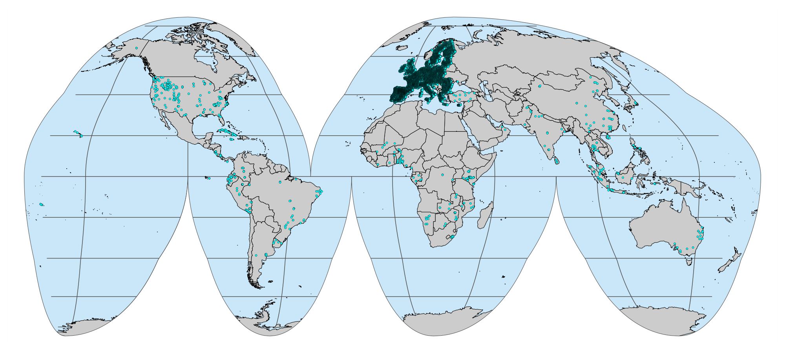
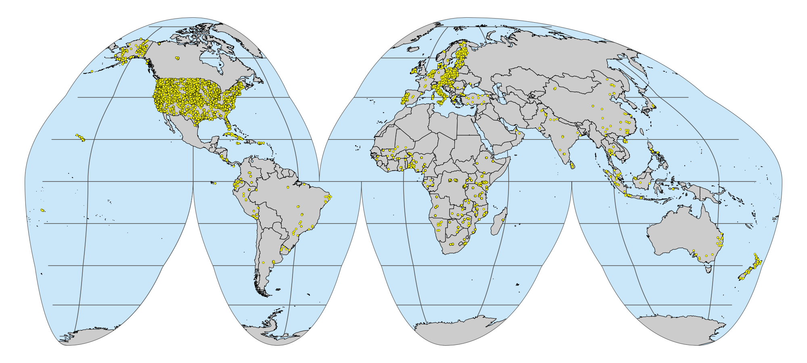

[](https://soilspectroscopy.org/)

[](http://creativecommons.org/licenses/by-sa/4.0/)

This work is licensed under a [Creative Commons Attribution-ShareAlike 4.0 International License](http://creativecommons.org/licenses/by-sa/4.0/).

## Description

Part of: <https://github.com/soilspectroscopy>  
Project: [Soil Spectroscopy for Global
Good](https://soilspectroscopy.org)  
Last update: `r Sys.Date()`  

All the external SSLs were prepared and harmonized to the OSSL naming conventions as described in the `README` files present in each specific folder. Site, soil, MIR, and VisNIR data were all exported to a local working server as `qs` serial files (R package `qs`). The exported naming convention follows the standard `<local DATASET folder>/ossl_<data table>_<version>.<format>`:

- `<local DATASET folder>/ossl_soilsite_v1.2.qs`: Imported/harmonized site data in `qs` format.  
- `<local DATASET folder>/ossl_soilab_v1.2.qs`: Imported/harmonized soil reference data in `qs` format.  
- `<local DATASET folder>/ossl_mir_v1.2.qs`: Imported/harmonized MIR data in `qs` format.  
- `<local DATASET folder>/ossl_visnir_v1.2.qs`: Imported/harmonized ViSNIR data in `qs` format.  

## OSSL level 0

```{r setup, include=FALSE}
library(captioner)
fig_nums <- captioner(prefix = "Fig.")
knitr::opts_chunk$set(message = FALSE)
knitr::opts_chunk$set(warning = FALSE)
options(scipen = 999)
```

R packages
```{r packages, include=TRUE, eval=TRUE, echo=TRUE, results='hide'}
packages <- c("tictoc", "tidyverse", "data.table", "lubridate",
              "fs", "qs", "openssl", "olctools", "sf", "terra")
new.packages <- packages[!(packages %in% installed.packages()[,"Package"])]
if(length(new.packages)) install.packages(new.packages)
invisible(lapply(packages, library, character.only = TRUE))
source("../R-code/functions/SSL_functions.R")
```

Directory/folder path
```{r dir}
dir = "/mnt/soilspec4gg/ossl/dataset/"
tic()
```

Listing, reading and row binding `qs` files
```{r qs, include=TRUE, echo=TRUE, eval=TRUE}
qs.files <- dir_ls(dir, recurse = T, regexp = glob2rx("*v1.2.qs"))

qs.soilsite <- as.vector(grep("_soilsite_", qs.files, value = T))
qs.soilsite.ids <- tibble(file_sequence = as.character(1:length(qs.soilsite)), code = basename(dirname(qs.soilsite)))

qs.soillab <- as.vector(grep("_soillab_", qs.files, value = T))
qs.soillab.ids <- tibble(file_sequence = as.character(1:length(qs.soillab)), code = basename(dirname(qs.soillab)))

qs.visnir <- as.vector(grep("_visnir_", qs.files, value = T))
qs.visnir.ids <- tibble(file_sequence = as.character(1:length(qs.visnir)), code = basename(dirname(qs.visnir)))

qs.mir <- as.vector(grep("_mir_", qs.files, value = T))
qs.mir.ids <- tibble(file_sequence = as.character(1:length(qs.mir)), code = basename(dirname(qs.mir)))

## Reading soilsite files
ossl.soilsite <- map_dfr(.x = qs.soilsite,
                       .f = function(.x) {
                         qread(.x) %>%
                           mutate_all(as.character)},
                       .id = "file_sequence") %>%
  left_join(qs.soilsite.ids, by = "file_sequence") %>%
  relocate(code, .before = 1)

ossl.soilsite %>%
  glimpse()

## Reading soillab files
ossl.soillab <- map_dfr(.x = qs.soillab,
                       .f = qread,
                       .id = "file_sequence") %>%
  left_join(qs.soillab.ids, by = "file_sequence") %>%
  relocate(code, .before = 1)

ossl.soillab %>%
  glimpse()

## Reading visnir files
ossl.visnir <- map_dfr(.x = qs.visnir,
                       .f = qread,
                       .id = "file_sequence") %>%
  left_join(qs.visnir.ids, by = "file_sequence") %>%
  relocate(contains("_ref"), .after = last_col()) %>%
  relocate(code, .before = 1)

ossl.visnir %>%
  select(!contains("_ref"), scan_visnir.1000_ref) %>%
  glimpse()

## Reading mir files
ossl.mir <- map_dfr(.x = qs.mir,
                       .f = qread,
                       .id = "file_sequence") %>%
  left_join(qs.mir.ids, by = "file_sequence") %>%
  relocate(contains("_abs"), .after = last_col()) %>%
  relocate(code, .before = 1)

ossl.mir %>%
  select(!contains("_abs"), scan_mir.1000_abs) %>%
  glimpse()
```

### Joining files
```{r join, include=TRUE, echo=TRUE, eval=TRUE}
# First full joining mir and visnir as some observations might not have both spectra types
ossl.spectra <- full_join(ossl.mir, ossl.visnir, by = "id.layer_local_c")

ossl.spectra %>%
  select(ends_with(".x")) %>%
  names()

# Coalescing repeated columns, especially because we have LUCAS.WOODWELL MIR
ossl.spectra <- ossl.spectra %>%
  mutate(id.scan_local_c = coalesce(id.scan_local_c.x, id.scan_local_c.y, NA),
         .after = id.scan_local_c.x) %>%
  mutate(code = coalesce(code.x, code.y, NA),
         file_sequence = coalesce(file_sequence.x, file_sequence.y, NA),
         .after = code.x) %>%
  select(-id.scan_local_c.x, -id.scan_local_c.y,
         -code.x, -code.y,
         -file_sequence.x, -file_sequence.y)

ossl.spectra %>%
  select(ends_with(".x")) %>%
  names()

# View(ossl.spectra %>% select(!contains("_ref|_abs")))

# Left joining site to soil info, as some site does not have lab data
ossl.info <- left_join(ossl.soillab, ossl.soilsite, by = "id.layer_local_c")

ossl.info %>%
  select(ends_with(".x")) %>%
  names()

# Coalescing repeated columns, especially because some depth info was available from soillab data, not site
ossl.info <- ossl.info %>%
  mutate_at(vars(contains(c("layer.upper.depth_usda_cm", "layer.lower.depth_usda_cm"))), as.numeric) %>%
  mutate(layer.upper.depth_usda_cm = coalesce(layer.upper.depth_usda_cm.x, layer.upper.depth_usda_cm.y, NA),
         layer.lower.depth_usda_cm = coalesce(layer.lower.depth_usda_cm.x, layer.lower.depth_usda_cm.y, NA),
         .after = layer.lower.depth_usda_cm.x) %>%
  mutate(code = coalesce(code.x, code.y, NA),
         file_sequence = coalesce(file_sequence.x, file_sequence.y, NA),
         .after = code.x) %>%
  select(-layer.upper.depth_usda_cm.x, -layer.upper.depth_usda_cm.y,
         -layer.lower.depth_usda_cm.x, -layer.lower.depth_usda_cm.y,
         -code.x, -code.y,
         -file_sequence.x, -file_sequence.y) %>%
  mutate_all(list(~na_if(.,"")))

ossl.info %>%
  select(ends_with(".x")) %>%
  names()

# Producing level 0 by left joining site and soil data to spectra data
ossl.level0 <- ossl.spectra %>%
  left_join(ossl.info, by = "id.layer_local_c")

ossl.level0 %>%
  select(ends_with(".x")) %>%
  names()

# Coalescing repeated columns, especially because we have LUCAS.WOODWELL code
ossl.level0 <- ossl.level0 %>%
  mutate(dataset.code_ascii_txt = coalesce(dataset.code_ascii_txt.x, dataset.code_ascii_txt.y, NA),
         .after = dataset.code_ascii_txt.x) %>%
  mutate(code = coalesce(code.x, code.y, NA),
         file_sequence = coalesce(file_sequence.x, file_sequence.y, NA),
         .after = code.x) %>%
  select(-dataset.code_ascii_txt.x, -dataset.code_ascii_txt.y,
         -code.x, -code.y,
         -file_sequence.x, -file_sequence.y)

ossl.level0 %>%
  select(ends_with(".x")) %>%
  names()

# For some reason, some observations have soil and spectral measurements, but not site data
# We will automatically fill them with general metadata. ID, spatial and temporal info is ommitted
ossl.level0 %>%
  count(dataset.code_ascii_txt)

soilsite.columns <- ossl.soilsite %>%
  select(starts_with(c("dataset", "observation", "surveyor")),
         id.dataset.site_ascii_txt, id.project_ascii_txt) %>%
  names()

# # Checking
# ossl.level0 %>%
#   select(!contains(c("_ref", "_abs"))) %>%
#   select(code, contains("id"), any_of(soilsite.columns)) %>%
#   filter(is.na(dataset.code_ascii_txt)) %>%
#   View()

# check.ids <- ossl.level0 %>%
#   filter(is.na(dataset.code_ascii_txt)) %>%
#   pull(id.scan_local_c)

ossl.level0.export <- ossl.level0 %>%
  group_by(code) %>%
  fill(all_of(soilsite.columns)) %>%
  ungroup()

# Removing duplicates
# ossl.level0.export %>%
#   group_by(dataset.code_ascii_txt, id.layer_local_c) %>%
#   summarise(repeats = n()) %>%
#   group_by(repeats) %>%
#   summarise(count = n())

dupli.ids <- ossl.level0.export %>%
  group_by(dataset.code_ascii_txt, id.layer_local_c) %>%
  summarise(repeats = n()) %>%
  filter(repeats > 1) %>%
  pull(id.layer_local_c)

# Removing duplicates and rearranging columns
ossl.level0.export <- ossl.level0.export %>%
  filter(!(id.layer_local_c %in% dupli.ids)) %>%
  select(any_of(names(ossl.soilsite)), any_of(sort(names(ossl.soillab))), any_of(names(ossl.spectra))) %>%
  select(dataset.code_ascii_txt, contains("id."), everything())

# # Checking
# ossl.level0.export %>%
#   select(!contains(c("_ref", "_abs"))) %>%
#   select(code, contains("id"), any_of(soilsite.columns)) %>%
#   filter(id.scan_local_c %in% check.ids) %>%
#   View()

# # Glimpse of column types
# ossl.level0.export %>%
#   select(!contains(c("_ref", "_abs"))) %>%
#   glimpse()

# Mutating to proper column types
ossl.level0.export <- ossl.level0.export %>%
  mutate(longitude.point_wgs84_dd = as.numeric(longitude.point_wgs84_dd),
         latitude.point_wgs84_dd = as.numeric(latitude.point_wgs84_dd),
         layer.sequence_usda_uint16 = as.numeric(layer.sequence_usda_uint16),
         layer.upper.depth_usda_cm = as.numeric(layer.upper.depth_usda_cm),
         layer.lower.depth_usda_cm = as.numeric(layer.lower.depth_usda_cm),
         observation.date.begin_iso.8601_yyyy.mm.dd = lubridate::ymd(observation.date.begin_iso.8601_yyyy.mm.dd),
         observation.date.end_iso.8601_yyyy.mm.dd = lubridate::ymd(observation.date.end_iso.8601_yyyy.mm.dd),
         longitude.county_wgs84_dd = as.numeric(longitude.county_wgs84_dd),
         latitude.county_wgs84_dd = as.numeric(latitude.county_wgs84_dd),
         location.point.error_any_m = as.numeric(location.point.error_any_m))

# Checking for complete spatial locations
ossl.level0.export %>%
  mutate(incomplete_location = is.na(longitude.point_wgs84_dd)&!is.na(latitude.point_wgs84_dd)) %>%
  count(incomplete_location)

# Checking for missing spatial locations
ossl.level0.export %>%
  mutate(missing_location = is.na(longitude.point_wgs84_dd)) %>%
  count(missing_location)

# Running unique id with dataset and layer id combination, and olc location code 
ossl.level0.export <- ossl.level0.export %>%
  mutate(location.point.error_any_m = ifelse(is.na(longitude.point_wgs84_dd), NA, location.point.error_any_m)) %>%
  mutate(id.layer_uuid_txt = openssl::md5(paste0(dataset.code_ascii_txt, id.layer_local_c)),
         id.location_olc_txt = olctools::encode_olc(latitude.point_wgs84_dd, longitude.point_wgs84_dd, 10)) %>%
  mutate(id.layer_uuid_txt = as.character(id.layer_uuid_txt),
         id.location_olc_txt = as.character(id.location_olc_txt)) %>%
  select(-code, -file_sequence) %>%
  relocate(id.layer_uuid_txt, .after = id.layer_local_c)

# # Checking
# ossl.level0.export %>%
#   select(!contains(c("_ref", "_abs"))) %>%
#   View()

# Final spectral counts
ossl.level0.export %>%
  mutate(available_mir = !is.na(scan_mir.1000_abs),
         available_visnir = !is.na(scan_visnir.1000_ref)) %>%
  count(dataset.code_ascii_txt, available_mir, available_visnir) %>%
  group_by(dataset.code_ascii_txt) %>%
  mutate(perc_dataset = round(n/sum(n)*100, 2))

# Final spatial counts
ossl.level0.export %>%
  mutate(missing_location = is.na(longitude.point_wgs84_dd)) %>%
  count(dataset.code_ascii_txt, missing_location) %>%
  group_by(dataset.code_ascii_txt) %>%
  mutate(perc_dataset = round(n/sum(n)*100, 2))
```

### Saving files

Saving level 0 (L0) files:  
- `ossl_all_L0_v1.2.qs`: Final full OSSL level 0 data in `qs` format.  
- `ossl_soilsite_L0_v1.2.qs`: Final OSSL site data in `qs` format.  
- `ossl_soilab_L0_v1.2.qs`: Final OSSL soil reference data in `qs` format.  
- `ossl_mir_L0_v1.2.qs`: Final OSSL MIR data in `qs` format.  
- `ossl_visnir_L0_v1.2.qs`: Final OSSL ViSNIR data in `qs` format.  

The columns `id.dataset.site_ascii_txt` and `id.layer_uuid_txt` are used as id/reference columns for joining and avoiding repeated information in the separate files.
```{r saving, include=TRUE, echo=TRUE, eval=TRUE}
# Exporting full ossl L0
qs::qsave(ossl.level0.export, "/mnt/soilspec4gg/ossl/ossl_import/ossl_all_L0_v1.2.qs", preset = "high")

# Exporting soilsite L0
avoid.soilsite.columns <- c("code", "file_sequence")
selected.soilsite.columns <- names(ossl.soilsite)[!(names(ossl.soilsite) %in% avoid.soilsite.columns)]

level0.soilsite <- ossl.level0.export %>%
  select(all_of(selected.soilsite.columns)) %>%
  relocate(dataset.code_ascii_txt, id.layer_uuid_txt, .before = 1)

qs::qsave(level0.soilsite, "/mnt/soilspec4gg/ossl/ossl_import/ossl_soilsite_L0_v1.2.qs", preset = "high")

# Exporting soillab L0
avoid.soillab.columns <- c("code", "file_sequence", "id.layer_local_c", "layer.upper.depth_usda_cm", "layer.lower.depth_usda_cm")
selected.soillab.columns <- names(ossl.soillab)[!(names(ossl.soillab) %in% avoid.soillab.columns)]

level0.soillab <- ossl.level0.export %>%
  select(dataset.code_ascii_txt, id.layer_uuid_txt, all_of(selected.soillab.columns))

qs::qsave(level0.soillab, "/mnt/soilspec4gg/ossl/ossl_import/ossl_soillab_L0_v1.2.qs", preset = "high")

# Exporting mir L0
avoid.mir.columns <- c("code", "file_sequence", "id.layer_local_c")
selected.mir.columns <- names(ossl.mir)[!(names(ossl.mir) %in% avoid.mir.columns)]

level0.mir <- ossl.level0.export %>%
  select(dataset.code_ascii_txt, id.layer_uuid_txt, all_of(selected.mir.columns))

qs::qsave(level0.mir, "/mnt/soilspec4gg/ossl/ossl_import/ossl_mir_L0_v1.2.qs", preset = "high")

# Exporting visnir L0
avoid.visnir.columns <- c("code", "file_sequence", "id.layer_local_c")
selected.visnir.columns <- names(ossl.visnir)[!(names(ossl.visnir) %in% avoid.visnir.columns)]

level0.visnir <- ossl.level0.export %>%
  select(dataset.code_ascii_txt, id.layer_uuid_txt, all_of(selected.visnir.columns))

qs::qsave(level0.visnir, "/mnt/soilspec4gg/ossl/ossl_import/ossl_visnir_L0_v1.2.qs", preset = "high")
```

### World map visualizations
```{r maps, include=TRUE, echo=TRUE, eval=TRUE}
# visnir map
visnir.output <- "../img/visnir.pnts_sites.png"

visnir.points <- ossl.level0.export %>%
  filter(!is.na(longitude.point_wgs84_dd)) %>%
  filter(!is.na(scan_visnir.1000_ref)) %>%
  select(dataset.code_ascii_txt, id.layer_uuid_txt, latitude.point_wgs84_dd, longitude.point_wgs84_dd) %>%
  st_as_sf(coords = c('longitude.point_wgs84_dd', 'latitude.point_wgs84_dd'), crs = 4326) %>%
  distinct(geometry, .keep_all = TRUE)

plot_gh(visnir.points, output = visnir.output, fill.col = "cyan1")

# mir map
mir.output <- "../img/mir.pnts_sites.png"

mir.points <- ossl.level0.export %>%
  filter(!is.na(longitude.point_wgs84_dd)) %>%
  filter(!is.na(scan_mir.1000_abs)) %>%
  select(dataset.code_ascii_txt, id.layer_uuid_txt, latitude.point_wgs84_dd, longitude.point_wgs84_dd) %>%
  st_as_sf(coords = c('longitude.point_wgs84_dd', 'latitude.point_wgs84_dd'), crs = 4326) %>%
  distinct(geometry, .keep_all = TRUE)

plot_gh(mir.points, output = mir.output, fill.col = "yellow")

# Saving as gpkg
ossl.points <- ossl.level0.export %>%
  filter(!is.na(longitude.point_wgs84_dd)) %>%
  select(dataset.code_ascii_txt, id.layer_uuid_txt, latitude.point_wgs84_dd, longitude.point_wgs84_dd) %>%
  st_as_sf(coords = c('longitude.point_wgs84_dd', 'latitude.point_wgs84_dd'), crs = 4326)

unlink("../out/ossl_locations.gpkg")
st_write(ossl.points, "../out/ossl_locations.gpkg", append = FALSE)
```

VisNIR locations


MIR locations


### Overlay with spatial covariates

NOTE: This is a time-consuming step. Must switch `eval` to TRUE for new overlaying.
```{r overlay, include=TRUE, eval=FALSE, echo=TRUE}
# Reading ossl points 
# st_layers("../out/ossl_locations.gpkg")
ossl.points <- st_read(dsn = "../out/ossl_locations.gpkg", layer = "ossl_locations")

# Land points
ov.admin <- st_read(dsn = "/mnt/soilspec4gg/WORLDCLIM/tiles_GH_100km_land.gpkg")
# plot(ov.admin["ID"])

# Overlay with tile ids
ossl.points.trans <- st_transform(ossl.points, crs = st_crs(ov.admin))

tile.id <- st_intersection(ossl.points.trans, ov.admin) %>%
  as_tibble() %>%
  rename(id.tile = ID) %>%
  select(dataset.code_ascii_txt, id.layer_uuid_txt, id.tile)

# Raster list
tif.lst <- list.files("/mnt/soilspec4gg/WORLDCLIM/", ".tif", full.names=TRUE)

# Overlay - Both tifs and ossl.points are CRS 4326
# ov.ossl <- lapply(1:length(tif.lst[1:3]), function(x) {extract(rast(tif.lst[x]), vect(ossl.points))})
ov.ossl <- parallel::mclapply(1:length(tif.lst), function(j) {
  terra::extract(terra::rast(tif.lst[j]), terra::vect(ossl.points)) }, mc.cores = 16)

# Binding all extractions
ov.ossl.binded <- Reduce(function(x, y) {left_join(x, y, by = "ID")}, ov.ossl)

# Remove covariates with no variation?
c.na <- apply(ov.ossl.binded, 2, function(x) {sum(is.na(x))/length(x)*100})
c.cv <- apply(ov.ossl.binded, 2, function(x) {sd(x,na.rm=T)/mean(x,na.rm=T)*100})

# Removing unnecessary covariates
# Either coefficient of variation (CV) < 5% or High proportion of NA observations
# In this case only using the CV filter
ov.ossl.check <- ov.ossl.binded %>%
  sample_n(1) %>%
  pivot_longer(everything(), names_to = "covariate", values_to = "value") %>%
  select(-value) %>%
  mutate(na_perc = c.na, cv_perc = c.cv) %>%
  filter(!(covariate == "ID")) %>%
  # mutate(remove = ifelse(na_perc >= quantile(na_perc, 0.95) | cv_perc < 5, TRUE, FALSE))
  mutate(remove = ifelse(cv_perc < 5, TRUE, FALSE)) #

ov.ossl.check %>%
  count(remove)

ov.ossl.selection <- ov.ossl.check %>%
  filter(!remove) %>%
  pull(covariate)

# Final data
ov.ossl.export <- ov.ossl.binded %>%
  bind_cols({ossl.points %>% select(dataset.code_ascii_txt, id.layer_uuid_txt)}, .) %>%
  left_join(tile.id, by = c("dataset.code_ascii_txt", "id.layer_uuid_txt")) %>%
  select(dataset.code_ascii_txt, id.layer_uuid_txt, id.tile, all_of(ov.ossl.selection)) %>%
  as_tibble() %>% # Omit if you want to keep spatial info
  select(-geom) # Omit if you want to keep spatial info

# Saving to disk
qs::qsave(ov.ossl.export, "/mnt/soilspec4gg/ossl/ossl_import/ossl_overlay_v1.2.qs", preset = "high")
```

## OSSL level 1

### Getting OSSL level 0 names

NOTE: The code chunk below this paragraph is hidden. Just run once for getting the OSSL level 0 column names, types, and example. Run once and upload to Google Sheet for integrating with the OSSL coding table. Copies are saved for archiving  and latter updated in `out/ossl_level0_names_<table>.csv`. Requires Google authentication. Use `CMD + Shift + C` to uncomment chunks.

<!-- ```{r ossl_names, include=FALSE, echo=FALSE, eval=FALSE} -->
<!-- library("googledrive") -->
<!-- library("googlesheets4") -->

<!-- # soilsite -->
<!-- level0.soilsite <- qread("/mnt/soilspec4gg/ossl/ossl_import/ossl_soilsite_L0_v1.2.qs") -->

<!-- level0.soilsite.format <- level0.soilsite %>% -->
<!--   apply(., 2, function(x) na.omit(x)[1]) %>% -->
<!--   data.frame("example" = .) %>% -->
<!--   rownames_to_column(var = "ossl_name") %>% -->
<!--   left_join({level0.soilsite %>% -->
<!--       summarise_all(typeof) %>% -->
<!--       mutate_all(as.character) %>% -->
<!--       pivot_longer(everything(), names_to = "ossl_name", values_to = "type") -->
<!--   }, by = "ossl_name") %>% -->
<!--   relocate(type, .after = ossl_name) %>% -->
<!--   mutate(description = "") -->

<!-- readr::write_csv(level0.soilsite.format, "../out/ossl_level0_names_soilsite.csv") -->

<!-- # soillab -->
<!-- listed.table <- googledrive::drive_ls(as_id("0AHDIWmLAj40_Uk9PVA"), pattern = "OSSL_tab1_soildata_coding") -->
<!-- ossl.soildata.coding <- listed.table[[1,"id"]] -->

<!-- ossl.vars <- googlesheets4::read_sheet(ossl.soildata.coding, sheet = 'OSSL_vars') -->

<!-- level0.soillab <- qread("/mnt/soilspec4gg/ossl/ossl_import/ossl_soillab_L0_v1.2.qs") -->

<!-- level0.soillab.format <- level0.soillab %>% -->
<!--   apply(., 2, function(x) na.omit(x)[1]) %>% -->
<!--   data.frame("example" = .) %>% -->
<!--   rownames_to_column(var = "ossl_name") %>% -->
<!--   left_join({level0.soillab %>% -->
<!--       summarise_all(typeof) %>% -->
<!--       mutate_all(as.character) %>% -->
<!--       pivot_longer(everything(), names_to = "ossl_name", values_to = "type") -->
<!--   }, by = "ossl_name") %>% -->
<!--   relocate(type, .after = ossl_name) %>% -->
<!--   mutate(split = ifelse(ossl_name %in% c("dataset.code_ascii_txt", "id.layer_uuid_txt"), "id", "properties")) %>% -->
<!--   group_by(split) %>% -->
<!--   arrange(split, ossl_name) %>% -->
<!--   ungroup() %>% -->
<!--   select(-split) -->

<!-- level0.soillab.format <- level0.soillab.format %>% -->
<!--   mutate(ossl_pattern = ossl_name) %>% -->
<!--   separate(ossl_pattern, into = c("ossl_abbrev", "ossl_method", "ossl_unit"), sep = "_") %>% -->
<!--   left_join({ossl.vars %>% select(-ossl_unit)}, by = c("ossl_abbrev")) %>% -->
<!--   rename(unit_description = ossl_unit_description, description = ossl_description) %>% -->
<!--   select(contains("ossl"), everything()) -->

<!-- readr::write_csv(level0.soillab.format, "../out/ossl_level0_names_soillab.csv") -->

<!-- # mir -->
<!-- level0.mir <- qread("/mnt/soilspec4gg/ossl/ossl_import/ossl_mir_L0_v1.2.qs") -->

<!-- set.seed(1993) -->
<!-- level0.mir.format <- level0.mir %>% -->
<!--   filter(!is.na(scan_mir.1000_abs)) %>% -->
<!--   sample_n(10) %>% -->
<!--   apply(., 2, function(x) na.omit(x)[1]) %>% -->
<!--   data.frame("example" = .) %>% -->
<!--   rownames_to_column(var = "ossl_name") %>% -->
<!--   left_join({level0.mir %>% -->
<!--       filter(!is.na(scan_mir.1000_abs)) %>% -->
<!--       sample_n(10) %>% -->
<!--       summarise_all(typeof) %>% -->
<!--       mutate_all(as.character) %>% -->
<!--       pivot_longer(everything(), names_to = "ossl_name", values_to = "type") -->
<!--   }, by = "ossl_name") %>% -->
<!--   relocate(type, .after = ossl_name) %>% -->
<!--   filter(grepl("^id\\.|^scan\\.mir|scan_mir\\.600_abs|scan_mir\\.4000_abs", ossl_name)) %>% -->
<!--   mutate(description = "") -->

<!-- readr::write_csv(level0.mir.format, "../out/ossl_level0_names_mir.csv") -->

<!-- # visnir -->
<!-- level0.visnir <- qread("/mnt/soilspec4gg/ossl/ossl_import/ossl_visnir_L0_v1.2.qs") -->

<!-- set.seed(1993) -->
<!-- level0.visnir.format <- level0.visnir %>% -->
<!--   filter(!is.na(scan_visnir.350_ref)) %>% -->
<!--   sample_n(10) %>% -->
<!--   apply(., 2, function(x) na.omit(x)[1]) %>% -->
<!--   data.frame("example" = .) %>% -->
<!--   rownames_to_column(var = "ossl_name") %>% -->
<!--   left_join({level0.visnir %>% -->
<!--       filter(!is.na(scan_visnir.350_ref)) %>% -->
<!--       sample_n(10) %>% -->
<!--       summarise_all(typeof) %>% -->
<!--       mutate_all(as.character) %>% -->
<!--       pivot_longer(everything(), names_to = "ossl_name", values_to = "type") -->
<!--   }, by = "ossl_name") %>% -->
<!--   relocate(type, .after = ossl_name) %>% -->
<!--   filter(grepl("^id\\.|^scan\\.visnir|scan_visnir\\.350_ref|scan_visnir\\.2500_ref", ossl_name)) %>% -->
<!--   mutate(description = "") -->

<!-- readr::write_csv(level0.visnir.format, "../out/ossl_level0_names_visnir.csv") -->

<!-- # Uploading to google sheet -->

<!-- # Checking metadata -->
<!-- googlesheets4::as_sheets_id(ossl.soildata.coding) -->

<!-- # Checking readme -->
<!-- googlesheets4::read_sheet(ossl.soildata.coding, sheet = 'readme') -->

<!-- # Preparing level 0 names -->
<!-- upload <- list.files("../out/", pattern = "level0_names") %>% -->
<!--   tibble(file = .) %>% -->
<!--   mutate(sheet_name = gsub("\\.csv", "", file)) -->

<!-- upload -->

<!-- # Uploading -->
<!-- for(i in 1:nrow(upload)) { -->
<!--   uploading.file <- read_csv(paste0("../out/", upload[[i,"file"]])) -->
<!--   googlesheets4::write_sheet(uploading.file, ss = ossl.soildata.coding, sheet = upload[[i,"sheet_name"]]) -->
<!-- } -->

<!-- # Checking metadata -->
<!-- googlesheets4::as_sheets_id(ossl.soildata.coding) -->
<!-- ``` -->

NOTE: The code chunk below this paragraph is hidden. Just run once for getting the OSSL level 0 soilab column edit online. The copies are archived in `out/`. Requires Google authentication. Use `CMD + Shift + C` to uncomment chunks.

<!-- ```{r ossl_names, include=FALSE, echo=FALSE, eval=FALSE} -->
<!-- library("googledrive") -->
<!-- library("googlesheets4") -->

<!-- # FACT CIN folder id -->
<!-- listed.table <- googledrive::drive_ls(as_id("0AHDIWmLAj40_Uk9PVA"), pattern = "OSSL_tab1_soildata_coding") -->
<!-- ossl.soildata.coding <- listed.table[[1,"id"]] -->

<!-- # Checking metadata -->
<!-- googlesheets4::as_sheets_id(ossl.soildata.coding) -->

<!-- # Downloading edited names -->
<!-- ossl.level0.names.soillab <- googlesheets4::read_sheet(ossl.soildata.coding, sheet = "ossl_level0_names_soillab") -->
<!-- ossl.level0.names.soilsite <- googlesheets4::read_sheet(ossl.soildata.coding, sheet = "ossl_level0_names_soilsite") -->
<!-- ossl.level0.names.mir <- googlesheets4::read_sheet(ossl.soildata.coding, sheet = "ossl_level0_names_mir") -->
<!-- ossl.level0.names.visnir <- googlesheets4::read_sheet(ossl.soildata.coding, sheet = "ossl_level0_names_visnir") -->

<!-- # Saving to folder -->
<!-- readr::write_csv(ossl.level0.names.soillab, "../out/ossl_level0_names_soillab.csv") -->
<!-- readr::write_csv(ossl.level0.names.soilsite, "../out/ossl_level0_names_soilsite.csv") -->
<!-- readr::write_csv(ossl.level0.names.mir, "../out/ossl_level0_names_mir.csv") -->
<!-- readr::write_csv(ossl.level0.names.visnir, "../out/ossl_level0_names_visnir.csv") -->
<!-- ``` -->

NOTE: The code chunk below this paragraph is hidden. Run once for downloading the harmonization rules (L0 to L1). The table is edited online on Google Sheets after the previous definitions. Copies are downloaded to github for archiving. Use `CMD + Shift + C` to uncomment chunks.

<!-- ```{r soilab_download, include=FALSE, echo=FALSE, eval=FALSE} -->
<!-- library("googledrive") -->
<!-- library("googlesheets4") -->

<!-- # FACT CIN folder id -->
<!-- listed.table <- googledrive::drive_ls(as_id("0AHDIWmLAj40_Uk9PVA"), pattern = "OSSL_tab1_soildata_coding") -->
<!-- ossl.soildata.coding <- listed.table[[1,"id"]] -->

<!-- # Checking metadata -->
<!-- googlesheets4::as_sheets_id(ossl.soildata.coding) -->

<!-- # Preparing soillab.names -->
<!-- ossl.soillab.harmonization <- googlesheets4::read_sheet(ossl.soildata.coding, sheet = "ossl_level1_soillab_harmonization") -->

<!-- # Downloading to folder -->
<!-- readr::write_csv(ossl.soillab.harmonization, "../out/ossl_level0_to_level1_soillab_harmonization.csv") -->
<!-- ``` -->

Reading soil lab harmonization rules:
```{r soilab_transvalues, include=FALSE, echo=FALSE, eval=FALSE}
# Still todo
transvalues <- read_csv(paste0(getwd(), "/ossl_level1_soillab_harmonization.csv"))
knitr::kable(transvalues)
```

Producing level 1 (L1) as a regression matrix for fitting models
```{r covariates, include=TRUE, echo=TRUE, eval=TRUE}
# Still todo
```

Producing a golden dataset for enabling a systematic analysis that shares the same base data (Spatial, VisNIR and MIR)
```{r golden_dataset, include=TRUE, echo=TRUE, eval=TRUE}
# Still todo
```

```{r}
toc()
rm(list = ls())
gc()
```

## References
