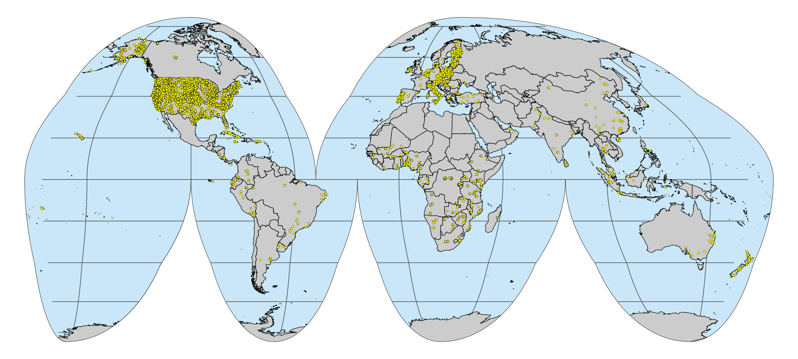

Binding all datasets
================
Jose Lucas Safanelli (<jsafanelli@woodwellclimate.org>), Tomislav Hengl
(<tom.hengl@opengeohub.org>), Jonathan Sanderman
(<jsanderman@woodwellclimate.org>) -
05 January, 2023


-   [Description](#description)
-   [OSSL level 0](#ossl-level-0)
    -   [Binding files](#binding-files)
    -   [Joining files](#joining-files)
    -   [Saving files](#saving-files)
    -   [World map visualizations](#world-map-visualizations)
    -   [Overlay with spatial
        covariates](#overlay-with-spatial-covariates)
-   [OSSL level 1](#ossl-level-1)
    -   [Getting OSSL level 0 names](#getting-ossl-level-0-names)
    -   [Producing level 1](#producing-level-1)
-   [Golden subset](#golden-subset)
    -   [Map visualization](#map-visualization)
-   [References](#references)

[](https://soilspectroscopy.org/)

[](http://creativecommons.org/licenses/by-sa/4.0/)

This work is licensed under a [Creative Commons Attribution-ShareAlike
4.0 International
License](http://creativecommons.org/licenses/by-sa/4.0/).

## Description

Part of: <https://github.com/soilspectroscopy>  
Project: [Soil Spectroscopy for Global
Good](https://soilspectroscopy.org)  
Last update: 2023-01-05

All the external SSLs were prepared and harmonized to the OSSL naming
conventions as described in the `README` files present in each specific
folder. Site, soil, MIR, and VisNIR data were all exported to a local
working server as `qs` serial files (R package `qs`). The exported
naming convention follows the standard
`<local DATASET folder>/ossl_<data table>_<version>.<format>`:

-   `<local DATASET folder>/ossl_soilsite_v1.2.qs`: Imported/harmonized
    site data in `qs` format.  
-   `<local DATASET folder>/ossl_soilab_v1.2.qs`: Imported/harmonized
    soil reference data in `qs` format.  
-   `<local DATASET folder>/ossl_mir_v1.2.qs`: Imported/harmonized MIR
    data in `qs` format.  
-   `<local DATASET folder>/ossl_visnir_v1.2.qs`: Imported/harmonized
    ViSNIR data in `qs` format.

R packages

``` r
packages <- c("tictoc", "tidyverse", "data.table", "lubridate",
              "fs", "qs", "openssl", "olctools", "sf", "terra")
new.packages <- packages[!(packages %in% installed.packages()[,"Package"])]
if(length(new.packages)) install.packages(new.packages)
invisible(lapply(packages, library, character.only = TRUE))
source("../R-code/functions/SSL_functions.R")
```

Directory/folder path

``` r
dir = "/mnt/soilspec4gg/ossl/dataset/"
tic()
```

## OSSL level 0

### Binding files

Listing, reading and row binding `qs` files

``` r
qs.files <- dir_ls(dir, recurse = T, regexp = glob2rx("*v1.2.qs"))

qs.soilsite <- as.vector(grep("_soilsite_", qs.files, value = T))
qs.soilsite.ids <- tibble(file_sequence = as.character(1:length(qs.soilsite)), code = basename(dirname(qs.soilsite)))

qs.soillab <- as.vector(grep("_soillab_", qs.files, value = T))
qs.soillab.ids <- tibble(file_sequence = as.character(1:length(qs.soillab)), code = basename(dirname(qs.soillab)))

qs.visnir <- as.vector(grep("_visnir_", qs.files, value = T))
qs.visnir.ids <- tibble(file_sequence = as.character(1:length(qs.visnir)), code = basename(dirname(qs.visnir)))

qs.mir <- as.vector(grep("_mir_", qs.files, value = T))
qs.mir.ids <- tibble(file_sequence = as.character(1:length(qs.mir)), code = basename(dirname(qs.mir)))

## Reading soilsite files
ossl.soilsite <- map_dfr(.x = qs.soilsite,
                       .f = function(.x) {
                         qread(.x) %>%
                           mutate_all(as.character)},
                       .id = "file_sequence") %>%
  left_join(qs.soilsite.ids, by = "file_sequence") %>%
  relocate(code, .before = 1) %>%
  select(-file_sequence)

ossl.soilsite %>%
  glimpse()
```

    ## Rows: 158,690
    ## Columns: 34
    ## $ code                                       <chr> "AFSIS", "AFSIS", "AFSIS", …
    ## $ id.layer_local_c                           <chr> "icr025136", "icr068579", "…
    ## $ longitude.point_wgs84_dd                   <chr> "34.24331284", "8.166768333…
    ## $ latitude.point_wgs84_dd                    <chr> "-6.8516202", "11.28065833"…
    ## $ layer.sequence_usda_uint16                 <chr> "2", "1", "2", "2", "1", "2…
    ## $ layer.upper.depth_usda_cm                  <chr> "20", "0", "20", "20", "0",…
    ## $ layer.lower.depth_usda_cm                  <chr> "50", "20", "50", "50", "20…
    ## $ observation.date.begin_iso.8601_yyyy.mm.dd <chr> "2011-01-01", "2011-01-01",…
    ## $ observation.date.end_iso.8601_yyyy.mm.dd   <chr> "2013-12-31", "2013-12-31",…
    ## $ surveyor.title_utf8_txt                    <chr> "Tor Vagen", "Jerome Tondoh…
    ## $ id.project_ascii_txt                       <chr> "Africa Soil Information Se…
    ## $ id.layer_uuid_txt                          <chr> "f361d06ea588aac37e6d3ed218…
    ## $ id.location_olc_txt                        <chr> "6G5P46XV+98", "7F3C75J8+7P…
    ## $ layer.texture_usda_txt                     <chr> "", "", "", "", "", "", "",…
    ## $ pedon.taxa_usda_txt                        <chr> "", "", "", "", "", "", "",…
    ## $ horizon.designation_usda_txt               <chr> "", "", "", "", "", "", "",…
    ## $ longitude.county_wgs84_dd                  <chr> NA, NA, NA, NA, NA, NA, NA,…
    ## $ latitude.county_wgs84_dd                   <chr> NA, NA, NA, NA, NA, NA, NA,…
    ## $ location.point.error_any_m                 <chr> "30", "30", "30", "30", "30…
    ## $ location.country_iso.3166_txt              <chr> "", "", "", "", "", "", "",…
    ## $ observation.ogc.schema.title_ogc_txt       <chr> "Open Soil Spectroscopy Lib…
    ## $ observation.ogc.schema_idn_url             <chr> "https://soilspectroscopy.g…
    ## $ surveyor.contact_ietf_email                <chr> "afsis.info@africasoils.net…
    ## $ surveyor.address_utf8_txt                  <chr> "ICRAF, PO Box 30677, Nairo…
    ## $ dataset.title_utf8_txt                     <chr> "Africa Soil Information Se…
    ## $ dataset.owner_utf8_txt                     <chr> "ICRAF, CROPNUTS, RRES", "I…
    ## $ dataset.code_ascii_txt                     <chr> "AFSIS1.SSL", "AFSIS1.SSL",…
    ## $ dataset.address_idn_url                    <chr> "https://www.isric.org/expl…
    ## $ dataset.doi_idf_url                        <chr> "https://doi.org/10.1016/j.…
    ## $ dataset.license.title_ascii_txt            <chr> "ODC Open Database License"…
    ## $ dataset.license.address_idn_url            <chr> "https://opendatacommons.or…
    ## $ dataset.contact.name_utf8_txt              <chr> "Keith Shepherd", "Keith Sh…
    ## $ dataset.contact_ietf_email                 <chr> "afsis.info@africasoils.net…
    ## $ id.dataset.site_ascii_txt                  <chr> NA, NA, NA, NA, NA, NA, NA,…

``` r
## Reading soillab files
ossl.soillab <- map_dfr(.x = qs.soillab,
                       .f = qread,
                       .id = "file_sequence") %>%
  left_join(qs.soillab.ids, by = "file_sequence") %>%
  relocate(code, .before = 1) %>%
  select(order(colnames(.))) %>%
  select(code, id.layer_local_c, everything())

ossl.soillab %>%
  glimpse()
```

    ## Rows: 151,322
    ## Columns: 81
    ## $ code                           <chr> "AFSIS", "AFSIS", "AFSIS", "AFSIS", "AF…
    ## $ id.layer_local_c               <chr> "icr074433", "icr075957", "icr074336", …
    ## $ acidity_usda.a795_cmolc.kg     <dbl> NA, NA, NA, NA, NA, NA, NA, NA, NA, NA,…
    ## $ aggstb_usda.a1_w.pct           <dbl> NA, NA, NA, NA, NA, NA, NA, NA, NA, NA,…
    ## $ al.dith_usda.a65_w.pct         <dbl> NA, NA, NA, NA, NA, NA, NA, NA, NA, NA,…
    ## $ al.ext_aquaregia_g.kg          <dbl> NA, NA, NA, NA, NA, NA, NA, NA, NA, NA,…
    ## $ al.ext_usda.a1056_mg.kg        <dbl> 346.00, 584.00, 502.00, 1378.21, 1180.0…
    ## $ al.ext_usda.a69_cmolc.kg       <dbl> NA, NA, NA, NA, NA, NA, NA, NA, NA, NA,…
    ## $ al.ox_usda.a59_w.pct           <dbl> NA, NA, NA, NA, NA, NA, NA, NA, NA, NA,…
    ## $ awc.33.1500kPa_usda.c80_w.frac <dbl> NA, NA, NA, NA, NA, NA, NA, NA, NA, NA,…
    ## $ b.ext_mel3_mg.kg               <dbl> 0.230, 0.001, 0.760, 0.053, 0.001, 0.21…
    ## $ bd_iso.11272_g.cm3             <dbl> NA, NA, NA, NA, NA, NA, NA, NA, NA, NA,…
    ## $ bd_usda.a21_g.cm3              <dbl> NA, NA, NA, NA, NA, NA, NA, NA, NA, NA,…
    ## $ bd_usda.a4_g.cm3               <dbl> NA, NA, NA, NA, NA, NA, NA, NA, NA, NA,…
    ## $ c.tot_iso.10694_w.pct          <dbl> NA, NA, NA, NA, NA, NA, NA, NA, NA, NA,…
    ## $ c.tot_usda.a622_w.pct          <dbl> 0.5704002, 0.9474234, 1.2782017, 1.8947…
    ## $ ca.ext_aquaregia_mg.kg         <dbl> NA, NA, NA, NA, NA, NA, NA, NA, NA, NA,…
    ## $ ca.ext_usda.a1059_mg.kg        <dbl> 1960.0, 5290.0, 8090.0, 219.4, 74.9, 13…
    ## $ ca.ext_usda.a722_cmolc.kg      <dbl> NA, NA, NA, NA, NA, NA, NA, NA, NA, NA,…
    ## $ caco3_iso.10693_w.pct          <dbl> NA, NA, NA, NA, NA, NA, NA, NA, NA, NA,…
    ## $ caco3_usda.a54_w.pct           <dbl> NA, NA, NA, NA, NA, NA, NA, NA, NA, NA,…
    ## $ cec_iso.11260_cmolc.kg         <dbl> NA, NA, NA, NA, NA, NA, NA, NA, NA, NA,…
    ## $ cec_usda.a723_cmolc.kg         <dbl> NA, NA, NA, NA, NA, NA, NA, NA, NA, NA,…
    ## $ cf_iso.11464_w.pct             <dbl> NA, NA, NA, NA, NA, NA, NA, NA, NA, NA,…
    ## $ cf_usda.c236_w.pct             <dbl> NA, NA, NA, NA, NA, NA, NA, NA, NA, NA,…
    ## $ clay.tot_iso.11277_w.pct       <dbl> NA, NA, NA, NA, NA, NA, NA, NA, NA, NA,…
    ## $ clay.tot_usda.a334_w.pct       <dbl> 100.000, 100.000, 100.000, 99.270, 97.3…
    ## $ cu.ext_usda.a1063_mg.kg        <dbl> 1.670, 4.250, 3.430, 1.933, 0.900, 0.00…
    ## $ ec_iso.11265_ds.m              <dbl> NA, NA, NA, NA, NA, NA, NA, NA, NA, NA,…
    ## $ ec_usda.a364_ds.m              <dbl> 0.086, 0.139, 0.174, 0.040, 0.135, 0.12…
    ## $ efferv_usda.a479_class         <chr> NA, NA, NA, NA, NA, NA, NA, NA, NA, NA,…
    ## $ fe.dith_usda.a66_w.pct         <dbl> NA, NA, NA, NA, NA, NA, NA, NA, NA, NA,…
    ## $ fe.ext_aquaregia_g.kg          <dbl> NA, NA, NA, NA, NA, NA, NA, NA, NA, NA,…
    ## $ fe.ext_usda.a1064_mg.kg        <dbl> 51.00, 92.50, 36.20, 87.73, 119.00, 179…
    ## $ fe.ox_usda.a60_w.pct           <dbl> NA, NA, NA, NA, NA, NA, NA, NA, NA, NA,…
    ## $ file_sequence                  <chr> "1", "1", "1", "1", "1", "1", "1", "1",…
    ## $ k.ext_aquaregia_mg.kg          <dbl> NA, NA, NA, NA, NA, NA, NA, NA, NA, NA,…
    ## $ k.ext_usda.a1065_mg.kg         <dbl> 178.000, 114.000, 387.000, 88.712, 29.8…
    ## $ k.ext_usda.a725_cmolc.kg       <dbl> NA, NA, NA, NA, NA, NA, NA, NA, NA, NA,…
    ## $ layer.lower.depth_usda_cm      <dbl> NA, NA, NA, NA, NA, NA, NA, NA, NA, NA,…
    ## $ layer.upper.depth_usda_cm      <dbl> NA, NA, NA, NA, NA, NA, NA, NA, NA, NA,…
    ## $ mg.ext_aquaregia_mg.kg         <dbl> NA, NA, NA, NA, NA, NA, NA, NA, NA, NA,…
    ## $ mg.ext_usda.a1066_mg.kg        <dbl> 415.00, 823.00, 905.00, 69.33, 34.80, 7…
    ## $ mg.ext_usda.a724_cmolc.kg      <dbl> NA, NA, NA, NA, NA, NA, NA, NA, NA, NA,…
    ## $ mn.ext_aquaregia_mg.kg         <dbl> NA, NA, NA, NA, NA, NA, NA, NA, NA, NA,…
    ## $ mn.ext_usda.a1067_mg.kg        <dbl> 76.400, 12.300, 69.200, 30.530, 5.730, …
    ## $ mn.ext_usda.a70_mg.kg          <dbl> NA, NA, NA, NA, NA, NA, NA, NA, NA, NA,…
    ## $ n.tot_iso.11261_w.pct          <dbl> NA, NA, NA, NA, NA, NA, NA, NA, NA, NA,…
    ## $ n.tot_iso.13878_w.pct          <dbl> NA, NA, NA, NA, NA, NA, NA, NA, NA, NA,…
    ## $ n.tot_usda.a623_w.pct          <dbl> 0.04387065, 0.06121826, 0.06013734, 0.1…
    ## $ na.ext_aquaregia_mg.kg         <dbl> NA, NA, NA, NA, NA, NA, NA, NA, NA, NA,…
    ## $ na.ext_usda.a1068_mg.kg        <dbl> 24.50, 87.70, 46.30, 18.35, 43.60, 53.8…
    ## $ na.ext_usda.a726_cmolc.kg      <dbl> NA, NA, NA, NA, NA, NA, NA, NA, NA, NA,…
    ## $ oc_iso.10694_w.pct             <dbl> NA, NA, NA, NA, NA, NA, NA, NA, NA, NA,…
    ## $ oc_usda.c1059_w.pct            <dbl> 0.6151460, 0.9277148, 1.1795179, 1.8764…
    ## $ oc_usda.c729_w.pct             <dbl> NA, NA, NA, NA, NA, NA, NA, NA, NA, NA,…
    ## $ p.ext_aquaregia_mg.kg          <dbl> NA, NA, NA, NA, NA, NA, NA, NA, NA, NA,…
    ## $ p.ext_iso.11263_mg.kg          <dbl> NA, NA, NA, NA, NA, NA, NA, NA, NA, NA,…
    ## $ p.ext_usda.a1070_mg.kg         <dbl> NA, NA, NA, NA, NA, NA, NA, NA, NA, NA,…
    ## $ p.ext_usda.a270_mg.kg          <dbl> NA, NA, NA, NA, NA, NA, NA, NA, NA, NA,…
    ## $ p.ext_usda.a274_mg.kg          <dbl> NA, NA, NA, NA, NA, NA, NA, NA, NA, NA,…
    ## $ p.ext_usda.a652_mg.kg          <dbl> 4.500, 3.330, 5.620, 0.861, 1.530, 3.67…
    ## $ ph.cacl2_iso.10390_index       <dbl> NA, NA, NA, NA, NA, NA, NA, NA, NA, NA,…
    ## $ ph.cacl2_usda.a477_index       <dbl> NA, NA, NA, NA, NA, NA, NA, NA, NA, NA,…
    ## $ ph.cacl2_usda.a481_index       <dbl> NA, NA, NA, NA, NA, NA, NA, NA, NA, NA,…
    ## $ ph.h2o_iso.10390_index         <dbl> NA, NA, NA, NA, NA, NA, NA, NA, NA, NA,…
    ## $ ph.h2o_usda.a268_index         <dbl> 8.150, 7.360, 8.400, 4.856, 4.320, 4.51…
    ## $ s.ext_mel3_mg.kg               <dbl> 6.830, 26.300, 12.300, 18.532, 39.200, …
    ## $ s.tot_usda.a624_w.pct          <dbl> NA, NA, NA, NA, NA, NA, NA, NA, NA, NA,…
    ## $ sand.tot_iso.11277_w.pct       <dbl> NA, NA, NA, NA, NA, NA, NA, NA, NA, NA,…
    ## $ sand.tot_usda.c405_w.pct       <dbl> NA, NA, NA, NA, NA, NA, NA, NA, NA, NA,…
    ## $ sand.tot_usda.c60_w.pct        <dbl> NA, NA, NA, NA, NA, NA, 0.120, 0.120, 0…
    ## $ silt.tot_iso.11277_w.pct       <dbl> NA, NA, NA, NA, NA, NA, NA, NA, NA, NA,…
    ## $ silt.tot_usda.c407_w.pct       <dbl> NA, NA, NA, NA, NA, NA, NA, NA, NA, NA,…
    ## $ silt.tot_usda.c62_w.pct        <dbl> NA, NA, NA, 0.730, 2.640, 3.260, 2.570,…
    ## $ wr.10kPa_usda.a414_w.pct       <dbl> NA, NA, NA, NA, NA, NA, NA, NA, NA, NA,…
    ## $ wr.10kPa_usda.a8_w.pct         <dbl> NA, NA, NA, NA, NA, NA, NA, NA, NA, NA,…
    ## $ wr.1500kPa_usda.a417_w.pct     <dbl> NA, NA, NA, NA, NA, NA, NA, NA, NA, NA,…
    ## $ wr.33kPa_usda.a415_w.pct       <dbl> NA, NA, NA, NA, NA, NA, NA, NA, NA, NA,…
    ## $ wr.33kPa_usda.a9_w.pct         <dbl> NA, NA, NA, NA, NA, NA, NA, NA, NA, NA,…
    ## $ zn.ext_usda.a1073_mg.kg        <dbl> 1.180, 1.650, 1.170, 0.245, 0.670, 0.63…

``` r
## Reading visnir files
ossl.visnir <- map_dfr(.x = qs.visnir,
                       .f = qread,
                       .id = "file_sequence") %>%
  left_join(qs.visnir.ids, by = "file_sequence") %>%
  relocate(contains("_ref"), .after = last_col()) %>%
  relocate(code, .before = 1) %>%
  select(-file_sequence)

ossl.visnir %>%
  select(!contains("_ref"), scan_visnir.1000_ref) %>%
  glimpse()
```

    ## Rows: 65,063
    ## Columns: 15
    ## $ code                                       <chr> "ICRAF_ISRIC", "ICRAF_ISRIC…
    ## $ id.layer_local_c                           <chr> "FS15R_FS4068", "FS15R_FS40…
    ## $ id.scan_local_c                            <chr> "FS15R_FS4068", "FS15R_FS40…
    ## $ scan.visnir.date.begin_iso.8601_yyyy.mm.dd <date> 2004-02-01, 2004-02-01, 20…
    ## $ scan.visnir.date.end_iso.8601_yyyy.mm.dd   <date> 2004-11-01, 2004-11-01, 20…
    ## $ scan.visnir.model.name_utf8_txt            <chr> "ASD FieldSpec Pro FR", "AS…
    ## $ scan.visnir.model.code_any_txt             <chr> "ASD_FieldSpec_FR", "ASD_Fi…
    ## $ scan.visnir.method.optics_any_txt          <chr> "4.5 W halogen lamp", "4.5 …
    ## $ scan.visnir.method.preparation_any_txt     <chr> "Sieve <2 mm", "Sieve <2 mm…
    ## $ scan.visnir.license.title_ascii_txt        <chr> "CC-BY", "CC-BY", "CC-BY", …
    ## $ scan.visnir.license.address_idn_url        <chr> "https://creativecommons.or…
    ## $ scan.visnir.doi_idf_url                    <chr> "https://doi.org/10.34725/D…
    ## $ scan.visnir.contact.name_utf8_txt          <chr> "Keith Shepherd", "Keith Sh…
    ## $ scan.visnir.contact.email_ietf_txt         <chr> "afsis.info@africasoils.net…
    ## $ scan_visnir.1000_ref                       <dbl> 0.4005380, 0.5228800, 0.534…

``` r
## Reading mir files
ossl.mir <- map_dfr(.x = qs.mir,
                       .f = qread,
                       .id = "file_sequence") %>%
  left_join(qs.mir.ids, by = "file_sequence") %>%
  relocate(contains("_abs"), .after = last_col()) %>%
  relocate(code, .before = 1) %>%
  select(-file_sequence)

ossl.mir %>%
  select(!contains("_abs"), scan_mir.1000_abs) %>%
  glimpse()
```

    ## Rows: 91,710
    ## Columns: 16
    ## $ code                                    <chr> "AFSIS", "AFSIS", "AFSIS", "AF…
    ## $ id.layer_local_c                        <chr> "icr072246", "icr072247", "icr…
    ## $ id.scan_local_c                         <chr> "icr072246", "icr072247", "icr…
    ## $ scan.mir.date.begin_iso.8601_yyyy.mm.dd <date> 2009-01-01, 2009-01-01, 2009-…
    ## $ scan.mir.date.end_iso.8601_yyyy.mm.dd   <date> 2013-12-31, 2013-12-31, 2013-…
    ## $ scan.mir.model.name_utf8_txt            <chr> "Bruker Tensor 27 with HTS-XT …
    ## $ scan.mir.model.code_any_txt             <chr> "Bruker_Tensor_27.HTS.XT", "Br…
    ## $ scan.mir.method.optics_any_txt          <chr> "", "", "", "", "", "", "", ""…
    ## $ scan.mir.method.preparation_any_txt     <chr> "", "", "", "", "", "", "", ""…
    ## $ scan.mir.license.title_ascii_txt        <chr> "CC-BY", "CC-BY", "CC-BY", "CC…
    ## $ scan.mir.license.address_idn_url        <chr> "https://creativecommons.org/l…
    ## $ scan.mir.doi_idf_url                    <chr> "https://doi.org/10.34725/DVN/…
    ## $ scan.mir.contact.name_utf8_txt          <chr> "Vagen, Tor-Gunnar (World Agro…
    ## $ scan.mir.contact.email_ietf_txt         <chr> "afsis.info@africasoils.net", …
    ## $ dataset.code_ascii_txt                  <chr> NA, NA, NA, NA, NA, NA, NA, NA…
    ## $ scan_mir.1000_abs                       <dbl> 1.189548, 1.286010, 1.298255, …

### Joining files

``` r
# First full joining mir and visnir as some observations might not have both spectra types
# NOTE: this requires the use of na filters when modeling to check availability of soil and spectra type
ossl.spectra <- full_join(ossl.mir, ossl.visnir, by = c("code", "id.layer_local_c"))

ossl.spectra %>%
  select(ends_with(".x")) %>%
  names()
```

    ## [1] "id.scan_local_c.x"

``` r
# Coalescing repeated columns, especially because we have LUCAS.WOODWELL MIR
ossl.spectra <- ossl.spectra %>%
  mutate(id.scan_local_c = coalesce(id.scan_local_c.x, id.scan_local_c.y, NA),
         .after = id.scan_local_c.x) %>%
  select(-id.scan_local_c.x, -id.scan_local_c.y)

ossl.spectra %>%
  select(ends_with(".x")) %>%
  names()
```

    ## character(0)

``` r
# View(ossl.spectra %>% select(!contains("_ref|_abs")))

# Left joining site to soil info, as some site does not have lab data
ossl.info <- left_join(ossl.soillab, ossl.soilsite, by = c("code", "id.layer_local_c"))

ossl.info %>%
  select(ends_with(".x")) %>%
  names()
```

    ## [1] "layer.lower.depth_usda_cm.x" "layer.upper.depth_usda_cm.x"

``` r
# Coalescing repeated columns, especially because some depth info was available from soillab data, not site
ossl.info <- ossl.info %>%
  mutate_at(vars(contains(c("layer.upper.depth_usda_cm", "layer.lower.depth_usda_cm"))), as.numeric) %>%
  mutate(layer.upper.depth_usda_cm = coalesce(layer.upper.depth_usda_cm.x, layer.upper.depth_usda_cm.y, NA),
         layer.lower.depth_usda_cm = coalesce(layer.lower.depth_usda_cm.x, layer.lower.depth_usda_cm.y, NA),
         .after = layer.lower.depth_usda_cm.x) %>%
  select(-layer.upper.depth_usda_cm.x, -layer.upper.depth_usda_cm.y,
         -layer.lower.depth_usda_cm.x, -layer.lower.depth_usda_cm.y) %>%
  mutate_all(list(~na_if(.,"")))

ossl.info %>%
  select(ends_with(".x")) %>%
  names()
```

    ## character(0)

``` r
# Producing level 0 by left joining site and soil data to spectra data
ossl.level0 <- ossl.spectra %>%
  left_join(ossl.info, by = c("code", "id.layer_local_c"))

ossl.level0 %>%
  select(ends_with(".x")) %>%
  names()
```

    ## [1] "dataset.code_ascii_txt.x"

``` r
# Coalescing repeated columns, especially because we have LUCAS.WOODWELL code
ossl.level0 <- ossl.level0 %>%
  mutate(dataset.code_ascii_txt = coalesce(dataset.code_ascii_txt.x, dataset.code_ascii_txt.y, NA),
         .after = dataset.code_ascii_txt.x) %>%
  select(-dataset.code_ascii_txt.x, -dataset.code_ascii_txt.y)

ossl.level0 %>%
  select(ends_with(".x")) %>%
  names()
```

    ## character(0)

``` r
# For some reason, some observations have soil and spectral measurements, but not site data
# We will automatically fill them with general metadata. ID, spatial and temporal info is ommitted
soilsite.columns <- ossl.soilsite %>%
  select(starts_with(c("dataset", "observation", "surveyor")),
         id.dataset.site_ascii_txt, id.project_ascii_txt) %>%
  names()

# # Checking
# ossl.level0 %>%
#   select(!contains(c("_ref", "_abs"))) %>%
#   select(code, contains("id"), any_of(soilsite.columns)) %>%
#   filter(is.na(dataset.code_ascii_txt)) %>%
#   View()

# check.ids <- ossl.level0 %>%
#   filter(is.na(dataset.code_ascii_txt)) %>%
#   pull(id.scan_local_c)

ossl.level0.export <- ossl.level0 %>%
  group_by(code) %>%
  fill(all_of(soilsite.columns)) %>%
  ungroup()

# For some reason, some observations have spectral measurements but not soil data
# We will drop them
soil.na <- ossl.level0.export %>%
  select(all_of(names(ossl.soillab))) %>%
  select(-code, -id.layer_local_c) %>%
  apply(., 1, function(x) sum(is.na(x))/length(x)) %>%
  tibble(proportion_NA = .) %>%
  bind_cols({ossl.level0.export %>% select(code, id.layer_local_c)}, .)

soil.na %>%
  filter(proportion_NA == 1) %>%
  group_by(code) %>%
  summarise(count = n())
```

    ## # A tibble: 4 × 2
    ##   code        count
    ##   <chr>       <int>
    ## 1 ICRAF_ISRIC   365
    ## 2 KSSL         5781
    ## 3 LUCAS           2
    ## 4 Schiedung      12

``` r
soil.na.ids <- soil.na %>%
  filter(proportion_NA == 1) %>%
  pull(id.layer_local_c)

# ossl.level0.export %>%
#   group_by(dataset.code_ascii_txt, id.layer_local_c) %>%
#   summarise(repeats = n()) %>%
#   group_by(repeats) %>%
#   summarise(count = n())

dupli.ids <- ossl.level0.export %>%
  group_by(dataset.code_ascii_txt, id.layer_local_c) %>%
  summarise(repeats = n()) %>%
  filter(repeats > 1) %>%
  pull(id.layer_local_c)

# Removing duplicates and rearranging columns
ossl.level0.export <- ossl.level0.export %>%
  filter(!(id.layer_local_c %in% dupli.ids)) %>%
  filter(!(id.layer_local_c %in% soil.na.ids)) %>%
  select(any_of(names(ossl.soilsite)), any_of(sort(names(ossl.soillab))), any_of(names(ossl.spectra))) %>%
  select(dataset.code_ascii_txt, contains("id."), everything())

# # Checking
# ossl.level0.export %>%
#   select(!contains(c("_ref", "_abs"))) %>%
#   select(code, contains("id"), any_of(soilsite.columns)) %>%
#   filter(id.scan_local_c %in% check.ids) %>%
#   View()

# # Glimpse of column types
# ossl.level0.export %>%
#   select(!contains(c("_ref", "_abs"))) %>%
#   glimpse()

# Mutating to proper column types
ossl.level0.export <- ossl.level0.export %>%
  mutate(longitude.point_wgs84_dd = as.numeric(longitude.point_wgs84_dd),
         latitude.point_wgs84_dd = as.numeric(latitude.point_wgs84_dd),
         layer.sequence_usda_uint16 = as.numeric(layer.sequence_usda_uint16),
         layer.upper.depth_usda_cm = as.numeric(layer.upper.depth_usda_cm),
         layer.lower.depth_usda_cm = as.numeric(layer.lower.depth_usda_cm),
         observation.date.begin_iso.8601_yyyy.mm.dd = lubridate::ymd(observation.date.begin_iso.8601_yyyy.mm.dd),
         observation.date.end_iso.8601_yyyy.mm.dd = lubridate::ymd(observation.date.end_iso.8601_yyyy.mm.dd),
         longitude.county_wgs84_dd = as.numeric(longitude.county_wgs84_dd),
         latitude.county_wgs84_dd = as.numeric(latitude.county_wgs84_dd),
         location.point.error_any_m = as.numeric(location.point.error_any_m))

# Checking for complete spatial locations
ossl.level0.export %>%
  mutate(incomplete_location = is.na(longitude.point_wgs84_dd)&!is.na(latitude.point_wgs84_dd)) %>%
  count(incomplete_location)
```

    ## # A tibble: 1 × 2
    ##   incomplete_location      n
    ##   <lgl>                <int>
    ## 1 FALSE               135725

``` r
# Checking for missing spatial locations
ossl.level0.export %>%
  mutate(missing_location = is.na(longitude.point_wgs84_dd)) %>%
  count(missing_location)
```

    ## # A tibble: 2 × 2
    ##   missing_location     n
    ##   <lgl>            <int>
    ## 1 FALSE            87734
    ## 2 TRUE             47991

``` r
# Running unique id with dataset and layer id combination, and olc location code 
ossl.level0.export <- ossl.level0.export %>%
  mutate(location.point.error_any_m = ifelse(is.na(longitude.point_wgs84_dd), NA, location.point.error_any_m)) %>%
  mutate(id.layer_uuid_txt = openssl::md5(paste0(dataset.code_ascii_txt, id.layer_local_c)),
         id.location_olc_txt = olctools::encode_olc(latitude.point_wgs84_dd, longitude.point_wgs84_dd, 10)) %>%
  mutate(id.layer_uuid_txt = as.character(id.layer_uuid_txt),
         id.location_olc_txt = as.character(id.location_olc_txt)) %>%
  select(-code) %>%
  relocate(id.layer_uuid_txt, .after = id.layer_local_c)

# # Checking
# ossl.level0.export %>%
#   select(!contains(c("_ref", "_abs"))) %>%
#   View()

# Final spectral counts
ossl.level0.export %>%
  mutate(available_mir = !is.na(scan_mir.1000_abs),
         available_visnir = !is.na(scan_visnir.1000_ref)) %>%
  count(dataset.code_ascii_txt, available_mir, available_visnir) %>%
  group_by(dataset.code_ascii_txt) %>%
  mutate(perc_dataset = round(n/sum(n)*100, 2))
```

    ## # A tibble: 13 × 5
    ## # Groups:   dataset.code_ascii_txt [10]
    ##    dataset.code_ascii_txt available_mir available_visnir     n perc_dataset
    ##    <chr>                  <lgl>         <lgl>            <int>        <dbl>
    ##  1 AFSIS1.SSL             TRUE          FALSE             1904       100   
    ##  2 AFSIS2.SSL             TRUE          FALSE              151       100   
    ##  3 CAF.SSL                TRUE          FALSE             1578       100   
    ##  4 GARRETT.SSL            TRUE          FALSE              184       100   
    ##  5 ICRAF.ISRIC            FALSE         TRUE                 2         0.05
    ##  6 ICRAF.ISRIC            TRUE          TRUE              4071       100.  
    ##  7 KSSL.SSL               FALSE         TRUE              9789        11.3 
    ##  8 KSSL.SSL               TRUE          FALSE            66870        77.2 
    ##  9 KSSL.SSL               TRUE          TRUE             10018        11.6 
    ## 10 LUCAS.SSL              FALSE         TRUE             40175       100   
    ## 11 LUCAS.WOODWELL.SSL     TRUE          TRUE               589       100   
    ## 12 SCHIEDUNG.SSL          TRUE          FALSE              259       100   
    ## 13 SERBIA.SSL             TRUE          FALSE              135       100

``` r
# Final spatial counts
ossl.level0.export %>%
  mutate(missing_location = is.na(longitude.point_wgs84_dd)) %>%
  count(dataset.code_ascii_txt, missing_location) %>%
  group_by(dataset.code_ascii_txt) %>%
  mutate(perc_dataset = round(n/sum(n)*100, 2))
```

    ## # A tibble: 13 × 4
    ## # Groups:   dataset.code_ascii_txt [10]
    ##    dataset.code_ascii_txt missing_location     n perc_dataset
    ##    <chr>                  <lgl>            <int>        <dbl>
    ##  1 AFSIS1.SSL             FALSE             1838        96.5 
    ##  2 AFSIS1.SSL             TRUE                66         3.47
    ##  3 AFSIS2.SSL             TRUE               151       100   
    ##  4 CAF.SSL                FALSE             1578       100   
    ##  5 GARRETT.SSL            FALSE              184       100   
    ##  6 ICRAF.ISRIC            FALSE             4013        98.5 
    ##  7 ICRAF.ISRIC            TRUE                60         1.47
    ##  8 KSSL.SSL               FALSE            38963        45.0 
    ##  9 KSSL.SSL               TRUE             47714        55.0 
    ## 10 LUCAS.SSL              FALSE            40175       100   
    ## 11 LUCAS.WOODWELL.SSL     FALSE              589       100   
    ## 12 SCHIEDUNG.SSL          FALSE              259       100   
    ## 13 SERBIA.SSL             FALSE              135       100

### Saving files

Saving level 0 (L0) files:  
- `ossl_all_L0_v1.2.qs`: Final full OSSL level 0 data in `qs` format.  
- `ossl_soilsite_L0_v1.2.qs`: Final OSSL site data in `qs` format.  
- `ossl_soilab_L0_v1.2.qs`: Final OSSL soil reference data in `qs`
format.  
- `ossl_mir_L0_v1.2.qs`: Final OSSL MIR data in `qs` format.  
- `ossl_visnir_L0_v1.2.qs`: Final OSSL ViSNIR data in `qs` format.

The columns `id.dataset.site_ascii_txt` and `id.layer_uuid_txt` are used
as id/reference columns for joining and avoiding repeated information in
the separate files.

``` r
# Exporting full ossl L0
qs::qsave(ossl.level0.export, "/mnt/soilspec4gg/ossl/ossl_import/ossl_all_L0_v1.2.qs", preset = "high")

# Exporting soilsite L0
avoid.soilsite.columns <- c("code", "file_sequence")
selected.soilsite.columns <- names(ossl.soilsite)[!(names(ossl.soilsite) %in% avoid.soilsite.columns)]

level0.soilsite <- ossl.level0.export %>%
  select(all_of(selected.soilsite.columns)) %>%
  relocate(dataset.code_ascii_txt, id.layer_uuid_txt, .before = 1)

qs::qsave(level0.soilsite, "/mnt/soilspec4gg/ossl/ossl_import/ossl_soilsite_L0_v1.2.qs", preset = "high")

# Exporting soillab L0
avoid.soillab.columns <- c("code", "file_sequence", "id.layer_local_c",
                           "layer.upper.depth_usda_cm", "layer.lower.depth_usda_cm")
selected.soillab.columns <- names(ossl.soillab)[!(names(ossl.soillab) %in% avoid.soillab.columns)]

level0.soillab <- ossl.level0.export %>%
  select(dataset.code_ascii_txt, id.layer_uuid_txt, all_of(selected.soillab.columns)) %>%
  select(order(colnames(.))) %>%
  select(dataset.code_ascii_txt, id.layer_uuid_txt, everything())

qs::qsave(level0.soillab, "/mnt/soilspec4gg/ossl/ossl_import/ossl_soillab_L0_v1.2.qs", preset = "high")

# Exporting mir L0
avoid.mir.columns <- c("code", "file_sequence", "id.layer_local_c")
selected.mir.columns <- names(ossl.mir)[!(names(ossl.mir) %in% avoid.mir.columns)]

level0.mir <- ossl.level0.export %>%
  select(dataset.code_ascii_txt, id.layer_uuid_txt, all_of(selected.mir.columns)) %>%
  mutate_at(vars(ends_with("_abs")), round, 5)

qs::qsave(level0.mir, "/mnt/soilspec4gg/ossl/ossl_import/ossl_mir_L0_v1.2.qs", preset = "high")

# # Size test
# level0.mir.test1 <- level0.mir %>% mutate_at(vars(ends_with("_abs")), round, 5)
# head(level0.mir.test1[,50:55])
# qs::qsave(level0.mir.test1, "/mnt/soilspec4gg/ossl/ossl_import/ossl_mir_L0_v1.2_test1.qs", preset = "high")
# 
# level0.mir.test2 <- level0.mir %>% mutate_at(vars(ends_with("_abs")), function(x=.){round(x*1000, 0)})
# head(level0.mir.test2[,50:55])
# qs::qsave(level0.mir.test2, "/mnt/soilspec4gg/ossl/ossl_import/ossl_mir_L0_v1.2_test2.qs", preset = "high")

# Exporting visnir L0
avoid.visnir.columns <- c("code", "file_sequence", "id.layer_local_c")
selected.visnir.columns <- names(ossl.visnir)[!(names(ossl.visnir) %in% avoid.visnir.columns)]

level0.visnir <- ossl.level0.export %>%
  select(dataset.code_ascii_txt, id.layer_uuid_txt, all_of(selected.visnir.columns)) %>%
  mutate_at(vars(ends_with("_ref")), round, 5)

qs::qsave(level0.visnir, "/mnt/soilspec4gg/ossl/ossl_import/ossl_visnir_L0_v1.2.qs", preset = "high")
```

### World map visualizations

``` r
# visnir map
visnir.output <- "../img/visnir.pnts_sites.png"

visnir.points <- ossl.level0.export %>%
  filter(!is.na(longitude.point_wgs84_dd)) %>%
  filter(!is.na(scan_visnir.1000_ref)) %>%
  select(dataset.code_ascii_txt, id.layer_uuid_txt, latitude.point_wgs84_dd, longitude.point_wgs84_dd) %>%
  st_as_sf(coords = c('longitude.point_wgs84_dd', 'latitude.point_wgs84_dd'), crs = 4326) %>%
  distinct(geometry, .keep_all = TRUE)

plot_gh(visnir.points, output = visnir.output, fill.col = "cyan1")

# mir map
mir.output <- "../img/mir.pnts_sites.png"

mir.points <- ossl.level0.export %>%
  filter(!is.na(longitude.point_wgs84_dd)) %>%
  filter(!is.na(scan_mir.1000_abs)) %>%
  select(dataset.code_ascii_txt, id.layer_uuid_txt, latitude.point_wgs84_dd, longitude.point_wgs84_dd) %>%
  st_as_sf(coords = c('longitude.point_wgs84_dd', 'latitude.point_wgs84_dd'), crs = 4326) %>%
  distinct(geometry, .keep_all = TRUE)

plot_gh(mir.points, output = mir.output, fill.col = "yellow")

# Saving as gpkg
ossl.points <- ossl.level0.export %>%
  filter(!is.na(longitude.point_wgs84_dd)) %>%
  select(dataset.code_ascii_txt, id.layer_uuid_txt, latitude.point_wgs84_dd, longitude.point_wgs84_dd) %>%
  st_as_sf(coords = c('longitude.point_wgs84_dd', 'latitude.point_wgs84_dd'), crs = 4326)

unlink("../out/ossl_locations.gpkg")
st_write(ossl.points, "../out/ossl_locations.gpkg", append = FALSE)
```

    ## Writing layer `ossl_locations' to data source 
    ##   `../out/ossl_locations.gpkg' using driver `GPKG'
    ## Writing 87734 features with 2 fields and geometry type Point.

VisNIR locations


MIR locations


### Overlay with spatial covariates

NOTE: This is a time-consuming step. Must switch `eval` to TRUE for new
overlaying.

``` r
# Reading ossl points 
# st_layers("../out/ossl_locations.gpkg")
ossl.points <- st_read(dsn = "../out/ossl_locations.gpkg", layer = "ossl_locations")

# Land points
ov.admin <- st_read(dsn = "/mnt/soilspec4gg/WORLDCLIM/tiles_GH_100km_land.gpkg")
# plot(ov.admin["ID"])

# Overlay with tile ids
ossl.points.trans <- st_transform(ossl.points, crs = st_crs(ov.admin))

tile.id <- st_intersection(ossl.points.trans, ov.admin) %>%
  as_tibble() %>%
  rename(id.tile = ID) %>%
  select(dataset.code_ascii_txt, id.layer_uuid_txt, id.tile)

# Raster list
tif.lst <- list.files("/mnt/soilspec4gg/WORLDCLIM/", ".tif", full.names=TRUE)

# Overlay - Both tifs and ossl.points are CRS 4326
# ov.ossl <- lapply(1:length(tif.lst[1:3]), function(x) {extract(rast(tif.lst[x]), vect(ossl.points))})
ov.ossl <- parallel::mclapply(1:length(tif.lst), function(j) {
  terra::extract(terra::rast(tif.lst[j]), terra::vect(ossl.points)) }, mc.cores = 16)

# Binding all extractions
ov.ossl.binded <- Reduce(function(x, y) {left_join(x, y, by = "ID")}, ov.ossl)

# Remove covariates with no variation?
c.na <- apply(ov.ossl.binded, 2, function(x) {sum(is.na(x))/length(x)*100})
c.cv <- apply(ov.ossl.binded, 2, function(x) {sd(x,na.rm=T)/mean(x,na.rm=T)*100})

# Removing unnecessary covariates
# Either coefficient of variation (CV) < 5% or High proportion of NA observations
# In this case only using the CV filter
ov.ossl.check <- ov.ossl.binded %>%
  sample_n(1) %>%
  pivot_longer(everything(), names_to = "covariate", values_to = "value") %>%
  select(-value) %>%
  mutate(na_perc = c.na, cv_perc = c.cv) %>%
  filter(!(covariate == "ID")) %>%
  # mutate(remove = ifelse(na_perc >= quantile(na_perc, 0.95) | cv_perc < 5, TRUE, FALSE))
  mutate(remove = ifelse(cv_perc < 5, TRUE, FALSE)) #

ov.ossl.check %>%
  count(remove)

ov.ossl.selection <- ov.ossl.check %>%
  filter(!remove) %>%
  pull(covariate)

# Final data
ov.ossl.export <- ov.ossl.binded %>%
  bind_cols({ossl.points %>% select(dataset.code_ascii_txt, id.layer_uuid_txt)}, .) %>%
  left_join(tile.id, by = c("dataset.code_ascii_txt", "id.layer_uuid_txt")) %>%
  select(dataset.code_ascii_txt, id.layer_uuid_txt, id.tile, all_of(ov.ossl.selection)) %>%
  as_tibble() %>% # Omit if you want to keep spatial info
  select(-geom) # Omit if you want to keep spatial info

# Saving to disk
qs::qsave(ov.ossl.export, "/mnt/soilspec4gg/ossl/ossl_import/ossl_overlay_v1.2.qs", preset = "high")
```

## OSSL level 1

### Getting OSSL level 0 names

NOTE: The code chunk below this paragraph is hidden. Just run once for
getting the OSSL level 0 column names, types, and example. Run once and
upload to Google Sheet for integrating with the OSSL coding table.
Copies are saved for archiving and latter updated in
`out/ossl_level0_names_<table>.csv`. Requires Google authentication. Use
`CMD + Shift + C` to uncomment chunks.

<!-- ```{r ossl_names, include=FALSE, echo=FALSE, eval=FALSE} -->
<!-- library("googledrive") -->
<!-- library("googlesheets4") -->
<!-- # soilsite -->
<!-- level0.soilsite <- qread("/mnt/soilspec4gg/ossl/ossl_import/ossl_soilsite_L0_v1.2.qs") -->
<!-- level0.soilsite.format <- level0.soilsite %>% -->
<!--   apply(., 2, function(x) na.omit(x)[1]) %>% -->
<!--   data.frame("example" = .) %>% -->
<!--   rownames_to_column(var = "ossl_name") %>% -->
<!--   left_join({level0.soilsite %>% -->
<!--       summarise_all(typeof) %>% -->
<!--       mutate_all(as.character) %>% -->
<!--       pivot_longer(everything(), names_to = "ossl_name", values_to = "type") -->
<!--   }, by = "ossl_name") %>% -->
<!--   relocate(type, .after = ossl_name) %>% -->
<!--   mutate(description = "") -->
<!-- readr::write_csv(level0.soilsite.format, "../out/ossl_level0_names_soilsite.csv") -->
<!-- # soillab -->
<!-- listed.table <- googledrive::drive_ls(as_id("0AHDIWmLAj40_Uk9PVA"), pattern = "OSSL_tab1_soildata_coding") -->
<!-- ossl.soildata.coding <- listed.table[[1,"id"]] -->
<!-- ossl.vars <- googlesheets4::read_sheet(ossl.soildata.coding, sheet = 'OSSL_vars') -->
<!-- level0.soillab <- qread("/mnt/soilspec4gg/ossl/ossl_import/ossl_soillab_L0_v1.2.qs") -->
<!-- level0.soillab.format <- level0.soillab %>% -->
<!--   apply(., 2, function(x) na.omit(x)[1]) %>% -->
<!--   data.frame("example" = .) %>% -->
<!--   rownames_to_column(var = "ossl_name") %>% -->
<!--   left_join({level0.soillab %>% -->
<!--       summarise_all(typeof) %>% -->
<!--       mutate_all(as.character) %>% -->
<!--       pivot_longer(everything(), names_to = "ossl_name", values_to = "type") -->
<!--   }, by = "ossl_name") %>% -->
<!--   relocate(type, .after = ossl_name) %>% -->
<!--   mutate(split = ifelse(ossl_name %in% c("dataset.code_ascii_txt", "id.layer_uuid_txt"), "id", "properties")) %>% -->
<!--   group_by(split) %>% -->
<!--   arrange(split, ossl_name) %>% -->
<!--   ungroup() %>% -->
<!--   select(-split) -->
<!-- level0.soillab.format <- level0.soillab.format %>% -->
<!--   mutate(ossl_pattern = ossl_name) %>% -->
<!--   separate(ossl_pattern, into = c("ossl_abbrev", "ossl_method", "ossl_unit"), sep = "_") %>% -->
<!--   left_join({ossl.vars %>% select(-ossl_unit)}, by = c("ossl_abbrev")) %>% -->
<!--   rename(unit_description = ossl_unit_description, description = ossl_description) %>% -->
<!--   select(contains("ossl"), everything()) -->
<!-- readr::write_csv(level0.soillab.format, "../out/ossl_level0_names_soillab.csv") -->
<!-- # mir -->
<!-- level0.mir <- qread("/mnt/soilspec4gg/ossl/ossl_import/ossl_mir_L0_v1.2.qs") -->
<!-- set.seed(1993) -->
<!-- level0.mir.format <- level0.mir %>% -->
<!--   filter(!is.na(scan_mir.1000_abs)) %>% -->
<!--   sample_n(10) %>% -->
<!--   apply(., 2, function(x) na.omit(x)[1]) %>% -->
<!--   data.frame("example" = .) %>% -->
<!--   rownames_to_column(var = "ossl_name") %>% -->
<!--   left_join({level0.mir %>% -->
<!--       filter(!is.na(scan_mir.1000_abs)) %>% -->
<!--       sample_n(10) %>% -->
<!--       summarise_all(typeof) %>% -->
<!--       mutate_all(as.character) %>% -->
<!--       pivot_longer(everything(), names_to = "ossl_name", values_to = "type") -->
<!--   }, by = "ossl_name") %>% -->
<!--   relocate(type, .after = ossl_name) %>% -->
<!--   filter(grepl("^id\\.|^scan\\.mir|scan_mir\\.600_abs|scan_mir\\.4000_abs", ossl_name)) %>% -->
<!--   mutate(description = "") -->
<!-- readr::write_csv(level0.mir.format, "../out/ossl_level0_names_mir.csv") -->
<!-- # visnir -->
<!-- level0.visnir <- qread("/mnt/soilspec4gg/ossl/ossl_import/ossl_visnir_L0_v1.2.qs") -->
<!-- set.seed(1993) -->
<!-- level0.visnir.format <- level0.visnir %>% -->
<!--   filter(!is.na(scan_visnir.350_ref)) %>% -->
<!--   sample_n(10) %>% -->
<!--   apply(., 2, function(x) na.omit(x)[1]) %>% -->
<!--   data.frame("example" = .) %>% -->
<!--   rownames_to_column(var = "ossl_name") %>% -->
<!--   left_join({level0.visnir %>% -->
<!--       filter(!is.na(scan_visnir.350_ref)) %>% -->
<!--       sample_n(10) %>% -->
<!--       summarise_all(typeof) %>% -->
<!--       mutate_all(as.character) %>% -->
<!--       pivot_longer(everything(), names_to = "ossl_name", values_to = "type") -->
<!--   }, by = "ossl_name") %>% -->
<!--   relocate(type, .after = ossl_name) %>% -->
<!--   filter(grepl("^id\\.|^scan\\.visnir|scan_visnir\\.350_ref|scan_visnir\\.2500_ref", ossl_name)) %>% -->
<!--   mutate(description = "") -->
<!-- readr::write_csv(level0.visnir.format, "../out/ossl_level0_names_visnir.csv") -->
<!-- # Uploading to google sheet -->
<!-- # Checking metadata -->
<!-- googlesheets4::as_sheets_id(ossl.soildata.coding) -->
<!-- # Checking readme -->
<!-- googlesheets4::read_sheet(ossl.soildata.coding, sheet = 'readme') -->
<!-- # Preparing level 0 names -->
<!-- upload <- list.files("../out/", pattern = "level0_names") %>% -->
<!--   tibble(file = .) %>% -->
<!--   mutate(sheet_name = gsub("\\.csv", "", file)) -->
<!-- upload -->
<!-- # Uploading -->
<!-- for(i in 1:nrow(upload)) { -->
<!--   uploading.file <- read_csv(paste0("../out/", upload[[i,"file"]])) -->
<!--   googlesheets4::write_sheet(uploading.file, ss = ossl.soildata.coding, sheet = upload[[i,"sheet_name"]]) -->
<!-- } -->
<!-- # Checking metadata -->
<!-- googlesheets4::as_sheets_id(ossl.soildata.coding) -->
<!-- ``` -->

NOTE: The code chunk below this paragraph is hidden. Just run once for
getting the OSSL level 0 soilab column edit online. The copies are
archived in `out/`. Requires Google authentication. Use
`CMD + Shift + C` to uncomment chunks.

<!-- ```{r ossl_names, include=FALSE, echo=FALSE, eval=FALSE} -->
<!-- library("googledrive") -->
<!-- library("googlesheets4") -->
<!-- # FACT CIN folder id -->
<!-- listed.table <- googledrive::drive_ls(as_id("0AHDIWmLAj40_Uk9PVA"), pattern = "OSSL_tab1_soildata_coding") -->
<!-- ossl.soildata.coding <- listed.table[[1,"id"]] -->
<!-- # Checking metadata -->
<!-- googlesheets4::as_sheets_id(ossl.soildata.coding) -->
<!-- # Downloading edited names -->
<!-- ossl.level0.names.soillab <- googlesheets4::read_sheet(ossl.soildata.coding, sheet = "ossl_level0_names_soillab") -->
<!-- ossl.level0.names.soilsite <- googlesheets4::read_sheet(ossl.soildata.coding, sheet = "ossl_level0_names_soilsite") -->
<!-- ossl.level0.names.mir <- googlesheets4::read_sheet(ossl.soildata.coding, sheet = "ossl_level0_names_mir") -->
<!-- ossl.level0.names.visnir <- googlesheets4::read_sheet(ossl.soildata.coding, sheet = "ossl_level0_names_visnir") -->
<!-- # Saving to folder -->
<!-- readr::write_csv(ossl.level0.names.soillab, "../out/ossl_level0_names_soillab.csv") -->
<!-- readr::write_csv(ossl.level0.names.soilsite, "../out/ossl_level0_names_soilsite.csv") -->
<!-- readr::write_csv(ossl.level0.names.mir, "../out/ossl_level0_names_mir.csv") -->
<!-- readr::write_csv(ossl.level0.names.visnir, "../out/ossl_level0_names_visnir.csv") -->
<!-- ``` -->

NOTE: The code chunk below this paragraph is hidden. Run once for
downloading the harmonization rules (L0 to L1). The table is edited
online on Google Sheets after the previous definitions. Copies are
downloaded to github for archiving. Use `CMD + Shift + C` to uncomment
chunks.

<!-- ```{r soilab_download, include=FALSE, echo=FALSE, eval=FALSE} -->
<!-- library("googledrive") -->
<!-- library("googlesheets4") -->
<!-- # FACT CIN folder id -->
<!-- listed.table <- googledrive::drive_ls(as_id("0AHDIWmLAj40_Uk9PVA"), pattern = "OSSL_tab1_soildata_coding") -->
<!-- ossl.soildata.coding <- listed.table[[1,"id"]] -->
<!-- # Checking metadata -->
<!-- googlesheets4::as_sheets_id(ossl.soildata.coding) -->
<!-- # Preparing soillab.names -->
<!-- ossl.soillab.harmonization <- googlesheets4::read_sheet(ossl.soildata.coding, sheet = "ossl_level1_soillab_harmonization") -->
<!-- # Downloading to folder -->
<!-- readr::write_csv(ossl.soillab.harmonization, "../out/ossl_level0_to_level1_soillab_harmonization.csv") -->
<!-- ``` -->

### Producing level 1

This can be used as a regression matrix for fitting prediction models

``` r
## Reading harmonization rules
ossl.soillab.level1.transvalues <- read_csv("../out/ossl_level0_to_level1_soillab_harmonization.csv")

ossl.soillab.level1.transvalues %>%
  select(ossl_name_level0, ossl_name_level1, ossl_level1_transform) %>%
  knitr::kable()
```

| ossl\_name\_level0               | ossl\_name\_level1               | ossl\_level1\_transform |
|:---------------------------------|:---------------------------------|:------------------------|
| dataset.code\_ascii\_txt         | dataset.code\_ascii\_txt         | x                       |
| id.layer\_uuid\_txt              | id.layer\_uuid\_txt              | x                       |
| acidity\_usda.a795\_cmolc.kg     | acidity\_usda.a795\_cmolc.kg     | x                       |
| aggstb\_usda.a1\_w.pct           | aggstb\_usda.a1\_w.pct           | x                       |
| al.dith\_usda.a65\_w.pct         | al.dith\_usda.a65\_w.pct         | x                       |
| al.ext\_aquaregia\_g.kg          | al.ext\_aquaregia\_g.kg          | x                       |
| al.ext\_usda.a1056\_mg.kg        | al.ext\_usda.a1056\_mg.kg        | x                       |
| al.ext\_usda.a69\_cmolc.kg       | al.ext\_usda.a69\_cmolc.kg       | x                       |
| al.ox\_usda.a59\_w.pct           | al.ox\_usda.a59\_w.pct           | x                       |
| awc.33.1500kPa\_usda.c80\_w.frac | awc.33.1500kPa\_usda.c80\_w.frac | x                       |
| b.ext\_mel3\_mg.kg               | b.ext\_mel3\_mg.kg               | x                       |
| bd\_iso.11272\_g.cm3             | bd\_usda.a4\_g.cm3               | x                       |
| bd\_usda.a21\_g.cm3              | bd\_usda.a4\_g.cm3               | x                       |
| bd\_usda.a4\_g.cm3               | bd\_usda.a4\_g.cm3               | x                       |
| bd\_usda.c85\_g.cm3              | bd\_usda.a4\_g.cm3               | x                       |
| c.tot\_iso.10694\_w.pct          | c.tot\_usda.a622\_w.pct          | x                       |
| c.tot\_usda.a622\_w.pct          | c.tot\_usda.a622\_w.pct          | x                       |
| ca.ext\_aquaregia\_mg.kg         | ca.ext\_aquaregia\_mg.kg         | x                       |
| ca.ext\_usda.a1059\_mg.kg        | ca.ext\_usda.a1059\_mg.kg        | x                       |
| ca.ext\_usda.a722\_cmolc.kg      | ca.ext\_usda.a722\_cmolc.kg      | x                       |
| caco3\_iso.10693\_w.pct          | caco3\_usda.a54\_w.pct           | x                       |
| caco3\_usda.a54\_w.pct           | caco3\_usda.a54\_w.pct           | x                       |
| cec\_iso.11260\_cmolc.kg         | cec\_usda.a723\_cmolc.kg         | x                       |
| cec\_usda.a723\_cmolc.kg         | cec\_usda.a723\_cmolc.kg         | x                       |
| cf\_iso.11464\_w.pct             | cf\_usda.c236\_w.pct             | x                       |
| cf\_usda.c236\_w.pct             | cf\_usda.c236\_w.pct             | x                       |
| clay.tot\_iso.11277\_w.pct       | clay.tot\_usda.a334\_w.pct       | x                       |
| clay.tot\_usda.a334\_w.pct       | clay.tot\_usda.a334\_w.pct       | x                       |
| cu.ext\_usda.a1063\_mg.kg        | cu.ext\_usda.a1063\_mg.kg        | x                       |
| ec\_iso.11265\_ds.m              | ec\_usda.a364\_ds.m              | x                       |
| ec\_usda.a364\_ds.m              | ec\_usda.a364\_ds.m              | x                       |
| efferv\_usda.a479\_class         | efferv\_usda.a479\_class         | x                       |
| fe.dith\_usda.a66\_w.pct         | fe.dith\_usda.a66\_w.pct         | x                       |
| fe.ext\_aquaregia\_g.kg          | fe.ext\_aquaregia\_g.kg          | x                       |
| fe.ext\_usda.a1064\_mg.kg        | fe.ext\_usda.a1064\_mg.kg        | x                       |
| fe.ox\_usda.a60\_w.pct           | fe.ox\_usda.a60\_w.pct           | x                       |
| k.ext\_aquaregia\_mg.kg          | k.ext\_aquaregia\_mg.kg          | x                       |
| k.ext\_usda.a1065\_mg.kg         | k.ext\_usda.a1065\_mg.kg         | x                       |
| k.ext\_usda.a725\_cmolc.kg       | k.ext\_usda.a725\_cmolc.kg       | x                       |
| mg.ext\_aquaregia\_mg.kg         | mg.ext\_aquaregia\_mg.kg         | x                       |
| mg.ext\_usda.a1066\_mg.kg        | mg.ext\_usda.a1066\_mg.kg        | x                       |
| mg.ext\_usda.a724\_cmolc.kg      | mg.ext\_usda.a724\_cmolc.kg      | x                       |
| mn.ext\_aquaregia\_mg.kg         | mn.ext\_aquaregia\_mg.kg         | x                       |
| mn.ext\_usda.a1067\_mg.kg        | mn.ext\_usda.a1066\_mg.kg        | x                       |
| mn.ext\_usda.a70\_mg.kg          | mn.ext\_usda.a70\_mg.kg          | x                       |
| n.tot\_iso.11261\_w.pct          | n.tot\_usda.a623\_w.pct          | x                       |
| n.tot\_iso.13878\_w.pct          | n.tot\_usda.a623\_w.pct          | x                       |
| n.tot\_usda.a623\_w.pct          | n.tot\_usda.a623\_w.pct          | x                       |
| na.ext\_aquaregia\_mg.kg         | na.ext\_aquaregia\_mg.kg         | x                       |
| na.ext\_usda.a1068\_mg.kg        | na.ext\_usda.a1068\_mg.kg        | x                       |
| na.ext\_usda.a726\_cmolc.kg      | na.ext\_usda.a726\_cmolc.kg      | x                       |
| oc\_iso.10694\_w.pct             | oc\_usda.c729\_w.pct             | x                       |
| oc\_usda.c1059\_w.pct            | oc\_usda.c729\_w.pct             | x                       |
| oc\_usda.c729\_w.pct             | oc\_usda.c729\_w.pct             | x                       |
| p.ext\_aquaregia\_mg.kg          | p.ext\_aquaregia\_mg.kg          | x                       |
| p.ext\_iso.11263\_mg.kg          | p.ext\_usda.a274\_mg.kg          | x                       |
| p.ext\_usda.a1070\_mg.kg         | p.ext\_usda.a1070\_mg.kg         | x                       |
| p.ext\_usda.a270\_mg.kg          | p.ext\_usda.a270\_mg.kg          | x                       |
| p.ext\_usda.a274\_mg.kg          | p.ext\_usda.a274\_mg.kg          | x                       |
| p.ext\_usda.a652\_mg.kg          | p.ext\_usda.a1070\_mg.kg         | x                       |
| ph.cacl2\_iso.10390\_index       | ph.cacl2\_usda.a481\_index       | x                       |
| ph.cacl2\_usda.a477\_index       | ph.cacl2\_usda.a481\_index       | x                       |
| ph.cacl2\_usda.a481\_index       | ph.cacl2\_usda.a481\_index       | x                       |
| ph.h2o\_iso.10390\_index         | ph.h2o\_usda.a268\_index         | x                       |
| ph.h2o\_usda.a268\_index         | ph.h2o\_usda.a268\_index         | x                       |
| s.ext\_mel3\_mg.kg               | s.ext\_mel3\_mg.kg               | x                       |
| s.tot\_usda.a624\_w.pct          | s.tot\_usda.a624\_w.pct          | x                       |
| sand.tot\_iso.11277\_w.pct       | sand.tot\_usda.c60\_w.pct        | x                       |
| sand.tot\_usda.c405\_w.pct       | sand.tot\_usda.c60\_w.pct        | x                       |
| sand.tot\_usda.c60\_w.pct        | sand.tot\_usda.c60\_w.pct        | x                       |
| silt.tot\_iso.11277\_w.pct       | silt.tot\_usda.c62\_w.pct        | x                       |
| silt.tot\_usda.c407\_w.pct       | silt.tot\_usda.c62\_w.pct        | x                       |
| silt.tot\_usda.c62\_w.pct        | silt.tot\_usda.c62\_w.pct        | x                       |
| wr.10kPa\_usda.a414\_w.pct       | wr.10kPa\_usda.a414\_w.pct       | x                       |
| wr.10kPa\_usda.a8\_w.pct         | wr.10kPa\_usda.a414\_w.pct       | x                       |
| wr.1500kPa\_usda.a417\_w.pct     | wr.1500kPa\_usda.a417\_w.pct     | x                       |
| wr.33kPa\_usda.a415\_w.pct       | wr.33kPa\_usda.a415\_w.pct       | x                       |
| wr.33kPa\_usda.a9\_w.pct         | wr.33kPa\_usda.a415\_w.pct       | x                       |
| zn.ext\_usda.a1073\_mg.kg        | zn.ext\_usda.a1073\_mg.kg        | x                       |

``` r
## Reading soilab level 0
level0.soillab <- qread("/mnt/soilspec4gg/ossl/ossl_import/ossl_soillab_L0_v1.2.qs")
level0.soillab <- as.data.frame(level0.soillab)

## First step: harmonizing values from different methods
# Getting the formulas
functions.list <- ossl.soillab.level1.transvalues %>%
  mutate(ossl_name_level0 = factor(ossl_name_level0, levels = names(ossl_name_level0))) %>%
  arrange(ossl_name_level0) %>%
  pull(ossl_level1_transform)

# Applying harmonization rules
level1.soillab.harmonized <- transform_values(df = level0.soillab,
                                              out.name = names(level0.soillab),
                                              in.name = names(level0.soillab),
                                              fun.lst = functions.list)

## Second step: renaming to common property name
analytes.old.names <- ossl.soillab.level1.transvalues %>%
  pull(ossl_name_level0)

analytes.new.names <- ossl.soillab.level1.transvalues %>%
  pull(ossl_name_level1)

renaming.vector <- analytes.new.names
names(renaming.vector) <- analytes.old.names

priorioty.first <- ossl.soillab.level1.transvalues %>%
  mutate(priority = ifelse(ossl_name_level0 == ossl_name_level1, 1, 2)) %>%
  select(ossl_name_level0, priority)

# Pivoting and renaming
level1.soillab.renamed <- level1.soillab.harmonized %>%
  mutate_all(as.character) %>%
  pivot_longer(-all_of(c("dataset.code_ascii_txt", "id.layer_uuid_txt")),
               names_to = "ossl_name_level0", values_to = "values") %>%
  left_join(priorioty.first, by = "ossl_name_level0") %>%
  mutate(ossl_name_level1 = recode(ossl_name_level0, !!!renaming.vector))

## Third step: arranging and summarizing to unique values
# Here we are coalescing (finding first non na element instead of averaging)
# Instead of using dplyr::coalesce (which does not drop na values), we filter, arrange, first, and pivot to wider

# level1.soillab.renamed %>%
#   mutate(check = is.na(values)) %>%
#   count(ossl_name_level0, check)

level1.soillab.export <- level1.soillab.renamed %>%
  filter(!is.na(values)) %>%
  arrange(dataset.code_ascii_txt, id.layer_uuid_txt, ossl_name_level1, priority) %>%
  group_by(dataset.code_ascii_txt, id.layer_uuid_txt, ossl_name_level1) %>%
  summarise(new_values = first(values), .groups = "drop") %>%
  pivot_wider(names_from = "ossl_name_level1", values_from = "new_values")

# Mutating data types
level1.soillab.export <- level1.soillab.export %>%
  mutate_at(vars(-all_of(c("dataset.code_ascii_txt", "id.layer_uuid_txt", "efferv_usda.a479_class"))),
            as.numeric) %>%
  select(order(colnames(.))) %>%
  select(dataset.code_ascii_txt, id.layer_uuid_txt, everything())

## Saving to disk
qs::qsave(level1.soillab.export, "/mnt/soilspec4gg/ossl/ossl_import/ossl_soillab_L1_v1.2.qs", preset = "high")
```

## Golden subset

Producing a golden dataset (that have complete observations for Spatial,
VisNIR and MIR info).

``` r
## Reading separate files for joining to level 1
level0.soilsite <- qread("/mnt/soilspec4gg/ossl/ossl_import/ossl_soilsite_L0_v1.2.qs")
level0.visnir <- qread("/mnt/soilspec4gg/ossl/ossl_import/ossl_visnir_L0_v1.2.qs")
level0.mir <- qread("/mnt/soilspec4gg/ossl/ossl_import/ossl_mir_L0_v1.2.qs")
level1.soillab <- qread("/mnt/soilspec4gg/ossl/ossl_import/ossl_soillab_L1_v1.2.qs")

ossl.level1 <- left_join(level0.soilsite, level1.soillab,
                         by = c("dataset.code_ascii_txt", "id.layer_uuid_txt")) %>%
  left_join(level0.visnir, by = c("dataset.code_ascii_txt", "id.layer_uuid_txt")) %>%
  left_join(level0.mir, by = c("dataset.code_ascii_txt", "id.layer_uuid_txt", "id.scan_local_c"))

# ossl.level1 %>%
#   select(ends_with(".x")) %>%
#   names()

## Saving to disk
qs::qsave(ossl.level1, "/mnt/soilspec4gg/ossl/ossl_import/ossl_all_L1_v1.2.qs", preset = "high")

## Reading spatial overlay
ossl.overlay <- qread("/mnt/soilspec4gg/ossl/ossl_import/ossl_overlay_v1.2.qs")

## Producing golden subset
ossl.golden.subset <- ossl.overlay %>%
  left_join(level0.soilsite, by = c("dataset.code_ascii_txt", "id.layer_uuid_txt")) %>%
  left_join(level1.soillab, by = c("dataset.code_ascii_txt", "id.layer_uuid_txt")) %>%
  left_join(level0.visnir, by = c("dataset.code_ascii_txt", "id.layer_uuid_txt")) %>%
  left_join(level0.mir, by = c("dataset.code_ascii_txt", "id.layer_uuid_txt", "id.scan_local_c"))

# ossl.golden.subset %>%
#   select(ends_with(".x")) %>%
#   names()

ossl.golden.subset.export <- ossl.golden.subset %>%
  mutate(remove = ifelse(is.na(scan_mir.1000_abs) |
                           is.na(scan_visnir.1000_ref) |
                           is.na(latitude.point_wgs84_dd), TRUE, FALSE),
         .before = 1) %>%
  filter(!remove)

## Saving to disk
qs::qsave(ossl.golden.subset.export, "/mnt/soilspec4gg/ossl/ossl_import/ossl_golden_subset_v1.2.qs", preset = "high")

## Summary
ossl.golden.subset.export %>%
  count(dataset.code_ascii_txt) %>%
  bind_rows(tibble(dataset.code_ascii_txt = "TOTAL",
                   n = nrow(ossl.golden.subset.export)))
```

    ## # A tibble: 4 × 2
    ##   dataset.code_ascii_txt     n
    ##   <chr>                  <int>
    ## 1 ICRAF.ISRIC             4011
    ## 2 KSSL.SSL                 521
    ## 3 LUCAS.WOODWELL.SSL       589
    ## 4 TOTAL                   5121

### Map visualization

``` r
gs.output <- "../img/golden.subset_sites.png"

gs.points <- ossl.golden.subset.export %>%
  select(dataset.code_ascii_txt, id.layer_uuid_txt, latitude.point_wgs84_dd, longitude.point_wgs84_dd) %>%
  st_as_sf(coords = c('longitude.point_wgs84_dd', 'latitude.point_wgs84_dd'), crs = 4326) %>%
  distinct(geometry, .keep_all = TRUE)

plot_gh(gs.points, output = gs.output, fill.col = "red")
```

Golden subset locations


``` r
toc()
```

    ## 261.229 sec elapsed

``` r
rm(list = ls())
gc()
```

    ##           used  (Mb) gc trigger    (Mb)   max used    (Mb)
    ## Ncells 3658631 195.4   13696239   731.5   17120298   914.4
    ## Vcells 7022626  53.6 2881102557 21981.1 3001081830 22896.5

## References

This data processing follows the principles of `tidyverse` ([Wickham et
al.](#ref-package_tidyverse) ([2019](#ref-package_tidyverse))) and takes
advantage of several amazing packages, such as `tictoc`
([Izrailev](#ref-package_tictoc) ([2022](#ref-package_tictoc))),
`data.table` ([Dowle & Srinivasan](#ref-package_datatable)
([2021](#ref-package_datatable))), `lubridate` ([Grolemund &
Wickham](#ref-package_lubridate) ([2011](#ref-package_lubridate))), `fs`
([Hester, Wickham, & Csárdi](#ref-package_fs)
([2021](#ref-package_fs))), `qs` ([Ching](#ref-package_qs)
([2022](#ref-package_qs))), `openssl` ([Ooms](#ref-package_openssl)
([2022](#ref-package_openssl))), `olctools`
([Keyes](#ref-package_olctools) ([2016](#ref-package_olctools))), `sf`
([Pebesma](#ref-package_sf) ([2018](#ref-package_sf))), and `terra`
([Hijmans](#ref-package_terra) ([2021](#ref-package_terra))).

<div id="refs" class="references csl-bib-body hanging-indent"
line-spacing="2">

<div id="ref-package_qs" class="csl-entry">

Ching, T. (2022). *Qs: Quick serialization of r objects*. Retrieved from
<https://CRAN.R-project.org/package=qs>

</div>

<div id="ref-package_datatable" class="csl-entry">

Dowle, M., & Srinivasan, A. (2021). *Data.table: Extension of
‘data.frame‘*. Retrieved from
<https://CRAN.R-project.org/package=data.table>

</div>

<div id="ref-package_lubridate" class="csl-entry">

Grolemund, G., & Wickham, H. (2011). Dates and times made easy with
<span class="nocase">lubridate</span>. *Journal of Statistical
Software*, *40*(3), 1–25. Retrieved from
<https://www.jstatsoft.org/v40/i03/>

</div>

<div id="ref-package_fs" class="csl-entry">

Hester, J., Wickham, H., & Csárdi, G. (2021). *Fs: Cross-platform file
system operations based on ’libuv’*. Retrieved from
<https://CRAN.R-project.org/package=fs>

</div>

<div id="ref-package_terra" class="csl-entry">

Hijmans, R. J. (2021). *Terra: Spatial data analysis*. Retrieved from
<https://rspatial.org/terra/>

</div>

<div id="ref-package_tictoc" class="csl-entry">

Izrailev, S. (2022). *Tictoc: Functions for timing r scripts, as well as
implementations of "stack" and "list" structures*. Retrieved from
<https://CRAN.R-project.org/package=tictoc>

</div>

<div id="ref-package_olctools" class="csl-entry">

Keyes, O. (2016). *Olctools: Open location code handling in r*.
Retrieved from <https://CRAN.R-project.org/package=olctools>

</div>

<div id="ref-package_openssl" class="csl-entry">

Ooms, J. (2022). *Openssl: Toolkit for encryption, signatures and
certificates based on OpenSSL*. Retrieved from
<https://CRAN.R-project.org/package=openssl>

</div>

<div id="ref-package_sf" class="csl-entry">

Pebesma, E. (2018). <span class="nocase">Simple Features for R:
Standardized Support for Spatial Vector Data</span>. *The R Journal*,
*10*(1), 439–446.
doi:[10.32614/RJ-2018-009](https://doi.org/10.32614/RJ-2018-009)

</div>

<div id="ref-package_tidyverse" class="csl-entry">

Wickham, H., Averick, M., Bryan, J., Chang, W., McGowan, L. D.,
François, R., … Yutani, H. (2019). Welcome to the <span
class="nocase">tidyverse</span>. *Journal of Open Source Software*,
*4*(43), 1686.
doi:[10.21105/joss.01686](https://doi.org/10.21105/joss.01686)

</div>

</div>
