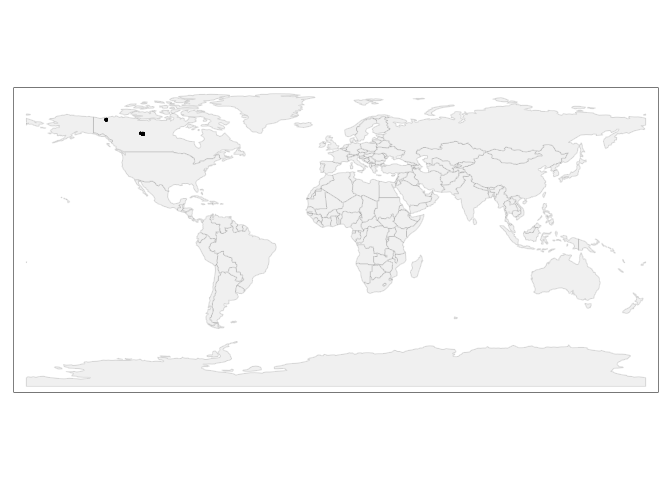

Dataset import: Schiedung et al. (2022)
================
Jose Lucas Safanelli (<jsafanelli@woodwellclimate.org>) and Jonathan
Sanderman (<jsanderman@woodwellclimate.org>)
28 September, 2022


-   [The Schiedung et al. (2022) Soil Spectral Library
    inputs](#the-schiedung-et-al-2022-soil-spectral-library-inputs)
-   [Data import](#data-import)
    -   [Soil site information](#soil-site-information)
-   [References](#references)

[](https://soilspectroscopy.org/)

[](http://creativecommons.org/licenses/by-sa/4.0/)

This work is licensed under a [Creative Commons Attribution-ShareAlike
4.0 International
License](http://creativecommons.org/licenses/by-sa/4.0/).

## The Schiedung et al. (2022) Soil Spectral Library inputs

Part of: <https://github.com/soilspectroscopy>  
Project: [Soil Spectroscopy for Global
Good](https://soilspectroscopy.org)  
Last update: 2022-09-28  
Dataset:
[SCHIEDUNG.SSL](https://soilspectroscopy.github.io/ossl-manual/soil-spectroscopy-tools-and-users.html)

Mid-Infrared Spectra (MIRS) from Schiedung et al. (2022) Soil Spectral
Library explained in detail in [Schiedung, Bellè, Malhotra, &
Abiven](#ref-Schiedung2022) ([2022](#ref-Schiedung2022)).

Directory/folder path:

``` r
dir = "/mnt/soilspec4gg/ossl/dataset/Schiedung/"
```

## Data import

The dataset was shared by email, but a public version is available at
Zenodo <https://doi.org/10.5281/zenodo.6024831>.

``` r
# Checking shared files
# list.files(dir)

# Checking column description
schiedung.desc <- read_xlsx(paste0(dir, "/Var_names_ID_DRIFT_all.xlsx"), sheet = 1)

# Reading site information
schiedung.info <- read_xlsx(paste0(dir, "/ID_DRIFT_all.xlsx"), sheet = 1)
# names(schiedung.info)

# Reading spectra data, two sheets because of different spectral range
# excel_sheets(paste0(dir, "/Schiedung_opusimport.xlsx")) 

schiedung.spec1 <- read_xlsx(paste0(dir, "/Schiedung_opusimport.xlsx"), sheet = 1)
# schiedung.spec1 %>% pull(ID) # ID is the merge of EUP, sample_point, and increment

schiedung.spec2 <- read_xlsx(paste0(dir, "/Schiedung_opusimport.xlsx"), sheet = 2)
# schiedung.spec2 %>% pull(ID) # ID is the merge of EUP, sample_point, and increment
```

### Soil site information

``` r
# Formatting to OSSL standard

schiedung.soilsite <- schiedung.info %>% # Spectra ID is the merge of EUP, sample_point, and increment
  dplyr::mutate(id.layer_local_c = paste0(EUP, ".", sample_point, "_", increment), .before = 1) %>%
  dplyr::rename(longitude_wgs84_dd = Latitute_DD, latitude_wgs84_dd = Longitute_DD) %>% # Author confused columns
  dplyr::mutate(id.user.site_ascii_c = paste(EUP, sample_point, sep = "."), # Unique locations
                id.dataset.site_ascii_c = paste(EUP, sample_point, sep = ".")) %>%
  dplyr::select(id.layer_local_c, longitude_wgs84_dd, latitude_wgs84_dd,
                id.user.site_ascii_c, id.dataset.site_ascii_c) %>% # Adding missing metadata
  dplyr::mutate(id.layer_uuid_c = openssl::md5(id.layer_local_c),
                id.location_olc_c = olctools::encode_olc(latitude_wgs84_dd, longitude_wgs84_dd, 10),
                observation.ogc.schema.title_ogc_txt = 'Open Soil Spectroscopy Library',
                observation.ogc.schema_idn_url = 'https://soilspectroscopy.github.io',
                observation.date.begin_iso.8601_yyyy.mm.dd = "2019.07.01",
                observation.date.end_iso.8601_yyyy.mm.dd = "2019.08.31",
                location.address_utf8_txt = "North Canada",
                location.country_iso.3166_c = "CAN",
                location.method_any_c = "GPS",
                location.error_any_m = 5, # Check with Marcus
                surveyor.title_utf8_txt = "Marcus Schiedung",
                surveyor.contact_ietf_email = "marcus.schiedung@geo.uzh.ch",
                surveyor.address_utf8_txt = 'Department of Geography, University of Zurich, Winterthurerstrasse 190, 8057 Zurich, Switzerland',
                dataset.title_utf8_txt = 'Schiedung et al. (2022)',
                dataset.owner_utf8_txt = 'Schiedung et al. (2022)',
                dataset.code_ascii_txt = 'SCHIEDUNG.SSL',
                dataset.address_idn_url = 'https://zenodo.org/record/6024831',
                dataset.license.title_ascii_txt = 'CC-BY 4.0',
                dataset.license.address_idn_url = 'https://creativecommons.org/licenses/by/4.0/legalcode',
                dataset.doi_idf_c = 'https://doi.org/10.5281/zenodo.6024831',
                dataset.contact.name_utf8_txt = "Marcus Schiedung",
                dataset.contact.email_ietf_email = "marcus.schiedung@geo.uzh.ch",
                id.project_ascii_c = "SCHIEDUNG",
                pedon.taxa_usda_c = '') %>%
  dplyr::select(id.layer_uuid_c, # Following the sequence from ossl-manual
                id.layer_local_c,
                id.location_olc_c,
                observation.ogc.schema.title_ogc_txt,
                observation.ogc.schema_idn_url,
                observation.date.begin_iso.8601_yyyy.mm.dd,
                observation.date.end_iso.8601_yyyy.mm.dd,
                location.address_utf8_txt,
                location.country_iso.3166_c,
                location.method_any_c,
                surveyor.title_utf8_txt,
                surveyor.contact_ietf_email,
                surveyor.address_utf8_txt,
                longitude_wgs84_dd,
                latitude_wgs84_dd,
                location.error_any_m,
                dataset.title_utf8_txt,
                dataset.owner_utf8_txt,
                dataset.code_ascii_txt,
                dataset.address_idn_url,
                dataset.license.title_ascii_txt,
                dataset.license.address_idn_url,
                dataset.doi_idf_c,
                dataset.contact.name_utf8_txt,
                dataset.contact.email_ietf_email,
                id.dataset.site_ascii_c,
                id.user.site_ascii_c,
                id.project_ascii_c,
                pedon.taxa_usda_c)
```

Plotting map:

``` r
data("World")

points <- schiedung.soilsite %>%
   st_as_sf(coords = c('longitude_wgs84_dd', 'latitude_wgs84_dd'), crs = 4326)

tmap_mode("plot")
```

    ## tmap mode set to plotting

``` r
tm_shape(World) +
  tm_polygons('#f0f0f0f0', border.alpha = 0.2) +
  tm_shape(points) +
  tm_dots()
```

<!-- -->

Exporting soilsite data

``` r
soilsite.rds = paste0(dir, "/ossl_soilsite_v1.rds")
saveRDS(schiedung.soilsite, soilsite.rds)
```

<!-- ### Soil lab information -->
<!-- Harmonization function: -->
<!-- ```{r} -->
<!-- names(schiedung.info) -->
<!-- in.names = c("BD_bulk", "BD_fine", -->
<!--              "TN", "TC", "SOC", "pH_CaCl2_site", -->
<!--              "eff_CEC_site", "clay_site", "silt_site", "sand_site") -->
<!-- out.name = c("bd.core_iso.11272.2017_gcm3", "bd.od_usda.3b2_gcm3", -->
<!--              "n.tot_iso.13878.1998_wpct", "c.tot_iso.10694.1995_wpct", -->
<!--              "ph.cacl2_usda.4c1_index", "ph.h2o_usda.4c1_index", "ec.w_usda.4f1_dsm", "gyp_usda.4e2_wpct", -->
<!--              "caco3_usda.4e1_wpct", "ca.ext_usda.4b1_cmolkg", "k.ext_usda.4b1_cmolkg", -->
<!--              "mg.ext_usda.4b1_cmolkg", "na.ext_usda.4b1_cmolkg", "cec.ext_usda.4b1_cmolkg", -->
<!--              "sum.bases_4b4b2a_cmolkg", "ecec_usda.4b4_cmolkg", "al.kcl_usda.4b3_cmolkg", -->
<!--              "fe.kcl_usda.4b3_mgkg", "c.tot_usda.4h2_wpct", "n.tot_usda.4h2_wpct", -->
<!--              "s.tot_usda.4h2_wpct", "oc_usda.calc_wpct", "bd.od_usda.3b2_gcm3", -->
<!--              "sand.tot_usda.3a1_wpct", "silt.tot_usda.3a1_wpct", "clay.tot_usda.3a1_wpct") -->
<!-- schiedung.soillab <- schiedung.info %>% # Spectra ID is the merge of EUP, sample_point, and increment -->
<!--   dplyr::mutate(id.layer_local_c = paste0(EUP, ".", sample_point, "_", increment), .before = 1) %>% -->
<!--   tidyr::separate(increment, into = c("layer.upper.depth_usda_cm", "layer.lower.depth_usda_cm"), sep = "-") %>% -->
<!--   dplyr::mutate(layer.upper.depth_usda_cm = as.numeric(layer.upper.depth_usda_cm), -->
<!--                 layer.lower.depth_usda_cm = as.numeric(layer.lower.depth_usda_cm)) %>% -->
<!--   dplyr::select(id.layer_local_c, layer.upper.depth_usda_cm, layer.lower.depth_usda_cm) %>% -->
<!-- ## compare values -->
<!-- summary(neon.soillab$carbonTot) -->
<!-- summary(neon.soillab$bulkDensExclCoarseFrag) ## some very high BD? -->
<!-- summary(neon.soillab$clayTotal) -->
<!-- summary(neon.soillab$sandTotal) -->
<!-- fun.lst = as.list(rep("x*1", length(in.name))) -->
<!-- fun.lst[[which(in.name=="carbonTot")]] = "x/10" -->
<!-- fun.lst[[which(in.name=="nitrogenTot")]] = "x/10" -->
<!-- fun.lst[[which(in.name=="sulfurTot")]] = "x/10" -->
<!-- fun.lst[[which(in.name=="finalOC")]] = "x/10" -->
<!-- fun.lst[[which(in.name=="gypsumConc")]] = "x/10" -->
<!-- fun.lst[[which(in.name=="caco3Conc")]] = "x/10" -->
<!-- ## save translation rules: -->
<!-- #View(data.frame(in.name, out.name, unlist(fun.lst))) -->
<!-- write.csv(data.frame(in.name, out.name, unlist(fun.lst)), "./neon_soilab_transvalues.csv") -->
<!-- neon.soil.f = transvalues(neon.soillab, out.name, in.name, fun.lst) -->
<!-- neon.soil.f$wpg2_usda.3a2_wpct = rowSums(neon.soil[,c("coarseFrag2To5", "coarseFrag5To20")], na.rm=TRUE) -->
<!-- ``` -->
<!-- Exporting the table: -->
<!-- ```{r} -->
<!-- neon.soil.f$id.layer_local_c = neon.soil$id.layer_local_c -->
<!-- neon.soil.f$id.layer_uuid_c = neon.soil$id.layer_uuid_c -->
<!-- neon.soil.f$sample.doi_idf_c = "10.3390/s20236729" -->
<!-- neon.soil.f$sample.contact.name_utf8_txt = "Jonathan Sanderman" -->
<!-- neon.soil.f$sample.contact.email_ietf_email = "jsanderman@woodwellclimate.org" -->
<!-- x.na = soilab.name[which(!soilab.name %in% names(neon.soil.f))] -->
<!-- if(length(x.na)>0){ for(i in x.na){ neon.soil.f[,i] <- NA } } -->
<!-- soilab.rds = paste0(dir, "ossl_soillab_v1.rds") -->
<!-- if(!file.exists(soilab.rds)){ -->
<!--   saveRDS.gz(neon.soil.f[,soilab.name], soilab.rds) -->
<!-- } -->
<!-- ``` -->
<!-- ### Mid-infrared spectroscopy data -->
<!-- Mid-infrared (MIR) soil spectroscopy raw data (<https://doi.org/10.5281/zenodo.4351254>): -->
<!-- ```{r} -->
<!-- ## 2 repetitions / different wavelengths -->
<!-- neon.mir = vroom::vroom(paste0(dir, "NEON_Woodwell.csv")) -->
<!-- ## For some reasons there are only 304 rows but import leads to 333 -->
<!-- neon.soil = neon.mir[1:304,1:94] -->
<!-- ## Already in KSSL! -->
<!-- #neon.mir2 = vroom::vroom(paste0(dir, "NEON_KSSL.csv"))[1:304,95:ncol(neon.mir2)] -->
<!-- #names(neon.mir2) = paste0("X", names(neon.mir2)) -->
<!-- #dim(neon.mir2) -->
<!-- ## different wavelengths? -->
<!-- #summary(!names(neon.mir)[95:100] %in% paste0("X", names(neon.mir2))) -->
<!-- neon.mir = neon.mir[1:304,95:ncol(neon.mir)] -->
<!-- dim(neon.mir) -->
<!-- ``` -->
<!-- Resampling the MIR spectra from the original window size to 2 cm-1 in `neon.abs`.  -->
<!-- Detect any problems: -->
<!-- ```{r} -->
<!-- wav.mir = as.numeric(gsub("X", "", names(neon.mir))) -->
<!-- #wav2.mir = as.numeric(gsub("X", "", names(neon.mir2))) -->
<!-- #summary(wav2.mir); summary(wav2.mir) -->
<!-- # Creating a matrix with only spectral values to resample it -->
<!-- neon.mir.spec = as.matrix(neon.mir) -->
<!-- #neon2.mir.spec = as.matrix(neon.mir2) -->
<!-- colnames(neon.mir.spec) = wav.mir -->
<!-- #colnames(neon2.mir.spec) = wav2.mir -->
<!-- ## remove values out of range -->
<!-- #na.lst = rowSums(neon.mir) -->
<!-- #str(which(is.na(na.lst))) -->
<!-- samples.na.gaps = apply(neon.mir.spec, 1, FUN=function(j){ round(100*sum(is.na(j))/length(j), 3)})  -->
<!-- samples.negative = apply(neon.mir.spec, 1, FUN=function(j){ round(100*sum(j <= 0, na.rm=TRUE)/length(j), 3) }) -->
<!-- sum(samples.negative>0) -->
<!-- samples.extreme = apply(neon.mir.spec, 1, FUN=function(j){ round(100*sum(j >= 3, na.rm=TRUE)/length(j), 3) }) -->
<!-- sum(samples.extreme>0) -->
<!-- ``` -->
<!-- ```{r} -->
<!-- neon.mir.f = prospectr::resample(neon.mir.spec, wav.mir, seq(600, 4000, 2)) -->
<!-- #neon2.mir = prospectr::resample(neon2.mir.spec, wav2.mir, seq(600, 4000, 2)) -->
<!-- #neonA.mir = plyr::rbind.fill(as.data.frame(neon.mir), as.data.frame(neon2.mir)) -->
<!-- neon.mir.f = round(as.data.frame(neon.mir.f)*1000) -->
<!-- mir.n = paste0("scan_mir.", seq(600, 4000, 2), "_abs") -->
<!-- colnames(neon.mir.f) = mir.n -->
<!-- neon.mir.f$id.layer_local_c = neon.soil$horizonID #rep(neon.soil$horizonID, 2) -->
<!-- neon.mir.f$id.layer_uuid_c = plyr::join(neon.mir.f["id.layer_local_c"], neon.soil.f[c("id.layer_local_c","id.layer_uuid_c")], match="first")$id.layer_uuid_c -->
<!-- summary(is.na(neon.mir.f$id.layer_uuid_c)) -->
<!-- neon.mir.f$id.scan_local_c = paste0("WCR.", neon.soil$kssl_smp_id) #c(paste0("WCR.", neon.soil$kssl_smp_id), paste0("KSSL.", neon.soil$kssl_smp_id)) -->
<!-- ``` -->
<!-- Plotting MIR spectra to see if there are still maybe negative values in the table: -->
<!-- ```{r} -->
<!-- matplot(y=as.vector(t(neon.mir.f[100,mir.n])), x=seq(600, 4000, 2), -->
<!--         ylim = c(0,3000), -->
<!--         type = 'l',  -->
<!--         xlab = "Wavelength",  -->
<!--         ylab = "Absorbance" -->
<!--         ) -->
<!-- ``` -->
<!-- Export final MIR table: -->
<!-- ```{r} -->
<!-- neon.mir.f$id.scan_uuid_c = openssl::md5(make.unique(paste0("NEON", neon.mir.f$id.scan_local_c))) -->
<!-- neon.mir.f$model.name_utf8_txt = "Bruker Vertex 70 with HTS-XT accessory" -->
<!-- neon.mir.f$model.code_any_c = "Bruker_Vertex_70.HTS.XT" -->
<!-- neon.mir.f$method.light.source_any_c = "" -->
<!-- neon.mir.f$method.preparation_any_c = "" -->
<!-- neon.mir.f$scan.file_any_c = "" -->
<!-- neon.mir.f$scan.date.begin_iso.8601_yyyy.mm.dd = as.Date("2019-01-01") -->
<!-- neon.mir.f$scan.date.end_iso.8601_yyyy.mm.dd = as.Date("2020-08-01") -->
<!-- neon.mir.f$scan.license.title_ascii_txt = "CC-BY" -->
<!-- neon.mir.f$scan.license.address_idn_url = "https://creativecommons.org/licenses/by/4.0/" -->
<!-- neon.mir.f$scan.doi_idf_c = "10.3390/s20236729" -->
<!-- neon.mir.f$scan.contact.name_utf8_txt = "Jonathan Sanderman" -->
<!-- neon.mir.f$scan.contact.email_ietf_email = "jsanderman@woodwellclimate.org" -->
<!-- neon.mir.f$scan.mir.nafreq_ossl_pct = samples.na.gaps -->
<!-- neon.mir.f$scan.mir.negfreq_ossl_pct = samples.negative -->
<!-- neon.mir.f$scan.mir.extfreq_ossl_pct = samples.extreme -->
<!-- ``` -->
<!-- Save to RDS file: -->
<!-- ```{r} -->
<!-- x.na = mir.name[which(!mir.name %in% names(neon.mir.f))] -->
<!-- if(length(x.na)>0){ for(i in x.na){ neon.mir.f[,i] <- NA } } -->
<!-- mir.rds = paste0(dir, "ossl_mir_v1.rds") -->
<!-- if(!file.exists(mir.rds)){ -->
<!--   saveRDS.gz(neon.mir.f[,mir.name], mir.rds) -->
<!-- } -->
<!-- ``` -->
<!-- ### Quality control -->
<!-- Check if some points don't have any spectral scans: -->
<!-- ```{r} -->
<!-- mis.r = neon.mir.f$id.layer_uuid_c %in% neon.site$id.layer_uuid_c -->
<!-- summary(mis.r) -->
<!-- ## All OK -->
<!-- ``` -->
<!-- ### Distribution of points -->
<!-- We can plot an world map showing distribution of the sampling locations -->
<!-- for the NEON points. -->
<!-- ```{r, neon.pnts_sites} -->
<!-- neon.map = NULL -->
<!-- mapWorld = borders('state', colour = 'gray50', fill = 'gray50') -->
<!-- neon.map = ggplot() + mapWorld -->
<!-- neon.map = neon.map + geom_point(aes(x=neon.site$longitude_wgs84_dd, y=neon.site$latitude_wgs84_dd), color = 'blue', shape = 18, size=.9) -->
<!-- neon.map -->
<!-- ``` -->
<!-- Fig.  1: The NEON soil archive locations of sites across the USA. -->

``` r
# getwd()
#save.image.pigz(file=paste0(dir, "NEONSSL.RData"), n.cores=32)
# rmarkdown::render("dataset/Schiedung/README.Rmd")
rmarkdown::render("README.Rmd")
```

## References

<div id="refs" class="references csl-bib-body hanging-indent"
line-spacing="2">

<div id="ref-Schiedung2022" class="csl-entry">

Schiedung, M., Bellè, S.-L., Malhotra, A., & Abiven, S. (2022). Organic
carbon stocks, quality and prediction in permafrost-affected forest
soils in north canada. *CATENA*, *213*, 106194.
doi:[10.1016/j.catena.2022.106194](https://doi.org/10.1016/j.catena.2022.106194)

</div>

</div>
