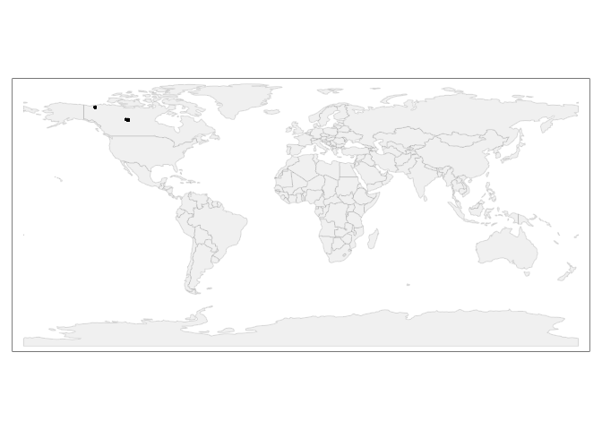
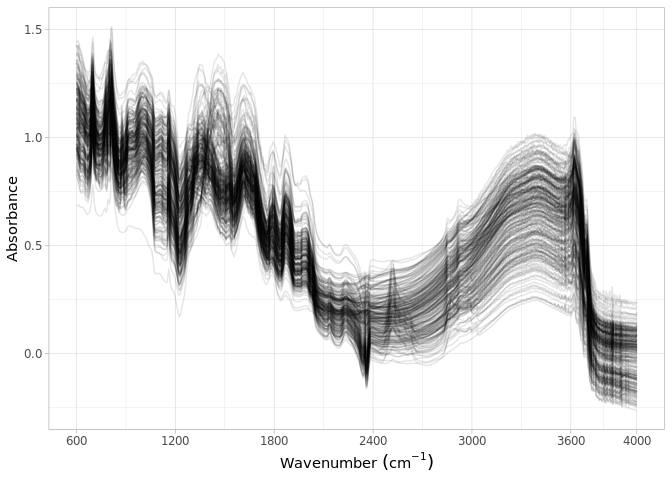

Dataset import: Schiedung et al. (2022)
================
Jose Lucas Safanelli (<jsafanelli@woodwellclimate.org>) and Jonathan
Sanderman (<jsanderman@woodwellclimate.org>)
30 September, 2022


-   [The Schiedung et al. (2022) Soil Spectral Library
    inputs](#the-schiedung-et-al-2022-soil-spectral-library-inputs)
-   [Data import](#data-import)
    -   [Soil site information](#soil-site-information)
    -   [Soil lab information](#soil-lab-information)
    -   [Mid-infrared spectroscopy
        data](#mid-infrared-spectroscopy-data)
    -   [Quality control](#quality-control)
    -   [Rendering report](#rendering-report)
-   [References](#references)

[](https://soilspectroscopy.org/)

[](http://creativecommons.org/licenses/by-sa/4.0/)

This work is licensed under a [Creative Commons Attribution-ShareAlike
4.0 International
License](http://creativecommons.org/licenses/by-sa/4.0/).

## The Schiedung et al. (2022) Soil Spectral Library inputs

Part of: <https://github.com/soilspectroscopy>  
Project: [Soil Spectroscopy for Global
Good](https://soilspectroscopy.org)  
Last update: 2022-09-30  
Dataset:
[SCHIEDUNG.SSL](https://soilspectroscopy.github.io/ossl-manual/soil-spectroscopy-tools-and-users.html)

Mid-Infrared Spectra (MIRS) from Schiedung et al. (2022) Soil Spectral
Library explained in detail in [Schiedung, Bellè, Malhotra, &
Abiven](#ref-Schiedung2022) ([2022](#ref-Schiedung2022)).

Directory/folder path:

``` r
dir = "/mnt/soilspec4gg/ossl/dataset/Schiedung/"
```

## Data import

The dataset was shared by email, but a public version is available at
Zenodo <https://doi.org/10.5281/zenodo.6024831>.

``` r
# Checking shared files
# list.files(dir)

# Checking column description
schiedung.desc <- read_xlsx(paste0(dir, "/Var_names_ID_DRIFT_all.xlsx"), sheet = 1)

# Reading site information
schiedung.info <- read_xlsx(paste0(dir, "/ID_DRIFT_all.xlsx"), sheet = 1)
# names(schiedung.info)
```

### Soil site information

``` r
# Formatting to OSSL standard

schiedung.soilsite <- schiedung.info %>% # Spectra ID is the merge of EUP, sample_point, and increment
  dplyr::mutate(id.layer_local_c = paste0(EUP, ".", sample_point, "_", increment), .before = 1) %>%
  dplyr::rename(longitude_wgs84_dd = Latitute_DD, latitude_wgs84_dd = Longitute_DD) %>% # Author confused columns
  dplyr::mutate(id.user.site_ascii_c = paste(EUP, sample_point, sep = "."), # Unique locations
                id.dataset.site_ascii_c = paste(EUP, sample_point, sep = ".")) %>%
  dplyr::select(id.layer_local_c, longitude_wgs84_dd, latitude_wgs84_dd,
                id.user.site_ascii_c, id.dataset.site_ascii_c) %>% # Adding missing metadata
  dplyr::mutate(id.layer_uuid_c = openssl::md5(id.layer_local_c),
                id.location_olc_c = olctools::encode_olc(latitude_wgs84_dd, longitude_wgs84_dd, 10),
                observation.ogc.schema.title_ogc_txt = 'Open Soil Spectroscopy Library',
                observation.ogc.schema_idn_url = 'https://soilspectroscopy.github.io',
                observation.date.begin_iso.8601_yyyy.mm.dd = "2019.07.01",
                observation.date.end_iso.8601_yyyy.mm.dd = "2019.08.31",
                location.address_utf8_txt = "North Canada",
                location.country_iso.3166_c = "CAN",
                location.method_any_c = "GPS",
                location.error_any_m = 5, # Check with Marcus
                surveyor.title_utf8_txt = "Marcus Schiedung",
                surveyor.contact_ietf_email = "marcus.schiedung@geo.uzh.ch",
                surveyor.address_utf8_txt = 'Department of Geography, University of Zurich, Winterthurerstrasse 190, 8057 Zurich, Switzerland',
                dataset.title_utf8_txt = 'Schiedung et al. (2022)',
                dataset.owner_utf8_txt = 'Schiedung et al. (2022)',
                dataset.code_ascii_txt = 'SCHIEDUNG.SSL',
                dataset.address_idn_url = 'https://zenodo.org/record/6024831',
                dataset.license.title_ascii_txt = 'CC-BY 4.0',
                dataset.license.address_idn_url = 'https://creativecommons.org/licenses/by/4.0/legalcode',
                dataset.doi_idf_c = 'https://doi.org/10.5281/zenodo.6024831',
                dataset.contact.name_utf8_txt = "Marcus Schiedung",
                dataset.contact.email_ietf_email = "marcus.schiedung@geo.uzh.ch",
                id.project_ascii_c = "SCHIEDUNG",
                pedon.taxa_usda_c = '') %>%
  dplyr::select(id.layer_uuid_c, # Following the sequence from ossl-manual
                id.layer_local_c,
                id.location_olc_c,
                observation.ogc.schema.title_ogc_txt,
                observation.ogc.schema_idn_url,
                observation.date.begin_iso.8601_yyyy.mm.dd,
                observation.date.end_iso.8601_yyyy.mm.dd,
                location.address_utf8_txt,
                location.country_iso.3166_c,
                location.method_any_c,
                surveyor.title_utf8_txt,
                surveyor.contact_ietf_email,
                surveyor.address_utf8_txt,
                longitude_wgs84_dd,
                latitude_wgs84_dd,
                location.error_any_m,
                dataset.title_utf8_txt,
                dataset.owner_utf8_txt,
                dataset.code_ascii_txt,
                dataset.address_idn_url,
                dataset.license.title_ascii_txt,
                dataset.license.address_idn_url,
                dataset.doi_idf_c,
                dataset.contact.name_utf8_txt,
                dataset.contact.email_ietf_email,
                id.dataset.site_ascii_c,
                id.user.site_ascii_c,
                id.project_ascii_c,
                pedon.taxa_usda_c)
```

Exporting soilsite data

``` r
soilsite.rds = paste0(dir, "/ossl_soilsite_v1.rds")
saveRDS(schiedung.soilsite, soilsite.rds)
```

### Soil lab information

``` r
# names(schiedung.info)

in.names <- c("BD_bulk", "BD_fine",
              "TN", "TC", "SOC",
              "pH_CaCl2_site", "EC_CaCl2_site", "eff_CEC_site",
              "clay_site", "silt_site", "sand_site")

out.names <- c("bd.core_iso.11272.2017_gcm3", "bd.od_usda.3b2_gcm3",
               "n.tot_iso.13878.1998_wpct", "c.tot_iso.10694.1995_wpct", "oc_iso.10694.1995_wpct",
               "ph.cacl2_usda.4c1_index", "ec.w_usda.4f1_dsm", "ecec_usda.4b4_cmolkg",
               "clay.tot_iso.11277.2020_wpct", "silt.tot_iso.11277.2020_wpct", "sand.tot_iso.11277.2020_wpct")

schiedung.soillab <- schiedung.info %>% # Spectra ID is the merge of EUP, sample_point, and increment
  dplyr::mutate(id.layer_local_c = paste0(EUP, ".", sample_point, "_", increment), .before = 1) %>%
  tidyr::separate(increment, into = c("layer.upper.depth_usda_cm", "layer.lower.depth_usda_cm"), sep = "-") %>%
  dplyr::mutate(layer.upper.depth_usda_cm = as.numeric(layer.upper.depth_usda_cm),
                layer.lower.depth_usda_cm = as.numeric(layer.lower.depth_usda_cm)) %>%
  dplyr::rename_with(~out.names, all_of(in.names)) %>%
  dplyr::select(id.layer_local_c, layer.upper.depth_usda_cm, layer.lower.depth_usda_cm, all_of(out.names)) %>%
  dplyr::mutate_at(vars(-id.layer_local_c), as.numeric) %>%
  dplyr::mutate(id.layer_uuid_c = openssl::md5(id.layer_local_c), .before = 1)
```

Exporting soillab data

``` r
soillab.rds = paste0(dir, "/ossl_soillab_v1.rds")
saveRDS(schiedung.soillab, soillab.rds)
```

### Mid-infrared spectroscopy data

Mid-infrared (MIR) soil spectroscopy raw data
(<https://doi.org/10.5281/zenodo.6024831>). Samples have different
spectral range, therefore two spectral sets were formatted and binded
together.

Spec1:

``` r
# excel_sheets(paste0(dir, "/Schiedung_opusimport.xlsx")) 

schiedung.spec1 <- read_xlsx(paste0(dir, "/Schiedung_opusimport.xlsx"), sheet = 1)
# schiedung.spec1 %>% pull(ID) # ID is the merge of EUP, sample_point, and increment

# First column names
names(schiedung.spec1[,1:10])
```

    ##  [1] "ID"                 "filename"           "3996.4059999999999" "3994.4780000000001" "3992.549"          
    ##  [6] "3990.62"            "3988.6909999999998" "3986.7629999999999" "3984.8339999999998" "3982.9050000000002"

``` r
# Removing filename column
schiedung.spec1 <- schiedung.spec1 %>%
  dplyr::select(-filename)

# Checking spectral range and resolution
spectra <- schiedung.spec1 %>%
  dplyr::select(-all_of(c("ID")))

old.spectral.range <- as.numeric(names(spectra))
cat("Spectral range between", range(old.spectral.range)[1], "and", range(old.spectral.range)[2], "cm-1 \n")
```

    ## Spectral range between 248.811 and 3996.406 cm-1

``` r
cat("Spectral resolution is", old.spectral.range[2]-old.spectral.range[1], "cm-1 \n")
```

    ## Spectral resolution is -1.928 cm-1

``` r
# Resampling to 600-4000 interval
new.spectral.range <- seq(4000, 600, by = -2)

new.spectra <- spectra %>%
  prospectr::resample(wav = old.spectral.range, new.wav = new.spectral.range, interpol = "spline") %>%
  tibble::as_tibble()

# Checking new range
cat("New spectral range between ", range(as.numeric(names(new.spectra))), "cm-1 \n")
```

    ## New spectral range between  600 4000 cm-1

``` r
# Preparing final spec 1
soilmir1 <- schiedung.spec1 %>%
  dplyr::select(all_of(c("ID"))) %>%
  dplyr::bind_cols(new.spectra) %>%
  dplyr::select(all_of(c("ID")), all_of(rev(as.character(new.spectral.range))))
```

Spec2:

``` r
# excel_sheets(paste0(dir, "/Schiedung_opusimport.xlsx")) 

schiedung.spec2 <- read_xlsx(paste0(dir, "/Schiedung_opusimport.xlsx"), sheet = 2)
# schiedung.spec2 %>% pull(ID) # ID is the merge of EUP, sample_point, and increment

# First column names
names(schiedung.spec2[,1:10])
```

    ##  [1] "ID"                 "filename"           "3996.4059999999999" "3994.4780000000001" "3992.549"          
    ##  [6] "3990.62"            "3988.6909999999998" "3986.7629999999999" "3984.8339999999998" "3982.9050000000002"

``` r
# Removing filename column
schiedung.spec2 <- schiedung.spec2 %>%
  dplyr::select(-filename)

# Checking spectral range and resolution
spectra <- schiedung.spec2 %>%
  dplyr::select(-all_of(c("ID")))

old.spectral.range <- as.numeric(names(spectra))
cat("Spectral range between", range(old.spectral.range)[1], "and", range(old.spectral.range)[2], "cm-1 \n")
```

    ## Spectral range between 399.2549 and 3996.406 cm-1

``` r
cat("Spectral resolution is", old.spectral.range[2]-old.spectral.range[1], "cm-1 \n")
```

    ## Spectral resolution is -1.928 cm-1

``` r
# Resampling to 600-4000 interval
new.spectral.range <- seq(4000, 600, by = -2)

new.spectra <- spectra %>%
  prospectr::resample(wav = old.spectral.range, new.wav = new.spectral.range, interpol = "spline") %>%
  tibble::as_tibble()

# Checking new range
cat("New spectral range between ", range(as.numeric(names(new.spectra))), "cm-1 \n")
```

    ## New spectral range between  600 4000 cm-1

``` r
# Preparing final spec 1
soilmir2 <- schiedung.spec2 %>%
  dplyr::select(all_of(c("ID"))) %>%
  dplyr::bind_cols(new.spectra) %>%
  dplyr::select(all_of(c("ID")), all_of(rev(as.character(new.spectral.range))))
```

Binding together and exporting:

``` r
schiedung.mir <- bind_rows(soilmir1, soilmir2) %>%
  dplyr::rename(id.layer_local_c = ID) %>%
  dplyr::mutate(id.layer_local_c = gsub("0-12", "0-15", id.layer_local_c)) %>%
  dplyr::mutate(id.layer_local_c = gsub("16-28", "15-30", id.layer_local_c)) %>%
  dplyr::mutate(id.layer_local_c = gsub("32-44", "30-45", id.layer_local_c)) %>%
  dplyr::mutate(id.layer_local_c = gsub("48-60", "45-60", id.layer_local_c)) %>%
  dplyr::mutate(id.layer_uuid_c = openssl::md5(id.layer_local_c), .before = 1)

soilmir.rds = paste0(dir, "/ossl_mir_v1.rds")
saveRDS(schiedung.mir, soilmir.rds)
```

### Quality control

Checking IDs:

``` r
# Checking if soil site ids are unique
table(duplicated(schiedung.soilsite$id.layer_uuid_c))
```

    ## 
    ## FALSE 
    ##   289

``` r
# Checking if soilab ids are compatible
table(schiedung.soilsite$id.layer_uuid_c %in% schiedung.soillab$id.layer_uuid_c)
```

    ## 
    ## TRUE 
    ##  289

``` r
# Checking if mir ids are compatible. In this case there 30 samples missing spectra
table(schiedung.soilsite$id.layer_local_c %in% schiedung.mir$id.layer_local_c)
```

    ## 
    ## FALSE  TRUE 
    ##    30   259

Plotting sites map:

``` r
data("World")

points <- schiedung.soilsite %>%
   st_as_sf(coords = c('longitude_wgs84_dd', 'latitude_wgs84_dd'), crs = 4326)

tmap_mode("plot")
```

    ## tmap mode set to plotting

``` r
tm_shape(World) +
  tm_polygons('#f0f0f0f0', border.alpha = 0.2) +
  tm_shape(points) +
  tm_dots()
```

<!-- -->

Soil analytical data summary:

``` r
schiedung.soillab %>%
  skimr::skim() %>%
  dplyr::select(-numeric.hist, -complete_rate)
```

    ## Warning: Couldn't find skimmers for class: hash, md5; No user-defined `sfl` provided. Falling back to `character`.

|                                                  |            |
|:-------------------------------------------------|:-----------|
| Name                                             | Piped data |
| Number of rows                                   | 289        |
| Number of columns                                | 15         |
| \_\_\_\_\_\_\_\_\_\_\_\_\_\_\_\_\_\_\_\_\_\_\_   |            |
| Column type frequency:                           |            |
| character                                        | 2          |
| numeric                                          | 13         |
| \_\_\_\_\_\_\_\_\_\_\_\_\_\_\_\_\_\_\_\_\_\_\_\_ |            |
| Group variables                                  | None       |

Data summary

**Variable type: character**

| skim\_variable     | n\_missing | min | max | empty | n\_unique | whitespace |
|:-------------------|-----------:|----:|----:|------:|----------:|-----------:|
| id.layer\_uuid\_c  |          0 |  32 |  32 |     0 |       289 |          0 |
| id.layer\_local\_c |          0 |   8 |  10 |     0 |       289 |          0 |

**Variable type: numeric**

| skim\_variable                 | n\_missing |  mean |    sd |    p0 |   p25 |   p50 |   p75 |  p100 |
|:-------------------------------|-----------:|------:|------:|------:|------:|------:|------:|------:|
| layer.upper.depth\_usda\_cm    |          0 | 18.48 | 16.14 |  0.00 |  0.00 | 15.00 | 30.00 | 45.00 |
| layer.lower.depth\_usda\_cm    |          0 | 33.48 | 16.14 | 15.00 | 15.00 | 30.00 | 45.00 | 60.00 |
| bd.core\_iso.11272.2017\_gcm3  |          0 |  1.34 |  0.26 |  0.38 |  1.23 |  1.39 |  1.52 |  1.93 |
| bd.od\_usda.3b2\_gcm3          |          0 |  1.27 |  0.25 |  0.38 |  1.17 |  1.33 |  1.44 |  1.72 |
| n.tot\_iso.13878.1998\_wpct    |         23 |  0.10 |  0.09 |  0.02 |  0.04 |  0.07 |  0.14 |  0.68 |
| c.tot\_iso.10694.1995\_wpct    |          0 |  1.79 |  1.97 |  0.00 |  0.53 |  1.24 |  2.38 | 15.68 |
| oc\_iso.10694.1995\_wpct       |          0 |  1.56 |  1.87 |  0.07 |  0.31 |  0.90 |  2.13 | 11.84 |
| ph.cacl2\_usda.4c1\_index      |         13 |  5.24 |  0.91 |  3.65 |  4.53 |  5.18 |  5.87 |  7.07 |
| ec.w\_usda.4f1\_dsm            |         13 |  2.32 |  0.03 |  2.25 |  2.31 |  2.32 |  2.34 |  2.41 |
| ecec\_usda.4b4\_cmolkg         |         49 | 11.34 |  7.96 |  1.99 |  4.47 |  9.70 | 17.67 | 30.72 |
| clay.tot\_iso.11277.2020\_wpct |         13 | 14.18 | 11.32 |  2.00 |  5.00 |  8.00 | 25.00 | 40.00 |
| silt.tot\_iso.11277.2020\_wpct |         13 | 30.47 | 18.68 |  3.00 | 15.00 | 28.00 | 50.00 | 66.00 |
| sand.tot\_iso.11277.2020\_wpct |         13 | 54.16 | 29.64 | 12.00 | 23.75 | 65.00 | 81.00 | 95.00 |

Spectral visualization:

``` r
schiedung.mir %>%
  tidyr::pivot_longer(-all_of(c("id.layer_uuid_c", "id.layer_local_c")), names_to = "wavenumber", values_to = "absorbance") %>%
  dplyr::mutate(wavenumber = as.numeric(wavenumber)) %>%
  ggplot(aes(x = wavenumber, y = absorbance, group = id.layer_local_c)) +
  geom_line(alpha = 0.1) +
  scale_x_continuous(breaks = c(600, 1200, 1800, 2400, 3000, 3600, 4000)) +
  labs(x = bquote("Wavenumber"~(cm^-1)), y = "Absorbance") +
  theme_light()
```

<!-- -->

### Rendering report

Exporting to md/html for GitHub.

``` r
rmarkdown::render("README.Rmd")
```

## References

<div id="refs" class="references csl-bib-body hanging-indent"
line-spacing="2">

<div id="ref-Schiedung2022" class="csl-entry">

Schiedung, M., Bellè, S.-L., Malhotra, A., & Abiven, S. (2022). Organic
carbon stocks, quality and prediction in permafrost-affected forest
soils in north canada. *CATENA*, *213*, 106194.
doi:[10.1016/j.catena.2022.106194](https://doi.org/10.1016/j.catena.2022.106194)

</div>

</div>
