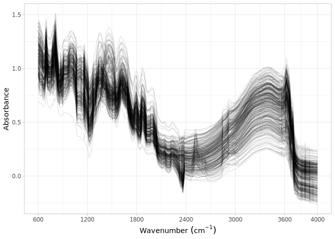

Dataset import: Schiedung et al. (2022)
================
Jose Lucas Safanelli (<jsafanelli@woodwellclimate.org>) and Jonathan
Sanderman (<jsanderman@woodwellclimate.org>)
01 December, 2022


-   [The Schiedung et al. (2022) Soil Spectral Library
    inputs](#the-schiedung-et-al-2022-soil-spectral-library-inputs)
-   [Data import](#data-import)
    -   [Soil site information](#soil-site-information)
    -   [Soil lab information](#soil-lab-information)
    -   [Mid-infrared spectroscopy
        data](#mid-infrared-spectroscopy-data)
    -   [Quality control](#quality-control)
-   [References](#references)

[](https://soilspectroscopy.org/)

[](http://creativecommons.org/licenses/by-sa/4.0/)

This work is licensed under a [Creative Commons Attribution-ShareAlike
4.0 International
License](http://creativecommons.org/licenses/by-sa/4.0/).

## The Schiedung et al. (2022) Soil Spectral Library inputs

Part of: <https://github.com/soilspectroscopy>  
Project: [Soil Spectroscopy for Global
Good](https://soilspectroscopy.org)  
Last update: 2022-12-01  
Dataset:
[SCHIEDUNG.SSL](https://soilspectroscopy.github.io/ossl-manual/soil-spectroscopy-tools-and-users.html#schiedung.ssl)

Mid-Infrared Spectra (MIRS) from Schiedung et al. (2022) representing
high-latitude forest soil data. The SSL explained in detail in
[Schiedung, Bellè, Malhotra, & Abiven](#ref-Schiedung2022)
([2022](#ref-Schiedung2022)).

The dataset was shared by email, but a public version is available at
Zenodo <https://doi.org/10.5281/zenodo.6024831>.

Input datasets:  
- `ID_DRIFT_all.xlsx`: excel file with site information;  
- `ID_DRIFT_all.xlsx`: csv file with soil information;  
- `Schiedung_opusimport.xlsx`: MIR spectral scans;

Directory/folder path:

``` r
dir = "/mnt/soilspec4gg/ossl/dataset/Schiedung/"
tic()
```

## Data import

### Soil site information

``` r
# Reading site information
schiedung.info <- read_xlsx(paste0(dir, "/ID_DRIFT_all.xlsx"), sheet = 1)

# Formatting to OSSL standard
schiedung.sitedata <- schiedung.info %>% # Spectra ID is the merge of EUP, sample_point, and increment
  dplyr::mutate(id.layer_local_c = paste0(EUP, ".", sample_point, "_", increment), .before = 1) %>%
  dplyr::rename(longitude.point_wgs84_dd = Latitute_DD, latitude.point_wgs84_dd = Longitute_DD) %>% # Author confused columns
  dplyr::mutate(id.dataset.site_ascii_c = paste(EUP, sample_point, sep = ".")) %>%
  dplyr::select(id.layer_local_c, longitude.point_wgs84_dd, latitude.point_wgs84_dd, id.dataset.site_ascii_c) %>%
  dplyr::mutate(id.layer_uuid_c = openssl::md5(id.layer_local_c),
                id.location_olc_c = olctools::encode_olc(latitude.point_wgs84_dd, longitude.point_wgs84_dd, 10),
                id.project_ascii_c = "High-latitude forest soil data",
                observation.ogc.schema.title_ogc_txt = 'Open Soil Spectroscopy Library',
                observation.ogc.schema_idn_url = 'https://soilspectroscopy.github.io',
                observation.date.begin_iso.8601_yyyy.mm.dd = "2019-07-01",
                observation.date.end_iso.8601_yyyy.mm.dd = "2019-08-31",
                pedon.taxa_usda_c = "",
                layer.texture_usda_c = "",
                horizon.designation_usda_c = "",
                longitude.county_wgs84_dd = NA,
                latitude.county_wgs84_dd = NA,
                location.address_utf8_txt = "North Canada",
                location.country_iso.3166_c = "CAN",
                location.error_any_m = 30,
                surveyor.title_utf8_txt = "Marcus Schiedung",
                surveyor.contact_ietf_email = "marcus.schiedung@geo.uzh.ch",
                surveyor.address_utf8_txt = 'University of Zurich, Winterthurerstrasse 190, 8057 Zurich, Switzerland',
                dataset.title_utf8_txt = 'Schiedung et al. (2022)',
                dataset.owner_utf8_txt = 'Schiedung et al. (2022)',
                dataset.code_ascii_txt = 'SCHIEDUNG.SSL',
                dataset.address_idn_url = 'https://zenodo.org/record/6024831',
                dataset.license.title_ascii_txt = 'CC-BY',
                dataset.license.address_idn_url = 'https://creativecommons.org/licenses/by/4.0/legalcode',
                dataset.doi_idf_c = 'https://doi.org/10.5281/zenodo.6024831',
                dataset.contact.name_utf8_txt = "Marcus Schiedung",
                dataset.contact.email_ietf_email = "marcus.schiedung@geo.uzh.ch") %>%
  dplyr::select(id.layer_uuid_c, # Following the sequence from ossl-manual
                id.layer_local_c,
                id.location_olc_c,
                id.dataset.site_ascii_c,
                id.project_ascii_c,
                observation.date.begin_iso.8601_yyyy.mm.dd,
                observation.date.end_iso.8601_yyyy.mm.dd,
                longitude.point_wgs84_dd,
                latitude.point_wgs84_dd,
                pedon.taxa_usda_c,
                layer.texture_usda_c,
                horizon.designation_usda_c,
                longitude.county_wgs84_dd,
                latitude.county_wgs84_dd,
                location.address_utf8_txt,
                location.country_iso.3166_c,
                location.error_any_m,
                observation.ogc.schema.title_ogc_txt,
                observation.ogc.schema_idn_url,
                surveyor.title_utf8_txt,
                surveyor.contact_ietf_email,
                surveyor.address_utf8_txt,
                dataset.title_utf8_txt,
                dataset.owner_utf8_txt,
                dataset.code_ascii_txt,
                dataset.address_idn_url,
                dataset.license.title_ascii_txt,
                dataset.license.address_idn_url,
                dataset.doi_idf_c,
                dataset.contact.name_utf8_txt,
                dataset.contact.email_ietf_email)

# Saving version to dataset root dir
site.qs = paste0(dir, "/ossl_soilsite_v1.2.qs")
qs::qsave(schiedung.sitedata, site.qs, preset = "high")
```

### Soil lab information

NOTE: The code chunk below this paragraph is hidden. Just run once for
getting the original names of soil properties, descriptions, data types,
and units. Run once and upload to Google Sheet for formatting and
integrating with the OSSL. Requires Google authentication.

<!-- ```{r, eval=FALSE, echo=TRUE} -->
<!-- # Checking shared files -->
<!-- # list.files(dir) -->
<!-- # Checking column description -->
<!-- schiedung.desc <- read_xlsx(paste0(dir, "/Var_names_ID_DRIFT_all.xlsx"), sheet = 1) -->
<!-- soillab.names <- schiedung.desc %>% -->
<!--   dplyr::rename(original_name = Variable, original_description = Description) %>% -->
<!--   dplyr::mutate(import = '', ossl_name = '', .after = original_name) %>% -->
<!--   dplyr::mutate(comment = '') -->
<!-- readr::write_csv(soillab.names, paste0(getwd(), "/schiedung_soillab_names.csv")) -->
<!-- # Uploading to google sheet -->
<!-- # FACT CIN folder. Get ID for soildata importing table -->
<!-- googledrive::drive_ls(as_id("0AHDIWmLAj40_Uk9PVA")) -->
<!-- OSSL.soildata.importing <- "19LeILz9AEnKVK7GK0ZbK3CCr2RfeP-gSWn5VpY8ETVM" -->
<!-- # Checking metadata -->
<!-- googlesheets4::as_sheets_id(OSSL.soildata.importing) -->
<!-- # Checking readme -->
<!-- googlesheets4::read_sheet(OSSL.soildata.importing, sheet = 'readme') -->
<!-- # Preparing soillab.names -->
<!-- upload <- dplyr::as_tibble(soillab.names) -->
<!-- # Uploading -->
<!-- googlesheets4::write_sheet(upload, ss = OSSL.soildata.importing, sheet = "Schiedung") -->
<!-- # Checking metadata -->
<!-- googlesheets4::as_sheets_id(OSSL.soildata.importing) -->
<!-- ``` -->

NOTE: The code chunk below this paragraph is hidden. Run once for
importing the transformation rules. The table can be edited online at
Google Sheets. A copy is downloaded to github for archiving.

<!-- ```{r soilab_download, include=FALSE, echo=FALSE, eval=FALSE} -->
<!-- # Downloading from google sheet -->
<!-- # FACT CIN folder id -->
<!-- listed.table <- googledrive::drive_ls(as_id("0AHDIWmLAj40_Uk9PVA"), -->
<!--                                       pattern = "OSSL_tab2_soildata_importing") -->
<!-- OSSL.soildata.importing <- listed.table[[1,"id"]] -->
<!-- # Checking metadata -->
<!-- googlesheets4::as_sheets_id(OSSL.soildata.importing) -->
<!-- # Preparing soillab.names -->
<!-- transvalues <- googlesheets4::read_sheet(OSSL.soildata.importing, sheet = "Schiedung") %>% -->
<!--   filter(import == TRUE) %>% -->
<!--   select(contains(c("table", "id", "original_name", "ossl_"))) -->
<!-- # Saving to folder -->
<!-- write_csv(transvalues, paste0(getwd(), "/OSSL_transvalues.csv")) -->
<!-- ``` -->

Reading AFSIS1-to-OSSL transformation values:

``` r
transvalues <- read_csv(paste0(getwd(), "/OSSL_transvalues.csv"))
knitr::kable(transvalues)
```

| original\_name  | ossl\_abbrev | ossl\_method | ossl\_unit | ossl\_convert                                      | ossl\_name                 |
|:----------------|:-------------|:-------------|:-----------|:---------------------------------------------------|:---------------------------|
| BD\_fine        | bd           | usda.a4      | g.cm3      | ifelse(as.numeric(x) &lt; 0, NA, as.numeric(x)\*1) | bd\_usda.a4\_g.cm3         |
| TN              | n.tot        | ISO.13878    | w.pct      | ifelse(as.numeric(x) &lt; 0, NA, as.numeric(x)\*1) | n.tot\_ISO.13878\_w.pct    |
| TC              | c.tot        | ISO.10694    | w.pct      | ifelse(as.numeric(x) &lt; 0, NA, as.numeric(x)\*1) | c.tot\_ISO.10694\_w.pct    |
| SOC             | oc           | ISO.10694    | w.pct      | ifelse(as.numeric(x) &lt; 0, NA, as.numeric(x)\*1) | oc\_ISO.10694\_w.pct       |
| pH\_CaCl2\_site | ph.cacl2     | ISO.10390    | index      | ifelse(as.numeric(x) &lt; 0, NA, as.numeric(x)\*1) | ph.cacl2\_ISO.10390\_index |
| EC\_CaCl2\_site | ec           | ISO.11265    | ds.m       | ifelse(as.numeric(x) &lt; 0, NA, as.numeric(x)\*1) | ec\_ISO.11265\_ds.m        |
| clay\_site      | clay.tot     | ISO.11277    | w.pct      | ifelse(as.numeric(x) &lt; 0, NA, as.numeric(x)\*1) | clay.tot\_ISO.11277\_w.pct |
| silt\_site      | silt.tot     | ISO.11277    | w.pct      | ifelse(as.numeric(x) &lt; 0, NA, as.numeric(x)\*1) | silt.tot\_ISO.11277\_w.pct |
| sand\_site      | sand.tot     | ISO.11277    | w.pct      | ifelse(as.numeric(x) &lt; 0, NA, as.numeric(x)\*1) | sand.tot\_ISO.11277\_w.pct |

``` r
# Reading soil information
schiedung.info <- read_xlsx(paste0(dir, "/ID_DRIFT_all.xlsx"), sheet = 1)

# Harmonization of names and units
analytes.old.names <- transvalues %>%
  pull(original_name)

analytes.new.names <- transvalues %>%
  pull(ossl_name)

# Selecting and renaming
schiedung.soildata <- schiedung.info %>%
  mutate(id.layer_local_c = paste0(EUP, ".", sample_point, "_", increment), .before = 1) %>%
  separate(increment, into = c("layer.upper.depth_usda_cm", "layer.lower.depth_usda_cm"), sep = "-") %>%
  mutate(layer.upper.depth_usda_cm = as.numeric(layer.upper.depth_usda_cm),
         layer.lower.depth_usda_cm = as.numeric(layer.lower.depth_usda_cm)) %>%
  select(id.layer_local_c, layer.upper.depth_usda_cm, layer.lower.depth_usda_cm, all_of(analytes.old.names)) %>%
  rename_with(~analytes.new.names, analytes.old.names) %>%
  mutate_at(vars(-id.layer_local_c), as.numeric) %>%
  as.data.frame()

# Removing duplicates
schiedung.soildata %>%
  group_by(id.layer_local_c) %>%
  summarise(repeats = n()) %>%
  group_by(repeats) %>%
  summarise(count = n())
```

    ## # A tibble: 1 × 2
    ##   repeats count
    ##     <int> <int>
    ## 1       1   289

``` r
# Getting the formulas
functions.list <- transvalues %>%
  mutate(ossl_name = factor(ossl_name, levels = names(schiedung.soildata))) %>%
  arrange(ossl_name) %>%
  pull(ossl_convert) %>%
  c("x", "x", "x", .)

# Applying transformation rules
schiedung.soildata.trans <- transform_values(df = schiedung.soildata,
                                             out.name = names(schiedung.soildata),
                                             in.name = names(schiedung.soildata),
                                             fun.lst = functions.list)

# Final soillab data
schiedung.soildata <- schiedung.soildata.trans

# Checking total number of observations
schiedung.soildata %>%
  distinct(id.layer_local_c) %>%
  summarise(count = n())
```

    ##   count
    ## 1   289

``` r
# Saving version to dataset root dir
soillab.qs = paste0(dir, "/ossl_soillab_v1.2.qs")
qs::qsave(schiedung.soildata, soillab.qs, preset = "high")
```

### Mid-infrared spectroscopy data

Mid-infrared (MIR) soil spectroscopy raw data
(<https://doi.org/10.5281/zenodo.6024831>). Samples have different
spectral range, therefore two spectral sets were formatted and binded
together.

``` r
# excel_sheets(paste0(dir, "/Schiedung_opusimport.xlsx"))

# First dataset
schiedung.spec1 <- read_xlsx(paste0(dir, "/Schiedung_opusimport.xlsx"), sheet = 1)
# schiedung.spec1 %>% pull(ID) # ID is the merge of EUP, sample_point, and increment

# Removing filename column
schiedung.spec1 <- schiedung.spec1 %>%
  select(-filename) %>%
  rename(id.layer_local_c = ID)

# Need to resample spectra
old.wavenumber <- na.omit(as.numeric(names(schiedung.spec1)))
new.wavenumbers <- rev(seq(600, 4000, by = 2))

schiedung.mir1 <- schiedung.spec1 %>%
  select(-id.layer_local_c) %>%
  as.matrix() %>%
  prospectr::resample(X = ., wav = old.wavenumber, new.wav = new.wavenumbers, interpol = "spline") %>%
  as_tibble() %>%
  bind_cols({schiedung.spec1 %>%
      select(id.layer_local_c)}, .) %>%
  select(id.layer_local_c, as.character(rev(new.wavenumbers)))

# Second dataset
schiedung.spec2 <- read_xlsx(paste0(dir, "/Schiedung_opusimport.xlsx"), sheet = 2)
# schiedung.spec2 %>% pull(ID) # ID is the merge of EUP, sample_point, and increment

# Removing filename column
schiedung.spec2 <- schiedung.spec2 %>%
  select(-filename) %>%
  rename(id.layer_local_c = ID)

# Need to resample spectra
old.wavenumber <- na.omit(as.numeric(names(schiedung.spec2)))
new.wavenumbers <- rev(seq(600, 4000, by = 2))

schiedung.mir2 <- schiedung.spec2 %>%
  select(-id.layer_local_c) %>%
  as.matrix() %>%
  prospectr::resample(X = ., wav = old.wavenumber, new.wav = new.wavenumbers, interpol = "spline") %>%
  as_tibble() %>%
  bind_cols({schiedung.spec2 %>%
      select(id.layer_local_c)}, .) %>%
  select(id.layer_local_c, as.character(rev(new.wavenumbers)))

# Binding together and exporting
schiedung.mir <- bind_rows(schiedung.mir1, schiedung.mir2) %>%
  dplyr::mutate(id.layer_local_c = gsub("0-12", "0-15", id.layer_local_c)) %>%
  dplyr::mutate(id.layer_local_c = gsub("16-28", "15-30", id.layer_local_c)) %>%
  dplyr::mutate(id.layer_local_c = gsub("32-44", "30-45", id.layer_local_c)) %>%
  dplyr::mutate(id.layer_local_c = gsub("48-60", "45-60", id.layer_local_c))

# Gaps
scans.na.gaps <- schiedung.mir %>%
  select(-id.layer_local_c) %>%
  apply(., 1, function(x) round(100*(sum(is.na(x)))/(length(x)), 2)) %>%
  tibble(proportion_NA = .) %>%
  bind_cols({schiedung.mir %>% select(id.layer_local_c)}, .)

# Extreme negative - irreversible erratic patterns
scans.extreme.neg <- schiedung.mir %>%
  select(-id.layer_local_c) %>%
  apply(., 1, function(x) {round(100*(sum(x < -1, na.rm=TRUE))/(length(x)), 2)}) %>%
  tibble(proportion_lower0 = .) %>%
  bind_cols({schiedung.mir %>% select(id.layer_local_c)}, .)

# Extreme positive, irreversible erratic patterns
scans.extreme.pos <- schiedung.mir %>%
  select(-id.layer_local_c) %>%
  apply(., 1, function(x) {round(100*(sum(x > 5, na.rm=TRUE))/(length(x)), 2)}) %>%
  tibble(proportion_higherAbs5 = .) %>%
  bind_cols({schiedung.mir %>% select(id.layer_local_c)}, .)

# Consistency summary - problematic scans
scans.summary <- scans.na.gaps %>%
  left_join(scans.extreme.neg, by = "id.layer_local_c") %>%
  left_join(scans.extreme.pos, by = "id.layer_local_c")

scans.summary %>%
  select(-id.layer_local_c) %>%
  pivot_longer(everything(), names_to = "check", values_to = "value") %>%
  filter(value > 0) %>%
  group_by(check) %>%
  summarise(count = n())
```

    ## # A tibble: 0 × 2
    ## # … with 2 variables: check <chr>, count <int>

``` r
# Renaming
old.wavenumbers <- seq(600, 4000, by = 2)
new.wavenumbers <- paste0("scan_mir.", old.wavenumbers, "_abs")

schiedung.mir <- schiedung.mir %>%
  rename_with(~new.wavenumbers, as.character(old.wavenumbers))

# Preparing metadata
schiedung.mir.metadata <- schiedung.mir %>%
  select(id.layer_local_c) %>%
  mutate(id.scan_local_c = id.layer_local_c) %>%
  mutate(scan.mir.date.begin_iso.8601_yyyy.mm.dd = ymd("2019-07-01"),
         scan.mir.date.end_iso.8601_yyyy.mm.dd = ymd("2019-08-31"),
         scan.mir.model.name_utf8_txt = "Bruker Tensor 27",
         scan.mir.model.code_any_c = "Bruker_Tensor_27",
         scan.mir.method.light.source_any_c = "",
         scan.mir.method.preparation_any_c = "",
         scan.mir.license.title_ascii_txt = "CC-BY",
         scan.mir.license.address_idn_url = "https://creativecommons.org/licenses/by/4.0/",
         scan.mir.doi_idf_c = 'https://doi.org/10.5281/zenodo.6024831',
         scan.mir.contact.name_utf8_txt = "Marcus Schiedung",
         scan.mir.contact.email_ietf_email = "marcus.schiedung@geo.uzh.ch")

# Final preparation
schiedung.mir.export <- schiedung.mir.metadata %>%
  left_join(schiedung.mir, by = "id.layer_local_c")

# Saving version to dataset root dir
soilmir.qs = paste0(dir, "/ossl_mir_v1.2.qs")
qs::qsave(schiedung.mir.export, soilmir.qs, preset = "high")
```

### Quality control

The final table must be joined as:

-   MIR is used as first reference.
-   Then it is left joined with the site and soil lab data. This drop
    data without any scan.

The availabilty of data is summarised below:

``` r
# Taking a few representative columns for checking the consistency of joins
schiedung.availability <- schiedung.mir %>%
  select(id.layer_local_c, scan_mir.600_abs) %>%
  left_join({schiedung.sitedata %>%
      select(id.layer_local_c, latitude.point_wgs84_dd)}, by = "id.layer_local_c") %>%
  left_join({schiedung.soildata %>%
      select(id.layer_local_c, ph.cacl2_ISO.10390_index)}, by = "id.layer_local_c") %>%
  filter(!is.na(id.layer_local_c))

# Availability of information from schiedung
schiedung.availability %>%
  mutate_all(as.character) %>%
  pivot_longer(everything(), names_to = "column", values_to = "value") %>%
  filter(!is.na(value)) %>%
  group_by(column) %>%
  summarise(count = n())
```

    ## # A tibble: 4 × 2
    ##   column                   count
    ##   <chr>                    <int>
    ## 1 id.layer_local_c           271
    ## 2 latitude.point_wgs84_dd    259
    ## 3 ph.cacl2_ISO.10390_index   250
    ## 4 scan_mir.600_abs           271

``` r
# Repeats check - Duplicates are dropped
schiedung.availability %>%
  mutate_all(as.character) %>%
  select(id.layer_local_c) %>%
  pivot_longer(everything(), names_to = "column", values_to = "value") %>%
  group_by(column, value) %>%
  summarise(repeats = n()) %>%
  group_by(column, repeats) %>%
  summarise(count = n())
```

    ## # A tibble: 1 × 3
    ## # Groups:   column [1]
    ##   column           repeats count
    ##   <chr>              <int> <int>
    ## 1 id.layer_local_c       1   271

Plotting sites map:

``` r
data("World")

points <- schiedung.sitedata %>%
  filter(!is.na(longitude.point_wgs84_dd)) %>%
  st_as_sf(coords = c('longitude.point_wgs84_dd', 'latitude.point_wgs84_dd'), crs = 4326)

tmap_mode("plot")

tm_shape(World) +
  tm_polygons('#f0f0f0f0', border.alpha = 0.2) +
  tm_shape(points) +
  tm_dots()
```

<!-- -->

Soil analytical data summary. Note: many scans could not be linked with
the wetchem.

``` r
schiedung.soildata %>%
  mutate(id.layer_local_c = factor(id.layer_local_c)) %>%
  skimr::skim() %>%
  dplyr::select(-numeric.hist, -complete_rate)
```

|                                                  |            |
|:-------------------------------------------------|:-----------|
| Name                                             | Piped data |
| Number of rows                                   | 289        |
| Number of columns                                | 12         |
| \_\_\_\_\_\_\_\_\_\_\_\_\_\_\_\_\_\_\_\_\_\_\_   |            |
| Column type frequency:                           |            |
| factor                                           | 1          |
| numeric                                          | 11         |
| \_\_\_\_\_\_\_\_\_\_\_\_\_\_\_\_\_\_\_\_\_\_\_\_ |            |
| Group variables                                  | None       |

Data summary

**Variable type: factor**

| skim\_variable     | n\_missing | ordered | n\_unique | top\_counts                    |
|:-------------------|-----------:|:--------|----------:|:-------------------------------|
| id.layer\_local\_c |          0 | FALSE   |       289 | 1.1: 1, 1.1: 1, 1.1: 1, 1.1: 1 |

**Variable type: numeric**

| skim\_variable              | n\_missing |  mean |    sd |    p0 |   p25 |   p50 |   p75 |  p100 |
|:----------------------------|-----------:|------:|------:|------:|------:|------:|------:|------:|
| layer.upper.depth\_usda\_cm |          0 | 18.48 | 16.14 |  0.00 |  0.00 | 15.00 | 30.00 | 45.00 |
| layer.lower.depth\_usda\_cm |          0 | 33.48 | 16.14 | 15.00 | 15.00 | 30.00 | 45.00 | 60.00 |
| bd\_usda.a4\_g.cm3          |          0 |  1.27 |  0.25 |  0.38 |  1.17 |  1.33 |  1.44 |  1.72 |
| n.tot\_ISO.13878\_w.pct     |         23 |  0.10 |  0.09 |  0.02 |  0.04 |  0.07 |  0.14 |  0.68 |
| c.tot\_ISO.10694\_w.pct     |          0 |  1.79 |  1.97 |  0.00 |  0.53 |  1.24 |  2.38 | 15.68 |
| oc\_ISO.10694\_w.pct        |          0 |  1.56 |  1.87 |  0.07 |  0.31 |  0.90 |  2.13 | 11.84 |
| ph.cacl2\_ISO.10390\_index  |         13 |  5.24 |  0.91 |  3.65 |  4.53 |  5.18 |  5.87 |  7.07 |
| ec\_ISO.11265\_ds.m         |         13 |  2.32 |  0.03 |  2.25 |  2.31 |  2.32 |  2.34 |  2.41 |
| clay.tot\_ISO.11277\_w.pct  |         13 | 14.18 | 11.32 |  2.00 |  5.00 |  8.00 | 25.00 | 40.00 |
| silt.tot\_ISO.11277\_w.pct  |         13 | 30.47 | 18.68 |  3.00 | 15.00 | 28.00 | 50.00 | 66.00 |
| sand.tot\_ISO.11277\_w.pct  |         13 | 54.16 | 29.64 | 12.00 | 23.75 | 65.00 | 81.00 | 95.00 |

MIR spectral visualization:

``` r
schiedung.mir %>%
  select(all_of(c("id.layer_local_c")), starts_with("scan_mir.")) %>%
  tidyr::pivot_longer(-all_of(c("id.layer_local_c")),
                      names_to = "wavenumber", values_to = "absorbance") %>%
  dplyr::mutate(wavenumber = gsub("scan_mir.|_abs", "", wavenumber)) %>%
  dplyr::mutate(wavenumber = as.numeric(wavenumber)) %>%
  ggplot(aes(x = wavenumber, y = absorbance, group = id.layer_local_c)) +
  geom_line(alpha = 0.1) +
  scale_x_continuous(breaks = c(600, 1200, 1800, 2400, 3000, 3600, 4000)) +
  labs(x = bquote("Wavenumber"~(cm^-1)), y = "Absorbance") +
  theme_light()
```

<!-- -->

``` r
toc()
```

    ## 9.401 sec elapsed

``` r
rm(list = ls())
gc()
```

    ##           used  (Mb) gc trigger  (Mb) max used  (Mb)
    ## Ncells 2579362 137.8    4659674 248.9  4659674 248.9
    ## Vcells 5477864  41.8   32023565 244.4 40029456 305.5

## References

<div id="refs" class="references csl-bib-body hanging-indent"
line-spacing="2">

<div id="ref-Schiedung2022" class="csl-entry">

Schiedung, M., Bellè, S.-L., Malhotra, A., & Abiven, S. (2022). Organic
carbon stocks, quality and prediction in permafrost-affected forest
soils in north canada. *CATENA*, *213*, 106194.
doi:[10.1016/j.catena.2022.106194](https://doi.org/10.1016/j.catena.2022.106194)

</div>

</div>
