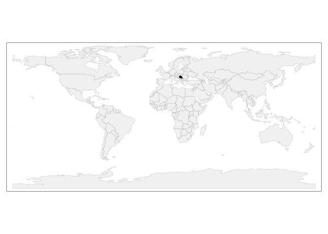
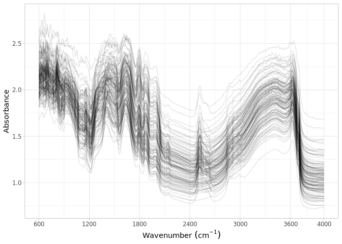

Dataset import: Serbian SSL
================
Jose Lucas Safanelli (<jsafanelli@woodwellclimate.org>) and Jonathan
Sanderman (<jsanderman@woodwellclimate.org>)
05 January, 2023


-   [The Serbian Soil Spectral Library
    inputs](#the-serbian-soil-spectral-library-inputs)
-   [Data import](#data-import)
    -   [Soil site information](#soil-site-information)
    -   [Soil lab information](#soil-lab-information)
    -   [Mid-infrared spectroscopy
        data](#mid-infrared-spectroscopy-data)
    -   [Quality control](#quality-control)
-   [References](#references)

[](https://soilspectroscopy.org/)

[](http://creativecommons.org/licenses/by-sa/4.0/)

This work is licensed under a [Creative Commons Attribution-ShareAlike
4.0 International
License](http://creativecommons.org/licenses/by-sa/4.0/).

## The Serbian Soil Spectral Library inputs

Part of: <https://github.com/soilspectroscopy>  
Project: [Soil Spectroscopy for Global
Good](https://soilspectroscopy.org)  
Last update: 2023-01-05  
Dataset:
[SERBIA.SSL](https://soilspectroscopy.github.io/ossl-manual/soil-spectroscopy-tools-and-users.html#serbia.ssl)

The Serbian SSL is a dataset with 135 samples shared by University of
Novi Sad and published in [Jović, Ćirić, Kovačević, Šeremešić, &
Kordić](#ref-Jovi2019) ([2019](#ref-Jovi2019)). The soil samples were
sampled in 2009. Samples were taken from three different types of soil:
arable, meadow, and forest, with 3 different depths: 0-30 cm, 30-60 cm
and 60-90 cm for each location (n=45). Classical wet chemistry analyses
includes texture, carbon total, carbon organic, carbon inorganic, pH,
C/N ratio, and CaCO3. Only texture has complete data for all depths, the
other soil properties were determined only for the 0-30 cm layer. The
spectra in the MIR range were taken for all depths using a ThermoFisher
Nicolet Nexus 670 with a DTGS detector, diffuse reflectance module, and
gold as background reference. MIR spectra were obtained in the spectral
range of 400-4000 cm-1 in duplicates. The coordinates of the sampling
sites are given with lower precision.

The dataset was shared by email, but a paper originated from the dataset
is available at <https://doi.org/10.1016/j.saa.2018.08.039>.

Input datasets:  
- `SSSL.xlsx`: excel file with soil/site, MIR, and ViSNIR (1100-2500 nm,
not imported).

Directory/folder path:

``` r
dir = "/mnt/soilspec4gg/ossl/dataset/Serbia/"
tic()
```

## Data import

### Soil site information

``` r
# Reading site information
serbia.info <- read_xlsx(paste0(dir, "/SSSL.xlsx"), sheet = 1)

# Formatting to OSSL standard
serbia.sitedata <- serbia.info %>%
  mutate(location_use = gsub(" - |- | -", "-", location_use)) %>%
  separate(depth_cm, into = c("layer.upper.depth_usda_cm", "layer.lower.depth_usda_cm"), sep = "-") %>%
  mutate(layer.upper.depth_usda_cm = as.numeric(layer.upper.depth_usda_cm),
         layer.lower.depth_usda_cm = as.numeric(layer.lower.depth_usda_cm)) %>%
  rename(id.layer_local_c = sample_id,
         id.dataset.site_ascii_txt = location_use,
         longitude.point_wgs84_dd = longitude,
         latitude.point_wgs84_dd = latitude,
         pedon.taxa_usda_txt = soil_type) %>%
  select(id.layer_local_c, id.dataset.site_ascii_txt, pedon.taxa_usda_txt,
         layer.upper.depth_usda_cm, layer.lower.depth_usda_cm,
         longitude.point_wgs84_dd, latitude.point_wgs84_dd) %>%
  mutate(pedon.taxa_usda_txt = case_when(pedon.taxa_usda_txt == "Arenosol" ~ "Psamments", # WRB to USDA Soil Taxonomy
                                         pedon.taxa_usda_txt == "Fluvisol" ~ "Fluvents",
                                         pedon.taxa_usda_txt == "Chernosem" ~ "Ustolls",
                                         pedon.taxa_usda_txt == "Vertisol" ~ "Xererts",
                                         pedon.taxa_usda_txt == "Solonetz" ~ "Xeralfs",
                                         TRUE ~ NA_character_),
         horizon.designation_usda_txt = case_when(layer.upper.depth_usda_cm == 0 ~ 1,
                                                  layer.upper.depth_usda_cm == 30 ~ 2,
                                                  layer.upper.depth_usda_cm == 60 ~ 3,
                                                  TRUE ~ NA_real_)) %>%
  mutate(id.project_ascii_txt = "Serbian SSL",
         observation.ogc.schema.title_ogc_txt = 'Open Soil Spectroscopy Library',
         observation.ogc.schema_idn_url = 'https://soilspectroscopy.github.io',
         observation.date.begin_iso.8601_yyyy.mm.dd = "2019-01-01",
         observation.date.end_iso.8601_yyyy.mm.dd = "2019-12-31",
         layer.texture_usda_txt = "",
         longitude.county_wgs84_dd = NA,
         latitude.county_wgs84_dd = NA,
         location.country_iso.3166_txt = "SRB",
         location.point.error_any_m = 111,
         surveyor.title_utf8_txt = "Branislav Jović",
         surveyor.contact_ietf_email = "branislav.jovic@dh.uns.ac.rs",
         surveyor.address_utf8_txt = 'Faculty of Science, University of Novi Sad, Serbia',
         dataset.title_utf8_txt = 'Jović et al. (2019)',
         dataset.owner_utf8_txt = 'Jović et al. (2019)',
         dataset.code_ascii_txt = 'SERBIA.SSL',
         dataset.address_idn_url = 'https://doi.org/10.1016/j.saa.2018.08.039',
         dataset.license.title_ascii_txt = 'CC-BY',
         dataset.license.address_idn_url = 'https://creativecommons.org/licenses/by/4.0/legalcode',
         dataset.doi_idf_url = 'https://doi.org/10.1016/j.saa.2018.08.039',
         dataset.contact.name_utf8_txt = "Branislav Jović",
         dataset.contact_ietf_email = "branislav.jovic@dh.uns.ac.rs") %>%
  mutate(id.layer_uuid_txt = openssl::md5(paste0(dataset.code_ascii_txt, id.layer_local_c)),
         id.location_olc_txt = olctools::encode_olc(latitude.point_wgs84_dd, longitude.point_wgs84_dd, 10),
         .after = id.project_ascii_txt) %>%
  dplyr::select(id.layer_uuid_txt,
                id.layer_local_c,
                id.location_olc_txt,
                id.dataset.site_ascii_txt,
                id.project_ascii_txt,
                observation.date.begin_iso.8601_yyyy.mm.dd,
                observation.date.end_iso.8601_yyyy.mm.dd,
                longitude.point_wgs84_dd,
                latitude.point_wgs84_dd,
                pedon.taxa_usda_txt,
                layer.texture_usda_txt,
                horizon.designation_usda_txt,
                longitude.county_wgs84_dd,
                latitude.county_wgs84_dd,
                location.country_iso.3166_txt,
                location.point.error_any_m,
                observation.ogc.schema.title_ogc_txt,
                observation.ogc.schema_idn_url,
                surveyor.title_utf8_txt,
                surveyor.contact_ietf_email,
                surveyor.address_utf8_txt,
                dataset.title_utf8_txt,
                dataset.owner_utf8_txt,
                dataset.code_ascii_txt,
                dataset.address_idn_url,
                dataset.license.title_ascii_txt,
                dataset.license.address_idn_url,
                dataset.doi_idf_url,
                dataset.contact.name_utf8_txt,
                dataset.contact_ietf_email) %>%
  mutate_at(vars(starts_with("id.")), as.character)

# Saving version to dataset root dir
site.qs = paste0(dir, "/ossl_soilsite_v1.2.qs")
qs::qsave(serbia.sitedata, site.qs, preset = "high")
```

### Soil lab information

NOTE: The code chunk below this paragraph is hidden. Just run once for
getting the original names of soil properties, descriptions, data types,
and units. Run once and upload to Google Sheet for formatting and
integrating with the OSSL. Requires Google authentication.

<!-- ```{r, eval=FALSE, echo=TRUE} -->
<!-- # Checking shared files -->
<!-- list.files(dir) -->
<!-- # Checking column description -->
<!-- serbia.soil <- read_xlsx(paste0(dir, "/SSSL.xlsx"), sheet = 1) -->
<!-- soillab.names <- serbia.soil %>% -->
<!--   names(.) %>% -->
<!--   tibble(original_name = .) %>% -->
<!--   dplyr::mutate(table = 'SSSL.xlsx', .before = 1) %>% -->
<!--   dplyr::mutate(import = '', ossl_name = '', .after = original_name) %>% -->
<!--   dplyr::mutate(comment = '') -->
<!-- readr::write_csv(soillab.names, paste0(getwd(), "/serbia_soillab_names.csv")) -->
<!-- # Uploading to google sheet -->
<!-- # FACT CIN folder. Get ID for soildata importing table -->
<!-- googledrive::drive_ls(as_id("0AHDIWmLAj40_Uk9PVA")) -->
<!-- OSSL.soildata.importing <- "19LeILz9AEnKVK7GK0ZbK3CCr2RfeP-gSWn5VpY8ETVM" -->
<!-- # Checking metadata -->
<!-- googlesheets4::as_sheets_id(OSSL.soildata.importing) -->
<!-- # Checking readme -->
<!-- googlesheets4::read_sheet(OSSL.soildata.importing, sheet = 'readme') -->
<!-- # Preparing soillab.names -->
<!-- upload <- dplyr::as_tibble(soillab.names) -->
<!-- # Uploading -->
<!-- googlesheets4::write_sheet(upload, ss = OSSL.soildata.importing, sheet = "Serbia") -->
<!-- # Checking metadata -->
<!-- googlesheets4::as_sheets_id(OSSL.soildata.importing) -->
<!-- ``` -->

NOTE: The code chunk below this paragraph is hidden. Run once for
importing the transformation rules. The table can be edited online at
Google Sheets. A copy is downloaded to github for archiving.

<!-- ```{r soilab_download, include=FALSE, echo=FALSE, eval=FALSE} -->
<!-- # Downloading from google sheet -->
<!-- # FACT CIN folder id -->
<!-- listed.table <- googledrive::drive_ls(as_id("0AHDIWmLAj40_Uk9PVA"), -->
<!--                                       pattern = "OSSL_tab2_soildata_importing") -->
<!-- OSSL.soildata.importing <- listed.table[[1,"id"]] -->
<!-- # Checking metadata -->
<!-- googlesheets4::as_sheets_id(OSSL.soildata.importing) -->
<!-- # Preparing soillab.names -->
<!-- transvalues <- googlesheets4::read_sheet(OSSL.soildata.importing, sheet = "Serbia") %>% -->
<!--   filter(import == TRUE) %>% -->
<!--   select(contains(c("table", "id", "original_name", "ossl_"))) -->
<!-- # Saving to folder -->
<!-- write_csv(transvalues, paste0(getwd(), "/OSSL_transvalues.csv")) -->
<!-- ``` -->

Reading transformation values:

``` r
transvalues <- read_csv(paste0(getwd(), "/OSSL_transvalues.csv"))
knitr::kable(transvalues)
```

| table     | original\_name     | ossl\_abbrev | ossl\_method | ossl\_unit | ossl\_convert                                      | ossl\_name                 |
|:----------|:-------------------|:-------------|:-------------|:-----------|:---------------------------------------------------|:---------------------------|
| SSSL.xlsx | silt\_perc         | silt.tot     | usda.c62     | w.pct      | ifelse(as.numeric(x) &lt; 0, NA, as.numeric(x)\*1) | silt.tot\_usda.c62\_w.pct  |
| SSSL.xlsx | clay\_perc         | clay.tot     | usda.a334    | w.pct      | ifelse(as.numeric(x) &lt; 0, NA, as.numeric(x)\*1) | clay.tot\_usda.a334\_w.pct |
| SSSL.xlsx | sand\_perc         | sand.tot     | usda.c60     | w.pct      | ifelse(as.numeric(x) &lt; 0, NA, as.numeric(x)\*1) | sand.tot\_usda.c60\_w.pct  |
| SSSL.xlsx | carbon\_tot\_gkg   | c.tot        | usda.a622    | w.pct      | ifelse(as.numeric(x) &lt; 0, NA, as.numeric(x)/10) | c.tot\_usda.a622\_w.pct    |
| SSSL.xlsx | carbon\_org\_gkg   | oc           | usda.c729    | w.pct      | ifelse(as.numeric(x) &lt; 0, NA, as.numeric(x)/10) | oc\_usda.c729\_w.pct       |
| SSSL.xlsx | ph                 | ph.h2o       | usda.a268    | index      | ifelse(as.numeric(x) &lt; 0, NA, as.numeric(x)\*1) | ph.h2o\_usda.a268\_index   |
| SSSL.xlsx | nitrogen\_tot\_gkg | n.tot        | usda.a623    | w.pct      | ifelse(as.numeric(x) &lt; 0, NA, as.numeric(x)/10) | n.tot\_usda.a623\_w.pct    |
| SSSL.xlsx | caco3\_gkg         | caco3        | usda.a54     | w.pct      | ifelse(as.numeric(x) &lt; 0, NA, as.numeric(x)/10) | caco3\_usda.a54\_w.pct     |

``` r
# Reading soil information
serbia.info <- read_xlsx(paste0(dir, "/SSSL.xlsx"), sheet = 1)

# Harmonization of names and units
analytes.old.names <- transvalues %>%
  pull(original_name)

analytes.new.names <- transvalues %>%
  pull(ossl_name)

# Selecting and renaming
serbia.soildata <- serbia.info %>%
  rename(id.layer_local_c = sample_id) %>%
  select(id.layer_local_c, all_of(analytes.old.names)) %>%
  rename_with(~analytes.new.names, analytes.old.names) %>%
  mutate_at(vars(-id.layer_local_c), as.numeric) %>%
  as.data.frame()

# Removing duplicates
serbia.soildata %>%
  group_by(id.layer_local_c) %>%
  summarise(repeats = n()) %>%
  group_by(repeats) %>%
  summarise(count = n())
```

    ## # A tibble: 1 × 2
    ##   repeats count
    ##     <int> <int>
    ## 1       1   135

``` r
# Getting the formulas
functions.list <- transvalues %>%
  mutate(ossl_name = factor(ossl_name, levels = names(serbia.soildata))) %>%
  arrange(ossl_name) %>%
  pull(ossl_convert) %>%
  c("x", .)

# Applying transformation rules
serbia.soildata.trans <- transform_values(df = serbia.soildata,
                                          out.name = names(serbia.soildata),
                                          in.name = names(serbia.soildata),
                                          fun.lst = functions.list) %>%
  mutate(oc_usda.c729_w.pct = c.tot_usda.a622_w.pct-0.12*caco3_usda.a54_w.pct)

# Final soillab data
serbia.soildata <- serbia.soildata.trans %>%
  mutate_at(vars(starts_with("id.")), as.character)

# Checking total number of observations
serbia.soildata %>%
  distinct(id.layer_local_c) %>%
  summarise(count = n())
```

    ##   count
    ## 1   135

``` r
# Saving version to dataset root dir
soillab.qs = paste0(dir, "/ossl_soillab_v1.2.qs")
qs::qsave(serbia.soildata, soillab.qs, preset = "high")
```

### Mid-infrared spectroscopy data

Mid-infrared (MIR) soil spectroscopy raw data. Needs to be harmonized to
600-4000 cm<sup>-1</sup> range with 2 cm<sup>-1</sup> interval.

``` r
# Dataset
serbia.spec <- read_xlsx(paste0(dir, "/SSSL.xlsx"), sheet = 2)

# Renaming
serbia.spec <- serbia.spec %>%
  rename(id.layer_local_c = sample_id)

# Need to resample spectra
old.wavenumber <- na.omit(as.numeric(names(serbia.spec)))
new.wavenumbers <- seq(600, 4000, by = 2)

serbia.mir <- serbia.spec %>%
  select(-id.layer_local_c) %>%
  as.matrix() %>%
  prospectr::resample(X = ., wav = old.wavenumber, new.wav = new.wavenumbers, interpol = "spline") %>%
  as_tibble() %>%
  bind_cols({serbia.spec %>%
      select(id.layer_local_c)}, .) %>%
  select(id.layer_local_c, as.character(new.wavenumbers))

# Gaps
scans.na.gaps <- serbia.mir %>%
  select(-id.layer_local_c) %>%
  apply(., 1, function(x) round(100*(sum(is.na(x)))/(length(x)), 2)) %>%
  tibble(proportion_NA = .) %>%
  bind_cols({serbia.mir %>% select(id.layer_local_c)}, .)

# Extreme negative - irreversible erratic patterns
scans.extreme.neg <- serbia.mir %>%
  select(-id.layer_local_c) %>%
  apply(., 1, function(x) {round(100*(sum(x < -1, na.rm=TRUE))/(length(x)), 2)}) %>%
  tibble(proportion_lower0 = .) %>%
  bind_cols({serbia.mir %>% select(id.layer_local_c)}, .)

# Extreme positive, irreversible erratic patterns
scans.extreme.pos <- serbia.mir %>%
  select(-id.layer_local_c) %>%
  apply(., 1, function(x) {round(100*(sum(x > 5, na.rm=TRUE))/(length(x)), 2)}) %>%
  tibble(proportion_higherAbs5 = .) %>%
  bind_cols({serbia.mir %>% select(id.layer_local_c)}, .)

# Consistency summary - problematic scans
scans.summary <- scans.na.gaps %>%
  left_join(scans.extreme.neg, by = "id.layer_local_c") %>%
  left_join(scans.extreme.pos, by = "id.layer_local_c")

scans.summary %>%
  select(-id.layer_local_c) %>%
  pivot_longer(everything(), names_to = "check", values_to = "value") %>%
  filter(value > 0) %>%
  group_by(check) %>%
  summarise(count = n())
```

    ## # A tibble: 0 × 2
    ## # … with 2 variables: check <chr>, count <int>

``` r
# Renaming
old.wavenumbers <- seq(600, 4000, by = 2)
new.wavenumbers <- paste0("scan_mir.", old.wavenumbers, "_abs")

serbia.mir <- serbia.mir %>%
  rename_with(~new.wavenumbers, as.character(old.wavenumbers)) %>%
  mutate(id.layer_local_c = as.character(id.layer_local_c))

# Preparing metadata
serbia.mir.metadata <- serbia.mir %>%
  select(id.layer_local_c) %>%
  mutate(id.scan_local_c = id.layer_local_c) %>%
  mutate(scan.mir.date.begin_iso.8601_yyyy.mm.dd = ymd("2019-01-01"),
         scan.mir.date.end_iso.8601_yyyy.mm.dd = ymd("2019-12-31"),
         scan.mir.model.name_utf8_txt = "ThermoFisher Nicolet Nexus 670",
         scan.mir.model.code_any_txt = "ThermoFisher_Nicolet_Nexus_670",
         scan.mir.method.optics_any_txt = "DTGS detector; DRIFT accessory; Gold background",
         scan.mir.method.preparation_any_txt = "Finelly ground <80 mesh",
         scan.mir.license.title_ascii_txt = "CC-BY",
         scan.mir.license.address_idn_url = "https://creativecommons.org/licenses/by/4.0/",
         scan.mir.doi_idf_url = 'https://doi.org/10.1016/j.saa.2018.08.039',
         scan.mir.contact.name_utf8_txt = "Branislav Jović",
         scan.mir.contact.email_ietf_txt = "branislav.jovic@dh.uns.ac.rs")

# Final preparation
serbia.mir.export <- serbia.mir.metadata %>%
  left_join(serbia.mir, by = "id.layer_local_c") %>%
  mutate_at(vars(starts_with("id.")), as.character)

# Saving version to dataset root dir
soilmir.qs = paste0(dir, "/ossl_mir_v1.2.qs")
qs::qsave(serbia.mir.export, soilmir.qs, preset = "high")
```

### Quality control

The final table must be joined as:

-   MIR is used as first reference.
-   Then it is left joined with the site and soil lab data. This drop
    data without any scan.

The availability of data is summarized below:

``` r
# Taking a few representative columns for checking the consistency of joins
serbia.availability <- serbia.mir.export %>%
  select(id.layer_local_c, scan_mir.600_abs) %>%
  left_join({serbia.sitedata %>%
      select(id.layer_local_c, latitude.point_wgs84_dd)}, by = "id.layer_local_c") %>%
  left_join({serbia.soildata %>%
      select(id.layer_local_c, clay.tot_usda.a334_w.pct)}, by = "id.layer_local_c") %>%
  filter(!is.na(id.layer_local_c))

# Availability of information from serbia
serbia.availability %>%
  mutate_all(as.character) %>%
  pivot_longer(everything(), names_to = "column", values_to = "value") %>%
  filter(!is.na(value)) %>%
  group_by(column) %>%
  summarise(count = n())
```

    ## # A tibble: 4 × 2
    ##   column                   count
    ##   <chr>                    <int>
    ## 1 clay.tot_usda.a334_w.pct   135
    ## 2 id.layer_local_c           135
    ## 3 latitude.point_wgs84_dd    135
    ## 4 scan_mir.600_abs           135

``` r
# Repeats check - Duplicates are dropped
serbia.availability %>%
  mutate_all(as.character) %>%
  select(id.layer_local_c) %>%
  pivot_longer(everything(), names_to = "column", values_to = "value") %>%
  group_by(column, value) %>%
  summarise(repeats = n()) %>%
  group_by(column, repeats) %>%
  summarise(count = n())
```

    ## # A tibble: 1 × 3
    ## # Groups:   column [1]
    ##   column           repeats count
    ##   <chr>              <int> <int>
    ## 1 id.layer_local_c       1   135

Plotting sites map:

``` r
data("World")

points <- serbia.sitedata %>%
  filter(!is.na(longitude.point_wgs84_dd)) %>%
  st_as_sf(coords = c('longitude.point_wgs84_dd', 'latitude.point_wgs84_dd'), crs = 4326)

tmap_mode("plot")

tm_shape(World) +
  tm_polygons('#f0f0f0f0', border.alpha = 0.2) +
  tm_shape(points) +
  tm_dots()
```

<!-- -->

Soil analytical data summary. Note: many scans could not be linked with
the wetchem.

``` r
serbia.soildata %>%
  mutate(id.layer_local_c = factor(id.layer_local_c)) %>%
  skimr::skim() %>%
  dplyr::select(-numeric.hist, -complete_rate)
```

|                                                  |            |
|:-------------------------------------------------|:-----------|
| Name                                             | Piped data |
| Number of rows                                   | 135        |
| Number of columns                                | 9          |
| \_\_\_\_\_\_\_\_\_\_\_\_\_\_\_\_\_\_\_\_\_\_\_   |            |
| Column type frequency:                           |            |
| factor                                           | 1          |
| numeric                                          | 8          |
| \_\_\_\_\_\_\_\_\_\_\_\_\_\_\_\_\_\_\_\_\_\_\_\_ |            |
| Group variables                                  | None       |

Data summary

**Variable type: factor**

| skim\_variable     | n\_missing | ordered | n\_unique | top\_counts                 |
|:-------------------|-----------:|:--------|----------:|:----------------------------|
| id.layer\_local\_c |          0 | FALSE   |       135 | 1: 1, 10: 1, 100: 1, 103: 1 |

**Variable type: numeric**

| skim\_variable             | n\_missing |  mean |    sd |   p0 |   p25 |   p50 |   p75 |  p100 |
|:---------------------------|-----------:|------:|------:|-----:|------:|------:|------:|------:|
| silt.tot\_usda.c62\_w.pct  |          0 | 25.35 | 12.61 | 1.23 | 15.04 | 27.83 | 35.60 | 53.39 |
| clay.tot\_usda.a334\_w.pct |          0 | 27.61 | 13.54 | 5.53 | 15.95 | 27.43 | 36.92 | 60.81 |
| sand.tot\_usda.c60\_w.pct  |          0 | 47.13 | 23.87 | 9.03 | 28.84 | 38.65 | 68.61 | 92.27 |
| c.tot\_usda.a622\_w.pct    |         90 |  3.47 |  1.49 | 1.43 |  2.15 |  2.99 |  4.79 |  7.06 |
| oc\_usda.c729\_w.pct       |         90 |  2.83 |  0.97 | 1.30 |  2.12 |  2.67 |  3.33 |  5.02 |
| ph.h2o\_usda.a268\_index   |         90 |  7.41 |  0.87 | 5.38 |  6.77 |  7.80 |  7.97 |  9.18 |
| n.tot\_usda.a623\_w.pct    |         90 |  0.19 |  0.11 | 0.05 |  0.12 |  0.19 |  0.24 |  0.49 |
| caco3\_usda.a54\_w.pct     |         90 |  5.33 |  6.54 | 0.00 |  0.00 |  2.19 | 10.11 | 21.99 |

MIR spectral visualization:

``` r
serbia.mir %>%
  select(all_of(c("id.layer_local_c")), starts_with("scan_mir.")) %>%
  tidyr::pivot_longer(-all_of(c("id.layer_local_c")),
                      names_to = "wavenumber", values_to = "absorbance") %>%
  dplyr::mutate(wavenumber = gsub("scan_mir.|_abs", "", wavenumber)) %>%
  dplyr::mutate(wavenumber = as.numeric(wavenumber)) %>%
  ggplot(aes(x = wavenumber, y = absorbance, group = id.layer_local_c)) +
  geom_line(alpha = 0.1) +
  scale_x_continuous(breaks = c(600, 1200, 1800, 2400, 3000, 3600, 4000)) +
  labs(x = bquote("Wavenumber"~(cm^-1)), y = "Absorbance") +
  theme_light()
```

<!-- -->

``` r
toc()
```

    ## 5.934 sec elapsed

``` r
rm(list = ls())
gc()
```

    ##           used  (Mb) gc trigger  (Mb) max used  (Mb)
    ## Ncells 2575629 137.6    4741148 253.3  4741148 253.3
    ## Vcells 4779091  36.5   20254805 154.6 20234603 154.4

## References

<div id="refs" class="references csl-bib-body hanging-indent"
line-spacing="2">

<div id="ref-Jovi2019" class="csl-entry">

Jović, B., Ćirić, V., Kovačević, M., Šeremešić, S., & Kordić, B. (2019).
Empirical equation for preliminary assessment of soil texture.
*Spectrochimica Acta Part A: Molecular and Biomolecular Spectroscopy*,
*206*, 506–511.
doi:[10.1016/j.saa.2018.08.039](https://doi.org/10.1016/j.saa.2018.08.039)

</div>

</div>
