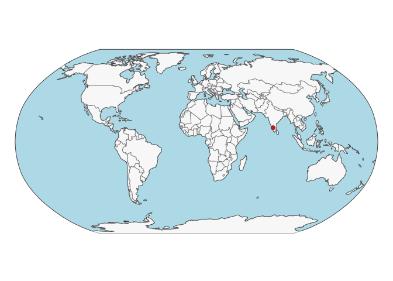
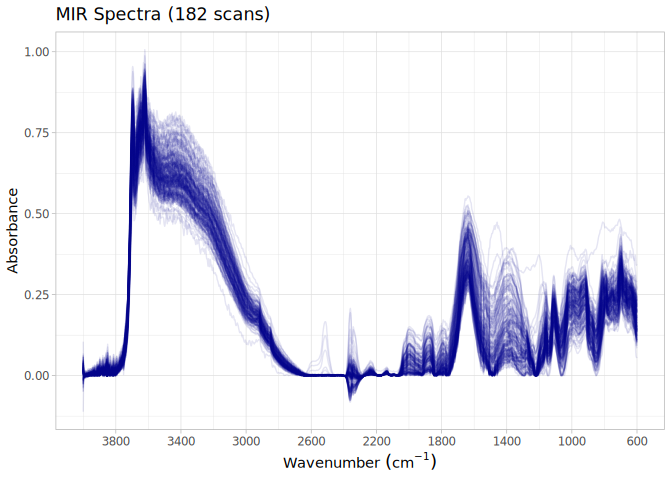

# Spectra from Watershed soils of Southwestern India
Ran Zhi, Jose L. Safanelli, Jonathan Sanderman

- [The Southwestern India original
  data](#the-southwestern-india-original-data)
- [Data standardization to the OSSL
  format](#data-standardization-to-the-ossl-format)
  - [Site information](#site-information)
  - [Soil lab information (reference analytical
    data)](#soil-lab-information-reference-analytical-data)
  - [Mid-infrared spectra (MIR)](#mid-infrared-spectra-mir)
  - [Quality control](#quality-control)
- [References](#references)

Code repository for preparing and importing the Southwestern India
(WS_SWIND) dataset into the Open Soil Spectral Library.

Website: [Soil Spectroscopy for Global
Good](https://soilspectroscopy.org)  
Development: <https://github.com/soilspectroscopy>  
Last update: 2026-04-30  
Additional documentation:

## The Southwestern India original data

Site data, Soil lab data, and Mid-Infrared Spectra (MIR) from
small-scale tropical, sub-humid and semi-arid watersheds under shrubland
and dry deciduous forest in Southwestern India. Further information of
the dataset can be found in detail at Bellè et al.
([2022](#ref-Bell2022)).

Original files:  
- `20211111_MS_SOC_Stock_India_data_raw.csv`: csv file with site
information and soil information. - `20211111_DRFT_data`: a folder has
MIR spectral data through Diffuse Reflectance Infrared
Fourier-Transformed (DRIFT) spectroscopy.

Directory/folder path with original files (not uploaded to GitHub).

``` r
# dir = "/Users/rzhi/Projects/git/ossl-imports-internal/dataset/South India"
dir = "~/mnt-ossl-private/database/datasets/WS_SWIND/"
tic()
```

## Data standardization to the OSSL format

### Site information

``` r
india.rawdata <- fread(path(dir, "20211111_MS_SOC_Stock_India_data_raw.csv"), header = T)
india.compdata <- fread(path(dir, "20211111_MS_SOC_Stock_India_data_composites.csv"), header = T)

india.metadata <- india.rawdata %>%
  left_join(india.compdata, by = c("Site", "Depth")) %>%
  mutate(sample_id = paste(Site, Pit, Depth, sep = "_")) 

india.sitedata <- india.metadata %>%
  select(sample_id, Site, Pit, Depth) %>%
  separate(Depth, 
           into = c("layer.upper.depth_usda_cm", "layer.lower.depth_usda_cm"), 
           sep = "-", 
           convert = TRUE, 
           remove = FALSE) %>%
  select(-Depth) %>%
  rename(id.layer_local_c = sample_id,
         site.id_src_txt = Site,
         site.pit_src_txt = Pit) %>%
  mutate(across(c("id.layer_local_c","site.id_src_txt","site.pit_src_txt"), as.character)) %>%
  # mutate(id.project_ascii_txt = "South India Soil Spectral Library",
  #        observation.ogc.schema.title_ogc_txt = "Open Soil Spectroscopy Library",
  #        observation.ogc.schema_idn_url = "https://soilspectroscopy.github.io",
  #        surveyor.title_utf8_txt = "Severin-Luca Bell`e, Samuel Abiven",
  #        surveyor.contact_ietf_email = "abiven@biotite.ens.fr",
  #        dataset.title_utf8_txt = "South India Soil Spectral Library",
  #        dataset.owner_utf8_txt = "Samuel Abiven",
  #        dataset.address_idn_url = "https://zenodo.org/records/5675793",
  #        dataset.doi_idf_url = "https://zenodo.org/records/5675793",
  #        dataset.license.title_ascii_txt = "CC-BY 4.0",
  #        dataset.license.address_idn_url = "https://creativecommons.org/licenses/by/4.0/legalcode",
  #        dataset.contact.name_utf8_txt = "Samuel Abiven",
  #        dataset.contact_ietf_email = "abiven@biotite.ens.fr") %>%
  mutate(dataset.code_ascii_txt = "WS_SWIND",
         id.layer_uuid_txt = openssl::md5(paste0(dataset.code_ascii_txt)),
         .before = 1) %>%
  mutate_at(vars(starts_with("id.")), as.character)

write_csv(india.metadata, "india_metadata.csv")

# Saving version to dataset root dir
site.exp.file = path(dir, "ossl_soilsite_v1.3")
readr::write_csv(india.sitedata, str_c(site.exp.file, ".csv.gz"))
nanoparquet::write_parquet(india.sitedata, str_c(site.exp.file, ".parquet"))
```

Plotting sites map (approximate location):

``` r
data("World")

ocean <- ne_download(scale = 110, type = "ocean", category = "physical", returnclass = "sf")
```

    Reading 'ne_110m_ocean.zip' from naturalearth...

``` r
points <- tibble(longitude.point_wgs84_dd = 76.5,
                 latitude.point_wgs84_dd = 12) %>%
  st_as_sf(coords = c('longitude.point_wgs84_dd', 'latitude.point_wgs84_dd'), crs = 4326)

tmap_mode("plot")
```

    ℹ tmap modes "plot" - "view"
    ℹ toggle with `tmap::ttm()`

``` r
tm_shape(ocean) +
  tm_polygons(fill = "lightblue", col = NA) +
  tm_shape(World) +
  tm_polygons(fill = "#f0f0f0", fill_alpha = 0.5, col_alpha = 0.5) +
  tm_shape(points) +
  tm_dots(size = 0.5, fill = "firebrick") +
  tm_crs("ESRI:54030") +
  tm_layout(frame = FALSE)
```

    [tip] Consider a suitable map projection, e.g. by adding `+ tm_crs("auto")`.
    This message is displayed once per session.



### Soil lab information (reference analytical data)

NOTE: The code chunk below must be run just once for getting a template
for scripted column standardization. Just run once for getting the
original names of soil properties, descriptions, data types, and units.
Then upload to Google Sheet for editing and defining the rules for
integrating with the OSSL. Requires Google authentication. A copy of the
output file is saved to this folder for archiving purposes.

``` r
# Getting soillab original variables

soillab.names <- india.metadata %>%
  select(sample_id, BD, TC, TOC, `SOC stock`, TN, CN, pH, EC, CEC, Clay, Silt, Sand, 
         Fetot, Altot, Sitot, Ktot, Natot, Catot, Ptot, Mgtot) %>%
  names(.) %>%
  tibble(original_name = .) %>%
  dplyr::mutate(table = 'india_metadata.csv', .before = 1) %>%
  dplyr::mutate(import = '', original_unit = '',  original_method = '', comment = '', 
                ossl_abbrev = '', ossl_method = '', ossl_unit = '', ossl_convert = '', 
                ossl_name = '', .after = original_name)

readr::write_csv(soillab.names, path(getwd(), "soillab_original_names.csv"))

# Uploading to google sheet

# Drive 'Open Soil Spectral Library'
# Folder 'Database v2'
googledrive::drive_ls(as_id("1l9VM4fFks2xBloDE69EFTfPgQeFx5aGw"))

# Use the ID of the file 'OSSL_v2_tab2_soildata_importing'
OSSL.soildata.importing <- "1mWTDJDuMp4oObcCxAy9gofSkrkcSWWf1TtEW2SuC1es"

# Checking metadata
googlesheets4::as_sheets_id(OSSL.soildata.importing)

# Checking readme
googlesheets4::read_sheet(OSSL.soildata.importing, sheet = 'readme')

# Preparing soillab.names for this dataset
upload <- dplyr::as_tibble(soillab.names)

# Uploading with TEMP name. Check online, move to sequence, and update name
googlesheets4::write_sheet(upload, ss = OSSL.soildata.importing, sheet = "TEMP")

# Checking metadata
googlesheets4::as_sheets_id(OSSL.soildata.importing)
```

NOTE: The code chunk below must be run just once. Run for getting the
column standardization rules after editing online on Google Sheets. A
copy of the edited standardization template is saved to this dataset
folder.

``` r
# Downloading from google sheet

# Checking metadata
googlesheets4::as_sheets_id("1mWTDJDuMp4oObcCxAy9gofSkrkcSWWf1TtEW2SuC1es")

# Preparing soillab.names
transvalues <- googlesheets4::read_sheet("1mWTDJDuMp4oObcCxAy9gofSkrkcSWWf1TtEW2SuC1es",
                                         sheet = "WS_SWIND")
# Saving to folder
write_csv(transvalues, path(getwd(), "soillab_standardized_names.csv"))
```

Reading standardization rules:

``` r
transvalues <- read_csv(path(getwd(), "soillab_standardized_names.csv"),
                        show_col_types = F) %>%
  filter(import == TRUE) %>%
  select(contains(c("table", "id", "original_name", "original_unit" , "ossl_")))

knitr::kable(transvalues)
```

| table | original_name | original_unit | ossl_abbrev | ossl_method | ossl_unit | ossl_convert | ossl_name |
|:---|:---|:---|:---|:---|:---|:---|:---|
| india_metadata.csv | BD | g/cm3 | bd | iso.11272 | g.cm3 | ifelse(as.numeric(x) \< 0, NA, as.numeric(x) \* 1) | bd_iso.11272_g.cm3 |
| india_metadata.csv | TC | % | c.tot | iso.10694 | w.pct | ifelse(as.numeric(x) \< 0, NA, as.numeric(x) \* 1) | c.tot_iso.10694_w.pct |
| india_metadata.csv | TOC | % | oc | iso.10694 | w.pct | ifelse(as.numeric(x) \< 0, NA, as.numeric(x) \* 1) | oc_iso.10694_w.pct |
| india_metadata.csv | TN | % | n.tot | iso.13878 | w.pct | ifelse(as.numeric(x) \< 0, NA, as.numeric(x) \* 1) | n.tot_iso.13878_w.pct |
| india_metadata.csv | pH | NA | ph.cacl2 | iso.10390 | index | ifelse(as.numeric(x) \< 0, NA, as.numeric(x) \* 1) | ph.cacl2_iso.10390_index |
| india_metadata.csv | EC | μS/cm | ec | iso.11265 | ds.m | ifelse(as.numeric(x) \< 0, NA, as.numeric(x) \* 0.001) | ec_iso.11265_ds.m |
| india_metadata.csv | CEC | meq/100g | cec | iso.11260 | cmolc.kg | ifelse(as.numeric(x) \< 0, NA, as.numeric(x) \* 1) | cec_iso.11260_cmolc.kg |
| india_metadata.csv | Clay | % | clay.tot | iso.11277 | w.pct | ifelse(as.numeric(x) \< 0, NA, as.numeric(x) \* 1) | clay.tot_iso.11277_w.pct |
| india_metadata.csv | Silt | % | silt.tot | iso.11278 | w.pct | ifelse(as.numeric(x) \< 0, NA, as.numeric(x) \* 1) | silt.tot_iso.11278_w.pct |
| india_metadata.csv | Sand | % | sand.tot | iso.11279 | w.pct | ifelse(as.numeric(x) \< 0, NA, as.numeric(x) \* 1) | sand.tot_iso.11279_w.pct |
| india_metadata.csv | Fetot | % | fe.ext | usda.a1064 | mg.kg | ifelse(as.numeric(x) \< 0, NA, as.numeric(x) \* 10000) | fe.ext_usda.a1064_mg.kg |
| india_metadata.csv | Altot | % | al.ext | usda.a1056 | mg.kg | ifelse(as.numeric(x) \< 0, NA, as.numeric(x) \* 10000) | al.ext_usda.a1056_mg.kg |
| india_metadata.csv | Ktot | % | k.ext | usda.a1065 | mg.kg | ifelse(as.numeric(x) \< 0, NA, as.numeric(x) \* 10000) | k.ext_usda.a1065_mg.kg |
| india_metadata.csv | Natot | % | na.ext | usda.a1068 | mg.kg | ifelse(as.numeric(x) \< 0, NA, as.numeric(x) \* 10000) | na.ext_usda.a1068_mg.kg |
| india_metadata.csv | Catot | % | ca.ext | usda.a1059 | mg.kg | ifelse(as.numeric(x) \< 0, NA, as.numeric(x) \* 10000) | ca.ext_usda.a1059_mg.kg |
| india_metadata.csv | Ptot | % | p.ext | usda.a1070 | mg.kg | ifelse(as.numeric(x) \< 0, NA, as.numeric(x) \* 10000) | p.ext_usda.a1070_mg.kg |
| india_metadata.csv | Mgtot | % | mg.ext | usda.a1066 | mg.kg | ifelse(as.numeric(x) \< 0, NA, as.numeric(x) \* 10000) | mg.ext_usda.a1066_mg.kg |

Standardizing soil data to the OSSL format:

``` r
india.reference <- india.metadata

# Harmonization of names and units
analytes.old.names <- transvalues %>%
  filter(table == "india_metadata.csv") %>%
  pull(original_name)

analytes.new.names <- transvalues %>%
  filter(table == "india_metadata.csv") %>%
  pull(ossl_name)

# Selecting and renaming
analytes.old.names.clean <- analytes.old.names[analytes.old.names != "sample_id"]
analytes.new.names.clean <- analytes.new.names[analytes.old.names != "sample_id"]

india.soildata <- india.reference %>%
  rename(id.layer_local_c = sample_id) %>%
  select(id.layer_local_c, all_of(analytes.old.names.clean)) %>%
  rename_with(~analytes.new.names.clean, all_of(analytes.old.names.clean)) %>%
  mutate(id.layer_local_c = as.character(id.layer_local_c)) %>%
  as.data.frame()

# Getting the formulas
functions.list <- transvalues %>%
  filter(table == "india_metadata.csv") %>%
  mutate(ossl_name = factor(ossl_name, levels = names(india.soildata))) %>%
  arrange(ossl_name) %>%
  pull(ossl_convert) %>%
  c("x", .)

# Applying transformation rules
india.soildata.trans <- transform_values(df = india.soildata,
                                         out.name = names(india.soildata),
                                         in.name = names(india.soildata),
                                         fun.lst = functions.list)
```

    Warning in ifelse(as.numeric(x) < 0, NA, as.numeric(x) * 0.001): NAs introduced
    by coercion
    Warning in ifelse(as.numeric(x) < 0, NA, as.numeric(x) * 0.001): NAs introduced
    by coercion

    Warning in ifelse(as.numeric(x) < 0, NA, as.numeric(x) * 10000): NAs introduced
    by coercion
    Warning in ifelse(as.numeric(x) < 0, NA, as.numeric(x) * 10000): NAs introduced
    by coercion

``` r
# Final soillab data
india.soildata <- india.soildata.trans %>%
  mutate_at(vars(starts_with("id.")), as.character)

# Checking total number of observations
india.soildata %>%
  distinct(id.layer_local_c) %>%
  summarise(count = n())
```

      count
    1   189

``` r
# Saving version to dataset root dir
soillab.exp.file = path(dir, "ossl_soillab_v1.3")
readr::write_csv(india.soildata, str_c(soillab.exp.file, ".csv.gz"))
nanoparquet::write_parquet(india.soildata, str_c(soillab.exp.file, ".parquet"))
```

Soil lab data summary.

``` r
india.soildata %>%
  mutate(id.layer_local_c = factor(id.layer_local_c)) %>%
  skimr::skim() %>%
  dplyr::select(-numeric.hist, -complete_rate)
```

|                                                  |            |
|:-------------------------------------------------|:-----------|
| Name                                             | Piped data |
| Number of rows                                   | 189        |
| Number of columns                                | 18         |
| \_\_\_\_\_\_\_\_\_\_\_\_\_\_\_\_\_\_\_\_\_\_\_   |            |
| Column type frequency:                           |            |
| factor                                           | 1          |
| numeric                                          | 17         |
| \_\_\_\_\_\_\_\_\_\_\_\_\_\_\_\_\_\_\_\_\_\_\_\_ |            |
| Group variables                                  | None       |

Data summary

**Variable type: factor**

| skim_variable | n_missing | ordered | n_unique | top_counts |
|:---|---:|:---|---:|:---|
| id.layer_local_c | 0 | FALSE | 189 | F1\_: 1, F1\_: 1, F1\_: 1, F1\_: 1 |

**Variable type: numeric**

| skim_variable | n_missing | mean | sd | p0 | p25 | p50 | p75 | p100 |
|:---|---:|---:|---:|---:|---:|---:|---:|---:|
| bd_iso.11272_g.cm3 | 0 | 1.43 | 0.13 | 1.10 | 1.36 | 1.44 | 1.53 | 1.75 |
| c.tot_iso.10694_w.pct | 0 | 1.58 | 0.95 | 0.37 | 0.89 | 1.33 | 1.99 | 4.95 |
| oc_iso.10694_w.pct | 0 | 1.31 | 0.68 | 0.36 | 0.86 | 1.14 | 1.61 | 5.03 |
| n.tot_iso.13878_w.pct | 0 | 0.11 | 0.06 | 0.04 | 0.07 | 0.09 | 0.14 | 0.31 |
| ph.cacl2_iso.10390_index | 9 | 5.61 | 0.49 | 4.75 | 5.24 | 5.52 | 5.85 | 6.92 |
| ec_iso.11265_ds.m | 20 | 0.00 | 0.00 | 0.00 | 0.00 | 0.00 | 0.00 | 0.00 |
| cec_iso.11260_cmolc.kg | 9 | 15.86 | 9.79 | 6.22 | 9.03 | 10.93 | 17.53 | 37.99 |
| clay.tot_iso.11277_w.pct | 9 | 25.72 | 9.89 | 11.89 | 17.60 | 21.62 | 32.04 | 47.17 |
| silt.tot_iso.11278_w.pct | 9 | 24.81 | 5.02 | 17.77 | 20.68 | 23.94 | 28.80 | 35.94 |
| sand.tot_iso.11279_w.pct | 9 | 49.48 | 12.59 | 23.85 | 42.22 | 52.73 | 60.01 | 64.31 |
| fe.ext_usda.a1064_mg.kg | 9 | 45586.67 | 20204.54 | 22000.00 | 28175.00 | 40500.00 | 56400.00 | 101200.00 |
| al.ext_usda.a1056_mg.kg | 9 | 85524.44 | 12235.23 | 60700.00 | 74200.00 | 87000.00 | 93600.00 | 114100.00 |
| k.ext_usda.a1065_mg.kg | 9 | 7999.44 | 4264.54 | 1200.00 | 6375.00 | 7400.00 | 7900.00 | 19000.00 |
| na.ext_usda.a1068_mg.kg | 9 | 10817.22 | 2125.89 | 6300.00 | 8900.00 | 10950.00 | 12400.00 | 16000.00 |
| ca.ext_usda.a1059_mg.kg | 9 | 11698.33 | 5937.87 | 3900.00 | 8500.00 | 10600.00 | 14200.00 | 36800.00 |
| p.ext_usda.a1070_mg.kg | 54 | 132.59 | 125.68 | 0.00 | 0.00 | 100.00 | 200.00 | 500.00 |
| mg.ext_usda.a1066_mg.kg | 9 | 10056.67 | 3355.79 | 6300.00 | 7800.00 | 8900.00 | 12300.00 | 21500.00 |

### Mid-infrared spectra (MIR)

``` r
## Firstly, read MIR data
folder_path <- "20211111_DRIFT_data"
file_list <- dir_ls(path(dir,folder_path), glob = "*.dpt")

# Function to read a single .dpt file
read_dpt <- function(file_path) {
  data <- read_csv(file_path, col_names = c("wavenumber", "absorbance"), 
                   col_types = cols(wavenumber = col_double(), absorbance = col_double()),
                   show_col_types = FALSE)
  ID_val <- path_file(file_path) %>% str_replace(".dpt", "")
  data %>%
    mutate(ID = ID_val)
}

mir_long <- file_list %>%
  map_df(~read_dpt(.x))

india.mir <- mir_long %>%
  mutate(wavenumber = paste0("scan_mir.", round(wavenumber))) %>%
  pivot_wider(names_from = wavenumber, values_from = absorbance)
  
## Assign sample id to MIR data
mir_id_map <- read_delim(path(dir, folder_path, "20211111_DRIFT_ID_all.csv"),
                         delim = ";", show_col_types = FALSE)

mir_id_map <- mir_id_map %>%
  mutate(sample_id = paste(Site, Pit, Increment, sep = "_"),
         ID = as.character(ID))

india.mir <- india.mir %>%
  mutate(ID = as.character(ID)) %>%
  inner_join(mir_id_map %>% select(ID, sample_id), by = "ID") %>%
  select (sample_id, everything())

write_csv(india.mir, path(dir, "20211111_mir_spectra.csv"))
```

NOTE: Spectra was archived on Zenodo as baseline corrected. Must check
with authors

``` r
# Renaming
india.mir <- read_csv(path(dir, "20211111_mir_spectra.csv"))
```

    Rows: 182 Columns: 1868
    ── Column specification ────────────────────────────────────────────────────────
    Delimiter: ","
    chr    (1): sample_id
    dbl (1867): ID, scan_mir.3996, scan_mir.3994, scan_mir.3993, scan_mir.3991, ...

    ℹ Use `spec()` to retrieve the full column specification for this data.
    ℹ Specify the column types or set `show_col_types = FALSE` to quiet this message.

``` r
india.mir.proc <- india.mir %>%
  rename(id.layer_local_c = sample_id, scan.id_local_c = ID) %>%
  mutate(id.layer_local_c = as.character(id.layer_local_c),
         scan.id_local_c = as.character(scan.id_local_c))

spec.cols <- names(india.mir.proc)[grep("scan_mir.", names(india.mir.proc))]
old.cols <- str_replace(spec.cols, "scan_mir.", "")

india.mir.proc <- india.mir.proc %>%
  rename_with(~old.cols, all_of(spec.cols))

# Resample spectra
old.wavenumber.num <- as.numeric(old.cols)
new.wavenumber <- seq(600, 4000, by = 2)

india.mir.proc <- india.mir.proc %>%
  select(all_of(old.cols)) %>%
  as.matrix() %>%
  prospectr::resample(X = ., 
  wav = old.wavenumber.num, 
  new.wav = new.wavenumber, 
  interpol = "spline") %>%
  as_tibble() %>%
  bind_cols({india.mir.proc %>%
      select(-all_of(old.cols))}, .)

# Gaps
mir.na.gaps <- india.mir.proc %>%
  select(-id.layer_local_c) %>%
  apply(., 1, function(x) round(100*(sum(is.na(x)))/(length(x)), 2)) %>%
  tibble(proportion_NA = .) %>%
  bind_cols({india.mir.proc %>% select(id.layer_local_c)}, .)

# Extreme negative - irreversible erratic patterns
mir.extreme.neg <- india.mir.proc %>%
  select(-id.layer_local_c) %>%
  apply(., 1, function(x) {round(100*(sum(x < 0, na.rm=TRUE))/(length(x)), 2)}) %>%
  tibble(proportion_lower0 = .) %>%
  bind_cols({india.mir.proc %>% select(id.layer_local_c)}, .)

# Extreme positive, irreversible erratic patterns
mir.extreme.pos <- india.mir.proc %>%
  select(-id.layer_local_c) %>%
  apply(., 1, function(x) {round(100*(sum(x > 5, na.rm=TRUE))/(length(x)), 2)}) %>%
  tibble(proportion_higherAbs5 = .) %>%
  bind_cols({india.mir.proc %>% select(id.layer_local_c)}, .)

# Consistency summary - problematic scans
mir.summary <- mir.na.gaps %>%
  left_join(mir.extreme.neg, by = "id.layer_local_c") %>%
  left_join(mir.extreme.pos, by = "id.layer_local_c")

mir.summary %>%
  select(-id.layer_local_c) %>%
  pivot_longer(everything(), names_to = "check", values_to = "value") %>%
  filter(value > 0) %>%
  group_by(check) %>%
  summarise(count = n())
```

    # A tibble: 2 × 2
      check                 count
      <chr>                 <int>
    1 proportion_higherAbs5    54
    2 proportion_lower0       182

``` r
# Renaming
final.mir.names <- paste0("scan_mir.", new.wavenumber, "_bc.abs")

india.mir.proc <- india.mir.proc %>%
  rename_with(~final.mir.names, as.character(new.wavenumber))

# # Preparing metadata
# india.mir.metadata <- india.mir.proc %>%
#   select(id.layer_local_c) %>%
#   mutate(id.scan_local_c = id.layer_local_c,
#          scan.mir.model.name_utf8_txt = "TENSOR 27 spectrophotometer, Bruker, Switzerland", 
#          scan.mir.license.title_ascii_txt = "CC-BY 4.0",
#          scan.mir.method.optics_any_txt = "Baseline correction",
#          scan.mir.method.preparation_any_txt = "All pit core samples were dried at 40◦C for 48 h and subsequently
# sieved to < 2 mm. Then samples were milled using a horizontal mill (2–5 min, 30 turns/
# s).",
#          scan.mir.doi_idf_url = "https://zenodo.org/records/5675793",
#          scan.mir.contact.name_utf8_txt = "Samuel Abiven",
#          scan.mir.contact.email_ietf_txt = "abiven@biotite.ens.fr")

# Final preparation
# india.mir.export <- india.mir.metadata %>%
#   left_join(india.mir.proc, by = "id.layer_local_c") %>%
#   mutate(across(starts_with("id."), as.character))

india.mir.export <- india.mir.proc

# Saving version to dataset root dir
mir.exp.file = path(dir, "ossl_mir_v1.3")
readr::write_csv(india.mir.export, str_c(mir.exp.file, ".csv.gz"))
nanoparquet::write_parquet(india.mir.export, str_c(mir.exp.file, ".parquet"))
```

### Quality control

The final table must be joined as follows:

- MIR is used as first reference for pairing with soil data.
- Soil lab data are left joined to MIR. This drop data without any
  available scan.

The availability of data is summarized below:

``` r
# Taking a few representative columns for checking the consistency of joins
india.availability <- india.mir.export %>%
  select(id.layer_local_c, scan_mir.1000_bc.abs) %>%
  left_join(india.soildata, by = "id.layer_local_c") %>%
  filter(!is.na(id.layer_local_c))

# Availability of information from besb
india.availability %>%
  mutate(across(everything(), as.character)) %>%
  pivot_longer(everything(), names_to = "column", values_to = "value") %>%
  filter(!is.na(value)) %>%
  group_by(column) %>%
  summarise(count = n())
```

    # A tibble: 19 × 2
       column                   count
       <chr>                    <int>
     1 al.ext_usda.a1056_mg.kg    173
     2 bd_iso.11272_g.cm3         182
     3 c.tot_iso.10694_w.pct      182
     4 ca.ext_usda.a1059_mg.kg    173
     5 cec_iso.11260_cmolc.kg     173
     6 clay.tot_iso.11277_w.pct   173
     7 ec_iso.11265_ds.m          163
     8 fe.ext_usda.a1064_mg.kg    173
     9 id.layer_local_c           182
    10 k.ext_usda.a1065_mg.kg     173
    11 mg.ext_usda.a1066_mg.kg    173
    12 n.tot_iso.13878_w.pct      182
    13 na.ext_usda.a1068_mg.kg    173
    14 oc_iso.10694_w.pct         182
    15 p.ext_usda.a1070_mg.kg     134
    16 ph.cacl2_iso.10390_index   173
    17 sand.tot_iso.11279_w.pct   173
    18 scan_mir.1000_bc.abs       182
    19 silt.tot_iso.11278_w.pct   173

``` r
# Repeats check - Duplicates are dropped
india.availability %>%
  mutate_all(as.character) %>%
  select(id.layer_local_c) %>%
  pivot_longer(everything(), names_to = "column", values_to = "value") %>%
  group_by(column, value) %>%
  summarise(repeats = n()) %>%
  group_by(column, repeats) %>%
  summarise(count = n())
```

    `summarise()` has grouped output by 'column'. You can override using the
    `.groups` argument.
    `summarise()` has grouped output by 'column'. You can override using the
    `.groups` argument.

    # A tibble: 1 × 3
    # Groups:   column [1]
      column           repeats count
      <chr>              <int> <int>
    1 id.layer_local_c       1   182

Soil analytical data summary for MIR. Note: some scans may not be linked
with the wetchem.

``` r
india.availability %>%
  mutate(id.layer_local_c = factor(id.layer_local_c)) %>%
  skimr::skim() %>%
  dplyr::select(-numeric.hist, -complete_rate)
```

|                                                  |            |
|:-------------------------------------------------|:-----------|
| Name                                             | Piped data |
| Number of rows                                   | 182        |
| Number of columns                                | 19         |
| \_\_\_\_\_\_\_\_\_\_\_\_\_\_\_\_\_\_\_\_\_\_\_   |            |
| Column type frequency:                           |            |
| factor                                           | 1          |
| numeric                                          | 18         |
| \_\_\_\_\_\_\_\_\_\_\_\_\_\_\_\_\_\_\_\_\_\_\_\_ |            |
| Group variables                                  | None       |

Data summary

**Variable type: factor**

| skim_variable | n_missing | ordered | n_unique | top_counts |
|:---|---:|:---|---:|:---|
| id.layer_local_c | 0 | FALSE | 182 | F1\_: 1, F1\_: 1, F1\_: 1, F1\_: 1 |

**Variable type: numeric**

| skim_variable | n_missing | mean | sd | p0 | p25 | p50 | p75 | p100 |
|:---|---:|---:|---:|---:|---:|---:|---:|---:|
| scan_mir.1000_bc.abs | 0 | 0.22 | 0.05 | 0.09 | 0.18 | 0.22 | 0.26 | 0.39 |
| bd_iso.11272_g.cm3 | 0 | 1.44 | 0.13 | 1.10 | 1.36 | 1.44 | 1.53 | 1.75 |
| c.tot_iso.10694_w.pct | 0 | 1.60 | 0.96 | 0.37 | 0.89 | 1.38 | 2.00 | 4.95 |
| oc_iso.10694_w.pct | 0 | 1.32 | 0.69 | 0.36 | 0.86 | 1.15 | 1.63 | 5.03 |
| n.tot_iso.13878_w.pct | 0 | 0.12 | 0.06 | 0.04 | 0.07 | 0.10 | 0.14 | 0.31 |
| ph.cacl2_iso.10390_index | 9 | 5.61 | 0.50 | 4.75 | 5.23 | 5.58 | 5.85 | 6.92 |
| ec_iso.11265_ds.m | 19 | 0.00 | 0.00 | 0.00 | 0.00 | 0.00 | 0.00 | 0.00 |
| cec_iso.11260_cmolc.kg | 9 | 15.93 | 9.97 | 6.22 | 9.03 | 10.93 | 19.17 | 37.99 |
| clay.tot_iso.11277_w.pct | 9 | 25.66 | 9.93 | 11.89 | 17.16 | 21.28 | 32.04 | 47.17 |
| silt.tot_iso.11278_w.pct | 9 | 24.85 | 5.10 | 17.77 | 20.49 | 24.08 | 29.51 | 35.94 |
| sand.tot_iso.11279_w.pct | 9 | 49.49 | 12.76 | 23.85 | 42.22 | 52.73 | 60.82 | 64.31 |
| fe.ext_usda.a1064_mg.kg | 9 | 45508.67 | 19991.95 | 22000.00 | 28300.00 | 40500.00 | 55700.00 | 101200.00 |
| al.ext_usda.a1056_mg.kg | 9 | 85457.80 | 11863.41 | 60700.00 | 74200.00 | 87000.00 | 93600.00 | 107300.00 |
| k.ext_usda.a1065_mg.kg | 9 | 8024.86 | 4345.15 | 1200.00 | 6300.00 | 7400.00 | 7900.00 | 19000.00 |
| na.ext_usda.a1068_mg.kg | 9 | 10807.51 | 2095.34 | 7600.00 | 8900.00 | 10900.00 | 12300.00 | 16000.00 |
| ca.ext_usda.a1059_mg.kg | 9 | 11800.00 | 5992.58 | 3900.00 | 8500.00 | 10600.00 | 14200.00 | 36800.00 |
| p.ext_usda.a1070_mg.kg | 48 | 132.84 | 126.12 | 0.00 | 0.00 | 100.00 | 200.00 | 500.00 |
| mg.ext_usda.a1066_mg.kg | 9 | 10087.28 | 3398.66 | 6300.00 | 7800.00 | 8900.00 | 12300.00 | 21500.00 |

MIR spectral visualization (100 random spectra):

``` r
india.mir.export %>%
  select(all_of(c("id.layer_local_c")), starts_with("scan_mir.")) %>%
  tidyr::pivot_longer(-all_of(c("id.layer_local_c")),
                      names_to = "wavenumber", values_to = "absorbance") %>%
  dplyr::mutate(wavenumber = as.numeric(gsub("scan_mir.|_bc.abs", "", wavenumber))) %>%
  ggplot(aes(x = wavenumber, y = absorbance, group = id.layer_local_c)) +
  geom_line(alpha = 0.1, color = "darkblue") +
  scale_x_continuous(breaks = seq(600, 4000, by = 400),
                     transform = "reverse") +
  labs(title = "MIR Spectra (182 scans)",
       x = bquote("Wavenumber"~(cm^-1)),
       y = "Absorbance")+
  theme_light()
```



``` r
toc()
```

    14.136 sec elapsed

``` r
rm(list = ls())
gc()
```

               used  (Mb) gc trigger  (Mb) max used  (Mb)
    Ncells  6424745 343.2   11160464 596.1  9982665 533.2
    Vcells 11791511  90.0   31472910 240.2 31412930 239.7

## References

<div id="refs" class="references csl-bib-body hanging-indent"
entry-spacing="0" line-spacing="2">

<div id="ref-Bell2022" class="csl-entry">

Bellè, S.-L., Riotte, J., Sekhar, M., Ruiz, L., Schiedung, M., & Abiven,
S. (2022). Soil organic carbon stocks and quality in small-scale
tropical, sub-humid and semi-arid watersheds under shrubland and dry
deciduous forest in southwestern india. *Geoderma*, *409*, 115606.
doi:[10.1016/j.geoderma.2021.115606](https://doi.org/10.1016/j.geoderma.2021.115606)

</div>

</div>
